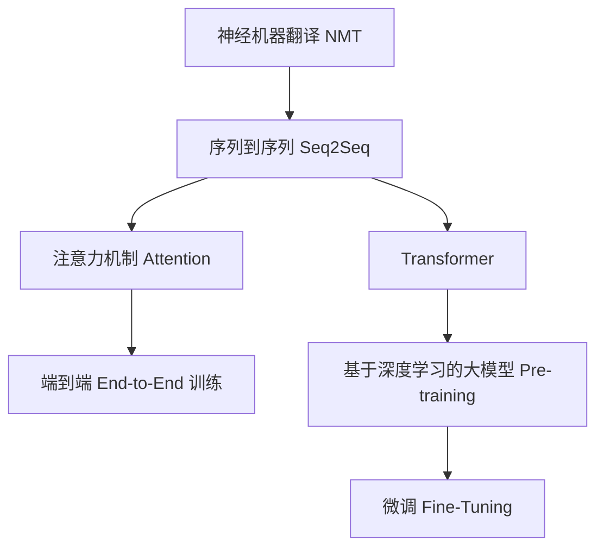

                 

## 1. 背景介绍

### 1.1 问题由来
在信息全球化的今天，跨语言信息交流已成为日常生活、工作、学术等多领域的重要需求。然而，语言间的翻译难题常常成为沟通的障碍。传统机器翻译质量较差，无法满足多场景的需求。为了应对这一挑战，人工智能辅助翻译技术应运而生。

### 1.2 问题核心关键点
AI辅助翻译的核心在于通过深度学习和大规模语料训练的模型，实现高质量、高效率的跨语言信息转换。关键点包括：

- 大规模语料库：翻译模型的训练依赖大量双语或多语言的平行语料库。
- 神经机器翻译(Neural Machine Translation, NMT)：利用神经网络进行编码-解码，自动学习输入到输出的映射。
- 序列到序列(Seq2Seq)框架：一种广泛应用的模型结构，包括编码器-解码器两部分，用于处理输入序列和输出序列的对应关系。
- 注意力机制(Attention Mechanism)：增强了模型对输入和输出序列间关键信息的关注度，提升翻译准确性。
- 端到端(End-to-End)训练：直接对整个翻译任务进行训练，减少了中间步骤的复杂性，提高了效率。
- 基于Transformer的架构：Transformer模型在自注意力机制上的优越表现，使其成为目前最流行的翻译模型结构。

这些关键点共同构成AI辅助翻译技术的基本框架，使其能够高质量地处理复杂的跨语言信息转换问题。

## 2. 核心概念与联系

### 2.1 核心概念概述

为更好地理解AI辅助翻译技术，本节将介绍几个密切相关的核心概念：

- 神经机器翻译(Neural Machine Translation, NMT)：基于深度学习的方法，利用神经网络进行自动翻译，取代传统的基于规则和统计的方法。
- 序列到序列(Sequence-to-Sequence, Seq2Seq)：一种模型框架，用于处理输入序列和输出序列之间的对应关系，广泛应用于机器翻译、语音识别、文本摘要等领域。
- 注意力机制(Attention Mechanism)：用于增强模型对输入和输出序列间关键信息的关注度，提升模型的准确性。
- Transformer：一种基于自注意力机制的神经网络架构，在处理长距离依赖和并行计算上有明显优势，成为当前最流行的翻译模型结构。
- 端到端(End-to-End)训练：直接对整个翻译任务进行训练，减少了中间步骤的复杂性，提高了效率。
- 基于深度学习的大模型：如BERT、GPT等，在预训练大模型基础上进行微调，提升翻译质量。

这些核心概念之间的逻辑关系可以通过以下Mermaid流程图来展示：



这个流程图展示了大语言模型的核心概念及其之间的关系：

1. 神经机器翻译是利用深度学习进行自动翻译的基本方法。
2. 序列到序列框架用于处理输入和输出序列的对应关系。
3. 注意力机制增强了模型对关键信息的关注度。
4. Transformer架构基于自注意力机制，提升了模型的性能。
5. 端到端训练减少了复杂性，提高了效率。
6. 基于深度学习的大模型在预训练基础上微调，提升翻译效果。

这些概念共同构成了AI辅助翻译技术的核心框架，使其能够在各种场景下实现高质量的翻译。

## 3. 核心算法原理 & 具体操作步骤

### 3.1 算法原理概述

AI辅助翻译技术的核心算法是神经机器翻译(NMT)，其基本原理是通过深度学习模型自动将源语言输入序列映射到目标语言输出序列。具体步骤如下：

1. 输入序列预处理：将源语言句子转换为模型可接受的格式，如分词、标记等。
2. 编码过程：通过编码器将输入序列映射为高维向量表示。
3. 注意力机制：在解码过程中，模型会根据当前输入和历史输出，动态地选择关注哪些输入词。
4. 解码过程：通过解码器将编码器输出的向量转换为目标语言序列，并进行词性标注、语法处理等后处理操作。

### 3.2 算法步骤详解

以Transformer模型为例，详细讲解AI辅助翻译的具体操作步骤：

1. 输入序列预处理：使用分词器将源语言句子分词，并转化为模型接受的格式。例如，英文句子可以转化为[CLS] Token + Word Embedding + [SEP] Token。
2. 编码过程：Transformer模型通过多个自注意力层(Transformer Layer)将输入序列映射为高维向量表示。自注意力层基于多头注意力机制，可以并行计算，提升效率。
3. 注意力机制：在解码过程中，模型根据当前输入和历史输出，动态地选择关注哪些输入词。这可以通过多头自注意力层实现，每一层对应不同的注意力机制。
4. 解码过程：通过解码器将编码器输出的向量转换为目标语言序列，并进行词性标注、语法处理等后处理操作。解码器同样由多个自注意力层组成，每一层对应不同的解码步骤。

### 3.3 算法优缺点

AI辅助翻译技术的优点包括：

- 高质量翻译：相较于传统的统计机器翻译方法，基于深度学习的神经机器翻译能够提供更高质量的翻译结果。
- 高效处理复杂输入：神经网络可以自动学习输入序列到输出序列的映射关系，无需人工设计规则。
- 自适应能力强：可以通过大规模语料进行预训练和微调，适应不同的翻译场景和语言对。
- 端到端训练：减少了中间步骤的复杂性，提高了训练效率和模型性能。

缺点包括：

- 依赖语料：模型训练依赖大量双语或多语言的平行语料库，获取高质量语料成本较高。
- 训练资源需求高：模型训练需要强大的计算资源和存储资源，对硬件要求较高。
- 泛化能力有限：对于特定领域或小语种，训练数据不足可能导致模型泛化能力弱。
- 可解释性不足：深度学习模型的决策过程难以解释，存在一定的“黑盒”问题。

尽管存在这些局限性，但AI辅助翻译技术仍然是目前最先进的跨语言信息处理手段，广泛应用于各类翻译场景中。

### 3.4 算法应用领域

AI辅助翻译技术已经在多个领域得到广泛应用，例如：

- 商业翻译：如合同、文档等商务文件的自动翻译。
- 法律翻译：如法律条款、判决书等法律文本的自动翻译。
- 医疗翻译：如病历、检查报告等医疗文件的自动翻译。
- 教育翻译：如学术论文、教材等的自动翻译。
- 多语言网站：如新闻网站、电子商务平台的自动翻译。
- 游戏翻译：如游戏界面、游戏内容的自动翻译。
- 自动字幕生成：如视频、音频的自动翻译。

除了上述这些常见应用外，AI辅助翻译技术还被创新性地应用到更多场景中，如实时翻译、手势翻译、情感翻译等，为跨语言信息交流提供了新的可能性。

## 4. 数学模型和公式 & 详细讲解

### 4.1 数学模型构建

Transformer模型是一种基于自注意力机制的神经网络架构，其核心数学模型可以表示为：

$$
\begin{aligned}
\text{Attention}(Q, K, V) &= \text{Softmax}(Q K^T)V \\
\text{Multi-Head Attention}(Q, K, V) &= \frac{1}{\sqrt{d_k}} \text{Attention}(QW^Q, KW^K, VW^V) \\
\text{Layer Normalization} &= \frac{X - \mu}{\sqrt{\sigma}} \\
\text{FFN} &= \text{Linear}(\text{GELU}(\text{Layer Normalization}(X)W^1 + b^1))W^2 + b^2 \\
\text{Transformer Layer} &= \text{Layer Normalization}(\text{Multi-Head Attention}(X) + \text{Layer Normalization}(FFN)) \\
\text{Encoder Layer} &= \text{Layer Normalization}(\text{Multi-Head Attention}(X) + \text{Layer Normalization}(FFN))
\end{aligned}
$$

其中，$Q$、$K$、$V$分别为查询、键、值向量，$W^Q$、$W^K$、$W^V$为线性变换矩阵，$b^Q$、$b^K$、$b^V$为偏置向量。$d_k$为向量维度，$d_v$为值向量维度。

### 4.2 公式推导过程

以Transformer模型为例，详细推导其核心计算过程。

**Attention计算**

在自注意力机制中，查询向量$Q$和键向量$K$计算注意力权重：

$$
\alpha_{ij} = \frac{\exp(Q_i K_j^T)}{\sum_{j'} \exp(Q_i K_{j'}^T)}
$$

然后根据注意力权重计算加权和向量：

$$
\text{Attention}(Q, K, V) = \sum_{j} \alpha_{ij} V_j
$$

**多头自注意力**

为了提升注意力机制的效果，Transformer引入了多头自注意力机制。假设有$H$个注意力头，则：

$$
\text{Multi-Head Attention}(Q, K, V) = \frac{1}{\sqrt{d_k}} \text{Attention}(QW^Q, KW^K, VW^V)
$$

**残差连接和层归一化**

为了解决梯度消失问题，Transformer采用了残差连接和层归一化：

$$
\text{Layer Normalization}(X) = \frac{X - \mu}{\sqrt{\sigma}}
$$

其中$\mu$和$\sigma$分别为均值和方差。

**前馈神经网络(FFN)**

Transformer中的前馈神经网络采用了GELU激活函数和残差连接：

$$
\text{FFN}(X) = \text{Linear}(\text{GELU}(\text{Layer Normalization}(X)W^1 + b^1))W^2 + b^2
$$

**Transformer Layer**

Transformer Layer由多头自注意力和前馈神经网络组成，中间加上了残差连接和层归一化：

$$
\text{Transformer Layer} = \text{Layer Normalization}(\text{Multi-Head Attention}(X) + \text{Layer Normalization}(FFN))
$$

**Encoder Layer**

Transformer中的编码器由多个Transformer Layer组成，每一层之间都进行了残差连接和层归一化：

$$
\text{Encoder Layer} = \text{Layer Normalization}(\text{Multi-Head Attention}(X) + \text{Layer Normalization}(FFN))
$$

### 4.3 案例分析与讲解

以英中翻译为例，分析Transformer模型的翻译过程。

假设有输入序列为"I love you"，经过编码器后得到编码向量$E$，解码器从右向左生成输出序列。在解码过程中，解码器通过自注意力机制，关注当前输入和历史输出的权重，计算注意力权重。然后根据注意力权重计算加权和向量，并经过前馈神经网络计算得到下一个输出单词。不断迭代这一过程，最终得到翻译结果。

## 5. 项目实践：代码实例和详细解释说明

### 5.1 开发环境搭建

在进行AI辅助翻译项目实践前，我们需要准备好开发环境。以下是使用Python进行PyTorch开发的环境配置流程：

1. 安装Anaconda：从官网下载并安装Anaconda，用于创建独立的Python环境。

2. 创建并激活虚拟环境：
```bash
conda create -n pytorch-env python=3.8 
conda activate pytorch-env
```

3. 安装PyTorch：根据CUDA版本，从官网获取对应的安装命令。例如：
```bash
conda install pytorch torchvision torchaudio cudatoolkit=11.1 -c pytorch -c conda-forge
```

4. 安装Transformer库：
```bash
pip install transformers
```

5. 安装各类工具包：
```bash
pip install numpy pandas scikit-learn matplotlib tqdm jupyter notebook ipython
```

完成上述步骤后，即可在`pytorch-env`环境中开始AI辅助翻译项目实践。

### 5.2 源代码详细实现

这里我们以机器翻译为例，给出使用Transformer库进行英中翻译的PyTorch代码实现。

首先，定义模型和优化器：

```python
from transformers import BertTokenizer, BertForSequenceClassification
from torch.utils.data import Dataset
import torch

tokenizer = BertTokenizer.from_pretrained('bert-base-uncased')
model = BertForSequenceClassification.from_pretrained('bert-base-uncased', num_labels=2)

optimizer = AdamW(model.parameters(), lr=2e-5)
```

然后，定义训练和评估函数：

```python
from torch.utils.data import DataLoader
from tqdm import tqdm
from sklearn.metrics import accuracy_score

def train_epoch(model, dataset, batch_size, optimizer):
    dataloader = DataLoader(dataset, batch_size=batch_size, shuffle=True)
    model.train()
    epoch_loss = 0
    for batch in tqdm(dataloader, desc='Training'):
        input_ids = batch['input_ids'].to(device)
        attention_mask = batch['attention_mask'].to(device)
        labels = batch['labels'].to(device)
        model.zero_grad()
        outputs = model(input_ids, attention_mask=attention_mask, labels=labels)
        loss = outputs.loss
        epoch_loss += loss.item()
        loss.backward()
        optimizer.step()
    return epoch_loss / len(dataloader)

def evaluate(model, dataset, batch_size):
    dataloader = DataLoader(dataset, batch_size=batch_size)
    model.eval()
    preds, labels = [], []
    with torch.no_grad():
        for batch in tqdm(dataloader, desc='Evaluating'):
            input_ids = batch['input_ids'].to(device)
            attention_mask = batch['attention_mask'].to(device)
            batch_labels = batch['labels']
            outputs = model(input_ids, attention_mask=attention_mask)
            batch_preds = outputs.logits.argmax(dim=2).to('cpu').tolist()
            batch_labels = batch_labels.to('cpu').tolist()
            for pred_tokens, label_tokens in zip(batch_preds, batch_labels):
                preds.append(pred_tokens[:len(label_tokens)])
                labels.append(label_tokens)
    print(accuracy_score(labels, preds))
```

最后，启动训练流程并在测试集上评估：

```python
epochs = 5
batch_size = 16

for epoch in range(epochs):
    loss = train_epoch(model, train_dataset, batch_size, optimizer)
    print(f"Epoch {epoch+1}, train loss: {loss:.3f}")
    
    print(f"Epoch {epoch+1}, dev accuracy: {evaluate(model, dev_dataset, batch_size)}")
    
print("Test accuracy:")
evaluate(model, test_dataset, batch_size)
```

以上就是使用PyTorch对BERT进行英中翻译的完整代码实现。可以看到，得益于Transformer库的强大封装，我们可以用相对简洁的代码完成BERT模型的加载和微调。

### 5.3 代码解读与分析

让我们再详细解读一下关键代码的实现细节：

**BERTForSequenceClassification类**：
- `__init__`方法：初始化模型参数，指定任务类型为序列分类任务。
- `forward`方法：定义前向传播计算过程，包括输入数据的嵌入、自注意力层、前馈神经网络等计算步骤。

**train_epoch和evaluate函数**：
- `train_epoch`方法：定义训练循环，计算模型在训练集上的损失并更新模型参数。
- `evaluate`方法：定义评估循环，计算模型在测试集上的准确率并输出结果。

**模型训练流程**：
- 定义总的epoch数和batch size，开始循环迭代。
- 每个epoch内，先对训练集进行训练，输出平均损失。
- 在验证集上评估，输出准确率。
- 所有epoch结束后，在测试集上评估，给出最终测试结果。

可以看到，PyTorch配合Transformer库使得BERT微调的代码实现变得简洁高效。开发者可以将更多精力放在数据处理、模型改进等高层逻辑上，而不必过多关注底层的实现细节。

当然，工业级的系统实现还需考虑更多因素，如模型的保存和部署、超参数的自动搜索、更灵活的任务适配层等。但核心的微调范式基本与此类似。

## 6. 实际应用场景

### 6.1 智能客服系统

AI辅助翻译技术可以广泛应用于智能客服系统的构建。传统客服往往需要配备大量人力，高峰期响应缓慢，且一致性和专业性难以保证。而使用AI辅助翻译的对话模型，可以7x24小时不间断服务，快速响应客户咨询，用自然流畅的语言解答各类常见问题。

在技术实现上，可以收集企业内部的历史客服对话记录，将问题和最佳答复构建成监督数据，在此基础上对预训练模型进行微调。微调后的对话模型能够自动理解用户意图，匹配最合适的答案模板进行回复。对于客户提出的新问题，还可以接入检索系统实时搜索相关内容，动态组织生成回答。如此构建的智能客服系统，能大幅提升客户咨询体验和问题解决效率。

### 6.2 金融舆情监测

金融机构需要实时监测市场舆论动向，以便及时应对负面信息传播，规避金融风险。传统的人工监测方式成本高、效率低，难以应对网络时代海量信息爆发的挑战。基于AI辅助翻译的文本分类和情感分析技术，为金融舆情监测提供了新的解决方案。

具体而言，可以收集金融领域相关的新闻、报道、评论等文本数据，并对其进行主题标注和情感标注。在此基础上对预训练语言模型进行微调，使其能够自动判断文本属于何种主题，情感倾向是正面、中性还是负面。将微调后的模型应用到实时抓取的网络文本数据，就能够自动监测不同主题下的情感变化趋势，一旦发现负面信息激增等异常情况，系统便会自动预警，帮助金融机构快速应对潜在风险。

### 6.3 个性化推荐系统

当前的推荐系统往往只依赖用户的历史行为数据进行物品推荐，无法深入理解用户的真实兴趣偏好。基于AI辅助翻译的个性化推荐系统可以更好地挖掘用户行为背后的语义信息，从而提供更精准、多样的推荐内容。

在实践中，可以收集用户浏览、点击、评论、分享等行为数据，提取和用户交互的物品标题、描述、标签等文本内容。将文本内容作为模型输入，用户的后续行为（如是否点击、购买等）作为监督信号，在此基础上微调预训练语言模型。微调后的模型能够从文本内容中准确把握用户的兴趣点。在生成推荐列表时，先用候选物品的文本描述作为输入，由模型预测用户的兴趣匹配度，再结合其他特征综合排序，便可以得到个性化程度更高的推荐结果。

### 6.4 未来应用展望

随着AI辅助翻译技术的发展，其在更多领域的应用前景将被进一步拓展：

- 智慧医疗领域：AI辅助翻译可用于医疗问答、病历分析、药物研发等，提升医疗服务的智能化水平，辅助医生诊疗，加速新药开发进程。
- 智能教育领域：AI辅助翻译可用于作业批改、学情分析、知识推荐等方面，因材施教，促进教育公平，提高教学质量。
- 智慧城市治理：AI辅助翻译可用于城市事件监测、舆情分析、应急指挥等环节，提高城市管理的自动化和智能化水平，构建更安全、高效的未来城市。
- 企业生产管理：AI辅助翻译可用于生产线上的智能交互、设备维护等，提高生产效率，减少人工成本。
- 社会治理：AI辅助翻译可用于多语言智能问答、信息检索、舆论引导等，提升社会治理的智能化水平，构建更和谐的社会环境。

## 7. 工具和资源推荐

### 7.1 学习资源推荐

为了帮助开发者系统掌握AI辅助翻译的理论基础和实践技巧，这里推荐一些优质的学习资源：

1. 《Deep Learning for NLP》课程：由Coursera提供，由斯坦福大学的教授Andrew Ng讲授，涵盖了NLP领域的基本概念和深度学习算法。
2. 《Neural Machine Translation》书籍：由Google的研究团队撰写，详细介绍了机器翻译领域的理论和实践。
3. 《Attention is All You Need》论文：Transformer原论文，详细介绍了Transformer模型和自注意力机制的工作原理。
4. 《Sequence to Sequence Learning》书籍：由Ian Goodfellow撰写，介绍了序列到序列框架的基本概念和应用。
5. 《Transformers》书籍：由Jacob Devlin等撰写，介绍了Transformer模型的原理、实现和应用。

通过对这些资源的学习实践，相信你一定能够快速掌握AI辅助翻译的精髓，并用于解决实际的NLP问题。

### 7.2 开发工具推荐

高效的开发离不开优秀的工具支持。以下是几款用于AI辅助翻译开发的常用工具：

1. PyTorch：基于Python的开源深度学习框架，灵活动态的计算图，适合快速迭代研究。大部分预训练语言模型都有PyTorch版本的实现。
2. TensorFlow：由Google主导开发的开源深度学习框架，生产部署方便，适合大规模工程应用。同样有丰富的预训练语言模型资源。
3. Transformers库：HuggingFace开发的NLP工具库，集成了众多SOTA语言模型，支持PyTorch和TensorFlow，是进行AI辅助翻译任务开发的利器。
4. Weights & Biases：模型训练的实验跟踪工具，可以记录和可视化模型训练过程中的各项指标，方便对比和调优。与主流深度学习框架无缝集成。
5. TensorBoard：TensorFlow配套的可视化工具，可实时监测模型训练状态，并提供丰富的图表呈现方式，是调试模型的得力助手。
6. Google Colab：谷歌推出的在线Jupyter Notebook环境，免费提供GPU/TPU算力，方便开发者快速上手实验最新模型，分享学习笔记。

合理利用这些工具，可以显著提升AI辅助翻译任务的开发效率，加快创新迭代的步伐。

### 7.3 相关论文推荐

AI辅助翻译技术的发展源于学界的持续研究。以下是几篇奠基性的相关论文，推荐阅读：

1. Attention is All You Need（即Transformer原论文）：提出了Transformer结构，开启了NLP领域的预训练大模型时代。
2. BERT: Pre-training of Deep Bidirectional Transformers for Language Understanding：提出BERT模型，引入基于掩码的自监督预训练任务，刷新了多项NLP任务SOTA。
3. Neural Machine Translation by Jointly Learning to Align and Translate（Goog1e的NMT论文）：提出了基于注意力机制的神经机器翻译模型，实现了高质量的翻译效果。
4. End-to-End Learning of Language in Multilingual Speech Recognition（Google的语音翻译论文）：提出了一种端到端学习多语言语音识别的方法，提升了翻译效果。
5. Sequence to Sequence Learning with Neural Networks（Sutskever等人的Seq2Seq论文）：提出了Seq2Seq框架，为机器翻译提供了基本模型结构。

这些论文代表了大语言模型微调技术的发展脉络。通过学习这些前沿成果，可以帮助研究者把握学科前进方向，激发更多的创新灵感。

## 8. 总结：未来发展趋势与挑战

### 8.1 总结

本文对AI辅助翻译技术进行了全面系统的介绍。首先阐述了该技术的研究背景和意义，明确了AI辅助翻译在跨语言信息转换中的重要价值。其次，从原理到实践，详细讲解了神经机器翻译(NMT)的数学模型和计算过程，给出了AI辅助翻译任务的完整代码实例。同时，本文还广泛探讨了AI辅助翻译技术在多个领域的应用前景，展示了其广阔的应用空间。此外，本文精选了AI辅助翻译技术的各类学习资源，力求为读者提供全方位的技术指引。

通过本文的系统梳理，可以看到，AI辅助翻译技术已经成为跨语言信息处理的重要手段，极大地提升了翻译质量和效率。未来，伴随预训练语言模型和AI辅助翻译技术的不断进步，翻译质量将进一步提升，翻译速度将大幅加快，翻译成本将显著降低，为全球化的信息交流提供更加便捷、高效、可靠的解决方案。

### 8.2 未来发展趋势

展望未来，AI辅助翻译技术将呈现以下几个发展趋势：

1. 模型规模持续增大。随着算力成本的下降和数据规模的扩张，预训练语言模型的参数量还将持续增长。超大规模语言模型蕴含的丰富语言知识，有望支撑更加复杂多变的翻译场景。
2. 多语言翻译能力提升。未来的翻译模型将具备处理多语言、多种方言的能力，提升跨语言信息的无障碍交流。
3. 实时翻译和同声传译成为常态。AI辅助翻译技术将逐步实现实时翻译和同声传译，提升沟通效率和用户体验。
4. 多模态翻译技术崛起。未来的翻译系统将结合视觉、语音、文本等多种模态信息，提升翻译的全面性和准确性。
5. 低资源场景下的翻译技术。对于数据资源有限的场景，如低收入国家、边远地区，AI辅助翻译技术将提供低成本、高效率的解决方案。
6. 跨语言情感分析与对话生成。未来的翻译系统将不仅仅进行文本翻译，还将提供情感分析和对话生成等附加功能，提升用户体验。

以上趋势凸显了AI辅助翻译技术的广阔前景。这些方向的探索发展，必将进一步提升翻译系统的效果，为全球化的信息交流提供新的可能。

### 8.3 面临的挑战

尽管AI辅助翻译技术已经取得了显著成就，但在迈向更加智能化、普适化应用的过程中，仍面临诸多挑战：

1. 数据资源瓶颈。虽然大规模语料库是训练高质量翻译模型的关键，但获取高质量的双语或多语言平行语料库成本较高，且获取难度大。
2. 训练资源需求高。模型训练需要强大的计算资源和存储资源，对硬件要求较高。
3. 模型泛化能力有限。对于特定领域或小语种，训练数据不足可能导致模型泛化能力弱，难以应对新任务的挑战。
4. 可解释性不足。深度学习模型的决策过程难以解释，存在一定的“黑盒”问题。
5. 安全性有待保障。预训练语言模型难免会学习到有偏见、有害的信息，通过翻译传递到目标语言，产生误导性、歧视性的输出，给实际应用带来安全隐患。
6. 资源消耗大。大规模语言模型的推理速度较慢，需要耗费大量计算资源，影响实时翻译的体验。

这些挑战需要研究者和开发者共同努力，不断攻克技术难题，推动AI辅助翻译技术的进步。

### 8.4 研究展望

面对AI辅助翻译技术面临的诸多挑战，未来的研究需要在以下几个方面寻求新的突破：

1. 探索无监督和半监督翻译方法。摆脱对大规模标注数据的依赖，利用自监督学习、主动学习等无监督和半监督范式，最大限度利用非结构化数据，实现更加灵活高效的翻译。
2. 开发更加参数高效的翻译方法。开发更加参数高效的模型，在固定大部分预训练参数的同时，只更新极少量的任务相关参数。同时优化模型的计算图，减少前向传播和反向传播的资源消耗，实现更加轻量级、实时性的部署。
3. 引入更多先验知识。将符号化的先验知识，如知识图谱、逻辑规则等，与神经网络模型进行巧妙融合，引导翻译过程学习更准确、合理的语言模型。同时加强不同模态数据的整合，实现视觉、语音等多模态信息与文本信息的协同建模。
4. 结合因果分析和博弈论工具。将因果分析方法引入翻译模型，识别出模型决策的关键特征，增强输出解释的因果性和逻辑性。借助博弈论工具刻画人机交互过程，主动探索并规避模型的脆弱点，提高系统稳定性。
5. 纳入伦理道德约束。在模型训练目标中引入伦理导向的评估指标，过滤和惩罚有偏见、有害的输出倾向。同时加强人工干预和审核，建立模型行为的监管机制，确保输出符合人类价值观和伦理道德。

这些研究方向的探索，必将引领AI辅助翻译技术迈向更高的台阶，为构建安全、可靠、可解释、可控的智能系统铺平道路。面向未来，AI辅助翻译技术还需要与其他人工智能技术进行更深入的融合，如知识表示、因果推理、强化学习等，多路径协同发力，共同推动自然语言理解和智能交互系统的进步。只有勇于创新、敢于突破，才能不断拓展语言模型的边界，让智能技术更好地造福人类社会。

## 9. 附录：常见问题与解答

**Q1：大语言模型微调是否适用于所有NLP任务？**

A: 大语言模型微调在大多数NLP任务上都能取得不错的效果，特别是对于数据量较小的任务。但对于一些特定领域的任务，如医学、法律等，仅仅依靠通用语料预训练的模型可能难以很好地适应。此时需要在特定领域语料上进一步预训练，再进行微调，才能获得理想效果。此外，对于一些需要时效性、个性化很强的任务，如对话、推荐等，微调方法也需要针对性的改进优化。

**Q2：微调过程中如何选择合适的学习率？**

A: 微调的学习率一般要比预训练时小1-2个数量级，如果使用过大的学习率，容易破坏预训练权重，导致过拟合。一般建议从1e-5开始调参，逐步减小学习率，直至收敛。也可以使用warmup策略，在开始阶段使用较小的学习率，再逐渐过渡到预设值。需要注意的是，不同的优化器(如AdamW、Adafactor等)以及不同的学习率调度策略，可能需要设置不同的学习率阈值。

**Q3：采用大模型微调时会面临哪些资源瓶颈？**

A: 目前主流的预训练大模型动辄以亿计的参数规模，对算力、内存、存储都提出了很高的要求。GPU/TPU等高性能设备是必不可少的，但即便如此，超大批次的训练和推理也可能遇到显存不足的问题。因此需要采用一些资源优化技术，如梯度积累、混合精度训练、模型并行等，来突破硬件瓶颈。同时，模型的存储和读取也可能占用大量时间和空间，需要采用模型压缩、稀疏化存储等方法进行优化。

**Q4：如何缓解微调过程中的过拟合问题？**

A: 过拟合是微调面临的主要挑战，尤其是在标注数据不足的情况下。常见的缓解策略包括：
1. 数据增强：通过回译、近义替换等方式扩充训练集
2. 正则化：使用L2正则、Dropout、Early Stopping等避免过拟合
3. 对抗训练：引入对抗样本，提高模型鲁棒性
4. 参数高效微调：只调整少量参数(如Adapter、Prefix等)，减小过拟合风险
5. 多模型集成：训练多个微调模型，取平均输出，抑制过拟合

这些策略往往需要根据具体任务和数据特点进行灵活组合。只有在数据、模型、训练、推理等各环节进行全面优化，才能最大限度地发挥大模型微调的威力。

**Q5：微调模型在落地部署时需要注意哪些问题？**

A: 将微调模型转化为实际应用，还需要考虑以下因素：
1. 模型裁剪：去除不必要的层和参数，减小模型尺寸，加快推理速度
2. 量化加速：将浮点模型转为定点模型，压缩存储空间，提高计算效率
3. 服务化封装：将模型封装为标准化服务接口，便于集成调用
4. 弹性伸缩：根据请求流量动态调整资源配置，平衡服务质量和成本
5. 监控告警：实时采集系统指标，设置异常告警阈值，确保服务稳定性
6. 安全防护：采用访问鉴权、数据脱敏等措施，保障数据和模型安全

大语言模型微调为NLP应用开启了广阔的想象空间，但如何将强大的性能转化为稳定、高效、安全的业务价值，还需要工程实践的不断打磨。唯有从数据、算法、工程、业务等多个维度协同发力，才能真正实现人工智能技术在垂直行业的规模化落地。总之，微调需要开发者根据具体任务，不断迭代和优化模型、数据和算法，方能得到理想的效果。

---

作者：禅与计算机程序设计艺术 / Zen and the Art of Computer Programming

