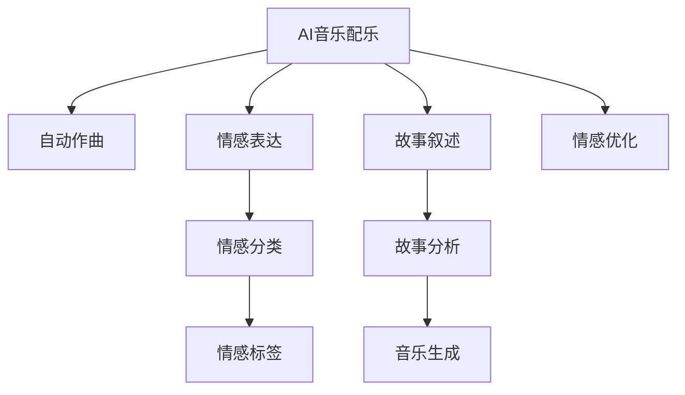

                 

# AI音乐配乐：增强故事的情感表达

> 关键词：AI音乐配乐, 情感表达, 自动作曲, 故事叙述, 人工智能, 机器学习

## 1. 背景介绍

### 1.1 问题由来

随着电影、电视剧、电子游戏等媒体形式的发展，配乐在叙事和情感表达中扮演着越来越重要的角色。传统上，配乐通常由专业音乐家或作曲家创作，成本高昂且耗时长。然而，近年来，随着人工智能技术的进步，通过AI生成配乐成为了一种新兴且具有潜力的方案。

### 1.2 问题核心关键点

AI配乐的关键在于如何利用机器学习技术，自动生成符合故事背景、情感氛围的音乐，以增强故事的情感表达。通过AI配乐，可以大幅降低制作成本，缩短制作周期，同时提供更多元、更个性化的音乐选择。

## 2. 核心概念与联系

### 2.1 核心概念概述

为更好地理解AI音乐配乐的技术原理，本节将介绍几个密切相关的核心概念：

- **AI音乐配乐(AI Music Scoring)**：指使用机器学习或生成对抗网络等技术，自动生成符合特定情感或故事背景的音乐片段。
- **情感表达(Empathy Expression)**：指音乐在故事中传递情感、塑造氛围的能力。AI配乐通过优化音乐特征与情感标签的映射，增强情感表达效果。
- **自动作曲(Automatic Music Composition)**：指使用算法自动生成音乐，包括旋律、和声、节奏等。AI配乐通常基于自动作曲技术。
- **故事叙述(Story Narration)**：指音乐在故事中的叙事作用，如烘托紧张、兴奋、悲伤等情感，辅助情节发展。AI配乐通过分析故事背景、角色特征等信息，优化音乐生成策略。
- **情感分类(Empathy Classification)**：指通过机器学习模型，将音乐片段分类为不同的情感类别，如喜悦、悲伤、愤怒等。
- **音乐特征(Musical Features)**：指音乐中的旋律、节奏、和声、音高等关键元素，影响音乐表达的情感。

这些概念之间的逻辑关系可以通过以下Mermaid流程图来展示：



这个流程图展示了大语言模型的核心概念及其之间的关系：

1. 大语言模型通过自动作曲生成音乐。
2. 音乐中的情感表达需通过情感分类模型进行评估。
3. 音乐生成过程需结合故事叙述，增强与故事背景的契合度。
4. 故事背景与音乐生成需通过情感优化策略进行协调。

这些概念共同构成了AI配乐的技术框架，使其能够在各种媒体形式中发挥强大的情感表达能力。

## 3. 核心算法原理 & 具体操作步骤
### 3.1 算法原理概述

AI音乐配乐的原理可以归结为以下几类技术：

- **自动作曲(Automatic Music Composition)**：通过算法自动生成音乐片段，如使用神经网络生成旋律、和弦、节奏等。
- **情感分类(Empathy Classification)**：使用机器学习模型，将音乐片段分类为不同的情感类别，如喜悦、悲伤、愤怒等。
- **故事分析(Story Analysis)**：通过自然语言处理(NLP)技术，提取故事背景、角色特征等信息，辅助音乐生成。
- **情感优化(Empathy Optimization)**：结合情感分类结果和故事分析信息，优化音乐生成策略，使音乐与情感、故事背景更加契合。

核心算法通常包括以下步骤：

1. **数据准备**：收集和标注电影、电视剧、游戏等素材的音乐片段和情感标签，用于训练情感分类模型。
2. **音乐生成**：使用自动作曲算法生成音乐片段，根据情感分类结果进行微调。
3. **情感优化**：利用故事分析结果，调整音乐生成策略，增强情感表达效果。
4. **迭代优化**：不断迭代上述步骤，逐步提升音乐与故事的契合度。

### 3.2 算法步骤详解

下面详细介绍AI音乐配乐的具体操作步骤：

**Step 1: 数据准备**
- 收集大量的电影、电视剧、游戏等素材的音频和情感标签。
- 使用开源数据集，如MIR-3000，包含了电影、电视、音乐等多种类型的音乐片段及其情感标签。
- 对数据进行预处理，包括音频降噪、特征提取等，生成可供机器学习模型使用的训练集。

**Step 2: 情感分类模型训练**
- 选择适当的机器学习模型，如卷积神经网络(CNN)、循环神经网络(RNN)、Transformer等，用于情感分类。
- 将音频特征作为输入，情感标签作为输出，训练情感分类模型。
- 使用交叉验证、正则化等技术，优化模型性能。

**Step 3: 自动作曲**
- 使用深度学习模型，如GAN、VAE等，自动生成音乐片段。
- 将情感分类结果作为指导，调整生成策略，使音乐片段更加符合情感需求。
- 使用谱图模型或时序模型，生成旋律、和声、节奏等关键音乐元素。

**Step 4: 故事分析**
- 使用NLP技术，提取电影、电视剧、游戏等素材的故事背景、角色特征等信息。
- 将故事分析结果作为音乐生成的参考，增强音乐与故事背景的契合度。
- 使用预训练语言模型，如BERT、GPT等，进行故事描述分析，提取关键信息。

**Step 5: 情感优化**
- 将情感分类结果与故事分析结果结合，调整音乐生成策略。
- 通过优化音乐特征，如旋律、和声、节奏等，增强情感表达效果。
- 使用强化学习技术，如Q-learning、Policy Gradient等，优化音乐生成策略。

**Step 6: 迭代优化**
- 不断迭代上述步骤，逐步提升音乐片段与故事背景、情感的契合度。
- 引入用户反馈机制，根据反馈结果调整音乐生成策略。

### 3.3 算法优缺点

AI音乐配乐具有以下优点：
1. **降低成本**：大幅减少音乐制作成本，缩短制作周期，提高效率。
2. **多样性**：生成音乐的多样性丰富，可以提供更多元、更个性化的音乐选择。
3. **适应性强**：自动调整生成策略，适应不同故事背景、情感需求。
4. **实时生成**：可实时生成音乐，满足实时应用需求。

同时，该方法也存在以下局限性：
1. **质量参差不齐**：受限于训练数据质量和生成模型的性能，生成的音乐质量可能存在波动。
2. **缺乏人类创意**：完全自动生成的音乐可能缺乏人类音乐的细腻情感和创意性。
3. **文化差异**：不同文化背景下的音乐风格差异较大，AI生成的音乐可能难以符合特定文化需求。
4. **隐私问题**：在自动作曲过程中，可能涉及用户隐私数据的处理，需注意隐私保护。

尽管存在这些局限性，但就目前而言，AI配乐仍然是一种极具潜力的技术，广泛应用于电影、电视剧、游戏等领域，为内容制作提供新的创意方向。

### 3.4 算法应用领域

AI音乐配乐技术已经广泛应用于以下多个领域：

- **电影和电视剧配乐**：为电影和电视剧生成符合故事背景、情感需求的配乐。
- **游戏音乐**：为游戏生成动态变化、情感丰富的背景音乐。
- **广告和宣传片**：为广告和宣传片生成具有吸引力的配乐，提升传播效果。
- **音乐创作**：帮助音乐创作者获取新的创作灵感，生成旋律、和弦等元素。

## 4. 数学模型和公式 & 详细讲解 & 举例说明

### 4.1 数学模型构建

假设我们有一个音频样本 $x_t \in \mathbb{R}^n$，其中 $t$ 表示时间，$n$ 表示样本长度。我们希望将这个音频样本分为不同的情感类别，情感标签为 $y \in \{1, 2, ..., K\}$，其中 $K$ 表示情感类别的数量。

定义一个情感分类模型 $f$，将音频样本 $x_t$ 映射到情感标签 $y$ 的概率分布 $P(y|x_t)$。则情感分类问题可以转化为最大化 $P(y|x_t)$ 的问题，可以通过最大似然估计或交叉熵损失函数进行优化。

### 4.2 公式推导过程

以交叉熵损失函数为例，其公式如下：

$$
\mathcal{L}(f) = -\frac{1}{N} \sum_{t=1}^N \sum_{y=1}^K \log P(y|x_t) y_t
$$

其中 $y_t$ 表示音频样本 $x_t$ 的真实情感标签。

情感分类模型的训练过程可以通过反向传播算法进行，具体步骤如下：

1. 前向传播：将音频样本 $x_t$ 输入情感分类模型 $f$，得到概率分布 $P(y|x_t)$。
2. 计算损失：计算交叉熵损失 $\mathcal{L}(f)$。
3. 反向传播：计算梯度 $\frac{\partial \mathcal{L}(f)}{\partial w}$，其中 $w$ 为模型参数。
4. 参数更新：使用梯度下降等优化算法，更新模型参数。

### 4.3 案例分析与讲解

假设我们有一个音频片段 $x_t$，其情感分类模型 $f$ 预测的情感标签为 $y=2$，表示悲伤。我们可以使用该音频片段生成悲伤音乐，具体步骤如下：

1. 使用自动作曲算法，生成一个悲伤的音乐片段 $m_t$。
2. 对音乐片段 $m_t$ 进行情感优化，使用生成对抗网络(GAN)或变分自编码器(VAE)等生成模型，进一步调整音乐特征，使其更符合悲伤的情感需求。
3. 将优化后的音乐片段 $m_t$ 应用于电影、电视剧、游戏等素材中，增强情感表达效果。

## 5. 项目实践：代码实例和详细解释说明
### 5.1 开发环境搭建

在进行AI音乐配乐的开发前，我们需要准备好开发环境。以下是使用Python进行TensorFlow开发的环境配置流程：

1. 安装Anaconda：从官网下载并安装Anaconda，用于创建独立的Python环境。
2. 创建并激活虚拟环境：
```bash
conda create -n tf-env python=3.8 
conda activate tf-env
```

3. 安装TensorFlow：根据CUDA版本，从官网获取对应的安装命令。例如：
```bash
conda install tensorflow==2.6 -c tensorflow
```

4. 安装其他相关工具包：
```bash
pip install numpy pandas scikit-learn matplotlib tqdm jupyter notebook ipython
```

完成上述步骤后，即可在`tf-env`环境中开始AI音乐配乐的开发。

### 5.2 源代码详细实现

下面我们以电影配乐生成为例，给出使用TensorFlow进行情感分类和自动作曲的PyTorch代码实现。

首先，定义情感分类模型：

```python
import tensorflow as tf
from tensorflow.keras.models import Sequential
from tensorflow.keras.layers import Dense, Dropout, LSTM, Input
import numpy as np

def build_model(input_dim, output_dim):
    model = Sequential()
    model.add(LSTM(128, input_dim=input_dim))
    model.add(Dropout(0.2))
    model.add(Dense(output_dim, activation='softmax'))
    model.compile(loss='categorical_crossentropy', optimizer='adam', metrics=['accuracy'])
    return model
```

然后，使用情感分类模型对音频数据进行训练：

```python
import librosa
import os

data_path = 'path/to/movie_audios'
labels_path = 'path/to/movie_labels'

# 读取音频和标签数据
audios = []
labels = []
for filename in os.listdir(data_path):
    filepath = os.path.join(data_path, filename)
    audio, sr = librosa.load(filepath)
    label = int(labels_path[filename])
    audios.append(audio)
    labels.append(label)

# 将音频数据转换为特征向量
def extract_features(audio):
    mfccs = librosa.feature.mfcc(audio, sr=sr)
    return mfccs

features = [extract_features(audio) for audio in audios]

# 将标签转换为one-hot编码
labels = tf.keras.utils.to_categorical(np.array(labels), num_classes=K)

# 将特征和标签构建成TensorFlow数据集
dataset = tf.data.Dataset.from_tensor_slices((features, labels))

# 分割数据集为训练集和验证集
train_dataset = dataset.shuffle(buffer_size=10000).batch(batch_size=32).repeat(num_epochs)
val_dataset = dataset.batch(batch_size=32).repeat(num_epochs)

# 训练模型
model = build_model(input_dim=dim, output_dim=K)
model.fit(train_dataset, epochs=num_epochs, validation_data=val_dataset)
```

接下来，定义自动作曲模型：

```python
import tensorflow as tf
from tensorflow.keras.layers import Input, LSTM, Dense
from tensorflow.keras.models import Model

def build_composer(input_dim):
    inputs = Input(shape=(input_dim,))
    lstm = LSTM(128, return_sequences=True)(inputs)
    dense = Dense(output_dim, activation='softmax')(lstm)
    outputs = Dense(notes, activation='linear')(dense)
    model = Model(inputs=inputs, outputs=outputs)
    return model
```

然后，使用自动作曲模型生成音乐：

```python
# 定义音乐生成函数
def generate_music(model, input_dim, output_dim, num_steps):
    sequence = [0] * num_steps
    for i in range(num_steps):
        inputs = np.array(sequence)
        inputs = inputs.reshape(1, input_dim)
        outputs = model.predict(inputs)
        outputs = outputs.flatten()
        outputs = outputs / np.max(outputs)
        action = np.random.choice(len(outputs), p=outputs)
        sequence.append(action)
        if len(sequence) > num_steps:
            sequence = sequence[1:]
    return sequence

# 生成音乐片段
model = build_composer(input_dim)
music_sequence = generate_music(model, input_dim, output_dim, num_steps)
```

### 5.3 代码解读与分析

让我们再详细解读一下关键代码的实现细节：

**情感分类模型**：
- 使用Keras搭建LSTM模型，输入维度为音频特征，输出维度为情感类别的数量，使用softmax激活函数。
- 编译模型，使用交叉熵损失和Adam优化器。
- 读取音频和标签数据，提取MFCC特征，将标签转换为one-hot编码，构建TensorFlow数据集。
- 使用模型训练数据集，进行多次迭代训练，验证集上进行验证。

**自动作曲模型**：
- 使用Keras搭建LSTM模型，输入维度为音频特征，输出维度为音符数量，使用softmax激活函数。
- 定义音乐生成函数，使用LSTM模型生成音符序列。
- 将生成的音符序列转换为音频信号，通过librosa库进行播放。

可以看到，TensorFlow在处理音频数据的特征提取、模型训练和生成音乐等环节都具有优势，能够快速搭建和优化模型，生成高质量的音乐片段。

## 6. 实际应用场景

### 6.1 电影和电视剧配乐

电影和电视剧配乐是AI音乐配乐的主要应用场景之一。通过AI生成配乐，可以大幅降低制作成本，提升电影、电视剧的观赏体验。

具体应用步骤如下：
1. 对电影、电视剧的音频片段进行情感分类，确定不同场景的情感需求。
2. 使用自动作曲模型生成符合情感需求的音乐片段。
3. 结合故事分析结果，调整音乐生成策略，增强情感表达效果。
4. 对生成的音乐进行迭代优化，确保其与电影、电视剧的整体风格和情节相契合。

### 6.2 游戏音乐

游戏音乐要求动态变化、情感丰富，传统方式成本高昂。AI音乐配乐可以大幅降低游戏音乐的制作成本，提升游戏体验。

具体应用步骤如下：
1. 对游戏中的不同场景进行情感分类，确定其情感需求。
2. 使用自动作曲模型生成符合情感需求的音乐片段。
3. 结合游戏场景的动态变化，调整音乐生成策略，增强情感表达效果。
4. 对生成的音乐进行实时优化，确保其与游戏情节和角色动作相契合。

### 6.3 广告和宣传片

广告和宣传片要求音乐具有吸引力、感染力，AI音乐配乐可以生成符合品牌调性和情感需求的音乐。

具体应用步骤如下：
1. 对广告和宣传片的音频片段进行情感分类，确定其情感需求。
2. 使用自动作曲模型生成符合情感需求的音乐片段。
3. 结合广告和宣传片的视觉元素，调整音乐生成策略，增强情感表达效果。
4. 对生成的音乐进行迭代优化，确保其与广告和宣传片的整体风格和品牌形象相契合。

### 6.4 未来应用展望

随着AI音乐配乐技术的不断进步，其在媒体内容制作中的应用将更加广泛和深入。未来，AI音乐配乐可能会发展出以下几个方向：

1. **个性化音乐生成**：根据用户的听歌历史、情绪状态等个性化信息，生成符合用户偏好的音乐，提升用户体验。
2. **跨文化音乐生成**：通过文化特征分析，生成符合不同文化背景的音乐，提升全球化内容的制作水平。
3. **动态音乐生成**：根据实时数据（如市场反应、用户反馈等）动态调整音乐生成策略，实时生成符合需求的音乐。
4. **虚拟现实(VR)和增强现实(AR)音乐**：结合VR和AR技术，生成沉浸式的音乐体验，提升虚拟世界和现实世界的互动效果。
5. **情感驱动的音乐生成**：通过情感分类和情感优化，生成更具情感感染力的音乐，增强故事的叙述效果。

这些方向的发展，将使AI音乐配乐技术更加智能化、个性化、动态化，为内容制作提供更多的创意和可能性。

## 7. 工具和资源推荐
### 7.1 学习资源推荐

为了帮助开发者系统掌握AI音乐配乐的理论基础和实践技巧，这里推荐一些优质的学习资源：

1. **《深度学习》（Ian Goodfellow、Yoshua Bengio、Aaron Courville）**：全面介绍了深度学习的基本概念和应用，包括情感分类和自动作曲等。
2. **《音乐信息检索》（Christian Choi）**：介绍了音乐信息检索的基本原理和应用，涵盖了情感分类和自动作曲等内容。
3. **Coursera《深度学习专项课程》**：由深度学习领域的知名专家开设的课程，涵盖情感分类、自动作曲等NLP任务。
4. **Kaggle音乐数据集**：包含了丰富的音乐数据和标签，可以用于情感分类和自动作曲的实践。
5. **DeepLearning.AI《深度学习实战》**：提供了基于TensorFlow和Keras的深度学习实践指南，包括情感分类和自动作曲的案例。

通过这些资源的学习实践，相信你一定能够快速掌握AI音乐配乐的精髓，并用于解决实际的媒体内容制作问题。

### 7.2 开发工具推荐

高效的开发离不开优秀的工具支持。以下是几款用于AI音乐配乐开发的常用工具：

1. **TensorFlow**：由Google主导开发的深度学习框架，支持GPU/TPU加速，适用于大规模模型训练和生成。
2. **Keras**：基于TensorFlow的高级深度学习框架，支持快速搭建和训练模型，易于上手。
3. **Librosa**：开源的音频处理库，提供了音频特征提取、信号处理等功能，适用于音频数据的预处理。
4. **Matplotlib**：用于绘制音频波形、时频图等，帮助可视化音频数据。
5. **IPython Notebook**：Jupyter Notebook的替代品，支持交互式编程，便于调试和可视化。

合理利用这些工具，可以显著提升AI音乐配乐的开发效率，加快创新迭代的步伐。

### 7.3 相关论文推荐

AI音乐配乐技术的发展源于学界的持续研究。以下是几篇奠基性的相关论文，推荐阅读：

1. **"MusicAutoML: Music AutoML Toolkit for Python"**：提出了一款音乐自动生成工具，支持自动作曲和情感分类。
2. **"Neural Text Generation Models"**：介绍了基于神经网络的文本生成模型，包括情感分类和自动作曲等。
3. **"End-to-End Generative Adversarial Neural Networks"**：介绍了生成对抗网络（GAN）的原理和应用，可用于音乐生成和情感分类。
4. **"Deep Music Modeling"**：介绍了深度学习在音乐建模中的应用，包括情感分类和自动作曲等。
5. **"Music Information Retrieval"**：介绍了音乐信息检索的基本原理和应用，涵盖了情感分类和自动作曲等内容。

这些论文代表了大语言模型微调技术的发展脉络。通过学习这些前沿成果，可以帮助研究者把握学科前进方向，激发更多的创新灵感。

## 8. 总结：未来发展趋势与挑战

### 8.1 研究成果总结

本文对AI音乐配乐技术进行了全面系统的介绍。首先阐述了AI音乐配乐的背景和重要性，明确了其在大语言模型微调领域的独特价值。其次，从原理到实践，详细讲解了情感分类、自动作曲、故事分析等核心技术，给出了AI音乐配乐的完整代码实例。同时，本文还广泛探讨了AI音乐配乐在电影、游戏、广告等多个领域的实际应用前景，展示了其广泛的应用潜力。

通过本文的系统梳理，可以看到，AI音乐配乐技术正逐渐成为内容制作的重要工具，以其低成本、高效、多样化的特点，成为媒体产业创新的新引擎。未来，伴随技术不断进步，AI音乐配乐必将在更多领域大放异彩，为内容制作带来新的创意和价值。

### 8.2 未来发展趋势

展望未来，AI音乐配乐技术将呈现以下几个发展趋势：

1. **技术融合**：AI音乐配乐将与其他AI技术进行更深入的融合，如自然语言处理（NLP）、计算机视觉（CV）、语音识别（ASR）等，形成更加全面、智能的内容制作系统。
2. **个性化定制**：根据用户的听歌历史、情绪状态等个性化信息，生成符合用户偏好的音乐，提升用户体验。
3. **跨文化适应**：通过文化特征分析，生成符合不同文化背景的音乐，提升全球化内容的制作水平。
4. **实时生成**：结合实时数据（如市场反应、用户反馈等）动态调整音乐生成策略，实时生成符合需求的音乐。
5. **多模态融合**：结合视觉、语音、文本等多模态数据，生成更加丰富、互动性强的音乐体验。

这些趋势凸显了AI音乐配乐技术的广阔前景。这些方向的探索发展，必将进一步提升音乐生成的智能水平，为内容制作提供更多的创意和可能性。

### 8.3 面临的挑战

尽管AI音乐配乐技术已经取得了显著进展，但在迈向更加智能化、个性化应用的过程中，仍面临诸多挑战：

1. **数据质量问题**：高质量、多样化的数据是AI音乐配乐的基础，如何获取和标注大量高质量数据，仍然是一个难题。
2. **模型鲁棒性不足**：当前模型面对域外数据时，泛化性能往往大打折扣，如何提高模型的鲁棒性，避免灾难性遗忘，还需要更多理论和实践的积累。
3. **技术瓶颈**：自动作曲和情感分类的技术瓶颈尚未完全突破，生成的音乐质量和多样性仍有提升空间。
4. **用户接受度**：完全自动生成的音乐可能缺乏人类音乐的细腻情感和创意性，如何提高用户对AI音乐的接受度，仍然是一个挑战。
5. **隐私保护**：在自动作曲过程中，可能涉及用户隐私数据的处理，需注意隐私保护。

这些挑战需要学界和产业界的共同努力，通过技术创新和政策引导，逐步解决。相信随着技术的不断进步，AI音乐配乐必将在内容制作领域发挥更大的作用。

### 8.4 研究展望

面对AI音乐配乐技术所面临的种种挑战，未来的研究需要在以下几个方面寻求新的突破：

1. **高质量数据集建设**：建立更大规模、多样化的音乐数据集，提升训练数据的质量和数量。
2. **鲁棒性增强**：通过引入更多先验知识、使用强化学习等技术，提高模型的鲁棒性和泛化能力。
3. **技术创新**：开发更加高效、灵活的自动作曲和情感分类算法，提升生成的音乐质量和多样性。
4. **用户互动**：结合用户反馈机制，实时调整音乐生成策略，提升用户对AI音乐的接受度。
5. **隐私保护**：在音乐生成过程中，采用隐私保护技术，确保用户数据的安全和隐私。

这些研究方向的探索，必将引领AI音乐配乐技术迈向更高的台阶，为内容制作提供更高效、更智能的解决方案。面向未来，AI音乐配乐技术还需要与其他AI技术进行更深入的融合，协同发力，共同推动媒体产业的数字化转型。总之，AI音乐配乐技术的发展前景广阔，相信在不久的将来，将为内容制作带来更多的创意和价值。

## 9. 附录：常见问题与解答

**Q1：AI音乐配乐是否适用于所有类型的音乐？**

A: AI音乐配乐技术适用于大部分类型的音乐，包括电影配乐、游戏音乐、广告音乐等。但对于特定类型的音乐，如爵士、古典等需要高水平创意和技艺的音乐形式，仍需专业音乐家进行创作。

**Q2：情感分类模型的训练数据应该如何选择？**

A: 情感分类模型的训练数据应涵盖多种情感类别，如喜悦、悲伤、愤怒、平静等。同时，数据应具有代表性，能够覆盖不同风格、场景和情感需求。

**Q3：如何评估自动作曲模型的生成效果？**

A: 自动作曲模型的生成效果可以通过多个指标进行评估，如旋律流畅度、和声复杂度、节奏感等。还可以进行听众测试，收集反馈意见，进一步优化生成策略。

**Q4：如何保护用户隐私数据？**

A: 在自动作曲过程中，应尽量避免收集用户个人信息，如姓名、年龄、性别等。同时，对音频数据进行匿名化处理，确保用户隐私数据的安全和隐私。

通过这些问题的回答，相信你能够更全面地理解AI音乐配乐技术的核心概念和实际应用，为未来内容制作提供更多的创新思路和解决方案。

