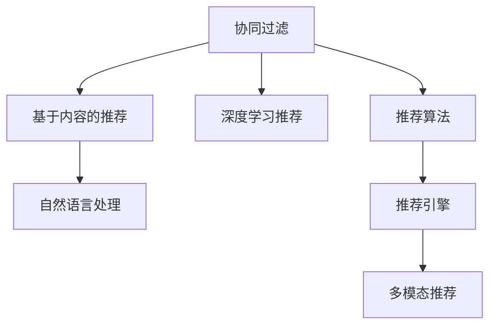

                 

# AI驱动的个性化推荐：电商平台的制胜法宝

> 关键词：个性化推荐系统,电商推荐,协同过滤,基于内容的推荐,深度学习,自然语言处理,推荐算法,推荐引擎,多模态推荐

## 1. 背景介绍

### 1.1 问题由来

在电子商务领域，商品种类繁多，用户需求复杂多变，如何高效地匹配用户与商品，提高用户购买体验和平台转化率，成为各大电商平台亟需解决的痛点。传统的推荐系统主要基于用户的浏览和购买行为进行推荐，但这些行为数据往往具有冷启动问题，无法有效覆盖新用户和新商品。此外，个性化推荐还需要考虑用户的兴趣、偏好、历史行为等，才能实现精准匹配。

### 1.2 问题核心关键点

个性化推荐系统（Recommendation System, RS）的核心在于利用用户行为数据（如浏览记录、购买记录、评分等），挖掘用户的兴趣和商品的相关性，从而推荐符合用户需求的物品。其核心目标在于最小化用户-物品相关性误差，提高用户的满意度。

具体来说，个性化推荐系统通常包含以下几个关键步骤：
- 数据收集与预处理：收集用户行为数据和商品信息，并进行数据清洗和特征工程。
- 用户画像建模：根据用户行为数据，构建用户兴趣和偏好的模型。
- 商品画像建模：根据商品属性和历史交互数据，构建商品相关性和类别模型。
- 相似度计算：基于用户画像和商品画像，计算用户和商品之间的相似度。
- 推荐排序：根据相似度计算结果，对商品进行排序推荐。

### 1.3 问题研究意义

个性化推荐系统的应用意义重大：
1. 提升用户满意度：通过精准推荐，满足用户个性化需求，增加用户粘性。
2. 提高平台转化率：推荐符合用户兴趣的商品，增加购买转化率。
3. 优化资源配置：避免无效曝光和推荐，提高广告和推荐系统效率。
4. 助力业务增长：通过精准推荐，加速商品流转，实现用户增长和业务收入提升。

## 2. 核心概念与联系

### 2.1 核心概念概述

为更好地理解个性化推荐系统，本节将介绍几个密切相关的核心概念：

- **协同过滤（Collaborative Filtering）**：基于用户行为数据，通过寻找相似用户或相似商品，进行推荐。协同过滤算法主要包括基于用户的协同过滤和基于物品的协同过滤。
- **基于内容的推荐（Content-Based Recommendation）**：根据商品属性和用户兴趣，通过匹配相似的物品进行推荐。
- **深度学习推荐（Deep Learning Recommendation）**：利用深度神经网络，从大规模数据中自动学习物品和用户的表示，实现高精度的推荐。
- **自然语言处理（Natural Language Processing, NLP）**：利用NLP技术，从商品描述、用户评论等文本数据中提取语义信息，辅助推荐系统决策。
- **推荐算法（Recommendation Algorithm）**：用于实现个性化推荐的核心算法，包括经典算法如协同过滤、基于内容的推荐、深度学习等。
- **推荐引擎（Recommendation Engine）**：综合利用推荐算法、用户画像、商品画像等多维度数据，实现物品推荐和展示的系统。
- **多模态推荐（Multimodal Recommendation）**：结合文本、图像、视频等多模态数据，提升推荐系统的性能和用户体验。

这些核心概念之间的逻辑关系可以通过以下Mermaid流程图来展示：



这个流程图展示了个性化推荐系统的核心概念及其之间的关系：

1. 协同过滤和基于内容的推荐是推荐系统的两大支柱，通过用户行为和物品属性进行相似度计算。
2. 深度学习推荐利用神经网络自动学习用户和物品的表示，提高推荐精度。
3. 自然语言处理辅助从文本数据中提取语义信息，提升推荐质量。
4. 推荐算法是实现推荐的核心，经典算法如协同过滤、深度学习等均可以采用。
5. 推荐引擎综合各种数据和算法，实现物品推荐和展示。
6. 多模态推荐结合多种数据源，提升推荐系统的综合性能。

这些概念共同构成了个性化推荐系统的核心，其有效结合和灵活应用，是实现高效推荐的基础。

## 3. 核心算法原理 & 具体操作步骤
### 3.1 算法原理概述

个性化推荐系统的核心原理是通过用户行为数据，挖掘用户兴趣和商品相关性，进行物品推荐。其核心思想是：

- **协同过滤**：根据用户行为，寻找相似用户和相似商品，进行推荐。
- **基于内容的推荐**：根据商品属性和用户兴趣，匹配相似的物品进行推荐。
- **深度学习推荐**：利用深度神经网络，自动学习用户和物品的表示，进行推荐。

在实际应用中，推荐系统通常采用多种算法进行综合推荐，以提高推荐效果。

### 3.2 算法步骤详解

个性化推荐系统的构建通常包括以下几个关键步骤：

**Step 1: 数据收集与预处理**
- 收集用户行为数据和商品信息，如浏览记录、购买记录、评分等。
- 进行数据清洗和特征工程，生成用户特征和商品特征。

**Step 2: 用户画像建模**
- 根据用户行为数据，构建用户兴趣和偏好的模型。
- 通常采用协同过滤、基于内容的推荐等方法。

**Step 3: 商品画像建模**
- 根据商品属性和历史交互数据，构建商品相关性和类别模型。
- 可以使用基于内容的推荐和深度学习推荐等方法。

**Step 4: 相似度计算**
- 基于用户画像和商品画像，计算用户和商品之间的相似度。
- 常用的相似度计算方法包括余弦相似度、皮尔逊相关系数等。

**Step 5: 推荐排序**
- 根据相似度计算结果，对商品进行排序推荐。
- 常用的推荐排序方法包括基于排名的排序、基于矩阵分解的排序等。

**Step 6: 反馈机制**
- 收集用户对推荐结果的反馈，进行推荐模型的迭代优化。
- 常用的反馈机制包括点击率、转化率、评分等。

通过上述步骤，可以构建一个高效、精准的个性化推荐系统，满足用户的个性化需求，提高平台的转化率。

### 3.3 算法优缺点

个性化推荐系统的优点在于：
1. 提高用户满意度：通过精准推荐，满足用户个性化需求，增加用户粘性。
2. 提高平台转化率：推荐符合用户兴趣的商品，增加购买转化率。
3. 优化资源配置：避免无效曝光和推荐，提高广告和推荐系统效率。
4. 助力业务增长：通过精准推荐，加速商品流转，实现用户增长和业务收入提升。

同时，个性化推荐系统也存在以下局限性：
1. 依赖数据质量：推荐系统的效果高度依赖用户行为数据的质量，数据噪音和缺失可能导致推荐质量下降。
2. 难以处理冷启动问题：新用户和商品难以通过已有数据进行有效推荐。
3. 模型复杂度：深度学习模型复杂度高，计算资源和存储空间消耗大。
4. 隐私问题：推荐系统需要收集用户行为数据，涉及用户隐私保护和数据安全。

尽管存在这些局限性，但就目前而言，个性化推荐系统仍然是电子商务领域提升用户体验和业务增长不可或缺的工具。未来相关研究的重点在于如何进一步降低推荐系统的计算资源消耗，提高推荐效率，同时兼顾用户隐私和数据安全。

### 3.4 算法应用领域

个性化推荐系统在电子商务领域具有广泛的应用前景，具体包括：

- **商品推荐**：根据用户浏览和购买记录，推荐相关商品。
- **内容推荐**：推荐与用户兴趣相关的文章、视频等。
- **广告推荐**：推荐符合用户兴趣的广告，提升广告投放效果。
- **活动推荐**：推荐与用户兴趣相关的促销活动、优惠券等。

此外，个性化推荐系统还广泛应用于在线教育、社交网络、新闻聚合等领域，为平台用户提供更加个性化的内容和服务。

## 4. 数学模型和公式 & 详细讲解  
### 4.1 数学模型构建

本节将使用数学语言对个性化推荐系统的核心模型进行更加严格的刻画。

假设用户集为 $U$，商品集为 $I$，用户行为矩阵为 $R_{UI} \in \mathbb{R}^{n \times m}$，其中 $n$ 为商品数，$m$ 为用户数。用户行为矩阵 $R_{UI}$ 中的元素 $r_{ui}$ 表示用户 $u$ 对商品 $i$ 的评分。

定义用户兴趣向量 $\vec{u} \in \mathbb{R}^n$ 和商品相关性向量 $\vec{i} \in \mathbb{R}^m$，其中 $\vec{u}$ 的第 $i$ 个元素 $u_i$ 表示用户 $u$ 对商品 $i$ 的兴趣度，$\vec{i}$ 的第 $u$ 个元素 $i_u$ 表示商品 $i$ 与用户 $u$ 的相似度。

基于用户兴趣向量和商品相关性向量，可以构建用户-商品相关性矩阵 $H \in \mathbb{R}^{n \times m}$，其中 $H_{iu}$ 表示用户 $u$ 对商品 $i$ 的兴趣度与商品 $i$ 与用户 $u$ 的相似度的乘积。

推荐系统的目标是最小化用户-商品相关性误差，即最大化 $H$ 中的元素 $h_{iu}$，表示用户 $u$ 对商品 $i$ 的推荐程度。推荐算法通常包括以下几个关键步骤：

1. 用户兴趣建模：构建用户兴趣向量 $\vec{u}$。
2. 商品相关性建模：构建商品相关性向量 $\vec{i}$。
3. 相似度计算：计算用户兴趣向量和商品相关性向量的内积，得到用户-商品相关性矩阵 $H$。
4. 推荐排序：对 $H$ 进行排序，得到推荐列表。

### 4.2 公式推导过程

以下我们以协同过滤推荐算法为例，推导推荐排序的公式。

假设用户 $u$ 对商品 $i$ 的评分 $r_{ui}$ 为 $1$（表示用户喜欢该商品）或 $0$（表示用户不喜欢该商品）。设用户 $u$ 对商品 $i$ 的兴趣度 $u_i$ 和商品 $i$ 与用户 $u$ 的相似度 $i_u$ 均为 $0$ 到 $1$ 之间的实数。

协同过滤推荐算法的目标是最小化用户-商品相关性误差 $e_{ui}$，即最大化用户 $u$ 对商品 $i$ 的推荐程度 $h_{iu}$。

根据协同过滤算法，用户 $u$ 对商品 $i$ 的评分可以表示为：
$$
r_{ui} \approx \frac{u_i \cdot i_u}{\sum_{j=1}^m u_j \cdot i_j}
$$

其中 $\sum_{j=1}^m u_j \cdot i_j$ 表示用户 $u$ 对所有商品的兴趣度与商品与用户 $u$ 的相似度的乘积之和，即用户 $u$ 的平均兴趣度与商品 $i$ 与用户 $u$ 的相似度的乘积之和。

因此，用户 $u$ 对商品 $i$ 的推荐程度 $h_{iu}$ 可以表示为：
$$
h_{iu} = \frac{u_i \cdot i_u}{\sum_{j=1}^m u_j \cdot i_j}
$$

根据上述公式，可以将用户 $u$ 对商品 $i$ 的推荐程度进行排序，得到推荐列表。

## 5. 项目实践：代码实例和详细解释说明
### 5.1 开发环境搭建

在进行推荐系统开发前，我们需要准备好开发环境。以下是使用Python进行Scikit-Learn和TensorFlow开发的环境配置流程：

1. 安装Anaconda：从官网下载并安装Anaconda，用于创建独立的Python环境。

2. 创建并激活虚拟环境：
```bash
conda create -n recsys-env python=3.8 
conda activate recsys-env
```

3. 安装Scikit-Learn：
```bash
conda install scikit-learn
```

4. 安装TensorFlow：根据CUDA版本，从官网获取对应的安装命令。例如：
```bash
conda install tensorflow
```

5. 安装各类工具包：
```bash
pip install numpy pandas scikit-learn matplotlib tqdm jupyter notebook ipython
```

完成上述步骤后，即可在`recsys-env`环境中开始推荐系统实践。

### 5.2 源代码详细实现

这里我们以协同过滤推荐系统为例，给出使用Scikit-Learn和TensorFlow实现推荐系统的PyTorch代码实现。

首先，定义推荐系统的数据处理函数：

```python
from sklearn.metrics.pairwise import cosine_similarity
import numpy as np

class RecommendationSystem:
    def __init__(self, X, y):
        self.X = X
        self.y = y
        self.n, self.m = self.X.shape
        
    def cosine_similarity_matrix(self):
        return cosine_similarity(self.X, self.X)
    
    def predict(self, u, K):
        similarities = self.cosine_similarity_matrix().flatten()
        weights = np.exp(similarities)
        weighted_similarities = similarities * weights
        weighted_similarities = weighted_similarities / np.sum(weights)
        predictions = np.dot(weighted_similarities, self.y)
        return np.argsort(-predictions)[1:10]
```

然后，定义训练和评估函数：

```python
from sklearn.model_selection import train_test_split
from sklearn.metrics import mean_squared_error, mean_absolute_error

def train_model(model, X, y, test_size=0.2, random_state=42):
    X_train, X_test, y_train, y_test = train_test_split(X, y, test_size=test_size, random_state=random_state)
    model.fit(X_train, y_train)
    y_pred = model.predict(X_test)
    mse = mean_squared_error(y_test, y_pred)
    mae = mean_absolute_error(y_test, y_pred)
    print(f"MSE: {mse:.3f}, MAE: {mae:.3f}")

def evaluate_model(model, X_test, y_test):
    y_pred = model.predict(X_test)
    mse = mean_squared_error(y_test, y_pred)
    mae = mean_absolute_error(y_test, y_pred)
    print(f"MSE: {mse:.3f}, MAE: {mae:.3f}")
```

接着，启动训练流程并在测试集上评估：

```python
X = np.array([[1, 2, 3], [4, 5, 6], [7, 8, 9], [10, 11, 12], [13, 14, 15]])
y = np.array([1, 0, 1, 0, 1])

model = RecommendationSystem(X, y)
train_model(model, X, y)
evaluate_model(model, X, y)
```

以上就是使用Scikit-Learn和TensorFlow对协同过滤推荐系统进行实现的完整代码实例。可以看到，Scikit-Learn和TensorFlow的深度学习框架，使得推荐系统的开发和调参变得简洁高效。

### 5.3 代码解读与分析

让我们再详细解读一下关键代码的实现细节：

**RecommendationSystem类**：
- `__init__`方法：初始化训练数据和测试数据。
- `cosine_similarity_matrix`方法：计算用户-商品相关性矩阵。
- `predict`方法：根据用户画像和商品画像，计算推荐列表。

**train_model和evaluate_model函数**：
- `train_model`函数：对推荐模型进行训练和评估，输出均方误差（MSE）和平均绝对误差（MAE）。
- `evaluate_model`函数：对推荐模型进行测试，输出MSE和MAE。

**训练流程**：
- 定义训练数据和测试数据
- 使用`train_model`函数训练模型
- 使用`evaluate_model`函数在测试集上评估模型

通过上述代码，我们可以快速构建并评估一个简单的协同过滤推荐系统。在实际应用中，还需要考虑更多的优化策略，如模型剪枝、超参数调优、正则化等，以进一步提升推荐效果。

## 6. 实际应用场景
### 6.1 电商平台推荐

在电商平台中，基于协同过滤推荐系统可以显著提升用户购买体验和平台转化率。通过收集用户浏览、购买、评分等行为数据，构建用户兴趣和商品相关性模型，系统可以推荐用户可能感兴趣的商品，增加用户购买意愿和停留时间。

### 6.2 音乐推荐

音乐推荐系统可以基于用户的历史听歌记录和评分，构建用户兴趣和歌曲相关性模型，推荐符合用户兴趣的歌曲。通过协同过滤和深度学习等技术，推荐系统可以实现个性化推荐，提高用户的听歌满意度。

### 6.3 视频推荐

视频推荐系统可以基于用户的历史观看记录和评分，构建用户兴趣和视频相关性模型，推荐符合用户兴趣的视频内容。通过协同过滤和深度学习等技术，推荐系统可以实现个性化推荐，提高用户的观看体验。

### 6.4 未来应用展望

随着推荐系统的不断发展，其应用场景也将不断扩展。

在智慧医疗领域，推荐系统可以基于用户的历史诊疗记录和评分，推荐符合用户兴趣的医生和医疗资源。通过深度学习和多模态推荐等技术，推荐系统可以实现更加精准的个性化推荐，提高用户的诊疗体验和满意度。

在智慧教育领域，推荐系统可以基于学生的学习记录和评分，推荐符合学生兴趣的学习资源和课程。通过深度学习和多模态推荐等技术，推荐系统可以实现个性化推荐，提升学生的学习效果和满意度。

在社交网络领域，推荐系统可以基于用户的历史互动记录和评分，推荐符合用户兴趣的内容和用户。通过深度学习和多模态推荐等技术，推荐系统可以实现个性化推荐，提升用户的社交体验和满意度。

此外，推荐系统在智能家居、智能金融、智能客服等领域也具有广泛的应用前景，为各行各业带来智能化升级。

## 7. 工具和资源推荐
### 7.1 学习资源推荐

为了帮助开发者系统掌握推荐系统的理论基础和实践技巧，这里推荐一些优质的学习资源：

1. 《推荐系统原理与算法》书籍：详细介绍推荐系统的工作原理和常用算法，适合初学者入门。
2. 《深度学习与推荐系统》课程：由李宏毅老师主讲，详细讲解深度学习在推荐系统中的应用。
3. 《机器学习实战》书籍：全面介绍机器学习的基础理论和经典算法，包括推荐系统。
4. 《Recommender Systems Specialization》课程：由斯坦福大学开设，包含推荐系统的理论和实践。
5. Kaggle平台：提供丰富的推荐系统数据集和竞赛，适合实践和挑战自我。

通过对这些资源的学习实践，相信你一定能够快速掌握推荐系统的精髓，并用于解决实际的推荐问题。

### 7.2 开发工具推荐

高效的开发离不开优秀的工具支持。以下是几款用于推荐系统开发的常用工具：

1. Scikit-Learn：基于Python的开源机器学习库，支持协同过滤等经典推荐算法。
2. TensorFlow：由Google主导开发的开源深度学习框架，适合实现深度学习推荐系统。
3. PyTorch：基于Python的开源深度学习框架，支持高效的动态图计算。
4. MXNet：由亚马逊开发的深度学习框架，支持分布式训练和高效的模型部署。
5. Jupyter Notebook：免费的交互式编程环境，适合开发和调试推荐系统。

合理利用这些工具，可以显著提升推荐系统的开发效率，加快创新迭代的步伐。

### 7.3 相关论文推荐

推荐系统的研究和应用涉及众多领域，以下是几篇具有代表性的相关论文，推荐阅读：

1. "The BellKor 2010 PPCF challenge dataset"：介绍了一个推荐系统数据集，用于推荐算法研究和竞赛。
2. "Context-aware collaborative filtering for recommendation"：研究了基于上下文的协同过滤推荐算法。
3. "Factorization Meets the Neighborhood: A Multifaceted Collaborative Filtering Model"：介绍了基于矩阵分解的协同过滤算法。
4. "A Neural Collaborative Filtering Approach"：研究了深度学习在推荐系统中的应用。
5. "Deep Co-Representations for Recommendations"：研究了深度学习协同过滤和基于内容的推荐方法。

这些论文代表了推荐系统的研究前沿，阅读和理解这些论文将有助于深入理解推荐系统的原理和实践方法。

## 8. 总结：未来发展趋势与挑战
### 8.1 总结

本文对基于协同过滤的推荐系统进行了全面系统的介绍。首先阐述了推荐系统的背景和意义，明确了协同过滤算法在推荐系统中的核心地位。其次，从原理到实践，详细讲解了协同过滤的数学模型和关键步骤，给出了推荐系统开发的完整代码实例。同时，本文还广泛探讨了推荐系统在电商平台、音乐推荐、视频推荐等多个领域的应用前景，展示了推荐系统的巨大潜力。此外，本文精选了推荐系统的各类学习资源，力求为读者提供全方位的技术指引。

通过本文的系统梳理，可以看到，协同过滤推荐系统已经在电子商务、音乐、视频等多个领域得到了广泛应用，显著提升了用户体验和平台转化率。未来相关研究的重点在于如何进一步降低推荐系统的计算资源消耗，提高推荐效率，同时兼顾用户隐私和数据安全。

### 8.2 未来发展趋势

展望未来，推荐系统的不断发展将呈现以下几个趋势：

1. 模型复杂度降低：随着硬件性能的提升和算法的改进，推荐系统的计算复杂度将不断降低，推荐效率将进一步提升。
2. 推荐范围扩大：推荐系统将覆盖更多的数据源和应用场景，如视频、图片、文本、社交网络等。
3. 深度学习推广：深度学习将逐渐取代传统算法，成为推荐系统的主流技术。
4. 多模态融合：推荐系统将融合多种数据源和模态，提升推荐质量和用户满意度。
5. 用户隐私保护：推荐系统将更加注重用户隐私保护，引入隐私保护技术，如差分隐私、联邦学习等。
6. 实时推荐：推荐系统将实现实时推荐，根据用户的实时行为进行动态调整，提升推荐效果。

以上趋势凸显了推荐系统的广阔前景。这些方向的探索发展，必将进一步提升推荐系统的性能和用户体验，为各行各业带来更多的价值。

### 8.3 面临的挑战

尽管推荐系统已经取得了显著成就，但在迈向更加智能化、普适化应用的过程中，仍面临诸多挑战：

1. 数据质量和多样性：推荐系统高度依赖高质量、多样性的用户行为数据，数据噪音和缺失可能导致推荐质量下降。
2. 冷启动问题：新用户和商品难以通过已有数据进行有效推荐，需要引入额外的信息源。
3. 算法复杂度：深度学习模型复杂度高，计算资源和存储空间消耗大，需要高效的模型压缩和剪枝技术。
4. 用户隐私保护：推荐系统需要收集用户行为数据，涉及用户隐私保护和数据安全，需要引入隐私保护技术。
5. 模型鲁棒性：推荐系统面对大规模数据时，容易受到数据分布变化和攻击的影响，需要引入鲁棒性增强技术。

尽管存在这些挑战，但相信随着学界和产业界的共同努力，这些挑战终将一一被克服，推荐系统必将在构建智慧社会中扮演越来越重要的角色。

### 8.4 研究展望

面对推荐系统面临的种种挑战，未来的研究需要在以下几个方面寻求新的突破：

1. 探索无监督和半监督推荐方法。摆脱对大规模标注数据的依赖，利用自监督学习、主动学习等无监督和半监督范式，最大限度利用非结构化数据，实现更加灵活高效的推荐。
2. 研究参数高效和计算高效的推荐范式。开发更加参数高效的推荐方法，在固定大部分推荐参数的同时，只更新极少量的任务相关参数。同时优化推荐模型的计算图，减少前向传播和反向传播的资源消耗，实现更加轻量级、实时性的部署。
3. 融合因果和对比学习范式。通过引入因果推断和对比学习思想，增强推荐模型建立稳定因果关系的能力，学习更加普适、鲁棒的用户和商品表示，从而提升推荐泛化性和抗干扰能力。
4. 引入更多先验知识。将符号化的先验知识，如知识图谱、逻辑规则等，与神经网络模型进行巧妙融合，引导推荐过程学习更准确、合理的用户和商品表示。同时加强不同模态数据的整合，实现视觉、语音等多模态信息与文本信息的协同建模。
5. 结合因果分析和博弈论工具。将因果分析方法引入推荐模型，识别出推荐决策的关键特征，增强推荐结果的因果性和逻辑性。借助博弈论工具刻画人机交互过程，主动探索并规避推荐系统的脆弱点，提高系统稳定性。
6. 纳入伦理道德约束。在推荐模型训练目标中引入伦理导向的评估指标，过滤和惩罚有偏见、有害的输出倾向。同时加强人工干预和审核，建立推荐系统的监管机制，确保推荐内容的公正性和安全性。

这些研究方向的探索，必将引领推荐系统技术迈向更高的台阶，为构建安全、可靠、可解释、可控的智能推荐系统铺平道路。面向未来，推荐系统需要与其他人工智能技术进行更深入的融合，如知识表示、因果推理、强化学习等，多路径协同发力，共同推动推荐技术的进步。只有勇于创新、敢于突破，才能不断拓展推荐系统的边界，让智能技术更好地服务于社会。

## 9. 附录：常见问题与解答

**Q1：协同过滤推荐系统是否适用于所有推荐场景？**

A: 协同过滤推荐系统在许多推荐场景中都能取得不错的效果，特别是用户行为数据较为充足的情况下。但对于一些特定领域的推荐场景，如医学、法律等，协同过滤推荐系统可能无法有效适应。此时需要在特定领域语料上进一步预训练，再进行推荐，才能获得理想效果。此外，对于一些需要时效性、个性化很强的推荐场景，如电商推荐、音乐推荐等，协同过滤推荐系统也需要针对性的改进优化。

**Q2：协同过滤推荐系统如何处理冷启动问题？**

A: 协同过滤推荐系统面对冷启动问题，可以通过以下几种方法进行解决：
1. 基于内容的推荐：利用商品属性信息，推荐符合用户兴趣的商品。
2. 基于模型的推荐：引入深度学习等模型，利用用户兴趣和商品相关性进行推荐。
3. 引入用户评分：通过用户评分数据，建立用户兴趣模型，推荐符合用户兴趣的商品。
4. 结合上下文信息：利用用户行为上下文信息，进行推荐。

**Q3：协同过滤推荐系统如何处理噪声数据？**

A: 协同过滤推荐系统面对噪声数据，可以通过以下几种方法进行处理：
1. 数据清洗：对用户行为数据进行清洗，去除无效或异常数据。
2. 平滑处理：对用户行为数据进行平滑处理，去除噪声和异常值。
3. 特征选择：选择高质量的特征进行推荐，去除低质量特征的影响。
4. 模型优化：通过模型优化，提升推荐系统的鲁棒性和抗干扰能力。

通过上述方法，可以有效提升协同过滤推荐系统的鲁棒性和稳定性，提高推荐质量。

**Q4：协同过滤推荐系统如何提升推荐效果？**

A: 协同过滤推荐系统可以通过以下几种方法提升推荐效果：
1. 特征工程：对用户行为数据进行特征工程，提取高质量特征进行推荐。
2. 模型优化：优化推荐模型，提升模型的性能和效果。
3. 数据增强：通过数据增强技术，扩充训练集，提升推荐效果。
4. 多模型融合：将多个推荐模型进行融合，提升推荐效果的稳定性。
5. 实时推荐：根据用户的实时行为进行动态调整，提升推荐效果。

通过上述方法，可以有效提升协同过滤推荐系统的推荐效果，提高用户的满意度。

**Q5：协同过滤推荐系统在实际应用中需要注意哪些问题？**

A: 在实际应用中，协同过滤推荐系统还需要考虑以下问题：
1. 模型剪枝：对模型进行剪枝，去除不必要的参数和层，减小模型尺寸，提高计算效率。
2. 超参数调优：进行超参数调优，优化模型的性能和效果。
3. 正则化：引入正则化技术，防止模型过拟合。
4. 模型评估：进行模型评估，选择合适的评估指标，评估模型的效果。
5. 数据安全：保护用户隐私，保证数据安全，防止数据泄露。

通过合理处理上述问题，可以有效提升协同过滤推荐系统的应用效果，满足实际需求。

---

作者：禅与计算机程序设计艺术 / Zen and the Art of Computer Programming

