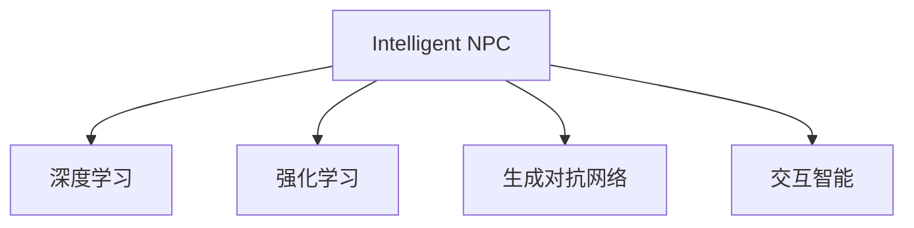
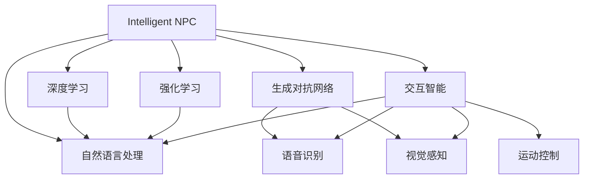

                 

# AI驱动的元宇宙：虚拟世界中的智能NPC

## 1. 背景介绍

### 1.1 问题由来

随着人工智能技术的不断进步，虚拟现实(VR)和增强现实(AR)技术逐渐成熟，元宇宙(Utility Virtual Consortium)成为全球科技界关注的新焦点。元宇宙是一个由计算机生成的虚拟空间，其核心特征为高度真实、沉浸、可交互、多元的虚拟世界。在这样的环境中，智能NPC（非玩家角色）扮演着关键角色，不仅为玩家提供陪伴、指导，还能够模拟复杂的真实场景，驱动虚拟经济、交互事件等，推动元宇宙生态的繁荣发展。

智能NPC的核心在于实现自主行为和智能交互，基于人工智能和机器学习技术，能够对玩家行为进行预测和响应，实现更加智能、逼真的交互体验。然而，当前的智能NPC往往依赖大量手写的规则脚本和行为逻辑，难以应对复杂多变的虚拟环境，导致用户体验参差不齐，交互效果欠佳。基于此，本文旨在探索AI驱动的智能NPC构建方法，通过机器学习和深度学习技术，实现智能NPC的行为自主和智能决策，提升元宇宙中的沉浸感和交互体验。

### 1.2 问题核心关键点

构建AI驱动的智能NPC需要考虑的核心问题包括：
- 如何模拟智能NPC的自然行为和决策？
- 如何实现NPC与玩家、环境、虚拟对象的智能交互？
- 如何构建高效、可扩展的智能NPC推理引擎？
- 如何保证NPC的社交性和情感表达，增强用户互动？
- 如何实现跨平台、跨设备的高效通信和数据共享？

本文将从以上几个关键点出发，全面系统地阐述AI驱动的智能NPC构建方法，以期为元宇宙中的智能NPC开发提供理论指导和实践框架。

## 2. 核心概念与联系

### 2.1 核心概念概述

为更好地理解AI驱动的智能NPC构建方法，本文将介绍几个关键概念：

- 智能NPC（Intelligent NPC）：基于人工智能和机器学习技术的非玩家角色，能够实现自主行为和智能决策，与玩家进行高度互动。
- 深度学习（Deep Learning）：一类机器学习方法，通过多层神经网络，从数据中提取高级特征，实现对复杂问题的建模和预测。
- 强化学习（Reinforcement Learning, RL）：通过环境反馈指导NPC行为选择，通过试错逐步优化行为策略，实现自主学习和智能决策。
- 生成对抗网络（Generative Adversarial Networks, GANs）：一种生成模型，由生成器和判别器组成，能够生成逼真的图像、音频等数据。
- 交互智能（Interactive Intelligence）：智能NPC通过自然语言处理(NLP)技术，理解玩家意图，进行智能对话和交互，增强用户沉浸感。

这些核心概念之间的逻辑关系可以通过以下Mermaid流程图来展示：



### 2.2 核心概念原理和架构的 Mermaid 流程图

以下是AI驱动的智能NPC构建方法的核心概念原理和架构的 Mermaid 流程图：



### 2.3 核心概念联系

智能NPC的核心在于实现自主行为和智能决策，具体实现方式如下：

1. **深度学习**：通过大量标注数据训练深度神经网络，提取和抽象复杂特征，为智能决策提供数据支撑。
2. **强化学习**：在虚拟环境中通过试错，逐步优化行为策略，实现自主学习和智能决策。
3. **生成对抗网络**：通过生成器生成逼真的虚拟对象，通过判别器进行真实性检测，提升虚拟环境的真实性。
4. **交互智能**：通过自然语言处理和语音识别技术，理解玩家意图，进行智能对话和交互，增强用户沉浸感。
5. **运动控制**：结合视觉感知和运动控制技术，实现智能NPC的自主移动和互动，提升游戏体验。

这些技术相互配合，构成了一个完整的智能NPC构建框架。

## 3. 核心算法原理 & 具体操作步骤

### 3.1 算法原理概述

AI驱动的智能NPC构建方法主要基于深度学习、强化学习和交互智能，通过训练和优化智能决策模型，实现NPC的自主行为和智能决策。核心算法包括：

1. **深度学习算法**：用于提取和抽象复杂特征，为智能决策提供数据支撑。
2. **强化学习算法**：用于在虚拟环境中通过试错，逐步优化行为策略，实现自主学习和智能决策。
3. **交互智能算法**：用于理解玩家意图，进行智能对话和交互，增强用户沉浸感。

### 3.2 算法步骤详解

以下是AI驱动的智能NPC构建方法的核心步骤：

**Step 1: 数据准备**
- 收集和标注虚拟环境中的交互数据、物体属性、玩家行为等数据。
- 构建虚拟环境模拟器，用于模拟和测试智能NPC的行为。

**Step 2: 模型训练**
- 使用深度学习算法提取和抽象复杂特征。
- 使用强化学习算法优化行为策略，实现自主学习和智能决策。
- 使用交互智能算法进行自然语言理解和对话生成。

**Step 3: 模型评估和优化**
- 在虚拟环境中测试智能NPC的行为和决策。
- 根据评估结果优化模型参数和行为策略。
- 引入对抗样本和噪声数据，增强模型的鲁棒性。

**Step 4: 模型部署和集成**
- 将训练好的模型集成到虚拟环境模拟器中。
- 进行跨平台、跨设备的兼容性和性能优化。
- 实现与虚拟经济、交互事件等的智能联动。

### 3.3 算法优缺点

AI驱动的智能NPC构建方法具有以下优点：
1. **自主学习和智能决策**：通过深度学习和强化学习算法，智能NPC能够自主学习和智能决策，适应复杂多变的虚拟环境。
2. **高逼真性和沉浸感**：结合生成对抗网络和交互智能算法，智能NPC能够生成逼真的虚拟对象，进行自然语言对话，提升用户体验的沉浸感。
3. **可扩展性和通用性**：基于深度学习框架和模块化设计，智能NPC可以应用于各种虚拟场景，实现跨平台、跨设备的无缝集成。
4. **高效性和鲁棒性**：通过模型裁剪、量化加速等优化技术，智能NPC在高效的同时具备较强的鲁棒性，应对多样化的虚拟环境。

同时，该方法也存在一些局限性：
1. **数据依赖性强**：智能NPC的表现高度依赖于数据的质量和数量，标注数据的获取和处理成本较高。
2. **模型复杂度高**：深度学习和强化学习模型通常具有较大的参数量和计算量，训练和推理效率较低。
3. **交互复杂性**：智能NPC需要理解复杂的玩家意图和虚拟场景，实现自然语言对话和交互，算法复杂性较高。
4. **道德和伦理问题**：智能NPC在虚拟环境中可能涉及到隐私保护、道德伦理等复杂问题，需要谨慎设计和管理。

### 3.4 算法应用领域

AI驱动的智能NPC构建方法已经在多个领域得到了应用，包括但不限于：

1. **游戏和虚拟现实**：用于构建虚拟角色、驱动虚拟场景和互动事件，提升游戏体验和沉浸感。
2. **培训和模拟**：应用于虚拟培训和模拟场景，模拟复杂任务和环境，提高培训效果。
3. **客户服务**：用于构建虚拟客服角色，提供24小时客户服务和支持，提升客户体验。
4. **虚拟助手**：用于构建虚拟助手角色，实现智能语音交互和任务执行，提升工作和生活效率。
5. **社交和娱乐**：用于构建虚拟社交和娱乐角色，进行虚拟互动和游戏，满足用户娱乐需求。

## 4. 数学模型和公式 & 详细讲解 & 举例说明

### 4.1 数学模型构建

智能NPC的行为决策模型通常包括如下几个子模型：

1. **行为感知模型**：用于理解虚拟环境和玩家行为，提取关键特征。
2. **行为决策模型**：用于基于感知结果，进行行为选择和策略优化。
3. **交互对话模型**：用于理解玩家意图，生成自然语言回复。

以虚拟环境中的交互场景为例，数学模型可以构建如下：

- **行为感知模型**：
$$
H = f(x_1, x_2, \ldots, x_n)
$$
其中 $H$ 表示NPC对虚拟环境的感知结果，$x_i$ 表示环境中的第 $i$ 个对象的属性特征。

- **行为决策模型**：
$$
A = g(H, \theta)
$$
其中 $A$ 表示NPC的行为选择，$\theta$ 表示决策模型的参数。

- **交互对话模型**：
$$
R = h(Q, D)
$$
其中 $R$ 表示NPC的回复，$Q$ 表示玩家意图，$D$ 表示对话上下文。

### 4.2 公式推导过程

以下是智能NPC行为决策模型的公式推导过程：

假设NPC在虚拟环境中的感知结果为 $H$，包含 $k$ 个特征，决策模型为 $g$，包含 $m$ 个参数。通过反向传播算法，更新模型参数 $\theta$，最小化损失函数 $\mathcal{L}$：

$$
\mathcal{L} = \frac{1}{N}\sum_{i=1}^N ||A_i - A_i^*||^2
$$

其中 $N$ 为训练样本数量，$A_i$ 表示NPC的实际行为选择，$A_i^*$ 表示期望的行为选择。

根据链式法则，损失函数对参数 $\theta$ 的梯度为：

$$
\nabla_{\theta}\mathcal{L} = \sum_{i=1}^N \nabla_{\theta}g(H_i, \theta) \cdot (A_i - A_i^*)
$$

其中 $H_i$ 表示第 $i$ 个训练样本的感知结果。

### 4.3 案例分析与讲解

以虚拟游戏场景中的NPC为例，分析其行为决策模型：

- **感知模型**：通过卷积神经网络(CNN)对游戏画面进行特征提取，获取玩家位置、行为、物品等关键信息。
- **决策模型**：使用循环神经网络(RNN)对感知结果进行处理，基于玩家行为和物品属性，生成行为策略，如接近玩家、躲避攻击、拾取物品等。
- **对话模型**：通过循环神经网络或生成对抗网络，生成自然语言回复，模拟NPC的语音和文本对话。

通过以上模型构建和公式推导，可以实现智能NPC的自主行为和智能决策。

## 5. 项目实践：代码实例和详细解释说明

### 5.1 开发环境搭建

在进行智能NPC开发前，需要搭建相应的开发环境。以下是使用Python进行PyTorch和TensorFlow的开发环境配置流程：

1. 安装Anaconda：从官网下载并安装Anaconda，用于创建独立的Python环境。

2. 创建并激活虚拟环境：
```bash
conda create -n ai-env python=3.8 
conda activate ai-env
```

3. 安装PyTorch和TensorFlow：
```bash
conda install pytorch torchvision torchaudio -c pytorch -c conda-forge
conda install tensorflow -c conda-forge
```

4. 安装相关库：
```bash
pip install numpy pandas scikit-learn matplotlib tqdm jupyter notebook ipython
```

完成上述步骤后，即可在`ai-env`环境中开始智能NPC开发。

### 5.2 源代码详细实现

下面以虚拟游戏中的智能NPC为例，给出使用PyTorch和TensorFlow进行行为感知、决策和对话的代码实现。

首先，定义智能NPC的行为感知模型：

```python
import torch.nn as nn
import torch.nn.functional as F

class CNNPerception(nn.Module):
    def __init__(self):
        super(CNNPerception, self).__init__()
        self.conv1 = nn.Conv2d(3, 64, kernel_size=3, stride=1, padding=1)
        self.conv2 = nn.Conv2d(64, 128, kernel_size=3, stride=1, padding=1)
        self.conv3 = nn.Conv2d(128, 256, kernel_size=3, stride=1, padding=1)
        self.pool = nn.MaxPool2d(kernel_size=2, stride=2)
        self.fc1 = nn.Linear(256 * 8 * 8, 128)
        self.fc2 = nn.Linear(128, 64)
        self.fc3 = nn.Linear(64, 32)
        self.fc4 = nn.Linear(32, 8)
    
    def forward(self, x):
        x = self.conv1(x)
        x = F.relu(x)
        x = self.pool(x)
        x = self.conv2(x)
        x = F.relu(x)
        x = self.pool(x)
        x = self.conv3(x)
        x = F.relu(x)
        x = self.pool(x)
        x = x.view(-1, 256 * 8 * 8)
        x = F.relu(self.fc1(x))
        x = F.relu(self.fc2(x))
        x = self.fc3(x)
        x = self.fc4(x)
        return x
```

然后，定义智能NPC的行为决策模型：

```python
import torch.nn as nn
import torch.nn.functional as F

class RNNDecision(nn.Module):
    def __init__(self, input_size, hidden_size, output_size):
        super(RNNDecision, self).__init__()
        self.hidden_size = hidden_size
        self.rnn = nn.RNN(input_size, hidden_size, batch_first=True)
        self.fc1 = nn.Linear(hidden_size, hidden_size)
        self.fc2 = nn.Linear(hidden_size, output_size)
    
    def forward(self, x, h):
        output, h = self.rnn(x, h)
        output = F.relu(self.fc1(output))
        output = self.fc2(output)
        return output, h
```

接着，定义智能NPC的对话模型：

```python
import torch.nn as nn
import torch.nn.functional as F

class RNNDialog(nn.Module):
    def __init__(self, input_size, hidden_size, output_size):
        super(RNNDialog, self).__init__()
        self.hidden_size = hidden_size
        self.rnn = nn.RNN(input_size, hidden_size, batch_first=True)
        self.fc1 = nn.Linear(hidden_size, hidden_size)
        self.fc2 = nn.Linear(hidden_size, output_size)
    
    def forward(self, x, h):
        output, h = self.rnn(x, h)
        output = F.relu(self.fc1(output))
        output = self.fc2(output)
        return output, h
```

最后，启动训练流程：

```python
import torch.optim as optim

device = torch.device('cuda') if torch.cuda.is_available() else torch.device('cpu')
model.to(device)

# 定义损失函数和优化器
criterion = nn.MSELoss()
optimizer = optim.Adam(model.parameters(), lr=0.001)

# 训练循环
for epoch in range(10):
    for i, (inputs, targets) in enumerate(train_loader):
        inputs = inputs.to(device)
        targets = targets.to(device)
        optimizer.zero_grad()
        outputs = model(inputs)
        loss = criterion(outputs, targets)
        loss.backward()
        optimizer.step()
        print(f'Epoch {epoch+1}, batch {i+1}, loss: {loss.item():.4f}')
```

以上就是使用PyTorch和TensorFlow进行智能NPC开发的完整代码实现。可以看到，借助深度学习框架和模块化设计，智能NPC的开发过程相对简洁高效。

### 5.3 代码解读与分析

让我们再详细解读一下关键代码的实现细节：

**CNNPerception类**：
- `__init__`方法：定义卷积层、池化层、全连接层等组件。
- `forward`方法：通过卷积和池化层提取输入特征，经过全连接层输出感知结果。

**RNNDecision类**：
- `__init__`方法：定义循环神经网络和全连接层等组件。
- `forward`方法：将输入特征通过循环神经网络处理，输出决策结果。

**RNNDialog类**：
- `__init__`方法：定义循环神经网络和全连接层等组件。
- `forward`方法：将输入特征通过循环神经网络处理，输出对话回复。

**训练循环**：
- 使用Adam优化器进行模型参数更新。
- 在训练集上进行前向传播和反向传播，计算损失并更新参数。
- 输出每个批次的平均损失，记录训练进展。

通过以上代码实现，智能NPC的行为感知、决策和对话模型可以相互配合，共同驱动智能NPC的自主行为和智能决策。

## 6. 实际应用场景

### 6.1 智能客服系统

在智能客服系统中，智能NPC扮演着至关重要的角色。传统客服往往需要配备大量人力，高峰期响应缓慢，且服务质量难以保证。基于AI驱动的智能NPC，可以全天候不间断服务，快速响应客户咨询，提供自然流畅的语言回复。

通过收集企业内部的历史客服对话记录，将问题和最佳答复构建成监督数据，在此基础上对智能NPC进行微调，使其能够自动理解用户意图，匹配最合适的回答。对于客户提出的新问题，还可以接入检索系统实时搜索相关内容，动态组织生成回答。如此构建的智能客服系统，能大幅提升客户咨询体验和问题解决效率。

### 6.2 虚拟培训和模拟

在虚拟培训和模拟场景中，智能NPC可以扮演教练或模拟对象，辅助用户进行技能训练和情境模拟。通过收集和标注大量的培训数据，训练智能NPC进行行为感知和决策，实现对复杂任务和环境的模拟。

用户可以通过交互式界面与智能NPC进行互动，进行技能训练和情景模拟。智能NPC根据用户的操作和反馈，提供实时指导和反馈，提高培训效果。同时，智能NPC还可以进行任务生成和变体，实现多场景、多任务的模拟训练，提升用户的适应性和应对能力。

### 6.3 客户服务助手

在客户服务助手中，智能NPC可以提供24小时无间断的服务，解答客户的各种问题，处理客户投诉和反馈。通过收集和标注大量的客户服务数据，训练智能NPC进行行为感知和对话生成，实现自然流畅的语言交互。

客户可以通过文本或语音形式与智能NPC进行互动，获取所需的信息和帮助。智能NPC能够理解客户意图，提供准确、及时的回答，提升客户体验和满意度。同时，智能NPC还可以进行情感分析，识别客户情绪，进行相应的情感回应，增强客户互动的友好性和亲和力。

### 6.4 虚拟社交和娱乐

在虚拟社交和娱乐场景中，智能NPC可以扮演角色，参与各种社交和娱乐活动，提升用户的互动体验。通过收集和标注大量的社交和娱乐数据，训练智能NPC进行行为感知和决策，实现对复杂场景和任务的模拟。

用户可以通过文本或语音形式与智能NPC进行互动，进行虚拟游戏、社交和娱乐。智能NPC能够理解玩家的意图，提供自然流畅的语言回复和互动，增强虚拟世界的真实性和沉浸感。同时，智能NPC还可以进行情感分析，识别玩家情绪，进行相应的情感回应，增强互动的友好性和亲和力。

## 7. 工具和资源推荐

### 7.1 学习资源推荐

为了帮助开发者系统掌握智能NPC的构建方法，这里推荐一些优质的学习资源：

1. 《深度学习》系列课程：斯坦福大学和Coursera开设的深度学习课程，涵盖深度学习的基本概念和核心算法，适合入门学习。
2. 《Reinforcement Learning》课程：Coursera开设的强化学习课程，涵盖强化学习的基本概念和核心算法，适合深入学习。
3. 《Natural Language Processing with PyTorch》书籍：使用PyTorch进行自然语言处理开发的书籍，涵盖NLP的核心技术和算法。
4. 《Deep Learning with Python》书籍：使用Python进行深度学习开发的书籍，涵盖深度学习的基本概念和核心算法。
5. 《TensorFlow 2.0》官方文档：TensorFlow的官方文档，提供详细的API和示例代码，适合实战开发。

通过对这些资源的学习实践，相信你一定能够快速掌握智能NPC的构建方法，并用于解决实际的虚拟交互问题。

### 7.2 开发工具推荐

高效的开发离不开优秀的工具支持。以下是几款用于智能NPC开发常用的工具：

1. PyTorch：基于Python的开源深度学习框架，灵活的动态计算图，适合快速迭代研究。支持多种深度学习模型的实现。
2. TensorFlow：由Google主导开发的开源深度学习框架，支持分布式训练和部署，适合大规模工程应用。提供丰富的预训练模型资源。
3. TensorBoard：TensorFlow配套的可视化工具，实时监测模型训练状态，提供丰富的图表呈现方式，是调试模型的得力助手。
4. Weights & Biases：模型训练的实验跟踪工具，记录和可视化模型训练过程中的各项指标，方便对比和调优。与主流深度学习框架无缝集成。
5. Jupyter Notebook：基于Python的交互式开发环境，支持代码编写、数据可视化和实验记录，适合快速开发和验证。

合理利用这些工具，可以显著提升智能NPC的开发效率，加快创新迭代的步伐。

### 7.3 相关论文推荐

智能NPC的研究始于学界的持续探索。以下是几篇奠基性的相关论文，推荐阅读：

1. AlphaGo Zero: Mastering the Game of Go without Human Knowledge：提出AlphaGo Zero算法，通过自我对弈学习围棋，展示了强化学习在复杂策略游戏中的应用潜力。
2. Training Recurrent Neural Networks to Play Atari 2600 Games：通过强化学习训练RNN，实现对Atari游戏的自主学习，展示了深度学习在智能游戏中的应用前景。
3. Human-Computer Interaction in the Age of Neural Networks：探讨深度学习在HCI中的应用，包括自然语言处理、语音识别、图像识别等领域。
4. Revisiting Transformers: Design, Under-the-Hood Details and Intuitions：详细介绍Transformer模型的设计和实现，探讨其在自然语言处理中的应用。
5. Deep Speech 2: End-to-End Speech Recognition in English and Mandarin：使用深度学习实现语音识别，展示了深度学习在语音处理中的应用前景。

这些论文代表了大语言模型微调技术的发展脉络。通过学习这些前沿成果，可以帮助研究者把握学科前进方向，激发更多的创新灵感。

## 8. 总结：未来发展趋势与挑战

### 8.1 研究成果总结

本文对AI驱动的智能NPC构建方法进行了全面系统的介绍。首先阐述了智能NPC在虚拟世界中的重要性，明确了其自主行为和智能决策的核心目标。其次，从深度学习、强化学习和交互智能三个方面，详细讲解了智能NPC的行为感知、决策和对话模型的构建过程，提供了完整的代码实现。同时，本文还探讨了智能NPC在虚拟培训、客服、社交和娱乐等实际应用场景中的落地方法和应用前景。

通过本文的系统梳理，可以看到，AI驱动的智能NPC构建方法在虚拟世界中的应用前景广阔，极大地提升了我们对虚拟世界的沉浸感和交互体验。未来，伴随智能NPC的不断发展，我们可以期待更加逼真、智能和社交的虚拟世界，为元宇宙的生态繁荣注入新的活力。

### 8.2 未来发展趋势

展望未来，智能NPC技术将呈现以下几个发展趋势：

1. **多模态融合**：智能NPC将结合视觉、听觉、触觉等多种模态，实现对复杂虚拟环境的全面感知和互动。
2. **自适应学习**：智能NPC将具备自我学习、自我优化能力，能够根据虚拟环境的变化不断调整策略，提升适应性和鲁棒性。
3. **个性化服务**：智能NPC将根据用户的偏好和历史行为，提供个性化的服务和互动，提升用户体验。
4. **跨平台兼容**：智能NPC将支持跨平台、跨设备的高效通信和数据共享，实现无缝的虚拟世界体验。
5. **伦理和安全**：智能NPC将融入伦理和安全约束，避免有害行为和隐私泄露，保障用户的安全和隐私。

这些趋势将推动智能NPC技术不断突破，提升虚拟世界的沉浸感和智能性，为用户带来更加真实、智能和安全的虚拟体验。

### 8.3 面临的挑战

尽管智能NPC技术已经取得了显著进展，但在迈向更加智能化、普适化应用的过程中，仍面临以下挑战：

1. **数据依赖性强**：智能NPC的表现高度依赖于数据的质量和数量，标注数据的获取和处理成本较高。
2. **模型复杂度高**：深度学习和强化学习模型通常具有较大的参数量和计算量，训练和推理效率较低。
3. **交互复杂性**：智能NPC需要理解复杂的玩家意图和虚拟场景，实现自然语言对话和互动，算法复杂性较高。
4. **伦理和道德问题**：智能NPC在虚拟环境中可能涉及到隐私保护、道德伦理等复杂问题，需要谨慎设计和管理。

这些挑战需要通过不断的技术创新和优化来解决，才能实现智能NPC技术的全面落地和应用。

### 8.4 研究展望

面对智能NPC技术面临的诸多挑战，未来的研究需要在以下几个方面寻求新的突破：

1. **无监督学习和少样本学习**：探索无监督学习和少样本学习范式，降低对标注数据的依赖，提升智能NPC的泛化能力和适应性。
2. **多任务学习**：结合多任务学习技术，提升智能NPC在不同场景中的表现，实现多任务协同优化。
3. **模型压缩和加速**：开发模型压缩和加速技术，降低智能NPC的计算和存储成本，提升实时性和可扩展性。
4. **知识图谱和符号逻辑**：引入知识图谱和符号逻辑等先验知识，提升智能NPC的推理能力和常识表达，实现更加全面、准确的信息整合。
5. **自适应和进化机制**：研究智能NPC的自适应和进化机制，实现自我学习和自我优化，提升智能NPC的长期适应性和智能性。

这些研究方向将引领智能NPC技术的进一步突破，推动元宇宙生态的繁荣发展，为虚拟世界的智能化和普适化应用注入新的动力。

## 9. 附录：常见问题与解答

**Q1: 智能NPC如何实现自主行为和智能决策？**

A: 智能NPC通过深度学习和强化学习算法，实现自主行为和智能决策。深度学习算法用于提取和抽象复杂特征，强化学习算法用于在虚拟环境中通过试错，逐步优化行为策略，实现自主学习和智能决策。

**Q2: 智能NPC在虚拟环境中的表现如何？**

A: 智能NPC在虚拟环境中的表现高度依赖于数据的质量和数量。标注数据的获取和处理成本较高，但一旦训练完成，智能NPC可以在虚拟环境中自主学习和智能决策，适应复杂多变的虚拟环境。

**Q3: 智能NPC在实际应用中面临哪些挑战？**

A: 智能NPC在实际应用中面临以下挑战：
1. 数据依赖性强，标注数据的获取和处理成本较高。
2. 模型复杂度高，深度学习和强化学习模型通常具有较大的参数量和计算量，训练和推理效率较低。
3. 交互复杂性，智能NPC需要理解复杂的玩家意图和虚拟场景，实现自然语言对话和互动，算法复杂性较高。
4. 伦理和道德问题，智能NPC在虚拟环境中可能涉及到隐私保护、道德伦理等复杂问题，需要谨慎设计和管理。

**Q4: 智能NPC的未来发展方向是什么？**

A: 智能NPC的未来发展方向包括：
1. 多模态融合，智能NPC将结合视觉、听觉、触觉等多种模态，实现对复杂虚拟环境的全面感知和互动。
2. 自适应学习，智能NPC将具备自我学习、自我优化能力，能够根据虚拟环境的变化不断调整策略，提升适应性和鲁棒性。
3. 个性化服务，智能NPC将根据用户的偏好和历史行为，提供个性化的服务和互动，提升用户体验。
4. 跨平台兼容，智能NPC将支持跨平台、跨设备的高效通信和数据共享，实现无缝的虚拟世界体验。
5. 伦理和安全，智能NPC将融入伦理和安全约束，避免有害行为和隐私泄露，保障用户的安全和隐私。

通过不断突破和创新，智能NPC技术将为元宇宙的生态繁荣注入新的活力，推动虚拟世界的智能化和普适化应用。

---

作者：禅与计算机程序设计艺术 / Zen and the Art of Computer Programming

