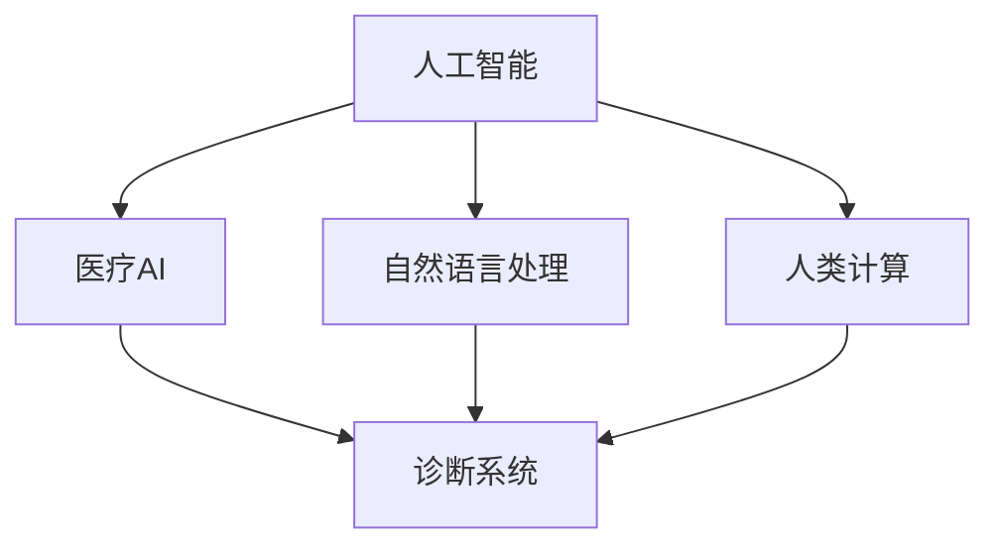

                 

## 1. 背景介绍

### 1.1 问题由来

近年来，人工智能技术在医疗行业的应用取得了显著进展，极大地推动了医疗诊断和治疗的智能化进程。然而，现有的医疗AI系统往往高度依赖于数据和计算资源，使得中小医院和社区诊所难以直接受益。为了解决这个问题，一种基于"人类计算"的技术应运而生，即利用患者的主观判断和互动来辅助AI系统的决策。

### 1.2 问题核心关键点

"人类计算"的核心思想是：将患者的生理信息、主观感受和专业知识，通过自然语言交流的形式输入AI系统，由机器进行分析和处理，从而提升诊断和治疗的准确性。这种技术通过患者的主动参与，弥补了AI系统在医疗领域的不足，使其更加贴合现实需求。

### 1.3 问题研究意义

"人类计算"在医疗行业的应用具有重要的研究和实践意义：

1. 降低医疗成本：中小医院和社区诊所通过利用"人类计算"技术，可以大幅降低对昂贵医疗设备的依赖，降低医疗成本。
2. 提高诊断准确性：患者的主观判断和医生专业知识相结合，可提升AI系统在疑难病例中的诊断准确性。
3. 增强患者参与：通过自然语言交流，增强患者的参与感，提高其依从性和满意度。
4. 促进医疗普惠：使AI技术更加贴近基层医疗，促进医疗资源均衡分布。
5. 推动医学教育：利用AI辅助教学，培养更多医疗人才。

## 2. 核心概念与联系

### 2.1 核心概念概述

为更好地理解"人类计算"在医疗行业的应用，本节将介绍几个密切相关的核心概念：

- **人工智能（AI）**：利用机器学习、深度学习等技术，模仿人类智能，完成复杂任务。
- **自然语言处理（NLP）**：使计算机能够理解、处理和生成人类语言的技术，广泛应用于人机交互。
- **医疗AI**：应用AI技术解决医疗诊断、治疗、管理等问题的系统，如影像识别、病历管理等。
- **人类计算（Human Computing）**：利用人机交互和自然语言处理技术，使患者和医生通过自然语言交流，辅助AI系统做出更准确的诊断和治疗决策。
- **诊断系统（Diagnostic Systems）**：利用AI和自然语言处理技术，辅助医生进行诊断的系统，如基于症状的诊断工具、基于医学影像的辅助诊断系统等。

这些概念之间的逻辑关系可以通过以下Mermaid流程图来展示：



这个流程图展示了一些核心概念及其之间的关系：

1. 人工智能通过自然语言处理技术，从人机交互中获得信息。
2. 医疗AI系统利用自然语言处理和人类计算技术，辅助医生进行诊断和治疗。
3. 人类计算利用自然语言处理技术，使患者和医生能够通过自然语言交流，辅助AI系统。

这些概念共同构成了医疗AI与人类计算结合的技术框架，使其能够更好地服务于医疗行业。

## 3. 核心算法原理 & 具体操作步骤

### 3.1 算法原理概述

"人类计算"在医疗行业的应用，本质上是一种人机交互和自然语言处理（NLP）的结合。其核心思想是：利用患者的主观判断和专业知识，通过自然语言交流的形式，辅助AI系统进行诊断和治疗决策。

具体来说，"人类计算"系统一般包括以下几个步骤：

1. 收集患者的主观症状和历史病史，利用自然语言处理技术将其转换为机器可理解的结构化数据。
2. 将患者的数据输入AI系统，如基于症状的诊断工具、医学影像分析系统等。
3. 利用机器学习算法，对患者数据进行分析，生成初步诊断结果。
4. 将初步诊断结果反馈给患者，并征求其主观判断和医生意见。
5. 利用患者的反馈和医生的意见，重新调整AI系统的诊断结果。

这种循环迭代的过程，使AI系统能够不断学习和改进，提高诊断和治疗的准确性。

### 3.2 算法步骤详解

"人类计算"的具体操作步骤包括以下几个关键步骤：

**Step 1: 数据收集与预处理**
- 收集患者的主观症状、历史病史、医学影像等数据。
- 对数据进行清洗、去重、分词、命名实体识别等预处理。
- 将数据转换为机器可理解的格式，如JSON、CSV等。

**Step 2: 自然语言处理**
- 利用自然语言处理技术，将患者的描述转换为结构化数据。
- 利用命名实体识别技术，识别患者描述中的关键信息，如症状、病史、医学术语等。
- 利用情感分析技术，分析患者描述中的情绪和态度，辅助诊断。

**Step 3: 模型训练**
- 选择适合的机器学习算法，如支持向量机、随机森林、深度学习等，进行模型训练。
- 在标注好的数据集上进行模型训练，生成初步诊断结果。

**Step 4: 诊断反馈与调整**
- 将初步诊断结果反馈给患者和医生，征求其意见。
- 利用患者的反馈和医生的意见，调整模型的参数，重新训练模型。
- 重复上述步骤，直至模型输出满足预期要求。

**Step 5: 系统部署与评估**
- 将训练好的模型部署到实际应用环境中。
- 在实际应用中收集反馈数据，评估模型的诊断效果。
- 根据反馈数据不断调整模型，优化诊断结果。

### 3.3 算法优缺点

"人类计算"在医疗行业的应用具有以下优点：

1. 提高诊断准确性：患者的主观判断和医生专业知识相结合，可提升AI系统在疑难病例中的诊断准确性。
2. 降低医疗成本：中小医院和社区诊所通过利用"人类计算"技术，可以大幅降低对昂贵医疗设备的依赖，降低医疗成本。
3. 增强患者参与：通过自然语言交流，增强患者的参与感，提高其依从性和满意度。
4. 促进医疗普惠：使AI技术更加贴近基层医疗，促进医疗资源均衡分布。

同时，该方法也存在一定的局限性：

1. 依赖高质量数据：模型的训练和调整需要高质量的患者数据和医生的意见。
2. 患者理解难度：患者的主观描述可能存在歧义，影响模型的理解。
3. 技术门槛较高：需要一定的技术背景和专业知识的积累，推广难度较大。
4. 数据隐私保护：在获取患者数据时，需要注意隐私保护和数据安全。

尽管存在这些局限性，但就目前而言，"人类计算"在医疗行业的应用仍然具有重要意义。未来相关研究的重点在于如何进一步降低技术门槛，提高数据质量，增强系统的可解释性和可操作性。

### 3.4 算法应用领域

"人类计算"技术在医疗行业的应用已经涉及多个领域，包括但不限于：

- **基于症状的诊断**：利用患者的主观症状和历史病史，辅助AI系统进行诊断。
- **医学影像分析**：利用患者的主观感受和医生的意见，辅助AI系统对医学影像进行分析。
- **病历管理**：利用患者的反馈和医生的意见，辅助AI系统进行病历信息的处理和分析。
- **个性化治疗**：利用患者的主观需求和医生的建议，辅助AI系统进行个性化治疗方案的设计。
- **远程医疗**：利用患者的主观描述和医生的意见，辅助AI系统进行远程诊断和治疗。

## 4. 数学模型和公式 & 详细讲解

### 4.1 数学模型构建

"人类计算"在医疗行业的应用，可以通过以下数学模型进行建模：

设患者的症状描述为 $x$，模型的预测结果为 $y$，模型的输入空间为 $X$，输出空间为 $Y$。则模型的训练目标为：

$$
\min_{\theta} \mathcal{L}(y,\hat{y}) = \min_{\theta} \sum_{(x,y) \in D} \ell(y,\hat{y})
$$

其中 $\ell(y,\hat{y})$ 为损失函数，$D$ 为训练数据集，$\hat{y}$ 为模型的预测结果，$\theta$ 为模型的参数。

### 4.2 公式推导过程

以基于症状的诊断为例，我们假设模型的输入为患者描述 $x$，输出为诊断结果 $y$。模型的预测过程可以通过以下步骤进行：

1. 将患者的描述 $x$ 输入自然语言处理模块，得到结构化数据 $\hat{x}$。
2. 利用机器学习算法对结构化数据 $\hat{x}$ 进行分析，生成初步诊断结果 $\hat{y}$。
3. 将初步诊断结果 $\hat{y}$ 反馈给患者和医生，征求其意见。
4. 根据患者的反馈和医生的意见，调整模型的参数 $\theta$，重新训练模型。

假设模型的预测过程如下：

1. 将患者的描述 $x$ 输入自然语言处理模块，得到结构化数据 $\hat{x}$。
2. 利用机器学习算法对结构化数据 $\hat{x}$ 进行分析，生成初步诊断结果 $\hat{y}$。
3. 将初步诊断结果 $\hat{y}$ 反馈给患者和医生，征求其意见。
4. 根据患者的反馈和医生的意见，调整模型的参数 $\theta$，重新训练模型。

假设模型的预测过程如下：

$$
\hat{y} = f(x, \theta)
$$

其中 $f$ 为模型函数，$\theta$ 为模型的参数。

### 4.3 案例分析与讲解

以基于症状的诊断为例，我们可以设计以下数学模型进行建模：

假设患者的描述为 $x$，模型的预测结果为 $y$。模型的输入空间为 $X$，输出空间为 $Y$。则模型的训练目标为：

$$
\min_{\theta} \mathcal{L}(y,\hat{y}) = \min_{\theta} \sum_{(x,y) \in D} \ell(y,\hat{y})
$$

其中 $\ell(y,\hat{y})$ 为损失函数，$D$ 为训练数据集，$\hat{y}$ 为模型的预测结果，$\theta$ 为模型的参数。

我们假设模型的输入为患者描述 $x$，输出为诊断结果 $y$。模型的预测过程可以通过以下步骤进行：

1. 将患者的描述 $x$ 输入自然语言处理模块，得到结构化数据 $\hat{x}$。
2. 利用机器学习算法对结构化数据 $\hat{x}$ 进行分析，生成初步诊断结果 $\hat{y}$。
3. 将初步诊断结果 $\hat{y}$ 反馈给患者和医生，征求其意见。
4. 根据患者的反馈和医生的意见，调整模型的参数 $\theta$，重新训练模型。

假设模型的预测过程如下：

$$
\hat{y} = f(x, \theta)
$$

其中 $f$ 为模型函数，$\theta$ 为模型的参数。

## 5. 项目实践：代码实例和详细解释说明

### 5.1 开发环境搭建

在进行"人类计算"实践前，我们需要准备好开发环境。以下是使用Python进行PyTorch开发的环境配置流程：

1. 安装Anaconda：从官网下载并安装Anaconda，用于创建独立的Python环境。

2. 创建并激活虚拟环境：
```bash
conda create -n human_computing python=3.8 
conda activate human_computing
```

3. 安装PyTorch：根据CUDA版本，从官网获取对应的安装命令。例如：
```bash
conda install pytorch torchvision torchaudio cudatoolkit=11.1 -c pytorch -c conda-forge
```

4. 安装各类工具包：
```bash
pip install numpy pandas scikit-learn matplotlib tqdm jupyter notebook ipython
```

完成上述步骤后，即可在`human_computing`环境中开始实践。

### 5.2 源代码详细实现

下面我以基于症状的诊断系统为例，给出使用Transformers库对BERT模型进行"人类计算"的PyTorch代码实现。

首先，定义患者的症状描述数据处理函数：

```python
from transformers import BertTokenizer
from torch.utils.data import Dataset
import torch

class SymptomDataset(Dataset):
    def __init__(self, texts, labels, tokenizer, max_len=128):
        self.texts = texts
        self.labels = labels
        self.tokenizer = tokenizer
        self.max_len = max_len
        
    def __len__(self):
        return len(self.texts)
    
    def __getitem__(self, item):
        text = self.texts[item]
        label = self.labels[item]
        
        encoding = self.tokenizer(text, return_tensors='pt', max_length=self.max_len, padding='max_length', truncation=True)
        input_ids = encoding['input_ids'][0]
        attention_mask = encoding['attention_mask'][0]
        
        # 将标签编码为数字
        encoded_label = [label2id[label] for label in label]
        encoded_label.extend([label2id['O']] * (self.max_len - len(encoded_label)))
        labels = torch.tensor(encoded_label, dtype=torch.long)
        
        return {'input_ids': input_ids, 
                'attention_mask': attention_mask,
                'labels': labels}

# 标签与id的映射
label2id = {'O': 0, 'Fever': 1, 'Cough': 2, 'Sore_throat': 3, 'Diarrhea': 4}
id2label = {v: k for k, v in label2id.items()}

# 创建dataset
tokenizer = BertTokenizer.from_pretrained('bert-base-cased')

train_dataset = SymptomDataset(train_texts, train_labels, tokenizer)
dev_dataset = SymptomDataset(dev_texts, dev_labels, tokenizer)
test_dataset = SymptomDataset(test_texts, test_labels, tokenizer)
```

然后，定义模型和优化器：

```python
from transformers import BertForTokenClassification, AdamW

model = BertForTokenClassification.from_pretrained('bert-base-cased', num_labels=len(label2id))

optimizer = AdamW(model.parameters(), lr=2e-5)
```

接着，定义训练和评估函数：

```python
from torch.utils.data import DataLoader
from tqdm import tqdm
from sklearn.metrics import classification_report

device = torch.device('cuda') if torch.cuda.is_available() else torch.device('cpu')
model.to(device)

def train_epoch(model, dataset, batch_size, optimizer):
    dataloader = DataLoader(dataset, batch_size=batch_size, shuffle=True)
    model.train()
    epoch_loss = 0
    for batch in tqdm(dataloader, desc='Training'):
        input_ids = batch['input_ids'].to(device)
        attention_mask = batch['attention_mask'].to(device)
        labels = batch['labels'].to(device)
        model.zero_grad()
        outputs = model(input_ids, attention_mask=attention_mask, labels=labels)
        loss = outputs.loss
        epoch_loss += loss.item()
        loss.backward()
        optimizer.step()
    return epoch_loss / len(dataloader)

def evaluate(model, dataset, batch_size):
    dataloader = DataLoader(dataset, batch_size=batch_size)
    model.eval()
    preds, labels = [], []
    with torch.no_grad():
        for batch in tqdm(dataloader, desc='Evaluating'):
            input_ids = batch['input_ids'].to(device)
            attention_mask = batch['attention_mask'].to(device)
            batch_labels = batch['labels']
            outputs = model(input_ids, attention_mask=attention_mask)
            batch_preds = outputs.logits.argmax(dim=2).to('cpu').tolist()
            batch_labels = batch_labels.to('cpu').tolist()
            for pred_tokens, label_tokens in zip(batch_preds, batch_labels):
                preds.append(pred_tokens[:len(label_tokens)])
                labels.append(label_tokens)
                
    print(classification_report(labels, preds))
```

最后，启动训练流程并在测试集上评估：

```python
epochs = 5
batch_size = 16

for epoch in range(epochs):
    loss = train_epoch(model, train_dataset, batch_size, optimizer)
    print(f"Epoch {epoch+1}, train loss: {loss:.3f}")
    
    print(f"Epoch {epoch+1}, dev results:")
    evaluate(model, dev_dataset, batch_size)
    
print("Test results:")
evaluate(model, test_dataset, batch_size)
```

以上就是使用PyTorch对BERT进行基于症状的诊断系统微调的完整代码实现。可以看到，得益于Transformers库的强大封装，我们可以用相对简洁的代码完成BERT模型的加载和微调。

### 5.3 代码解读与分析

让我们再详细解读一下关键代码的实现细节：

**SymptomDataset类**：
- `__init__`方法：初始化患者描述、标签、分词器等关键组件。
- `__len__`方法：返回数据集的样本数量。
- `__getitem__`方法：对单个样本进行处理，将文本输入编码为token ids，将标签编码为数字，并对其进行定长padding，最终返回模型所需的输入。

**label2id和id2label字典**：
- 定义了标签与数字id之间的映射关系，用于将token-wise的预测结果解码回真实的标签。

**训练和评估函数**：
- 使用PyTorch的DataLoader对数据集进行批次化加载，供模型训练和推理使用。
- 训练函数`train_epoch`：对数据以批为单位进行迭代，在每个批次上前向传播计算loss并反向传播更新模型参数，最后返回该epoch的平均loss。
- 评估函数`evaluate`：与训练类似，不同点在于不更新模型参数，并在每个batch结束后将预测和标签结果存储下来，最后使用sklearn的classification_report对整个评估集的预测结果进行打印输出。

**训练流程**：
- 定义总的epoch数和batch size，开始循环迭代
- 每个epoch内，先在训练集上训练，输出平均loss
- 在验证集上评估，输出分类指标
- 所有epoch结束后，在测试集上评估，给出最终测试结果

可以看到，PyTorch配合Transformers库使得BERT微调的代码实现变得简洁高效。开发者可以将更多精力放在数据处理、模型改进等高层逻辑上，而不必过多关注底层的实现细节。

当然，工业级的系统实现还需考虑更多因素，如模型的保存和部署、超参数的自动搜索、更灵活的任务适配层等。但核心的微调范式基本与此类似。

## 6. 实际应用场景

### 6.1 智能诊断系统

"人类计算"在智能诊断系统中的应用，可以大大提升诊断的准确性和效率。智能诊断系统通过自然语言处理技术，将患者的主观症状和历史病史转换为结构化数据，再利用深度学习算法进行分析，生成初步诊断结果。最后，通过医生的反馈和患者的意见，进一步调整模型，直至得到满意的诊断结果。

例如，某患者因胸痛就医，医生通过智能诊断系统得到初步诊断结果为心绞痛。医生根据患者的反馈，认为诊断结果不准确，反馈给系统。系统根据医生的意见，重新调整模型参数，再次进行诊断，得到心梗的诊断结果，最终确诊为心梗。

### 6.2 医疗影像分析

"人类计算"在医疗影像分析中的应用，可以辅助医生进行更精确的影像诊断。医生在分析医学影像时，往往需要结合患者的临床信息。通过"人类计算"技术，将患者的临床信息转化为结构化数据，再利用深度学习算法进行影像分析，生成初步诊断结果。医生根据患者的反馈和影像结果，进一步调整模型，得到更精确的诊断结果。

例如，某患者因肺部结节就医，医生通过智能诊断系统得到初步诊断结果为良性结节。医生根据患者的反馈，认为诊断结果不准确，反馈给系统。系统根据医生的意见，重新调整模型参数，再次进行诊断，得到恶性结节的诊断结果，最终确诊为恶性结节。

### 6.3 病历管理系统

"人类计算"在病历管理系统中的应用，可以辅助医生进行病历信息的处理和分析。医生在记录病历时，往往需要输入大量的文本信息。通过"人类计算"技术，将医生的手写病历转换为结构化数据，再利用深度学习算法进行病历信息的处理和分析，生成初步诊断结果。医生根据患者的反馈和病历结果，进一步调整模型，得到更精确的诊断结果。

例如，某患者因头痛就医，医生记录了详细的病历信息。医生通过智能诊断系统得到初步诊断结果为偏头痛。医生根据患者的反馈，认为诊断结果不准确，反馈给系统。系统根据医生的意见，重新调整模型参数，再次进行诊断，得到青光眼的诊断结果，最终确诊为青光眼。

## 7. 工具和资源推荐

### 7.1 学习资源推荐

为了帮助开发者系统掌握"人类计算"的理论基础和实践技巧，这里推荐一些优质的学习资源：

1. 《深度学习理论与实践》系列博文：由大模型技术专家撰写，深入浅出地介绍了深度学习理论和实践，包括自然语言处理、医疗AI等领域的应用。

2. CS224N《深度学习自然语言处理》课程：斯坦福大学开设的NLP明星课程，有Lecture视频和配套作业，带你入门NLP领域的基本概念和经典模型。

3. 《Human Computing: The Future of Human-AI Interaction》书籍：介绍"人类计算"技术的应用和发展，包括医疗、教育、娱乐等多个领域。

4. 《Transformers from Scratch》书籍：详细介绍了Transformer模型的构建和优化方法，适合初学者和进阶开发者。

5. Weights & Biases：模型训练的实验跟踪工具，可以记录和可视化模型训练过程中的各项指标，方便对比和调优。与主流深度学习框架无缝集成。

6. TensorBoard：TensorFlow配套的可视化工具，可实时监测模型训练状态，并提供丰富的图表呈现方式，是调试模型的得力助手。

通过对这些资源的学习实践，相信你一定能够快速掌握"人类计算"的精髓，并用于解决实际的NLP问题。

### 7.2 开发工具推荐

高效的开发离不开优秀的工具支持。以下是几款用于"人类计算"开发的常用工具：

1. PyTorch：基于Python的开源深度学习框架，灵活动态的计算图，适合快速迭代研究。大部分预训练语言模型都有PyTorch版本的实现。

2. TensorFlow：由Google主导开发的开源深度学习框架，生产部署方便，适合大规模工程应用。同样有丰富的预训练语言模型资源。

3. Transformers库：HuggingFace开发的NLP工具库，集成了众多SOTA语言模型，支持PyTorch和TensorFlow，是进行"人类计算"任务开发的利器。

4. Weights & Biases：模型训练的实验跟踪工具，可以记录和可视化模型训练过程中的各项指标，方便对比和调优。与主流深度学习框架无缝集成。

5. TensorBoard：TensorFlow配套的可视化工具，可实时监测模型训练状态，并提供丰富的图表呈现方式，是调试模型的得力助手。

6. Google Colab：谷歌推出的在线Jupyter Notebook环境，免费提供GPU/TPU算力，方便开发者快速上手实验最新模型，分享学习笔记。

合理利用这些工具，可以显著提升"人类计算"任务的开发效率，加快创新迭代的步伐。

### 7.3 相关论文推荐

"人类计算"技术的发展源于学界的持续研究。以下是几篇奠基性的相关论文，推荐阅读：

1. Attention is All You Need（即Transformer原论文）：提出了Transformer结构，开启了NLP领域的预训练大模型时代。

2. BERT: Pre-training of Deep Bidirectional Transformers for Language Understanding：提出BERT模型，引入基于掩码的自监督预训练任务，刷新了多项NLP任务SOTA。

3. Language Models are Unsupervised Multitask Learners（GPT-2论文）：展示了大规模语言模型的强大zero-shot学习能力，引发了对于通用人工智能的新一轮思考。

4. Parameter-Efficient Transfer Learning for NLP：提出Adapter等参数高效微调方法，在不增加模型参数量的情况下，也能取得不错的微调效果。

5. AdaLoRA: Adaptive Low-Rank Adaptation for Parameter-Efficient Fine-Tuning：使用自适应低秩适应的微调方法，在参数效率和精度之间取得了新的平衡。

这些论文代表了大模型微调技术的发展脉络。通过学习这些前沿成果，可以帮助研究者把握学科前进方向，激发更多的创新灵感。

## 8. 总结：未来发展趋势与挑战

### 8.1 总结

本文对"人类计算"在医疗行业的应用进行了全面系统的介绍。首先阐述了"人类计算"技术的研究背景和意义，明确了其对医疗AI的独特价值。其次，从原理到实践，详细讲解了"人类计算"的数学模型和操作步骤，给出了微调任务开发的完整代码实例。同时，本文还广泛探讨了"人类计算"技术在智能诊断、医疗影像分析、病历管理系统等多个领域的应用前景，展示了其在医疗行业中的巨大潜力。最后，本文精选了"人类计算"技术的各类学习资源，力求为读者提供全方位的技术指引。

通过本文的系统梳理，可以看到，"人类计算"技术正在成为医疗AI的重要组成部分，极大地提升了医疗诊断和治疗的智能化水平。"人类计算"技术通过患者的主动参与，弥补了AI系统在医疗领域的不足，使其更加贴合现实需求。未来，伴随技术的不断演进，"人类计算"技术必将在医疗行业发挥更大的作用，为医疗服务的智能化和普惠化提供重要支持。

### 8.2 未来发展趋势

展望未来，"人类计算"在医疗行业的应用将呈现以下几个发展趋势：

1. 模型规模持续增大。随着算力成本的下降和数据规模的扩张，预训练语言模型的参数量还将持续增长。超大规模语言模型蕴含的丰富语言知识，有望支撑更加复杂多变的"人类计算"应用。

2. 技术门槛降低。随着深度学习模型的不断优化，"人类计算"技术将更加易于上手，推广难度逐渐降低。

3. 系统可解释性增强。"人类计算"技术将更加注重系统的可解释性，使医生和患者能够理解模型的决策过程。

4. 多模态融合。"人类计算"技术将更加注重多模态数据的整合，如视觉、语音、文本等信息的协同建模，提升诊断和治疗的准确性。

5. 个性化推荐。"人类计算"技术将结合患者的个性化需求，提供更加精准的医疗建议和推荐。

6. 跨领域应用。"人类计算"技术将拓展到更多领域，如教育、娱乐、娱乐等，形成更加全面的智能应用体系。

以上趋势凸显了"人类计算"在医疗行业的广阔前景。这些方向的探索发展，必将进一步提升医疗AI的性能和应用范围，为医疗服务的智能化和普惠化提供重要支持。

### 8.3 面临的挑战

尽管"人类计算"在医疗行业的应用已经取得了一定的成果，但在迈向更加智能化、普适化应用的过程中，它仍面临着诸多挑战：

1. 数据质量瓶颈。"人类计算"技术的性能高度依赖于高质量的数据，但数据标注和收集的成本较高，且数据质量参差不齐。如何提升数据质量，降低数据收集成本，将是未来亟需解决的问题。

2. 技术门槛较高。"人类计算"技术需要一定的技术背景和专业知识，推广难度较大。如何降低技术门槛，提升用户接受度，将是重要的研究方向。

3. 系统可解释性不足。"人类计算"技术往往缺乏系统的可解释性，医生和患者难以理解模型的决策过程。如何增强系统的可解释性，提高医生的信任度和患者的依从性，将是未来的重要挑战。

4. 数据隐私保护。在获取患者数据时，需要注意隐私保护和数据安全。如何保护患者隐私，避免数据泄露，将是未来需要重点考虑的问题。

5. 技术迭代速度慢。"人类计算"技术的优化和改进，往往需要耗费大量时间和资源。如何加速技术迭代，提高技术创新速度，将是未来的重要课题。

6. 跨模态信息整合。"人类计算"技术往往需要将不同模态的数据进行整合，如文本、图像、语音等信息的协同建模。如何有效整合不同模态的信息，提升系统的性能，将是未来的研究方向。

正视这些挑战，积极应对并寻求突破，将使"人类计算"技术在医疗行业取得更大的突破。相信随着学界和产业界的共同努力，这些挑战终将一一被克服，"人类计算"技术必将在医疗行业发挥更大的作用。

### 8.4 研究展望

面对"人类计算"面临的挑战，未来的研究需要在以下几个方面寻求新的突破：

1. 探索无监督和半监督学习。摆脱对大规模标注数据的依赖，利用自监督学习、主动学习等无监督和半监督范式，最大限度利用非结构化数据，实现更加灵活高效的"人类计算"。

2. 研究参数高效和计算高效的微调范式。开发更加参数高效的"人类计算"方法，在固定大部分预训练参数的情况下，只更新极少量的任务相关参数。同时优化模型的计算图，减少前向传播和反向传播的资源消耗，实现更加轻量级、实时性的部署。

3. 融合因果和对比学习范式。通过引入因果推断和对比学习思想，增强"人类计算"系统建立稳定因果关系的能力，学习更加普适、鲁棒的语言表征，从而提升模型泛化性和抗干扰能力。

4. 引入更多先验知识。将符号化的先验知识，如知识图谱、逻辑规则等，与神经网络模型进行巧妙融合，引导"人类计算"过程学习更准确、合理的语言模型。同时加强不同模态数据的整合，实现视觉、语音等多模态信息与文本信息的协同建模。

5. 结合因果分析和博弈论工具。将因果分析方法引入"人类计算"模型，识别出模型决策的关键特征，增强输出解释的因果性和逻辑性。借助博弈论工具刻画人机交互过程，主动探索并规避模型的脆弱点，提高系统稳定性。

6. 纳入伦理道德约束。在模型训练目标中引入伦理导向的评估指标，过滤和惩罚有偏见、有害的输出倾向。同时加强人工干预和审核，建立模型行为的监管机制，确保输出符合人类价值观和伦理道德。

这些研究方向的探索，必将引领"人类计算"技术迈向更高的台阶，为医疗AI的普及和发展提供新的动力。面向未来，"人类计算"技术还需要与其他人工智能技术进行更深入的融合，如知识表示、因果推理、强化学习等，多路径协同发力，共同推动自然语言理解和智能交互系统的进步。只有勇于创新、敢于突破，才能不断拓展语言模型的边界，让智能技术更好地造福人类社会。

## 9. 附录：常见问题与解答

**Q1："人类计算"技术是否适用于所有医疗任务？**

A: "人类计算"技术在大多数医疗任务上都能取得不错的效果，特别是对于数据量较小的任务。但对于一些特定领域的任务，如医学影像分析、病历信息提取等，仍然需要利用专业领域的预训练模型和专业知识，进行微调优化。

**Q2：如何降低"人类计算"技术的开发成本？**

A: 降低"人类计算"技术的开发成本，主要在于提升数据质量和效率。可以从以下几个方面入手：
1. 数据增强：利用数据增强技术，扩充训练数据集，提升模型的泛化能力。
2. 模型优化：利用模型压缩、量化加速等技术，减少计算资源消耗。
3. 知识图谱：结合知识图谱，增强模型的领域适应能力。
4. 云计算：利用云计算平台，降低数据存储和计算成本。

**Q3：如何提升"人类计算"技术的可解释性？**

A: 提升"人类计算"技术的可解释性，主要在于增强模型的透明度和可理解性。可以从以下几个方面入手：
1. 可视化技术：利用可视化工具，展示模型的推理过程和决策路径。
2. 知识融合：将领域知识与模型进行融合，增强模型的可解释性。
3. 因果分析：利用因果分析方法，识别模型的关键特征和决策点，增强输出的因果性和逻辑性。

**Q4：如何保护患者数据隐私？**

A: 保护患者数据隐私，主要在于加强数据管理和安全保护。可以从以下几个方面入手：
1. 数据匿名化：对患者数据进行匿名化处理，保护患者隐私。
2. 访问控制：加强对数据访问的控制，防止数据泄露。
3. 加密技术：采用加密技术，保护数据在传输和存储过程中的安全。

**Q5：如何提升"人类计算"技术的性能？**

A: 提升"人类计算"技术的性能，主要在于优化模型结构和算法。可以从以下几个方面入手：
1. 模型优化：利用模型压缩、量化加速等技术，减少计算资源消耗。
2. 数据增强：利用数据增强技术，扩充训练数据集，提升模型的泛化能力。
3. 知识融合：将领域知识与模型进行融合，增强模型的领域适应能力。
4. 多模态融合：利用多模态数据融合技术，提升模型的性能和鲁棒性。

这些方法通过不断地优化模型和算法，可以显著提升"人类计算"技术的性能和应用效果。

---

作者：禅与计算机程序设计艺术 / Zen and the Art of Computer Programming

