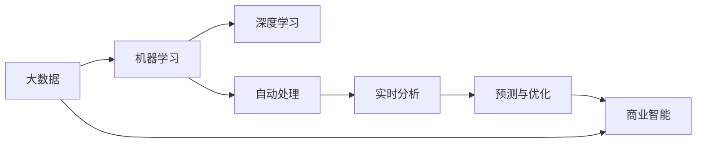

                 

# AI驱动的创新：人类计算在商业中的未来发展方向

> 关键词：人工智能,商业智能,人类计算,未来发展,商业转型,决策支持,数据分析,算法创新

## 1. 背景介绍

### 1.1 问题由来
进入21世纪以来，人类社会的经济活动和信息化进程显著加速。大数据、云计算和人工智能技术的迅猛发展，正在深刻改变各行各业的运作模式。随着算力的提升和数据量的激增，计算任务从传统的数值计算、科学计算逐步扩展到复杂的商业智能和决策支持系统。

商业智能(Business Intelligence, BI)作为企业决策的重要支撑，需要高效处理和分析海量数据，从中提炼有价值的信息和洞察。传统的BI系统依赖于人工操作和规则引擎，无法满足快速变化的商业环境需求。随着AI技术的兴起，利用AI驱动的计算范式，有望在商业智能中发挥重要作用。

### 1.2 问题核心关键点
AI驱动的计算范式，将使得人类计算更加智能化和高效化，从而在商业智能中实现更精准、更实时、更个性化的决策支持。AI驱动的计算主要依赖机器学习和深度学习算法，通过自动学习和优化算法，实现对大规模数据的自动化处理和分析，从而在商业应用中发挥更大价值。

关键点在于如何结合AI和大数据技术，构建出更加智能化的商业决策系统，提升企业的市场竞争力和业务效率。

### 1.3 问题研究意义
深入研究AI驱动的计算范式，对于推动商业智能的发展、提升企业决策效率、加速数字化转型具有重要意义：

1. **提升决策效率**：AI驱动的计算能够自动分析和预测市场趋势，辅助企业决策者快速做出正确判断。
2. **降低成本**：自动化处理和分析减少人工干预，降低运营成本。
3. **优化资源配置**：智能化的决策系统能够更合理地分配资源，提高资源利用率。
4. **增强竞争力**：数据驱动的决策，使得企业能够更灵活应对市场变化，保持竞争力。
5. **支持个性化服务**：通过数据分析，定制个性化的产品和服务，提升客户满意度。

## 2. 核心概念与联系

### 2.1 核心概念概述

AI驱动的计算范式结合了AI和大数据技术，通过自动化分析和处理海量数据，实现智能化的决策支持。其主要概念包括：

- **人工智能(AI)**：通过机器学习和深度学习算法，实现数据自动分析和预测。
- **商业智能(BI)**：利用数据和算法，提升企业的决策能力和运营效率。
- **大数据**：海量数据的收集、存储和分析，为AI驱动的计算提供数据基础。
- **机器学习(ML)**：利用算法自动学习和优化，提升数据处理和分析的效率和精度。
- **深度学习(Deep Learning)**：利用神经网络模型进行复杂数据的处理和分析，实现更高级别的智能化。
- **自动处理**：实现数据预处理、特征提取、模型训练等自动化操作，减少人工干预。
- **实时分析**：通过实时数据流处理，实现对市场变化的快速响应。
- **预测与优化**：利用历史数据和模型，进行趋势预测和资源优化，提高决策准确性和效率。

这些核心概念相互关联，共同构成了AI驱动的计算范式。其中，机器学习和深度学习是实现数据自动分析和预测的核心技术，大数据是提供数据支持的基石，AI驱动的计算则通过自动化的处理流程，实现智能化的商业决策支持。

### 2.2 核心概念原理和架构的 Mermaid 流程图



这个流程图展示了AI驱动的计算范式的主要流程：

1. 大数据作为数据源，通过机器学习和深度学习算法进行处理和分析。
2. 机器学习和深度学习算法自动进行数据特征提取和模型训练。
3. 自动化处理和实时分析，实现对市场变化的快速响应。
4. 预测与优化，提升决策的准确性和效率。
5. 最终的商业智能系统，为企业的决策提供智能化支持。

## 3. 核心算法原理 & 具体操作步骤

### 3.1 算法原理概述

AI驱动的计算范式核心在于通过机器学习和深度学习算法，实现数据自动分析和预测。其基本原理可以概括为以下几个步骤：

1. **数据收集与预处理**：收集商业环境相关的海量数据，进行清洗和预处理，保证数据的质量和一致性。
2. **特征提取与选择**：使用自动化的特征提取算法，从原始数据中提取出关键特征。
3. **模型训练与优化**：利用机器学习和深度学习算法，对特征数据进行建模和训练，通过交叉验证等技术优化模型参数。
4. **实时分析与预测**：利用实时数据流处理技术，对市场变化进行快速响应和预测。
5. **结果反馈与优化**：将预测结果反馈到商业智能系统，进行效果评估和模型优化。

### 3.2 算法步骤详解

以下是AI驱动的计算范式在不同商业智能应用场景中的具体操作步骤：

**步骤1：数据收集与预处理**

- 利用网络爬虫、API接口等方式，从不同渠道收集商业环境数据，如市场交易数据、客户行为数据、社交媒体数据等。
- 对收集到的数据进行清洗和预处理，去除噪声和异常值，保证数据的质量和一致性。
- 使用数据仓库技术，将清洗后的数据进行结构化存储，便于后续分析和查询。

**步骤2：特征提取与选择**

- 利用特征提取算法，如PCA、LDA等，对原始数据进行降维处理，提取关键特征。
- 使用自动化特征选择技术，如LASSO、RF等，选取对预测结果影响最大的特征。
- 将提取后的特征数据导入数据仓库，为模型训练做准备。

**步骤3：模型训练与优化**

- 利用机器学习和深度学习算法，对特征数据进行建模和训练，如决策树、随机森林、神经网络等。
- 使用交叉验证技术，对模型进行评估和优化，保证模型的泛化能力。
- 利用超参数调优算法，如网格搜索、贝叶斯优化等，调整模型参数，提升模型的预测精度。

**步骤4：实时分析与预测**

- 使用实时数据流处理技术，如Storm、Flink等，对市场变化进行快速响应和预测。
- 将预测结果实时反馈到商业智能系统，进行效果评估和监控。
- 使用可视化工具，如Tableau、Power BI等，对预测结果进行可视化展示，辅助决策者理解。

**步骤5：结果反馈与优化**

- 根据预测结果和实际市场情况，进行效果评估，调整模型参数和数据预处理流程。
- 使用机器学习和深度学习算法，不断优化模型，提升预测准确性。
- 定期更新数据仓库中的数据，保证模型的时效性和准确性。

### 3.3 算法优缺点

AI驱动的计算范式在商业智能中的应用，具有以下优点：

1. **自动化程度高**：自动化的数据处理和分析，减少了人工干预，提高了处理效率。
2. **实时响应快**：实时数据流处理技术，可以快速响应市场变化，提升决策的时效性。
3. **精度高**：机器学习和深度学习算法，提升了数据处理的精度和准确性。
4. **可扩展性强**：通过分布式计算和云平台支持，可以实现数据的分布式处理和存储，保证系统可扩展性。
5. **预测能力强**：利用历史数据和模型，进行趋势预测和资源优化，提升决策的科学性和有效性。

然而，该方法也存在以下局限性：

1. **数据质量要求高**：数据收集和预处理环节对数据质量要求较高，数据缺失或噪声可能导致模型预测失效。
2. **模型复杂度高**：机器学习和深度学习算法复杂度较高，需要较多的计算资源和时间。
3. **数据隐私和安全问题**：商业数据涉及隐私和安全问题，需要严格的数据管理和保护措施。
4. **模型维护困难**：模型训练和优化过程较为复杂，需要较强的技术储备和维护能力。
5. **结果解释性不足**：AI驱动的计算过程复杂，结果难以解释，可能影响决策者的信任度。

### 3.4 算法应用领域

AI驱动的计算范式已经在多个商业智能应用场景中取得了显著效果，以下是几个典型应用领域：

**1. 金融风控**

在金融领域，AI驱动的计算范式被广泛应用于信用评估、风险预测、反欺诈检测等场景。通过分析历史交易数据和客户行为数据，利用机器学习和深度学习算法，构建风险预测模型，帮助金融机构识别和防范潜在风险。

**2. 电商推荐**

电商推荐系统是AI驱动计算在商业智能中的典型应用。通过分析用户的浏览、点击、购买等行为数据，利用协同过滤、深度学习等算法，构建推荐模型，推荐个性化的商品和服务，提升用户满意度和转化率。

**3. 市场营销**

市场营销部门利用AI驱动的计算范式，进行市场趋势分析和消费者行为预测。通过分析社交媒体数据和市场调研数据，利用机器学习和深度学习算法，构建预测模型，辅助市场营销策略的制定和调整。

**4. 供应链优化**

供应链管理部门利用AI驱动的计算范式，进行需求预测和库存管理。通过分析历史销售数据和市场趋势数据，利用机器学习和深度学习算法，构建预测模型，优化库存管理和物流调度，提升供应链效率。

## 4. 数学模型和公式 & 详细讲解  
### 4.1 数学模型构建

AI驱动的计算范式中，数学模型主要涉及机器学习和深度学习算法，如回归模型、分类模型、神经网络模型等。这里以线性回归模型为例，说明其数学模型构建和公式推导过程。

假设训练集为 $D=\{(x_i, y_i)\}_{i=1}^N$，其中 $x_i \in \mathbb{R}^n$ 为特征向量， $y_i \in \mathbb{R}$ 为标签值。回归模型的目标是通过最小化损失函数 $\mathcal{L}$，找到最优的参数 $\theta$。

定义线性回归模型的预测函数为 $f(x) = \theta^T x$，其中 $\theta$ 为模型参数。

线性回归的损失函数为均方误差损失函数：

$$
\mathcal{L}(\theta) = \frac{1}{N} \sum_{i=1}^N (y_i - f(x_i))^2
$$

为了求解最优的 $\theta$，需要求解最小化问题：

$$
\hat{\theta} = \mathop{\arg\min}_{\theta} \mathcal{L}(\theta)
$$

通过求解上述优化问题，可以得到线性回归模型的参数 $\hat{\theta}$，从而实现对数据的自动分析和预测。

### 4.2 公式推导过程

线性回归模型的参数求解，通常采用梯度下降法进行求解。具体步骤如下：

1. 初始化模型参数 $\theta$，通常令 $\theta = 0$。
2. 计算梯度 $\frac{\partial \mathcal{L}(\theta)}{\partial \theta}$，使用链式法则计算每个参数的梯度。
3. 更新模型参数，使用梯度下降公式进行参数更新。

$$
\theta \leftarrow \theta - \eta \nabla_{\theta}\mathcal{L}(\theta)
$$

其中 $\eta$ 为学习率，控制每次参数更新的步长。通常需要调整学习率的大小，避免梯度消失或爆炸问题。

### 4.3 案例分析与讲解

线性回归模型是机器学习中最基础的回归模型，但在实际应用中，通过引入正则化项、多变量回归、非线性回归等扩展，可以应对更加复杂的数据分析任务。以下是一个典型的线性回归案例分析：

**案例背景**：
某电商公司希望预测用户购买某一商品的概率，收集了用户年龄、性别、收入等特征数据，以及历史购买记录，使用线性回归模型进行预测。

**数据预处理**：
对原始数据进行清洗和预处理，去除缺失值和异常值，并进行归一化处理，保证数据的质量和一致性。

**特征选择**：
通过特征选择算法，选择对预测结果影响最大的特征，如用户年龄、性别、收入等。

**模型训练**：
使用线性回归模型，对特征数据进行建模和训练，利用梯度下降法最小化损失函数，得到最优的模型参数。

**模型评估**：
在测试集上评估模型预测性能，计算均方误差（MSE）、平均绝对误差（MAE）等指标，评估模型泛化能力。

**结果优化**：
根据评估结果，调整模型参数和学习率，优化模型预测性能。

通过以上案例，可以看到，AI驱动的计算范式利用机器学习和深度学习算法，实现了对数据的自动分析和预测，提升了商业智能系统的预测精度和效率。

## 5. 项目实践：代码实例和详细解释说明
### 5.1 开发环境搭建

在进行AI驱动的计算范式实践前，我们需要准备好开发环境。以下是使用Python进行PyTorch开发的环境配置流程：

1. 安装Anaconda：从官网下载并安装Anaconda，用于创建独立的Python环境。

2. 创建并激活虚拟环境：
```bash
conda create -n pytorch-env python=3.8 
conda activate pytorch-env
```

3. 安装PyTorch：根据CUDA版本，从官网获取对应的安装命令。例如：
```bash
conda install pytorch torchvision torchaudio cudatoolkit=11.1 -c pytorch -c conda-forge
```

4. 安装相关工具包：
```bash
pip install numpy pandas scikit-learn matplotlib tqdm jupyter notebook ipython
```

完成上述步骤后，即可在`pytorch-env`环境中开始AI驱动的计算范式实践。

### 5.2 源代码详细实现

下面我们以金融风控场景为例，给出使用PyTorch进行线性回归模型的PyTorch代码实现。

首先，定义训练集和测试集：

```python
import pandas as pd
import numpy as np

train_data = pd.read_csv('train.csv')
test_data = pd.read_csv('test.csv')

# 特征选择
features = ['age', 'gender', 'income']
X_train = train_data[features]
y_train = train_data['default']
X_test = test_data[features]
y_test = test_data['default']

# 标准化处理
from sklearn.preprocessing import StandardScaler
scaler = StandardScaler()
X_train = scaler.fit_transform(X_train)
X_test = scaler.transform(X_test)
```

然后，定义模型和优化器：

```python
from torch import nn, optim
import torch

class LinearRegression(nn.Module):
    def __init__(self, input_dim):
        super(LinearRegression, self).__init__()
        self.linear = nn.Linear(input_dim, 1)
        
    def forward(self, x):
        return self.linear(x)
    
# 初始化模型
model = LinearRegression(X_train.shape[1])

# 定义损失函数和优化器
criterion = nn.MSELoss()
optimizer = optim.SGD(model.parameters(), lr=0.01)
```

接着，定义训练和评估函数：

```python
# 定义训练函数
def train_epoch(model, X_train, y_train, batch_size, optimizer):
    dataloader = torch.utils.data.DataLoader(torch.from_numpy(X_train), torch.from_numpy(y_train), batch_size=batch_size, shuffle=True)
    model.train()
    epoch_loss = 0
    for batch in dataloader:
        X_batch, y_batch = batch
        optimizer.zero_grad()
        outputs = model(X_batch)
        loss = criterion(outputs, y_batch)
        epoch_loss += loss.item()
        loss.backward()
        optimizer.step()
    return epoch_loss / len(dataloader)
    
# 定义评估函数
def evaluate(model, X_test, y_test, batch_size):
    dataloader = torch.utils.data.DataLoader(torch.from_numpy(X_test), torch.from_numpy(y_test), batch_size=batch_size)
    model.eval()
    preds = []
    for batch in dataloader:
        X_batch, y_batch = batch
        outputs = model(X_batch)
        preds.append(outputs.numpy().flatten())
        
    mse = np.mean((preds - y_test) ** 2)
    print('MSE:', mse)
    
# 启动训练流程
epochs = 100
batch_size = 64

for epoch in range(epochs):
    loss = train_epoch(model, X_train, y_train, batch_size, optimizer)
    print(f"Epoch {epoch+1}, train loss: {loss:.3f}")
    
    evaluate(model, X_test, y_test, batch_size)
```

以上就是使用PyTorch进行线性回归模型的完整代码实现。可以看到，得益于PyTorch的强大封装，我们可以用相对简洁的代码完成模型的加载和训练。

### 5.3 代码解读与分析

让我们再详细解读一下关键代码的实现细节：

**数据处理函数**：
- 使用Pandas库进行数据读取和预处理，选择特征数据和标签数据。
- 使用sklearn库进行标准化处理，保证数据的质量和一致性。

**模型定义函数**：
- 定义线性回归模型，包含输入层、线性层和输出层。
- 使用PyTorch的nn.Module框架实现模型定义，方便模型的扩展和重用。

**优化器定义函数**：
- 定义损失函数和优化器，选择均方误差损失函数和随机梯度下降算法。
- 使用PyTorch的nn模块和optim模块实现损失函数和优化器的定义。

**训练和评估函数**：
- 使用PyTorch的DataLoader实现数据的批处理和迭代，保证训练和评估的效率。
- 在每个epoch中，利用梯度下降法更新模型参数，最小化损失函数。
- 在评估阶段，将预测结果与真实标签对比，计算均方误差等指标，评估模型性能。

**训练流程**：
- 定义总的epoch数和batch size，开始循环迭代
- 每个epoch内，先在训练集上训练，输出平均loss
- 在测试集上评估，输出评估指标
- 所有epoch结束后，在测试集上评估，给出最终测试结果

可以看到，PyTorch配合Scikit-learn等工具，使得线性回归模型的代码实现变得简洁高效。开发者可以将更多精力放在模型选择、数据处理等高层逻辑上，而不必过多关注底层的实现细节。

当然，工业级的系统实现还需考虑更多因素，如模型的保存和部署、超参数的自动搜索、更灵活的任务适配层等。但核心的计算流程基本与此类似。

## 6. 实际应用场景

### 6.1 金融风控

金融风控是AI驱动的计算范式在商业智能中的典型应用之一。金融机构利用AI驱动的计算范式，通过分析历史交易数据和客户行为数据，构建风险预测模型，辅助贷款审批和风险管理。

**具体应用**：
1. **信用评分模型**：利用机器学习算法，如随机森林、梯度提升树等，构建信用评分模型，评估客户的信用风险。
2. **反欺诈检测**：利用深度学习算法，如CNN、RNN等，构建欺诈检测模型，识别异常交易行为。
3. **贷款审批系统**：利用AI驱动的计算范式，实时评估贷款申请的风险，辅助审批决策。

### 6.2 电商推荐

电商推荐系统是AI驱动的计算范式在商业智能中的另一个重要应用。电商公司利用AI驱动的计算范式，通过分析用户行为数据，构建推荐模型，提升用户购物体验。

**具体应用**：
1. **协同过滤推荐**：利用协同过滤算法，根据用户的历史行为数据，推荐相似用户喜欢的商品。
2. **基于内容的推荐**：利用深度学习算法，分析商品属性信息，推荐符合用户兴趣的商品。
3. **实时推荐系统**：利用实时数据流处理技术，根据用户实时行为数据，动态调整推荐结果。

### 6.3 市场营销

市场营销部门利用AI驱动的计算范式，通过分析市场数据和消费者行为，构建预测模型，辅助市场营销策略的制定和调整。

**具体应用**：
1. **市场趋势预测**：利用机器学习算法，预测市场趋势变化，指导产品规划和市场布局。
2. **消费者行为分析**：利用深度学习算法，分析消费者行为数据，识别关键消费者群体。
3. **个性化营销**：利用AI驱动的计算范式，实时调整营销策略，提升营销效果。

### 6.4 供应链优化

供应链管理部门利用AI驱动的计算范式，通过分析历史销售数据和市场趋势数据，构建预测模型，优化库存管理和物流调度。

**具体应用**：
1. **需求预测模型**：利用机器学习算法，预测未来市场需求变化，优化库存管理。
2. **物流调度优化**：利用深度学习算法，优化物流调度和配送路线，降低物流成本。
3. **供应链风险管理**：利用AI驱动的计算范式，实时监测供应链风险，预警潜在问题。

## 7. 工具和资源推荐
### 7.1 学习资源推荐

为了帮助开发者系统掌握AI驱动的计算范式的理论基础和实践技巧，这里推荐一些优质的学习资源：

1. **《深度学习》（Ian Goodfellow）**：深度学习领域的经典教材，系统介绍了深度学习的基本原理和应用。
2. **《Python机器学习》（Sebastian Raschka）**：利用Python语言实现机器学习算法的经典书籍，涵盖了常用的机器学习算法和工具。
3. **《Hands-On Machine Learning with Scikit-Learn, Keras, and TensorFlow》（Aurélien Géron）**：结合Scikit-Learn、Keras和TensorFlow实现机器学习算法的实战指南。
4. **Coursera的《机器学习》课程**：斯坦福大学开设的机器学习课程，提供系统的理论讲授和实践指导。
5. **Kaggle平台**：数据科学和机器学习竞赛平台，提供丰富的数据集和竞赛项目，帮助开发者实践和提升。

通过对这些资源的学习实践，相信你一定能够快速掌握AI驱动的计算范式的精髓，并用于解决实际的商业智能问题。
###  7.2 开发工具推荐

高效的开发离不开优秀的工具支持。以下是几款用于AI驱动的计算范式开发的常用工具：

1. **PyTorch**：基于Python的开源深度学习框架，灵活动态的计算图，适合快速迭代研究。
2. **TensorFlow**：由Google主导开发的开源深度学习框架，生产部署方便，适合大规模工程应用。
3. **Keras**：高层神经网络API，提供了简单易用的接口，适合快速原型开发。
4. **Jupyter Notebook**：交互式编程环境，支持多种语言和工具，适合原型开发和数据探索。
5. **Tableau**：数据可视化工具，支持多种数据源和可视化形式，适合商业智能数据分析。

合理利用这些工具，可以显著提升AI驱动的计算范式的开发效率，加快创新迭代的步伐。

### 7.3 相关论文推荐

AI驱动的计算范式的发展源于学界的持续研究。以下是几篇奠基性的相关论文，推荐阅读：

1. **Deep Learning for Personal and Casual Recommendations**（DeepFM）：利用深度神经网络提升电商推荐系统的效果。
2. **A Deep Dive into Recommendation Engine Design**：深度解析电商推荐系统的设计思路和实现细节。
3. **Machine Learning and the Future of Supply Chain Management**：探讨机器学习在供应链管理中的应用。
4. **Automated Machine Learning**：介绍自动化机器学习技术的最新进展，帮助开发者提升模型构建和优化的效率。
5. **Adversarial Machine Learning**：探讨对抗性机器学习技术，提升模型的鲁棒性和安全性。

这些论文代表了大数据和AI驱动的计算范式的发展脉络。通过学习这些前沿成果，可以帮助研究者把握学科前进方向，激发更多的创新灵感。

## 8. 总结：未来发展趋势与挑战

### 8.1 总结

本文对AI驱动的计算范式在商业智能中的应用进行了全面系统的介绍。首先阐述了AI驱动的计算范式在商业智能中的重要性，明确了其在提升决策效率、降低成本、优化资源配置等方面的优势。其次，从原理到实践，详细讲解了AI驱动的计算范式的数学模型和关键步骤，给出了具体的代码实例。同时，本文还广泛探讨了AI驱动的计算范式在金融风控、电商推荐、市场营销和供应链优化等多个行业领域的应用前景，展示了其广阔的应用空间。此外，本文精选了AI驱动的计算范式的各类学习资源，力求为读者提供全方位的技术指引。

通过本文的系统梳理，可以看到，AI驱动的计算范式在商业智能中的应用，正在带来颠覆性的变革，极大提升了企业决策的智能化和自动化水平。未来，伴随算力提升和数据技术的发展，AI驱动的计算范式有望进一步提升商业智能系统的性能和应用范围，推动企业向数字化转型。

### 8.2 未来发展趋势

展望未来，AI驱动的计算范式在商业智能中的应用，将呈现以下几个发展趋势：

1. **自动化程度提升**：随着自动化机器学习(AutoML)技术的发展，AI驱动的计算范式将更加自动化，无需人工干预即可构建和优化模型。
2. **实时处理能力增强**：随着分布式计算和云平台技术的发展，AI驱动的计算范式将具备更强的实时处理能力，实现对市场变化的实时响应。
3. **多模态融合**：AI驱动的计算范式将融合多模态数据（如文本、图像、语音等），提升数据处理的全面性和深度。
4. **个性化和定制化**：基于用户行为数据的AI驱动计算范式，将实现更加个性化的推荐和服务，提升用户满意度和转化率。
5. **算法和模型的智能化**：随着神经网络和深度学习技术的不断发展，AI驱动的计算范式将具备更强的智能化能力，提升预测准确性和决策效率。
6. **跨领域应用扩展**：AI驱动的计算范式将拓展到更多领域，如医疗、法律、教育等，提供智能化的决策支持。

以上趋势凸显了AI驱动的计算范式在商业智能中的广阔前景。这些方向的探索发展，必将进一步提升商业智能系统的性能和应用范围，为企业的数字化转型提供更加强大的技术支撑。

### 8.3 面临的挑战

尽管AI驱动的计算范式在商业智能中取得了显著成效，但在迈向更加智能化、普适化应用的过程中，仍面临以下挑战：

1. **数据质量问题**：数据收集和预处理环节对数据质量要求较高，数据缺失或噪声可能导致模型预测失效。
2. **计算资源消耗**：机器学习和深度学习算法复杂度较高，需要较多的计算资源和时间。
3. **数据隐私和安全问题**：商业数据涉及隐私和安全问题，需要严格的数据管理和保护措施。
4. **模型复杂度较高**：模型构建和优化过程较为复杂，需要较强的技术储备和维护能力。
5. **结果解释性不足**：AI驱动的计算过程复杂，结果难以解释，可能影响决策者的信任度。
6. **可扩展性挑战**：AI驱动的计算范式在大规模数据和复杂模型中的应用，对系统可扩展性提出更高要求。

正视AI驱动的计算范式面临的这些挑战，积极应对并寻求突破，将是大数据和AI驱动计算范式走向成熟的必由之路。相信随着学界和产业界的共同努力，这些挑战终将一一被克服，AI驱动的计算范式必将在商业智能中发挥更大的作用。

### 8.4 研究展望

面对AI驱动的计算范式所面临的种种挑战，未来的研究需要在以下几个方面寻求新的突破：

1. **数据质量提升**：开发更加高效的数据清洗和预处理算法，提升数据质量，减少模型预测误差。
2. **计算资源优化**：研究高效算法的实现方式，优化模型训练和推理过程，提升计算效率。
3. **数据隐私保护**：开发隐私保护技术，如差分隐私、联邦学习等，确保数据隐私和安全。
4. **模型可解释性增强**：研究模型解释技术，如可视化、特征重要性分析等，提高模型结果的可解释性。
5. **跨领域应用探索**：将AI驱动的计算范式拓展到更多领域，实现跨领域数据融合和智能化决策。
6. **多模态数据融合**：研究多模态数据的融合技术，提升数据处理的全面性和深度。

这些研究方向的探索，必将引领AI驱动的计算范式迈向更高的台阶，为商业智能提供更加强大和智能的技术支撑。面向未来，AI驱动的计算范式需要与其他人工智能技术进行更深入的融合，如知识表示、因果推理、强化学习等，多路径协同发力，共同推动商业智能系统的进步。只有勇于创新、敢于突破，才能不断拓展计算范式的边界，让智能技术更好地造福商业智能。

## 9. 附录：常见问题与解答

**Q1：AI驱动的计算范式与传统计算范式有何不同？**

A: AI驱动的计算范式与传统计算范式的主要区别在于：

1. **自动化程度高**：AI驱动的计算范式实现了自动化的数据处理和分析，减少了人工干预，提高了处理效率。
2. **实时响应快**：AI驱动的计算范式具备实时处理能力，能够快速响应市场变化，提升决策的时效性。
3. **预测能力强**：利用历史数据和模型，进行趋势预测和资源优化，提升决策的科学性和有效性。
4. **结果解释性不足**：AI驱动的计算过程复杂，结果难以解释，可能影响决策者的信任度。

**Q2：AI驱动的计算范式如何应用于供应链优化？**

A: AI驱动的计算范式在供应链优化中的应用主要体现在以下几个方面：

1. **需求预测**：利用历史销售数据和市场趋势数据，构建需求预测模型，优化库存管理。
2. **物流调度优化**：利用深度学习算法，优化物流调度和配送路线，降低物流成本。
3. **供应链风险管理**：实时监测供应链风险，预警潜在问题，提高供应链的稳定性和可靠性。

**Q3：如何缓解AI驱动的计算范式中的数据质量问题？**

A: 缓解AI驱动的计算范式中的数据质量问题，主要从数据预处理和数据管理两个方面入手：

1. **数据预处理**：使用数据清洗和预处理算法，去除噪声和异常值，保证数据的质量和一致性。
2. **数据管理**：建立数据仓库和数据湖，确保数据的安全存储和高效查询。
3. **数据质量评估**：定期对数据质量进行评估，发现问题并及时修复。

**Q4：AI驱动的计算范式在金融风控中的应用有哪些？**

A: AI驱动的计算范式在金融风控中的应用主要体现在以下几个方面：

1. **信用评分模型**：利用机器学习算法，如随机森林、梯度提升树等，构建信用评分模型，评估客户的信用风险。
2. **反欺诈检测**：利用深度学习算法，如CNN、RNN等，构建欺诈检测模型，识别异常交易行为。
3. **贷款审批系统**：利用AI驱动的计算范式，实时评估贷款申请的风险，辅助审批决策。

**Q5：AI驱动的计算范式在市场营销中的应用有哪些？**

A: AI驱动的计算范式在市场营销中的应用主要体现在以下几个方面：

1. **市场趋势预测**：利用机器学习算法，预测市场趋势变化，指导产品规划和市场布局。
2. **消费者行为分析**：利用深度学习算法，分析消费者行为数据，识别关键消费者群体。
3. **个性化营销**：利用AI驱动的计算范式，实时调整营销策略，提升营销效果。

---

作者：禅与计算机程序设计艺术 / Zen and the Art of Computer Programming

