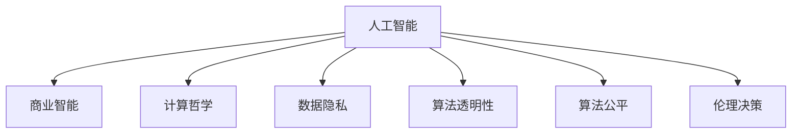

                 

# AI驱动的创新：人类计算在商业中的道德与伦理考虑

> 关键词：人工智能,道德伦理,商业智能,计算哲学,数据隐私,算法透明

## 1. 背景介绍

### 1.1 问题由来
随着人工智能技术的迅猛发展，人类计算在商业中的应用越来越广泛，带来了前所未有的创新和效率提升。然而，伴随着这些进步，也引发了一系列道德与伦理问题。如何在追求商业价值的同时，保障技术应用的公平、公正、透明和责任，成为亟待解决的重要课题。

人工智能（AI）的商业应用不仅涉及技术创新，更是社会行为和伦理价值的体现。近年来，AI伦理问题引起了全球范围内的关注，各种讨论和政策建议层出不穷。例如，AI在招聘、金融、医疗、司法等领域的应用，不仅直接影响企业和社会决策，还关系到个人隐私、社会公正和伦理道德。

### 1.2 问题核心关键点
- **技术透明性**：AI系统内部运行机制是否公开透明，用户是否能够理解其决策依据。
- **数据隐私**：企业如何处理和保护用户数据，避免数据滥用和泄露。
- **算法公平**：AI模型是否公平公正，不带有偏见，避免歧视性输出。
- **责任归属**：AI系统在做出错误决策时，责任应由谁承担。
- **伦理决策**：AI在商业应用中应遵循怎样的伦理原则和价值观。

这些核心问题不仅影响AI技术的健康发展，也关乎企业的可持续发展和社会的和谐稳定。因此，深入研究AI技术应用的道德与伦理考量，具有重要的现实意义。

## 2. 核心概念与联系

### 2.1 核心概念概述

为更好地理解AI在商业中的道德与伦理问题，本节将介绍几个密切相关的核心概念：

- **人工智能（AI）**：利用计算机算法和数据分析，模拟人类智能进行问题解决的技术。
- **商业智能（BI）**：利用AI技术提升商业决策效率和效果，优化企业运营管理的过程。
- **计算哲学（Philosophy of Computation）**：研究计算机系统与人类思维的关系，探讨AI的哲学意义。
- **数据隐私（Data Privacy）**：保护用户数据免受滥用和泄露，维护个人权益。
- **算法透明性（Algorithmic Transparency）**：确保AI系统的决策过程可被解释和理解，增强用户信任。
- **算法公平（Algorithmic Fairness）**：确保AI模型在处理数据时，不带有歧视性，保证公平公正。
- **伦理决策（Ethical Decision-making）**：在AI应用中，遵循一定的伦理原则和价值观，避免技术滥用。

这些核心概念之间的逻辑关系可以通过以下Mermaid流程图来展示：



这个流程图展示了一些关键概念及其之间的关系：

1. 人工智能通过计算哲学进行哲学反思，探讨其存在的意义和价值。
2. 商业智能利用AI技术进行数据分析和决策，推动商业活动高效运转。
3. 数据隐私保护和算法透明性，是实现公平和信任的基础。
4. 算法公平旨在消除偏见，确保AI模型的公正性。
5. 伦理决策指导AI应用的道德边界，避免伦理风险。

这些概念共同构成了AI技术在商业应用中的伦理框架，为AI技术的健康发展提供了方向和原则。

## 3. 核心算法原理 & 具体操作步骤
### 3.1 算法原理概述

人工智能在商业中的道德与伦理问题，主要涉及以下几个方面的算法原理：

1. **数据处理与分析**：商业智能系统通常依赖大量数据进行分析和预测，如何处理和分析数据，直接影响到系统的准确性和公正性。
2. **机器学习与决策**：AI系统通过训练数据构建模型，进行自动化决策。如何确保模型的透明性和公平性，避免偏见和歧视，是关键问题。
3. **模型解释与验证**：AI系统如何解释其决策过程，用户如何验证模型的输出，是提升系统可信度和接受度的重要因素。
4. **隐私保护与透明性**：如何保护用户数据，确保AI系统透明性，减少不透明带来的伦理风险。

### 3.2 算法步骤详解

基于商业智能的AI系统开发，一般包括以下几个关键步骤：

**Step 1: 数据收集与预处理**
- 收集商业智能所需的相关数据，如客户行为数据、市场环境数据等。
- 对数据进行清洗和预处理，确保数据质量和一致性。

**Step 2: 模型选择与训练**
- 根据商业需求选择合适的机器学习模型，如分类模型、回归模型、聚类模型等。
- 使用标记数据进行模型训练，并根据业务需求进行超参数调整和模型优化。

**Step 3: 模型验证与评估**
- 在独立的数据集上对模型进行验证，评估模型的准确性和泛化能力。
- 使用各种指标如精确率、召回率、F1值等，全面衡量模型的性能。

**Step 4: 模型部署与应用**
- 将训练好的模型部署到生产环境中，进行实际业务应用。
- 实时监测模型性能，定期更新和优化模型。

**Step 5: 伦理审查与监管**
- 对AI系统进行伦理审查，确保模型符合公平、公正、透明的原则。
- 设置伦理审查机制，定期评估AI系统的伦理风险。

### 3.3 算法优缺点

基于商业智能的AI系统具有以下优点：
1. 提升决策效率：利用AI系统进行数据分析和预测，可以显著提升决策效率，减少人为误差。
2. 数据驱动：基于大量数据训练的模型，决策更具科学性和准确性。
3. 优化资源配置：通过AI系统优化资源配置，提升企业运营效率和竞争力。

同时，这些系统也存在一些缺点：
1. 数据质量影响：数据收集和处理不当，可能导致模型输出错误。
2. 算法偏见：模型训练过程中可能引入数据偏见，导致决策不公平。
3. 缺乏解释性：AI系统决策过程复杂，用户难以理解其内部逻辑。
4. 隐私风险：数据泄露和滥用可能带来隐私风险，影响用户信任。

尽管存在这些局限性，但总体而言，基于商业智能的AI系统在提升企业运营效率和决策准确性方面具有显著优势。

### 3.4 算法应用领域

基于商业智能的AI系统在多个领域得到广泛应用，例如：

- **客户分析与个性化营销**：通过分析客户数据，预测客户行为，进行个性化营销，提升客户满意度。
- **供应链优化**：利用AI系统进行供应链管理，优化库存控制，提升运营效率。
- **金融风控**：通过AI系统进行风险评估和信用评分，降低金融风险。
- **医疗诊断**：利用AI系统进行医学影像分析，辅助诊断和治疗。
- **安全监控**：通过AI系统进行视频监控分析，提升安全管理水平。

除了上述这些经典应用外，AI系统还在智能制造、智能交通、智能客服等领域发挥重要作用，为商业智能的落地应用提供了强有力的技术支持。

## 4. 数学模型和公式 & 详细讲解 & 举例说明

### 4.1 数学模型构建

商业智能系统中的AI模型构建，主要涉及以下几个数学模型：

- **线性回归模型**：用于预测连续变量的值，如销售预测。
- **逻辑回归模型**：用于分类问题，如客户流失预测。
- **支持向量机（SVM）**：用于分类和回归问题，具有较好的泛化能力。
- **随机森林模型**：用于分类和回归问题，减少过拟合风险。
- **深度学习模型**：如卷积神经网络（CNN）、循环神经网络（RNN）等，用于处理复杂数据结构和特征。

### 4.2 公式推导过程

以线性回归模型为例，介绍其基本公式推导过程。

假设输入向量为 $x$，目标变量为 $y$，线性回归模型的目标是找到最优的权重参数 $\theta$，使得模型输出 $y$ 逼近真实值 $y$。模型公式为：

$$
y = \theta_0 + \theta_1x_1 + \theta_2x_2 + \cdots + \theta_nx_n
$$

其中 $\theta_0$ 为截距，$\theta_1, \theta_2, \cdots, \theta_n$ 为权重参数。目标是最小化预测误差平方和：

$$
J(\theta) = \frac{1}{2m}\sum_{i=1}^m(y_i - \theta_0 - \theta_1x_{i1} - \theta_2x_{i2} - \cdots - \theta_nx_{in})^2
$$

对 $J(\theta)$ 求导，并令导数等于0，得到：

$$
\frac{\partial J(\theta)}{\partial \theta_j} = \frac{1}{m}\sum_{i=1}^m(-2y_i + \theta_0 + \theta_1x_{i1} + \theta_2x_{i2} + \cdots + \theta_nx_{in}) = 0, j=0,1,2,\cdots,n
$$

解以上方程组，即可得到参数 $\theta$ 的估计值。

### 4.3 案例分析与讲解

以金融风控为例，介绍一个基于AI的信用评分系统的设计过程。

**数据准备**：收集客户的个人信息、信用记录、交易记录等数据，并进行预处理。

**模型选择**：选择逻辑回归模型进行信用评分，预测客户的违约概率。

**模型训练**：使用历史数据进行模型训练，优化超参数，确保模型准确性。

**模型验证**：在独立的数据集上验证模型性能，使用混淆矩阵、ROC曲线等指标评估模型效果。

**模型部署**：将训练好的模型部署到生产环境中，实时计算客户的信用评分。

**监控与优化**：持续监控模型表现，定期更新模型参数，优化信用评分系统。

## 5. 项目实践：代码实例和详细解释说明

### 5.1 开发环境搭建

在进行商业智能的AI系统开发前，我们需要准备好开发环境。以下是使用Python进行TensorFlow开发的环境配置流程：

1. 安装Anaconda：从官网下载并安装Anaconda，用于创建独立的Python环境。

2. 创建并激活虚拟环境：
```bash
conda create -n tf-env python=3.8 
conda activate tf-env
```

3. 安装TensorFlow：根据CUDA版本，从官网获取对应的安装命令。例如：
```bash
pip install tensorflow-gpu==2.6.0
```

4. 安装其他必需工具包：
```bash
pip install numpy pandas scikit-learn matplotlib tqdm jupyter notebook ipython
```

完成上述步骤后，即可在`tf-env`环境中开始开发和实验。

### 5.2 源代码详细实现

下面我们以金融风控系统为例，给出使用TensorFlow进行信用评分系统开发的PyTorch代码实现。

```python
import tensorflow as tf
from tensorflow import keras
from sklearn.model_selection import train_test_split
from sklearn.preprocessing import StandardScaler
from sklearn.metrics import roc_auc_score

# 加载数据
data = tf.keras.utils.get_file('creditcard.csv', 'https://archive.ics.uci.edu/ml/machine-learning-databases/00380/creditcard.csv')
df = pd.read_csv(data, header=0)
X = df.drop('Class', axis=1)
y = df['Class']
X_train, X_test, y_train, y_test = train_test_split(X, y, test_size=0.2, random_state=42)

# 数据标准化
scaler = StandardScaler()
X_train = scaler.fit_transform(X_train)
X_test = scaler.transform(X_test)

# 构建模型
model = keras.Sequential([
    keras.layers.Dense(64, activation='relu', input_shape=(X_train.shape[1],)),
    keras.layers.Dense(32, activation='relu'),
    keras.layers.Dense(1, activation='sigmoid')
])

model.compile(optimizer='adam', loss='binary_crossentropy', metrics=['auc'])

# 训练模型
model.fit(X_train, y_train, epochs=10, batch_size=32, validation_data=(X_test, y_test))

# 评估模型
y_pred = model.predict(X_test)
roc_auc = roc_auc_score(y_test, y_pred)
print('ROC AUC Score:', roc_auc)
```

### 5.3 代码解读与分析

让我们再详细解读一下关键代码的实现细节：

**数据加载**：首先，使用`get_file`函数从UCI数据集下载信用评分数据集，并使用Pandas库将其加载到DataFrame中。

**数据预处理**：使用`train_test_split`函数将数据集划分为训练集和测试集，并使用`StandardScaler`对特征进行标准化处理，以提高模型性能。

**模型构建**：定义一个包含两个Dense层的神经网络模型，第一层64个神经元使用ReLU激活函数，第二层32个神经元，输出层只有一个神经元，使用Sigmoid激活函数。

**模型训练**：使用`compile`函数配置优化器、损失函数和评价指标，使用`fit`函数训练模型，设置训练轮数和批大小。

**模型评估**：使用`predict`函数对测试集进行预测，使用`roc_auc_score`函数计算AUC值，评估模型性能。

**结果展示**：输出AUC值，评估模型在信用评分任务上的表现。

## 6. 实际应用场景
### 6.1 金融风控

基于AI的信用评分系统，可以广泛应用于金融风控领域，帮助金融机构进行风险评估和贷款审批。传统信用评分方法依赖人工经验，无法实时处理大量数据，且存在主观偏差。利用AI系统，可以自动分析客户数据，实时生成信用评分，降低风险，提高审批效率。

在技术实现上，可以收集客户的个人信息、交易记录、信用历史等数据，构建输入特征向量，使用逻辑回归等模型进行训练和预测。预测结果可以用于贷款审批、信用评级、风险预警等环节，帮助金融机构制定更加科学和公正的决策策略。

### 6.2 医疗诊断

AI在医疗诊断中的应用，可以显著提高诊断准确性和效率。传统医疗诊断依赖医生经验，受限于医生知识水平和工作强度。利用AI系统，可以自动分析医学影像、化验结果等数据，辅助医生进行诊断和治疗决策。

在技术实现上，可以收集患者的医学影像、病历、实验室数据等，使用卷积神经网络（CNN）、循环神经网络（RNN）等模型进行训练和预测。预测结果可以用于疾病诊断、治疗方案推荐、预后评估等环节，帮助医生制定更加精准和个性化的治疗方案。

### 6.3 智能客服

基于AI的智能客服系统，可以广泛应用于客服行业，提升客户服务质量和效率。传统客服依赖人工操作，无法应对大规模客户需求，且服务质量受限于客服人员水平。利用AI系统，可以自动分析客户意图和语境，生成智能回答，提高客户满意度。

在技术实现上，可以收集客户咨询记录、历史交互数据等，构建输入特征向量，使用文本分类、情感分析等模型进行训练和预测。预测结果可以用于自动化回答、意图识别、情绪分析等环节，帮助客服系统提供更加高效和个性化的服务。

### 6.4 未来应用展望

随着AI技术的不断进步，基于商业智能的AI系统将在更多领域得到应用，为社会带来变革性影响。

在智慧城市领域，AI系统可以用于城市交通管理、环境监测、公共安全等环节，提高城市运营效率和治理水平。

在教育行业，AI系统可以用于学生评估、个性化学习、智能辅导等环节，提高教育质量和公平性。

在制造行业，AI系统可以用于生产调度、质量控制、设备维护等环节，提升制造业的智能化和自动化水平。

此外，在能源、农业、环保等领域，AI系统也将发挥重要作用，推动各行业的数字化转型和智能化升级。

## 7. 工具和资源推荐
### 7.1 学习资源推荐

为了帮助开发者系统掌握AI在商业中的应用理论基础和实践技巧，这里推荐一些优质的学习资源：

1. **《人工智能伦理》**：探讨AI技术的伦理边界，提出伦理框架和实践建议。
2. **《计算哲学导论》**：介绍计算哲学基本概念和研究方法，探讨AI技术的哲学意义。
3. **《数据科学与机器学习》**：系统讲解数据科学和机器学习的理论和实践，涵盖多个经典算法。
4. **TensorFlow官方文档**：TensorFlow的官方文档，提供丰富的代码示例和教程，适合初学者和专业人士。
5. **HuggingFace官方文档**：Transformers库的官方文档，提供各种预训练模型和微调样例，适合NLP开发者。

通过对这些资源的学习实践，相信你一定能够快速掌握AI在商业应用中的关键技能，并用于解决实际问题。

### 7.2 开发工具推荐

高效的开发离不开优秀的工具支持。以下是几款用于AI商业智能开发的常用工具：

1. **TensorFlow**：基于Python的开源深度学习框架，灵活动态的计算图，适合快速迭代研究。
2. **PyTorch**：基于Python的开源深度学习框架，动态计算图，易于调试和优化。
3. **Transformers库**：HuggingFace开发的NLP工具库，集成了众多SOTA语言模型，适合NLP开发者。
4. **Jupyter Notebook**：轻量级交互式开发环境，支持Python代码和数学公式的交互式展示。
5. **Visual Studio Code**：流行且功能强大的代码编辑器，支持多种编程语言和调试工具。

合理利用这些工具，可以显著提升AI商业智能开发的效率，加快创新迭代的步伐。

### 7.3 相关论文推荐

AI在商业智能中的应用，源于学界的持续研究。以下是几篇奠基性的相关论文，推荐阅读：

1. **《机器学习在金融风控中的应用》**：介绍机器学习在金融风控中的具体应用和技术实现。
2. **《AI辅助医疗诊断的伦理挑战》**：探讨AI在医疗诊断中的伦理问题和技术挑战。
3. **《智能客服系统的设计与实现》**：介绍智能客服系统的技术架构和实现方法。
4. **《计算哲学在人工智能中的应用》**：探讨计算哲学对人工智能发展的意义和影响。
5. **《数据隐私保护与AI系统设计》**：介绍数据隐私保护技术在AI系统中的应用，保障用户权益。

这些论文代表了大数据和AI技术在商业智能中的发展脉络。通过学习这些前沿成果，可以帮助研究者把握学科前进方向，激发更多的创新灵感。

## 8. 总结：未来发展趋势与挑战
### 8.1 总结

本文对AI在商业中的应用进行了全面系统的介绍。首先阐述了AI在商业智能中的重要性和实际应用场景，明确了AI系统在提升商业效率和决策准确性方面的优势。其次，从原理到实践，详细讲解了AI系统的构建过程和关键技术，给出了基于TensorFlow和PyTorch的代码实现。同时，本文还广泛探讨了AI系统在金融风控、医疗诊断、智能客服等多个行业领域的应用前景，展示了AI技术在商业智能中的巨大潜力。此外，本文精选了AI技术的各类学习资源，力求为读者提供全方位的技术指引。

通过本文的系统梳理，可以看到，基于商业智能的AI系统正在成为各行各业的重要工具，极大地提升企业的运营效率和决策能力。未来，伴随AI技术的不断演进，AI系统将在更多领域发挥作用，推动各行各业的数字化转型和智能化升级。

### 8.2 未来发展趋势

展望未来，AI在商业智能中的应用将呈现以下几个发展趋势：

1. **数据驱动的决策**：AI系统将更加依赖数据驱动的决策，提升决策的科学性和准确性。
2. **跨领域的应用**：AI系统将在更多领域得到应用，推动各行业的数字化和智能化。
3. **增强现实与虚拟现实**：结合AR/VR技术，AI系统将提供更加沉浸式和互动式的服务体验。
4. **边缘计算**：在物联网设备上部署AI系统，实现实时数据处理和决策，提升系统响应速度。
5. **量子计算**：结合量子计算技术，AI系统将处理更复杂的数据，提升计算效率和模型性能。

以上趋势凸显了AI技术在商业智能中的广阔前景。这些方向的探索发展，必将进一步提升AI系统的性能和应用范围，为各行各业带来更多创新和机遇。

### 8.3 面临的挑战

尽管AI在商业智能中的应用已经取得了显著进展，但在迈向更加智能化、普适化应用的过程中，仍面临诸多挑战：

1. **数据隐私与安全**：AI系统处理大量数据，存在数据泄露和滥用的风险，如何保障数据隐私和安全，仍是一个重要课题。
2. **算法透明与可解释性**：AI系统决策过程复杂，缺乏透明性，用户难以理解其内部逻辑，如何提高AI系统的可解释性和透明度，是亟待解决的问题。
3. **公平性与偏见**：AI系统在处理数据时可能引入偏见，导致不公平的决策，如何消除偏见，确保AI系统的公平性，是一个重要的研究方向。
4. **计算资源**：大规模AI系统的计算和存储需求高，如何降低资源成本，优化系统性能，是一个重要的技术挑战。
5. **伦理与法律**：AI系统的应用涉及伦理和法律问题，如何制定合理的伦理规范和法律法规，确保AI系统的健康发展，是一个重要课题。

这些挑战需要多方共同努力，通过技术、伦理和法律等多个层面的协同合作，才能确保AI技术的健康发展。

### 8.4 研究展望

面对AI在商业智能中面临的挑战，未来的研究需要在以下几个方面寻求新的突破：

1. **数据隐私保护技术**：开发更加安全的数据处理和存储技术，保障用户隐私。
2. **算法透明性与可解释性**：研究和开发更易于理解和解释的AI模型，增强用户信任。
3. **公平性与偏见消除**：开发公平性保障技术，消除AI系统中的偏见，确保决策公正。
4. **计算效率优化**：优化AI系统的计算和存储资源，提高系统性能和效率。
5. **伦理与法律研究**：建立AI系统的伦理规范和法律法规，确保技术应用的道德边界。

这些研究方向的探索，必将引领AI技术在商业智能中的健康发展，为各行业带来更多的创新和机遇。面向未来，AI技术将在商业智能中扮演更加重要的角色，推动社会经济的持续进步和发展。

## 9. 附录：常见问题与解答

**Q1: AI在商业中的应用是否会导致数据隐私泄露？**

A: AI系统在商业应用中，如何保护数据隐私是一个重要问题。一般来说，可以通过以下方式保护数据隐私：

- 数据匿名化：将敏感数据进行去标识化处理，确保数据无法直接关联到具体个人。
- 数据加密：对存储和传输的数据进行加密处理，防止数据泄露。
- 访问控制：对数据的访问进行严格控制，确保只有授权人员才能访问。
- 差分隐私：通过引入噪声，保护数据隐私的同时，不影响数据统计分析。

这些措施可以有效地保护数据隐私，保障用户权益。

**Q2: AI在商业中如何保证算法的公平性？**

A: AI系统在商业应用中，如何保证算法的公平性是一个重要问题。一般来说，可以通过以下方式保证算法公平：

- 数据集平衡：确保训练数据集的样本分布均衡，避免数据偏见。
- 特征选择：选择对决策影响较小的特征，减少算法偏见。
- 模型监控：持续监控模型的输出结果，及时发现和纠正不公平的决策。
- 公平性算法：开发和应用公平性保障算法，确保算法输出公平。

这些措施可以有效地保证算法的公平性，确保决策公正。

**Q3: 如何提高AI系统的可解释性？**

A: AI系统的可解释性是一个重要问题。一般来说，可以通过以下方式提高AI系统的可解释性：

- 模型简化：选择简单模型，降低模型的复杂度，提高可解释性。
- 可视化工具：使用可视化工具展示模型内部逻辑，帮助用户理解决策过程。
- 数据可视化：展示输入数据和输出结果之间的关系，帮助用户理解模型行为。
- 解释模型：开发和应用解释模型，提供模型输出的解释和推理过程。

这些措施可以有效地提高AI系统的可解释性，增强用户信任。

**Q4: AI在商业中的伦理与法律问题如何解决？**

A: AI在商业中的伦理与法律问题是一个重要课题。一般来说，可以通过以下方式解决：

- 伦理规范：制定和推广AI系统的伦理规范，指导AI技术的应用。
- 法律法规：制定和完善AI技术的法律法规，规范AI技术的应用。
- 伦理审查：对AI系统进行伦理审查，确保其符合伦理规范。
- 社会监督：社会公众对AI技术的应用进行监督，发现和纠正不当行为。

这些措施可以有效地解决AI系统的伦理与法律问题，保障技术应用的道德边界。

---

作者：禅与计算机程序设计艺术 / Zen and the Art of Computer Programming

