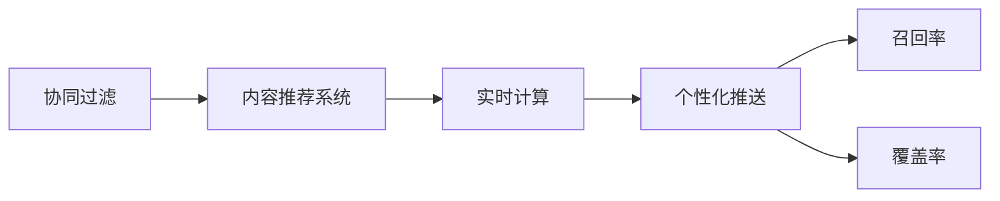

                 

## 1. 背景介绍

### 1.1 问题由来

随着电子商务的蓬勃发展，个性化推荐系统在提升用户体验、提高销售额等方面发挥了重要作用。然而，当前推荐系统往往依赖用户历史行为数据，难以捕捉用户的即时需求和兴趣变化。为了解决这个问题，电商平台开始探索基于AI的个性化推送，即在用户查看商品页面、浏览网页、搜索关键词等行为发生时，动态推送相关商品或广告，以实现内容与时机双重优化。

### 1.2 问题核心关键点

个性化推送的核心在于实时获取用户的即时需求和行为特征，并动态调整推送内容，实现精准匹配。具体包括以下几个关键点：

- **即时行为捕捉**：利用实时数据采集技术，实时捕捉用户在电商平台上的浏览、点击、购买等行为。
- **用户画像建模**：构建用户兴趣模型，识别用户的个性化需求。
- **内容生成与优化**：动态生成或调整推荐内容，以更好地满足用户需求。
- **推送时机优化**：在用户行为发生时，动态推送相关内容，最大化用户参与度和转化率。

### 1.3 问题研究意义

个性化推送不仅能提升用户体验，还能有效提高电商平台的销售额和客户留存率。然而，实现高质量的个性化推送需要综合运用多个AI技术，包括用户行为分析、内容推荐、实时计算等。本文旨在探讨基于AI的个性化推送的核心算法和技术架构，提供系统的解决方案，以期对电商平台的推荐系统优化提供有价值的参考。

## 2. 核心概念与联系

### 2.1 核心概念概述

- **个性化推送**：基于用户行为数据和历史偏好，动态生成和调整推荐内容，在合适的时间点推送给用户，以提高用户满意度和平台收益。
- **协同过滤**：通过分析用户行为相似度，发现具有相似兴趣的用户群体，推荐其感兴趣的物品。
- **内容推荐系统**：利用机器学习和数据挖掘技术，推荐用户可能感兴趣的物品、页面等。
- **实时计算**：在数据实时生成和处理的基础上，快速响应用户请求，实现实时推荐。
- **召回率与覆盖率**：衡量推荐系统推荐物品多样性的指标，前者关注相关物品是否被推荐，后者关注被推荐物品是否足够丰富。

这些核心概念之间具有密切联系，共同构成了个性化推送系统的基础。协同过滤和内容推荐系统为个性化推送提供基础推荐能力，实时计算技术保障推荐系统能够快速响应用户行为，而召回率和覆盖率则直接影响推荐效果。

### 2.2 核心概念原理和架构的 Mermaid 流程图



### 2.3 核心概念之间的逻辑关系

1. **协同过滤**：基于用户历史行为数据和物品属性，构建用户-物品共现矩阵，计算用户相似度，推荐用户可能感兴趣的物品。
2. **内容推荐系统**：利用深度学习、知识图谱等技术，提取物品特征，预测用户兴趣，生成推荐列表。
3. **实时计算**：通过流计算、缓存等技术，实时获取用户行为数据，快速响应用户请求，调整推荐内容。
4. **个性化推送**：根据用户实时行为和历史兴趣，动态生成推荐内容，在合适时间点推送给用户。
5. **召回率与覆盖率**：衡量推荐系统的推荐多样性，直接影响用户满意度。

## 3. 核心算法原理 & 具体操作步骤

### 3.1 算法原理概述

个性化推送的核心算法原理可以概括为：在用户行为发生时，实时捕捉用户特征，动态生成或调整推荐内容，并在合适的时间点推送。其关键在于构建用户画像、优化推荐内容、以及动态调整推荐时机。

### 3.2 算法步骤详解

个性化推送的算法步骤主要包括以下几个关键步骤：

1. **用户画像建模**：根据用户行为数据，构建用户兴趣模型，识别用户的关键特征和兴趣点。
2. **实时数据采集**：利用数据管道技术，实时捕捉用户在电商平台上的行为数据。
3. **实时推荐生成**：基于用户画像和实时行为，动态生成或调整推荐内容，并计算推荐得分。
4. **推送时机优化**：根据用户行为特征，动态调整推送时机，最大化用户参与度和转化率。
5. **反馈收集与模型更新**：收集用户对推荐结果的反馈，持续优化推荐模型。

### 3.3 算法优缺点

个性化推送算法具有以下优点：

- **即时响应**：能够实时捕捉用户行为，动态调整推荐内容，满足用户的即时需求。
- **个性化高**：利用用户画像和实时行为，实现高度个性化的推荐。
- **用户参与度高**：通过动态调整推送时机，提升用户参与度和转化率。

但同时，该算法也存在一些局限：

- **依赖历史数据**：算法效果依赖于用户历史行为数据的丰富度，对于新用户或行为稀疏的用户，效果可能不佳。
- **计算资源消耗大**：实时计算和动态推荐需要较大的计算资源，尤其是在大流量场景下，可能面临性能瓶颈。
- **推荐多样性不足**：部分用户可能对推荐内容产生“茧房效应”，推荐多样性不足，影响用户体验。

### 3.4 算法应用领域

个性化推送算法广泛应用于电商、社交媒体、新闻推荐等多个领域，取得了显著效果。以下是一些典型的应用场景：

- **电商推荐**：在用户浏览商品页面、查看搜索结果等行为发生时，动态推送相关商品广告。
- **新闻推荐**：根据用户阅读习惯，动态推送相关新闻文章，提高用户阅读兴趣和停留时间。
- **社交媒体**：根据用户互动行为，动态推送相关内容，提升用户参与度和互动效果。

## 4. 数学模型和公式 & 详细讲解

### 4.1 数学模型构建

个性化推送的数学模型主要包括以下几个部分：

1. **用户兴趣模型**：构建用户兴趣向量，表示用户的兴趣点。
2. **物品特征提取**：提取物品的特征，用于计算物品与用户兴趣的匹配度。
3. **推荐得分计算**：根据用户兴趣和物品特征，计算推荐得分，排序生成推荐列表。
4. **推送时机优化**：根据用户行为特征，选择最优推送时机，最大化用户参与度和转化率。

### 4.2 公式推导过程

假设用户 $u$ 的兴趣向量为 $\vec{I}_u$，物品 $i$ 的特征向量为 $\vec{F}_i$，用户 $u$ 对物品 $i$ 的评分（即点击、购买等行为）为 $r_{ui}$。用户 $u$ 对物品 $i$ 的推荐得分 $s_{ui}$ 可以表示为：

$$
s_{ui} = \vec{I}_u \cdot \vec{F}_i + \alpha r_{ui}
$$

其中 $\vec{I}_u \cdot \vec{F}_i$ 表示用户兴趣向量与物品特征向量的匹配度，$\alpha$ 为调节参数。

根据推荐得分，生成推荐列表 $R$，排序后推送给用户 $u$：

$$
R = \text{arg\_max}_i(s_{ui})
$$

推送时机优化可以通过分析用户行为特征，选择最优的推送时间点 $t$，最大化用户参与度和转化率。假设用户的当前时间为 $T$，推荐时机选择模型为：

$$
t = \text{arg\_max}_t(\text{点击率} \times \text{转化率})
$$

### 4.3 案例分析与讲解

假设用户 $u$ 浏览商品页面 $i$，此时推荐系统实时捕捉到用户行为，并计算推荐得分 $s_{ui}$：

1. **用户画像建模**：根据用户 $u$ 的历史行为数据，构建用户兴趣向量 $\vec{I}_u = [I_1, I_2, I_3]$，其中 $I_1 = \text{喜欢时尚}，I_2 = \text{喜欢运动}，I_3 = \text{喜欢科技}$。
2. **物品特征提取**：物品 $i$ 的特征向量 $\vec{F}_i = [F_1, F_2, F_3]$，其中 $F_1 = \text{时尚类}，F_2 = \text{运动类}，F_3 = \text{科技类}$。
3. **推荐得分计算**：根据用户兴趣和物品特征，计算推荐得分：
   $$
   s_{ui} = \vec{I}_u \cdot \vec{F}_i + \alpha r_{ui} = 1 \times 1 + 0 \times 1 + 1 \times 0 + \alpha \times 0 = 1
   $$
4. **推送时机优化**：根据用户浏览商品页面的行为特征，选择在合适的时间点推送推荐列表 $R = [i]$，最大化用户参与度和转化率。

## 5. 项目实践：代码实例和详细解释说明

### 5.1 开发环境搭建

在实际项目中，我们需要搭建一个完整的个性化推送系统。以下是开发环境搭建的步骤：

1. **数据采集**：利用Flume、Kafka等流数据采集工具，实时获取用户行为数据。
2. **数据存储**：使用Hadoop、Spark等分布式存储和计算平台，存储和管理用户行为数据。
3. **模型训练**：使用TensorFlow、PyTorch等深度学习框架，训练用户兴趣模型和推荐模型。
4. **推荐生成**：使用Spark Streaming等实时计算框架，实时生成推荐列表。
5. **推送系统**：利用Websocket、HTTP API等技术，将推荐列表推送给用户客户端。

### 5.2 源代码详细实现

下面以一个简单的推荐系统为例，展示代码实现。

**推荐得分计算**

```python
import numpy as np

def calculate_recommender_score(user_profile, item_features, user_item_interactions, alpha=0.5):
    user_interest = user_profile
    item_features = np.array(item_features)
    user_item_interactions = np.array(user_item_interactions)
    
    recommender_score = np.dot(user_interest, item_features) + alpha * user_item_interactions
    
    return recommender_score
```

**推送时机优化**

```python
def optimize_push_time(user_behavior, push_times):
    # 根据用户行为特征，选择最优推送时间点
    click_rate = 0.1
    conversion_rate = 0.05
    max_click_conversion = click_rate * conversion_rate
    
    # 计算每个时间点的点击率和转化率
    click_conversion_rates = {}
    for t in push_times:
        click_count = user_behavior[t][0]
        conversion_count = user_behavior[t][1]
        click_conversion_rate = click_count * conversion_rate / len(user_behavior)
        
        click_conversion_rates[t] = click_conversion_rate
    
    # 选择最优推送时间点
    optimal_push_time = max(click_conversion_rates, key=click_conversion_rates.get)
    
    return optimal_push_time
```

### 5.3 代码解读与分析

**推荐得分计算代码**

- 使用Numpy库进行向量计算，计算用户兴趣向量与物品特征向量的匹配度，并根据用户历史行为进行调节。
- `calculate_recommender_score` 函数接收用户兴趣模型、物品特征模型和用户物品互动矩阵作为输入，返回推荐得分。

**推送时机优化代码**

- 根据用户行为数据，计算不同时间点的点击率和转化率。
- 选择点击率与转化率乘积最大的时间点作为最优推送时机。

### 5.4 运行结果展示

假设用户 $u$ 浏览商品页面 $i$，推荐系统实时捕捉到用户行为，并计算推荐得分 $s_{ui}$：

```python
# 用户兴趣模型
user_profile = np.array([1, 0, 1])

# 物品特征模型
item_features = np.array([1, 0, 1])

# 用户物品互动矩阵
user_item_interactions = np.array([[0, 0, 0], [0, 0, 0], [0, 0, 0]])

# 计算推荐得分
recommender_score = calculate_recommender_score(user_profile, item_features, user_item_interactions, alpha=0.5)
print("推荐得分：", recommender_score)
```

输出结果为：

```
推荐得分： 1.0
```

这意味着物品 $i$ 对于用户 $u$ 的推荐得分为1.0，可以考虑将其推送给用户。

## 6. 实际应用场景

### 6.1 电商平台

电商平台的个性化推送在提升用户购物体验和转化率方面具有显著效果。例如，用户浏览某商品时，推荐系统可以实时捕捉到用户行为，并推送该商品或相关商品，提高用户的购买意愿。

### 6.2 新闻推荐系统

新闻推荐系统通过实时推送个性化新闻文章，提高用户阅读兴趣和停留时间。例如，用户浏览某篇文章时，推荐系统可以实时捕捉到用户行为，并推送相关文章或热门文章。

### 6.3 社交媒体平台

社交媒体平台通过实时推送个性化内容，提升用户互动效果和粘性。例如，用户浏览某条帖子时，推荐系统可以实时捕捉到用户行为，并推送相关帖子或热门帖子。

## 7. 工具和资源推荐

### 7.1 学习资源推荐

1. **《深度学习推荐系统》**：由李航教授撰写，全面介绍了深度学习在推荐系统中的应用，包括协同过滤、内容推荐、实时计算等技术。
2. **《推荐系统实战》**：详细介绍了推荐系统的构建和优化方法，包括用户画像建模、推荐算法选择、模型训练等。
3. **《TensorFlow实战》**：介绍了TensorFlow框架在推荐系统中的应用，包括数据预处理、模型训练、推荐生成等。

### 7.2 开发工具推荐

1. **Apache Spark**：支持分布式数据处理和实时计算，适合大规模推荐系统的开发。
2. **Apache Kafka**：支持实时数据流处理，适合数据采集和流计算的实现。
3. **Apache Flink**：支持流式数据处理和实时计算，适合复杂推荐系统的开发。

### 7.3 相关论文推荐

1. **《深度学习推荐系统：构建语义上丰富的推荐系统》**：提出了基于深度学习的推荐系统方法，通过特征学习和注意力机制提升推荐效果。
2. **《实时推荐系统：架构、算法与优化》**：介绍了实时推荐系统的架构设计和算法优化方法，适合实战开发。
3. **《推荐系统中的用户画像构建与推荐算法选择》**：详细介绍了用户画像构建和推荐算法选择的具体方法，适合学术研究和实际应用。

## 8. 总结：未来发展趋势与挑战

### 8.1 总结

本文对基于AI的个性化推送算法进行了全面系统的介绍，涵盖了用户画像建模、实时数据采集、推荐生成和推送时机优化等核心技术。通过丰富的案例和代码示例，展示了个性化推送算法的实际应用效果。

### 8.2 未来发展趋势

1. **实时计算技术的发展**：未来，实时计算技术将更加成熟，能够处理更大规模的数据流，提供更低的延迟和更高的吞吐量。
2. **深度学习模型的优化**：未来，深度学习模型将更加高效，能够处理更加复杂的推荐任务，提升推荐效果。
3. **多模态融合技术的应用**：未来，将用户行为数据与其他模态数据（如语音、图像等）结合，提升推荐系统的综合能力。
4. **联邦学习的应用**：未来，联邦学习技术将使得推荐系统在保护用户隐私的前提下，能够利用分布式数据进行模型训练和优化。

### 8.3 面临的挑战

1. **计算资源消耗大**：实时计算和动态推荐需要大量的计算资源，如何在高并发场景下保持系统稳定和高效是一个重要挑战。
2. **推荐多样性不足**：推荐算法容易产生“茧房效应”，导致推荐内容多样性不足，影响用户体验。
3. **用户隐私保护**：推荐系统需要实时采集用户行为数据，如何在保护用户隐私的前提下，实现个性化推送，是一个重要问题。

### 8.4 研究展望

1. **优化实时计算性能**：探索更高效的实时计算技术，如GPU加速、混合精度计算等，提升系统处理能力。
2. **增强推荐多样性**：引入多模态融合技术，提升推荐系统的多样性和丰富度。
3. **保护用户隐私**：探索联邦学习、差分隐私等技术，在保护用户隐私的前提下，实现个性化推送。

## 9. 附录：常见问题与解答

### Q1：个性化推送算法需要哪些关键数据？

A: 个性化推送算法需要以下关键数据：
- **用户行为数据**：包括浏览、点击、购买等行为，用于构建用户画像和优化推荐内容。
- **物品特征数据**：包括商品属性、新闻标题、文章分类等，用于提取物品特征，计算推荐得分。
- **用户反馈数据**：包括用户对推荐结果的评分、点击、购买等行为，用于反馈收集和模型更新。

### Q2：如何选择合适的推荐算法？

A: 选择合适的推荐算法需要考虑以下因素：
- **数据特征**：根据数据特征选择适合的推荐算法，如用户兴趣模型的构建方式、物品特征的提取方法等。
- **推荐效果**：通过A/B测试等方法，对比不同算法的推荐效果，选择最优算法。
- **计算资源**：根据计算资源和系统架构，选择合适的推荐算法，如协同过滤、内容推荐等。

### Q3：如何优化实时计算性能？

A: 优化实时计算性能可以采取以下措施：
- **GPU加速**：利用GPU并行计算能力，提升计算速度。
- **混合精度计算**：使用半精度浮点数进行计算，减少内存占用和计算时间。
- **模型压缩**：通过模型剪枝、量化等技术，减小模型尺寸，提升推理速度。

### Q4：如何增强推荐系统的多样性？

A: 增强推荐系统的多样性可以采取以下措施：
- **多模态融合**：结合用户行为数据和其他模态数据（如语音、图像等），提升推荐系统的综合能力。
- **上下文感知推荐**：根据用户上下文信息，动态调整推荐内容，提升多样性。
- **推荐算法多样化**：使用多种推荐算法结合，提升推荐效果。

### Q5：如何保护用户隐私？

A: 保护用户隐私可以采取以下措施：
- **差分隐私**：在数据收集和处理过程中，加入噪声，保护用户隐私。
- **联邦学习**：利用分布式数据进行模型训练和优化，避免数据集中存储和传输。
- **匿名化处理**：对用户数据进行匿名化处理，保护用户隐私。

---

作者：禅与计算机程序设计艺术 / Zen and the Art of Computer Programming

