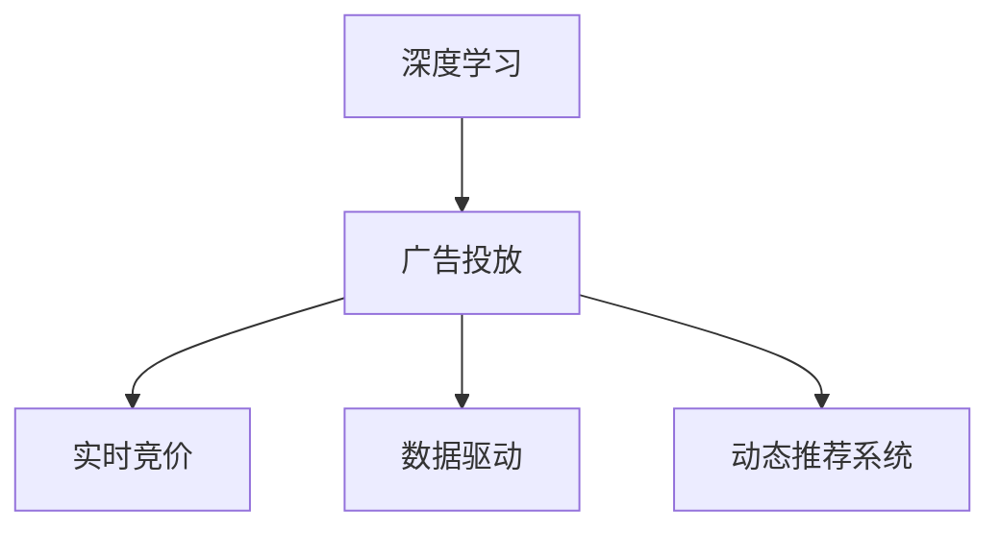

                 

## 1. 背景介绍

随着互联网和电子商务的飞速发展，广告投放已成为各大电商企业重要的营收手段。传统的广告投放系统往往缺乏实时性，难以根据用户的实时行为和市场动态灵活调整投放策略。而AI驱动的实时竞价广告投放系统，通过深度学习和大数据分析技术，实现了广告投放的实时化、智能化和精准化，显著提升了广告的转化率和ROI。

近年来，电商企业对广告投放的需求日益多样化，从最初的搜索引擎广告、展示广告，发展到现在的视频广告、原生广告、社交媒体广告等多种形式。不同的广告形式有其特定的投放策略和算法模型，但基本的实时竞价和精准投放需求是相通的。本文将系统介绍基于深度学习和大数据分析的实时竞价广告投放系统，包括其原理、实现和应用案例。

## 2. 核心概念与联系

### 2.1 核心概念概述

为了更好地理解实时竞价广告投放系统，我们需要了解几个核心概念：

- **深度学习**：一种基于神经网络的机器学习方法，通过多层神经网络结构进行特征提取和模式识别。
- **广告投放**：通过定向展示广告，吸引用户进行点击和转化，从而实现商业价值。
- **实时竞价(RTDP, Real-Time Bidding)**：指在广告展示的最后一刻，根据广告主和广告代理商的竞争出价，实时决定广告展示位置和投放策略的一种广告交易模式。
- **数据驱动**：通过分析历史数据和实时数据，进行广告投放的决策和优化。
- **动态推荐系统**：根据用户的行为和特征，实时推荐商品、广告等内容，提升用户体验和转化率。

这些核心概念之间的逻辑关系可以通过以下Mermaid流程图来展示：



这个流程图展示了深度学习在广告投放中的应用链条：

1. **广告投放**：基于用户行为数据和广告内容，进行广告展示和转化。
2. **实时竞价**：通过动态竞争出价，优化广告展示位置和时机。
3. **数据驱动**：通过分析历史和实时数据，优化广告投放策略。
4. **动态推荐系统**：根据用户行为实时推荐相关内容，提升广告点击率。

这些概念共同构成了实时竞价广告投放系统的技术框架，使其能够高效、灵活地进行广告投放决策。

## 3. 核心算法原理 & 具体操作步骤

### 3.1 算法原理概述

基于深度学习的实时竞价广告投放系统，主要包含以下几个核心模块：

1. **广告特征提取**：从广告和用户行为数据中提取有意义的特征。
2. **广告竞价模型**：通过深度学习模型进行广告出价竞拍。
3. **广告投放策略优化**：根据实时数据和竞价结果，动态调整广告投放策略。
4. **广告效果评估**：通过实时反馈数据，评估广告投放效果并进行优化。

这些模块相互配合，共同实现了广告投放的实时化和精准化。

### 3.2 算法步骤详解

#### 3.2.1 广告特征提取

广告特征提取是广告投放决策的基础。我们需要从广告内容和用户行为中，提取出有意义的特征，用于训练广告竞价模型。常见的广告特征包括：

- **广告属性**：广告的标题、描述、图片、URL等属性信息。
- **用户属性**：用户的年龄、性别、地理位置、行为偏好等。
- **环境属性**：广告展示时间、设备类型、网络环境等。

广告特征提取过程如下：

1. **数据收集**：收集广告和用户行为数据，进行预处理和清洗。
2. **特征编码**：将文本特征、时间特征、类别特征等进行编码，转化为机器学习模型可用的形式。
3. **特征选择**：通过特征选择算法（如Lasso、随机森林等），选出最有用的特征。

#### 3.2.2 广告竞价模型

广告竞价模型是广告投放决策的核心。我们通过深度学习模型（如CNN、RNN、LSTM等），训练出广告出价策略。常见的广告竞价模型包括：

- **基于深度学习的竞价模型**：使用神经网络模型进行广告出价，根据广告特征和用户行为预测出价策略。
- **基于规则的竞价模型**：基于专家经验和规则，进行广告竞价决策。
- **混合竞价模型**：结合基于深度学习和基于规则的竞价方法，综合考虑多个因素进行广告竞价。

广告竞价模型的训练过程如下：

1. **模型设计**：设计深度学习模型，确定输入和输出。
2. **数据划分**：将数据划分为训练集、验证集和测试集。
3. **模型训练**：使用训练集数据训练模型，调整超参数。
4. **模型评估**：在验证集和测试集上评估模型性能，进行参数调优。

#### 3.2.3 广告投放策略优化

广告投放策略优化是广告投放系统的重要环节。我们通过实时数据分析和机器学习模型，动态调整广告投放策略，以最大化广告效果。常见的广告投放策略优化方法包括：

- **A/B测试**：对不同广告投放策略进行A/B测试，找出最优策略。
- **动态调整**：根据实时数据和竞价结果，动态调整广告投放策略。
- **预算管理**：根据投放效果，动态调整广告投放预算。
- **受众细分**：根据用户行为和属性，进行受众细分，实现精准投放。

广告投放策略优化过程如下：

1. **数据采集**：实时采集广告投放数据和用户行为数据。
2. **数据处理**：对数据进行清洗和预处理，生成可用于模型训练的数据。
3. **模型训练**：使用深度学习模型训练投放策略优化模型。
4. **策略调整**：根据实时数据和模型输出，动态调整广告投放策略。

#### 3.2.4 广告效果评估

广告效果评估是广告投放系统的重要反馈环节。我们通过实时数据分析，评估广告投放效果，进行模型优化。常见的广告效果评估方法包括：

- **点击率**：广告展示后，用户点击的概率。
- **转化率**：用户点击广告后，进行购买的概率。
- **ROI**：广告投入和产出的比例，即广告投资的回报率。
- **成本效益**：广告投放成本与广告效果的比例。

广告效果评估过程如下：

1. **数据收集**：实时采集广告投放和用户行为数据。
2. **数据处理**：对数据进行清洗和预处理，生成可用于效果评估的数据。
3. **指标计算**：计算广告效果评估指标，如点击率、转化率等。
4. **模型优化**：根据效果评估指标，进行模型优化。

### 3.3 算法优缺点

基于深度学习的实时竞价广告投放系统，具有以下优点：

1. **实时性**：通过深度学习模型，可以快速处理和分析广告和用户行为数据，实现实时竞价和投放。
2. **精准性**：通过深度学习模型，能够挖掘广告和用户行为数据中的复杂关系，实现精准投放。
3. **自适应性**：深度学习模型能够根据数据变化，自动调整投放策略，实现动态优化。
4. **可扩展性**：深度学习模型具有强大的泛化能力，可以处理大规模广告投放场景。

同时，该系统也存在一些缺点：

1. **数据依赖性**：广告投放效果高度依赖于广告和用户行为数据的质量，数据缺失或不准确会导致投放效果差。
2. **计算资源消耗大**：深度学习模型需要大量的计算资源进行训练和推理，硬件成本较高。
3. **模型解释性差**：深度学习模型通常是"黑箱"，难以解释模型的决策过程。
4. **模型复杂度高**：深度学习模型参数较多，训练和调参较为复杂。

尽管存在这些局限性，但就目前而言，基于深度学习的实时竞价广告投放系统仍是广告投放领域的主流技术。未来相关研究的重点在于如何进一步降低计算资源消耗，提高模型可解释性，同时兼顾实时性和精准性。

### 3.4 算法应用领域

基于深度学习的实时竞价广告投放系统，已经在电商、金融、在线教育等多个领域得到广泛应用。以下是几个典型的应用场景：

- **电商广告投放**：通过分析用户行为数据，实时竞价广告投放，提升广告点击率和转化率。
- **金融产品推荐**：根据用户行为数据，实时竞价推荐金融产品，提升用户购买率和投资回报率。
- **在线教育课程推荐**：根据用户学习行为数据，实时竞价推荐课程内容，提升课程完成率和学生满意度。
- **医疗健康咨询**：根据用户健康数据，实时竞价推荐医疗健康服务，提升用户健康水平和满意度。

除了上述这些应用场景外，基于深度学习的实时竞价广告投放系统，还可以应用于更多场景中，如在线旅游、影视娱乐、社交媒体等，为各行业数字化转型升级提供新的技术路径。

## 4. 数学模型和公式 & 详细讲解 & 举例说明

### 4.1 数学模型构建

为了更好地理解基于深度学习的实时竞价广告投放系统，我们将在数学层面进行深入讲解。

假设广告投放系统需要处理的广告特征向量为 $X \in \mathbb{R}^{n_x}$，用户行为特征向量为 $Y \in \mathbb{R}^{n_y}$，广告竞价模型为 $f: \mathbb{R}^{n_x+n_y} \rightarrow \mathbb{R}^m$，其中 $m$ 表示竞价模型的输出维度。

广告竞价模型的目标是最小化预测竞价与实际竞价的差距，即：

$$
\min_{f} \mathbb{E}_{(X,Y)}\left[ \left( f(X,Y) - Y \right)^2 \right]
$$

其中 $\mathbb{E}_{(X,Y)}[\cdot]$ 表示对训练集的期望。

广告竞价模型的损失函数通常为均方误差损失函数：

$$
\mathcal{L}(f) = \frac{1}{N} \sum_{i=1}^{N} \left( f(X_i,Y_i) - Y_i \right)^2
$$

其中 $N$ 表示训练集的样本数量。

### 4.2 公式推导过程

广告竞价模型的训练过程如下：

1. **模型设计**：设计深度学习模型 $f$，确定输入和输出。
2. **数据划分**：将数据划分为训练集、验证集和测试集。
3. **模型训练**：使用训练集数据训练模型，调整超参数。
4. **模型评估**：在验证集和测试集上评估模型性能，进行参数调优。

以下是广告竞价模型的具体训练流程：

1. **数据准备**：将广告特征和用户行为特征拼接，生成训练样本。
2. **模型训练**：使用均方误差损失函数进行模型训练，更新模型参数。
3. **模型评估**：在验证集上计算模型预测与实际竞价的差距，进行参数调优。
4. **模型测试**：在测试集上计算模型预测与实际竞价的差距，评估模型效果。

### 4.3 案例分析与讲解

假设我们有一组广告和用户行为数据，广告特征为 $X$，用户行为特征为 $Y$。广告竞价模型为线性回归模型，训练过程如下：

1. **数据准备**：将广告特征和用户行为特征拼接，生成训练样本 $Z = [X, Y]$。
2. **模型训练**：使用均方误差损失函数进行模型训练，更新模型参数。
3. **模型评估**：在验证集上计算模型预测与实际竞价的差距，进行参数调优。
4. **模型测试**：在测试集上计算模型预测与实际竞价的差距，评估模型效果。

## 5. 项目实践：代码实例和详细解释说明

### 5.1 开发环境搭建

在进行实时竞价广告投放系统开发前，我们需要准备好开发环境。以下是使用Python进行TensorFlow开发的环境配置流程：

1. 安装Anaconda：从官网下载并安装Anaconda，用于创建独立的Python环境。

2. 创建并激活虚拟环境：
```bash
conda create -n tf-env python=3.8 
conda activate tf-env
```

3. 安装TensorFlow：根据CUDA版本，从官网获取对应的安装命令。例如：
```bash
conda install tensorflow tensorflow-gpu=cuda11.1 -c conda-forge
```

4. 安装各类工具包：
```bash
pip install numpy pandas scikit-learn matplotlib tqdm jupyter notebook ipython
```

完成上述步骤后，即可在`tf-env`环境中开始开发实践。

### 5.2 源代码详细实现

下面我们以电商广告投放为例，给出使用TensorFlow进行广告竞价模型训练的Python代码实现。

首先，定义广告特征和用户行为特征：

```python
import tensorflow as tf
from tensorflow.keras import layers

# 广告特征
X = tf.keras.layers.Input(shape=(n_x,))
# 用户行为特征
Y = tf.keras.layers.Input(shape=(n_y,))

# 拼接广告和用户行为特征
Z = tf.keras.layers.concatenate([X, Y])
```

然后，定义广告竞价模型：

```python
# 定义广告竞价模型
model = tf.keras.Sequential([
    # 添加一个DNN层
    layers.Dense(64, activation='relu', input_shape=(n_x+n_y,)),
    # 添加一个Dropout层
    layers.Dropout(0.5),
    # 添加一个输出层
    layers.Dense(m, activation='linear')
])
```

接着，定义优化器和损失函数：

```python
# 定义优化器
optimizer = tf.keras.optimizers.Adam()

# 定义损失函数
loss_fn = tf.keras.losses.MeanSquaredError()

# 定义广告竞价模型的编译
model.compile(optimizer=optimizer, loss=loss_fn)
```

最后，进行模型训练和评估：

```python
# 训练广告竞价模型
model.fit(X_train, Y_train, batch_size=batch_size, epochs=num_epochs, validation_data=(X_valid, Y_valid))

# 评估广告竞价模型
loss = model.evaluate(X_test, Y_test, batch_size=batch_size)
print(f'Test loss: {loss:.4f}')
```

以上就是使用TensorFlow进行广告竞价模型训练的完整代码实现。可以看到，通过TensorFlow的高级API，我们可以轻松实现广告竞价模型的训练和评估。

### 5.3 代码解读与分析

让我们再详细解读一下关键代码的实现细节：

**广告特征和用户行为特征**：
- 使用`tf.keras.layers.Input`定义广告特征和用户行为特征的输入层，指定其形状和数据类型。
- 使用`tf.keras.layers.concatenate`将广告特征和用户行为特征拼接，生成模型所需的输入数据。

**广告竞价模型**：
- 使用`tf.keras.Sequential`定义广告竞价模型的结构。
- 添加一个DNN层，作为广告竞价模型的隐藏层。
- 添加一个Dropout层，防止过拟合。
- 添加一个输出层，根据任务类型指定激活函数。

**优化器和损失函数**：
- 使用`tf.keras.optimizers.Adam`定义优化器，Adam优化器在深度学习中效果较好。
- 使用`tf.keras.losses.MeanSquaredError`定义均方误差损失函数，适合回归任务。

**模型训练和评估**：
- 使用`model.fit`方法进行模型训练，指定训练集、验证集、批量大小和训练轮数。
- 使用`model.evaluate`方法进行模型评估，计算测试集的损失。

可以看到，TensorFlow的API设计简洁高效，能够极大地提高代码开发效率。开发者可以通过代码模块化和组件化的方式，快速构建广告竞价模型，并进行训练和评估。

## 6. 实际应用场景

### 6.1 电商广告投放

基于深度学习的实时竞价广告投放系统，已经在电商广告投放中得到了广泛应用。电商企业通过分析用户行为数据，实时竞价广告投放，提升广告点击率和转化率。

具体而言，可以收集用户浏览、点击、购买等行为数据，提取和广告内容相关的特征，如广告标题、描述、价格等。通过深度学习模型，预测用户点击广告的概率，并实时竞价广告投放，动态调整广告展示位置和时机。

### 6.2 金融产品推荐

金融产品推荐是实时竞价广告投放系统的重要应用场景之一。金融机构通过分析用户行为数据，实时竞价推荐金融产品，提升用户购买率和投资回报率。

具体而言，可以收集用户投资行为数据，提取和产品相关的特征，如产品类型、收益率、风险等级等。通过深度学习模型，预测用户对不同金融产品的购买概率，并实时竞价推荐，动态调整推荐策略。

### 6.3 在线教育课程推荐

在线教育课程推荐是实时竞价广告投放系统的另一个重要应用场景。在线教育平台通过分析用户学习行为数据，实时竞价推荐课程内容，提升课程完成率和学生满意度。

具体而言，可以收集用户学习行为数据，提取和课程相关的特征，如课程内容、难度等级、用户学习进度等。通过深度学习模型，预测用户对不同课程的兴趣度，并实时竞价推荐，动态调整推荐策略。

### 6.4 未来应用展望

随着深度学习和大数据分析技术的不断进步，基于深度学习的实时竞价广告投放系统将有更广阔的应用前景。

未来，广告投放系统将更加注重个性化推荐和实时竞价，实现更加精准、灵活的广告投放。同时，广告投放系统将更加注重用户体验和广告效果，通过实时数据分析和深度学习模型，优化广告投放策略，提升广告转化率。

## 7. 工具和资源推荐

### 7.1 学习资源推荐

为了帮助开发者系统掌握深度学习和大数据分析技术，以下是几个优质的学习资源：

1. 《深度学习》书籍：由深度学习领域的权威专家撰写，详细介绍了深度学习的基本原理和算法。
2. 《TensorFlow实战》书籍：由TensorFlow团队的资深开发者撰写，介绍了TensorFlow的高级API和应用场景。
3. 《机器学习实战》书籍：由机器学习领域的知名专家撰写，详细介绍了机器学习的基本概念和算法。
4. CS231n《卷积神经网络》课程：斯坦福大学开设的计算机视觉课程，涵盖了卷积神经网络的基础和高级应用。
5. Coursera《机器学习》课程：由斯坦福大学教授Andrew Ng开设的机器学习课程，有Lecture视频和配套作业。

通过对这些资源的学习实践，相信你一定能够快速掌握深度学习和大数据分析技术，并用于解决实际的广告投放问题。

### 7.2 开发工具推荐

高效的开发离不开优秀的工具支持。以下是几款用于广告投放系统开发的常用工具：

1. TensorFlow：由Google主导开发的开源深度学习框架，生产部署方便，适合大规模工程应用。
2. PyTorch：基于Python的开源深度学习框架，灵活动态的计算图，适合快速迭代研究。
3. Jupyter Notebook：轻量级的交互式编程环境，支持Python、R等多种语言，适合快速实验和开发。
4. Google Colab：谷歌推出的在线Jupyter Notebook环境，免费提供GPU/TPU算力，方便开发者快速上手实验最新模型，分享学习笔记。

合理利用这些工具，可以显著提升广告投放系统的开发效率，加快创新迭代的步伐。

### 7.3 相关论文推荐

广告投放系统的研究源于学界的持续研究。以下是几篇奠基性的相关论文，推荐阅读：

1. The NetMF: A Neural Network Approach to Personalized Ranking by Yao and McSherry（NetMF论文）：提出了NetMF模型，用于个性化推荐系统中的排名问题，是广告竞价模型的先驱。
2. Online Learning of Matrix Factorization by Reches and Zinakoff（在线矩阵分解论文）：提出了在线矩阵分解算法，用于个性化推荐系统中的用户行为预测，为广告竞价模型的优化提供了理论基础。
3. Deep Learning in Recommendation Systems by Brunskill et al.（深度学习在推荐系统中的应用）：介绍了深度学习在推荐系统中的应用，包括广告竞价模型的优化和改进。

这些论文代表了大数据和深度学习技术在广告投放领域的最新进展。通过学习这些前沿成果，可以帮助研究者把握学科前进方向，激发更多的创新灵感。

## 8. 总结：未来发展趋势与挑战

### 8.1 研究成果总结

本文对基于深度学习的实时竞价广告投放系统进行了全面系统的介绍。首先阐述了广告投放的需求背景和深度学习的优势，明确了深度学习在广告投放决策中的核心地位。其次，从原理到实践，详细讲解了广告竞价模型的构建、训练和评估过程，给出了广告投放系统的完整代码实例。同时，本文还广泛探讨了广告投放系统在电商、金融、在线教育等多个行业领域的应用前景，展示了深度学习技术的广阔应用前景。

通过本文的系统梳理，可以看到，基于深度学习的广告投放系统正在成为广告投放领域的重要技术范式，极大地提升了广告投放的实时性、精准性和效果。未来，伴随深度学习和大数据分析技术的不断进步，广告投放系统必将更加智能化、个性化和实时化，为广告主带来更高的投资回报率。

### 8.2 未来发展趋势

展望未来，广告投放系统将呈现以下几个发展趋势：

1. **实时化**：广告投放系统将更加注重实时性和动态优化，根据用户行为和市场变化，实时调整投放策略。
2. **个性化**：广告投放系统将更加注重个性化推荐和精准投放，通过深度学习模型，实现更加灵活、高效的用户行为预测。
3. **多样化**：广告投放系统将更加多样化，覆盖更多的广告形式和广告平台，如视频广告、原生广告、社交媒体广告等。
4. **智能化**：广告投放系统将更加智能化，通过数据分析和机器学习模型，实现更加智能化的决策和优化。
5. **可解释性**：广告投放系统将更加注重可解释性，通过模型的可视化工具和解释方法，增强模型的透明度和可信度。

以上趋势凸显了广告投放系统的广阔前景。这些方向的探索发展，必将进一步提升广告投放系统的性能和应用范围，为广告主和用户带来更高的投资回报和更优质的用户体验。

### 8.3 面临的挑战

尽管基于深度学习的广告投放系统已经取得了瞩目成就，但在迈向更加智能化、普适化应用的过程中，它仍面临着诸多挑战：

1. **数据依赖性**：广告投放效果高度依赖于广告和用户行为数据的质量，数据缺失或不准确会导致投放效果差。
2. **计算资源消耗大**：深度学习模型需要大量的计算资源进行训练和推理，硬件成本较高。
3. **模型复杂度高**：深度学习模型参数较多，训练和调参较为复杂。
4. **模型解释性差**：深度学习模型通常是"黑箱"，难以解释模型的决策过程。
5. **广告投放风险**：广告投放系统可能面临欺诈、点击欺诈等风险，需要加强数据验证和模型监控。

尽管存在这些局限性，但就目前而言，基于深度学习的广告投放系统仍是广告投放领域的主流技术。未来相关研究的重点在于如何进一步降低计算资源消耗，提高模型可解释性，同时兼顾实时性和精准性。

### 8.4 研究展望

面对广告投放系统面临的种种挑战，未来的研究需要在以下几个方面寻求新的突破：

1. **数据增强**：通过数据增强技术，扩充广告和用户行为数据，提高模型的泛化能力。
2. **模型优化**：开发更加高效的广告竞价模型，减少计算资源消耗，提高模型训练速度。
3. **可解释性**：引入可解释性方法，增强广告投放系统的透明度和可信度。
4. **风险控制**：通过数据验证和模型监控，降低广告投放风险，提高系统鲁棒性。
5. **多模态融合**：将深度学习模型与其他模态的数据融合，提升广告投放系统的全面性。

这些研究方向的探索，必将引领广告投放系统迈向更高的台阶，为广告主和用户带来更高的投资回报和更优质的用户体验。面向未来，广告投放系统需要从数据、模型、工程、业务等多个维度协同发力，才能真正实现智能化、个性化和实时化的广告投放。

## 9. 附录：常见问题与解答

**Q1：什么是深度学习？**

A: 深度学习是一种基于神经网络的机器学习方法，通过多层神经网络结构进行特征提取和模式识别。深度学习在图像识别、语音识别、自然语言处理等领域取得了显著的成果。

**Q2：深度学习在广告投放中的优势是什么？**

A: 深度学习在广告投放中的优势主要包括：
1. **实时性**：通过深度学习模型，可以快速处理和分析广告和用户行为数据，实现实时竞价和投放。
2. **精准性**：通过深度学习模型，能够挖掘广告和用户行为数据中的复杂关系，实现精准投放。
3. **自适应性**：深度学习模型能够根据数据变化，自动调整投放策略，实现动态优化。
4. **可扩展性**：深度学习模型具有强大的泛化能力，可以处理大规模广告投放场景。

**Q3：如何优化广告竞价模型的性能？**

A: 优化广告竞价模型的性能可以从以下几个方面入手：
1. **特征选择**：通过特征选择算法（如Lasso、随机森林等），选出最有用的特征。
2. **模型结构**：调整深度学习模型的结构，增加或减少隐藏层数量、神经元数量等。
3. **超参数调优**：通过网格搜索、随机搜索等方法，优化模型的超参数。
4. **正则化**：使用L2正则、Dropout等正则化技术，防止过拟合。
5. **数据增强**：通过回译、近义替换等方式扩充训练集，提高模型的泛化能力。

这些方法可以结合使用，最大化广告竞价模型的性能。

**Q4：广告投放系统如何确保数据安全性？**

A: 广告投放系统确保数据安全性可以从以下几个方面入手：
1. **数据加密**：对广告和用户行为数据进行加密，防止数据泄露。
2. **访问控制**：设置数据访问权限，只有授权人员才能访问数据。
3. **数据备份**：定期备份数据，防止数据丢失或损坏。
4. **安全监控**：设置数据访问日志，监控数据访问行为，防止异常操作。
5. **安全培训**：对系统管理员和操作人员进行安全培训，提高安全意识。

通过以上措施，可以有效保护广告投放系统的数据安全性。

**Q5：广告投放系统如何应对欺诈行为？**

A: 广告投放系统应对欺诈行为可以从以下几个方面入手：
1. **数据验证**：对广告点击和转化数据进行验证，防止欺诈行为。
2. **模型监控**：设置模型监控机制，实时监控广告投放效果，发现异常行为。
3. **规则引擎**：引入规则引擎，设置欺诈检测规则，自动检测并拦截欺诈行为。
4. **人工干预**：设置人工干预机制，对可疑行为进行人工审核，提高系统鲁棒性。

通过以上措施，可以有效防范广告投放系统中的欺诈行为，保障系统的安全和稳定运行。

**Q6：广告投放系统如何应对用户隐私保护？**

A: 广告投放系统应对用户隐私保护可以从以下几个方面入手：
1. **匿名化处理**：对用户行为数据进行匿名化处理，防止个人信息泄露。
2. **隐私保护算法**：使用隐私保护算法（如差分隐私、联邦学习等），保护用户隐私。
3. **用户同意**：在收集用户数据前，获取用户同意，保护用户隐私权益。
4. **透明度**：公开广告投放系统的数据使用规则，增强用户透明度和信任度。

通过以上措施，可以有效保护用户隐私，增强广告投放系统的合法性和合规性。

**Q7：广告投放系统如何应对多模态数据融合？**

A: 广告投放系统应对多模态数据融合可以从以下几个方面入手：
1. **数据同步**：对不同模态的数据进行同步，保持数据一致性。
2. **特征融合**：将不同模态的数据特征进行融合，生成统一的特征向量。
3. **模型融合**：将不同模态的模型进行融合，提升广告投放系统的全面性。
4. **数据标注**：对多模态数据进行标注，提高数据质量和模型性能。
5. **数据清洗**：对多模态数据进行清洗，去除噪声和冗余数据。

通过以上措施，可以有效应对多模态数据的融合，提升广告投放系统的全面性和准确性。

**Q8：广告投放系统如何应对广告投放风险？**

A: 广告投放系统应对广告投放风险可以从以下几个方面入手：
1. **风险评估**：对广告投放风险进行评估，识别潜在的风险因素。
2. **风险控制**：设置风险控制机制，防止高风险广告的投放。
3. **数据验证**：对广告投放数据进行验证，防止欺诈行为。
4. **规则引擎**：引入规则引擎，设置风险控制规则，自动检测并拦截风险行为。
5. **人工干预**：设置人工干预机制，对高风险广告进行人工审核，提高系统鲁棒性。

通过以上措施，可以有效应对广告投放风险，保障系统的安全和稳定运行。

---

作者：禅与计算机程序设计艺术 / Zen and the Art of Computer Programming

