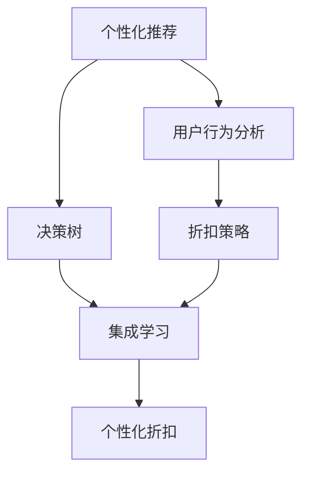

                 

# AI驱动的电商平台个性化折扣策略

> 关键词：个性化推荐,电商平台,用户行为分析,决策树,折扣策略,集成学习

## 1. 背景介绍

在数字经济时代，电子商务平台作为连接消费者与商家的桥梁，越来越受到企业的重视。根据相关报告，我国电商市场规模已突破4万亿，预计未来仍将保持两位数增长。然而，面对激烈的市场竞争和用户需求的复杂多样性，如何提升用户体验，增加销售额，成为电商企业亟待解决的问题。

个性化推荐技术的兴起，为电商平台提供了解决这一问题的有效手段。通过分析用户的购买历史、浏览行为、评分反馈等数据，电商平台可以精准预测用户偏好，从而提供更加个性化、贴合需求的商品推荐。然而，单纯的商品推荐并不能完全满足用户的消费需求。很多时候，用户希望在特定条件下获得更高的折扣，以获得更优的消费体验。因此，如何设计合理的个性化折扣策略，成为电商企业亟待解决的又一难题。

## 2. 核心概念与联系

### 2.1 核心概念概述

本节将介绍几个与个性化折扣策略密切相关的核心概念：

- **个性化推荐**：根据用户的历史行为数据，预测用户对商品的偏好，并提供最符合用户需求的商品推荐。
- **用户行为分析**：通过分析用户的浏览历史、点击行为、购物车操作、评价反馈等数据，了解用户的兴趣和需求。
- **决策树**：一种常见的机器学习模型，用于分类和预测，通过树形结构分解数据，并基于特征对数据进行分类。
- **折扣策略**：根据不同用户或商品的特点，设计差异化的折扣方案，以提高用户的购买意愿和满意度。
- **集成学习**：结合多种模型或算法的优势，通过投票或加权融合，提升模型的整体性能和泛化能力。

这些核心概念共同构成了电商平台个性化折扣策略的基础，其逻辑关系可通过以下Mermaid流程图来展示：



该流程图展示了各概念之间的联系：个性化推荐和用户行为分析共同构成了个性化折扣的基础，通过决策树模型预测用户对不同折扣策略的反应，最终通过集成学习提升折扣策略的准确性和鲁棒性。

## 3. 核心算法原理 & 具体操作步骤

### 3.1 算法原理概述

个性化折扣策略的实现过程，实际上是利用机器学习技术，基于用户行为和商品属性，动态生成个性化折扣的过程。具体而言，可以分成以下几个步骤：

1. **数据收集与预处理**：收集用户的购买历史、浏览行为、评分反馈等数据，并进行清洗、归一化、特征工程等预处理。
2. **用户行为分析**：利用统计分析、聚类算法等方法，提取用户的兴趣偏好和行为特征。
3. **决策树模型训练**：基于用户行为特征，构建决策树模型，预测用户对不同折扣策略的反应。
4. **折扣策略优化**：结合历史数据和当前预测结果，利用集成学习算法优化折扣策略。
5. **个性化折扣应用**：根据用户特征和预测结果，动态生成个性化折扣，并推送给用户。

### 3.2 算法步骤详解

**步骤1：数据收集与预处理**

电商平台需要收集用户的多维度行为数据，包括但不限于以下数据：

- **历史购买数据**：用户的购买记录，包括购买时间、商品ID、商品价格、折扣力度等信息。
- **浏览行为数据**：用户的浏览记录，包括浏览时间、浏览商品ID、浏览页面停留时间等信息。
- **评分反馈数据**：用户对商品的评分信息，用于评价用户对商品的喜好程度。
- **社交网络数据**：用户的社交关系、评论信息等，用于了解用户的兴趣和需求。

收集数据后，需要进行以下预处理操作：

- **数据清洗**：去除缺失值、异常值和重复数据，保证数据质量。
- **归一化**：将不同维度的数据归一化到[0,1]范围内，方便模型处理。
- **特征工程**：提取和构造用户行为特征，如浏览频率、购买频率、评分平均值等。

**步骤2：用户行为分析**

用户行为分析是构建个性化折扣策略的基础，通过分析用户的行为特征，可以更精准地预测用户的购买意愿和折扣敏感度。具体而言，可以使用以下方法：

- **统计分析**：统计用户在不同商品类别、折扣条件下的购买比例、点击率、浏览时间等，了解用户的兴趣偏好和行为模式。
- **聚类算法**：利用K-means、层次聚类等方法，将用户分成不同的群体，分析每个群体的特征和需求。
- **关联规则**：利用Apriori、FP-growth等关联规则算法，挖掘用户的购买行为和兴趣关联，构建用户画像。

**步骤3：决策树模型训练**

决策树模型可以很好地处理分类问题，基于用户的行为特征，预测用户对不同折扣策略的反应。具体步骤如下：

- **特征选择**：选择对用户购买行为有重要影响的特征，如浏览次数、购买频率、商品评分等。
- **模型训练**：使用CART、C4.5等决策树算法，训练决策树模型，预测用户对不同折扣策略的反应。
- **模型评估**：利用交叉验证、ROC曲线等方法，评估模型的性能和泛化能力。

**步骤4：折扣策略优化**

通过决策树模型，我们可以得到用户对不同折扣策略的反应，但模型预测结果可能存在误差。因此，需要结合历史数据和当前预测结果，进行折扣策略的优化。具体而言，可以采用以下方法：

- **回归分析**：利用线性回归、岭回归等算法，预测用户在不同折扣条件下的购买概率，优化折扣策略。
- **集成学习**：通过Adaboost、Bagging等集成学习方法，结合多种模型的预测结果，提升折扣策略的准确性和鲁棒性。
- **强化学习**：基于用户的反馈信息，通过Q-learning、SARSA等强化学习算法，动态调整折扣策略，优化用户满意度。

**步骤5：个性化折扣应用**

个性化折扣策略的最终应用，是根据用户特征和预测结果，动态生成个性化折扣，并推送给用户。具体步骤如下：

- **用户特征提取**：根据用户的历史行为数据，提取用户的兴趣偏好、购买行为等特征。
- **折扣策略生成**：基于用户的特征和预测结果，生成个性化的折扣策略，如满减、折扣券等。
- **折扣策略推送**：将个性化折扣推送给用户，并提供相应的折扣应用提示。

### 3.3 算法优缺点

个性化折扣策略的优势在于：

- **提升用户满意度**：通过个性化折扣，满足用户在不同情境下的需求，提高用户的购买意愿和满意度。
- **优化库存管理**：通过个性化推荐和折扣策略，优化库存管理和商品陈列，提高商品的销售量和转化率。
- **增加用户黏性**：个性化折扣策略可以提升用户对平台的黏性，增加用户复购率和生命周期价值。

然而，该策略也存在一些缺点：

- **数据依赖性强**：个性化折扣策略的精度和效果依赖于用户数据的完整性和质量。
- **模型复杂度高**：需要构建多个机器学习模型，进行特征选择和融合，增加了模型的复杂度和训练成本。
- **用户隐私问题**：用户数据的收集和使用需要遵循隐私保护政策，避免侵犯用户隐私。

### 3.4 算法应用领域

个性化折扣策略不仅适用于电商领域，还可以广泛应用于金融、旅游、餐饮等多个行业。例如：

- **金融行业**：利用用户的历史交易记录和行为数据，设计个性化的理财产品和折扣方案，提升用户体验和产品销售。
- **旅游行业**：根据用户的浏览记录和评价反馈，设计个性化的旅游线路和折扣策略，满足用户的旅游需求。
- **餐饮行业**：分析用户的点餐记录和消费习惯，设计个性化的餐饮推荐和折扣方案，提高用户的就餐体验。

## 4. 数学模型和公式 & 详细讲解 & 举例说明

### 4.1 数学模型构建

假设用户的历史行为数据为 $D=\{(x_i, y_i)\}_{i=1}^N$，其中 $x_i$ 为用户的特征向量，$y_i$ 为用户在不同折扣策略下的反应。个性化折扣策略的数学模型可以表示为：

$$
y_i = f(x_i; \theta)
$$

其中 $f$ 为决策树模型，$\theta$ 为模型参数。

### 4.2 公式推导过程

决策树模型的一般形式为：

$$
f(x_i; \theta) = \sum_{t=1}^m \alpha_t \mathbf{1}(x_i \in T_t)
$$

其中 $\alpha_t$ 为决策树节点的权重，$T_t$ 为决策树的第 $t$ 个节点。

具体推导过程如下：

1. **特征选择**：通过特征选择算法，从所有特征中选择最重要的特征 $F$。
2. **模型训练**：基于用户行为数据 $D$ 和选择的特征 $F$，训练决策树模型 $f$。
3. **预测生成**：利用训练好的决策树模型，对用户特征 $x_i$ 进行预测，得到用户对不同折扣策略的反应 $y_i$。

### 4.3 案例分析与讲解

假设有一个电商平台，收集了用户的购买历史、浏览行为和评分反馈数据。利用上述方法，电商平台可以构建个性化折扣策略：

1. **数据收集与预处理**：收集用户的购买历史、浏览行为和评分反馈数据，并进行清洗、归一化、特征工程等预处理。
2. **用户行为分析**：利用统计分析和聚类算法，分析用户的兴趣偏好和行为特征。
3. **决策树模型训练**：基于用户行为特征，训练决策树模型，预测用户对不同折扣策略的反应。
4. **折扣策略优化**：结合历史数据和当前预测结果，利用集成学习算法优化折扣策略。
5. **个性化折扣应用**：根据用户特征和预测结果，动态生成个性化折扣，并推送给用户。

## 5. 项目实践：代码实例和详细解释说明

### 5.1 开发环境搭建

在进行项目实践前，需要搭建好开发环境。以下是使用Python进行电商推荐系统的开发环境配置流程：

1. 安装Anaconda：从官网下载并安装Anaconda，用于创建独立的Python环境。

2. 创建并激活虚拟环境：
```bash
conda create -n e-commerce python=3.8 
conda activate e-commerce
```

3. 安装相关库：
```bash
pip install pandas numpy scikit-learn transformers
```

4. 安装AWS CLI：安装AWS CLI，方便访问和操作AWS云服务。

5. 安装AWS SDK for Python：安装AWS SDK for Python，方便在Python中进行云服务操作。

6. 安装AWS S3库：安装AWS S3库，方便进行数据存储和下载。

完成上述步骤后，即可在`e-commerce`环境中开始项目实践。

### 5.2 源代码详细实现

这里我们以用户行为分析为例，给出使用Pandas库对用户行为数据进行分析的PyTorch代码实现。

```python
import pandas as pd
import numpy as np

# 加载用户行为数据
user_data = pd.read_csv('user_behavior_data.csv')

# 数据清洗
user_data = user_data.dropna()
user_data = user_data.drop_duplicates()

# 特征工程
user_data['user_id'] = user_data['user_id'].astype(str)
user_data['product_id'] = user_data['product_id'].astype(str)
user_data['product_category'] = user_data['product_category'].astype(str)
user_data['purchase_time'] = user_data['purchase_time'].astype(np.datetime64)

# 数据归一化
user_data['purchase_time'] = user_data['purchase_time'].apply(lambda x: (x - user_data['purchase_time'].min()) / (user_data['purchase_time'].max() - user_data['purchase_time'].min()))
user_data['purchase_time'] = user_data['purchase_time'].astype(np.float32)

# 计算用户行为特征
user_data['purchase_frequency'] = user_data['purchase_frequency'].astype(np.float32)
user_data['purchase_amount'] = user_data['purchase_amount'].astype(np.float32)
user_data['average_rating'] = user_data['average_rating'].astype(np.float32)

# 数据可视化
user_data.pivot_table(index='user_id', columns='product_category', values='purchase_frequency', aggfunc='sum')
```

### 5.3 代码解读与分析

让我们再详细解读一下关键代码的实现细节：

**数据加载与清洗**：
- `pd.read_csv()`方法：用于加载用户行为数据。
- `dropna()`和`drop_duplicates()`方法：用于去除缺失值和重复数据，保证数据质量。

**特征工程**：
- `astype()`方法：将数据类型转换为字符串或浮点数，方便后续处理。
- `apply()`方法：使用自定义函数对购买时间进行归一化处理。

**数据归一化**：
- `np.datetime64`类型：用于表示时间戳，方便后续处理。
- `lambda`函数：定义一个匿名函数，对购买时间进行归一化处理。

**数据可视化**：
- `pivot_table()`方法：通过透视表对用户行为数据进行可视化。

以上代码展示了用户行为分析的基础实现，可以进一步进行用户聚类、关联规则挖掘等分析工作。

## 6. 实际应用场景

### 6.1 智能客服

智能客服系统可以基于用户的历史行为数据，设计个性化的折扣策略，提升用户体验和满意度。具体而言，可以收集用户的浏览记录、购买记录和反馈信息，利用决策树模型和集成学习算法，设计个性化折扣方案，并推送给用户。例如，对于经常浏览某类商品的潜在用户，可以推送满减折扣、折扣券等优惠活动。

### 6.2 个性化推荐

电商平台可以利用用户的浏览和购买历史数据，设计个性化的推荐算法。基于用户的兴趣偏好和行为特征，设计个性化的推荐商品和折扣策略，提升用户的购买意愿和满意度。例如，对于浏览过某类商品但未购买的潜在用户，可以推荐该类商品的满减活动或优惠券，引导用户进行购买。

### 6.3 库存管理

通过个性化折扣策略，电商平台可以优化库存管理和商品陈列。根据用户的历史行为数据，设计个性化的库存管理方案，提升商品的销售量和转化率。例如，对于经常购买某类商品的活跃用户，可以提供更多的库存和折扣活动，提高商品的销售量。

### 6.4 未来应用展望

随着技术的发展，个性化折扣策略将不断得到优化和完善。未来的发展趋势可能包括以下几个方面：

1. **实时化推荐**：通过实时数据流处理技术，实现个性化折扣的动态生成和推送，提高用户满意度和转化率。
2. **多模态融合**：结合文本、图像、音频等多模态数据，提升个性化折扣策略的准确性和鲁棒性。
3. **跨领域应用**：将个性化折扣策略应用于更多行业，如金融、旅游、餐饮等，提高各个领域的业务效果。
4. **AI与业务融合**：将人工智能技术与业务需求紧密结合，提升个性化折扣策略的实用性和可操作性。

## 7. 工具和资源推荐

### 7.1 学习资源推荐

为了帮助开发者系统掌握个性化折扣策略的理论基础和实践技巧，这里推荐一些优质的学习资源：

1. **《机器学习实战》书籍**：介绍了机器学习的基本原理和应用，涵盖分类、回归、聚类等多个算法，适合初学者入门。
2. **Kaggle平台**：提供大量数据分析和机器学习竞赛，通过实战练习，提升技能水平。
3. **Coursera平台**：提供多种机器学习和数据科学课程，涵盖经典算法和前沿技术。
4. **Github代码库**：提供大量的机器学习和数据科学项目代码，可以参考学习。

通过对这些资源的学习实践，相信你一定能够快速掌握个性化折扣策略的精髓，并用于解决实际的电商问题。

### 7.2 开发工具推荐

为了提升个性化折扣策略的开发效率，以下是几款常用的开发工具：

1. **Jupyter Notebook**：用于编写和运行Python代码，支持可视化展示和代码注释，方便开发和调试。
2. **AWS SageMaker**：提供云上机器学习平台，支持模型训练、部署和优化，适合企业级开发。
3. **TensorFlow**：开源深度学习框架，支持高效的模型训练和推理，适合大规模数据处理。
4. **Scikit-learn**：提供多种机器学习算法和工具，方便数据预处理和模型训练。
5. **Pandas**：提供数据处理和分析功能，方便数据清洗和特征工程。

合理利用这些工具，可以显著提升个性化折扣策略的开发效率，加速创新迭代的步伐。

### 7.3 相关论文推荐

个性化折扣策略的研究源于学界的持续探索，以下是几篇奠基性的相关论文，推荐阅读：

1. **《推荐系统：构建个性化的应用》书籍**：介绍了推荐系统的基本原理和应用，涵盖协同过滤、矩阵分解等多个算法。
2. **《个性化推荐系统》论文**：介绍了个性化推荐系统的构建方法和应用，涵盖用户画像、推荐算法等多个方面。
3. **《实时推荐系统》论文**：介绍了实时推荐系统的构建方法和应用，涵盖数据流处理、实时推荐等多个技术。

这些论文代表了个性化折扣策略的发展脉络，通过学习这些前沿成果，可以帮助研究者把握学科前进方向，激发更多的创新灵感。

## 8. 总结：未来发展趋势与挑战

### 8.1 总结

本文对基于个性化推荐和折扣策略的电商系统进行了全面系统的介绍。首先阐述了电商平台的背景和个性化推荐的重要性，明确了个性化折扣策略在提升用户满意度和销售转化方面的独特价值。其次，从原理到实践，详细讲解了个性化折扣策略的数学模型和关键步骤，给出了电商推荐系统的完整代码实现。同时，本文还探讨了个性化折扣策略在智能客服、个性化推荐、库存管理等多个电商场景中的应用前景，展示了个性化折扣策略的巨大潜力。此外，本文精选了个性化折扣策略的学习资源、开发工具和相关论文，力求为读者提供全方位的技术指引。

通过本文的系统梳理，可以看到，基于个性化推荐和折扣策略的电商系统为电商平台提供了更加灵活、精准的用户体验优化方案，进一步推动了电商平台的业务发展和用户满意度的提升。未来，伴随电商技术的不断进步，个性化推荐和折扣策略必将在电商行业中发挥更加重要的作用，为电商平台的数字化转型注入新的动力。

### 8.2 未来发展趋势

展望未来，个性化推荐和折扣策略将呈现以下几个发展趋势：

1. **实时化推荐**：通过实时数据流处理技术，实现个性化折扣的动态生成和推送，提高用户满意度和转化率。
2. **多模态融合**：结合文本、图像、音频等多模态数据，提升个性化折扣策略的准确性和鲁棒性。
3. **跨领域应用**：将个性化折扣策略应用于更多行业，如金融、旅游、餐饮等，提高各个领域的业务效果。
4. **AI与业务融合**：将人工智能技术与业务需求紧密结合，提升个性化折扣策略的实用性和可操作性。

### 8.3 面临的挑战

尽管个性化推荐和折扣策略已经取得了显著成效，但在迈向更加智能化、普适化应用的过程中，它仍面临一些挑战：

1. **数据质量问题**：用户数据的完整性和质量直接影响推荐和折扣策略的精度，数据清洗和预处理需要投入大量资源。
2. **模型复杂性**：个性化推荐和折扣策略需要构建多个机器学习模型，模型复杂度高，训练和部署成本较高。
3. **用户隐私保护**：用户数据的收集和使用需要遵循隐私保护政策，避免侵犯用户隐私。
4. **业务融合难度**：个性化推荐和折扣策略需要与业务系统紧密结合，技术难度和协调难度较大。

### 8.4 研究展望

面对个性化推荐和折扣策略所面临的挑战，未来的研究需要在以下几个方面寻求新的突破：

1. **数据质量提升**：提高用户数据的完整性和质量，增强数据的可解释性和可操作性。
2. **模型简化优化**：通过模型简化和优化，降低训练和部署成本，提升模型的实时性和可扩展性。
3. **隐私保护增强**：采用匿名化、差分隐私等技术，增强用户数据隐私保护，提升用户信任度。
4. **业务融合深化**：将个性化推荐和折扣策略与业务系统深度融合，提升业务效果和用户体验。

这些研究方向的探索，必将引领个性化推荐和折扣策略的技术进步，为电商平台的数字化转型提供更加有力支持。总之，个性化推荐和折扣策略需要不断创新和优化，方能在电商行业中发挥更大的作用，推动电商平台的持续发展和用户满意度的不断提升。

## 9. 附录：常见问题与解答

**Q1：个性化推荐和折扣策略是否适用于所有电商场景？**

A: 个性化推荐和折扣策略在大多数电商场景中都能取得不错的效果，特别是在数据量较大的场景下。但对于一些特定领域的电商，如生鲜电商、直播电商等，仅仅依靠用户行为数据可能难以实现精准推荐。此时需要结合实时数据、专家知识等多方面信息，设计个性化的推荐和折扣策略。

**Q2：如何设计合理的个性化折扣策略？**

A: 个性化折扣策略的设计需要考虑多个因素，包括但不限于以下方面：
1. **用户画像**：通过用户的历史行为数据，提取用户的兴趣偏好和行为特征。
2. **商品属性**：分析商品的属性、销量、评价等信息，了解商品的特征和市场需求。
3. **市场环境**：考虑市场竞争、季节性因素、节假日等，制定合理的折扣策略。
4. **模型优化**：利用机器学习算法，对模型进行训练和优化，提升折扣策略的精度和效果。

**Q3：个性化推荐和折扣策略的评估方法有哪些？**

A: 个性化推荐和折扣策略的评估方法包括但不限于以下几种：
1. **准确率和召回率**：用于评估推荐系统的精度和召回率。
2. **点击率**：用于评估推荐系统的点击效果，衡量用户的互动率。
3. **转化率**：用于评估推荐系统的转化效果，衡量用户的购买率。
4. **A/B测试**：通过A/B测试对比不同策略的效果，选择合适的推荐和折扣方案。

**Q4：如何降低个性化推荐和折扣策略的计算成本？**

A: 降低个性化推荐和折扣策略的计算成本，可以考虑以下几种方法：
1. **模型压缩**：通过剪枝、量化等方法，降低模型的计算量和内存消耗。
2. **分布式计算**：利用分布式计算框架，将计算任务分配到多个节点上，提高计算效率。
3. **增量更新**：利用增量学习技术，定期更新模型，减少计算成本。

这些方法可以在保证个性化推荐和折扣策略效果的同时，降低计算成本，提高系统的可扩展性和实时性。

**Q5：个性化推荐和折扣策略在实际应用中需要注意哪些问题？**

A: 个性化推荐和折扣策略在实际应用中，需要注意以下问题：
1. **数据隐私**：用户数据的收集和使用需要遵循隐私保护政策，避免侵犯用户隐私。
2. **模型鲁棒性**：需要考虑模型的鲁棒性，避免模型过拟合或出现异常。
3. **用户反馈**：通过用户反馈数据，及时调整推荐和折扣策略，提升用户体验。
4. **算法公平性**：保证推荐和折扣策略的公平性，避免算法偏见或歧视。

总之，个性化推荐和折扣策略需要综合考虑多个因素，从数据、模型、业务等多个维度进行全面优化，方能实现良好的效果。

---

作者：禅与计算机程序设计艺术 / Zen and the Art of Computer Programming

