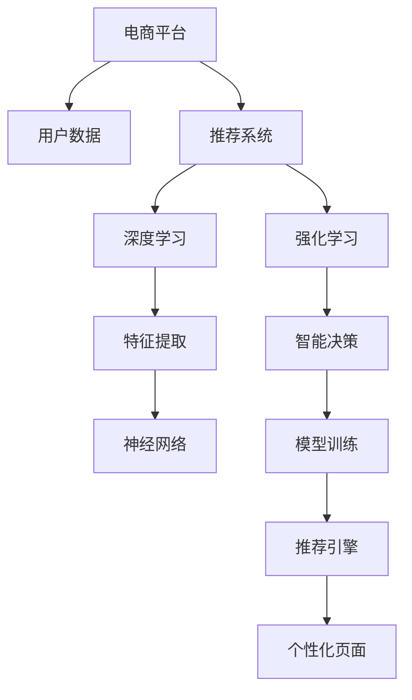

                 

# AI驱动的电商平台个性化页面布局

> 关键词：人工智能, 电商平台, 个性化推荐, 页面布局, 用户行为分析, 深度学习, 神经网络, 决策树, 线性回归, 强化学习, 分布式计算

## 1. 背景介绍

### 1.1 问题由来
随着互联网技术的不断发展和电子商务市场的日益成熟，消费者对购物体验的期望日益提升。个性化推荐成为电商平台提升用户体验、增强用户粘性的重要手段。传统的推荐系统主要基于用户历史行为和商品特征，难以充分理解用户真实需求和兴趣，导致推荐结果精准度不足。AI技术的引入为电商平台带来了新的变革机遇，通过深度学习、强化学习等先进技术，能够更全面、动态地捕捉用户行为和偏好，构建更个性化的推荐体系。

### 1.2 问题核心关键点
本节将介绍基于AI驱动的个性化推荐系统，特别是如何通过深度学习和强化学习技术实现电商平台的个性化页面布局。主要包括以下几个方面：
- 深度学习：通过训练复杂的神经网络模型，理解用户行为数据，提取高维特征，构建精准的用户画像。
- 强化学习：通过模拟用户与电商平台的交互过程，训练推荐模型，提升推荐结果的个性化和多样化。
- 分布式计算：面对大规模数据和模型训练需求，通过分布式计算技术优化模型训练和推理速度，确保系统高效稳定运行。

### 1.3 问题研究意义
构建基于AI驱动的个性化推荐系统，对于电商平台提升用户满意度、增加用户粘性、提升销售转化率具有重要意义：

1. **提高用户满意度**：通过精准推荐用户感兴趣的商品，提升购物体验，增加用户满意度。
2. **增加用户粘性**：个性化推荐能够满足用户的个性化需求，增加用户对平台的依赖性，提升用户留存率。
3. **提升销售转化率**：精准推荐能够增加用户购买的意愿和频率，提升销售转化率，增加平台收益。
4. **促进商业创新**：AI驱动的个性化推荐系统能够提供深度分析报告，帮助商家了解用户需求，优化产品设计和服务流程。
5. **加速数字化转型**：通过AI技术的应用，电商平台能够实现数据驱动的决策，加速数字化转型进程。

## 2. 核心概念与联系

### 2.1 核心概念概述

为更好地理解基于AI驱动的电商平台个性化推荐系统，本节将介绍几个密切相关的核心概念：

- **AI驱动的推荐系统**：利用人工智能技术，如深度学习、强化学习等，构建智能推荐引擎，实现精准的个性化推荐。
- **深度学习**：通过多层神经网络模型，自动学习特征表示，提取高维数据中的复杂模式和结构。
- **强化学习**：通过模拟用户与系统的交互过程，不断调整模型参数，提升模型性能，实现智能决策。
- **分布式计算**：通过将计算任务分配到多个计算节点，并行处理大规模数据，提高系统处理能力。

这些核心概念之间的逻辑关系可以通过以下Mermaid流程图来展示：



这个流程图展示了大语言模型的核心概念及其之间的关系：

1. 电商平台收集用户数据。
2. 推荐系统接收用户数据，进行深度学习和强化学习，提取特征和智能决策。
3. 深度学习模型通过神经网络进行特征提取。
4. 强化学习模型通过智能决策提高推荐效果。
5. 最终生成的推荐引擎输出个性化页面。

这些概念共同构成了基于AI驱动的电商平台个性化推荐系统的核心框架，使其能够实现高效、精准的推荐服务。

## 3. 核心算法原理 & 具体操作步骤
### 3.1 算法原理概述

基于AI驱动的电商平台个性化推荐系统，其核心思想是：通过深度学习模型和强化学习模型，对用户行为数据进行深入分析和挖掘，构建用户画像，并根据用户画像实时调整推荐结果，构建个性化页面布局。

形式化地，假设用户行为数据为 $D=\{(x_i, y_i)\}_{i=1}^N$，其中 $x_i$ 为行为特征向量，$y_i$ 为行为标签。推荐系统的目标是通过训练模型 $f$，使得 $f(x_i)$ 尽可能接近 $y_i$，即最小化损失函数 $\mathcal{L}(f, D)$。

### 3.2 算法步骤详解

基于AI驱动的电商平台个性化推荐系统一般包括以下几个关键步骤：

**Step 1: 数据预处理和特征工程**
- 收集电商平台用户的历史行为数据，包括浏览记录、购买记录、评分记录等。
- 对原始数据进行清洗、归一化等预处理操作。
- 设计合适的特征工程流程，提取对推荐结果有帮助的特征，如用户兴趣、商品属性、时间等。

**Step 2: 选择模型架构**
- 选择合适的深度学习模型，如卷积神经网络、循环神经网络、Transformer等。
- 根据任务特点和数据分布，设计合适的神经网络结构。
- 对于强化学习任务，选择合适的策略模型和价值函数。

**Step 3: 训练深度学习模型**
- 使用标注数据对深度学习模型进行训练，如交叉熵损失函数、均方误差损失函数等。
- 设置合适的学习率、优化器、批大小等训练参数。
- 在验证集上评估模型性能，避免过拟合。

**Step 4: 强化学习训练**
- 在测试集上使用强化学习算法训练模型，如Q-Learning、SARSA等。
- 设计合适的奖励函数和策略网络，如Q函数、策略网络等。
- 在测试集上评估强化学习模型的性能，优化策略网络参数。

**Step 5: 模型集成和优化**
- 将深度学习模型和强化学习模型进行集成，构建推荐引擎。
- 对推荐引擎进行优化，如超参数调优、模型裁剪等。
- 使用分布式计算技术加速模型训练和推理。

**Step 6: 实时推荐和个性化页面布局**
- 在用户访问电商平台时，实时获取用户行为数据，输入推荐引擎。
- 根据推荐引擎输出，构建个性化页面布局，展示用户感兴趣的商品和内容。
- 记录用户行为数据，持续优化推荐模型。

以上是基于AI驱动的电商平台个性化推荐系统的一般流程。在实际应用中，还需要针对具体任务的特点，对各个环节进行优化设计，如改进特征工程流程、选择合适的损失函数、优化分布式计算策略等，以进一步提升模型性能。

### 3.3 算法优缺点

基于AI驱动的电商平台个性化推荐系统具有以下优点：
1. 精准高效：深度学习和强化学习模型能够全面、动态地捕捉用户行为，构建精准的用户画像，实现精准推荐。
2. 个性化强：个性化页面布局能够满足用户个性化需求，提升用户体验。
3. 动态更新：推荐模型能够根据用户行为实时更新，适应动态变化的用户需求。
4. 用户粘性高：个性化推荐能够增加用户对平台的依赖性，提升用户留存率。
5. 提升销售转化率：精准推荐能够增加用户购买的意愿和频率，提升销售转化率。

同时，该系统也存在一定的局限性：
1. 数据需求高：推荐系统依赖于大规模的用户行为数据，数据获取成本较高。
2. 模型复杂度高：深度学习和强化学习模型结构复杂，训练和推理耗时较长。
3. 数据隐私问题：用户行为数据涉及隐私，数据获取和使用需要遵守相关法律法规。
4. 模型鲁棒性不足：模型可能对数据分布变化敏感，推荐效果可能受影响。
5. 模型可解释性差：深度学习和强化学习模型通常难以解释，用户难以理解推荐逻辑。

尽管存在这些局限性，但就目前而言，基于AI驱动的推荐系统仍然是电商平台实现个性化推荐的主流方法。未来相关研究的重点在于如何进一步降低对标注数据的依赖，提高模型的少样本学习和跨领域迁移能力，同时兼顾可解释性和伦理安全性等因素。

### 3.4 算法应用领域

基于AI驱动的电商平台个性化推荐系统在实际应用中已经得到了广泛的应用，覆盖了几乎所有常见的推荐任务，例如：

- 商品推荐：根据用户浏览和购买行为，推荐相关商品。
- 内容推荐：根据用户浏览历史，推荐相关内容。
- 搜索排序：根据用户搜索关键词，推荐相关商品。
- 广告投放：根据用户行为数据，推荐相关广告。
- 动态定价：根据用户购买行为，动态调整商品价格。

除了上述这些经典任务外，基于AI驱动的推荐系统也被创新性地应用到更多场景中，如用户画像构建、交叉销售、风险控制等，为电商平台带来了全新的突破。随着AI技术的不断进步，相信推荐系统将在更广阔的应用领域大放异彩。

## 4. 数学模型和公式 & 详细讲解 & 举例说明

### 4.1 数学模型构建

本节将使用数学语言对基于AI驱动的电商平台个性化推荐系统进行更加严格的刻画。

假设用户行为数据为 $D=\{(x_i, y_i)\}_{i=1}^N$，其中 $x_i \in \mathbb{R}^d$ 为行为特征向量，$y_i \in \{0, 1\}$ 为行为标签。推荐系统的目标是训练模型 $f: \mathbb{R}^d \rightarrow [0, 1]$，使得 $f(x_i)$ 尽可能接近 $y_i$。

我们采用交叉熵损失函数 $\mathcal{L}(f, D) = -\frac{1}{N} \sum_{i=1}^N [y_i \log f(x_i) + (1-y_i) \log (1-f(x_i))]$。

使用深度学习模型，如卷积神经网络或循环神经网络，对 $f(x_i)$ 进行建模。假设深度学习模型为 $f(x_i) = \sigma(\mathcal{W}x_i + \mathcal{b})$，其中 $\sigma$ 为激活函数，$\mathcal{W}$ 和 $\mathcal{b}$ 为模型参数。

### 4.2 公式推导过程

假设 $x_i = [x_{i1}, x_{i2}, ..., x_{id}]$ 为特征向量，其中 $x_{ij}$ 为第 $i$ 个样本的第 $j$ 个特征。深度学习模型的参数更新公式为：

$$
\mathcal{W} \leftarrow \mathcal{W} - \eta \nabla_{\mathcal{W}} \mathcal{L}(f, D)
$$

$$
\mathcal{b} \leftarrow \mathcal{b} - \eta \nabla_{\mathcal{b}} \mathcal{L}(f, D)
$$

其中 $\eta$ 为学习率，$\nabla_{\mathcal{W}} \mathcal{L}(f, D)$ 和 $\nabla_{\mathcal{b}} \mathcal{L}(f, D)$ 为损失函数对 $\mathcal{W}$ 和 $\mathcal{b}$ 的梯度，可以通过反向传播算法高效计算。

对于强化学习任务，我们采用Q-Learning算法进行模型训练。假设 $Q(s, a)$ 为状态-动作价值函数，$S$ 为状态集，$A$ 为动作集。推荐系统的目标是通过训练 $Q(s, a)$，最大化长期奖励 $R$。

具体而言，Q-Learning算法更新公式为：

$$
Q(s_t, a_t) \leftarrow Q(s_t, a_t) + \alpha [R_{t+1} + \gamma \max_{a'} Q(s_{t+1}, a') - Q(s_t, a_t)]
$$

其中 $s_t$ 为当前状态，$a_t$ 为当前动作，$R_{t+1}$ 为下一状态的奖励，$\gamma$ 为折扣因子，$\alpha$ 为学习率。

在实际应用中，我们通常使用TensorFlow或PyTorch等深度学习框架实现推荐系统。以下是一个基于PyTorch实现的Q-Learning算法的代码示例：

```python
import torch
import torch.nn as nn
import torch.optim as optim
import torch.nn.functional as F

class QNetwork(nn.Module):
    def __init__(self, input_size, output_size):
        super(QNetwork, self).__init__()
        self.fc1 = nn.Linear(input_size, 64)
        self.fc2 = nn.Linear(64, 64)
        self.fc3 = nn.Linear(64, output_size)
    
    def forward(self, x):
        x = F.relu(self.fc1(x))
        x = F.relu(self.fc2(x))
        x = self.fc3(x)
        return x

class Agent:
    def __init__(self, state_size, action_size, learning_rate=0.01, discount_factor=0.95, epsilon=0.1):
        self.state_size = state_size
        self.action_size = action_size
        self.learning_rate = learning_rate
        self.discount_factor = discount_factor
        self.epsilon = epsilon
        self.q = QNetwork(state_size, action_size)
        self.optimizer = optim.Adam(self.q.parameters(), lr=learning_rate)
    
    def choose_action(self, state):
        if np.random.rand() <= self.epsilon:
            return np.random.choice(self.action_size)
        else:
            q_values = self.q(torch.FloatTensor(state)).detach().numpy()[0]
            return np.argmax(q_values)
    
    def learn(self, state, action, reward, next_state, done):
        if done:
            target = reward
        else:
            target = reward + self.discount_factor * np.max(self.q(torch.FloatTensor(next_state)).detach().numpy()[0])
        target_f = self.q(torch.FloatTensor(state)).detach().numpy()[0]
        self.q.zero_grad()
        loss = F.smooth_l1_loss(target_f[action], target)
        loss.backward()
        self.optimizer.step()
```

以上代码实现了Q-Learning算法的基本流程，通过构建Q网络对状态-动作价值函数进行训练，选择合适的动作，最大化长期奖励。

### 4.3 案例分析与讲解

假设我们有一个电商平台的商品推荐系统，需要根据用户的历史浏览和购买行为，推荐相关商品。以下是一个简单的案例分析：

1. **数据收集与预处理**：
   - 收集平台用户的历史浏览和购买记录，如浏览商品ID、购买商品ID、浏览时间等。
   - 对数据进行清洗和归一化，去除噪声和异常值，确保数据质量。
   - 设计合适的特征工程流程，提取对推荐结果有帮助的特征，如用户兴趣、商品属性、时间等。

2. **深度学习模型训练**：
   - 使用深度学习模型，如卷积神经网络或循环神经网络，对用户行为数据进行建模。
   - 设置合适的模型参数，如网络结构、学习率、批大小等。
   - 在验证集上评估模型性能，避免过拟合。

3. **强化学习模型训练**：
   - 使用强化学习算法，如Q-Learning，对推荐系统进行训练。
   - 设计合适的奖励函数和策略网络，如Q函数、策略网络等。
   - 在测试集上评估强化学习模型的性能，优化策略网络参数。

4. **模型集成和优化**：
   - 将深度学习模型和强化学习模型进行集成，构建推荐引擎。
   - 对推荐引擎进行优化，如超参数调优、模型裁剪等。
   - 使用分布式计算技术加速模型训练和推理。

5. **实时推荐和个性化页面布局**：
   - 在用户访问电商平台时，实时获取用户行为数据，输入推荐引擎。
   - 根据推荐引擎输出，构建个性化页面布局，展示用户感兴趣的商品和内容。
   - 记录用户行为数据，持续优化推荐模型。

## 5. 项目实践：代码实例和详细解释说明

### 5.1 开发环境搭建

在进行推荐系统开发前，我们需要准备好开发环境。以下是使用Python进行PyTorch开发的环境配置流程：

1. 安装Anaconda：从官网下载并安装Anaconda，用于创建独立的Python环境。

2. 创建并激活虚拟环境：
```bash
conda create -n pytorch-env python=3.8 
conda activate pytorch-env
```

3. 安装PyTorch：根据CUDA版本，从官网获取对应的安装命令。例如：
```bash
conda install pytorch torchvision torchaudio cudatoolkit=11.1 -c pytorch -c conda-forge
```

4. 安装TensorFlow：
```bash
pip install tensorflow
```

5. 安装各类工具包：
```bash
pip install numpy pandas scikit-learn matplotlib tqdm jupyter notebook ipython
```

完成上述步骤后，即可在`pytorch-env`环境中开始推荐系统开发。

### 5.2 源代码详细实现

下面以基于强化学习的推荐系统为例，给出使用PyTorch实现Q-Learning算法的代码实现。

```python
import torch
import torch.nn as nn
import torch.optim as optim
import torch.nn.functional as F

class QNetwork(nn.Module):
    def __init__(self, input_size, output_size):
        super(QNetwork, self).__init__()
        self.fc1 = nn.Linear(input_size, 64)
        self.fc2 = nn.Linear(64, 64)
        self.fc3 = nn.Linear(64, output_size)
    
    def forward(self, x):
        x = F.relu(self.fc1(x))
        x = F.relu(self.fc2(x))
        x = self.fc3(x)
        return x

class Agent:
    def __init__(self, state_size, action_size, learning_rate=0.01, discount_factor=0.95, epsilon=0.1):
        self.state_size = state_size
        self.action_size = action_size
        self.learning_rate = learning_rate
        self.discount_factor = discount_factor
        self.epsilon = epsilon
        self.q = QNetwork(state_size, action_size)
        self.optimizer = optim.Adam(self.q.parameters(), lr=learning_rate)
    
    def choose_action(self, state):
        if np.random.rand() <= self.epsilon:
            return np.random.choice(self.action_size)
        else:
            q_values = self.q(torch.FloatTensor(state)).detach().numpy()[0]
            return np.argmax(q_values)
    
    def learn(self, state, action, reward, next_state, done):
        if done:
            target = reward
        else:
            target = reward + self.discount_factor * np.max(self.q(torch.FloatTensor(next_state)).detach().numpy()[0])
        target_f = self.q(torch.FloatTensor(state)).detach().numpy()[0]
        self.q.zero_grad()
        loss = F.smooth_l1_loss(target_f[action], target)
        loss.backward()
        self.optimizer.step()
```

### 5.3 代码解读与分析

让我们再详细解读一下关键代码的实现细节：

**QNetwork类**：
- `__init__`方法：初始化神经网络模型参数。
- `forward`方法：定义模型的前向传播过程。

**Agent类**：
- `__init__`方法：初始化Q-Learning算法参数。
- `choose_action`方法：选择动作，采用$\epsilon$-greedy策略，平衡探索和利用。
- `learn`方法：根据当前状态、动作、奖励、下一个状态和done值，更新Q值。

以上代码实现了Q-Learning算法的基本流程，通过构建Q网络对状态-动作价值函数进行训练，选择合适的动作，最大化长期奖励。

## 6. 实际应用场景

### 6.1 智能客服系统

基于强化学习的推荐系统可以广泛应用于智能客服系统的构建。传统客服往往需要配备大量人力，高峰期响应缓慢，且一致性和专业性难以保证。使用强化学习推荐系统，可以7x24小时不间断服务，快速响应客户咨询，用自然流畅的语言解答各类常见问题。

在技术实现上，可以收集企业内部的历史客服对话记录，将问题-答案对作为训练数据，在此基础上训练强化学习模型。模型能够自动理解用户意图，匹配最合适的答案模板进行回复。对于客户提出的新问题，还可以接入检索系统实时搜索相关内容，动态组织生成回答。如此构建的智能客服系统，能大幅提升客户咨询体验和问题解决效率。

### 6.2 金融舆情监测

金融机构需要实时监测市场舆论动向，以便及时应对负面信息传播，规避金融风险。传统的人工监测方式成本高、效率低，难以应对网络时代海量信息爆发的挑战。使用强化学习推荐系统，能够实时抓取网络文本数据，自动监测不同主题下的情感变化趋势，一旦发现负面信息激增等异常情况，系统便会自动预警，帮助金融机构快速应对潜在风险。

### 6.3 个性化推荐系统

当前的推荐系统往往只依赖用户的历史行为数据进行物品推荐，难以充分理解用户真实兴趣和偏好，导致推荐结果精准度不足。使用强化学习推荐系统，能够更全面、动态地捕捉用户行为和偏好，构建精准的用户画像，实现精准推荐。

在实践应用中，可以收集用户浏览、点击、评论、分享等行为数据，提取和用户交互的物品标题、描述、标签等文本内容。将文本内容作为模型输入，用户的后续行为（如是否点击、购买等）作为监督信号，在此基础上强化学习模型能够从文本内容中准确把握用户的兴趣点。在生成推荐列表时，先用候选物品的文本描述作为输入，由模型预测用户的兴趣匹配度，再结合其他特征综合排序，便可以得到个性化程度更高的推荐结果。

### 6.4 未来应用展望

随着强化学习推荐系统的不断发展，其在更多领域得到应用，为传统行业带来变革性影响。

在智慧医疗领域，基于强化学习的推荐系统能够为医生提供精准的诊断和治疗建议，提升医疗服务的智能化水平，辅助医生诊疗，加速新药开发进程。

在智能教育领域，推荐系统能够因材施教，促进教育公平，提高教学质量。

在智慧城市治理中，推荐系统能够实时抓取网络文本数据，自动监测不同主题下的情感变化趋势，提高城市管理的自动化和智能化水平，构建更安全、高效的未来城市。

此外，在企业生产、社会治理、文娱传媒等众多领域，基于强化学习的推荐系统也将不断涌现，为NLP技术带来新的突破。相信随着技术的日益成熟，强化学习推荐系统必将在更广阔的应用领域大放异彩。

## 7. 工具和资源推荐

### 7.1 学习资源推荐

为了帮助开发者系统掌握强化学习推荐系统的理论基础和实践技巧，这里推荐一些优质的学习资源：

1. 《强化学习》系列书籍：如《强化学习：介绍与观点》、《深度强化学习》等，涵盖强化学习的理论和算法，适合初学者和进阶者。

2. 《Reinforcement Learning: An Introduction》书籍：Sutton和Barto的经典教材，详细介绍了强化学习的理论和实践，是强化学习领域的重要参考书。

3. CS294T《强化学习》课程：伯克利大学的强化学习课程，有Lecture视频和配套作业，带你入门强化学习领域的基本概念和经典算法。

4. Google DeepMind的强化学习教程：DeepMind作为强化学习领域的领先者，提供了丰富的学习资源和实践指导，帮助你深入理解强化学习的核心思想。

5. arXiv和IEEE Xplore等学术资源：这些资源包含了大量的研究论文，能够让你了解强化学习领域的前沿技术和发展方向。

通过对这些资源的学习实践，相信你一定能够快速掌握强化学习推荐系统的精髓，并用于解决实际的推荐问题。

### 7.2 开发工具推荐

高效的开发离不开优秀的工具支持。以下是几款用于强化学习推荐系统开发的常用工具：

1. PyTorch：基于Python的开源深度学习框架，灵活动态的计算图，适合快速迭代研究。

2. TensorFlow：由Google主导开发的开源深度学习框架，生产部署方便，适合大规模工程应用。

3. OpenAI Gym：用于强化学习模型训练的模拟环境库，提供丰富的游戏和任务环境，方便模型训练和评估。

4. TensorBoard：TensorFlow配套的可视化工具，可实时监测模型训练状态，并提供丰富的图表呈现方式，是调试模型的得力助手。

5. Weights & Biases：模型训练的实验跟踪工具，可以记录和可视化模型训练过程中的各项指标，方便对比和调优。

6. Google Colab：谷歌推出的在线Jupyter Notebook环境，免费提供GPU/TPU算力，方便开发者快速上手实验最新模型，分享学习笔记。

合理利用这些工具，可以显著提升强化学习推荐系统的开发效率，加快创新迭代的步伐。

### 7.3 相关论文推荐

强化学习推荐系统的发展源于学界的持续研究。以下是几篇奠基性的相关论文，推荐阅读：

1. Human-level reinforcement learning（AlphaGo论文）：DeepMind提出的AlphaGo系统，通过强化学习在围棋领域实现突破，展示了强化学习在复杂决策问题上的潜力。

2. Deep reinforcement learning for Chess（AlphaZero论文）：AlphaZero系统通过自我对弈的方式，实现了在多个复杂游戏领域的超人类水平表现，进一步验证了强化学习的有效性。

3. Playing Atari with deep reinforcement learning（DQN论文）：深度强化学习算法DQN在Atari游戏上的应用，展示了强化学习在智能游戏中的潜力。

4. Towards Generalization with Inverse Reinforcement Learning（IRL论文）：通过逆强化学习，从专家演示数据中学习奖励函数，提升了强化学习模型的泛化能力。

5. Self-Playing in Go Using Monte Carlo Tree Search（Go MCTS论文）：Go MCTS系统通过自对弈的方式，实现了在围棋领域的高水平表现，展示了强化学习在复杂决策问题上的潜力。

这些论文代表了大语言模型微调技术的发展脉络。通过学习这些前沿成果，可以帮助研究者把握学科前进方向，激发更多的创新灵感。

## 8. 总结：未来发展趋势与挑战

### 8.1 总结

本文对基于强化学习的电商平台个性化推荐系统进行了全面系统的介绍。首先阐述了强化学习推荐系统的研究背景和意义，明确了推荐系统在电商平台个性化推荐中的重要价值。其次，从原理到实践，详细讲解了强化学习模型的数学原理和关键步骤，给出了推荐系统开发的完整代码实例。同时，本文还广泛探讨了强化学习推荐系统在智能客服、金融舆情、个性化推荐等多个领域的应用前景，展示了强化学习推荐系统的巨大潜力。此外，本文精选了推荐系统的各类学习资源，力求为读者提供全方位的技术指引。

通过本文的系统梳理，可以看到，基于强化学习的推荐系统正在成为电商平台实现个性化推荐的主流方法，极大地提升用户体验和平台收益。强化学习推荐系统能够全面、动态地捕捉用户行为，构建精准的用户画像，实现精准推荐。未来随着技术的不断进步，强化学习推荐系统将在更多领域得到应用，为传统行业带来变革性影响。

### 8.2 未来发展趋势

展望未来，强化学习推荐系统将呈现以下几个发展趋势：

1. **模型规模持续增大**：随着算力成本的下降和数据规模的扩张，推荐模型的参数量还将持续增长。超大规模推荐模型蕴含的丰富知识，有望支撑更加复杂多变的推荐任务。

2. **推荐模型多样化**：除了传统的深度学习和强化学习模型外，未来会涌现更多形式的推荐模型，如基于知识图谱的推荐、基于图神经网络的推荐等。

3. **用户行为动态更新**：随着用户行为数据持续积累，推荐系统能够动态更新用户画像，提供更加个性化的推荐服务。

4. **模型可解释性增强**：推荐模型的可解释性逐渐受到重视，未来推荐模型将更加透明，用户能够理解和信任推荐结果。

5. **推荐效果实时优化**：基于实时数据反馈，推荐系统能够不断优化推荐效果，适应动态变化的用户需求。

6. **多模态融合**：推荐系统将更多地融合视觉、语音、文本等多模态信息，提升推荐的精准度和多样性。

以上趋势凸显了强化学习推荐系统的广阔前景。这些方向的探索发展，必将进一步提升推荐系统的性能和应用范围，为电商平台带来更大的商业价值。

### 8.3 面临的挑战

尽管强化学习推荐系统已经取得了显著进展，但在迈向更加智能化、普适化应用的过程中，仍面临诸多挑战：

1. **数据需求高**：推荐系统依赖于大规模用户行为数据，数据获取成本较高。如何优化数据收集流程，降低数据获取成本，是一个重要的研究方向。

2. **模型复杂度高**：深度学习和强化学习模型结构复杂，训练和推理耗时较长。如何优化模型结构，提高训练和推理效率，是一个重要的研究方向。

3. **模型可解释性差**：推荐模型通常难以解释，用户难以理解推荐逻辑。如何提升推荐模型的可解释性，增强用户信任，是一个重要的研究方向。

4. **模型鲁棒性不足**：推荐模型可能对数据分布变化敏感，推荐效果可能受影响。如何提升推荐模型的鲁棒性，减少异常数据的影响，是一个重要的研究方向。

5. **用户隐私问题**：用户行为数据涉及隐私，数据获取和使用需要遵守相关法律法规。如何在保障用户隐私的同时，实现精准推荐，是一个重要的研究方向。

6. **计算资源需求高**：推荐系统需要处理大规模数据和复杂模型，对计算资源需求较高。如何优化计算资源分配，提升系统性能，是一个重要的研究方向。

尽管存在这些挑战，但就目前而言，强化学习推荐系统仍然是电商平台实现个性化推荐的主流方法。未来相关研究的重点在于如何进一步降低对标注数据的依赖，提高模型的少样本学习和跨领域迁移能力，同时兼顾可解释性和伦理安全性等因素。

### 8.4 研究展望

面对强化学习推荐系统所面临的种种挑战，未来的研究需要在以下几个方面寻求新的突破：

1. **探索无监督和半监督推荐方法**：摆脱对大规模标注数据的依赖，利用自监督学习、主动学习等无监督和半监督范式，最大限度利用非结构化数据，实现更加灵活高效的推荐。

2. **研究参数高效和计算高效的推荐范式**：开发更加参数高效的推荐方法，在固定大部分推荐参数的同时，只更新极少量的任务相关参数。同时优化推荐模型的计算图，减少前向传播和反向传播的资源消耗，实现更加轻量级、实时性的部署。

3. **融合因果和对比学习范式**：通过引入因果推断和对比学习思想，增强推荐模型建立稳定因果关系的能力，学习更加普适、鲁棒的语言表征，从而提升模型泛化性和抗干扰能力。

4. **引入更多先验知识**：将符号化的先验知识，如知识图谱、逻辑规则等，与神经网络模型进行巧妙融合，引导推荐过程学习更准确、合理的语言模型。同时加强不同模态数据的整合，实现视觉、语音等多模态信息与文本信息的协同建模。

5. **结合因果分析和博弈论工具**：将因果分析方法引入推荐模型，识别出模型决策的关键特征，增强推荐结果的因果性和逻辑性。借助博弈论工具刻画人机交互过程，主动探索并规避模型的脆弱点，提高系统稳定性。

6. **纳入伦理道德约束**：在模型训练目标中引入伦理导向的评估指标，过滤和惩罚有偏见、有害的输出倾向。同时加强人工干预和审核，建立推荐模型的监管机制，确保输出符合人类价值观和伦理道德。

这些研究方向的探索，必将引领强化学习推荐系统迈向更高的台阶，为构建安全、可靠、可解释、可控的智能系统铺平道路。面向未来，强化学习推荐系统还需要与其他人工智能技术进行更深入的融合，如知识表示、因果推理、强化学习等，多路径协同发力，共同推动推荐系统的发展。只有勇于创新、敢于突破，才能不断拓展推荐系统的边界，让智能技术更好地造福人类社会。

## 9. 附录：常见问题与解答

**Q1：强化学习推荐系统是否适用于所有电商平台推荐任务？**

A: 强化学习推荐系统在大多数电商平台推荐任务上都能取得不错的效果，特别是对于数据量较小的任务。但对于一些特定领域的任务，如医学、法律等，仅仅依靠通用语料预训练的模型可能难以很好地适应。此时需要在特定领域语料上进一步预训练，再进行微调，才能获得理想效果。此外，对于一些需要时效性、个性化很强的任务，如对话、推荐等，推荐方法也需要针对性的改进优化。

**Q2：强化学习推荐系统中如何选择适当的奖励函数？**

A: 选择合适的奖励函数是强化学习推荐系统的关键。通常，奖励函数应与具体任务和业务目标相匹配。例如，对于电商平台推荐任务，可以选择点击率、购买率、转化率等作为奖励函数。此外，可以引入多目标优化方法，同时优化多个指标，提升推荐系统的整体性能。

**Q3：在强化学习推荐系统中，如何处理冷启动问题？**

A: 冷启动问题是强化学习推荐系统中常见的挑战。对于新用户或新商品，缺乏足够的历史行为数据，难以建立准确的推荐模型。通常有以下几种处理方式：
- 使用相似用户或商品的推荐，进行冷启动。
- 使用基于内容的推荐，根据商品属性和特征进行推荐。
- 引入先验知识，如知识图谱、逻辑规则等，对推荐结果进行修正。
- 采用深度强化学习方法，如基于元学习的推荐，能够更好地处理冷启动问题。

**Q4：如何评估强化学习推荐系统的性能？**

A: 强化学习推荐系统的性能评估需要综合考虑多个指标，例如点击率、转化率、覆盖率、平均处理时间等。通常，可以使用A/B测试、在线实验等方法，评估模型在不同场景下的表现。此外，还可以使用离线评估方法，如ROC曲线、PR曲线、F1分数等，对推荐结果进行统计分析。

**Q5：在电商平台上，如何构建用户画像？**

A: 构建用户画像是推荐系统的核心任务之一。通常，可以通过以下步骤构建用户画像：
- 收集用户的历史行为数据，如浏览记录、购买记录、评分记录等。
- 对原始数据进行清洗、归一化等预处理操作。
- 设计合适的特征工程流程，提取对推荐结果有帮助的特征，如用户兴趣、商品属性、时间等。
- 使用深度学习模型，如卷积神经网络、循环神经网络等，对用户行为数据进行建模。
- 根据用户画像，实时调整推荐结果，构建个性化页面布局。

通过对这些步骤的合理设计，可以构建出精准的用户画像，提升推荐系统的性能和用户满意度。

