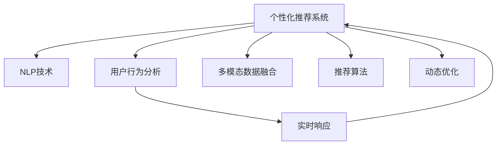

                 

# AI驱动的电商平台个性化首页设计

> 关键词：电商平台,个性化,首页设计,人工智能,推荐系统,自然语言处理,用户行为分析

## 1. 背景介绍

### 1.1 问题由来

在电子商务领域，个性化首页设计已成为提升用户体验和增加转化率的重要手段。电商平台通过首页推荐，让用户在浏览首页时，可以快速发现感兴趣的商品，从而提高购买转化率。然而，传统的首页推荐系统依赖于静态的算法规则，难以实时响应用户的多样化需求，也无法深度挖掘用户兴趣和行为模式，导致首页推荐的精准度较低。

近年来，随着人工智能技术和大数据应用的兴起，基于机器学习和深度学习技术构建的个性化推荐系统逐渐成为主流。这些系统通过分析用户的浏览记录、购买行为、搜索历史等数据，结合AI模型对用户进行精准画像，从而实现更加个性化、高效的首选项目推荐。本文将详细探讨AI在电商平台个性化首页推荐中的应用，特别是基于自然语言处理(NLP)和用户行为分析技术的推荐系统。

### 1.2 问题核心关键点

在构建AI驱动的个性化推荐系统时，核心关键点包括：
1. **用户画像构建**：通过分析用户的历史行为数据，构建用户的兴趣偏好、消费习惯等深度特征。
2. **实时响应推荐**：基于实时数据，动态调整推荐算法，提高推荐的时效性和精准度。
3. **多模态数据融合**：结合用户的文本描述、图片、视频等多种数据类型，构建更加全面、多维度的用户画像。
4. **个性化展示设计**：根据用户画像和推荐结果，设计个性化的首页布局和内容展示，提升用户满意度。
5. **交互优化**：通过A/B测试等手段，优化用户交互行为，进一步提升推荐系统效果。

## 2. 核心概念与联系

### 2.1 核心概念概述

为更好地理解AI驱动的个性化首页推荐系统，本节将介绍几个密切相关的核心概念：

- **个性化推荐系统**：通过分析用户的历史行为数据，构建用户的兴趣偏好，推荐符合用户口味的内容，从而提升用户体验和转化率。

- **自然语言处理(NLP)**：利用计算机技术处理和理解自然语言，包括分词、句法分析、语义理解等，用于从文本数据中提取有用信息。

- **用户行为分析**：通过分析用户的行为数据（如浏览记录、点击行为、购买历史等），构建用户画像，用于指导推荐策略。

- **多模态数据融合**：结合文本、图片、视频等多种类型的数据，构建更加全面和准确的用户画像，提升推荐效果。

- **推荐算法**：包括协同过滤、基于内容的推荐、矩阵分解等，用于构建推荐模型，并实时调整推荐策略。

- **动态优化**：通过实时数据反馈，动态调整推荐算法和展示设计，提高推荐系统的效果和用户体验。

这些概念之间的逻辑关系可以通过以下Mermaid流程图来展示：



这个流程图展示了个性化推荐系统的主要组成及其相互关系：

1. **NLP技术**：用于从用户输入的文本数据中提取有用信息，如商品评价、用户评论等。
2. **用户行为分析**：通过分析用户的浏览记录、点击行为、购买历史等数据，构建用户画像。
3. **多模态数据融合**：结合文本、图片、视频等多种数据类型，构建更加全面、多维度的用户画像。
4. **推荐算法**：通过协同过滤、内容推荐等方法，构建推荐模型。
5. **动态优化**：通过实时数据反馈，动态调整推荐策略，提升推荐效果。

## 3. 核心算法原理 & 具体操作步骤
### 3.1 算法原理概述

AI驱动的个性化首页推荐系统主要依赖于机器学习和大数据技术，通过以下步骤实现：

1. **用户画像构建**：收集用户的历史行为数据，使用机器学习算法构建用户画像，包括用户的兴趣偏好、消费习惯等深度特征。
2. **实时响应推荐**：基于实时数据，动态调整推荐算法，提高推荐的时效性和精准度。
3. **多模态数据融合**：结合用户的文本描述、图片、视频等多种数据类型，构建更加全面、多维度的用户画像。
4. **个性化展示设计**：根据用户画像和推荐结果，设计个性化的首页布局和内容展示，提升用户满意度。
5. **交互优化**：通过A/B测试等手段，优化用户交互行为，进一步提升推荐系统效果。

### 3.2 算法步骤详解

以基于深度学习的推荐系统为例，具体步骤如下：

**Step 1: 数据收集与预处理**
- 收集用户的浏览记录、点击行为、购买历史等数据，作为训练和测试数据集。
- 对文本数据进行分词、去停用词、词向量化等预处理操作。
- 处理图片、视频等非文本数据，提取出特征向量。

**Step 2: 用户画像构建**
- 使用协同过滤算法或深度学习模型，分析用户的行为数据，构建用户画像。
- 采用情感分析、主题建模等NLP技术，从用户输入的文本数据中提取有用信息，如商品评价、用户评论等。
- 结合用户画像和行为数据，构建多维度的用户特征向量。

**Step 3: 推荐模型训练**
- 选择适合的深度学习模型，如深度协同过滤模型、深度矩阵分解模型等。
- 将用户特征向量作为输入，商品特征向量作为输出，训练推荐模型。
- 使用交叉熵损失函数等优化算法，最小化预测误差。

**Step 4: 实时推荐**
- 基于实时数据流，动态调整推荐算法。
- 实时计算推荐结果，更新首页推荐内容。
- 使用A/B测试等手段，不断优化推荐算法和展示设计。

**Step 5: 展示设计**
- 根据推荐结果，设计个性化的首页布局和内容展示。
- 结合图片、视频等多媒体元素，丰富展示内容。
- 采用动态加载技术，提高首页渲染速度。

### 3.3 算法优缺点

基于深度学习的个性化推荐系统具有以下优点：
1. 高准确性：通过深度学习模型，能够高效地从多维度数据中挖掘用户兴趣，实现高精度的推荐。
2. 实时响应：结合实时数据流，动态调整推荐策略，提高推荐的时效性。
3. 鲁棒性强：深度学习模型具有良好的泛化能力，能够应对不同用户群体的需求。
4. 可解释性：深度学习模型通过权重和结构设计，可以部分解释其决策过程，提升推荐系统的透明度。

同时，这些系统也存在一些局限性：
1. 数据依赖性强：推荐的准确性高度依赖于用户行为数据的丰富度和准确性。
2. 模型复杂度高：深度学习模型参数量较大，需要高性能计算资源。
3. 可解释性不足：深度学习模型通常被视为"黑盒"，难以解释其内部决策机制。
4. 对抗攻击风险：深度学习模型容易受到对抗样本的干扰，影响推荐效果。

### 3.4 算法应用领域

基于深度学习的个性化推荐系统在多个领域得到了广泛应用，例如：

- **电商推荐**：电商平台通过个性化推荐系统，提升用户购物体验和转化率。
- **音乐推荐**：音乐平台使用推荐系统，为用户提供个性化的音乐推荐，提升用户粘性。
- **视频推荐**：视频网站通过推荐系统，为用户推荐感兴趣的影视作品，提高用户观看时间。
- **新闻推荐**：新闻网站使用推荐系统，为用户推荐相关的新闻文章，增加用户访问量。
- **社交媒体推荐**：社交平台通过推荐系统，为用户推荐感兴趣的内容和用户，扩大用户社交圈。

除了上述这些典型应用外，个性化推荐系统还在金融、教育、医疗等多个领域展现出广泛的应用前景。随着深度学习技术的不断进步，推荐系统的应用范围和效果将会进一步扩展，为各行各业带来新的机遇和挑战。

## 4. 数学模型和公式 & 详细讲解 & 举例说明
### 4.1 数学模型构建

以深度协同过滤模型为例，构建用户行为和商品特征的表示向量，并通过矩阵分解技术计算用户对商品的评分预测。假设用户行为矩阵为 $U \in \mathbb{R}^{N \times M}$，其中 $N$ 为用户数量，$M$ 为商品数量。用户行为矩阵的第 $i$ 行第 $j$ 列的元素 $U_{ij}$ 表示用户 $i$ 对商品 $j$ 的评分。

设推荐模型为 $M: \mathbb{R}^d \rightarrow \mathbb{R}^m$，其中 $d$ 为模型输入向量的维度，$m$ 为模型输出向量的维度。设用户画像向量为 $u \in \mathbb{R}^d$，商品特征向量为 $v \in \mathbb{R}^d$，则用户对商品 $j$ 的评分预测公式为：

$$
\hat{U}_{ij} = M(u \cdot v)
$$

其中 $\cdot$ 表示向量点积。

### 4.2 公式推导过程

将上述公式展开，得：

$$
\hat{U}_{ij} = \sum_{k=1}^d u_k v_k = u^T v
$$

通过矩阵分解技术，将用户画像向量 $u$ 和商品特征向量 $v$ 分别表示为两个低维矩阵 $U^{\prime} \in \mathbb{R}^{N \times k}$ 和 $V^{\prime} \in \mathbb{R}^{M \times k}$ 的乘积形式。设 $U^{\prime} = U \Theta^U$，$V^{\prime} = V \Theta^V$，其中 $\Theta^U$ 和 $\Theta^V$ 为低维矩阵，分别表示用户和商品的隐特征。

将 $U^{\prime}$ 和 $V^{\prime}$ 代入评分预测公式，得：

$$
\hat{U}_{ij} = (U \Theta^U)^T (V \Theta^V) = U^T \Theta^U V \Theta^V
$$

通过对 $\Theta^U$ 和 $\Theta^V$ 进行优化，最小化预测误差，最终得到用户对商品 $j$ 的评分预测值 $\hat{U}_{ij}$。

### 4.3 案例分析与讲解

以电商平台个性化推荐为例，假设某用户浏览过以下商品：手机（评分 4）、笔记本（评分 3）、耳机（评分 5）。设用户画像向量 $u$ 和商品特征向量 $v$ 的维度均为 5，通过矩阵分解得到：

$$
U^{\prime} = \begin{bmatrix} 0.6 & -0.2 & 0.5 & 0.1 & 0.3 \\ 0.4 & 0.3 & 0.2 & -0.1 & 0.4 \\ -0.1 & 0.5 & 0.3 & -0.2 & 0.4 \end{bmatrix}, V^{\prime} = \begin{bmatrix} 0.8 & -0.2 & 0.3 & 0.1 & -0.4 \\ 0.5 & 0.2 & -0.1 & 0.4 & 0.3 \\ -0.1 & 0.4 & 0.5 & -0.2 & 0.3 \end{bmatrix}
$$

则用户对商品的评分预测值 $\hat{U}_{ij}$ 为：

$$
\hat{U}_{ij} = U^{\prime}^T V^{\prime} = \begin{bmatrix} 0.8 & -0.2 & 0.3 & 0.1 & -0.4 \\ 0.5 & 0.2 & -0.1 & 0.4 & 0.3 \\ -0.1 & 0.4 & 0.5 & -0.2 & 0.3 \end{bmatrix} \begin{bmatrix} 0.6 \\ 0.4 \\ -0.1 \end{bmatrix} = \begin{bmatrix} 0.5 \\ 0.3 \\ 0.1 \end{bmatrix}
$$

即用户对手机、笔记本和耳机的评分预测值分别为 0.5、0.3 和 0.1。

## 5. 项目实践：代码实例和详细解释说明
### 5.1 开发环境搭建

在进行个性化推荐系统开发前，我们需要准备好开发环境。以下是使用Python进行PyTorch开发的环境配置流程：

1. 安装Anaconda：从官网下载并安装Anaconda，用于创建独立的Python环境。

2. 创建并激活虚拟环境：
```bash
conda create -n pytorch-env python=3.8 
conda activate pytorch-env
```

3. 安装PyTorch：根据CUDA版本，从官网获取对应的安装命令。例如：
```bash
conda install pytorch torchvision torchaudio cudatoolkit=11.1 -c pytorch -c conda-forge
```

4. 安装TensorFlow：下载并安装TensorFlow，用于深度学习模型的构建和训练。

5. 安装Flask：用于搭建Web服务器，展示推荐结果。

6. 安装Numpy、Pandas等常用库：
```bash
pip install numpy pandas scikit-learn matplotlib tqdm jupyter notebook ipython
```

完成上述步骤后，即可在`pytorch-env`环境中开始开发实践。

### 5.2 源代码详细实现

我们以基于协同过滤的推荐系统为例，给出使用PyTorch进行模型训练和推荐演示的代码实现。

```python
import torch
import torch.nn as nn
import torch.optim as optim
from torch.utils.data import Dataset, DataLoader

class UserItemDataset(Dataset):
    def __init__(self, users, items, ratings):
        self.users = users
        self.items = items
        self.ratings = ratings
        self.user_num = len(users)
        self.item_num = len(items)
        
    def __len__(self):
        return len(self.ratings)
    
    def __getitem__(self, idx):
        user_id = self.users[idx]
        item_id = self.items[idx]
        rating = self.ratings[idx]
        return user_id, item_id, rating

class DeepCFModel(nn.Module):
    def __init__(self, user_num, item_num, dim):
        super(DeepCFModel, self).__init__()
        self.user_fm = nn.Embedding(user_num, dim)
        self.item_fm = nn.Embedding(item_num, dim)
        self.user_nn = nn.Linear(dim, 1)
        self.item_nn = nn.Linear(dim, 1)
        
    def forward(self, user_id, item_id):
        user_fm = self.user_fm(user_id)
        item_fm = self.item_fm(item_id)
        user_nn = self.user_nn(user_fm)
        item_nn = self.item_nn(item_fm)
        rating = user_nn + item_nn - 0.5 * torch.norm(user_fm + item_fm)
        return rating

# 训练集数据
users = [1, 2, 3, 4, 5]
items = [1, 2, 3, 4, 5]
ratings = [5, 4, 3, 2, 1]
train_dataset = UserItemDataset(users, items, ratings)

# 模型定义
model = DeepCFModel(user_num=5, item_num=5, dim=10)

# 损失函数和优化器
criterion = nn.MSELoss()
optimizer = optim.Adam(model.parameters(), lr=0.001)

# 训练循环
for epoch in range(1000):
    for user_id, item_id, rating in train_dataset:
        model.train()
        output = model(user_id, item_id)
        loss = criterion(output, torch.tensor([rating]))
        optimizer.zero_grad()
        loss.backward()
        optimizer.step()
    if (epoch + 1) % 100 == 0:
        print(f"Epoch {epoch+1}, loss: {loss.item():.4f}")

# 测试集数据
users = [3, 4]
items = [2, 3]
ratings = [5, 4]
test_dataset = UserItemDataset(users, items, ratings)

# 测试
with torch.no_grad():
    for user_id, item_id, rating in test_dataset:
        output = model(user_id, item_id)
        print(f"User {user_id}, Item {item_id}, Predicted Rating: {output.item():.4f}")
```

以上代码实现了基于协同过滤的推荐系统的训练和测试，使用了PyTorch的深度学习框架进行模型的构建和优化。

### 5.3 代码解读与分析

让我们再详细解读一下关键代码的实现细节：

**UserItemDataset类**：
- `__init__`方法：初始化训练数据集，包括用户ID、商品ID和评分。
- `__len__`方法：返回数据集的样本数量。
- `__getitem__`方法：对单个样本进行处理，返回用户ID、商品ID和评分。

**DeepCFModel类**：
- `__init__`方法：定义模型的各个层，包括用户FM层、商品FM层和神经网络层。
- `forward`方法：实现前向传播，计算用户和商品的特征向量，进行矩阵分解，得到评分预测值。

**训练循环**：
- 对数据集进行迭代，计算损失函数，进行模型参数的优化更新。
- 每100个epoch输出一次损失函数值。

**测试循环**：
- 对测试集进行迭代，计算评分预测值，输出结果。

可以看到，PyTorch框架提供了丰富的API和工具，使得深度学习模型的开发和训练变得更加高效和简洁。开发者只需专注于模型设计和算法实现，而无需过多关注底层细节。

## 6. 实际应用场景
### 6.1 智能客服系统

基于AI驱动的个性化首页推荐技术，可以应用于智能客服系统的构建。智能客服系统通过分析用户的历史行为数据，构建用户画像，根据用户画像和实时输入进行动态推荐，为用户推荐最合适的服务方案。

具体而言，可以将用户的历史通话记录、聊天记录、请求类型等信息作为输入，构建用户画像，用于指导推荐。在用户输入客服问题后，动态调整推荐策略，为用户推荐最合适的客服方案。通过不断迭代和优化，智能客服系统可以提供更加个性化、高效的客户服务，提升用户体验和满意度。

### 6.2 金融理财平台

金融理财平台使用个性化推荐技术，为用户提供个性化的理财方案和投资建议。平台通过分析用户的财务状况、风险偏好、投资历史等数据，构建用户画像，动态调整推荐策略，为用户推荐最适合的理财产品和投资组合。

例如，用户可以输入自己的收入水平、理财目标、风险承受能力等，系统根据用户画像进行推荐。同时，系统还可以根据用户的实时投资行为，动态调整推荐，优化投资组合，降低风险，提高收益。通过不断优化推荐系统，金融理财平台可以提升用户粘性和满意度，增加平台收益。

### 6.3 内容分发平台

内容分发平台通过个性化推荐技术，为用户提供个性化的内容推荐。平台通过分析用户的历史浏览记录、点赞行为、评论内容等数据，构建用户画像，动态调整推荐策略，为用户推荐最感兴趣的内容。

例如，用户可以输入自己的兴趣爱好、历史浏览记录，系统根据用户画像进行推荐。同时，系统还可以根据用户的实时浏览行为，动态调整推荐，优化内容推荐列表，提高用户粘性和满意度。通过不断优化推荐系统，内容分发平台可以提升用户活跃度和平台收益。

## 7. 工具和资源推荐
### 7.1 学习资源推荐

为了帮助开发者系统掌握个性化推荐系统的理论和实践，这里推荐一些优质的学习资源：

1. 《推荐系统实战》一书：系统讲解推荐系统的理论和实践，涵盖协同过滤、深度学习等多个方面。
2. Coursera的《机器学习》课程：由斯坦福大学教授Andrew Ng主讲，讲解机器学习的基本原理和应用。
3. DeepLearning.AI的《深度学习》课程：由深度学习领域的专家讲解，涵盖深度学习模型的设计和优化。
4 Kaggle竞赛平台：参与Kaggle的推荐系统竞赛，实践和优化推荐算法，积累实战经验。
5 TensorFlow官方文档：提供深度学习模型的API和工具，帮助开发者高效实现推荐系统。

通过对这些资源的学习实践，相信你一定能够快速掌握个性化推荐系统的精髓，并用于解决实际的推荐问题。

### 7.2 开发工具推荐

高效的开发离不开优秀的工具支持。以下是几款用于个性化推荐系统开发的常用工具：

1. PyTorch：基于Python的深度学习框架，灵活高效，适用于复杂模型的构建和优化。
2. TensorFlow：由Google主导开发的深度学习框架，生产部署方便，适用于大规模工程的实现。
3. Scikit-learn：Python的机器学习库，提供了多种常用算法和工具，适用于基础推荐系统的开发。
4. Apache Spark：分布式计算框架，适用于大规模数据处理和推荐系统的构建。
5. Jupyter Notebook：交互式编程环境，方便进行模型调试和数据探索。

合理利用这些工具，可以显著提升个性化推荐系统的开发效率，加快创新迭代的步伐。

### 7.3 相关论文推荐

个性化推荐系统的研究源于学界的持续研究。以下是几篇奠基性的相关论文，推荐阅读：

1. Implicit Collaborative Filtering：提出了协同过滤算法的基本框架，是推荐系统的主流算法之一。
2 Recommender Systems Handbook：介绍了推荐系统的各种算法和应用，是推荐系统的经典教材。
3 Deep Collaborative Filtering for Recommender Systems：介绍了深度协同过滤算法，推动了推荐系统的深度学习应用。
4 Fast Matrix Factorization for Online Recommendations：提出了矩阵分解的优化方法，提高了推荐系统的计算效率。

这些论文代表了个性化推荐系统的发展脉络。通过学习这些前沿成果，可以帮助研究者把握学科前进方向，激发更多的创新灵感。

## 8. 总结：未来发展趋势与挑战
### 8.1 总结

本文对AI驱动的电商平台个性化首页推荐系统进行了全面系统的介绍。首先阐述了个性化推荐系统的重要性和背景，明确了推荐系统在提升用户体验和增加转化率方面的独特价值。其次，从原理到实践，详细讲解了推荐系统的数学模型和核心算法，给出了推荐系统开发的完整代码实例。同时，本文还广泛探讨了推荐系统在智能客服、金融理财、内容分发等多个领域的应用前景，展示了推荐范式的巨大潜力。此外，本文精选了推荐系统的各类学习资源，力求为读者提供全方位的技术指引。

通过本文的系统梳理，可以看到，AI驱动的个性化推荐系统正在成为电商、金融、内容分发等多个领域的重要手段，极大地提升了用户粘性和满意度。推荐系统通过深度学习技术，能够高效地从多维度数据中挖掘用户兴趣，实现高精度的推荐。然而，推荐系统也面临着数据依赖性强、模型复杂度高、可解释性不足等挑战，需要持续优化和改进。

### 8.2 未来发展趋势

展望未来，个性化推荐系统将呈现以下几个发展趋势：

1. **多模态数据融合**：推荐系统将结合文本、图片、视频等多种数据类型，构建更加全面、多维度的用户画像，提升推荐效果。
2. **深度学习技术应用**：深度学习技术将在推荐系统中得到更广泛的应用，通过多层次的特征提取和模型优化，提高推荐系统的精度和鲁棒性。
3. **实时响应和动态调整**：推荐系统将实时响应用户行为，动态调整推荐策略，提升推荐的时效性和个性化程度。
4. **用户交互优化**：推荐系统将通过A/B测试等手段，不断优化用户交互行为，提升用户满意度。
5. **隐私保护和可解释性**：推荐系统将更加注重用户隐私保护和模型可解释性，提升用户信任度和满意度。

以上趋势凸显了个性化推荐系统的广阔前景。这些方向的探索发展，必将进一步提升推荐系统的效果和用户体验，为各行各业带来新的机遇和挑战。

### 8.3 面临的挑战

尽管个性化推荐系统已经取得了瞩目成就，但在迈向更加智能化、普适化应用的过程中，它仍面临着诸多挑战：

1. **数据依赖性强**：推荐的准确性高度依赖于用户行为数据的丰富度和准确性。
2. **模型复杂度高**：深度学习模型参数量较大，需要高性能计算资源。
3. **可解释性不足**：深度学习模型通常被视为"黑盒"，难以解释其内部决策机制。
4. **隐私保护**：用户行为数据涉及个人隐私，如何在保证推荐效果的同时，保护用户隐私，是一个重要问题。
5. **对抗攻击风险**：深度学习模型容易受到对抗样本的干扰，影响推荐效果。

正视推荐系统面临的这些挑战，积极应对并寻求突破，将是个性化推荐系统走向成熟的必由之路。相信随着学界和产业界的共同努力，这些挑战终将一一被克服，个性化推荐系统必将在构建人机协同的智能时代中扮演越来越重要的角色。

### 8.4 研究展望

面对个性化推荐系统所面临的种种挑战，未来的研究需要在以下几个方面寻求新的突破：

1. **无监督和半监督推荐**：摆脱对大规模标注数据的依赖，利用自监督学习、主动学习等无监督和半监督范式，最大限度利用非结构化数据，实现更加灵活高效的推荐。
2. **参数高效和计算高效推荐**：开发更加参数高效的推荐方法，在固定大部分预训练参数的同时，只更新极少量的任务相关参数。同时优化推荐模型的计算图，减少前向传播和反向传播的资源消耗，实现更加轻量级、实时性的部署。
3. **因果分析和博弈论工具**：将因果分析方法引入推荐系统，识别出推荐决策的关键特征，增强推荐系统的因果性和逻辑性。借助博弈论工具刻画人机交互过程，主动探索并规避推荐的脆弱点，提高系统稳定性。
4. **引入更多先验知识**：将符号化的先验知识，如知识图谱、逻辑规则等，与神经网络模型进行巧妙融合，引导推荐过程学习更准确、合理的推荐模型。同时加强不同模态数据的整合，实现视觉、语音等多模态信息与文本信息的协同建模。
5. **引入伦理道德约束**：在推荐目标中引入伦理导向的评估指标，过滤和惩罚有偏见、有害的推荐内容，确保推荐系统的公平性和可控性。

这些研究方向的探索，必将引领个性化推荐系统技术迈向更高的台阶，为构建安全、可靠、可解释、可控的智能系统铺平道路。面向未来，个性化推荐技术还需要与其他人工智能技术进行更深入的融合，如知识表示、因果推理、强化学习等，多路径协同发力，共同推动推荐系统的进步。

## 9. 附录：常见问题与解答

**Q1：个性化推荐系统如何处理冷启动用户？**

A: 冷启动用户指的是从未有行为记录的新用户。个性化推荐系统通常有以下几种处理冷启动用户的方法：

1. **基于内容的推荐**：根据用户输入的信息（如兴趣、年龄、职业等），推荐与其相似的内容。
2. **协同过滤推荐**：利用其他相似用户的行为数据，进行推荐。
3. **混合推荐**：结合基于内容的推荐和协同过滤推荐，综合处理冷启动用户。

这些方法可以结合使用，通过不断迭代和优化，提升推荐系统的冷启动效果。

**Q2：推荐系统如何处理长尾需求？**

A: 长尾需求指的是那些不太常见、用户量较少的商品或内容。推荐系统通常有以下几种处理长尾需求的方法：

1. **细粒度分类**：将商品或内容进行细粒度分类，推荐相关的长尾商品或内容。
2. **标签推荐**：根据用户的历史行为数据，推荐与其兴趣相关的长尾商品或内容。
3. **多维推荐**：结合用户的兴趣和行为数据，动态调整推荐策略，推荐长尾商品或内容。

这些方法可以结合使用，通过不断迭代和优化，提升推荐系统的长尾需求处理能力。

**Q3：推荐系统如何平衡个性化和多样化？**

A: 推荐系统需要平衡个性化和多样化，避免推荐过度个性化导致用户信息茧房。通常有以下几种方法：

1. **多样性约束**：在推荐算法中引入多样性约束，限制推荐结果中同类商品或内容的数量。
2. **上下文感知**：结合用户的历史行为和当前上下文，动态调整推荐策略，平衡个性化和多样化。
3. **内容混合**：在推荐结果中引入多样化的内容，提升推荐效果。

这些方法可以结合使用，通过不断迭代和优化，提升推荐系统的平衡能力。

**Q4：推荐系统如何处理负反馈？**

A: 负反馈指的是用户对推荐结果的负面评价。推荐系统通常有以下几种处理负反馈的方法：

1. **重新推荐**：根据用户的负反馈，重新推荐更合适的商品或内容。
2. **调整推荐策略**：根据用户的负反馈，调整推荐策略，优化推荐效果。
3. **引入惩罚机制**：对产生负反馈的推荐结果进行惩罚，避免类似问题的发生。

这些方法可以结合使用，通过不断迭代和优化，提升推荐系统的负反馈处理能力。

---

作者：禅与计算机程序设计艺术 / Zen and the Art of Computer Programming

