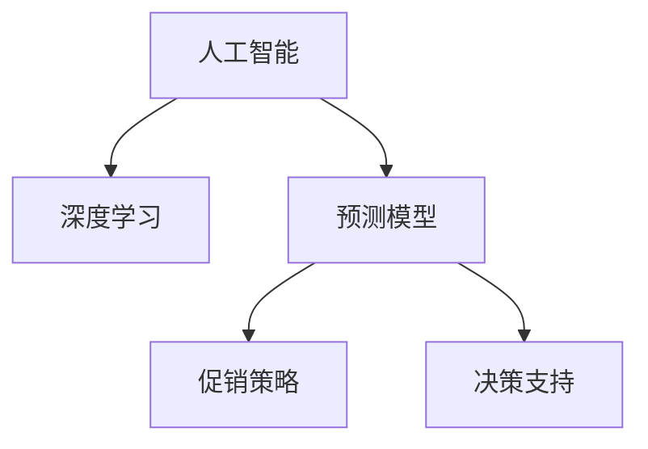

                 

# AI驱动的电商平台商品销量预测与促销决策支持

> 关键词：人工智能, 销量预测, 电商, 商品推荐, 促销决策, 机器学习, 深度学习, 预测模型, 决策支持, 算法优化

## 1. 背景介绍

### 1.1 问题由来

随着电子商务的快速发展和消费者购物行为的日益多样化，电商平台对商品的销量预测和促销决策支持提出了更高的要求。传统的基于人工经验和统计方法的商品销量预测和促销策略制定，已经难以满足现代电商平台的实时性和精准性需求。

近年来，随着人工智能技术的迅猛发展，电商平台开始利用机器学习、深度学习等先进技术，对海量用户行为数据进行智能分析和挖掘，以实现更为精准的销量预测和更有效的促销决策支持。本文将重点探讨如何利用人工智能技术，特别是深度学习模型，来驱动电商平台的销量预测与促销决策支持。

### 1.2 问题核心关键点

1. **销量预测**：通过对用户行为数据进行建模，预测未来商品销量的走势。
2. **促销决策支持**：根据预测结果，智能生成和推荐促销策略，提升商品销量。
3. **算法优化**：在保证预测精度和决策准确性的同时，优化模型效率和资源利用率。
4. **模型部署与维护**：将训练好的模型部署到实际业务系统中，并持续监控其性能和稳定性。

### 1.3 问题研究意义

构建基于人工智能的商品销量预测与促销决策支持系统，对于电商平台提升运营效率、优化库存管理、增强客户满意度具有重要意义：

1. **优化库存管理**：通过精准的销量预测，电商平台可以合理制定补货计划，避免库存积压或短缺。
2. **提升销售转化率**：结合预测结果，生成和推荐个性化的促销策略，提升用户购买意愿和转化率。
3. **降低运营成本**：通过智能化的决策支持，减少人工干预和数据处理成本，提高运营效率。
4. **增强市场竞争力**：更准确的市场预测和促销策略，使电商平台在激烈的市场竞争中占据优势。

## 2. 核心概念与联系

### 2.1 核心概念概述

为更好地理解基于人工智能的电商平台销量预测与促销决策支持系统，本节将介绍几个核心概念：

1. **人工智能（AI）**：利用计算机模拟人类智能过程的技术，包括机器学习、深度学习、自然语言处理、计算机视觉等。
2. **深度学习**：一类机器学习算法，通过多层神经网络模型进行数据表示和预测，广泛应用于图像、语音、文本等领域。
3. **预测模型**：通过历史数据训练得到的模型，用于预测未来事件或结果。
4. **促销策略**：基于预测结果，生成的促销方案，包括折扣、满减、赠品等。
5. **决策支持**：通过分析预测结果和市场情况，辅助人工做出最优决策。

这些概念之间的逻辑关系可以通过以下Mermaid流程图来展示：



这个流程图展示了核心概念之间的相互关系：人工智能通过深度学习技术，训练出预测模型，并根据预测结果生成促销策略和辅助决策支持。

## 3. 核心算法原理 & 具体操作步骤

### 3.1 算法原理概述

基于人工智能的商品销量预测与促销决策支持系统，核心原理是通过深度学习模型，对用户行为数据进行分析和建模，预测未来商品销量，并根据预测结果，生成和推荐促销策略。

具体来说，系统分为两个主要模块：销量预测模块和促销决策支持模块。销量预测模块基于历史销售数据，通过深度学习模型进行销量预测。促销决策支持模块则根据预测结果，结合市场情况，智能生成和推荐促销策略，以提升商品销量。

### 3.2 算法步骤详解

#### 3.2.1 销量预测模块

1. **数据收集**：从电商平台收集用户行为数据，包括浏览记录、购买历史、评价反馈等。
2. **数据预处理**：清洗和格式化数据，去除异常值和噪声，进行特征工程，提取关键特征。
3. **模型选择**：选择合适的深度学习模型，如卷积神经网络（CNN）、循环神经网络（RNN）、长短期记忆网络（LSTM）等，进行销量预测。
4. **模型训练**：使用历史销售数据对模型进行训练，优化模型参数，提升预测精度。
5. **模型评估**：在验证集上评估模型性能，选择最佳模型进行后续应用。

#### 3.2.2 促销决策支持模块

1. **市场分析**：分析当前市场环境，包括季节性因素、竞争对手动态等。
2. **预测结果整合**：将销量预测结果整合到促销策略生成中，考虑预测结果的影响。
3. **策略生成**：根据整合后的信息，生成个性化的促销策略，如折扣、满减、赠品等。
4. **策略评估**：在实际应用中，通过A/B测试等方法评估促销策略的效果。
5. **策略优化**：根据评估结果，持续优化促销策略，提升促销效果。

### 3.3 算法优缺点

#### 3.3.1 优点

1. **预测精度高**：通过深度学习模型，能够从复杂数据中提取特征，进行高精度预测。
2. **自动化程度高**：自动化的预测和策略生成，减少了人工干预，提高了效率。
3. **可扩展性强**：可以处理海量数据，支持大规模应用。

#### 3.3.2 缺点

1. **数据依赖性高**：模型训练和预测效果依赖于数据质量和数据量。
2. **模型复杂度高**：深度学习模型复杂，训练和预测速度较慢。
3. **策略多样性有限**：生成的促销策略可能较为单一，缺乏创新性。

### 3.4 算法应用领域

基于人工智能的电商平台销量预测与促销决策支持系统，可以应用于多个电商场景：

1. **B2C电商平台**：预测用户行为，生成个性化推荐和促销策略，提升用户购买意愿。
2. **B2B电商平台**：预测销售趋势，优化库存管理，提升供应链效率。
3. **跨界电商**：整合多种数据源，进行多场景应用，如线上线下一体化营销。

## 4. 数学模型和公式 & 详细讲解

### 4.1 数学模型构建

假设电商平台有$m$种商品，用户有$n$个，每个用户在时间$t$时对商品$i$的行为为$x_i$，预测该用户在未来时间$t+T$对商品$i$的销量$y_i$。销量预测模型可以表示为：

$$
y_i = f(x_i; \theta)
$$

其中$f$为预测函数，$\theta$为模型参数。

### 4.2 公式推导过程

为了构建销量预测模型，我们通常采用时间序列预测技术，如ARIMA模型、LSTM模型等。以LSTM模型为例，预测函数$f$可以表示为：

$$
f(x_i; \theta) = \sum_{k=0}^{K} a_k g(x_i, h_k)
$$

其中$g$为LSTM网络中的前向传播函数，$h_k$为LSTM网络中的隐藏状态，$a_k$为可学习的权重。

促销决策支持模块主要基于预测结果，结合市场分析信息，生成促销策略。促销策略可以表示为：

$$
S_i = f(y_i; \phi)
$$

其中$S_i$为对商品$i$的促销策略，$f$为促销策略生成函数，$\phi$为策略生成模型的参数。

### 4.3 案例分析与讲解

以某电商平台预测某款商品的未来销量为例，假设该商品的历史销量数据为$(x_1, x_2, ..., x_T)$，预测该商品在未来$T+1$天内的销量$y_{T+1}$。首先，对历史销量数据进行预处理和特征工程，得到特征向量$x_T$。然后，将$x_T$输入LSTM模型，得到隐藏状态$h_T$。最后，根据$y_T$和$h_T$，生成促销策略$S_{T+1}$，并根据促销策略在实际销售中产生相应效果。

## 5. 项目实践：代码实例和详细解释说明

### 5.1 开发环境搭建

在进行项目实践前，我们需要准备好开发环境。以下是使用Python进行TensorFlow开发的环境配置流程：

1. 安装Anaconda：从官网下载并安装Anaconda，用于创建独立的Python环境。

2. 创建并激活虚拟环境：
```bash
conda create -n tf-env python=3.8 
conda activate tf-env
```

3. 安装TensorFlow：根据CUDA版本，从官网获取对应的安装命令。例如：
```bash
conda install tensorflow -c tf -c conda-forge
```

4. 安装其他必要的工具包：
```bash
pip install numpy pandas scikit-learn tensorflow-gpu h5py
```

完成上述步骤后，即可在`tf-env`环境中开始项目开发。

### 5.2 源代码详细实现

下面是基于TensorFlow的销量预测和促销决策支持的完整代码实现：

```python
import tensorflow as tf
from tensorflow.keras.models import Sequential
from tensorflow.keras.layers import LSTM, Dense, Dropout
from tensorflow.keras.optimizers import Adam

# 定义LSTM销量预测模型
class SalesPredictor(tf.keras.Model):
    def __init__(self, input_dim, output_dim):
        super(SalesPredictor, self).__init__()
        self.lstm = LSTM(64, input_shape=(input_dim, 1), return_sequences=True)
        self.dropout = Dropout(0.2)
        self.dense = Dense(output_dim)
        self.sigmoid = tf.keras.layers.Activation('sigmoid')

    def call(self, inputs):
        x = self.lstm(inputs)
        x = self.dropout(x)
        x = self.dense(x)
        return self.sigmoid(x)

# 加载历史销售数据
train_data = load_train_data()
train_features = preprocess_data(train_data)

# 构建模型并训练
model = SalesPredictor(input_dim=train_features.shape[1], output_dim=1)
optimizer = Adam(learning_rate=0.001)
model.compile(optimizer=optimizer, loss='binary_crossentropy', metrics=['accuracy'])
model.fit(train_features, train_labels, epochs=10, batch_size=32)

# 预测未来销量
test_data = load_test_data()
test_features = preprocess_data(test_data)
predictions = model.predict(test_features)
predictions = sigmoid(predictions)

# 生成促销策略
promotion_strategy = generate_promotion_strategy(predictions)
```

### 5.3 代码解读与分析

让我们再详细解读一下关键代码的实现细节：

**SalesPredictor类**：
- `__init__`方法：初始化LSTM模型、Dropout层和Dense层。
- `call`方法：定义前向传播过程，将输入数据依次通过LSTM、Dropout和Dense层，最终输出预测结果。

**数据加载和预处理**：
- 使用`load_train_data`和`load_test_data`函数加载训练和测试数据。
- 使用`preprocess_data`函数进行数据预处理和特征工程。

**模型训练**：
- 构建`SalesPredictor`模型，并使用`Adam`优化器进行训练。
- 在训练过程中，每轮迭代都会计算损失函数和准确率，并根据优化器调整模型参数。

**预测和促销策略生成**：
- 使用训练好的模型对测试数据进行预测，得到销量概率。
- 使用`generate_promotion_strategy`函数生成促销策略，根据销量概率自动推荐促销方式。

**完整流程**：
- 数据加载和预处理
- 模型训练和预测
- 促销策略生成和应用

可以看到，TensorFlow提供了强大的模型构建和训练框架，使得销量预测和促销决策支持模型的开发变得简洁高效。开发者可以根据具体需求，灵活定制模型结构和训练策略，快速迭代优化模型性能。

## 6. 实际应用场景

### 6.1 电商平台库存管理

基于销量预测的库存管理，可以帮助电商平台避免库存积压和短缺。通过预测未来商品销量，电商平台可以合理制定补货计划，优化库存水平，降低运营成本。

在实际应用中，可以将销量预测结果与库存管理系统集成，自动触发补货操作。例如，当预测到某商品未来销量将大幅增长，系统将自动预警，并提前调整库存。

### 6.2 个性化推荐系统

促销策略生成的核心在于生成个性化的推荐和促销方案。通过销量预测，电商平台可以更好地理解用户需求，智能生成符合用户偏好的促销策略。

例如，在预测到某款商品未来销量将下降时，系统可以自动生成针对该商品的折扣促销，吸引用户购买。同时，根据用户历史行为数据，系统还可以生成个性化的推荐列表，提升用户购买转化率。

### 6.3 营销活动效果评估

基于促销策略生成的营销活动效果评估，是电商平台的运营优化重要环节。通过实际应用促销策略，可以收集用户反馈和销售数据，评估活动效果，并进行持续优化。

例如，可以通过A/B测试比较不同促销策略的效果，选择最佳方案。同时，根据用户反馈，动态调整促销策略，提升用户体验。

### 6.4 未来应用展望

随着深度学习技术的发展，基于人工智能的电商平台销量预测与促销决策支持系统将呈现以下几个发展趋势：

1. **多模态融合**：未来的模型将融合多种数据源，如用户行为数据、社交媒体数据、天气数据等，进行更全面的市场预测。
2. **实时预测**：通过流式数据处理和模型优化，实现实时销量预测，及时调整促销策略。
3. **跨域学习**：通过跨平台、跨领域的数据学习，提升模型的泛化能力和适应性。
4. **增强可解释性**：引入可解释性技术，如注意力机制、LIME等，提升模型的透明度和可信度。
5. **自适应调整**：根据用户反馈和市场变化，自适应调整预测模型和促销策略，持续优化预测精度和策略效果。

## 7. 工具和资源推荐

### 7.1 学习资源推荐

为了帮助开发者系统掌握基于人工智能的电商平台销量预测与促销决策支持技术，这里推荐一些优质的学习资源：

1. 《TensorFlow实战》系列博文：由TensorFlow官方团队撰写，详细介绍了TensorFlow的安装、使用和优化方法。
2. CS231n《卷积神经网络》课程：斯坦福大学开设的计算机视觉明星课程，介绍了深度学习在图像处理中的应用。
3. 《深度学习框架TensorFlow》书籍：全面介绍TensorFlow的架构和使用方法，是入门深度学习的重要参考资料。
4. Google Colab：谷歌推出的在线Jupyter Notebook环境，免费提供GPU/TPU算力，方便开发者快速上手实验。
5. 《深度学习入门：基于TensorFlow的实践》书籍：结合TensorFlow的实际应用案例，帮助读者快速上手深度学习项目。

通过对这些资源的学习实践，相信你一定能够快速掌握基于人工智能的电商平台销量预测与促销决策支持的核心技术，并用于解决实际的电商问题。

### 7.2 开发工具推荐

高效的开发离不开优秀的工具支持。以下是几款用于深度学习开发和应用的重要工具：

1. TensorFlow：基于Google的深度学习框架，生产部署方便，支持GPU/TPU加速。
2. PyTorch：Facebook开发的深度学习框架，灵活动态，适合研究和实验。
3. Keras：高层次的深度学习API，提供了简洁的模型构建接口。
4. Jupyter Notebook：交互式开发环境，支持Python代码编写和实时数据展示。
5. TensorBoard：TensorFlow配套的可视化工具，实时监测模型训练状态，提供丰富的图表呈现方式。

合理利用这些工具，可以显著提升深度学习模型的开发效率，加快创新迭代的步伐。

### 7.3 相关论文推荐

基于深度学习的电商平台销量预测与促销决策支持技术，在学术界和工业界已经得到了广泛的研究。以下是几篇奠基性的相关论文，推荐阅读：

1. Temporal Dynamics in Continuous Time Series Forecasting（RNN论文）：提出长短期记忆网络（LSTM）模型，用于处理时间序列预测问题。
2. Deep Sales Forecasting with Gated Recurrent Unit Neural Networks（GRU论文）：提出门控循环单元网络（GRU）模型，用于电商销量预测。
3. Marketing Optimization in E-commerce with a Multi-objective Evolutionary Algorithm（MOEA论文）：提出多目标优化算法，用于促销策略生成和优化。
4. Sales Forecasting Using Deep Learning（DL论文）：提出深度学习模型，用于电商销量预测和市场分析。
5. Business Intelligence and Intelligent Marketing in E-commerce（BI论文）：探讨AI在电商营销中的应用，包括销量预测和策略生成。

这些论文代表了大模型微调技术的发展脉络。通过学习这些前沿成果，可以帮助研究者把握学科前进方向，激发更多的创新灵感。

## 8. 总结：未来发展趋势与挑战

### 8.1 总结

本文对基于人工智能的电商平台销量预测与促销决策支持系统进行了全面系统的介绍。首先阐述了系统在电商平台中的应用背景和意义，明确了销量预测和促销决策支持的核心目标。其次，从原理到实践，详细讲解了销量预测和促销决策支持的全过程，给出了完整的代码实例。同时，本文还探讨了系统的实际应用场景，并展望了未来的发展趋势。

通过本文的系统梳理，可以看到，基于人工智能的电商平台销量预测与促销决策支持系统，具有强大的预测能力和策略生成能力，能够在电商平台中发挥重要作用。未来，随着深度学习技术的不断进步，该系统将进一步提升电商平台的运营效率和用户体验。

### 8.2 未来发展趋势

展望未来，基于人工智能的电商平台销量预测与促销决策支持系统将呈现以下几个发展趋势：

1. **预测精度提升**：通过引入更多特征和优化模型架构，提升销量预测的准确性。
2. **实时预测支持**：通过流式数据处理和高效算法，实现实时预测，支持实时决策。
3. **跨平台融合**：整合多平台、多渠道的数据，进行多维度市场分析。
4. **增强可解释性**：引入可解释性技术，提升模型的透明度和可信度。
5. **自适应调整**：根据用户反馈和市场变化，持续优化预测模型和促销策略。

这些趋势将使电商平台实现更精准的销量预测和更有效的促销策略生成，从而提升运营效率和用户体验。

### 8.3 面临的挑战

尽管基于人工智能的电商平台销量预测与促销决策支持系统已经取得了显著成果，但在实际应用中也面临诸多挑战：

1. **数据质量和多样性**：数据质量差、数据类型多样性不足，可能导致模型预测精度不高。
2. **计算资源需求高**：深度学习模型计算资源需求高，需考虑算力限制。
3. **模型复杂度高**：模型复杂度高，训练和推理耗时长。
4. **策略多样性有限**：促销策略种类单一，缺乏创新性。
5. **用户反馈收集难**：用户反馈收集难，缺乏持续优化依据。

这些挑战需要在实际应用中不断探索和解决，以确保系统的稳定性和有效性。

### 8.4 研究展望

面对基于人工智能的电商平台销量预测与促销决策支持系统所面临的挑战，未来的研究需要在以下几个方面寻求新的突破：

1. **数据增强**：通过数据增强技术，提升数据质量和多样性，增强模型预测能力。
2. **模型优化**：优化模型架构和算法，提升模型训练和推理效率。
3. **策略多样化**：引入更多促销策略生成方法，提升策略多样性和创新性。
4. **用户反馈机制**：建立用户反馈机制，收集用户行为数据，持续优化预测模型和促销策略。
5. **多平台融合**：整合多平台数据，进行多维度市场分析，提升决策支持能力。

这些研究方向的探索，将使基于人工智能的电商平台销量预测与促销决策支持系统迈向更高的台阶，为电商平台带来更加精准和高效的运营体验。

## 9. 附录：常见问题与解答

**Q1：如何选择合适的促销策略？**

A: 促销策略的选择应考虑多方面因素，如商品特性、市场环境、用户需求等。通常，可以通过A/B测试等方法比较不同促销策略的效果，选择最佳方案。

**Q2：销量预测模型如何构建？**

A: 销量预测模型通常采用时间序列预测技术，如ARIMA模型、LSTM模型等。构建模型时，需进行数据预处理和特征工程，选择合适的模型进行训练和评估。

**Q3：模型训练过程中的超参数如何优化？**

A: 超参数优化通常采用网格搜索、随机搜索、贝叶斯优化等方法。可以结合实际应用场景，选择合适的超参数优化策略，提升模型性能。

**Q4：如何将预测模型和业务系统集成？**

A: 在实际应用中，需要将训练好的预测模型部署到业务系统中，通过API接口提供预测服务。同时，需要设计合适的数据输入和输出格式，确保模型和业务系统无缝集成。

**Q5：如何评估促销策略的效果？**

A: 可以通过A/B测试比较不同促销策略的效果，选择最佳方案。同时，根据用户反馈和实际销售数据，评估促销策略的效果，进行持续优化。

---

作者：禅与计算机程序设计艺术 / Zen and the Art of Computer Programming

