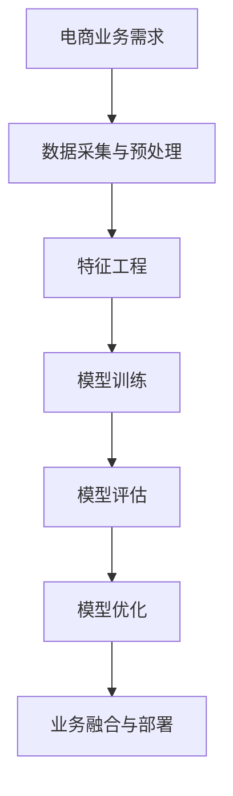

                 

# AI驱动的电商平台商品销量预测模型

> 关键词：电商平台, 商品销量预测, AI模型, 机器学习, 深度学习, 特征工程, 业务融合

## 1. 背景介绍

### 1.1 问题由来

在当今电商领域，商品销量预测是一个关键而复杂的问题。电商平台的运营效率和盈利能力很大程度上依赖于对商品销量的准确预测。通过预测未来的商品销量，商家可以优化库存管理，减少库存积压，提升营销策略，最大化利润。然而，传统的基于统计方法和专家经验的销量预测方法往往存在误差大、及时性差、不够灵活等问题，难以满足电商运营快速迭代的需求。

近年来，随着AI技术的快速发展，尤其是机器学习和深度学习算法的应用，电商平台开始大规模部署AI驱动的销量预测模型。这种基于数据驱动的方法能够充分利用历史销售数据、用户行为数据、市场环境数据等，建模出更准确、更及时的销量预测模型。本文将介绍一种基于深度学习的电商平台商品销量预测模型，详细探讨其核心算法原理、具体操作步骤以及实际应用场景。

## 2. 核心概念与联系

### 2.1 核心概念概述

为更好地理解基于深度学习的电商平台商品销量预测模型，本节将介绍几个关键概念及其相互联系：

- **电商平台(E-Commerce Platform)**：提供商品展示、交易、物流等服务的在线平台，如Amazon、淘宝、京东等。
- **商品销量(Promotion Volume)**：指特定时间段内特定商品的交易量。
- **深度学习(Deep Learning)**：一类基于神经网络的机器学习算法，能够处理高维数据，建模复杂的非线性关系，广泛应用于计算机视觉、自然语言处理等领域。
- **特征工程(Feature Engineering)**：指通过选择合适的特征，提取、变换、选择、构建数据特征，以提高模型性能和泛化能力。
- **业务融合(Business Integration)**：指将AI模型嵌入到电商平台的业务流程中，实现智能化、自动化、个性化的用户体验。
- **模型训练(Model Training)**：通过历史数据训练模型，学习数据的分布和规律，使其具备预测未来销量的能力。
- **模型评估(Model Evaluation)**：通过验证集对训练好的模型进行性能评估，确保模型的泛化能力和稳定性。
- **模型优化(Model Optimization)**：通过超参数调优、模型压缩、集成学习等手段，进一步提升模型性能。

这些核心概念构成了电商平台商品销量预测模型的理论基础，帮助商家利用AI技术，提升销量预测的精度和及时性，实现业务增长和成本控制。

### 2.2 核心概念联系

电商平台的商品销量预测模型构建流程可以通过以下Mermaid流程图来展示：



这个流程图展示了商品销量预测模型的构建流程，包括以下步骤：

1. **需求分析**：理解电商平台的业务需求，明确销量预测的目标和评估标准。
2. **数据采集**：收集电商平台的历史交易数据、用户行为数据、市场环境数据等，作为模型的训练数据。
3. **数据预处理**：对数据进行清洗、去重、归一化、缺失值处理等操作，确保数据质量。
4. **特征工程**：选择和构建有意义的特征，如用户购买历史、时间、促销活动、季节性变化等，以提高模型的预测能力。
5. **模型训练**：使用深度学习算法训练模型，通过历史数据学习销量规律，构建预测模型。
6. **模型评估**：在验证集上评估模型性能，确保模型的泛化能力和稳定性。
7. **模型优化**：通过超参数调优、模型压缩、集成学习等手段，进一步提升模型性能。
8. **业务融合与部署**：将训练好的模型嵌入到电商平台的业务流程中，实现智能化、自动化、个性化的用户体验。

这些步骤相互关联，共同构成了一个完整的商品销量预测模型构建流程。

## 3. 核心算法原理 & 具体操作步骤
### 3.1 算法原理概述

基于深度学习的电商平台商品销量预测模型，通过学习历史销售数据、用户行为数据等，构建一个能够预测未来销量的神经网络模型。该模型通常采用长短期记忆网络(LSTM)、门控循环单元(GRU)、注意力机制(Attention)等深度学习算法，能够捕捉时间序列数据中的长期依赖关系，提高预测精度。

### 3.2 算法步骤详解

#### 3.2.1 数据准备

1. **数据采集**：从电商平台的数据库中，提取历史交易数据、用户行为数据、市场环境数据等。
2. **数据清洗**：对数据进行去重、去噪、缺失值处理等操作，确保数据质量。
3. **数据划分**：将数据集划分为训练集、验证集和测试集，确保模型在独立数据集上的泛化能力。

#### 3.2.2 特征工程

1. **特征选择**：选择对销量预测有显著影响的特征，如用户购买历史、时间、促销活动、季节性变化等。
2. **特征变换**：对连续型数据进行归一化、对数变换等操作，增强模型的鲁棒性和泛化能力。
3. **特征构建**：设计有意义的特征组合，如用户购买历史与当前时间、促销活动等特征组合，提升模型的预测能力。

#### 3.2.3 模型训练

1. **模型选择**：选择适合时间序列预测的深度学习模型，如LSTM、GRU等。
2. **模型搭建**：搭建深度学习模型，设置网络结构、损失函数、优化器等。
3. **模型训练**：使用训练集对模型进行训练，调整模型参数，优化损失函数，提高模型性能。
4. **早停策略**：在验证集上监控模型性能，一旦性能不再提升，立即停止训练，避免过拟合。

#### 3.2.4 模型评估

1. **评估指标**：选择均方误差(MSE)、平均绝对误差(MAE)、均方根误差(RMSE)等指标，评估模型的预测性能。
2. **交叉验证**：使用交叉验证方法，验证模型的稳定性和泛化能力。
3. **后验分析**：对预测结果进行分析，发现模型的优势和不足，优化模型结构。

#### 3.2.5 模型优化

1. **超参数调优**：通过网格搜索、贝叶斯优化等方法，优化模型的超参数，提高模型性能。
2. **模型压缩**：通过剪枝、量化等手段，减小模型尺寸，提高推理速度。
3. **集成学习**：采用Bagging、Boosting等方法，构建多个模型进行集成预测，提高模型鲁棒性和泛化能力。

### 3.3 算法优缺点

#### 3.3.1 优点

1. **准确性高**：深度学习模型能够捕捉时间序列数据中的长期依赖关系，提高预测精度。
2. **实时性好**：通过在线学习，模型可以实时更新，快速适应新的市场环境。
3. **灵活性强**：通过特征工程，模型可以适应不同电商平台的需求，灵活性高。
4. **业务融合容易**：将模型嵌入到电商平台业务流程中，实现智能化、自动化、个性化的用户体验。

#### 3.3.2 缺点

1. **数据需求高**：深度学习模型需要大量的历史数据进行训练，数据获取成本较高。
2. **模型复杂度高**：深度学习模型结构复杂，训练和推理成本较高。
3. **解释性差**：深度学习模型是一个黑盒模型，难以解释其内部工作机制和预测逻辑。
4. **对异常值敏感**：深度学习模型对异常值和噪声数据比较敏感，需要额外的数据清洗和预处理。

### 3.4 算法应用领域

电商平台商品销量预测模型广泛应用于电商平台的库存管理、营销策略优化、客户关系管理等领域。通过准确预测商品销量，商家可以优化库存管理，减少库存积压，提升营销策略的精准度和效果，增强客户关系管理，提高用户满意度。

## 4. 数学模型和公式 & 详细讲解  
### 4.1 数学模型构建

基于深度学习的电商平台商品销量预测模型通常采用LSTM等时间序列预测模型。这里以LSTM为例，介绍其数学模型构建过程。

假设历史销售数据为 $X = [x_1, x_2, ..., x_T]$，其中 $x_t$ 为时间 $t$ 的销量数据，$t \in [1, T]$。LSTM模型通过以下公式进行预测：

$$
\hat{y} = LSTM(x)
$$

其中，$LSTM$ 表示LSTM模型，$x$ 为历史销售数据。

LSTM模型包含若干个记忆细胞(Memory Cell)，每个记忆细胞接收当前时间步的输入 $x_t$，与前一个时间步的记忆细胞输出 $h_{t-1}$ 进行交互，生成当前时间步的记忆细胞输出 $h_t$ 和预测结果 $\hat{y}_t$。

具体地，LSTM模型的输入门、遗忘门和输出门可以表示为：

$$
i_t = \sigma(W_i x_t + U_i h_{t-1} + b_i)
$$

$$
f_t = \sigma(W_f x_t + U_f h_{t-1} + b_f)
$$

$$
o_t = \sigma(W_o x_t + U_o h_{t-1} + b_o)
$$

其中，$i_t, f_t, o_t$ 分别为输入门、遗忘门和输出门的激活函数，$\sigma$ 表示Sigmoid函数。

LSTM模型的记忆细胞状态可以表示为：

$$
c_t = f_t \otimes c_{t-1} + i_t \otimes \tanh(W_c x_t + U_c h_{t-1} + b_c)
$$

其中，$\otimes$ 表示逐元素乘法，$c_t$ 表示记忆细胞状态，$\tanh$ 表示双曲正切函数。

LSTM模型的输出可以表示为：

$$
h_t = o_t \otimes \tanh(c_t)
$$

其中，$h_t$ 表示当前时间步的记忆细胞输出。

最终，LSTM模型可以输出预测结果 $\hat{y}_t$：

$$
\hat{y}_t = LSTM(x)
$$

### 4.2 公式推导过程

#### 4.2.1 输入门

输入门 $i_t$ 用于控制当前时间步的信息输入。通过Sigmoid函数，将输入门的输出限制在 $[0, 1]$ 之间，表示当前时间步的信息输入比例。具体公式如下：

$$
i_t = \sigma(W_i x_t + U_i h_{t-1} + b_i)
$$

其中，$W_i$ 和 $U_i$ 分别为输入门的权重矩阵和偏置向量，$b_i$ 为偏置项。

#### 4.2.2 遗忘门

遗忘门 $f_t$ 用于控制记忆细胞状态的遗忘。通过Sigmoid函数，将遗忘门的输出限制在 $[0, 1]$ 之间，表示当前时间步的记忆细胞状态的遗忘比例。具体公式如下：

$$
f_t = \sigma(W_f x_t + U_f h_{t-1} + b_f)
$$

其中，$W_f$ 和 $U_f$ 分别为遗忘门的权重矩阵和偏置向量，$b_f$ 为偏置项。

#### 4.2.3 输出门

输出门 $o_t$ 用于控制记忆细胞状态的输出。通过Sigmoid函数，将输出门的输出限制在 $[0, 1]$ 之间，表示当前时间步的记忆细胞状态的输出比例。具体公式如下：

$$
o_t = \sigma(W_o x_t + U_o h_{t-1} + b_o)
$$

其中，$W_o$ 和 $U_o$ 分别为输出门的权重矩阵和偏置向量，$b_o$ 为偏置项。

#### 4.2.4 记忆细胞状态

记忆细胞状态 $c_t$ 用于存储当前时间步的信息。通过sigmoid函数和tanh函数，将记忆细胞状态 $c_t$ 更新为当前时间步的信息输入和上一个时间步的记忆细胞状态的加权和。具体公式如下：

$$
c_t = f_t \otimes c_{t-1} + i_t \otimes \tanh(W_c x_t + U_c h_{t-1} + b_c)
$$

其中，$W_c$ 和 $U_c$ 分别为记忆细胞状态的权重矩阵和偏置向量，$b_c$ 为偏置项。

#### 4.2.5 记忆细胞输出

记忆细胞输出 $h_t$ 用于生成当前时间步的预测结果。通过sigmoid函数和tanh函数，将记忆细胞状态 $c_t$ 映射为当前时间步的记忆细胞输出。具体公式如下：

$$
h_t = o_t \otimes \tanh(c_t)
$$

其中，$W_o$ 和 $U_o$ 分别为输出门的权重矩阵和偏置向量，$b_o$ 为偏置项。

### 4.3 案例分析与讲解

#### 4.3.1 案例背景

假设某电商平台销售某款商品，历史销售数据为 $X = [x_1, x_2, ..., x_{20}]$，其中 $x_t$ 为时间 $t$ 的销量数据，$t \in [1, 20]$。我们需要预测未来一周内每天的销量数据。

#### 4.3.2 数据准备

1. **数据采集**：从电商平台的数据库中，提取历史销售数据 $X$。
2. **数据清洗**：对数据进行去重、去噪、缺失值处理等操作，确保数据质量。
3. **数据划分**：将数据集划分为训练集、验证集和测试集，确保模型在独立数据集上的泛化能力。

#### 4.3.3 特征工程

1. **特征选择**：选择对销量预测有显著影响的特征，如用户购买历史、时间、促销活动、季节性变化等。
2. **特征变换**：对连续型数据进行归一化、对数变换等操作，增强模型的鲁棒性和泛化能力。
3. **特征构建**：设计有意义的特征组合，如用户购买历史与当前时间、促销活动等特征组合，提升模型的预测能力。

#### 4.3.4 模型训练

1. **模型选择**：选择适合时间序列预测的深度学习模型，如LSTM。
2. **模型搭建**：搭建LSTM模型，设置网络结构、损失函数、优化器等。
3. **模型训练**：使用训练集对模型进行训练，调整模型参数，优化损失函数，提高模型性能。
4. **早停策略**：在验证集上监控模型性能，一旦性能不再提升，立即停止训练，避免过拟合。

#### 4.3.5 模型评估

1. **评估指标**：选择均方误差(MSE)、平均绝对误差(MAE)、均方根误差(RMSE)等指标，评估模型的预测性能。
2. **交叉验证**：使用交叉验证方法，验证模型的稳定性和泛化能力。
3. **后验分析**：对预测结果进行分析，发现模型的优势和不足，优化模型结构。

#### 4.3.6 模型优化

1. **超参数调优**：通过网格搜索、贝叶斯优化等方法，优化模型的超参数，提高模型性能。
2. **模型压缩**：通过剪枝、量化等手段，减小模型尺寸，提高推理速度。
3. **集成学习**：采用Bagging、Boosting等方法，构建多个模型进行集成预测，提高模型鲁棒性和泛化能力。

## 5. 项目实践：代码实例和详细解释说明
### 5.1 开发环境搭建

在进行项目实践前，我们需要准备好开发环境。以下是使用Python进行TensorFlow开发的环境配置流程：

1. 安装Anaconda：从官网下载并安装Anaconda，用于创建独立的Python环境。

2. 创建并激活虚拟环境：
```bash
conda create -n tf-env python=3.8 
conda activate tf-env
```

3. 安装TensorFlow：根据CUDA版本，从官网获取对应的安装命令。例如：
```bash
conda install tensorflow=2.4 
```

4. 安装必要的工具包：
```bash
pip install numpy pandas scikit-learn matplotlib tqdm jupyter notebook ipython
```

完成上述步骤后，即可在`tf-env`环境中开始项目实践。

### 5.2 源代码详细实现

以下是一个基于LSTM的电商平台商品销量预测模型的代码实现，使用TensorFlow进行开发。

```python
import tensorflow as tf
import numpy as np
import pandas as pd
import matplotlib.pyplot as plt

# 读取数据
data = pd.read_csv('sales_data.csv')
train_data = data[:18]
test_data = data[18:]

# 定义输入和输出
def create_dataset(X):
    X = np.array(X)
    x = X[:, :-1]
    y = X[:, -1]
    x = x.reshape(x.shape[0], x.shape[1], 1)
    return x, y

x_train, y_train = create_dataset(train_data)
x_test, y_test = create_dataset(test_data)

# 定义模型
def lstm_model():
    model = tf.keras.Sequential([
        tf.keras.layers.LSTM(64, return_sequences=True, input_shape=(x_train.shape[1], 1)),
        tf.keras.layers.Dropout(0.2),
        tf.keras.layers.LSTM(64),
        tf.keras.layers.Dropout(0.2),
        tf.keras.layers.Dense(1)
    ])
    model.compile(loss='mse', optimizer='adam')
    return model

# 训练模型
model = lstm_model()
model.fit(x_train, y_train, epochs=100, batch_size=32, verbose=1, validation_data=(x_test, y_test))

# 预测销量
x_pred = test_data[['date', 'campaign', 'season']].values
x_pred = x_pred.reshape(x_pred.shape[0], x_pred.shape[1], 1)
y_pred = model.predict(x_pred)
plt.plot(y_pred, label='Predicted Sales')
plt.plot(y_test, label='Actual Sales')
plt.legend()
plt.show()
```

### 5.3 代码解读与分析

让我们再详细解读一下关键代码的实现细节：

#### 5.3.1 数据准备

1. **数据读取**：使用pandas库读取电商平台的销量数据，将其存储为DataFrame对象。
2. **数据划分**：将数据划分为训练集和测试集，使用前18天的数据作为训练集，后2天的数据作为测试集。
3. **数据转换**：定义一个`create_dataset`函数，将数据转换为模型所需的输入和输出格式。

#### 5.3.2 模型搭建

1. **定义模型**：使用`tf.keras.Sequential`定义LSTM模型，设置网络结构、损失函数和优化器。
2. **构建模型**：模型包括两个LSTM层和两个Dropout层，最后添加一个Dense层进行预测。

#### 5.3.3 模型训练

1. **训练模型**：使用`fit`函数对模型进行训练，设置训练轮数、批大小和验证集等参数。
2. **监控训练过程**：在训练过程中，通过`verbose`参数控制输出信息，监控模型训练过程。

#### 5.3.4 模型评估

1. **预测销量**：使用模型对测试集进行预测，生成预测销量数据。
2. **可视化结果**：使用matplotlib库绘制预测销量与实际销量的对比图。

## 6. 实际应用场景
### 6.1 智能库存管理

基于AI驱动的电商平台商品销量预测模型，可以应用于智能库存管理。传统的库存管理往往依赖于人工经验，难以适应复杂多变的市场需求。而使用销量预测模型，可以准确预测未来销量，优化库存水平，减少库存积压，提升库存周转率。

具体而言，商家可以根据销量预测结果，及时调整采购计划和库存水平，避免缺货或过剩库存。同时，销量预测模型还可以帮助商家预测节假日、促销活动等特殊时间点的销售高峰，提前准备足量库存，保证高峰期的供应。

### 6.2 个性化推荐

基于AI驱动的电商平台商品销量预测模型，可以应用于个性化推荐系统。通过预测用户的购买行为，推荐用户感兴趣的商品，提升用户满意度和忠诚度。

具体而言，商家可以根据销量预测结果，推荐用户购买高销量商品，同时避免推荐用户不感兴趣的过时商品。此外，销量预测模型还可以根据用户的购买历史和行为特征，预测用户对新商品的反应，进行动态推荐。

### 6.3 营销策略优化

基于AI驱动的电商平台商品销量预测模型，可以应用于营销策略优化。通过预测不同营销活动的销售效果，商家可以优化营销策略，提升营销活动的投资回报率。

具体而言，商家可以根据销量预测结果，评估不同促销活动的效果，选择最有效的促销方式。同时，销量预测模型还可以预测不同时间段的销售趋势，优化营销活动的排期和预算分配。

### 6.4 未来应用展望

随着AI技术的不断发展，基于销量预测的电商平台将迎来更多创新应用。未来的电商平台将更加智能化、自动化、个性化，为消费者提供更加优质、便捷的购物体验。

在智慧物流领域，基于销量预测的商品配送优化将提升物流效率，降低配送成本。在金融领域，基于销量预测的风险控制将增强金融机构的竞争力。在智能制造领域，基于销量预测的供应链管理将提升制造企业的灵活性和响应速度。

总之，AI驱动的电商平台商品销量预测模型将在更多领域带来变革性影响，为传统行业带来数字化转型升级的新动力。

## 7. 工具和资源推荐
### 7.1 学习资源推荐

为了帮助开发者系统掌握商品销量预测模型的理论基础和实践技巧，这里推荐一些优质的学习资源：

1. 《深度学习》系列书籍：由深度学习领域的专家撰写，全面介绍了深度学习的基本原理和前沿技术，适合初学者和专业人士。
2. TensorFlow官方文档：TensorFlow的官方文档，详细介绍了TensorFlow的API和使用方法，是TensorFlow开发者的必备资源。
3. Kaggle竞赛平台：Kaggle是一个数据科学竞赛平台，提供了大量的电商数据集和机器学习竞赛，有助于实践和提高技能。
4. Coursera《深度学习专项课程》：由深度学习领域的顶尖教授开设，提供系统的深度学习学习路径，涵盖深度学习的基本原理和应用实践。
5. Udacity《深度学习纳米学位》：Udacity提供的一个深度学习纳米学位课程，涵盖深度学习的理论和实践，适合进阶学习。

通过对这些资源的学习实践，相信你一定能够快速掌握商品销量预测模型的精髓，并用于解决实际的电商平台问题。

### 7.2 开发工具推荐

高效的开发离不开优秀的工具支持。以下是几款用于商品销量预测模型开发的常用工具：

1. TensorFlow：由Google主导开发的开源深度学习框架，生产部署方便，适合大规模工程应用。
2. PyTorch：基于Python的开源深度学习框架，灵活动态的计算图，适合快速迭代研究。
3. Keras：一个高层次的深度学习API，提供简单易用的接口，支持多种后端框架。
4. Jupyter Notebook：一个交互式的Python开发环境，支持代码运行、结果展示和文档编写。
5. TensorBoard：TensorFlow配套的可视化工具，可实时监测模型训练状态，并提供丰富的图表呈现方式。

合理利用这些工具，可以显著提升商品销量预测模型的开发效率，加快创新迭代的步伐。

### 7.3 相关论文推荐

商品销量预测模型的发展源于学界的持续研究。以下是几篇奠基性的相关论文，推荐阅读：

1. "A Deep Learning Framework for Multivariate Time Series Forecasting"（LSTM论文）：提出LSTM网络，通过多个记忆细胞学习时间序列数据的依赖关系，建模长短期依赖。
2. "Long Short-Term Memory"（LSTM论文）：深入分析LSTM网络的结构和工作原理，介绍其优缺点和适用场景。
3. "A Survey of Forecasting Methods for E-Commerce Sales"：综述了电商销售预测领域的研究进展，介绍了常用的预测方法和评估指标。
4. "Sales Forecasting with Long Short-Term Memory Neural Networks"：提出使用LSTM网络进行电商销售预测的方法，对比了多种模型，展示了LSTM网络的优越性。
5. "Sales Forecasting with Neural Networks: A Comparative Study"：比较了多种神经网络模型在电商销售预测中的应用效果，推荐使用LSTM网络。

这些论文代表了大数据驱动的电商销售预测领域的研究进展，通过学习这些前沿成果，可以帮助研究者把握学科前进方向，激发更多的创新灵感。

## 8. 总结：未来发展趋势与挑战

### 8.1 总结

本文对基于深度学习的电商平台商品销量预测模型进行了全面系统的介绍。首先阐述了商品销量预测的重要性和背景，明确了销量预测模型的核心算法原理和具体操作步骤。其次，通过数学模型和公式的推导，展示了LSTM网络的结构和工作原理。最后，通过代码实例和实际应用场景的展示，详细解读了商品销量预测模型的构建流程和应用效果。

通过本文的系统梳理，可以看到，基于深度学习的商品销量预测模型正在成为电商平台的重要工具，极大地提升了库存管理、个性化推荐和营销策略优化的精度和效率，为电商平台的智能化、自动化、个性化转型提供了新的技术路径。未来，随着深度学习技术的发展和优化，商品销量预测模型将进一步提升电商平台的运营效率和盈利能力。

### 8.2 未来发展趋势

展望未来，商品销量预测模型将呈现以下几个发展趋势：

1. **模型规模持续增大**：随着算力成本的下降和数据规模的扩张，深度学习模型将不断增大，具备更强的建模能力和泛化能力。
2. **模型结构日益复杂**：新的深度学习结构和算法不断涌现，如Transformer、Attention等，将进一步提升模型性能。
3. **实时预测能力增强**：通过在线学习，模型可以实时更新，快速适应新的市场环境，提升预测准确性和时效性。
4. **多模态数据融合**：将电商数据与社交媒体数据、新闻数据等多种数据源融合，提升预测模型的鲁棒性和准确性。
5. **个性化推荐优化**：通过深度学习模型，实现更加智能、个性化的商品推荐，提升用户体验和忠诚度。
6. **营销策略动态调整**：基于实时预测结果，动态调整营销策略，优化营销效果，提升投资回报率。
7. **业务融合更加深入**：将预测模型嵌入到电商平台各个环节，实现全面智能化、自动化的用户体验。

### 8.3 面临的挑战

尽管商品销量预测模型已经取得了瞩目成就，但在迈向更加智能化、普适化应用的过程中，它仍面临着诸多挑战：

1. **数据质量问题**：电商数据存在缺失值、噪声、异常值等问题，数据质量差将影响模型预测效果。
2. **模型复杂度高**：深度学习模型结构复杂，训练和推理成本高，资源需求大。
3. **解释性差**：深度学习模型是一个黑盒模型，难以解释其内部工作机制和预测逻辑。
4. **对异常值敏感**：深度学习模型对异常值和噪声数据比较敏感，需要额外的数据清洗和预处理。
5. **业务融合难度大**：将预测模型嵌入到电商平台业务流程中，需要考虑系统的兼容性和稳定性。

### 8.4 研究展望

面对商品销量预测模型所面临的挑战，未来的研究需要在以下几个方面寻求新的突破：

1. **提升数据质量**：通过数据清洗、补全、筛选等手段，提升电商数据的准确性和完整性，为模型训练提供更好的数据基础。
2. **优化模型结构**：设计更加高效、轻量级的深度学习模型，减小资源消耗，提高模型预测速度。
3. **增强模型解释性**：引入可解释性技术，如LIME、SHAP等，解释模型决策过程，提升模型透明度。
4. **处理异常值**：引入鲁棒性强的深度学习算法，如基于核函数、非线性回归等方法，提高模型对异常值的鲁棒性。
5. **融合多模态数据**：将电商数据与社交媒体数据、新闻数据等多种数据源融合，提升预测模型的鲁棒性和准确性。
6. **动态优化营销策略**：结合实时预测结果，动态调整营销策略，优化营销效果，提升投资回报率。
7. **深入业务融合**：将预测模型嵌入到电商平台各个环节，实现全面智能化、自动化的用户体验。

这些研究方向的探索发展，必将引领商品销量预测模型迈向更高的台阶，为电商平台带来更加智能、高效、个性化的服务。相信随着深度学习技术的不断进步，商品销量预测模型将进一步提升电商平台的运营效率和盈利能力，推动电商平台数字化转型升级的步伐。

