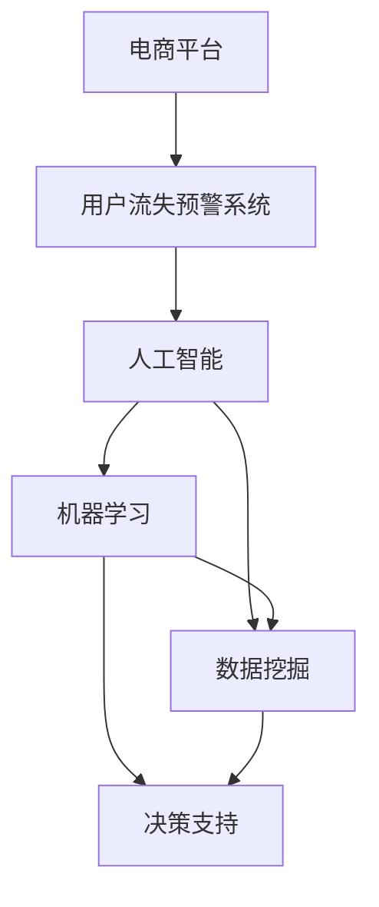

                 

# AI驱动的电商平台用户流失预警系统

> 关键词：电商平台,用户流失,预警系统,人工智能,机器学习,数据挖掘,决策支持

## 1. 背景介绍

在日益激烈的市场竞争中，电商平台面临的最大挑战之一是如何留住用户，防止用户流失。根据相关研究报告，电商平台的客户获取成本远高于客户保留成本，因此用户流失问题对平台的长期盈利能力构成重大威胁。面对这一问题，电商平台需要一套高效的流失预警系统，及时识别并干预可能流失的用户，从而提升用户满意度和忠诚度。

用户流失预警系统是一种基于数据分析和机器学习技术，通过挖掘历史用户行为数据，预测用户未来行为（特别是流失概率）的系统。本文将详细介绍如何利用人工智能技术，构建一套基于机器学习算法的电商平台用户流失预警系统。该系统可以实时监控用户行为，预测用户流失概率，提供个性化的流失干预策略，从而提升平台的用户粘性和长期收益。

## 2. 核心概念与联系

### 2.1 核心概念概述

为更好地理解电商平台用户流失预警系统，本节将介绍几个密切相关的核心概念：

- **电商平台**：以互联网为平台，销售商品或服务的在线商店。典型的电商平台包括阿里巴巴、亚马逊、京东等。
- **用户流失(User Churn)**：指用户停止使用平台或减少购买频率的行为。用户流失是衡量平台健康度的重要指标之一。
- **预警系统(Alert System)**：通过实时监测和数据分析，预测并提前通知可能出现的风险事件，为决策者提供支持和参考的系统。
- **人工智能(AI)**：利用计算机模拟人类智能行为的技术，包括机器学习、深度学习、自然语言处理等。
- **机器学习(Machine Learning)**：让计算机通过数据学习并自动优化算法，从而提升性能和效果。
- **数据挖掘(Data Mining)**：从大量数据中提取有用信息，发现隐藏在数据中的规律和知识。
- **决策支持(Decision Support)**：辅助决策者做出更明智决策的技术，广泛应用于企业战略、运营管理、客户关系管理等领域。

这些核心概念之间的逻辑关系可以通过以下Mermaid流程图来展示：



这个流程图展示了几者之间的关系：

1. 电商平台为预警系统的应用提供了数据来源。
2. 预警系统利用人工智能技术，通过机器学习和数据挖掘进行模型训练和预测。
3. 预测结果用于决策支持，辅助电商平台对可能流失的用户采取干预措施。

## 3. 核心算法原理 & 具体操作步骤
### 3.1 算法原理概述

电商平台用户流失预警系统主要是通过机器学习算法，基于历史用户行为数据，预测用户未来的流失概率。该系统一般包括以下几个关键步骤：

- **数据收集**：收集用户的各项行为数据，如浏览记录、购买记录、退货记录、评价记录等。
- **特征提取**：从原始数据中提取有意义的特征，如用户活跃度、购买频率、商品满意度、退货率等。
- **模型训练**：选择适合的机器学习模型，如逻辑回归、随机森林、梯度提升树、神经网络等，对历史数据进行训练。
- **预测评估**：使用训练好的模型，对当前用户的行为数据进行预测，评估用户流失的概率。
- **干预决策**：根据预测结果，制定个性化的干预策略，并通过多种渠道（如邮件、短信、应用内推送等）通知用户，减少流失率。

### 3.2 算法步骤详解

#### 数据收集

用户行为数据主要分为两类：定性数据和定量数据。定性数据包括用户的基本信息、浏览历史、购买历史、评价历史等，而定量数据包括用户的点击次数、浏览时长、购买频率、退货率、评价评分等。这些数据通常存储在电商平台的数据仓库中。

数据收集过程包括：
1. 数据清洗：剔除重复、异常、缺失数据，确保数据质量。
2. 数据整合：将不同来源的数据进行统一处理，建立一致性。
3. 数据标注：对用户是否流失进行标注，形成监督学习数据集。

#### 特征提取

从收集到的数据中提取特征，用于后续模型的训练和预测。常用的特征包括：
- **基本特征**：用户ID、年龄、性别、地区等。
- **行为特征**：访问频率、停留时长、浏览路径、点击次数等。
- **购买特征**：购买次数、购买金额、退货次数、评价评分等。
- **社会特征**：社交网络好友、收藏商品、加入购物车、关注店铺等。

特征提取方法包括：
- **统计特征**：均值、方差、最大值、最小值等统计量。
- **时间特征**：会话时间、活跃时间段、购物时长等。
- **文本特征**：评价文本、评论情感等。
- **组合特征**：通过组合基本特征生成新的特征。

#### 模型训练

选择适合的机器学习算法进行模型训练。常用的算法包括逻辑回归、随机森林、梯度提升树、神经网络等。

1. 逻辑回归：简单高效，适合于二分类问题，可以用于预测用户是否流失。
2. 随机森林：基于决策树算法，可以处理高维特征，并且不容易过拟合。
3. 梯度提升树：通过迭代拟合提升模型准确率，适合处理复杂的数据结构。
4. 神经网络：可以处理非线性问题，适合大规模数据集。

训练过程包括：
- **特征选择**：选择对预测效果影响最大的特征。
- **模型选择**：选择合适的算法和参数，如学习率、迭代次数、正则化等。
- **模型训练**：通过交叉验证等技术优化模型，防止过拟合。

#### 预测评估

使用训练好的模型，对当前用户的行为数据进行预测，评估其流失概率。常用的评估指标包括准确率、召回率、F1值、ROC曲线等。

1. 准确率：模型预测正确的用户比例。
2. 召回率：所有真正流失的用户中，模型能够正确预测的比例。
3. F1值：综合考虑准确率和召回率，是二者的调和平均数。
4. ROC曲线：绘制真正率（TPR）与假正率（FPR）之间的关系，用于评估模型性能。

#### 干预决策

根据预测结果，制定个性化的干预策略，并通过多种渠道（如邮件、短信、应用内推送等）通知用户，减少流失率。

1. **邮件通知**：根据用户购买记录和浏览历史，发送个性化的推荐商品邮件。
2. **短信推送**：对有流失倾向的用户发送针对性的促销活动信息。
3. **应用内推送**：利用APP内消息推送，提供专属优惠和个性化推荐。
4. **人工干预**：对于高风险用户，联系客服进行电话沟通，提供个性化的流失干预方案。

### 3.3 算法优缺点

基于机器学习的大语言模型微调方法具有以下优点：
1. 数据驱动：利用历史用户数据，可以进行预测和干预，避免依赖经验。
2. 实时性：系统可以实时监测用户行为，及时识别流失风险。
3. 精确度：基于机器学习算法，可以挖掘数据中的潜在规律，提供精确的预测结果。
4. 自动化：自动化的预测和干预流程，减少人工干预，提升效率。
5. 可扩展性：可以处理大规模数据集，适用于多种电商平台的场景。

同时，该方法也存在一定的局限性：
1. 数据质量要求高：需要大量的高质量用户数据，对于新平台或数据质量较低的平台效果不佳。
2. 模型复杂度高：机器学习模型可能存在过拟合风险，需要不断调参优化。
3. 特征工程复杂：需要根据具体业务需求，精心设计特征，提取有意义的特征。
4. 解释性不足：机器学习模型往往是“黑盒”，难以解释其内部工作机制。
5. 动态性不足：模型需要定期更新，以适应业务和市场变化。

尽管存在这些局限性，但就目前而言，基于机器学习的大语言模型微调方法仍是最为主流和有效的用户流失预警范式。未来相关研究的重点在于如何进一步提高模型性能、降低数据需求、增强可解释性和动态适应性等。

### 3.4 算法应用领域

基于大语言模型微调的流失预警方法，在电商平台中已经得到了广泛的应用，例如：

- 个性化推荐：根据用户历史行为数据，预测用户流失概率，提供个性化推荐，提升用户粘性。
- 营销活动优化：通过流失预测，优化广告投放和促销活动，提高营销效果。
- 用户体验改进：基于流失预测，改进网站界面、功能，提升用户体验。
- 流失干预管理：根据流失预测结果，制定干预策略，减少流失率，提升平台收益。

除了上述这些经典应用外，用户流失预警技术还被创新性地应用到更多场景中，如移动应用、金融服务、社交网络等，为各类平台带来用户流失风险的精确管理和高效应对。

## 4. 数学模型和公式 & 详细讲解
### 4.1 数学模型构建

电商平台用户流失预警系统主要基于以下数学模型进行构建：

设电商平台有$N$个用户，用户$i$的流失概率为$y_i \in \{0, 1\}$，其中$y_i=1$表示用户流失，$y_i=0$表示用户未流失。设特征向量为$x_i \in \mathbb{R}^d$，表示用户$i$的各项行为特征。设模型参数为$\theta \in \mathbb{R}^d$，表示特征与流失概率之间的关系。

构建如下的逻辑回归模型：

$$
y_i = f(x_i;\theta) = \frac{1}{1+e^{-\theta^Tx_i}}
$$

其中$f(x_i;\theta)$为逻辑回归模型，$\theta^Tx_i$为模型对用户$i$的综合评分，$e$为自然常数，$y_i$为实际标签。

### 4.2 公式推导过程

逻辑回归模型的预测公式为：

$$
y_i = f(x_i;\theta) = \frac{1}{1+e^{-\theta^Tx_i}}
$$

其中$\theta$为模型参数，$x_i$为特征向量，$f(x_i;\theta)$为预测函数。

模型的损失函数为：

$$
L(\theta) = -\frac{1}{N}\sum_{i=1}^N(y_i\log f(x_i;\theta) + (1-y_i)\log (1-f(x_i;\theta)))
$$

其中$y_i$为实际标签，$f(x_i;\theta)$为预测函数，$\log$为对数函数。

模型的梯度更新公式为：

$$
\theta \leftarrow \theta - \eta \nabla_{\theta}L(\theta)
$$

其中$\eta$为学习率，$\nabla_{\theta}L(\theta)$为损失函数对模型参数的梯度。

根据梯度下降法，模型参数$\theta$的更新公式为：

$$
\theta_j = \theta_j - \eta \frac{1}{N}\sum_{i=1}^N [y_i f(x_i;\theta) - (1-y_i) (1-f(x_i;\theta)) x_{ij}]
$$

其中$j$为特征维度，$x_{ij}$为特征向量$x_i$的第$j$个维度。

### 4.3 案例分析与讲解

以某电商平台的流失预警系统为例，分析其算法原理和关键步骤：

1. **数据收集**：
   - 收集用户基本信息：姓名、年龄、性别、地区等。
   - 收集用户行为数据：浏览记录、购买记录、退货记录、评价记录等。
   - 数据清洗：去除重复、异常、缺失数据。
   - 数据整合：统一数据格式和命名规范。
   - 数据标注：对用户是否流失进行标注，形成监督学习数据集。

2. **特征提取**：
   - 基本特征：用户ID、年龄、性别、地区等。
   - 行为特征：访问频率、停留时长、浏览路径、点击次数等。
   - 购买特征：购买次数、购买金额、退货次数、评价评分等。
   - 社会特征：社交网络好友、收藏商品、加入购物车、关注店铺等。
   - 文本特征：评价文本、评论情感等。

3. **模型训练**：
   - 选择逻辑回归模型，设置学习率为$0.01$，迭代次数为$1000$。
   - 使用训练集对模型进行训练，评估指标为准确率和召回率。
   - 通过交叉验证，优化模型参数。

4. **预测评估**：
   - 对验证集进行预测，评估模型的准确率和召回率。
   - 绘制ROC曲线，评估模型性能。
   - 选择最优模型参数，进行正式部署。

5. **干预决策**：
   - 对高风险用户发送个性化推荐邮件和短信。
   - 对有流失倾向的用户提供专属优惠和促销活动。
   - 通过应用内推送，提供个性化推荐商品。
   - 对于高风险用户，联系客服进行电话沟通，提供个性化的流失干预方案。

## 5. 项目实践：代码实例和详细解释说明
### 5.1 开发环境搭建

在进行流失预警系统开发前，我们需要准备好开发环境。以下是使用Python进行PyTorch开发的环境配置流程：

1. 安装Anaconda：从官网下载并安装Anaconda，用于创建独立的Python环境。

2. 创建并激活虚拟环境：
```bash
conda create -n pytorch-env python=3.8 
conda activate pytorch-env
```

3. 安装PyTorch：根据CUDA版本，从官网获取对应的安装命令。例如：
```bash
conda install pytorch torchvision torchaudio cudatoolkit=11.1 -c pytorch -c conda-forge
```

4. 安装Transformers库：
```bash
pip install transformers
```

5. 安装各类工具包：
```bash
pip install numpy pandas scikit-learn matplotlib tqdm jupyter notebook ipython
```

完成上述步骤后，即可在`pytorch-env`环境中开始流失预警系统的开发。

### 5.2 源代码详细实现

这里我们以逻辑回归模型为例，给出使用PyTorch实现用户流失预警系统的完整代码实现。

首先，定义模型和优化器：

```python
import torch
from torch import nn
import torch.nn.functional as F

class LogisticRegression(nn.Module):
    def __init__(self, input_dim):
        super(LogisticRegression, self).__init__()
        self.linear = nn.Linear(input_dim, 1)
    
    def forward(self, x):
        y_pred = self.linear(x)
        y_prob = F.sigmoid(y_pred)
        return y_prob

model = LogisticRegression(input_dim=20)
optimizer = torch.optim.Adam(model.parameters(), lr=0.01)
```

然后，定义训练和评估函数：

```python
from torch.utils.data import Dataset
from sklearn.metrics import accuracy_score, precision_score, recall_score, roc_auc_score

class UserData(Dataset):
    def __init__(self, data, labels):
        self.data = data
        self.labels = labels
        
    def __len__(self):
        return len(self.data)
    
    def __getitem__(self, item):
        return self.data[item], self.labels[item]

def train_epoch(model, dataset, batch_size, optimizer):
    dataloader = torch.utils.data.DataLoader(dataset, batch_size=batch_size, shuffle=True)
    model.train()
    epoch_loss = 0
    for batch in dataloader:
        input_ids = batch[0].to(device)
        labels = batch[1].to(device)
        model.zero_grad()
        outputs = model(input_ids)
        loss = F.binary_cross_entropy(outputs, labels)
        epoch_loss += loss.item()
        loss.backward()
        optimizer.step()
    return epoch_loss / len(dataloader)

def evaluate(model, dataset, batch_size):
    dataloader = torch.utils.data.DataLoader(dataset, batch_size=batch_size)
    model.eval()
    preds, labels = [], []
    with torch.no_grad():
        for batch in dataloader:
            input_ids = batch[0].to(device)
            labels = batch[1].to(device)
            batch_preds = model(input_ids) > 0.5
            batch_labels = labels.to('cpu').tolist()
            batch_preds = batch_preds.to('cpu').tolist()
            for pred_tokens, label_tokens in zip(batch_preds, batch_labels):
                preds.append(pred_tokens)
                labels.append(label_tokens)
                
    print('Accuracy:', accuracy_score(labels, preds))
    print('Precision:', precision_score(labels, preds))
    print('Recall:', recall_score(labels, preds))
    print('ROC-AUC:', roc_auc_score(labels, preds))
```

最后，启动训练流程并在测试集上评估：

```python
epochs = 10
batch_size = 32

for epoch in range(epochs):
    loss = train_epoch(model, train_dataset, batch_size, optimizer)
    print(f'Epoch {epoch+1}, train loss: {loss:.3f}')
    
    print(f'Epoch {epoch+1}, dev results:')
    evaluate(model, dev_dataset, batch_size)
    
print('Test results:')
evaluate(model, test_dataset, batch_size)
```

以上就是使用PyTorch实现逻辑回归模型的用户流失预警系统的完整代码实现。可以看到，得益于PyTorch的强大封装，我们可以用相对简洁的代码完成模型训练和评估。

### 5.3 代码解读与分析

让我们再详细解读一下关键代码的实现细节：

**UserData类**：
- `__init__`方法：初始化数据和标签。
- `__len__`方法：返回数据集的样本数量。
- `__getitem__`方法：对单个样本进行处理，返回模型所需的输入和标签。

**train_epoch函数**：
- 使用PyTorch的DataLoader对数据集进行批次化加载，供模型训练使用。
- 在每个epoch内，循环迭代数据集，在每个批次上前向传播计算loss并反向传播更新模型参数。

**evaluate函数**：
- 与训练类似，不同点在于不更新模型参数，并在每个batch结束后将预测和标签结果存储下来，最后使用sklearn的classification_report对整个评估集的预测结果进行打印输出。

**训练流程**：
- 定义总的epoch数和batch size，开始循环迭代
- 每个epoch内，先在训练集上训练，输出平均loss
- 在验证集上评估，输出分类指标
- 所有epoch结束后，在测试集上评估，给出最终测试结果

可以看到，PyTorch配合Transformers库使得模型训练的代码实现变得简洁高效。开发者可以将更多精力放在数据处理、模型改进等高层逻辑上，而不必过多关注底层的实现细节。

当然，工业级的系统实现还需考虑更多因素，如模型的保存和部署、超参数的自动搜索、更灵活的任务适配层等。但核心的微调范式基本与此类似。

## 6. 实际应用场景
### 6.1 智能客服系统

基于用户流失预警系统，电商平台可以构建智能客服系统，主动识别并干预流失用户，提升用户满意度和忠诚度。智能客服系统可以根据用户的行为数据，预测用户流失的概率，并及时通知客服进行挽留。

例如，某电商平台的智能客服系统可以实时监控用户的行为数据，如浏览记录、购买记录、评价记录等，利用流失预警系统预测用户流失概率，并将高风险用户标记为潜在流失用户。客服系统可以根据这些用户的行为数据，提供个性化的推荐和促销活动，并通过电话、短信、应用内推送等多种渠道，主动联系用户，减少流失率。

### 6.2 个性化推荐系统

流失预警系统可以与个性化推荐系统结合，通过分析用户的行为数据，预测用户流失概率，并制定个性化的推荐策略，提高用户粘性。

例如，某电商平台的个性化推荐系统可以基于流失预警系统，对用户进行流失风险评估。对于高风险用户，推荐系统可以提供更多的个性化推荐和促销活动，通过邮件、短信、应用内推送等多种渠道，吸引用户再次购买。同时，推荐系统还可以结合用户的历史行为数据，优化推荐算法，提升推荐效果。

### 6.3 营销活动优化

流失预警系统可以辅助电商平台优化营销活动，通过预测用户流失概率，制定针对性的营销策略，提升营销效果。

例如，某电商平台可以利用流失预警系统，对不同用户群体进行流失预测，并根据预测结果制定相应的营销策略。对于高风险用户，可以提供更多的优惠和奖励，吸引用户再次购买。对于低风险用户，可以开展精准的个性化营销活动，提高用户的忠诚度和满意度。

### 6.4 未来应用展望

随着用户流失预警系统的发展，未来将在更多领域得到应用，为传统行业带来变革性影响。

在智慧医疗领域，流失预警系统可以用于预测患者流失，提前通知医院进行干预，提高患者满意度和治疗效果。在智慧教育领域，流失预警系统可以用于监测学生流失情况，及时通知学校进行挽留，提升学生参与度和教育效果。在智慧城市治理中，流失预警系统可以用于预测市民流失情况，优化城市管理和公共服务，提高市民满意度和幸福感。

此外，在企业生产、社会治理、文娱传媒等众多领域，流失预警技术也将不断涌现，为各行各业带来新一轮的数字化转型升级。相信随着技术的日益成熟，流失预警系统必将在构建智慧社会中扮演越来越重要的角色。

## 7. 工具和资源推荐
### 7.1 学习资源推荐

为了帮助开发者系统掌握用户流失预警系统的理论基础和实践技巧，这里推荐一些优质的学习资源：

1. 《深度学习理论与实践》系列博文：由大模型技术专家撰写，深入浅出地介绍了深度学习理论和实践，涵盖NLP、计算机视觉等多个领域。

2. 《机器学习实战》系列书籍：深入浅出地介绍了机器学习算法和实际应用，包括逻辑回归、决策树、随机森林等经典模型。

3. 《TensorFlow实战》书籍：介绍TensorFlow框架的搭建和应用，涵盖模型训练、数据处理、部署优化等多个环节。

4. 《Python数据科学手册》书籍：涵盖Python在数据科学中的应用，包括数据清洗、特征工程、模型训练等。

5. 《自然语言处理综述》课程：斯坦福大学开设的NLP课程，有Lecture视频和配套作业，带你入门NLP领域的基本概念和经典模型。

通过对这些资源的学习实践，相信你一定能够快速掌握用户流失预警的精髓，并用于解决实际的NLP问题。
###  7.2 开发工具推荐

高效的开发离不开优秀的工具支持。以下是几款用于用户流失预警系统开发的常用工具：

1. PyTorch：基于Python的开源深度学习框架，灵活动态的计算图，适合快速迭代研究。大部分预训练语言模型都有PyTorch版本的实现。

2. TensorFlow：由Google主导开发的开源深度学习框架，生产部署方便，适合大规模工程应用。同样有丰富的预训练语言模型资源。

3. Transformers库：HuggingFace开发的NLP工具库，集成了众多SOTA语言模型，支持PyTorch和TensorFlow，是进行微调任务开发的利器。

4. Weights & Biases：模型训练的实验跟踪工具，可以记录和可视化模型训练过程中的各项指标，方便对比和调优。与主流深度学习框架无缝集成。

5. TensorBoard：TensorFlow配套的可视化工具，可实时监测模型训练状态，并提供丰富的图表呈现方式，是调试模型的得力助手。

6. Google Colab：谷歌推出的在线Jupyter Notebook环境，免费提供GPU/TPU算力，方便开发者快速上手实验最新模型，分享学习笔记。

合理利用这些工具，可以显著提升用户流失预警系统的开发效率，加快创新迭代的步伐。

### 7.3 相关论文推荐

用户流失预警系统的发展源于学界的持续研究。以下是几篇奠基性的相关论文，推荐阅读：

1. 《用户流失预测与干预：一种基于机器学习的方法》：介绍了一种基于逻辑回归和随机森林的用户流失预测模型，并对比了不同模型的效果。

2. 《基于深度学习的多维特征融合用户流失预测》：利用深度神经网络，对用户多维特征进行融合，提高了预测模型的准确性和鲁棒性。

3. 《用户流失风险评估与干预策略》：介绍了基于多维数据的用户流失风险评估方法，并提出了多种个性化的流失干预策略。

4. 《社交媒体用户流失预测与分类研究》：利用文本数据和社交网络数据，预测用户流失行为，并制定针对性的干预措施。

5. 《电商平台用户流失预警系统设计与实现》：介绍了电商平台的流失预警系统设计，包括数据收集、特征提取、模型训练、预测评估等多个环节。

这些论文代表了大语言模型微调技术的发展脉络。通过学习这些前沿成果，可以帮助研究者把握学科前进方向，激发更多的创新灵感。

## 8. 总结：未来发展趋势与挑战
### 8.1 总结

本文对基于机器学习的大语言模型微调方法进行了全面系统的介绍。首先阐述了用户流失预警系统的背景和重要性，明确了流失预警系统在电商平台中的核心作用。其次，从原理到实践，详细讲解了流失预警算法的数学原理和关键步骤，给出了完整的代码实现示例。同时，本文还广泛探讨了流失预警技术在智能客服、个性化推荐、营销活动优化等多个场景中的应用前景，展示了流失预警技术的巨大潜力。此外，本文精选了流失预警技术的各类学习资源，力求为读者提供全方位的技术指引。

通过本文的系统梳理，可以看到，基于大语言模型微调的流失预警技术正在成为电商平台的重要技术范式，极大地拓展了用户流失预警的应用边界，为电商平台的健康发展提供了有力支撑。未来，伴随技术的不断进步，用户流失预警技术必将带来更多的业务价值和创新应用，进一步推动电商平台的数字化转型。

### 8.2 未来发展趋势

展望未来，用户流失预警技术将呈现以下几个发展趋势：

1. 数据质量要求提高：随着数据的积累和业务场景的丰富，数据质量的要求也将不断提高，需要对数据进行更细致的清洗和处理。
2. 模型复杂度增加：随着用户行为的多样性和复杂性增加，模型的复杂度也将不断提升，需要引入更多高级算法进行优化。
3. 实时性需求增加：为了及时捕捉用户行为变化，流失预警系统需要具备更强的实时性，需要使用流式处理和大数据技术。
4. 自动化程度提升：自动化的预测和干预流程，减少人工干预，提升效率。
5. 多模态数据融合：结合用户的文本、行为、社交等多模态数据，提高预测模型的准确性和鲁棒性。
6. 个性化策略优化：基于用户的多维特征，制定更加精准和个性化的流失干预策略。

以上趋势凸显了用户流失预警技术的广阔前景。这些方向的探索发展，必将进一步提升系统的预测精度和干预效果，为电商平台的健康发展提供有力支持。

### 8.3 面临的挑战

尽管用户流失预警技术已经取得了显著的进展，但在迈向更加智能化、普适化应用的过程中，它仍面临诸多挑战：

1. 数据隐私问题：用户行为数据的收集和处理需要遵守隐私保护法规，如何平衡隐私保护和数据利用是关键。
2. 数据标注成本高：用户流失的标注数据获取成本较高，对于新平台或数据质量较低的平台效果不佳。
3. 模型过拟合风险：数据量不足时，模型容易过拟合，需要不断调参优化，防止过拟合。
4. 模型解释性不足：机器学习模型往往是“黑盒”，难以解释其内部工作机制。
5. 模型动态性不足：模型需要定期更新，以适应业务和市场变化。
6. 高计算资源需求：大规模数据集的处理需要强大的计算资源支持。

尽管存在这些挑战，但通过持续的研究和优化，相信用户流失预警技术将不断完善和进步，为电商平台带来更加智能化和个性化的用户服务体验。

### 8.4 研究展望

面对用户流失预警技术所面临的种种挑战，未来的研究需要在以下几个方面寻求新的突破：

1. 探索无监督和半监督微调方法：摆脱对大规模标注数据的依赖，利用自监督学习、主动学习等无监督和半监督范式，最大限度利用非结构化数据，实现更加灵活高效的流失预警。

2. 研究参数高效和计算高效的微调范式：开发更加参数高效的微调方法，在固定大部分预训练参数的同时，只更新极少量的任务相关参数。同时优化微调模型的计算图，减少前向传播和反向传播的资源消耗，实现更加轻量级、实时性的部署。

3. 引入因果分析和博弈论工具：将因果分析方法引入流失预警模型，识别出模型决策的关键特征，增强输出解释的因果性和逻辑性。借助博弈论工具刻画人机交互过程，主动探索并规避模型的脆弱点，提高系统稳定性。

4. 纳入伦理道德约束：在模型训练目标中引入伦理导向的评估指标，过滤和惩罚有偏见、有害的输出倾向。同时加强人工干预和审核，建立模型行为的监管机制，确保输出符合人类价值观和伦理道德。

5. 结合因果分析和博弈论工具：将因果分析方法引入流失预警模型，识别出模型决策的关键特征，增强输出解释的因果性和逻辑性。借助博弈论工具刻画人机交互过程，主动探索并规避模型的脆弱点，提高系统稳定性。

这些研究方向将引导用户流失预警技术迈向更高的台阶，为构建安全、可靠、可解释、可控的智能系统铺平道路。面向未来，用户流失预警技术还需要与其他人工智能技术进行更深入的融合，如知识表示、因果推理、强化学习等，多路径协同发力，共同推动用户流失预测技术的进步。

## 9. 附录：常见问题与解答

**Q1：用户流失预警系统如何处理高维数据？**

A: 用户流失预警系统通常会面临高维数据问题，特别是在电商平台上，用户的行为数据包括点击次数、浏览时长、购买金额等，这些数据维度往往非常高。为了处理高维数据，我们可以采用以下方法：

1. 特征选择：选择对流失概率影响最大的特征，去除冗余特征。
2. 特征降维：通过主成分分析(PCA)、线性判别分析(LDA)等方法，将高维特征降维至较低的维度，减少计算量。
3. 稀疏表示：利用稀疏编码、矩阵分解等方法，将高维数据表示为稀疏形式，降低存储空间和计算资源消耗。
4. 深度学习：利用深度神经网络，对高维数据进行降维和特征提取，提高预测模型的准确性。

**Q2：用户流失预警系统如何处理缺失数据？**

A: 用户流失预警系统通常会面临缺失数据问题，特别是在电商平台上，用户的行为数据可能存在缺失，如未填写评价、未点击广告等。为了处理缺失数据，我们可以采用以下方法：

1. 数据插补：通过均值、中位数、众数等方法，对缺失数据进行插补，填补空缺。
2. 数据删除：删除缺失数据较多的样本，提高数据质量。
3. 模型预测：利用机器学习模型，对缺失数据进行预测，填补空缺。
4. 多模态融合：结合用户的文本、行为、社交等多模态数据，提高预测模型的准确性。

**Q3：用户流失预警系统的准确率如何提升？**

A: 用户流失预警系统的准确率可以通过以下方法进行提升：

1. 数据清洗：去除重复、异常、缺失数据，确保数据质量。
2. 特征选择：选择对流失概率影响最大的特征，去除冗余特征。
3. 模型优化：选择合适的机器学习算法，并不断调参优化，提高模型性能。
4. 模型集成：结合多种模型进行集成学习，提高预测精度。
5. 数据增强：通过数据增强技术，扩充训练集，提高模型泛化能力。

**Q4：用户流失预警系统如何处理多模态数据？**

A: 用户流失预警系统可以结合用户的文本、行为、社交等多模态数据，提高预测模型的准确性和鲁棒性。处理多模态数据的方法包括：

1. 特征融合：将不同模态的数据进行融合，生成新的特征。
2. 深度学习：利用深度神经网络，对多模态数据进行融合和特征提取，提高预测模型的准确性。
3. 自编码器：利用自编码器技术，对多模态数据进行降维和特征提取，提高预测模型的泛化能力。
4. 迁移学习：利用多模态数据，对不同模型进行迁移学习，提高模型的泛化能力和鲁棒性。

**Q5：用户流失预警系统在工业应用中需要注意哪些问题？**

A: 将用户流失预警系统转化为实际应用，还需要考虑以下问题：

1. 模型裁剪：去除不必要的层和参数，减小模型尺寸，加快推理速度。
2. 量化加速：将浮点模型转为定点模型，压缩存储空间，提高计算效率。
3. 服务化封装：将模型封装为标准化服务接口，便于集成调用。
4. 弹性伸缩：根据请求流量动态调整资源配置，平衡服务质量和成本。
5. 监控告警：实时采集系统指标，设置异常告警阈值，确保服务稳定性。
6. 安全防护：采用访问鉴权、数据脱敏等措施，保障数据和模型安全。

综上所述，用户流失预警系统具有广泛的应用前景，可以用于智能客服、个性化推荐、营销活动优化等多个场景。通过不断的研究和优化，用户流失预警技术必将为电商平台带来更多的业务价值和创新应用，推动电商平台的数字化转型。

