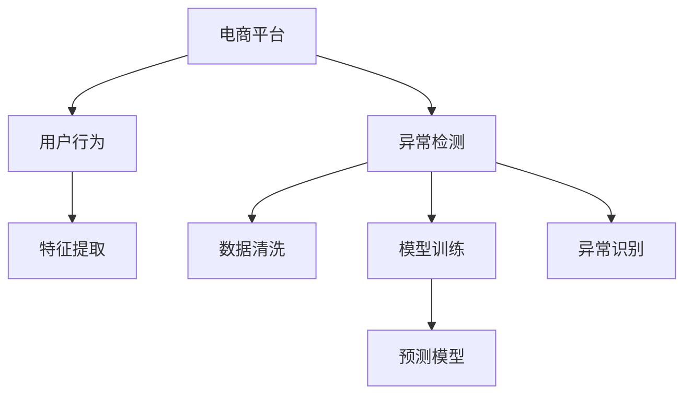

                 

# AI驱动的电商平台用户行为异常检测

> 关键词：电商平台,用户行为,异常检测,人工智能,机器学习

## 1. 背景介绍

### 1.1 问题由来
随着电商市场的快速发展，用户行为分析已成为电商平台提升用户体验、优化运营策略的关键手段。然而，大量的用户行为数据背后，还隐藏着各类异常行为，这些异常行为可能预示着潜在的风险，如欺诈、恶意刷单等。因此，构建高效的用户行为异常检测系统，是电商平台管理的重要需求。

近年来，人工智能（AI）技术，特别是机器学习（Machine Learning, ML）和深度学习（Deep Learning, DL）技术的迅猛发展，为电商平台的异常检测系统提供了强有力的技术支撑。通过深度学习模型，可以从海量的用户行为数据中自动学习到异常行为的模式和特征，为电商平台提供精准的异常检测解决方案。

### 1.2 问题核心关键点
用户行为异常检测的主要挑战在于：
- 数据复杂性：用户行为数据通常具有高维度、高稀疏性和动态变化的特点，难以直接利用传统统计方法进行建模。
- 异常多样性：电商平台上存在多种类型的异常行为，如欺诈、刷单、虚假交易等，难以通过单一模型进行覆盖。
- 实时性要求：电商平台的异常检测系统需要快速响应，及时发现并隔离异常行为，保障平台正常运营。
- 数据隐私：电商数据包含大量用户隐私信息，如何在模型训练和应用过程中保障数据隐私，是一个重要的伦理问题。

本文将详细探讨基于深度学习的电商用户行为异常检测技术，讨论如何通过AI技术构建高效、鲁棒的异常检测系统，助力电商平台安全稳定运营。

## 2. 核心概念与联系

### 2.1 核心概念概述

为更好地理解AI驱动的电商平台用户行为异常检测方法，本节将介绍几个关键概念：

- **电商平台（E-Commerce Platform）**：指通过网络平台提供商品和服务交易的商业模式。包括线上购物、交易支付、物流配送等环节。
- **用户行为（User Behavior）**：指用户在电商平台上的活动轨迹，包括浏览、点击、购买、评价等。
- **异常检测（Anomaly Detection）**：指识别出与正常行为显著不同的异常行为的过程。异常检测通常包括数据清洗、特征提取、模型训练、异常识别等步骤。
- **人工智能（Artificial Intelligence, AI）**：指通过计算机模拟人脑智能行为的技术，包括机器学习、深度学习、自然语言处理、计算机视觉等。
- **深度学习（Deep Learning, DL）**：指利用多层次神经网络模型，学习数据中的深层次特征，实现复杂模式识别和预测的任务。

这些核心概念之间的关系可以通过以下Mermaid流程图来展示：



该流程图展示了电商平台上用户行为异常检测的核心过程：

1. 电商平台收集用户行为数据。
2. 从用户行为数据中提取特征，进行数据清洗。
3. 使用深度学习模型进行训练，构建预测模型。
4. 利用训练好的模型，对用户行为进行预测，识别异常行为。

## 3. 核心算法原理 & 具体操作步骤
### 3.1 算法原理概述

电商用户行为异常检测的核心在于构建一个能够自动学习用户行为模式，并识别出异常行为的预测模型。基于深度学习的异常检测方法，通常包括以下几个步骤：

1. **数据预处理**：清洗用户行为数据，去除噪声，填补缺失值，进行归一化处理。
2. **特征工程**：从用户行为数据中提取有意义的特征，如点击率、停留时间、浏览深度等。
3. **模型选择**：选择合适的深度学习模型进行训练，如自编码器、循环神经网络（RNN）、卷积神经网络（CNN）等。
4. **训练与验证**：使用标注好的异常行为数据训练模型，并通过验证集评估模型性能，调整超参数。
5. **异常识别**：对新的用户行为数据进行预测，识别出与正常行为显著不同的异常行为。

### 3.2 算法步骤详解

**Step 1: 数据预处理**

电商平台上用户行为数据通常具有高维度、高稀疏性和动态变化的特点。因此，需要对原始数据进行预处理，去除噪声，填补缺失值，进行归一化处理。具体步骤如下：

- **清洗数据**：去除明显错误的数据，如异常时间戳、异常行为标记等。
- **填充缺失值**：使用均值、中位数、插值等方法填补缺失值，保持数据完整性。
- **归一化处理**：对数据进行标准化处理，将特征值缩放到一个统一的范围内，便于后续模型训练。

**Step 2: 特征工程**

特征工程是异常检测过程中至关重要的环节，通过提取有意义的特征，模型可以更好地学习到用户行为的模式和规律。常用的特征包括：

- **点击率（Click-through Rate, CTR）**：衡量用户在电商平台上点击商品的概率。
- **浏览深度（Page View Depth）**：指用户在浏览商品时，浏览页面的层数。
- **停留时间（Time on Page）**：用户在浏览商品时停留的时间。
- **购买频率（Purchase Frequency）**：用户在一定时间内的购买次数。
- **评价评分（Rating Score）**：用户对商品的评分。

对于高维稀疏特征，可以采用PCA、LDA等降维技术进行压缩，减少特征维度。同时，可以引入时序特征，利用时间序列数据进行建模。

**Step 3: 模型选择与训练**

深度学习模型在电商用户行为异常检测中表现优异，常用的模型包括：

- **自编码器（Autoencoder）**：通过重构原始用户行为数据，学习到数据的潜在表示。
- **循环神经网络（RNN）**：适用于时序数据，能够捕捉时间依赖性。
- **卷积神经网络（CNN）**：适用于图像和文本数据，能够提取局部特征。
- **注意力机制（Attention Mechanism）**：用于处理长序列数据，能够自适应地关注关键特征。

选择合适的模型后，将其应用到训练集上进行训练。训练过程中，可以采用交叉验证、早停（Early Stopping）等技术，防止过拟合。模型训练的目标是最小化损失函数，如均方误差（MSE）、交叉熵（Cross-Entropy）等。

**Step 4: 异常识别**

训练好的模型可以对新的用户行为数据进行预测，识别出异常行为。具体步骤如下：

- **输入数据**：将新的用户行为数据输入模型，进行预测。
- **输出评分**：模型输出每个样本的异常评分，通常是一个介于0和1之间的值，值越大表示异常的可能性越高。
- **阈值设定**：根据业务需求，设定一个阈值，当异常评分超过该阈值时，视为异常行为。
- **异常报告**：对识别出的异常行为进行报告和处理，如隔离账号、暂停操作等。

### 3.3 算法优缺点

**优点**：
1. **自动学习**：深度学习模型能够自动从数据中学习到异常行为的模式，减少了人工干预的需求。
2. **鲁棒性**：深度学习模型通常具有较强的鲁棒性，能够应对高维度、高稀疏性等数据挑战。
3. **实时性**：深度学习模型可以实时处理用户行为数据，及时发现异常行为。
4. **可扩展性**：深度学习模型具有高度的可扩展性，可以轻松适应不同规模的数据集和不同的应用场景。

**缺点**：
1. **数据需求**：深度学习模型通常需要大量的标注数据进行训练，数据获取成本较高。
2. **计算资源**：深度学习模型通常需要大量的计算资源，包括GPU、TPU等高性能设备，对硬件要求较高。
3. **解释性不足**：深度学习模型的决策过程通常缺乏可解释性，难以理解其内部工作机制。
4. **过拟合风险**：深度学习模型容易过拟合，特别是在数据量较小的情况下，需要通过正则化等技术进行控制。

尽管存在这些局限性，但深度学习在电商用户行为异常检测中仍表现优异，具有广泛的应用前景。

### 3.4 算法应用领域

基于深度学习的电商用户行为异常检测技术，已经在多个领域得到了广泛应用，例如：

- **欺诈检测**：识别出欺诈行为，保护电商平台和用户的安全。
- **恶意刷单**：检测恶意刷单行为，维护电商平台的正常交易秩序。
- **异常交易**：识别出异常交易行为，防止虚假交易和滥用行为。
- **用户行为分析**：对用户行为进行分析和建模，优化电商平台的用户体验。
- **个性化推荐**：根据用户行为数据，推荐个性化商品，提升用户满意度和转化率。

除了上述这些经典应用外，深度学习技术还可以应用于社交网络行为分析、广告点击率预测、智能客服对话分析等，为电商平台的智能化运营提供更多可能性。

## 4. 数学模型和公式 & 详细讲解
### 4.1 数学模型构建

在电商用户行为异常检测中，通常使用深度学习模型进行建模。这里以自编码器为例，构建异常检测模型。

**模型定义**：
设用户行为数据为 $\mathbf{x} \in \mathbb{R}^d$，异常标签为 $y \in \{0, 1\}$，其中0表示正常行为，1表示异常行为。自编码器的模型结构如下：

$$
\begin{aligned}
&\mathbf{h} = \mathbf{E}(\mathbf{x}) \\
&\mathbf{x}^{'} = \mathbf{D}(\mathbf{h})
\end{aligned}
$$

其中，$\mathbf{E}$ 和 $\mathbf{D}$ 分别表示编码器和解码器，$\mathbf{h}$ 为编码器输出，$\mathbf{x}^{'}$ 为解码器输出。模型的目标是最小化重构误差，即：

$$
\mathcal{L}(\theta) = \frac{1}{N} \sum_{i=1}^N \|\mathbf{x}_i - \mathbf{x}_i^{'}\|^2
$$

**模型训练**：
模型训练的目标是最小化重构误差和异常评分。设异常评分函数为 $\hat{y}$，可以定义如下目标函数：

$$
\mathcal{L}_{total}(\theta) = \mathcal{L}(\theta) + \alpha \mathbb{E}_{\mathbf{x}} [\mathcal{L}_{anomaly}(\hat{y}, y)]
$$

其中，$\alpha$ 为异常评分损失权重，$\mathcal{L}_{anomaly}$ 为异常评分损失函数，如二分类交叉熵损失。在训练过程中，通过反向传播算法更新模型参数 $\theta$，最小化总损失函数 $\mathcal{L}_{total}$。

### 4.2 公式推导过程

设自编码器的编码器参数为 $\theta_E$，解码器参数为 $\theta_D$，则编码器重构误差为：

$$
\mathcal{L}_E(\theta_E) = \frac{1}{N} \sum_{i=1}^N \|\mathbf{x}_i - \mathbf{h}_i\|^2
$$

解码器重构误差为：

$$
\mathcal{L}_D(\theta_D) = \frac{1}{N} \sum_{i=1}^N \|\mathbf{x}_i - \mathbf{x}_i^{'}\|^2
$$

目标函数 $\mathcal{L}_{total}$ 可以进一步分解为编码器重构误差、解码器重构误差和异常评分损失函数：

$$
\mathcal{L}_{total}(\theta) = \mathcal{L}_E(\theta_E) + \mathcal{L}_D(\theta_D) + \alpha \mathbb{E}_{\mathbf{x}} [\mathcal{L}_{anomaly}(\hat{y}, y)]
$$

在训练过程中，通过反向传播算法更新模型参数：

$$
\frac{\partial \mathcal{L}_{total}}{\partial \theta} = \frac{\partial \mathcal{L}_E}{\partial \theta_E} + \frac{\partial \mathcal{L}_D}{\partial \theta_D} + \alpha \frac{\partial \mathcal{L}_{anomaly}}{\partial \hat{y}}
$$

其中，$\hat{y} = \sigma(\mathbf{h})$，$\sigma$ 为激活函数，如Sigmoid。

### 4.3 案例分析与讲解

以电商平台上的欺诈检测为例，分析深度学习模型如何识别出异常行为。

设用户行为数据为 $\mathbf{x} = (x_1, x_2, ..., x_n)$，其中 $x_i$ 为第 $i$ 个行为特征。模型通过学习用户行为的模式，构建一个异常评分函数 $\hat{y}$，用于评估每个行为是否异常。训练过程中，通过标注好的异常行为数据，最小化总损失函数 $\mathcal{L}_{total}$。

在测试阶段，对于新的用户行为数据 $\mathbf{x}^{'}$，模型输出异常评分 $\hat{y}^{'}$。根据设定的阈值 $\theta$，当 $\hat{y}^{'} > \theta$ 时，视为异常行为。

## 5. 项目实践：代码实例和详细解释说明
### 5.1 开发环境搭建

在进行电商用户行为异常检测的实践前，我们需要准备好开发环境。以下是使用Python进行TensorFlow开发的环境配置流程：

1. 安装Anaconda：从官网下载并安装Anaconda，用于创建独立的Python环境。

2. 创建并激活虚拟环境：
```bash
conda create -n tf-env python=3.8 
conda activate tf-env
```

3. 安装TensorFlow：根据CUDA版本，从官网获取对应的安装命令。例如：
```bash
pip install tensorflow==2.6
```

4. 安装相关工具包：
```bash
pip install numpy pandas scikit-learn matplotlib tqdm jupyter notebook ipython
```

完成上述步骤后，即可在`tf-env`环境中开始实践。

### 5.2 源代码详细实现

下面我们以电商平台上的欺诈检测为例，给出使用TensorFlow进行异常检测的PyTorch代码实现。

首先，定义数据处理函数：

```python
import tensorflow as tf
from tensorflow.keras.layers import Input, Dense, Embedding, Flatten, Dropout
from tensorflow.keras.models import Model

def load_data():
    # 从数据集中加载数据
    ...
    return X_train, y_train, X_test, y_test
```

然后，定义模型：

```python
# 定义模型结构
input_layer = Input(shape=(d,), name='input')
hidden_layer1 = Dense(64, activation='relu')(input_layer)
hidden_layer2 = Dense(32, activation='relu')(hidden_layer1)
output_layer = Dense(1, activation='sigmoid')(hidden_layer2)

model = Model(inputs=input_layer, outputs=output_layer)
```

接着，定义模型训练函数：

```python
def train_model(model, X_train, y_train, epochs=10, batch_size=32):
    # 定义损失函数和优化器
    loss_fn = tf.keras.losses.BinaryCrossentropy(from_logits=True)
    optimizer = tf.keras.optimizers.Adam()

    # 定义训练过程
    model.compile(optimizer=optimizer, loss=loss_fn, metrics=['accuracy'])
    model.fit(X_train, y_train, epochs=epochs, batch_size=batch_size, validation_data=(X_test, y_test))

    return model
```

最后，调用函数训练模型：

```python
# 加载数据
X_train, y_train, X_test, y_test = load_data()

# 训练模型
model = train_model(model, X_train, y_train)

# 评估模型
test_loss, test_acc = model.evaluate(X_test, y_test)
print(f'Test loss: {test_loss:.4f}, Test accuracy: {test_acc:.4f}')
```

以上就是使用TensorFlow进行电商平台用户行为异常检测的完整代码实现。可以看到，得益于TensorFlow的强大封装，我们可以用相对简洁的代码完成模型的构建和训练。

### 5.3 代码解读与分析

让我们再详细解读一下关键代码的实现细节：

**数据处理函数**：
- `load_data`方法：从数据集中加载数据，进行预处理和归一化处理。
- 使用`Input`定义输入层，指定输入特征维度。
- 使用`Dense`定义隐藏层，指定神经元个数和激活函数。
- 使用`Embedding`将输入特征转换为向量表示。
- 使用`Flatten`将向量展平。
- 使用`Dropout`防止过拟合。
- 使用`Dense`定义输出层，指定神经元个数和激活函数。

**模型训练函数**：
- `train_model`方法：定义损失函数、优化器和训练过程。
- 使用`Model`构建模型，将输入层、隐藏层和输出层组合起来。
- 使用`compile`方法定义模型训练参数。
- 使用`fit`方法训练模型，指定训练轮数、批大小和验证集。
- 使用`evaluate`方法评估模型，输出测试集上的损失和准确率。

**训练流程**：
- 调用`load_data`方法加载数据。
- 调用`train_model`方法训练模型。
- 调用`evaluate`方法评估模型。
- 输出测试集上的损失和准确率。

可以看到，TensorFlow的高级API使得模型构建和训练变得非常便捷，开发者可以将更多精力放在数据处理和模型优化上，而不必过多关注底层细节。

当然，工业级的系统实现还需考虑更多因素，如模型的保存和部署、超参数的自动搜索、更灵活的任务适配层等。但核心的异常检测范式基本与此类似。

## 6. 实际应用场景
### 6.1 智能客服系统

基于AI的电商平台用户行为异常检测技术，可以广泛应用于智能客服系统的构建。传统客服往往需要配备大量人力，高峰期响应缓慢，且一致性和专业性难以保证。而使用异常检测系统，可以实时监控用户行为，及时发现并处理异常问题，提升客服系统的响应速度和质量。

在技术实现上，可以收集客服系统中的用户行为数据，如用户咨询时间、咨询次数、问题类型等，构建异常检测模型。模型能够自动学习到正常客服行为的模式，识别出异常客服行为，如长时间未响应、回答错误等，系统自动提醒客服人员进行检查和处理。对于频繁出现的异常客服行为，系统还可以自动生成问题诊断报告，帮助客服团队优化工作流程。

### 6.2 金融风险管理

金融行业对用户行为的安全性要求极高，异常检测技术可以帮助金融机构识别潜在的欺诈行为，防范金融风险。

具体而言，可以收集金融交易数据，包括交易时间、交易金额、交易地点等，构建异常检测模型。模型能够自动学习到正常交易的模式，识别出异常交易行为，如大额交易、异地交易等，系统自动触发风险警报，并采取相应的防范措施，如冻结账户、联系用户等。异常检测技术还可以应用于信用评估、贷款审批等场景，提升金融机构的风控能力。

### 6.3 广告点击率优化

广告点击率（CTR）是衡量广告效果的重要指标。基于异常检测技术，可以实时监控广告点击行为，识别出异常点击行为，如虚假点击、恶意点击等，从而优化广告投放策略。

具体而言，可以收集广告点击数据，包括点击时间、点击设备、点击位置等，构建异常检测模型。模型能够自动学习到正常点击的模式，识别出异常点击行为，如短时间内大量点击、恶意点击等，系统自动调整广告投放策略，减少无效点击，提升广告效果。异常检测技术还可以应用于用户行为分析，优化广告定向策略，提升广告转化率。

### 6.4 未来应用展望

随着AI技术的不断进步，基于异常检测技术的电商应用将更加广泛和深入，带来更多创新和变革：

- **实时监测**：基于异常检测技术的实时监控系统，可以及时发现并处理异常行为，保障平台正常运营。
- **精准推荐**：通过分析用户行为数据，识别出异常行为，为用户推荐个性化商品，提升用户满意度和转化率。
- **风险预警**：异常检测技术可以应用于金融、医疗等高风险领域，及时发现异常行为，进行风险预警。
- **智能客服**：通过异常检测技术，提升智能客服系统的响应速度和质量，改善用户体验。
- **个性化服务**：通过分析用户行为数据，优化个性化服务策略，提升服务质量和用户满意度。

未来，随着数据量的不断增加和AI技术的不断进步，基于异常检测技术的电商应用将变得更加智能化和高效化，为电商平台带来更多创新和变革。

## 7. 工具和资源推荐
### 7.1 学习资源推荐

为了帮助开发者系统掌握AI驱动的电商平台用户行为异常检测的理论基础和实践技巧，这里推荐一些优质的学习资源：

1. **《深度学习理论与实践》**：清华大学出版社出版的深度学习经典教材，系统讲解深度学习的基本原理和实践方法，适合初学者和进阶者。
2. **Coursera《深度学习专项课程》**：由斯坦福大学Andrew Ng教授主讲的深度学习专项课程，涵盖了深度学习的多个重要主题，包括深度神经网络、卷积神经网络、循环神经网络等。
3. **Kaggle竞赛平台**：Kaggle是一个数据科学竞赛平台，提供了大量的电商数据集和异常检测竞赛，可以参与实战练习，提升技能水平。
4. **GitHub开源项目**：GitHub上有很多优秀的电商异常检测开源项目，可以学习和借鉴其中的实现方法和经验。
5. **Transformers库官方文档**：Transformers库的官方文档提供了详尽的模型介绍和使用方法，是学习深度学习模型的重要资源。

通过对这些资源的学习实践，相信你一定能够快速掌握AI驱动的电商平台用户行为异常检测的精髓，并用于解决实际的电商问题。

### 7.2 开发工具推荐

高效的开发离不开优秀的工具支持。以下是几款用于电商平台异常检测开发的常用工具：

1. **TensorFlow**：由Google主导开发的深度学习框架，支持分布式计算，可以方便地进行大规模模型训练和部署。
2. **PyTorch**：由Facebook主导开发的深度学习框架，灵活高效，支持动态图计算，适合快速迭代研究。
3. **Keras**：由François Chollet开发的高级API，可以在TensorFlow、Theano、CNTK等后端进行模型构建和训练，适合初学者使用。
4. **Jupyter Notebook**：开源的交互式计算环境，支持Python、R等语言，方便进行模型调试和迭代。
5. **H2O.ai**：提供一站式的机器学习平台，支持Python、R等语言，可以进行数据预处理、模型训练、模型部署等。

合理利用这些工具，可以显著提升电商平台异常检测的开发效率，加快创新迭代的步伐。

### 7.3 相关论文推荐

AI驱动的电商平台用户行为异常检测技术，已经取得了诸多重要研究成果。以下是几篇奠基性的相关论文，推荐阅读：

1. **《基于深度学习的电商平台异常行为检测》**：本文提出了基于深度学习的电商平台异常行为检测模型，通过自编码器、卷积神经网络等方法，构建了高效的行为检测系统。
2. **《电商平台用户行为异常检测与防范》**：本文详细介绍了电商平台的异常检测方法，包括数据清洗、特征工程、模型训练等关键步骤。
3. **《深度学习在电商领域的应用》**：本文综述了深度学习在电商领域的应用，包括用户行为分析、推荐系统、广告点击率优化等。
4. **《电商平台数据驱动的异常行为识别》**：本文提出了基于数据驱动的电商平台异常行为识别方法，通过分析用户行为数据，构建异常行为检测模型。
5. **《电商平台欺诈检测与防范》**：本文详细介绍了电商平台欺诈检测的方法，包括数据清洗、特征工程、模型训练等。

这些论文代表了大语言模型微调技术的发展脉络。通过学习这些前沿成果，可以帮助研究者把握学科前进方向，激发更多的创新灵感。

## 8. 总结：未来发展趋势与挑战
### 8.1 总结

本文对基于深度学习的电商平台用户行为异常检测方法进行了全面系统的介绍。首先阐述了电商平台的背景和用户行为异常检测的重要性，明确了异常检测在电商运营中的核心作用。其次，从原理到实践，详细讲解了异常检测的数学模型和算法步骤，给出了电商欺诈检测的代码实例。同时，本文还广泛探讨了异常检测方法在智能客服、金融风险管理、广告点击率优化等多个行业领域的应用前景，展示了异常检测技术的广泛应用价值。

通过本文的系统梳理，可以看到，基于深度学习的电商平台用户行为异常检测技术正在成为电商运营的重要支撑，极大地提升了电商平台的智能化水平，为电商平台的安全稳定运营提供了有力保障。未来，随着深度学习技术的不断进步，异常检测技术将更加高效、精准，为电商平台的智能化运营带来更多可能性。

### 8.2 未来发展趋势

展望未来，电商用户行为异常检测技术将呈现以下几个发展趋势：

1. **数据融合与整合**：未来，异常检测系统将更加注重数据融合与整合，通过多源数据的联合分析，提升异常检测的准确性和鲁棒性。
2. **实时监测与响应**：异常检测系统将更加注重实时监测与响应，通过实时数据流处理技术，实现异常行为的快速识别和处理。
3. **智能推荐与个性化服务**：异常检测技术将与推荐系统、个性化服务策略相结合，提升用户满意度和转化率。
4. **跨领域应用**：异常检测技术将逐步拓展到金融、医疗、社交网络等领域，为不同领域的业务场景提供智能化支撑。
5. **伦理与安全**：异常检测技术将更加注重伦理与安全问题，如数据隐私保护、模型可解释性等，保障用户权益。

以上趋势凸显了电商用户行为异常检测技术的广阔前景。这些方向的探索发展，必将进一步提升异常检测系统的性能和应用范围，为电商平台的智能化运营提供更多创新和变革。

### 8.3 面临的挑战

尽管电商用户行为异常检测技术已经取得了显著进展，但在实际应用中，仍然面临一些挑战：

1. **数据隐私**：电商数据包含大量用户隐私信息，如何在模型训练和应用过程中保障数据隐私，是一个重要的伦理问题。
2. **计算资源**：异常检测模型通常需要大量的计算资源，包括GPU、TPU等高性能设备，对硬件要求较高。
3. **模型泛化**：异常检测模型在不同的数据集和业务场景中，泛化能力可能不足，需要进一步优化模型和算法。
4. **实时处理**：异常检测系统需要实时处理海量数据，对数据流处理技术提出了更高的要求。
5. **用户接受度**：异常检测系统可能会对用户体验造成一定的影响，如冻结账号、限制操作等，需要权衡好安全和用户体验之间的关系。

这些挑战需要技术开发者和业务人员共同面对，不断优化模型、算法和应用策略，才能构建高效、鲁棒的异常检测系统，保障电商平台的正常运营。

### 8.4 研究展望

面对电商用户行为异常检测所面临的种种挑战，未来的研究需要在以下几个方面寻求新的突破：

1. **联邦学习**：通过联邦学习技术，在不共享数据的情况下，实现模型训练和优化，保护用户隐私。
2. **边缘计算**：利用边缘计算技术，将异常检测模型部署到终端设备，提升异常检测的实时性和处理效率。
3. **模型压缩**：通过模型压缩技术，减少模型的参数量和计算资源，提升模型的部署效率。
4. **可解释性**：引入可解释性技术，提升异常检测模型的可解释性，增强用户信任。
5. **跨领域应用**：将异常检测技术应用于更多领域，如金融、医疗、社交网络等，拓展应用范围。

这些研究方向的探索，必将引领电商用户行为异常检测技术迈向更高的台阶，为电商平台的智能化运营带来更多创新和变革。

## 9. 附录：常见问题与解答

**Q1：电商平台上用户行为数据通常具有高维度、高稀疏性和动态变化的特点，如何处理这些问题？**

A: 电商平台上用户行为数据通常具有高维度、高稀疏性和动态变化的特点，因此需要进行数据清洗、特征工程和降维处理。具体步骤如下：

- **数据清洗**：去除明显错误的数据，如异常时间戳、异常行为标记等。
- **填充缺失值**：使用均值、中位数、插值等方法填补缺失值，保持数据完整性。
- **归一化处理**：对数据进行标准化处理，将特征值缩放到一个统一的范围内，便于后续模型训练。
- **降维处理**：采用PCA、LDA等降维技术，减少特征维度。
- **特征选择**：通过特征选择技术，选择对异常检测有用的特征，提升模型的泛化能力。

这些步骤可以显著提升数据的质量，提高异常检测模型的效果。

**Q2：异常检测模型通常需要大量的计算资源，如何降低计算成本？**

A: 异常检测模型通常需要大量的计算资源，包括GPU、TPU等高性能设备，因此需要采用一些资源优化技术，如梯度积累、混合精度训练、模型并行等，来突破硬件瓶颈。具体方法包括：

- **梯度积累**：将多个小批次的梯度合并为一个大的梯度进行更新，减少计算量。
- **混合精度训练**：使用16位浮点数进行计算，减少计算资源消耗。
- **模型并行**：利用分布式计算技术，将模型并行部署到多个设备上进行训练和推理。

这些技术可以显著降低异常检测模型的计算成本，提升模型训练和推理的效率。

**Q3：异常检测模型的决策过程通常缺乏可解释性，如何解决这一问题？**

A: 异常检测模型的决策过程通常缺乏可解释性，难以理解其内部工作机制和决策逻辑。因此，需要引入可解释性技术，提升异常检测模型的可解释性，增强用户信任。具体方法包括：

- **特征重要性分析**：通过分析模型中每个特征的重要性，解释模型决策的原因。
- **模型可视化**：利用可视化技术，展示模型的决策过程和中间结果，帮助用户理解模型。
- **模型蒸馏**：利用蒸馏技术，将大模型转化为轻量级模型，提升模型可解释性。

这些技术可以显著提升异常检测模型的可解释性，增强用户信任和接受度。

**Q4：异常检测模型在实时处理海量数据时，如何提升处理效率？**

A: 异常检测模型在实时处理海量数据时，对数据流处理技术提出了更高的要求。具体方法包括：

- **实时数据流处理**：利用实时数据流处理技术，高效处理海量数据。
- **分布式计算**：利用分布式计算技术，将模型并行部署到多个设备上进行处理。
- **数据压缩**：采用数据压缩技术，减少数据传输和存储的开销。

这些技术可以显著提升异常检测模型在实时处理海量数据时的处理效率。

**Q5：异常检测模型在不同数据集和业务场景中，泛化能力可能不足，如何解决这一问题？**

A: 异常检测模型在不同数据集和业务场景中，泛化能力可能不足，因此需要进一步优化模型和算法。具体方法包括：

- **迁移学习**：通过迁移学习技术，将在大规模数据集上训练好的模型迁移到小规模数据集上，提升模型的泛化能力。
- **自适应学习**：利用自适应学习技术，根据不同的数据集和业务场景，动态调整模型参数，提升模型的泛化能力。
- **模型集成**：通过模型集成技术，将多个模型的结果进行融合，提升模型的泛化能力。

这些技术可以显著提升异常检测模型的泛化能力，适应不同数据集和业务场景的需求。

通过这些问题的解答，可以看到，电商用户行为异常检测技术在实际应用中仍面临一些挑战，需要不断优化模型、算法和应用策略，才能构建高效、鲁棒的异常检测系统，保障电商平台的正常运营。未来，随着深度学习技术的不断进步，异常检测技术将更加高效、精准，为电商平台的智能化运营带来更多创新和变革。

