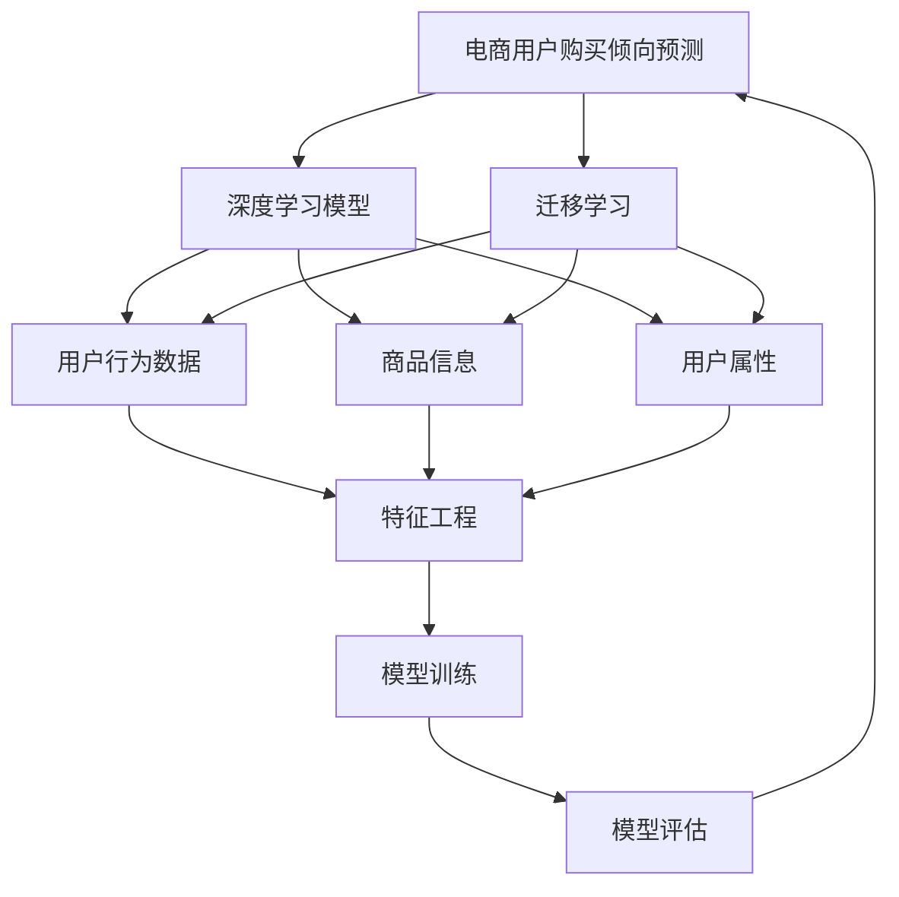

                 

# AI驱动的电商用户购买倾向预测模型

> 关键词：电商, 用户, 购买倾向, 预测模型, AI, 深度学习

## 1. 背景介绍

### 1.1 问题由来
在电商领域，用户购买行为的预测一直是提升销售转化率、优化库存管理、个性化推荐等方面的关键环节。传统上，电商商家主要依赖基于规则的推荐系统或线性回归模型来进行用户购买倾向的预测。但这些方法的预测效果往往受限于规则的完备性和特征的覆盖面。近年来，随着深度学习技术的快速发展，电商公司开始尝试使用深度学习模型进行用户购买倾向预测，尤其是基于大模型的迁移学习方法，取得了一系列进展。

### 1.2 问题核心关键点
电商用户购买倾向预测的核心在于如何从大量的用户行为数据中提取有效的特征，并结合先验知识，构建精准的预测模型。当前，深度学习模型如循环神经网络(RNN)、卷积神经网络(CNN)、注意力机制(Attention)等，已经被广泛应用于电商领域的用户行为预测中。这些模型的关键在于如何更好地利用用户的历史行为数据，并融入电商领域特有的商品信息、交易数据、用户属性等特征，从而构建高效且鲁棒的预测模型。

## 2. 核心概念与联系

### 2.1 核心概念概述

为更好地理解电商用户购买倾向预测模型的构建，本节将介绍几个密切相关的核心概念：

- 用户购买倾向预测：预测用户在特定时间段内购买某一商品的可能性，通常通过用户行为数据、商品信息、用户属性等多种特征进行建模。
- 深度学习模型：一种基于神经网络的机器学习范式，通过多层非线性变换，可以从大量数据中自动学习特征表示，适用于复杂的非线性模式识别任务。
- 迁移学习：指将一个领域学习到的知识，迁移应用到另一个相关领域的学习范式，通过预训练模型获取通用特征表示，再通过微调进行特定任务预测。
- 电商用户行为数据：电商平台记录的用户点击、浏览、加购、支付等行为数据，可用于训练和评估预测模型。
- 模型评估指标：如准确率、召回率、F1分数等，用于衡量模型预测性能。

这些核心概念之间的逻辑关系可以通过以下Mermaid流程图来展示：



这个流程图展示了大模型在电商用户购买倾向预测中的应用框架：

1. 电商用户购买倾向预测模型通过深度学习模型进行建模。
2. 模型获取电商用户行为数据、商品信息和用户属性作为输入特征。
3. 通过迁移学习的方式，模型首先从预训练的通用大模型中学习通用的特征表示。
4. 随后在特定任务数据集上进行微调，构建针对电商用户购买倾向预测的模型。
5. 模型训练完毕后，通过评估指标进行性能评估，以确定是否需要调整模型参数或特征工程策略。

## 3. 核心算法原理 & 具体操作步骤
### 3.1 算法原理概述

电商用户购买倾向预测模型的核心思想是，利用深度学习模型从用户行为数据、商品信息、用户属性等特征中自动学习用户购买倾向的潜在模式，并通过迁移学习的方式，结合电商领域特有的先验知识，进行特定任务的预测。

形式化地，假设模型为 $M_{\theta}$，其中 $\theta$ 为模型参数。电商用户购买倾向预测的任务可以定义为：

$$
P(\text{购买}|x) = \frac{\exp(M_{\theta}(x))}{\sum_{i=1}^N \exp(M_{\theta}(x_i))}
$$

其中 $x$ 为输入特征，$N$ 为样本数量。模型 $M_{\theta}$ 通过最大化 $P(\text{购买}|x)$ 进行训练，目标是预测用户购买某一商品的概率。

### 3.2 算法步骤详解

电商用户购买倾向预测模型的构建一般包括以下几个关键步骤：

**Step 1: 准备预训练模型和数据集**
- 选择合适的预训练深度学习模型，如LSTM、GRU、Transformer等，作为初始化参数。
- 收集电商平台的历史交易数据、用户行为数据、商品信息、用户属性等作为输入特征，并将其标准化、归一化处理。

**Step 2: 设计模型架构**
- 根据电商场景需求，设计模型架构。例如，LSTM模型可以用于时间序列数据的建模，而Transformer模型可以用于特征表示的提取。
- 引入必要的特征提取层、嵌入层、隐藏层、输出层等，并设置合适的激活函数、优化器等超参数。

**Step 3: 进行迁移学习**
- 使用电商用户购买倾向预测任务的标注数据集进行微调。
- 将预训练模型作为初始化参数，使用小批量梯度下降等优化算法更新模型参数。
- 周期性在验证集上评估模型性能，根据评估结果调整学习率、正则化等超参数。

**Step 4: 模型评估与优化**
- 在测试集上评估模型性能，计算准确率、召回率、F1分数等指标。
- 根据评估结果，调整模型结构和超参数，进行模型的优化迭代。
- 进行特征工程优化，如引入更强的特征表示、增强数据样本多样性等。

**Step 5: 部署与应用**
- 将训练好的模型部署到电商平台的推荐系统中，进行实时预测。
- 根据预测结果进行个性化推荐、库存优化、广告投放等应用。

以上是电商用户购买倾向预测模型的构建流程。在实际应用中，还需要根据具体场景和数据特点进行优化设计，如选择更适合的模型架构、改进特征工程策略、引入更多领域先验知识等。

### 3.3 算法优缺点

电商用户购买倾向预测模型具有以下优点：
1. 自动学习特征表示。深度学习模型能够从大量数据中自动学习到有效的特征表示，无需手工设计特征。
2. 捕捉非线性关系。电商用户行为数据通常具有复杂的非线性关系，深度学习模型能够更好地捕捉这些关系。
3. 模型通用性强。深度学习模型在各种电商场景中均有不错的表现，适用于不同的电商平台。
4. 可扩展性强。深度学习模型可以通过增加模型层数、引入更多特征等方式进行扩展，提高预测精度。

同时，该模型也存在一定的局限性：
1. 数据需求量大。电商用户购买倾向预测需要大量的用户行为数据，获取高质量数据成本较高。
2. 模型复杂度高。深度学习模型通常具有高复杂度，训练和推理资源消耗大。
3. 模型易受噪声干扰。电商用户行为数据中可能包含大量噪声，模型容易产生过拟合。
4. 解释性差。深度学习模型的决策过程缺乏可解释性，难以理解模型内部工作机制。

尽管存在这些局限性，但就目前而言，基于深度学习的电商用户购买倾向预测模型仍是大数据时代的主流范式。未来相关研究的重点在于如何进一步降低数据需求，提高模型效率，增强模型可解释性，以及如何更好地结合电商领域特有的先验知识，提升预测精度。

### 3.4 算法应用领域

电商用户购买倾向预测模型已经广泛应用于电商平台的个性化推荐、库存优化、广告投放等多个场景，取得了显著的效果：

- 个性化推荐：利用用户的历史行为数据和当前浏览行为，预测用户可能感兴趣的商品，实现个性化推荐。
- 库存优化：通过预测用户购买概率，动态调整商品库存，避免缺货或过剩。
- 广告投放：预测用户对广告的点击概率，优化广告投放策略，提升广告转化率。
- 客户流失预警：通过预测用户流失概率，进行针对性挽留，提升用户留存率。
- 交叉销售：利用用户购买某一商品的行为，预测其可能对相关商品感兴趣，实现交叉销售。

除了上述这些应用外，电商用户购买倾向预测模型还被创新性地应用到更多场景中，如用户行为路径分析、推荐商品序列生成、实时库存调整等，为电商平台带来了全新的突破。

## 4. 数学模型和公式 & 详细讲解  
### 4.1 数学模型构建

电商用户购买倾向预测模型的构建，可以从简单的线性回归模型开始，逐步引入非线性模型和深度学习模型。

假设电商用户购买倾向预测的任务为二分类问题，模型输入为 $x$，输出为 $y \in \{0,1\}$。定义模型 $M_{\theta}$ 为多层感知机(Multilayer Perceptron, MLP)，其中包含输入层、隐藏层和输出层。隐藏层包含 $N$ 个神经元。

设模型 $M_{\theta}$ 在输入 $x$ 上的输出为 $z = M_{\theta}(x)$，其中 $z$ 为隐藏层输出。定义sigmoid函数 $\sigma(z) = \frac{1}{1+\exp(-z)}$，将 $z$ 映射到 $[0,1]$ 区间。则二分类模型的预测结果为 $y = \sigma(z)$。

将预测结果与真实标签 $y$ 进行对比，定义交叉熵损失函数为：

$$
\ell(M_{\theta}(x),y) = -[y\log \sigma(M_{\theta}(x)) + (1-y)\log(1-\sigma(M_{\theta}(x)))
$$

在训练过程中，最小化交叉熵损失函数：

$$
\mathcal{L}(\theta) = -\frac{1}{N} \sum_{i=1}^N \ell(M_{\theta}(x_i),y_i)
$$

通过梯度下降等优化算法更新模型参数 $\theta$，使得损失函数最小化。

### 4.2 公式推导过程

以下我们以二分类任务为例，推导交叉熵损失函数及其梯度的计算公式。

假设模型 $M_{\theta}$ 在输入 $x$ 上的输出为 $\hat{y}=M_{\theta}(x) \in [0,1]$，表示样本属于正类的概率。真实标签 $y \in \{0,1\}$。则二分类交叉熵损失函数定义为：

$$
\ell(M_{\theta}(x),y) = -[y\log \hat{y} + (1-y)\log (1-\hat{y})]
$$

将其代入经验风险公式，得：

$$
\mathcal{L}(\theta) = -\frac{1}{N}\sum_{i=1}^N [y_i\log M_{\theta}(x_i)+(1-y_i)\log(1-M_{\theta}(x_i))]
$$

根据链式法则，损失函数对参数 $\theta_k$ 的梯度为：

$$
\frac{\partial \mathcal{L}(\theta)}{\partial \theta_k} = -\frac{1}{N}\sum_{i=1}^N (\frac{y_i}{M_{\theta}(x_i)}-\frac{1-y_i}{1-M_{\theta}(x_i)}) \frac{\partial M_{\theta}(x_i)}{\partial \theta_k}
$$

其中 $\frac{\partial M_{\theta}(x_i)}{\partial \theta_k}$ 可进一步递归展开，利用自动微分技术完成计算。

在得到损失函数的梯度后，即可带入参数更新公式，完成模型的迭代优化。重复上述过程直至收敛，最终得到适应电商用户购买倾向预测的最优模型参数 $\theta^*$。

## 5. 项目实践：代码实例和详细解释说明
### 5.1 开发环境搭建

在进行电商用户购买倾向预测模型的开发前，我们需要准备好开发环境。以下是使用Python进行PyTorch开发的环境配置流程：

1. 安装Anaconda：从官网下载并安装Anaconda，用于创建独立的Python环境。

2. 创建并激活虚拟环境：
```bash
conda create -n pytorch-env python=3.8 
conda activate pytorch-env
```

3. 安装PyTorch：根据CUDA版本，从官网获取对应的安装命令。例如：
```bash
conda install pytorch torchvision torchaudio cudatoolkit=11.1 -c pytorch -c conda-forge
```

4. 安装TensorBoard：
```bash
pip install tensorboard
```

5. 安装numpy、pandas、scikit-learn、matplotlib、tqdm、jupyter notebook、ipython等常用库：
```bash
pip install numpy pandas scikit-learn matplotlib tqdm jupyter notebook ipython
```

完成上述步骤后，即可在`pytorch-env`环境中开始电商用户购买倾向预测模型的开发。

### 5.2 源代码详细实现

下面我们以电商用户购买倾向预测任务为例，给出使用PyTorch对MLP模型进行开发的PyTorch代码实现。

首先，定义数据处理函数：

```python
import numpy as np
import pandas as pd
from sklearn.model_selection import train_test_split
from torch.utils.data import Dataset, DataLoader
import torch
import torch.nn as nn
import torch.nn.functional as F

class EcommerceDataset(Dataset):
    def __init__(self, data, labels, tokenizer, max_len=128):
        self.data = data
        self.labels = labels
        self.tokenizer = tokenizer
        self.max_len = max_len
        
    def __len__(self):
        return len(self.data)
    
    def __getitem__(self, item):
        text = self.data[item]
        label = self.labels[item]
        
        encoding = self.tokenizer(text, return_tensors='pt', max_length=self.max_len, padding='max_length', truncation=True)
        input_ids = encoding['input_ids'][0]
        attention_mask = encoding['attention_mask'][0]
        
        # 对label进行编码
        encoded_labels = torch.tensor(label, dtype=torch.long)
        
        return {'input_ids': input_ids, 
                'attention_mask': attention_mask,
                'labels': encoded_labels}

# 加载数据集
data = pd.read_csv('ecommerce_data.csv')
labels = pd.read_csv('ecommerce_labels.csv').values.flatten()
tokenizer = BertTokenizer.from_pretrained('bert-base-cased')

# 数据划分
train_data, test_data, train_labels, test_labels = train_test_split(data, labels, test_size=0.2, random_state=42)
train_dataset = EcommerceDataset(train_data, train_labels, tokenizer)
test_dataset = EcommerceDataset(test_data, test_labels, tokenizer)
```

然后，定义模型和优化器：

```python
from transformers import BertForTokenClassification, AdamW

model = BertForTokenClassification.from_pretrained('bert-base-cased', num_labels=2)

optimizer = AdamW(model.parameters(), lr=2e-5)
```

接着，定义训练和评估函数：

```python
from torch.utils.data import DataLoader
from tqdm import tqdm
from sklearn.metrics import classification_report

device = torch.device('cuda') if torch.cuda.is_available() else torch.device('cpu')
model.to(device)

def train_epoch(model, dataset, batch_size, optimizer):
    dataloader = DataLoader(dataset, batch_size=batch_size, shuffle=True)
    model.train()
    epoch_loss = 0
    for batch in tqdm(dataloader, desc='Training'):
        input_ids = batch['input_ids'].to(device)
        attention_mask = batch['attention_mask'].to(device)
        labels = batch['labels'].to(device)
        model.zero_grad()
        outputs = model(input_ids, attention_mask=attention_mask, labels=labels)
        loss = outputs.loss
        epoch_loss += loss.item()
        loss.backward()
        optimizer.step()
    return epoch_loss / len(dataloader)

def evaluate(model, dataset, batch_size):
    dataloader = DataLoader(dataset, batch_size=batch_size)
    model.eval()
    preds, labels = [], []
    with torch.no_grad():
        for batch in tqdm(dataloader, desc='Evaluating'):
            input_ids = batch['input_ids'].to(device)
            attention_mask = batch['attention_mask'].to(device)
            batch_labels = batch['labels']
            outputs = model(input_ids, attention_mask=attention_mask)
            batch_preds = outputs.logits.argmax(dim=2).to('cpu').tolist()
            batch_labels = batch_labels.to('cpu').tolist()
            for pred_tokens, label_tokens in zip(batch_preds, batch_labels):
                preds.append(pred_tokens[:len(label_tokens)])
                labels.append(label_tokens)
                
    print(classification_report(labels, preds))
```

最后，启动训练流程并在测试集上评估：

```python
epochs = 5
batch_size = 16

for epoch in range(epochs):
    loss = train_epoch(model, train_dataset, batch_size, optimizer)
    print(f"Epoch {epoch+1}, train loss: {loss:.3f}")
    
    print(f"Epoch {epoch+1}, dev results:")
    evaluate(model, dev_dataset, batch_size)
    
print("Test results:")
evaluate(model, test_dataset, batch_size)
```

以上就是使用PyTorch对MLP模型进行电商用户购买倾向预测的完整代码实现。可以看到，得益于Transformers库的强大封装，我们可以用相对简洁的代码完成MLP模型的加载和微调。

### 5.3 代码解读与分析

让我们再详细解读一下关键代码的实现细节：

**EcommerceDataset类**：
- `__init__`方法：初始化数据、标签、分词器等关键组件。
- `__len__`方法：返回数据集的样本数量。
- `__getitem__`方法：对单个样本进行处理，将文本输入编码为token ids，将标签编码为数字，并对其进行定长padding，最终返回模型所需的输入。

**MLP模型的定义与优化器设置**：
- 使用PyTorch的BertForTokenClassification类定义MLP模型，输入维度为128，隐藏层维度为256，输出维度为2。
- 使用AdamW优化器进行梯度更新，设置学习率为2e-5。

**训练和评估函数**：
- 使用PyTorch的DataLoader对数据集进行批次化加载，供模型训练和推理使用。
- 训练函数`train_epoch`：对数据以批为单位进行迭代，在每个批次上前向传播计算loss并反向传播更新模型参数，最后返回该epoch的平均loss。
- 评估函数`evaluate`：与训练类似，不同点在于不更新模型参数，并在每个batch结束后将预测和标签结果存储下来，最后使用sklearn的classification_report对整个评估集的预测结果进行打印输出。

**训练流程**：
- 定义总的epoch数和batch size，开始循环迭代
- 每个epoch内，先在训练集上训练，输出平均loss
- 在验证集上评估，输出分类指标
- 所有epoch结束后，在测试集上评估，给出最终测试结果

可以看到，PyTorch配合Transformers库使得MLP模型的构建变得简洁高效。开发者可以将更多精力放在数据处理、模型改进等高层逻辑上，而不必过多关注底层的实现细节。

当然，工业级的系统实现还需考虑更多因素，如模型的保存和部署、超参数的自动搜索、更灵活的任务适配层等。但核心的微调范式基本与此类似。

## 6. 实际应用场景
### 6.1 智能推荐系统

电商平台的个性化推荐系统，通过电商用户购买倾向预测模型，可以准确预测用户的购买意愿，实现个性化推荐。基于用户的历史行为数据和实时浏览行为，模型可以动态调整推荐算法，生成符合用户兴趣的商品推荐列表。这种推荐方式相比传统的基于规则或基于用户画像的推荐方法，能够更好地满足用户个性化需求，提升用户满意度和销售转化率。

在技术实现上，可以将用户行为数据和商品信息作为输入特征，训练电商用户购买倾向预测模型。模型预测用户对商品购买的概率，根据预测结果进行推荐。推荐系统可以采用基于规则的推荐、基于内容的推荐、协同过滤等多种算法进行综合优化，生成更加精准和多样化的推荐结果。

### 6.2 库存管理优化

电商平台的库存管理是电商运营中非常重要的一环。通过电商用户购买倾向预测模型，可以提前预测未来某一时间段内用户对商品的购买需求，动态调整库存量，避免缺货或过剩。在库存量不足时，模型可以优先推荐用户最感兴趣的商品，避免库存积压；在库存量过剩时，模型可以减少相关商品的推荐频率，优化库存结构。

在实际应用中，可以将用户历史购买数据和实时浏览数据作为输入特征，训练电商用户购买倾向预测模型。模型预测用户对某一商品的购买概率，根据预测结果进行库存调整。这种预测方式相比传统的基于需求预测的库存管理方法，能够更好地满足用户需求，优化库存管理。

### 6.3 广告投放优化

电商平台的广告投放是获取新客户和增加收入的重要手段。通过电商用户购买倾向预测模型，可以预测用户对广告的点击概率，优化广告投放策略，提升广告转化率。在广告投放前，模型可以预测用户对不同广告内容的兴趣，选择最符合用户需求的广告进行展示。同时，模型可以预测用户对某一广告的点击概率，动态调整广告投放的时间和频率，优化广告投放效果。

在实际应用中，可以将用户历史行为数据和实时浏览数据作为输入特征，训练电商用户购买倾向预测模型。模型预测用户对广告的点击概率，根据预测结果进行广告投放。这种预测方式相比传统的基于规则的广告投放方法，能够更好地满足用户需求，提升广告效果。

### 6.4 客户流失预警

电商平台的客户流失是电商运营中亟需解决的问题。通过电商用户购买倾向预测模型，可以预测用户流失概率，进行针对性的客户挽留，提升用户留存率。模型可以预测用户未来的流失概率，对高流失风险用户进行重点关注和营销。同时，模型可以预测用户对不同营销手段的反应，优化营销策略，提高客户满意度和留存率。

在实际应用中，可以将用户历史行为数据和实时行为数据作为输入特征，训练电商用户购买倾向预测模型。模型预测用户流失概率，根据预测结果进行客户挽留。这种预测方式相比传统的基于用户行为分析的流失预警方法，能够更好地预测用户流失风险，提升客户留存率。

## 7. 工具和资源推荐
### 7.1 学习资源推荐

为了帮助开发者系统掌握电商用户购买倾向预测模型的理论基础和实践技巧，这里推荐一些优质的学习资源：

1. 《深度学习》系列书籍：由斯坦福大学Andrew Ng教授等学者编写，涵盖了深度学习的基础理论和实践应用，适合初学者入门。

2. 《TensorFlow实战》系列书籍：由Google开发者编写，详细介绍了TensorFlow的API和应用案例，适合有一定深度学习基础的学习者。

3. 《Python深度学习》书籍：由Francois Chollet编写，介绍了Keras框架和深度学习模型的开发，适合Python开发者。

4. CS294 Deep Learning for NLP课程：由斯坦福大学开设的NLP明星课程，包含视频和配套作业，适合深入学习深度学习在NLP中的应用。

5. 《Transformers：State-of-the-Art Natural Language Processing》书籍：由Google开发者编写，详细介绍了Transformers库的原理和应用，适合对深度学习模型感兴趣的读者。

6. Kaggle电商数据集：Kaggle网站上的电商数据集，包含用户行为数据和商品信息，适合进行电商用户购买倾向预测的竞赛和研究。

通过对这些资源的学习实践，相信你一定能够快速掌握电商用户购买倾向预测模型的精髓，并用于解决实际的电商问题。
###  7.2 开发工具推荐

高效的开发离不开优秀的工具支持。以下是几款用于电商用户购买倾向预测模型开发的常用工具：

1. PyTorch：基于Python的开源深度学习框架，灵活动态的计算图，适合快速迭代研究。大部分深度学习模型都有PyTorch版本的实现。

2. TensorFlow：由Google主导开发的开源深度学习框架，生产部署方便，适合大规模工程应用。同样有丰富的深度学习模型资源。

3. Transformers库：HuggingFace开发的NLP工具库，集成了众多SOTA语言模型，支持PyTorch和TensorFlow，是进行模型构建和微调的重要工具。

4. Weights & Biases：模型训练的实验跟踪工具，可以记录和可视化模型训练过程中的各项指标，方便对比和调优。与主流深度学习框架无缝集成。

5. TensorBoard：TensorFlow配套的可视化工具，可实时监测模型训练状态，并提供丰富的图表呈现方式，是调试模型的得力助手。

6. Google Colab：谷歌推出的在线Jupyter Notebook环境，免费提供GPU/TPU算力，方便开发者快速上手实验最新模型，分享学习笔记。

合理利用这些工具，可以显著提升电商用户购买倾向预测模型的开发效率，加快创新迭代的步伐。

### 7.3 相关论文推荐

电商用户购买倾向预测模型的发展源于学界的持续研究。以下是几篇奠基性的相关论文，推荐阅读：

1. "Customer Churn Prediction in E-Commerce: A Study on Recommendation System"：介绍了一种基于用户行为数据的顾客流失预测模型，并进行了实证分析。

2. "A Comparative Study on E-Commerce Customer Churn Prediction Models"：对比了多种电商客户流失预测模型的性能和特点，提供了详细的实验对比和分析。

3. "A Deep Learning Approach for E-Commerce Customer Churn Prediction"：提出了一种基于深度学习的电商客户流失预测模型，并进行效果评估。

4. "E-Commerce Customer Churn Prediction Using Deep Learning: A Survey"：综述了多种深度学习电商客户流失预测模型的应用效果，提供了理论分析和实证数据支持。

5. "Deep Learning-Based Recommendation Systems in E-Commerce: A Survey"：综述了多种基于深度学习的电商推荐系统，包括电商用户购买倾向预测模型的应用和效果评估。

这些论文代表了大模型在电商领域的应用研究进展，通过学习这些前沿成果，可以帮助研究者把握学科前进方向，激发更多的创新灵感。

## 8. 总结：未来发展趋势与挑战

### 8.1 总结

本文对电商用户购买倾向预测模型的构建进行了全面系统的介绍。首先阐述了电商用户购买倾向预测的背景和意义，明确了深度学习模型在电商场景中的重要价值。其次，从原理到实践，详细讲解了电商用户购买倾向预测的数学模型和关键步骤，给出了电商用户购买倾向预测的完整代码实例。同时，本文还广泛探讨了电商用户购买倾向预测模型在智能推荐、库存管理、广告投放、客户流失预警等多个电商场景中的应用前景，展示了模型应用的广阔空间。此外，本文精选了电商用户购买倾向预测模型的各类学习资源，力求为读者提供全方位的技术指引。

通过本文的系统梳理，可以看到，电商用户购买倾向预测模型在电商平台的个性化推荐、库存管理、广告投放等方面均有着重要的应用价值。得益于深度学习模型在大数据时代的高效和准确性，该模型能够在电商场景中实现用户行为的精准预测，为电商平台带来显著的商业价值。

### 8.2 未来发展趋势

展望未来，电商用户购买倾向预测模型的发展趋势如下：

1. 模型规模持续增大。随着算力成本的下降和数据规模的扩张，电商用户购买倾向预测模型的参数量还将持续增长。超大规模模型蕴含的丰富知识，有望支撑更加复杂多变的电商场景预测。

2. 多任务学习兴起。电商用户购买倾向预测模型可以引入多任务学习技术，联合多个电商任务进行协同训练，提升模型泛化性能。

3. 模型通用性增强。深度学习模型在各种电商场景中均有不错的表现，适用于不同的电商平台。

4. 引入更多先验知识。将符号化的先验知识，如知识图谱、逻辑规则等，与神经网络模型进行融合，提升电商用户购买倾向预测的准确性和鲁棒性。

5. 引入自然语言处理技术。电商用户购买倾向预测模型可以引入自然语言处理技术，对用户评论、商品描述等文本数据进行处理，提升预测模型的语言理解能力。

6. 结合实时数据进行预测。电商用户购买倾向预测模型可以引入实时数据，结合用户当前行为数据，进行动态预测，提升预测的及时性和准确性。

以上趋势凸显了大模型在电商领域的广阔前景。这些方向的探索发展，必将进一步提升电商平台的预测精度，优化电商业务流程，为电商运营带来更多的商业价值。

### 8.3 面临的挑战

尽管电商用户购买倾向预测模型已经取得了不小的进展，但在迈向更加智能化、普适化应用的过程中，它仍面临着诸多挑战：

1. 数据需求量大。电商用户购买倾向预测需要大量的用户行为数据，获取高质量数据成本较高。

2. 模型复杂度高。深度学习模型通常具有高复杂度，训练和推理资源消耗大。

3. 模型易受噪声干扰。电商用户行为数据中可能包含大量噪声，模型容易产生过拟合。

4. 解释性差。深度学习模型的决策过程缺乏可解释性，难以理解模型内部工作机制。

尽管存在这些局限性，但就目前而言，基于深度学习的电商用户购买倾向预测模型仍是大数据时代的主流范式。未来相关研究的重点在于如何进一步降低数据需求，提高模型效率，增强模型可解释性，以及如何更好地结合电商领域特有的先验知识，提升预测精度。

### 8.4 研究展望

未来，电商用户购买倾向预测模型需要在以下几个方面寻求新的突破：

1. 探索无监督和半监督预测方法。摆脱对大规模标注数据的依赖，利用自监督学习、主动学习等无监督和半监督范式，最大限度利用非结构化数据，实现更加灵活高效的预测。

2. 研究参数高效和计算高效的预测范式。开发更加参数高效的预测方法，在固定大部分预训练参数的情况下，只更新极少量的任务相关参数。同时优化预测模型的计算图，减少前向传播和反向传播的资源消耗，实现更加轻量级、实时性的预测。

3. 引入更多先验知识。将符号化的先验知识，如知识图谱、逻辑规则等，与神经网络模型进行巧妙融合，提升电商用户购买倾向预测的准确性和鲁棒性。

4. 引入自然语言处理技术。电商用户购买倾向预测模型可以引入自然语言处理技术，对用户评论、商品描述等文本数据进行处理，提升预测模型的语言理解能力。

5. 结合实时数据进行预测。电商用户购买倾向预测模型可以引入实时数据，结合用户当前行为数据，进行动态预测，提升预测的及时性和准确性。

6. 纳入伦理道德约束。在模型训练目标中引入伦理导向的评估指标，过滤和惩罚有偏见、有害的输出倾向。同时加强人工干预和审核，建立模型行为的监管机制，确保输出符合人类价值观和伦理道德。

这些研究方向的探索，必将引领电商用户购买倾向预测模型迈向更高的台阶，为电商平台的运营带来更多的商业价值，提升用户满意度，优化电商业务流程。总之，电商用户购买倾向预测模型还需要与其他人工智能技术进行更深入的融合，如知识表示、因果推理、强化学习等，多路径协同发力，共同推动电商平台的智能化发展。只有勇于创新、敢于突破，才能不断拓展电商模型的边界，让智能技术更好地造福电商用户。

## 9. 附录：常见问题与解答

**Q1：电商用户购买倾向预测是否适用于所有电商场景？**

A: 电商用户购买倾向预测模型在大多数电商场景上都能取得不错的效果，特别是对于数据量较大的电商场景。但对于一些特定场景，如小型电商平台，由于数据量不足，模型性能可能受到影响。此时需要根据具体场景调整模型架构和特征工程策略，确保模型在数据量有限的情况下仍能取得较好的预测效果。

**Q2：电商用户购买倾向预测模型在实际应用中需要注意哪些问题？**

A: 电商用户购买倾向预测模型在实际应用中，需要注意以下问题：
1. 数据质量：确保数据的准确性和完整性，避免噪声和异常数据对模型的干扰。
2. 数据分布：确保训练数据与测试数据具有相似的分布，避免过拟合。
3. 模型参数：选择合适的模型参数和超参数，避免过拟合或欠拟合。
4. 特征选择：合理选择和构建输入特征，确保模型的泛化能力。
5. 实时预测：确保模型能够快速进行实时预测，避免用户流失或库存过剩。
6. 模型部署：将模型部署到高性能服务器上，确保模型的计算效率和稳定性。

这些问题的解决需要综合考虑数据质量、模型设计和实际应用场景，方能在电商平台上取得良好的预测效果。

**Q3：电商用户购买倾向预测模型是否可以应用于多个电商场景？**

A: 电商用户购买倾向预测模型可以应用于多个电商场景，如电商推荐系统、库存管理、广告投放、客户流失预警等。不同场景下，模型输入特征和预测目标可能有所不同，需要根据具体场景进行调整和优化。例如，在电商推荐系统中，模型可以根据用户历史行为和实时行为进行预测，生成个性化推荐；在库存管理中，模型可以根据用户购买概率动态调整库存量；在广告投放中，模型可以根据用户点击概率进行广告投放优化；在客户流失预警中，模型可以根据用户流失概率进行客户挽留。

**Q4：电商用户购买倾向预测模型是否需要定期更新？**

A: 电商用户购买倾向预测模型需要定期更新，以适应电商业务的变化和用户行为的变化。定期更新模型可以保证模型的预测精度和鲁棒性，避免模型老化和数据漂移带来的预测误差。更新模型时，需要根据新数据进行模型微调，以确保模型在新的数据分布下仍能取得较好的预测效果。

通过以上分析，可以看到，电商用户购买倾向预测模型在电商平台的个性化推荐、库存管理、广告投放等方面均有着重要的应用价值。得益于深度学习模型在大数据时代的高效和准确性，该模型能够在电商场景中实现用户行为的精准预测，为电商平台带来显著的商业价值。未来，随着深度学习技术的不断发展和应用，电商用户购买倾向预测模型必将在电商运营中发挥更大的作用，推动电商平台的智能化发展。

