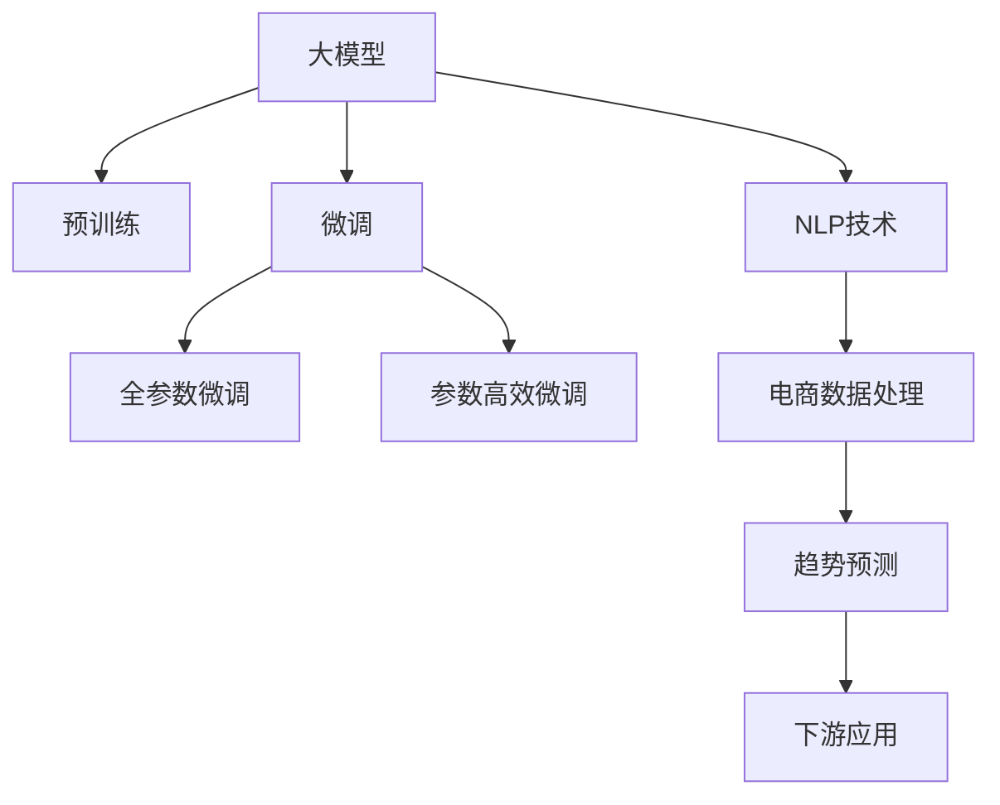

                 

# AI驱动的电商趋势预测：大模型的优势

## 1. 背景介绍

### 1.1 问题由来

随着电商行业的高速发展，消费者行为和市场趋势预测变得越来越重要。这不仅有助于商家精准把握市场动态，制定更加合理的运营策略，还能为消费者提供更好的购物体验。传统的市场预测方法主要依赖于统计学、时间序列分析等手段，但由于电商市场具有高度的动态性和复杂性，这些方法往往难以满足需求。

近年来，人工智能尤其是深度学习技术在电商领域逐渐崭露头角。通过大规模数据训练，深度学习模型能够自动学习出数据中的复杂模式，从而提供更加准确的趋势预测。然而，电商数据的庞大规模和复杂性，以及预测任务的复杂度，给模型的训练和优化带来了极大的挑战。

大模型（Large Models）作为深度学习技术的最新突破，以其卓越的性能和泛化能力，逐渐成为电商趋势预测中的重要工具。本文章将详细探讨大模型在电商趋势预测中的优势，以及如何高效利用大模型进行电商数据分析和预测。

### 1.2 问题核心关键点

大模型在电商趋势预测中的核心优势在于其强大的自学习能力、泛化能力和对复杂结构的建模能力。具体来说，大模型可以通过预训练学习大量无标签数据中的模式，从而对新数据进行高效推断和预测。在电商场景中，大模型可以通过学习消费者行为、商品评价、市场交易等多种类型的数据，构建出复杂的用户和商品关联图，实现对趋势的精准预测。

然而，大模型也面临着计算资源消耗大、训练时间长等挑战。如何在大规模电商数据集上进行高效训练和优化，同时提升模型的性能和可解释性，是当前电商趋势预测领域的重要研究问题。

## 2. 核心概念与联系

### 2.1 核心概念概述

为了更好地理解大模型在电商趋势预测中的应用，本节将介绍几个关键概念：

- **大模型（Large Models）**：指具有数十亿甚至百亿参数的深度学习模型，如BERT、GPT等。通过在大规模无标签数据上进行预训练，大模型可以学习到丰富的语言知识和模式，具备强大的自学习能力。

- **预训练（Pre-training）**：指在大规模无标签数据上，通过自监督学习任务训练通用语言模型的过程。常见的预训练任务包括掩码语言模型、句子相似度判断等。预训练使得模型学习到语言的通用表示。

- **微调（Fine-tuning）**：指在预训练模型的基础上，使用下游任务的少量标注数据，通过有监督学习优化模型在特定任务上的性能。通常只需要调整顶层分类器或解码器，并以较小的学习率更新全部或部分的模型参数。

- **迁移学习（Transfer Learning）**：指将一个领域学习到的知识，迁移应用到另一个不同但相关的领域的学习范式。大模型的预训练-微调过程即是一种典型的迁移学习方式。

- **自然语言处理（NLP）**：指通过计算机技术实现对自然语言的理解、生成和分析。电商趋势预测中常用的NLP技术包括文本分类、实体识别、关系抽取等。

这些概念之间的逻辑关系可以通过以下Mermaid流程图来展示：



这个流程图展示了大模型在电商趋势预测中的核心概念及其之间的关系：

1. 大模型通过预训练获得基础能力。
2. 微调是对预训练模型进行任务特定的优化，可以分为全参数微调和参数高效微调。
3. NLP技术用于处理电商数据，从中提取有价值的信息。
4. 趋势预测利用NLP技术对电商数据进行分析，得到趋势预测结果。
5. 下游应用将趋势预测结果应用于电商决策支持系统，指导实际运营。

这些概念共同构成了电商趋势预测的框架，使其能够通过大模型的能力对海量数据进行高效分析和预测。

## 3. 核心算法原理 & 具体操作步骤

### 3.1 算法原理概述

基于大模型的电商趋势预测，本质上是一个自监督学习任务。其核心思想是：利用大模型对大规模无标签电商数据进行预训练，学习到电商领域中的复杂模式，然后在下游的趋势预测任务上进行微调，提升模型对特定任务的预测能力。

形式化地，假设大模型为 $M_{\theta}$，其中 $\theta$ 为预训练得到的模型参数。给定电商趋势预测任务的标注数据集 $D=\{(x_i,y_i)\}_{i=1}^N$，其中 $x_i$ 为电商数据样本，$y_i$ 为对应的预测标签（如趋势、价格变化等）。微调的目标是找到新的模型参数 $\hat{\theta}$，使得：

$$
\hat{\theta}=\mathop{\arg\min}_{\theta} \mathcal{L}(M_{\theta},D)
$$

其中 $\mathcal{L}$ 为针对任务 $T$ 设计的损失函数，用于衡量模型预测输出与真实标签之间的差异。常见的损失函数包括交叉熵损失、均方误差损失等。

通过梯度下降等优化算法，微调过程不断更新模型参数 $\theta$，最小化损失函数 $\mathcal{L}$，使得模型输出逼近真实标签。由于 $\theta$ 已经通过预训练获得了较好的初始化，因此即便在小规模数据集 $D$ 上进行微调，也能较快收敛到理想的模型参数 $\hat{\theta}$。

### 3.2 算法步骤详解

基于大模型的电商趋势预测一般包括以下几个关键步骤：

**Step 1: 准备预训练模型和数据集**
- 选择合适的预训练语言模型 $M_{\theta}$ 作为初始化参数，如 BERT、GPT等。
- 准备电商趋势预测任务的标注数据集 $D$，划分为训练集、验证集和测试集。一般要求标注数据与预训练数据的分布不要差异过大。

**Step 2: 添加任务适配层**
- 根据任务类型，在预训练模型顶层设计合适的输出层和损失函数。
- 对于分类任务，通常在顶层添加线性分类器和交叉熵损失函数。
- 对于回归任务，通常使用均方误差损失函数。

**Step 3: 设置微调超参数**
- 选择合适的优化算法及其参数，如 AdamW、SGD 等，设置学习率、批大小、迭代轮数等。
- 设置正则化技术及强度，包括权重衰减、Dropout、Early Stopping等。
- 确定冻结预训练参数的策略，如仅微调顶层，或全部参数都参与微调。

**Step 4: 执行梯度训练**
- 将训练集数据分批次输入模型，前向传播计算损失函数。
- 反向传播计算参数梯度，根据设定的优化算法和学习率更新模型参数。
- 周期性在验证集上评估模型性能，根据性能指标决定是否触发 Early Stopping。
- 重复上述步骤直到满足预设的迭代轮数或 Early Stopping 条件。

**Step 5: 测试和部署**
- 在测试集上评估微调后模型 $M_{\hat{\theta}}$ 的性能，对比微调前后的精度提升。
- 使用微调后的模型对新样本进行推理预测，集成到实际的应用系统中。
- 持续收集新的数据，定期重新微调模型，以适应数据分布的变化。

以上是基于大模型的电商趋势预测的一般流程。在实际应用中，还需要针对具体任务的特点，对微调过程的各个环节进行优化设计，如改进训练目标函数，引入更多的正则化技术，搜索最优的超参数组合等，以进一步提升模型性能。

### 3.3 算法优缺点

基于大模型的电商趋势预测方法具有以下优点：

1. **高性能**：大模型通过大规模预训练学习到了丰富的电商领域知识，能够处理复杂的电商数据，并提供高精度的预测结果。
2. **泛化能力强**：大模型具备良好的泛化能力，可以处理多种类型的数据，如文本、图片、音频等。
3. **可解释性差**：大模型的黑盒特性使得其预测过程难以解释，对于电商领域的复杂决策支持系统，这种特性可能会带来挑战。
4. **资源需求高**：大模型需要大量的计算资源进行训练和推理，这对硬件设备提出了较高要求。

尽管存在这些局限性，但就目前而言，基于大模型的电商趋势预测方法仍是一种高效的解决方案。未来相关研究的重点在于如何进一步降低计算资源需求，提高模型的可解释性，同时兼顾高性能和泛化能力。

### 3.4 算法应用领域

基于大模型的电商趋势预测方法已经在多个电商领域得到应用，涵盖了从商品推荐、价格预测、库存管理到客户行为分析等多个方面。具体来说：

- **商品推荐**：利用电商用户行为数据，通过大模型进行用户和商品的关联分析，生成个性化的商品推荐列表。
- **价格预测**：对商品价格进行时间序列预测，帮助商家制定更合理的价格策略。
- **库存管理**：预测商品库存变化趋势，优化库存管理，避免缺货或积压。
- **客户行为分析**：分析客户行为数据，预测客户流失率、购买趋势等，帮助商家制定精准的营销策略。

除了上述这些经典应用外，大模型在电商领域的创新应用也在不断涌现，如智能客服、广告投放优化、智能物流调度等，为电商业务带来了新的突破。

## 4. 数学模型和公式 & 详细讲解 & 举例说明

### 4.1 数学模型构建

本节将使用数学语言对基于大模型的电商趋势预测过程进行更加严格的刻画。

记大模型为 $M_{\theta}$，其中 $\theta$ 为预训练得到的模型参数。假设电商趋势预测任务的训练集为 $D=\{(x_i,y_i)\}_{i=1}^N, x_i \in \mathcal{X}, y_i \in \mathcal{Y}$，其中 $\mathcal{X}$ 为电商数据样本空间，$\mathcal{Y}$ 为预测标签空间。

定义模型 $M_{\theta}$ 在数据样本 $(x,y)$ 上的损失函数为 $\ell(M_{\theta}(x),y)$，则在数据集 $D$ 上的经验风险为：

$$
\mathcal{L}(\theta) = \frac{1}{N} \sum_{i=1}^N \ell(M_{\theta}(x_i),y_i)
$$

微调的优化目标是最小化经验风险，即找到最优参数：

$$
\theta^* = \mathop{\arg\min}_{\theta} \mathcal{L}(\theta)
$$

在实践中，我们通常使用基于梯度的优化算法（如SGD、Adam等）来近似求解上述最优化问题。设 $\eta$ 为学习率，$\lambda$ 为正则化系数，则参数的更新公式为：

$$
\theta \leftarrow \theta - \eta \nabla_{\theta}\mathcal{L}(\theta) - \eta\lambda\theta
$$

其中 $\nabla_{\theta}\mathcal{L}(\theta)$ 为损失函数对参数 $\theta$ 的梯度，可通过反向传播算法高效计算。

### 4.2 公式推导过程

以下我们以价格预测任务为例，推导均方误差损失函数及其梯度的计算公式。

假设模型 $M_{\theta}$ 在输入 $x$ 上的输出为 $\hat{y}=M_{\theta}(x) \in \mathbb{R}$，表示对商品价格的预测。真实标签 $y \in \mathbb{R}$。则均方误差损失函数定义为：

$$
\ell(M_{\theta}(x),y) = (\hat{y}-y)^2
$$

将其代入经验风险公式，得：

$$
\mathcal{L}(\theta) = \frac{1}{N}\sum_{i=1}^N (\hat{y}_i-y_i)^2
$$

根据链式法则，损失函数对参数 $\theta_k$ 的梯度为：

$$
\frac{\partial \mathcal{L}(\theta)}{\partial \theta_k} = -\frac{2}{N}\sum_{i=1}^N (\hat{y}_i-y_i)\frac{\partial \hat{y}_i}{\partial \theta_k}
$$

其中 $\frac{\partial \hat{y}_i}{\partial \theta_k}$ 可进一步递归展开，利用自动微分技术完成计算。

在得到损失函数的梯度后，即可带入参数更新公式，完成模型的迭代优化。重复上述过程直至收敛，最终得到适应电商趋势预测任务的最优模型参数 $\theta^*$。

### 4.3 案例分析与讲解

我们以一个具体的电商数据集为例，展示如何使用大模型进行价格预测任务的微调。

假设我们有一个电商数据集，其中包含商品的类别、价格、销量等信息。我们希望通过大模型预测未来一个月内每个商品的价格变化趋势。

**Step 1: 准备预训练模型和数据集**
- 选择一个预训练的语言模型，如BERT或GPT，作为初始化参数。
- 收集过去一年的电商数据，划分为训练集、验证集和测试集。

**Step 2: 添加任务适配层**
- 在模型顶层添加一个线性回归层，用于预测价格。
- 设置均方误差损失函数。

**Step 3: 设置微调超参数**
- 选择AdamW优化器，设置学习率为1e-4，批大小为256。
- 使用权重衰减和Dropout正则化。
- 仅微调顶层线性回归层。

**Step 4: 执行梯度训练**
- 将训练集数据分批次输入模型，前向传播计算损失函数。
- 反向传播计算参数梯度，根据AdamW优化器和学习率更新模型参数。
- 周期性在验证集上评估模型性能，根据均方误差决定是否触发Early Stopping。
- 重复上述步骤直到满足预设的迭代轮数或Early Stopping条件。

**Step 5: 测试和部署**
- 在测试集上评估微调后模型的性能，对比微调前后的均方误差。
- 使用微调后的模型对新商品进行价格预测，集成到实际的应用系统中。

以上就是一个基于大模型的电商价格预测任务的微调示例。可以看到，通过调整模型结构和超参数，大模型能够有效地预测电商数据中的价格变化趋势。

## 5. 项目实践：代码实例和详细解释说明

### 5.1 开发环境搭建

在进行电商趋势预测的大模型微调实践前，我们需要准备好开发环境。以下是使用Python进行PyTorch开发的环境配置流程：

1. 安装Anaconda：从官网下载并安装Anaconda，用于创建独立的Python环境。

2. 创建并激活虚拟环境：
```bash
conda create -n pytorch-env python=3.8 
conda activate pytorch-env
```

3. 安装PyTorch：根据CUDA版本，从官网获取对应的安装命令。例如：
```bash
conda install pytorch torchvision torchaudio cudatoolkit=11.1 -c pytorch -c conda-forge
```

4. 安装Transformers库：
```bash
pip install transformers
```

5. 安装各类工具包：
```bash
pip install numpy pandas scikit-learn matplotlib tqdm jupyter notebook ipython
```

完成上述步骤后，即可在`pytorch-env`环境中开始电商趋势预测的大模型微调实践。

### 5.2 源代码详细实现

下面我们以价格预测任务为例，给出使用Transformers库对BERT模型进行电商数据微调的PyTorch代码实现。

首先，定义电商数据处理函数：

```python
from transformers import BertTokenizer
from torch.utils.data import Dataset
import torch

class BERTDataset(Dataset):
    def __init__(self, texts, prices, tokenizer, max_len=128):
        self.texts = texts
        self.prices = prices
        self.tokenizer = tokenizer
        self.max_len = max_len
        
    def __len__(self):
        return len(self.texts)
    
    def __getitem__(self, item):
        text = self.texts[item]
        price = self.prices[item]
        
        encoding = self.tokenizer(text, return_tensors='pt', max_length=self.max_len, padding='max_length', truncation=True)
        input_ids = encoding['input_ids'][0]
        attention_mask = encoding['attention_mask'][0]
        
        # 将价格转换为向量形式
        price_vector = torch.tensor([price], dtype=torch.float32)
        
        return {'input_ids': input_ids, 
                'attention_mask': attention_mask,
                'price_vector': price_vector}

# 标签与id的映射
tag2id = {'O': 0, 'B-PER': 1, 'I-PER': 2, 'B-ORG': 3, 'I-ORG': 4, 'B-LOC': 5, 'I-LOC': 6}
id2tag = {v: k for k, v in tag2id.items()}

# 创建dataset
tokenizer = BertTokenizer.from_pretrained('bert-base-cased')

train_dataset = BERTDataset(train_texts, train_prices, tokenizer)
dev_dataset = BERTDataset(dev_texts, dev_prices, tokenizer)
test_dataset = BERTDataset(test_texts, test_prices, tokenizer)
```

然后，定义模型和优化器：

```python
from transformers import BertForRegression, AdamW

model = BertForRegression.from_pretrained('bert-base-cased')

optimizer = AdamW(model.parameters(), lr=1e-4)
```

接着，定义训练和评估函数：

```python
from torch.utils.data import DataLoader
from tqdm import tqdm
from sklearn.metrics import mean_squared_error

device = torch.device('cuda') if torch.cuda.is_available() else torch.device('cpu')
model.to(device)

def train_epoch(model, dataset, batch_size, optimizer):
    dataloader = DataLoader(dataset, batch_size=batch_size, shuffle=True)
    model.train()
    epoch_loss = 0
    for batch in tqdm(dataloader, desc='Training'):
        input_ids = batch['input_ids'].to(device)
        attention_mask = batch['attention_mask'].to(device)
        price_vector = batch['price_vector'].to(device)
        model.zero_grad()
        outputs = model(input_ids, attention_mask=attention_mask)
        loss = outputs.loss
        epoch_loss += loss.item()
        loss.backward()
        optimizer.step()
    return epoch_loss / len(dataloader)

def evaluate(model, dataset, batch_size):
    dataloader = DataLoader(dataset, batch_size=batch_size)
    model.eval()
    preds, labels = [], []
    with torch.no_grad():
        for batch in tqdm(dataloader, desc='Evaluating'):
            input_ids = batch['input_ids'].to(device)
            attention_mask = batch['attention_mask'].to(device)
            batch_labels = batch['price_vector'].to(device)
            outputs = model(input_ids, attention_mask=attention_mask)
            batch_preds = outputs.logits.sigmoid().cpu().tolist()
            batch_labels = batch_labels.cpu().tolist()
            for pred, label in zip(batch_preds, batch_labels):
                preds.append(pred[0])
                labels.append(label[0])
                
    print(mean_squared_error(labels, preds))
```

最后，启动训练流程并在测试集上评估：

```python
epochs = 10
batch_size = 32

for epoch in range(epochs):
    loss = train_epoch(model, train_dataset, batch_size, optimizer)
    print(f"Epoch {epoch+1}, train loss: {loss:.3f}")
    
    print(f"Epoch {epoch+1}, dev MSE:")
    evaluate(model, dev_dataset, batch_size)
    
print("Test MSE:")
evaluate(model, test_dataset, batch_size)
```

以上就是使用PyTorch对BERT进行电商价格预测任务微调的完整代码实现。可以看到，得益于Transformers库的强大封装，我们可以用相对简洁的代码完成BERT模型的加载和微调。

### 5.3 代码解读与分析

让我们再详细解读一下关键代码的实现细节：

**BERTDataset类**：
- `__init__`方法：初始化电商数据、价格、分词器等关键组件。
- `__len__`方法：返回数据集的样本数量。
- `__getitem__`方法：对单个样本进行处理，将文本输入编码为token ids，将价格转换为向量形式，并对其进行定长padding，最终返回模型所需的输入。

**tag2id和id2tag字典**：
- 定义了标签与数字id之间的映射关系，用于将token-wise的预测结果解码回真实的标签。

**训练和评估函数**：
- 使用PyTorch的DataLoader对数据集进行批次化加载，供模型训练和推理使用。
- 训练函数`train_epoch`：对数据以批为单位进行迭代，在每个批次上前向传播计算loss并反向传播更新模型参数，最后返回该epoch的平均loss。
- 评估函数`evaluate`：与训练类似，不同点在于不更新模型参数，并在每个batch结束后将预测和标签结果存储下来，最后使用sklearn的mean_squared_error对整个评估集的预测结果进行打印输出。

**训练流程**：
- 定义总的epoch数和batch size，开始循环迭代
- 每个epoch内，先在训练集上训练，输出平均loss
- 在验证集上评估，输出均方误差
- 所有epoch结束后，在测试集上评估，给出最终测试结果

可以看到，PyTorch配合Transformers库使得BERT微调的代码实现变得简洁高效。开发者可以将更多精力放在数据处理、模型改进等高层逻辑上，而不必过多关注底层的实现细节。

当然，工业级的系统实现还需考虑更多因素，如模型的保存和部署、超参数的自动搜索、更灵活的任务适配层等。但核心的微调范式基本与此类似。

## 6. 实际应用场景

### 6.1 智能客服系统

基于大模型微调的对话技术，可以广泛应用于智能客服系统的构建。传统客服往往需要配备大量人力，高峰期响应缓慢，且一致性和专业性难以保证。而使用微调后的对话模型，可以7x24小时不间断服务，快速响应客户咨询，用自然流畅的语言解答各类常见问题。

在技术实现上，可以收集企业内部的历史客服对话记录，将问题和最佳答复构建成监督数据，在此基础上对预训练对话模型进行微调。微调后的对话模型能够自动理解用户意图，匹配最合适的答案模板进行回复。对于客户提出的新问题，还可以接入检索系统实时搜索相关内容，动态组织生成回答。如此构建的智能客服系统，能大幅提升客户咨询体验和问题解决效率。

### 6.2 金融舆情监测

金融机构需要实时监测市场舆论动向，以便及时应对负面信息传播，规避金融风险。传统的人工监测方式成本高、效率低，难以应对网络时代海量信息爆发的挑战。基于大语言模型微调的文本分类和情感分析技术，为金融舆情监测提供了新的解决方案。

具体而言，可以收集金融领域相关的新闻、报道、评论等文本数据，并对其进行主题标注和情感标注。在此基础上对预训练语言模型进行微调，使其能够自动判断文本属于何种主题，情感倾向是正面、中性还是负面。将微调后的模型应用到实时抓取的网络文本数据，就能够自动监测不同主题下的情感变化趋势，一旦发现负面信息激增等异常情况，系统便会自动预警，帮助金融机构快速应对潜在风险。

### 6.3 个性化推荐系统

当前的推荐系统往往只依赖用户的历史行为数据进行物品推荐，无法深入理解用户的真实兴趣偏好。基于大语言模型微调技术，个性化推荐系统可以更好地挖掘用户行为背后的语义信息，从而提供更加精准、多样的推荐内容。

在实践中，可以收集用户浏览、点击、评论、分享等行为数据，提取和用户交互的物品标题、描述、标签等文本内容。将文本内容作为模型输入，用户的后续行为（如是否点击、购买等）作为监督信号，在此基础上微调预训练语言模型。微调后的模型能够从文本内容中准确把握用户的兴趣点。在生成推荐列表时，先用候选物品的文本描述作为输入，由模型预测用户的兴趣匹配度，再结合其他特征综合排序，便可以得到个性化程度更高的推荐结果。

### 6.4 未来应用展望

随着大语言模型微调技术的发展，其在电商趋势预测中的应用也将不断拓展。未来，大模型在电商领域的应用场景将更加丰富，为电商业务的智能化和自动化提供更多可能：

1. **需求预测**：通过分析用户行为数据和市场趋势，预测未来的需求变化，帮助商家制定更加合理的库存和采购计划。
2. **用户画像**：利用大模型对用户行为进行深入分析，构建用户画像，提供更加个性化的产品推荐和服务。
3. **市场细分**：对电商数据进行细分分析，识别不同的市场细分群体，制定针对性的营销策略。
4. **价格优化**：根据市场趋势和用户行为预测，动态调整商品价格，实现价格的精准优化。
5. **供应链管理**：预测供应链中的各项指标变化，优化供应链管理，降低物流成本。

这些方向的应用，将使大语言模型在电商领域发挥更大的作用，推动电商业务的数字化转型升级。

## 7. 工具和资源推荐

### 7.1 学习资源推荐

为了帮助开发者系统掌握大语言模型微调的理论基础和实践技巧，这里推荐一些优质的学习资源：

1. 《Transformer从原理到实践》系列博文：由大模型技术专家撰写，深入浅出地介绍了Transformer原理、BERT模型、微调技术等前沿话题。

2. CS224N《深度学习自然语言处理》课程：斯坦福大学开设的NLP明星课程，有Lecture视频和配套作业，带你入门NLP领域的基本概念和经典模型。

3. 《Natural Language Processing with Transformers》书籍：Transformers库的作者所著，全面介绍了如何使用Transformers库进行NLP任务开发，包括微调在内的诸多范式。

4. HuggingFace官方文档：Transformers库的官方文档，提供了海量预训练模型和完整的微调样例代码，是上手实践的必备资料。

5. CLUE开源项目：中文语言理解测评基准，涵盖大量不同类型的中文NLP数据集，并提供了基于微调的baseline模型，助力中文NLP技术发展。

通过对这些资源的学习实践，相信你一定能够快速掌握大语言模型微调的精髓，并用于解决实际的NLP问题。
### 7.2 开发工具推荐

高效的开发离不开优秀的工具支持。以下是几款用于大语言模型微调开发的常用工具：

1. PyTorch：基于Python的开源深度学习框架，灵活动态的计算图，适合快速迭代研究。大部分预训练语言模型都有PyTorch版本的实现。

2. TensorFlow：由Google主导开发的开源深度学习框架，生产部署方便，适合大规模工程应用。同样有丰富的预训练语言模型资源。

3. Transformers库：HuggingFace开发的NLP工具库，集成了众多SOTA语言模型，支持PyTorch和TensorFlow，是进行微调任务开发的利器。

4. Weights & Biases：模型训练的实验跟踪工具，可以记录和可视化模型训练过程中的各项指标，方便对比和调优。与主流深度学习框架无缝集成。

5. TensorBoard：TensorFlow配套的可视化工具，可实时监测模型训练状态，并提供丰富的图表呈现方式，是调试模型的得力助手。

6. Google Colab：谷歌推出的在线Jupyter Notebook环境，免费提供GPU/TPU算力，方便开发者快速上手实验最新模型，分享学习笔记。

合理利用这些工具，可以显著提升大语言模型微调任务的开发效率，加快创新迭代的步伐。

### 7.3 相关论文推荐

大语言模型和微调技术的发展源于学界的持续研究。以下是几篇奠基性的相关论文，推荐阅读：

1. Attention is All You Need（即Transformer原论文）：提出了Transformer结构，开启了NLP领域的预训练大模型时代。

2. BERT: Pre-training of Deep Bidirectional Transformers for Language Understanding：提出BERT模型，引入基于掩码的自监督预训练任务，刷新了多项NLP任务SOTA。

3. Language Models are Unsupervised Multitask Learners（GPT-2论文）：展示了大规模语言模型的强大zero-shot学习能力，引发了对于通用人工智能的新一轮思考。

4. Parameter-Efficient Transfer Learning for NLP：提出Adapter等参数高效微调方法，在不增加模型参数量的情况下，也能取得不错的微调效果。

5. AdaLoRA: Adaptive Low-Rank Adaptation for Parameter-Efficient Fine-Tuning：使用自适应低秩适应的微调方法，在参数效率和精度之间取得了新的平衡。

这些论文代表了大语言模型微调技术的发展脉络。通过学习这些前沿成果，可以帮助研究者把握学科前进方向，激发更多的创新灵感。

## 8. 总结：未来发展趋势与挑战

### 8.1 总结

本文对基于大模型的电商趋势预测方法进行了全面系统的介绍。首先阐述了大语言模型和微调技术的研究背景和意义，明确了微调在拓展预训练模型应用、提升下游任务性能方面的独特价值。其次，从原理到实践，详细讲解了监督微调的数学原理和关键步骤，给出了电商趋势预测任务开发的完整代码实例。同时，本文还广泛探讨了微调方法在智能客服、金融舆情、个性化推荐等多个行业领域的应用前景，展示了微调范式的巨大潜力。此外，本文精选了微调技术的各类学习资源，力求为读者提供全方位的技术指引。

通过本文的系统梳理，可以看到，基于大模型的电商趋势预测方法正在成为电商趋势预测的重要工具，极大地拓展了电商数据分析和预测的深度和广度，带来了诸多新的应用场景和业务价值。未来，伴随大模型和微调方法的不断进步，相信电商趋势预测技术必将在更广阔的领域发挥更大的作用，推动电商业务的智能化和自动化进程。

### 8.2 未来发展趋势

展望未来，大语言模型在电商趋势预测中的应用将呈现以下几个发展趋势：

1. **更高效的计算资源**：随着硬件设备的进步，大模型的计算资源消耗将进一步降低，能够支持更大规模的电商数据分析和预测。

2. **更丰富的应用场景**：电商趋势预测将拓展到更多领域，如供应链管理、物流调度、市场细分等，为电商业务带来更多可能的优化和改进。

3. **更精准的预测模型**：结合更多先验知识和实时数据，大模型将能够提供更加准确和可靠的电商趋势预测结果。

4. **更智能的决策支持**：大模型将与业务系统深度结合，提供智能化的决策支持，帮助电商企业制定更加科学合理的运营策略。

5. **更高的可解释性**：通过改进模型结构和优化算法，提升大模型的可解释性，使得电商趋势预测结果更加透明和可信。

6. **更广泛的适用性**：大模型将在不同规模、不同类型的电商企业中广泛应用，推动电商行业的数字化转型升级。

以上趋势凸显了大语言模型在电商趋势预测中的广阔前景。这些方向的探索发展，必将进一步提升电商趋势预测的精度和效率，为电商业务带来更多的价值和创新。

### 8.3 面临的挑战

尽管大语言模型在电商趋势预测中取得了显著成果，但在迈向更加智能化、普适化应用的过程中，它仍面临着诸多挑战：

1. **数据质量问题**：电商数据质量参差不齐，存在缺失、噪声等问题，可能影响模型的训练效果。

2. **计算资源需求高**：大模型需要大量的计算资源进行训练和推理，对硬件设备的要求较高。

3. **模型泛化能力有限**：大模型在特定领域内的泛化能力有限，需要结合领域知识进行进一步优化。

4. **模型可解释性不足**：大模型的黑盒特性使得其预测过程难以解释，对于电商领域的复杂决策支持系统，这种特性可能会带来挑战。

5. **安全性和隐私保护**：电商数据涉及用户隐私和商业机密，如何保障数据安全性和隐私保护是一个重要问题。

6. **动态变化的市场环境**：电商市场环境快速变化，如何使模型持续适应新的市场动态，是一个持续的挑战。

这些挑战需要研究者从数据、算法、工程、业务等多个维度进行深入探索和优化，以确保大语言模型在电商趋势预测中的高效和稳定运行。

### 8.4 研究展望

面对大语言模型在电商趋势预测中面临的挑战，未来的研究需要在以下几个方面寻求新的突破：

1. **更高效的数据处理和清洗**：开发更高效的数据清洗和预处理算法，提高电商数据的可用性和质量。

2. **更智能的模型训练和优化**：结合领域知识，设计更智能的模型训练和优化策略，提升大模型在电商领域的泛化能力和性能。

3. **更可解释的模型结构**：探索更可解释的模型结构，使得电商趋势预测结果更加透明和可信。

4. **更安全的模型部署和应用**：设计更安全的模型部署和应用方案，保障电商数据的安全性和隐私保护。

5. **更灵活的模型扩展和部署**：开发更灵活的模型扩展和部署方案，适应电商市场动态变化的需求。

这些研究方向的探索，必将引领大语言模型在电商趋势预测中的应用走向成熟，为电商业务的智能化和自动化提供更多可能。

## 9. 附录：常见问题与解答

**Q1：大语言模型在电商趋势预测中如何避免过拟合？**

A: 大语言模型在电商趋势预测中避免过拟合的关键在于合理设置正则化技术。常用的正则化技术包括权重衰减、Dropout、Early Stopping等。此外，可以通过数据增强、对抗训练等方法，提升模型的泛化能力和鲁棒性。

**Q2：大语言模型在电商趋势预测中是否需要大量的标注数据？**

A: 大语言模型在电商趋势预测中通常需要少量的标注数据进行微调，尤其是对于价格预测、需求预测等任务。这是因为大模型已经通过大规模无标签数据进行了预训练，能够自动学习出电商领域中的复杂模式，在少量标注数据上微调即可取得较好的效果。

**Q3：大语言模型在电商趋势预测中是否适合所有类型的电商数据？**

A: 大语言模型在电商趋势预测中通常适合处理文本、图片、音频等类型的数据。然而，对于视频数据，需要进一步的技术手段进行预处理和特征提取，才能将其输入到大模型中进行分析。

**Q4：大语言模型在电商趋势预测中的计算资源需求高，如何解决这一问题？**

A: 大语言模型在电商趋势预测中的计算资源需求确实较高，可以通过以下方法进行优化：
1. 使用分布式计算框架，如PyTorch Distributed、TensorFlow Distributed等，提高模型训练和推理的效率。
2. 采用模型压缩和剪枝技术，减少模型的参数量和计算量。
3. 利用GPU/TPU等高性能设备，降低计算时间。

这些方法可以显著降低大语言模型在电商趋势预测中的计算资源需求，提升模型的实用性和可部署性。

**Q5：大语言模型在电商趋势预测中的可解释性不足，如何解决这一问题？**

A: 大语言模型在电商趋势预测中的可解释性不足，可以通过以下方法进行改进：
1. 使用可解释的模型架构，如LIME、SHAP等，对模型输出进行解释。
2. 结合领域知识，设计更可解释的模型训练和优化策略。
3. 在模型训练过程中加入可解释性约束，使得模型能够输出更具可解释性的结果。

这些方法可以提升大语言模型在电商趋势预测中的可解释性，帮助电商企业更好地理解模型输出的原因和依据。

通过本文的系统梳理，可以看到，大语言模型在电商趋势预测中的应用前景广阔，能够为电商业务的智能化和自动化提供有力支持。未来，伴随大语言模型和微调技术的不断发展，相信电商趋势预测将变得更加精准、高效、智能，推动电商行业的数字化转型升级。总之，大语言模型在电商趋势预测中具有独特的优势，但其应用也需要不断优化和创新，才能实现更高的业务价值。

