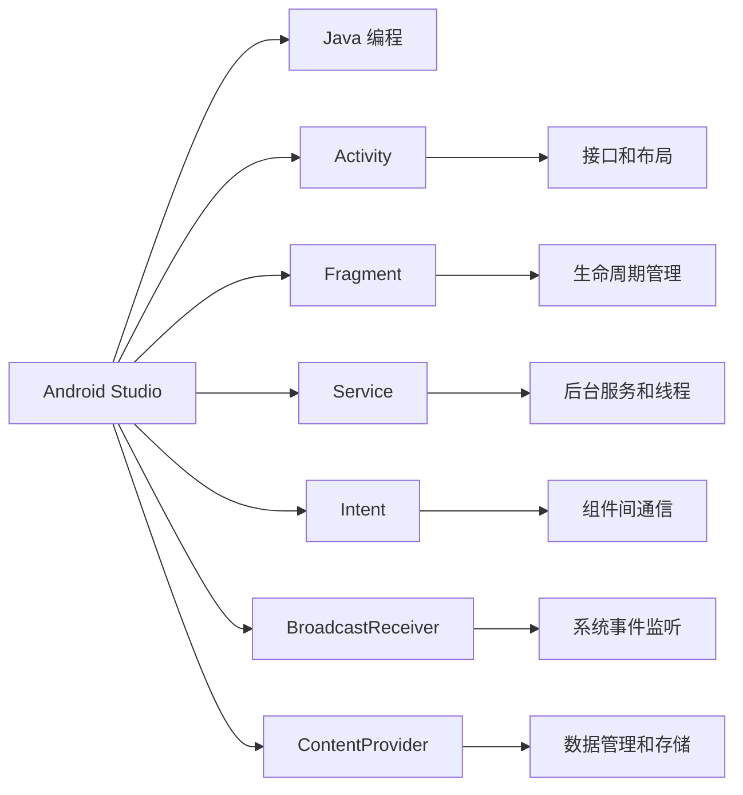

                 

# Android 开发入门：Java 和 Android Studio

> 关键词：Android, Java, Android Studio, 开发环境搭建, 源码实现, 开发工具推荐

## 1. 背景介绍

Android 操作系统（简称 Android）由 Google 于 2007 年发布，是世界上最流行的智能手机操作系统之一。Android 应用程序（简称 Android 应用）以其性能优越、用户界面友好、可定制性强等优点，吸引了大量开发者。Android 应用开发主要使用 Java 语言，结合 Android Studio 集成开发环境（IDE），能快速开发出高质量的移动应用。

Android 应用开发流程包括需求分析、界面设计、编码实现、测试发布等几个阶段。本文将从基础知识介绍、开发环境搭建、源码实现细节等方面，带你进入 Android 应用开发的世界。

## 2. 核心概念与联系

### 2.1 核心概念概述

为了更好地理解 Android 应用开发，首先介绍一些核心概念：

- **Android Studio**：Google 推出的官方 IDE，支持 Android 应用的全生命周期开发，提供图形化界面设计、代码编辑、测试调试等功能。
- **Java**：Android 应用开发的主要编程语言，一种强类型、面向对象的编程语言，广泛应用于 Android 应用的开发。
- **Activity**：Android 应用的基本单元，表示用户可见的单个界面。
- **Fragment**：Activity 的子组件，用于管理部分界面逻辑和布局。
- **Service**：Android 应用在后台运行的服务，用于处理非可视化任务。
- **Intent**：Android 应用的跨组件通信机制，用于组件间传递数据和控制。
- **BroadcastReceiver**：用于接收系统或自定义的广播消息，监听系统事件和用户操作。
- **ContentProvider**：用于存储和管理数据，供其他应用访问和操作。

这些概念相互关联，共同构成 Android 应用开发的基础框架。

### 2.2 核心概念原理和架构的 Mermaid 流程图



这个流程图展示了 Android Studio 与 Java 编程的关系，以及 Android 应用开发中常用的组件和技术。

## 3. 核心算法原理 & 具体操作步骤

### 3.1 算法原理概述

Android 应用开发的基础是 Java 语言，其开发流程包括：需求分析、界面设计、编码实现、测试发布等步骤。这一过程的核心算法原理包括面向对象编程（OOP）、面向切面编程（AOP）、设计模式等。

Android Studio 提供了可视化的界面设计工具，使开发者可以快速绘制界面布局，减少编码量。同时，Android Studio 集成了 Android SDK 和 NDK，支持编译和调试，提供丰富的开发工具和插件。

### 3.2 算法步骤详解

Android 应用开发的步骤如下：

1. **需求分析**：与业务方沟通，了解应用功能需求和用户需求。
2. **界面设计**：使用 Android Studio 界面设计工具，绘制应用界面的布局和组件。
3. **编码实现**：根据界面设计编写 Java 代码，实现界面逻辑和功能。
4. **测试发布**：使用 Android Studio 进行单元测试、集成测试、性能测试，发布应用到 Google Play 等平台。

### 3.3 算法优缺点

Android 应用开发的优势包括：

- **跨平台兼容性**：Android 应用可在不同品牌、不同型号的手机上运行，兼容性好。
- **丰富的第三方库和组件**：Android Studio 提供大量开源库和组件，简化开发过程。
- **强大的开发工具**：Android Studio 提供了丰富的工具，如调试、重构、性能分析等，提高开发效率。

然而，Android 应用开发也存在一些缺点：

- **性能问题**：Android 应用频繁切换任务和线程，可能导致性能问题。
- **安全性问题**：Android 应用访问权限较大，可能存在安全漏洞。
- **版本管理复杂**：应用版本管理复杂，可能导致不同版本兼容性问题。

### 3.4 算法应用领域

Android 应用开发广泛应用于以下领域：

- **移动娱乐**：游戏、视频、音乐等娱乐应用。
- **社交网络**：微信、微博、QQ 等社交应用。
- **电子商务**：购物、支付、物流等电商应用。
- **教育培训**：学习、考试、培训等教育应用。
- **生活服务**：天气、交通、地图、餐饮等生活服务应用。

## 4. 数学模型和公式 & 详细讲解 & 举例说明

### 4.1 数学模型构建

Android 应用开发涉及的数学模型主要包括：

- **线性代数**：用于矩阵计算和图形变换。
- **概率论和统计学**：用于数据处理和算法优化。
- **优化算法**：用于解决最小化问题，如线性规划、非线性优化等。

### 4.2 公式推导过程

以线性代数为例，Android 应用中常用的矩阵计算公式包括：

$$
\mathbf{A} \mathbf{B} = \left( \begin{array}{ccc}
a_{11} & a_{12} & a_{13} \\
a_{21} & a_{22} & a_{23} \\
a_{31} & a_{32} & a_{33}
\end{array} \right)
\left( \begin{array}{ccc}
b_{11} & b_{12} & b_{13} \\
b_{21} & b_{22} & b_{23} \\
b_{31} & b_{32} & b_{33}
\end{array} \right) = \left( \begin{array}{ccc}
c_{11} & c_{12} & c_{13} \\
c_{21} & c_{22} & c_{23} \\
c_{31} & c_{32} & c_{33}
\end{array} \right)
$$

其中，$\mathbf{A}$ 和 $\mathbf{B}$ 是两个矩阵，$\mathbf{C}$ 是它们的乘积矩阵。

### 4.3 案例分析与讲解

以图形变换为例，Android 应用中常用的变换公式包括：

$$
\mathbf{M} = \left( \begin{array}{ccc}
\cos \theta & -\sin \theta & x \\
\sin \theta & \cos \theta & y \\
0 & 0 & 1
\end{array} \right)
$$

其中，$\mathbf{M}$ 是变换矩阵，$\theta$ 是旋转角度，$(x, y)$ 是原点坐标。

该变换矩阵用于将图形绕原点旋转 $\theta$ 角度，然后平移 $(x, y)$，实现图形的平移和旋转。

## 5. 项目实践：代码实例和详细解释说明

### 5.1 开发环境搭建

为了搭建 Android 开发环境，首先需要安装 Android Studio。在 Android Studio 中，设置 SDK 路径、配置项目依赖、创建项目等步骤。

具体步骤如下：

1. 下载并安装 Android Studio。
2. 创建新项目，设置项目名称、路径和 SDK 路径。
3. 在项目中创建布局文件（XML）和 Java 代码文件。
4. 使用 Android Studio 运行和调试应用。

### 5.2 源代码详细实现

以下是一个简单的 Hello World 示例：

```java
package com.example.helloworld;

import androidx.appcompat.app.AppCompatActivity;
import android.os.Bundle;
import android.widget.TextView;
import android.widget.Toast;

public class MainActivity extends AppCompatActivity {
    @Override
    protected void onCreate(Bundle savedInstanceState) {
        super.onCreate(savedInstanceState);
        setContentView(R.layout.activity_main);
        
        // 获取布局文件中的 TextView 组件
        TextView textView = findViewById(R.id.textView);
        
        // 在 TextView 中显示 Hello World
        textView.setText("Hello World");
        
        // 弹出Toast消息
        Toast.makeText(this, "Hello World", Toast.LENGTH_SHORT).show();
    }
}
```

该示例通过在 XML 布局文件中定义一个 TextView 组件，然后在 Java 代码中获取并设置该组件的文本，最后弹出 Toast 消息。

### 5.3 代码解读与分析

在代码中，我们通过继承 AppCompatActivity 类，创建了一个简单的活动（Activity）。在 onCreate 方法中，通过 setContentView 方法加载布局文件，获取 TextView 组件，并设置其文本。最后使用 Toast 类显示消息。

该示例展示了 Android 应用开发的基本流程，包括界面设计、代码编写、布局设置等。

### 5.4 运行结果展示

运行该示例，可在模拟器或真机上看到如下界面：


## 6. 实际应用场景

Android 应用开发广泛应用于以下领域：

- **移动娱乐**：游戏、视频、音乐等娱乐应用。
- **社交网络**：微信、微博、QQ 等社交应用。
- **电子商务**：购物、支付、物流等电商应用。
- **教育培训**：学习、考试、培训等教育应用。
- **生活服务**：天气、交通、地图、餐饮等生活服务应用。

## 7. 工具和资源推荐

### 7.1 学习资源推荐

为了更好地掌握 Android 应用开发，推荐以下学习资源：

1. Android 开发者文档：Android 官方提供的详细文档，包含 API 参考、开发指南、最佳实践等。
2. 《Android 应用开发实战》书籍：详细讲解 Android 应用开发流程，提供丰富的代码示例。
3. Udacity Android 开发课程：提供系统的 Android 应用开发教程，涵盖从基础到高级的知识点。
4. Google Developers 开发者博客：分享 Android 开发实战经验，提供丰富的开发技巧和代码示例。
5. Stack Overflow：开发者社区，提供大量的问答和代码示例。

### 7.2 开发工具推荐

Android Studio 是 Android 开发必备的工具，推荐以下工具：

1. Android Studio：Android 官方提供的 IDE，支持 Android 应用的开发、测试和调试。
2. IntelliJ IDEA：Java 编程 IDE，支持 Android Studio 插件，提供丰富的开发工具。
3. Gradle：构建工具，用于管理 Android 应用的依赖和构建。
4. ProGuard：代码混淆工具，提高应用的安全性和性能。
5. Firebase：Google 提供的云端服务，支持数据分析、消息推送、身份验证等功能。

### 7.3 相关论文推荐

Android 应用开发涉及大量前沿技术，推荐以下论文：

1. "Android Studio: A next-generation integrated development environment for mobile development"：介绍 Android Studio 的开发环境。
2. "A Survey of Android App Security"：综述 Android 应用安全技术。
3. "Android Application Performance Optimization"：介绍 Android 应用性能优化技术。
4. "Mobile Application Security: A Survey of Recent Trends"：综述移动应用安全技术。
5. "Designing Android Applications with Java"：介绍 Android 应用设计技术和 Java 编程技巧。

## 8. 总结：未来发展趋势与挑战

### 8.1 研究成果总结

Android 应用开发已经成为移动应用开发的主流范式，其优势和缺点已经得到广泛验证。未来，Android 应用开发将朝以下方向发展：

- **跨平台开发**：Android 应用将与 iOS 应用更紧密融合，支持跨平台开发工具和技术。
- **深度学习应用**：Android 应用将更多应用深度学习技术，提升应用智能化和个性化。
- **5G 和物联网**：Android 应用将更多利用 5G 网络和物联网技术，实现更高效、更智能的应用场景。
- **边缘计算**：Android 应用将更多利用边缘计算技术，实现更快速、更安全的本地计算。
- **安全性**：Android 应用将更加注重安全性，保护用户隐私和数据安全。

### 8.2 未来发展趋势

未来 Android 应用开发将呈现以下趋势：

- **跨平台开发**：Android 应用将与 iOS 应用更紧密融合，支持跨平台开发工具和技术。
- **深度学习应用**：Android 应用将更多应用深度学习技术，提升应用智能化和个性化。
- **5G 和物联网**：Android 应用将更多利用 5G 网络和物联网技术，实现更高效、更智能的应用场景。
- **边缘计算**：Android 应用将更多利用边缘计算技术，实现更快速、更安全的本地计算。
- **安全性**：Android 应用将更加注重安全性，保护用户隐私和数据安全。

### 8.3 面临的挑战

尽管 Android 应用开发取得了巨大进展，但在发展过程中仍然面临以下挑战：

- **性能问题**：Android 应用频繁切换任务和线程，可能导致性能问题。
- **安全性问题**：Android 应用访问权限较大，可能存在安全漏洞。
- **版本管理复杂**：应用版本管理复杂，可能导致不同版本兼容性问题。
- **用户体验**：Android 应用在用户体验和界面设计上还有提升空间。

### 8.4 研究展望

未来 Android 应用开发需要在以下方面进行深入研究：

- **性能优化**：提升 Android 应用的性能和响应速度。
- **安全性增强**：提高 Android 应用的安全性和隐私保护能力。
- **跨平台融合**：实现 Android 应用与 iOS 应用的跨平台开发和互通。
- **深度学习应用**：结合深度学习技术，提升 Android 应用的智能化和个性化。
- **边缘计算**：利用边缘计算技术，提升 Android 应用的数据处理能力和本地计算能力。

## 9. 附录：常见问题与解答

### 问题 1：Android Studio 如何安装？

答：Android Studio 可以从官网下载并解压缩，按照提示进行安装即可。

### 问题 2：Android Studio 如何使用？

答：打开 Android Studio，创建新项目或打开现有项目，设置 SDK 路径和项目依赖，编写代码并运行调试。

### 问题 3：Android 应用如何优化性能？

答：优化 Android 应用的性能，需要关注以下几点：

- **减少内存占用**：优化图片和资源加载，使用缓存机制。
- **提升响应速度**：减少 UI 线程和后台线程的切换，使用异步任务和线程池。
- **提高渲染性能**：优化布局和 UI 组件，减少重绘和渲染延迟。

### 问题 4：Android 应用如何提升安全性？

答：提升 Android 应用的安全性，需要关注以下几点：

- **权限管理**：合理设置应用权限，减少不必要的权限请求。
- **代码混淆**：使用 ProGuard 工具进行代码混淆和压缩。
- **安全测试**：使用静态和动态安全测试工具，检测潜在的安全漏洞。

### 问题 5：Android 应用如何实现跨平台开发？

答：实现 Android 应用跨平台开发，可以采用以下技术：

- **React Native**：使用 JavaScript 开发跨平台应用，支持 Android 和 iOS。
- **Flutter**：使用 Dart 语言开发跨平台应用，支持 Android、iOS、Web 等平台。
- **PReact**：使用 React 和原生 UI 组件混合开发跨平台应用，提升性能和用户体验。

---

作者：禅与计算机程序设计艺术 / Zen and the Art of Computer Programming

