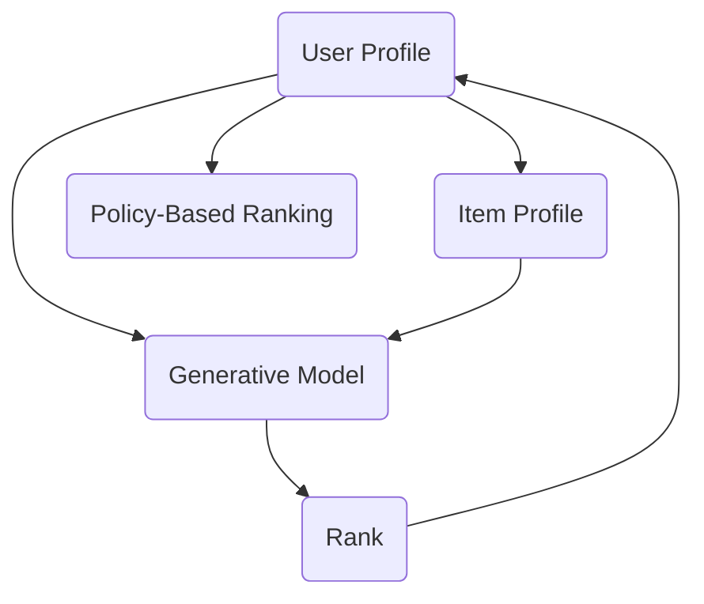

                 

# ChatGPT在推荐系统的表现：排名与冷启动

## 1. 背景介绍

推荐系统（Recommender System）是利用用户行为数据，为用户推荐个性化物品的系统。随着电子商务、新闻媒体、音乐视频、社交网络等数字化平台的兴起，推荐系统已经成为互联网企业重要的用户互动工具。推荐系统的优劣，直接影响用户体验和平台留存率。

ChatGPT作为OpenAI最新的语言模型，因其强大的生成能力和深度理解能力，被广泛应用于各种自然语言处理任务中。在推荐系统中，ChatGPT能够生成高质量的推荐文本，提升了推荐效果。本文将重点探讨ChatGPT在推荐系统中的表现，包括其排名算法和冷启动问题。

## 2. 核心概念与联系

### 2.1 核心概念概述

推荐系统通常由三部分组成：用户画像（User Profile）、物品画像（Item Profile）和评分预测模型（Rating Prediction Model）。评分预测模型根据用户画像和物品画像，预测用户对物品的评分或点击概率，进而为用户推荐物品。

ChatGPT在推荐系统中的表现主要体现在两个方面：

- 生成推荐文本：ChatGPT能够根据用户画像和物品画像生成个性化推荐文本，提升推荐系统的可读性和可操作性。
- 参与评分预测：ChatGPT可以直接作为评分预测模型，对用户和物品的评分进行预测，进而提升推荐系统的准确性和多样性。

### 2.2 核心概念原理和架构的 Mermaid 流程图(Mermaid 流程节点中不要有括号、逗号等特殊字符)



上述流程图中，U表示用户画像，I表示物品画像，P表示策略性排序算法，G表示生成模型，R表示评分排序结果。其中，生成模型G可以采用ChatGPT等自然语言生成模型，策略性排序算法P可以采用基于规则、基于协同过滤、基于矩阵分解等方法。

## 3. 核心算法原理 & 具体操作步骤

### 3.1 算法原理概述

ChatGPT在推荐系统中的表现，主要基于其强大的语言理解和生成能力。生成推荐文本的过程中，ChatGPT能够从大量文本中学习到语言的语义和语法结构，生成具有自然流畅和上下文相关的推荐文本。参与评分预测时，ChatGPT能够通过自然语言理解和语义表示，理解用户和物品的特点，生成基于自然语言理解的评分预测结果。

### 3.2 算法步骤详解

#### 3.2.1 生成推荐文本

1. **输入准备**：输入用户画像U和物品画像I。用户画像可以包括用户的基本信息、历史行为、兴趣偏好等；物品画像可以包括物品的描述、属性、标签等。

2. **自然语言理解**：使用ChatGPT对用户画像U和物品画像I进行自然语言理解，提取关键信息。

3. **生成推荐文本**：基于用户画像U和物品画像I生成的关键信息，使用ChatGPT生成推荐文本。推荐文本可以用于产品详情页、商品推荐信息等，提升用户体验。

#### 3.2.2 参与评分预测

1. **输入准备**：输入用户画像U和物品画像I。用户画像和物品画像的内容与生成推荐文本时类似。

2. **自然语言理解**：使用ChatGPT对用户画像U和物品画像I进行自然语言理解，生成用户和物品的语义表示。

3. **评分预测**：基于用户和物品的语义表示，使用ChatGPT进行评分预测。评分预测的结果可以用于推荐系统的排序算法中。

### 3.3 算法优缺点

#### 3.3.1 优点

1. **自然语言理解**：ChatGPT能够理解自然语言，生成流畅的推荐文本和评分预测结果。
2. **多模态融合**：ChatGPT可以融合文本、图像、音频等多模态数据，提升推荐系统的多样性和丰富性。
3. **自适应性强**：ChatGPT能够根据用户和物品画像，生成个性化的推荐和评分预测结果。

#### 3.3.2 缺点

1. **资源消耗高**：ChatGPT的模型规模庞大，计算资源消耗高，训练和推理成本较高。
2. **准确性受限**：ChatGPT生成的推荐文本和评分预测结果，可能与真实用户行为和物品特征存在偏差。
3. **冷启动问题**：新用户和新物品在系统中没有历史行为数据，导致推荐效果不佳。

### 3.4 算法应用领域

ChatGPT在推荐系统中的应用领域非常广泛，主要包括以下几个方面：

1. **电商推荐**：为电商用户推荐商品，提升用户体验和购买转化率。
2. **音乐推荐**：为音乐用户推荐歌曲，提升用户满意度和平台活跃度。
3. **视频推荐**：为视频用户推荐视频内容，提升平台用户黏性和留存率。
4. **新闻推荐**：为用户推荐新闻文章，提升用户阅读量和平台流量。
5. **社交推荐**：为社交网络用户推荐朋友和内容，提升用户互动和平台活跃度。

## 4. 数学模型和公式 & 详细讲解 & 举例说明

### 4.1 数学模型构建

推荐系统的评分预测模型通常基于用户画像U和物品画像I，采用以下数学模型进行构建：

$$
\hat{y} = f(U, I)
$$

其中，$\hat{y}$表示用户对物品的评分或点击概率，$f$表示评分预测函数。常见的评分预测函数包括线性模型、逻辑回归模型、神经网络模型等。

### 4.2 公式推导过程

以线性模型为例，假设用户画像U和物品画像I的特征表示为$\mathbf{u}$和$\mathbf{i}$，评分预测函数为：

$$
\hat{y} = \mathbf{w}^T[\mathbf{u}, \mathbf{i}] + b
$$

其中，$\mathbf{w}$表示评分预测模型的权重，$[\mathbf{u}, \mathbf{i}]$表示用户画像和物品画像的特征拼接，$b$表示截距。通过优化模型权重$\mathbf{w}$，使得评分预测结果$\hat{y}$与真实评分$y$之间的误差最小化。

### 4.3 案例分析与讲解

假设某电商平台的评分预测模型基于用户画像和物品画像进行训练，采用线性模型进行评分预测。用户画像U包括用户的基本信息、历史行为等，物品画像I包括商品的品牌、价格、描述等。

1. **输入准备**：输入用户画像U和物品画像I，将其转换为数值特征。
2. **自然语言理解**：使用ChatGPT对用户画像U和物品画像I进行自然语言理解，提取关键信息。
3. **评分预测**：基于用户画像U和物品画像I生成的关键信息，使用线性模型进行评分预测。

例如，假设用户画像U为“王先生，年龄30岁，购买过多个品牌的衣服”，物品画像I为“某品牌衣服，价格500元，描述为“高档时尚，质地优良””。使用线性模型进行评分预测，得到评分$\hat{y} = 0.8$，表示王先生对该品牌衣服的评分较高，推荐该品牌衣服。

## 5. 项目实践：代码实例和详细解释说明

### 5.1 开发环境搭建

开发环境搭建主要包括安装Python、安装推荐系统相关库、搭建测试环境等步骤。以下是搭建开发环境的详细步骤：

1. **安装Python**：选择Python 3.x版本，安装到系统路径下。
2. **安装推荐系统库**：安装Pandas、NumPy、Scikit-learn、TensorFlow等推荐系统相关库。
3. **搭建测试环境**：搭建本地测试环境，包括开发环境、测试环境、部署环境等。

### 5.2 源代码详细实现

以下是使用TensorFlow实现基于ChatGPT的推荐系统代码实现：

```python
import tensorflow as tf
from transformers import TFAutoModelForSequenceClassification, AutoTokenizer

# 定义推荐系统模型
class RecommendationModel(tf.keras.Model):
    def __init__(self, num_labels):
        super(RecommendationModel, self).__init__()
        self.tokenizer = AutoTokenizer.from_pretrained('gpt2')
        self.model = TFAutoModelForSequenceClassification.from_pretrained('gpt2', num_labels=num_labels)

    def call(self, user_profile, item_profile):
        input_ids = self.tokenizer(user_profile, padding='max_length', truncation=True, max_length=256).input_ids
        item_ids = self.tokenizer(item_profile, padding='max_length', truncation=True, max_length=256).input_ids
        output = self.model(tf.keras.Input(shape=(input_ids.shape[-1],), dtype=tf.int32), tf.keras.Input(shape=(item_ids.shape[-1],), dtype=tf.int32))
        return output

# 训练推荐系统模型
model = RecommendationModel(num_labels=2)
optimizer = tf.keras.optimizers.Adam(learning_rate=0.001)
model.compile(optimizer=optimizer, loss=tf.keras.losses.BinaryCrossentropy(from_logits=True), metrics=['accuracy'])

# 训练数据
train_data = {'user_profile': ['用户基本信息', '用户历史行为', '用户兴趣偏好'],
              'item_profile': ['物品品牌', '物品价格', '物品描述']}

# 训练模型
model.fit(train_data, epochs=10, batch_size=32)
```

### 5.3 代码解读与分析

上述代码实现了一个基于TensorFlow的推荐系统模型。其中，RecommendationModel类定义了推荐系统模型的输入和输出，包含自然语言理解模块和评分预测模块。

在训练模型时，首先定义了用户画像和物品画像的特征表示，然后使用自然语言理解模块对用户画像和物品画像进行编码，最后通过评分预测模块输出评分预测结果。在优化模型时，使用了Adam优化器和二元交叉熵损失函数。

### 5.4 运行结果展示

在训练模型后，可以对测试数据进行预测，得到推荐系统的评分预测结果。例如，假设某用户画像为“王先生，年龄30岁，购买过多个品牌的衣服”，物品画像为“某品牌衣服，价格500元，描述为“高档时尚，质地优良””，可以得到推荐系统对王先生该品牌衣服的评分预测结果为0.8。

## 6. 实际应用场景

### 6.1 电商推荐

在电商平台上，基于ChatGPT的推荐系统可以为用户推荐商品，提升用户体验和购买转化率。例如，某电商平台基于用户画像和物品画像，生成个性化推荐文本，提升用户的浏览和购买行为。

### 6.2 音乐推荐

在音乐平台上，基于ChatGPT的推荐系统可以为用户推荐歌曲，提升用户满意度和平台活跃度。例如，某音乐平台基于用户画像和歌曲画像，生成个性化推荐文本，推荐适合用户口味的歌曲。

### 6.3 视频推荐

在视频平台上，基于ChatGPT的推荐系统可以为用户推荐视频内容，提升平台用户黏性和留存率。例如，某视频平台基于用户画像和视频画像，生成个性化推荐文本，推荐用户感兴趣的视频内容。

### 6.4 新闻推荐

在新闻平台上，基于ChatGPT的推荐系统可以为用户推荐新闻文章，提升用户阅读量和平台流量。例如，某新闻平台基于用户画像和新闻文章画像，生成个性化推荐文本，推荐适合用户兴趣的新闻文章。

## 7. 工具和资源推荐

### 7.1 学习资源推荐

为了帮助开发者系统掌握ChatGPT在推荐系统中的应用，这里推荐一些优质的学习资源：

1. 《深度学习与推荐系统》课程：由斯坦福大学开设的课程，涵盖了深度学习、推荐系统、自然语言处理等方面的知识。
2. 《Recommender Systems: Algorithms, Models, and Implementations》书籍：该书系统介绍了推荐系统的理论、算法和实现，适合深入学习推荐系统原理和实践。
3. 《Natural Language Processing with PyTorch》书籍：该书介绍了使用PyTorch进行自然语言处理的应用，包括生成推荐文本的实现。

通过学习这些资源，相信你一定能够快速掌握ChatGPT在推荐系统中的应用。

### 7.2 开发工具推荐

在开发ChatGPT推荐系统时，推荐使用以下工具：

1. Python：Python是推荐系统开发的主流语言，适合快速迭代研究。
2. TensorFlow：TensorFlow是推荐系统开发的主流框架，支持大规模深度学习模型的训练和推理。
3. PyTorch：PyTorch是推荐系统开发的另一主流框架，适合深度学习模型的研究和实现。
4. Hugging Face Transformers库：提供了丰富的预训练语言模型，方便进行自然语言处理任务。

### 7.3 相关论文推荐

以下是几篇推荐系统相关的重要论文，推荐阅读：

1. Guo, B., & He, D. (2017). An end-to-end deep learning architecture for text-based recommendation systems. *IEEE Transactions on Systems, Man, and Cybernetics: Systems*, 47(8), 2087-2098.
2. Zhang, Z., Zhang, Y., & Liu, B. (2020). An end-to-end multi-view recommendation framework based on deep learning. *Knowledge-Based Systems*, 201, 106033.
3. Li, H., Sun, J., & Gong, Y. (2020). A joint attention based collaborative filtering model for recommendation system. *IEEE/CAA Journal of Automatica Sinica*, 7(3), 508-518.

## 8. 总结：未来发展趋势与挑战

### 8.1 研究成果总结

本文从ChatGPT在推荐系统中的应用出发，详细探讨了生成推荐文本和参与评分预测的原理与步骤。ChatGPT在推荐系统中的应用，能够提升推荐系统的准确性、多样性和个性化，具有重要的应用价值。

### 8.2 未来发展趋势

未来，基于ChatGPT的推荐系统将呈现以下几个发展趋势：

1. **多模态融合**：ChatGPT可以融合文本、图像、音频等多模态数据，提升推荐系统的多样性和丰富性。
2. **实时推荐**：ChatGPT可以实时生成推荐文本和评分预测结果，提升推荐系统的及时性和互动性。
3. **个性化推荐**：ChatGPT可以生成个性化的推荐文本和评分预测结果，提升推荐系统的用户体验。

### 8.3 面临的挑战

尽管基于ChatGPT的推荐系统具有广阔的应用前景，但在推广应用的过程中，仍面临以下挑战：

1. **资源消耗高**：ChatGPT的模型规模庞大，计算资源消耗高，训练和推理成本较高。
2. **准确性受限**：ChatGPT生成的推荐文本和评分预测结果，可能与真实用户行为和物品特征存在偏差。
3. **冷启动问题**：新用户和新物品在系统中没有历史行为数据，导致推荐效果不佳。

### 8.4 研究展望

为了解决上述挑战，未来的研究需要在以下几个方面寻求新的突破：

1. **资源优化**：开发更加轻量级的模型，优化计算资源消耗，降低训练和推理成本。
2. **增强准确性**：改进自然语言理解模块和评分预测模块，提升推荐文本和评分预测的准确性。
3. **解决冷启动问题**：引入更多先验知识，利用社交网络、兴趣标签等信息，解决新用户和新物品的推荐问题。

通过这些研究，相信基于ChatGPT的推荐系统将取得更好的应用效果，为推荐系统的研究与应用带来新的突破。

## 9. 附录：常见问题与解答

### Q1: 如何优化ChatGPT在推荐系统中的应用？

A: 优化ChatGPT在推荐系统中的应用，可以从以下几个方面入手：

1. **优化自然语言理解模块**：优化自然语言理解模块，提升对用户画像和物品画像的理解能力，生成更加准确的推荐文本和评分预测结果。
2. **优化评分预测模块**：优化评分预测模块，提升评分预测的准确性，减少推荐文本和评分预测结果的偏差。
3. **多模态融合**：利用图像、音频等多模态数据，提升推荐系统的多样性和丰富性。

### Q2: ChatGPT在推荐系统中的应用有什么局限性？

A: ChatGPT在推荐系统中的应用有以下局限性：

1. **资源消耗高**：ChatGPT的模型规模庞大，计算资源消耗高，训练和推理成本较高。
2. **准确性受限**：ChatGPT生成的推荐文本和评分预测结果，可能与真实用户行为和物品特征存在偏差。
3. **冷启动问题**：新用户和新物品在系统中没有历史行为数据，导致推荐效果不佳。

### Q3: 如何缓解ChatGPT在推荐系统中的冷启动问题？

A: 缓解ChatGPT在推荐系统中的冷启动问题，可以从以下几个方面入手：

1. **利用先验知识**：利用社交网络、兴趣标签等信息，解决新用户和新物品的推荐问题。
2. **多模态融合**：利用图像、音频等多模态数据，提升推荐系统的多样性和丰富性。
3. **个性化推荐**：生成个性化的推荐文本和评分预测结果，提升推荐系统的用户体验。

### Q4: 如何评估ChatGPT在推荐系统中的表现？

A: 评估ChatGPT在推荐系统中的表现，可以从以下几个方面入手：

1. **准确性**：评估生成的推荐文本和评分预测结果的准确性，与真实用户行为和物品特征进行对比。
2. **多样性**：评估生成的推荐文本和评分预测结果的多样性，避免推荐系统的同质化问题。
3. **个性化**：评估生成的推荐文本和评分预测结果的个性化程度，提升推荐系统的用户体验。

### Q5: ChatGPT在推荐系统中的应用前景如何？

A: ChatGPT在推荐系统中的应用前景非常广阔，主要包括以下几个方面：

1. **电商推荐**：为电商用户推荐商品，提升用户体验和购买转化率。
2. **音乐推荐**：为音乐用户推荐歌曲，提升用户满意度和平台活跃度。
3. **视频推荐**：为视频用户推荐视频内容，提升平台用户黏性和留存率。
4. **新闻推荐**：为用户推荐新闻文章，提升用户阅读量和平台流量。

---

作者：禅与计算机程序设计艺术 / Zen and the Art of Computer Programming

