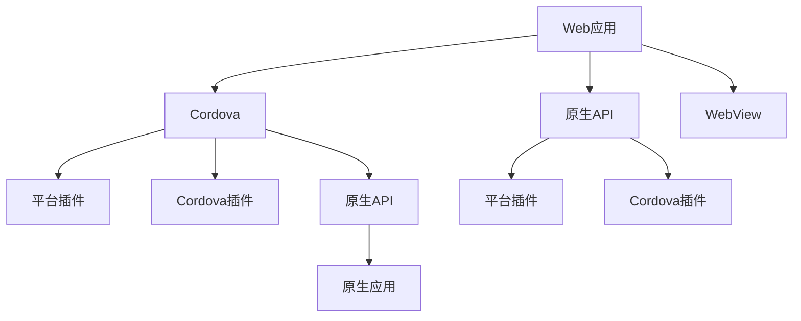

                 

# Cordova 混合应用开发：在原生平台上运行 Web 应用

> 关键词：混合应用开发, Cordova, Web应用, 原生平台, 跨平台开发, 移动应用

## 1. 背景介绍

### 1.1 问题由来

随着移动设备的普及，移动应用市场持续高速增长，企业对于移动应用开发的需求日益增长。然而，传统的原生应用开发周期长、成本高、维护困难，限制了企业快速推出新应用的步伐。而Web应用由于开发成本低、开发效率高、跨平台性好，逐渐成为一种新的应用开发方式。然而，Web应用在移动端的用户体验和性能表现不如原生应用。为了实现Web应用在原生平台上的良好体验，混合应用（Hybrid App）应运而生。

### 1.2 问题核心关键点

混合应用是Web应用与原生平台之间的一种折中方案，通过将Web应用嵌入原生应用，利用Web技术的灵活性和原生平台的高性能，实现Web应用在移动端的无缝运行。混合应用的开发框架主要包括HTML、CSS、JavaScript等Web技术，以及Cordova等混合应用开发框架。Cordova是最流行的混合应用开发框架之一，通过将Web应用打包为原生应用，实现了Web应用在iOS、Android等平台上的无缝运行。

Cordova的开发流程主要包括三个步骤：
1. 创建Cordova项目，初始化项目结构。
2. 编写Web应用代码，并通过Cordova插件调用原生API。
3. 构建打包原生应用，发布到应用商店。

混合应用的开发范式对于企业来说具有重要意义：
- 成本低：Web应用开发成本远低于原生应用，可以利用Web开发人才快速推出应用。
- 开发效率高：Web技术发展迅速，框架成熟稳定，开发效率高。
- 跨平台性好：利用Web技术实现一次开发，多平台发布，降低维护成本。

## 2. 核心概念与联系

### 2.1 核心概念概述

Cordova混合应用开发基于Cordova框架，通过将Web应用打包为原生应用，实现Web应用在原生平台上的无缝运行。Cordova支持iOS、Android、Windows等多个平台，具备良好的跨平台特性。Cordova的核心技术架构包括WebView、Cordova插件、平台插件等组件。

- **WebView**：Cordova的核心组件之一，用于显示Web应用内容。
- **Cordova插件**：通过添加Cordova插件，可以在Web应用中调用原生API。
- **平台插件**：Cordova平台插件用于实现原生功能，如摄像头、地理位置、本地存储等。

### 2.2 核心概念原理和架构的 Mermaid 流程图(Mermaid 流程节点中不要有括号、逗号等特殊字符)



这个流程图展示了Cordova混合应用开发的基本流程和架构：

1. 创建Web应用，编写Web代码，实现基本功能。
2. 通过Cordova框架，将Web应用打包为原生应用。
3. 添加Cordova插件，调用原生API实现功能增强。
4. 添加平台插件，实现原生功能。
5. 通过原生API在Web应用中调用原生功能。
6. Web应用通过WebView显示在原生应用中。

## 3. 核心算法原理 & 具体操作步骤

### 3.1 算法原理概述

Cordova混合应用开发的核心算法原理是通过将Web应用嵌入原生应用，利用Web技术的灵活性和原生平台的高性能，实现Web应用在原生平台上的无缝运行。Cordova框架提供了统一的API，使得Web应用能够调用原生平台的API，同时具备良好的跨平台特性。

### 3.2 算法步骤详解

Cordova混合应用开发的算法步骤主要包括：

1. **初始化Cordova项目**：使用Cordova CLI创建新的混合应用项目，初始化项目结构和配置文件。
2. **编写Web应用代码**：使用Web技术（如HTML、CSS、JavaScript）编写Web应用代码，实现基本功能。
3. **添加Cordova插件**：添加Cordova插件，调用原生API实现功能增强。
4. **添加平台插件**：添加平台插件，实现原生功能，如摄像头、地理位置、本地存储等。
5. **打包原生应用**：使用Cordova命令行工具打包原生应用，生成iOS、Android等平台的应用。

### 3.3 算法优缺点

Cordova混合应用开发的优点主要包括：

- **成本低**：Web应用开发成本远低于原生应用，可以利用Web开发人才快速推出应用。
- **开发效率高**：Web技术发展迅速，框架成熟稳定，开发效率高。
- **跨平台性好**：利用Web技术实现一次开发，多平台发布，降低维护成本。

缺点主要包括：

- **性能有限**：Web应用在原生平台上的性能表现不如原生应用，存在一定的性能瓶颈。
- **兼容性问题**：不同平台的Web视图和原生API调用方式可能存在兼容性问题。
- **学习曲线**：Cordova和Web开发技术的栈有一定复杂度，需要一定的学习成本。

### 3.4 算法应用领域

Cordova混合应用开发广泛应用于企业移动应用开发中，具有广泛的应用场景，包括：

- **企业应用**：实现企业的内部管理、客户服务、在线培训等功能。
- **移动游戏**：实现移动游戏的开发和部署，利用Web技术实现游戏逻辑，利用原生平台的高性能提升用户体验。
- **电子商务**：实现电商平台的移动应用，包括商品展示、购物车、支付等功能。
- **医疗应用**：实现医疗应用的开发，如挂号、预约、健康记录等功能。

## 4. 数学模型和公式 & 详细讲解 & 举例说明（备注：数学公式请使用latex格式，latex嵌入文中独立段落使用 $$，段落内使用 $)
### 4.1 数学模型构建

Cordova混合应用开发的核心数学模型包括Web应用模型的构建和原生平台模型的构建。Web应用模型的主要任务是实现Web应用的逻辑和业务功能，原生平台模型的主要任务是实现原生平台的功能和性能优化。

### 4.2 公式推导过程

**Web应用模型**：

- 定义Web应用模型的输入为$x$，输出为$y$。
- 定义Web应用模型的函数关系为$f(x)$。
- 定义Web应用模型的损失函数为$\mathcal{L}(y,f(x))$。

**原生平台模型**：

- 定义原生平台模型的输入为$x'$，输出为$y'$。
- 定义原生平台模型的函数关系为$g(x')$。
- 定义原生平台模型的损失函数为$\mathcal{L}'(y',g(x'))$。

### 4.3 案例分析与讲解

假设企业需要开发一个电子商务应用，通过Cordova混合应用开发框架实现。企业可以将Web应用代码编写在HTML、CSS和JavaScript中，实现商品展示、购物车、支付等功能。同时，企业可以在原生应用中集成Cordova插件，实现原生功能，如相机扫描商品条码、地理位置定位等功能。在原生平台中，企业可以使用平台插件实现原生功能，如原生UI、动画效果、性能优化等。通过这种方式，企业可以快速推出电商应用的Web版本和原生版本，实现一次开发多平台发布的目标。

## 5. 项目实践：代码实例和详细解释说明

### 5.1 开发环境搭建

以下是使用Cordova框架开发混合应用的基本环境搭建步骤：

1. **安装Node.js和Cordova CLI**：在Windows系统中，可以使用Node.js官网下载安装包，安装后打开命令行窗口，输入`npm install -g cordova`命令，安装Cordova CLI。
2. **创建Cordova项目**：在命令行中输入`cordova create myapp`命令，创建名为myapp的Cordova项目。
3. **配置项目**：在`config.xml`文件中，配置项目的平台、应用程序名称、ID等信息。

### 5.2 源代码详细实现

以下是使用Cordova框架开发混合应用的基本代码实现：

```javascript
// 定义Web应用代码
var app = document.addEventListener('DOMContentLoaded', function() {
  var button = document.querySelector('#myButton');
  button.addEventListener('click', function() {
    alert('Hello, Cordova!');
  });
});

// 定义Cordova插件
function showToast() {
  var toast = window.cordova.plugins.notification.service;
  toast.show({title: 'Cordova Notification', message: 'Hello, Cordova!'});
}

// 调用Cordova插件
app.addEventListener('DOMContentLoaded', function() {
  var button = document.querySelector('#myButton');
  button.addEventListener('click', function() {
    showToast();
  });
});
```

### 5.3 代码解读与分析

以上代码展示了Web应用的基本实现和Cordova插件的使用。Web应用通过按钮点击事件触发Toast通知，调用Cordova插件实现通知功能。Cordova插件通过`window.cordova.plugins.notification.service`调用原生平台的通知API。

### 5.4 运行结果展示

在原生应用中，Web应用通过WebView显示，可以通过按钮触发Toast通知。原生应用通过Cordova插件调用原生平台的功能，实现更好的用户体验。

## 6. 实际应用场景

### 6.1 智能客服系统

智能客服系统可以通过混合应用开发实现，将Web应用嵌入原生应用中，实现客户服务的在线咨询、智能对话等功能。通过Cordova插件调用原生API，实现语音识别、文本处理等功能，提升客户服务体验。

### 6.2 金融舆情监测

金融舆情监测可以通过混合应用开发实现，将Web应用嵌入原生应用中，实现实时舆情监测、情感分析等功能。通过Cordova插件调用原生API，实现多平台数据采集和处理，提升舆情监测的实时性和准确性。

### 6.3 个性化推荐系统

个性化推荐系统可以通过混合应用开发实现，将Web应用嵌入原生应用中，实现商品推荐、用户行为分析等功能。通过Cordova插件调用原生API，实现多平台数据收集和分析，提升个性化推荐系统的精准度。

### 6.4 未来应用展望

未来，混合应用开发将不断拓展应用场景，提升用户体验和性能表现。随着Cordova框架的不断更新，混合应用开发将更加方便高效，为企业快速推出新应用提供更多可能性。

## 7. 工具和资源推荐

### 7.1 学习资源推荐

以下是一些推荐的混合应用开发学习资源：

- **Cordova官方文档**：Cordova官方文档提供了详细的开发指南和API文档，是学习Cordova混合应用开发的最佳资源。
- **MDN Web文档**：MDN Web文档提供了Web开发技术的详细教程和示例，是学习Web开发技术的好帮手。
- **Codrops Web开发教程**：Codrops提供了丰富的Web开发教程，涵盖HTML、CSS、JavaScript等技术，适合进阶学习。

### 7.2 开发工具推荐

以下是一些推荐的混合应用开发工具：

- **Visual Studio Code**：Visual Studio Code是一款轻量级的代码编辑器，支持Cordova项目开发。
- **Android Studio**：Android Studio是Android应用开发的主要IDE，支持混合应用开发和调试。
- **Xcode**：Xcode是iOS应用开发的主要IDE，支持混合应用开发和调试。

### 7.3 相关论文推荐

以下是几篇混合应用开发领域的重要论文：

- **Web应用与移动应用整合框架**：这篇文章探讨了Web应用和原生应用的整合框架，提出了一种基于Web组件的开发模式。
- **Cordova混合应用性能优化**：这篇文章探讨了Cordova混合应用的性能优化方法，提出了一种基于动态加载和缓存的优化方案。
- **混合应用开发的最佳实践**：这篇文章总结了混合应用开发的最佳实践，包括代码结构、性能优化、跨平台开发等。

## 8. 总结：未来发展趋势与挑战

### 8.1 总结

本文对Cordova混合应用开发进行了全面系统的介绍，涵盖了混合应用开发的核心概念、算法原理和具体操作步骤。通过实际案例，展示了Cordova混合应用开发的开发流程和代码实现。本文还探讨了混合应用开发在企业移动应用、金融舆情监测、个性化推荐系统等实际应用场景中的应用，为读者提供了丰富的实际应用案例。

通过本文的系统梳理，可以看到，Cordova混合应用开发为Web应用在原生平台上的无缝运行提供了有力支持。利用Web技术的灵活性和原生平台的高性能，企业可以快速推出新应用，实现一次开发多平台发布的目标。未来，随着Cordova框架的不断更新和优化，混合应用开发将更加方便高效，为企业快速推出新应用提供更多可能性。

### 8.2 未来发展趋势

展望未来，Cordova混合应用开发将呈现以下几个发展趋势：

1. **性能提升**：随着Web技术和原生API调用方式的不断优化，混合应用的性能表现将进一步提升。
2. **跨平台优化**：Cordova框架将不断优化跨平台特性，实现更好的跨平台兼容性和用户体验。
3. **Web技术发展**：Web技术的发展将进一步提升混合应用的开发效率和性能表现。
4. **原生功能增强**：原生平台的功能将不断增强，混合应用将具备更多原生功能。
5. **新技术集成**：混合应用开发将集成更多新技术，如WebAssembly、WebGPU等，提升用户体验和性能表现。

### 8.3 面临的挑战

尽管Cordova混合应用开发具有广泛的应用前景，但在实际应用中仍面临以下挑战：

1. **性能瓶颈**：Web应用在原生平台上的性能表现仍存在一定的瓶颈，需要进一步优化。
2. **兼容性问题**：不同平台的Web视图和原生API调用方式可能存在兼容性问题，需要解决。
3. **学习成本**：混合应用开发涉及Web和原生开发技术栈，需要一定的学习成本。

### 8.4 研究展望

未来，混合应用开发需要在以下几个方面进行深入研究：

1. **性能优化**：进一步优化混合应用的性能表现，提升用户体验。
2. **跨平台优化**：优化混合应用的跨平台特性，提升跨平台兼容性和用户体验。
3. **新技术集成**：集成更多新技术，如WebAssembly、WebGPU等，提升混合应用的性能表现。
4. **原生功能增强**：增强原生平台的功能，提升混合应用的原生特性。

通过不断优化和创新，混合应用开发将为Web应用在原生平台上的无缝运行提供更多可能性，帮助企业快速推出新应用，实现一次开发多平台发布的目标。

## 9. 附录：常见问题与解答

**Q1: 什么是Cordova混合应用开发？**

A: Cordova混合应用开发是一种通过将Web应用嵌入原生应用，实现Web应用在原生平台上的无缝运行的技术。

**Q2: 使用Cordova混合应用开发有哪些优点？**

A: 使用Cordova混合应用开发具有以下优点：
1. 成本低：Web应用开发成本远低于原生应用，可以利用Web开发人才快速推出应用。
2. 开发效率高：Web技术发展迅速，框架成熟稳定，开发效率高。
3. 跨平台性好：利用Web技术实现一次开发，多平台发布，降低维护成本。

**Q3: 使用Cordova混合应用开发有哪些缺点？**

A: 使用Cordova混合应用开发有以下缺点：
1. 性能有限：Web应用在原生平台上的性能表现不如原生应用，存在一定的性能瓶颈。
2. 兼容性问题：不同平台的Web视图和原生API调用方式可能存在兼容性问题。
3. 学习成本：Cordova和Web开发技术的栈有一定复杂度，需要一定的学习成本。

**Q4: 如何使用Cordova混合应用开发技术开发移动应用？**

A: 使用Cordova混合应用开发技术开发移动应用的基本步骤如下：
1. 创建Cordova项目，初始化项目结构。
2. 编写Web应用代码，实现基本功能。
3. 添加Cordova插件，调用原生API实现功能增强。
4. 添加平台插件，实现原生功能，如摄像头、地理位置、本地存储等。
5. 打包原生应用，发布到应用商店。

**Q5: 如何使用Cordova混合应用开发技术提升用户体验？**

A: 使用Cordova混合应用开发技术提升用户体验的方法包括：
1. 优化Web应用性能，提升Web应用的响应速度和流畅性。
2. 利用原生API调用原生功能，提升原生应用的性能和用户体验。
3. 集成平台插件，实现更多原生功能，提升应用的多样性和用户体验。

通过不断优化和创新，混合应用开发将为Web应用在原生平台上的无缝运行提供更多可能性，帮助企业快速推出新应用，实现一次开发多平台发布的目标。

