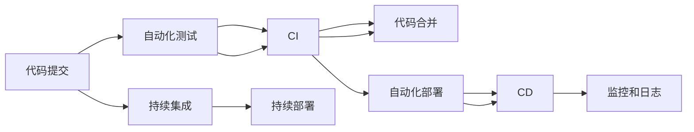

                 

# DevOps实践：持续集成与持续部署的最佳实践

> 关键词：持续集成(CI)、持续部署(CD)、DevOps、自动化测试、容器化、Kubernetes、GitLab、Jenkins、Git

## 1. 背景介绍

在当今快速变化的软件开发环境中，如何确保高质量、高可靠性的软件交付成为企业关注的焦点。DevOps（Development + Operations）是一种持续的软件交付和维护方法，旨在通过自动化和协作，加速开发和运维的流程，提升软件交付速度和质量。

持续集成（Continuous Integration, CI）和持续部署（Continuous Deployment, CD）是DevOps的两个核心实践，通过自动化测试和部署流水线，实现快速的软件交付和故障检测。本文将系统介绍DevOps的持续集成和持续部署的最佳实践，并结合实际案例，帮助开发者和运维人员掌握这一高效的软件交付方法。

## 2. 核心概念与联系

### 2.1 核心概念概述

- **持续集成（Continuous Integration, CI）**：指开发团队频繁提交代码到共享仓库，通过自动化的集成和测试流程，快速发现和修复代码问题，确保代码质量稳定。

- **持续部署（Continuous Deployment, CD）**：指在CI的基础上，通过自动化的部署流程，将通过测试的代码快速发布到生产环境，实现不间断的软件交付。

- **DevOps**：一种结合了开发（Development）和运维（Operations）的协同工作模式，通过自动化和持续交付的方法，提升软件交付的效率和质量。

- **自动化测试（Automated Testing）**：指通过脚本或工具自动化执行测试用例，提升测试效率和覆盖面，及时发现和修复缺陷。

- **容器化（Containerization）**：指将应用程序及其依赖打包成可移植的容器，以便在不同的环境中一致运行。

- **容器编排（Container Orchestration）**：指自动化管理和调度容器，以实现高效资源利用和应用运行。

- **Kubernetes**：一个开源的容器编排平台，提供自动化运维和部署功能，支持大规模的分布式应用。

- **GitLab、Jenkins**：常用的CI/CD工具，集成了代码托管、自动化测试和部署功能，方便开发者和运维人员协作。

### 2.2 核心概念原理和架构的 Mermaid 流程图



这个流程图展示了CI/CD流程的各个环节，从代码提交到自动化测试，再到自动化部署，最后通过监控和日志反馈持续改进。各环节通过脚本和工具自动化执行，确保代码质量稳定和快速交付。

## 3. 核心算法原理 & 具体操作步骤

### 3.1 算法原理概述

CI/CD的核心原理是通过自动化测试和部署流程，确保代码变更的及时性、可靠性和安全性。其基本流程包括代码提交、自动化测试、代码合并、自动化部署、监控和日志反馈。每个环节通过脚本和工具自动化执行，确保整个流程的快速、高效和可追溯性。

### 3.2 算法步骤详解

#### 3.2.1 代码提交

1. **版本控制**：使用如Git的版本控制系统，对代码进行版本管理。开发者提交代码到共享仓库（如GitLab），触发CI流水线。

2. **持续集成触发器**：当代码提交到仓库时，CI流水线自动触发，开始执行测试和部署流程。

#### 3.2.2 自动化测试

1. **单元测试**：使用单元测试框架（如JUnit、pytest），对代码进行模块级别的测试。

2. **集成测试**：对代码进行集成级别的测试，确保各个模块之间协同工作正常。

3. **端到端测试**：对整个应用进行端到端的测试，验证功能正确性。

4. **自动化测试工具**：使用如Selenium、JMeter等工具，自动执行测试用例，生成测试报告。

#### 3.2.3 代码合并

1. **代码审查**：通过代码审查工具（如Review Board），对代码变更进行人工审查，确保代码质量。

2. **合并代码**：通过仓库管理工具（如GitLab），将审查通过的代码合并到主分支。

#### 3.2.4 自动化部署

1. **容器化构建**：使用如Docker容器化工具，将代码及其依赖打包成容器镜像。

2. **容器编排调度**：使用如Kubernetes容器编排平台，自动化管理和调度容器，确保应用一致性运行。

3. **部署流水线**：通过CI工具（如Jenkins），自动化执行部署流程，从构建、测试到部署。

#### 3.2.5 监控和日志反馈

1. **应用监控**：使用如Prometheus、Grafana等工具，监控应用运行状态和性能指标。

2. **日志收集**：使用如ELK Stack（Elasticsearch、Logstash、Kibana）等工具，收集和分析应用日志。

3. **持续反馈**：通过监控和日志反馈，不断优化CI/CD流程，提升应用交付效率和质量。

### 3.3 算法优缺点

**优点**：

1. **自动化和标准化**：CI/CD通过自动化测试和部署流程，提升交付效率，减少人为错误。

2. **快速反馈和修复**：通过持续集成和自动化测试，快速发现和修复代码问题，确保代码质量稳定。

3. **跨团队协作**：CI/CD促进开发和运维团队协作，提升整体交付效率。

**缺点**：

1. **初期投入较大**：实施CI/CD需要搭建自动化测试和部署环境，初期投入较大。

2. **依赖工具和技术**：CI/CD流程依赖于各种工具和技术，需要持续维护和更新。

3. **复杂性增加**：自动化流程复杂度增加，需要专业人员维护和管理。

### 3.4 算法应用领域

CI/CD广泛应用于各种软件项目中，涵盖前端、后端、移动端和全栈开发。其应用领域包括但不限于以下方面：

- **Web应用**：如电商平台、社交媒体、企业门户等。

- **移动应用**：如手机应用、小程序、游戏等。

- **云服务和API**：如AWS Lambda、Azure Functions、RESTful API等。

- **大数据和机器学习**：如数据处理、数据挖掘、模型训练等。

- **物联网和智能设备**：如智能家居、车联网、工业控制等。

## 4. 数学模型和公式 & 详细讲解 & 举例说明

### 4.1 数学模型构建

CI/CD的数学模型主要涉及自动化测试和部署的流程设计和优化。这里通过一个简单的例子来说明其流程。

假设有一项新功能，需要从开发、测试到部署的流程。模型的输入是开发人员提交的代码变更，输出是部署到生产环境的应用版本。

#### 4.2 公式推导过程

设开发人员提交代码变更的时间为 $t_0$，自动化测试的时间为 $t_1$，代码合并的时间为 $t_2$，容器构建的时间为 $t_3$，容器编排调度的时间为 $t_4$，应用部署的时间为 $t_5$。则整个CI/CD流程的平均时间 $T$ 可以表示为：

$$
T = \frac{t_1 + t_3 + t_4 + t_5}{4}
$$

为了最小化 $T$，需要优化每个环节的执行时间，减少不必要的延迟和故障。

#### 4.3 案例分析与讲解

以一个Web应用的CI/CD流程为例，说明每个环节的具体操作和优化措施。

1. **代码提交**：开发者使用Git提交代码变更到共享仓库。

2. **持续集成触发器**：当代码提交到仓库时，触发CI流水线，开始自动化测试。

3. **自动化测试**：
   - **单元测试**：使用JUnit框架编写单元测试，自动化执行测试用例。
   - **集成测试**：使用Selenium框架编写集成测试，自动化执行测试用例。
   - **端到端测试**：使用JMeter框架编写端到端测试，自动化执行测试用例。

4. **代码合并**：
   - **代码审查**：通过Review Board工具，进行人工代码审查。
   - **合并代码**：使用GitLab仓库管理工具，将审查通过的代码合并到主分支。

5. **自动化部署**：
   - **容器化构建**：使用Docker容器化工具，构建应用容器镜像。
   - **容器编排调度**：使用Kubernetes容器编排平台，自动化管理和调度容器。
   - **部署流水线**：通过Jenkins工具，自动化执行部署流程，从构建、测试到部署。

6. **监控和日志反馈**：
   - **应用监控**：使用Prometheus、Grafana工具，监控应用运行状态和性能指标。
   - **日志收集**：使用ELK Stack工具，收集和分析应用日志。
   - **持续反馈**：通过监控和日志反馈，不断优化CI/CD流程，提升应用交付效率和质量。

### 4.4 案例分析与讲解

以一个Web应用的CI/CD流程为例，说明每个环节的具体操作和优化措施。

## 5. 项目实践：代码实例和详细解释说明

### 5.1 开发环境搭建

#### 5.1.1 工具安装

- **GitLab**：安装GitLab社区版，搭建代码仓库和CI流水线。
- **Jenkins**：安装Jenkins服务器，配置CI流水线。
- **Docker**：安装Docker引擎，搭建容器环境。
- **Kubernetes**：安装Kubernetes集群，搭建容器编排平台。

#### 5.1.2 环境配置

1. **GitLab配置**：在GitLab中配置CI流水线，定义代码提交触发器、测试步骤和部署步骤。

2. **Jenkins配置**：在Jenkins中配置CI流水线，定义构建、测试和部署步骤，并集成到GitLab仓库中。

3. **Docker配置**：在Docker中定义容器镜像构建脚本，确保应用在容器环境中的一致性运行。

4. **Kubernetes配置**：在Kubernetes中定义容器部署配置，确保应用的自动伸缩和高可用性。

### 5.2 源代码详细实现

#### 5.2.1 GitLab CI流水线

1. **代码提交触发器**：
```yaml
trigger:
  - ref: main
```

2. **测试步骤**：
```yaml
script:
  - echo "Start testing..."
  - mvn test
  - echo "Test finished."
```

3. **部署步骤**：
```yaml
script:
  - echo "Start deployment..."
  - kubectl apply -f deployment.yaml
  - echo "Deployment finished."
```

#### 5.2.2 Jenkins CI流水线

1. **构建步骤**：
```groovy
pipeline {
    agent any
    stages {
        stage('Build') {
            steps {
                sh 'mvn package'
            }
        }
        stage('Test') {
            steps {
                sh 'mvn test'
            }
        }
        stage('Deploy') {
            steps {
                sh 'kubectl apply -f deployment.yaml'
            }
        }
    }
}
```

#### 5.2.3 Docker容器构建

1. **Dockerfile**：
```dockerfile
FROM openjdk:11
COPY target/myapp.jar myapp.jar
JAVA_OPTS="-Djava.security.egd=file:/dev/urandom" JAVA_HOME=/usr/lib/jvm/java-11-openjdk-amd64
CMD ["java", "-jar", "myapp.jar"]
```

2. **构建脚本**：
```bash
docker build -t myapp .
```

### 5.3 代码解读与分析

- **GitLab CI流水线**：通过`trigger`定义代码提交触发器，`script`定义测试和部署步骤。通过`echo`输出日志，确保每个步骤的执行状态。

- **Jenkins CI流水线**：通过`pipeline`定义整个流水线流程，每个`stage`定义一个步骤，`steps`定义具体的操作。通过`sh`命令执行系统命令，完成构建、测试和部署。

- **Docker容器构建**：通过`Dockerfile`定义容器镜像构建过程，`COPY`命令将构建好的JAR包复制到镜像中。`JAVA_OPTS`和`JAVA_HOME`定义环境变量，确保Java运行环境一致。

### 5.4 运行结果展示

- **GitLab CI流水线**：
```yaml
job 1|echo Start testing... | | OK
job 1|mvn test | OK: [INFO] Tests run: 10, Failures: 0, Errors: 0, Skipped: 0
job 1|echo Test finished. | | OK
job 1|echo Start deployment... | | OK
job 1|kubectl apply -f deployment.yaml | OK: saved: LOADED=1 errors=0
job 1|echo Deployment finished. | | OK
```

- **Jenkins CI流水线**：
```
Build (stage 1)
Test (stage 2)
Deploy (stage 3)
Pipeline completed successfully
```

通过上述代码和结果展示，可以看到CI流水线从代码提交到自动部署的全过程，确保了代码质量稳定和快速交付。

## 6. 实际应用场景

### 6.1 软件开发公司

在软件开发公司中，DevOps实践可以通过CI/CD流程，提升开发效率和软件质量。通过自动化测试和部署流程，及时发现和修复代码问题，确保软件交付的稳定性和可靠性。同时，通过持续反馈机制，不断优化开发流程，提升整体开发效率。

### 6.2 互联网公司

互联网公司需要快速迭代产品功能，提升用户体验。通过CI/CD流程，实现快速的软件交付和故障检测，及时响应市场变化和用户需求。同时，通过容器化部署，确保应用的稳定性和可移植性，提升用户体验和系统性能。

### 6.3 金融科技公司

金融科技公司需要处理大规模数据和高并发请求，确保系统稳定性和数据安全。通过CI/CD流程，实现快速的软件交付和故障检测，及时应对市场变化和用户需求。同时，通过容器化部署和分布式架构，确保应用的可靠性和可扩展性，提升用户体验和系统性能。

### 6.4 未来应用展望

未来，随着云计算、人工智能和大数据技术的不断发展，DevOps实践将迎来更多新的挑战和机遇。例如：

- **云原生应用**：通过容器化和微服务架构，实现应用的灵活部署和扩展。
- **人工智能应用**：通过自动化训练和部署流程，提升人工智能应用的交付效率和质量。
- **大数据分析**：通过自动化数据处理和分析流程，提升大数据应用的交付效率和分析能力。
- **DevOps工具集成**：通过更多工具的集成和协同，提升DevOps实践的效率和可维护性。

## 7. 工具和资源推荐

### 7.1 学习资源推荐

1. **《DevOps实践指南》**：介绍DevOps的基本概念和最佳实践，涵盖CI/CD流程、自动化测试、容器化部署等。

2. **《Kubernetes实战》**：介绍Kubernetes容器编排平台的使用方法和实践案例，涵盖部署、管理、监控等方面。

3. **《Jenkins用户手册》**：介绍Jenkins CI/CD工具的使用方法和实践案例，涵盖构建、测试、部署等方面。

4. **《Docker实战》**：介绍Docker容器化工具的使用方法和实践案例，涵盖构建、测试、部署等方面。

5. **《Prometheus实战》**：介绍Prometheus监控工具的使用方法和实践案例，涵盖应用监控、告警、故障诊断等方面。

### 7.2 开发工具推荐

1. **GitLab**：集成了代码托管、CI/CD、项目管理等功能，方便开发者和运维人员协作。

2. **Jenkins**：开源的CI/CD工具，集成了各种插件，支持灵活的自动化测试和部署流程。

3. **Docker**：容器化构建工具，支持应用在多种环境中一致运行。

4. **Kubernetes**：容器编排平台，支持大规模的分布式应用部署和管理。

5. **Prometheus**：监控工具，支持应用状态和性能指标的实时监控和告警。

6. **ELK Stack**：日志分析工具，支持应用日志的收集和分析。

### 7.3 相关论文推荐

1. **《CI/CD最佳实践》**：介绍CI/CD的基本概念和最佳实践，涵盖持续集成、持续部署等方面。

2. **《容器化部署的挑战与解决》**：介绍容器化部署的挑战和解决策略，涵盖容器构建、容器编排等方面。

3. **《微服务架构的DevOps实践》**：介绍微服务架构的DevOps实践，涵盖服务拆分、分布式部署等方面。

4. **《人工智能应用的自动化部署》**：介绍人工智能应用的自动化部署流程，涵盖模型训练、部署、监控等方面。

## 8. 总结：未来发展趋势与挑战

### 8.1 总结

本文系统介绍了DevOps的持续集成与持续部署（CI/CD）的最佳实践，从核心概念、算法原理到操作步骤，全面剖析了CI/CD的实施过程。通过实际案例和代码实例，展示了CI/CD在软件开发、互联网、金融科技等领域的应用，并展望了未来的发展趋势和挑战。

### 8.2 未来发展趋势

未来，DevOps将持续向自动化、智能化、协同化方向发展，涵盖更多领域和场景。例如：

- **持续交付（Continuous Delivery, CD）**：在CI/CD基础上，进一步提升软件的交付速度和质量，实现不间断的软件交付。
- **DevOps自动化工具**：更多工具的集成和协同，提升DevOps实践的效率和可维护性。
- **容器化技术**：通过容器化和微服务架构，实现应用的灵活部署和扩展。
- **云原生应用**：通过云原生技术，实现应用的弹性伸缩和可扩展性。
- **人工智能应用**：通过自动化训练和部署流程，提升人工智能应用的交付效率和质量。
- **大数据分析**：通过自动化数据处理和分析流程，提升大数据应用的交付效率和分析能力。

### 8.3 面临的挑战

尽管DevOps实践带来了诸多好处，但在实施过程中也面临一些挑战：

- **技术复杂度**：CI/CD流程依赖于各种工具和技术，需要持续维护和更新。
- **资源消耗**：自动化流程复杂度增加，需要更多的计算和存储资源。
- **跨团队协作**：不同团队之间的协作和沟通成本较高，需要统一的标准和方法。
- **安全性和隐私**：数据安全和用户隐私保护成为重要挑战，需要更多技术和管理手段。

### 8.4 研究展望

未来，DevOps实践需要在技术和管理两个层面不断改进和优化：

- **技术层面的改进**：引入更多先进的技术和工具，提升DevOps的自动化和智能化水平。例如，引入AI技术优化测试和部署流程，引入区块链技术提升数据安全和隐私保护。
- **管理层面的优化**：引入更多的管理手段和方法，提升DevOps的协同和效率。例如，引入DevOps成熟度模型，评估和优化DevOps实践的各个环节。

总之，DevOps实践是软件交付和运维的重要方法，通过自动化和协同，提升软件交付效率和质量。未来，随着技术的不断发展和应用的不断深入，DevOps将进一步提升软件交付的稳定性和可靠性，成为软件开发和运维的重要保障。

## 9. 附录：常见问题与解答

### 9.1 Q1：CI/CD流程中如何保证代码质量？

A: CI/CD流程中，通过自动化测试和代码审查来保证代码质量。首先，通过自动化测试，快速发现代码中的缺陷。其次，通过代码审查，确保代码的规范性和可维护性。最后，通过持续反馈机制，不断优化代码质量和开发流程。

### 9.2 Q2：CI/CD流程中如何提升测试效率？

A: 通过自动化测试和持续集成，提升测试效率。首先，通过自动化测试工具，自动执行测试用例，快速发现代码问题。其次，通过持续集成触发器，自动触发测试流程，确保代码变更及时通过测试。最后，通过持续反馈机制，不断优化测试流程和测试用例，提升测试效率和覆盖面。

### 9.3 Q3：CI/CD流程中如何保证应用稳定性和可靠性？

A: 通过容器化和持续部署，保证应用的稳定性和可靠性。首先，通过容器化部署，确保应用在多种环境中一致运行。其次，通过持续部署，实现应用的快速交付和修复。最后，通过自动化监控和日志反馈，及时发现和修复应用故障，提升应用的稳定性和可靠性。

### 9.4 Q4：CI/CD流程中如何提升团队协作效率？

A: 通过自动化流程和协同工具，提升团队协作效率。首先，通过自动化测试和部署流程，减少人工操作，提升开发效率。其次，通过协同工具（如Jira、Slack），方便团队沟通和协作。最后，通过持续反馈机制，不断优化开发流程，提升团队协作效率。

### 9.5 Q5：CI/CD流程中如何保证数据安全和隐私保护？

A: 通过数据加密和访问控制，保证数据安全和隐私保护。首先，通过数据加密技术，保护数据传输和存储的安全性。其次，通过访问控制机制，限制数据访问权限，确保数据的安全性和隐私保护。最后，通过定期安全审计和漏洞修复，不断提升数据安全和隐私保护水平。

作者：禅与计算机程序设计艺术 / Zen and the Art of Computer Programming

