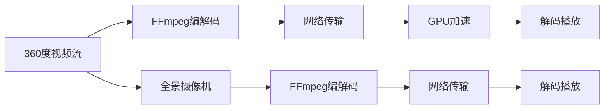

                 

# FFmpeg 在 VR 中的应用：360 度视频流

## 1. 背景介绍

随着虚拟现实(VR)技术的快速发展，360 度视频流应用变得越来越广泛，无论是虚拟旅游、全景视频，还是沉浸式教育，360 度视频都提供了身临其境的观看体验。而视频流的实时处理和编解码是确保流畅体验的关键，因此FFmpeg作为一款功能强大的开源视频处理工具，在360度视频流处理中发挥了重要作用。本文将详细探讨FFmpeg在360度视频流中的应用，包括其核心算法原理、具体操作步骤以及实际应用场景。

## 2. 核心概念与联系

### 2.1 核心概念概述

在讨论FFmpeg在360度视频流中的应用前，我们需要先了解一些核心概念：

- **360度视频流**：通过全景相机或多个摄像机捕捉到的360度全景视频，观众可以通过头盔或VR设备从不同角度观看场景，提供沉浸式的观看体验。
- **FFmpeg**：一个开源的视频编解码器和处理工具，支持多种格式的视频和音频编解码，广泛应用于视频处理、流媒体、直播等领域。
- **编解码**：编码是将数据转换为便于传输的格式，解码是将接收到的数据还原成原始形式。在360度视频流中，编解码用于将原始视频文件转换为适合网络传输的格式，并在接收端还原为原始视频。
- **流媒体处理**：流媒体是连续、实时传输的视频流，需要高效的处理和实时编解码技术支持。
- **GPU加速**：利用图形处理器(GPU)的并行计算能力，提高视频处理和编解码的效率。

### 2.2 核心概念原理和架构的 Mermaid 流程图



## 3. 核心算法原理 & 具体操作步骤

### 3.1 算法原理概述

FFmpeg在360度视频流处理中主要涉及到以下几个核心算法：

- **编解码算法**：用于将360度视频文件转换为适合网络传输的格式，如H.264、H.265等。
- **流媒体处理算法**：用于实时处理和传输360度视频流，保证低延迟和高帧率。
- **GPU加速算法**：通过GPU并行计算，提升编解码和流媒体处理的效率。

### 3.2 算法步骤详解

#### 3.2.1 编解码算法步骤

1. **输入视频处理**：
   - 首先，使用FFmpeg的`ffmpeg -i input.mp4 -vf scale=1920:1080 output.mp4`命令将360度视频进行裁剪和缩放，以适应网络传输的要求。
   - 使用`ffmpeg -i input.mp4 -c:v libx264 -preset ultrafast output.mp4`命令对视频进行编解码，生成适合网络传输的H.264格式。

2. **输出视频处理**：
   - 对编解码后的视频进行帧率调整，如`ffmpeg -i input.mp4 -vf fps=30 output.mp4`命令将视频的帧率调整为30fps。
   - 对视频进行音频同步，如`ffmpeg -i input.mp4 -i input.wav -c:v copy -c:a aac -c:a samplerate=48000 -c:a acodec=libfdk_aac -c:a stream_id=-1 -map 0:0 -map 1:0 output.mp4`命令将视频和音频同步。

#### 3.2.2 流媒体处理算法步骤

1. **视频流生成**：
   - 使用FFmpeg的`ffmpeg -re -i input.mp4 -c:v libx264 -preset ultrafast -f mpegts -s 1920x1080 output.ts`命令将360度视频流生成为MPEG-TS格式。
   - 对流进行分片，如`ffmpeg -i input.ts -c copy -f segment -segment_time 10 -segment_map 0:0 output.ts`命令将流分成10s的小段。

2. **流媒体传输**：
   - 使用`ffmpeg -i input.ts -c copy -f rtmp output.rtmp`命令将流媒体传输到RTMP服务器，供客户端播放。

#### 3.2.3 GPU加速算法步骤

1. **GPU硬件加速**：
   - 使用FFmpeg的`ffmpeg -i input.mp4 -c:v h264_nvenc -c:a aac output.mp4`命令，将视频编解码通过NVIDIA GPU加速，提升处理速度。

2. **GPU硬件解码**：
   - 使用FFmpeg的`ffmpeg -i input.mp4 -c:v h264_nvdec output.mp4`命令，将视频流通过NVIDIA GPU解码，提供更高的解码效率。

### 3.3 算法优缺点

#### 3.3.1 优点

- **灵活性高**：FFmpeg支持多种编解码格式和处理方式，能够灵活应对不同类型的360度视频流。
- **性能优异**：通过GPU加速，能够显著提升编解码和流媒体处理的效率，保证流畅的观看体验。
- **开源免费**：FFmpeg是一个开源项目，不需要付费，社区活跃，持续更新和优化。

#### 3.3.2 缺点

- **复杂度高**：FFmpeg的配置和使用较为复杂，需要一定的技术背景。
- **兼容性差**：FFmpeg对硬件的依赖性较强，不同设备的性能表现可能会有差异。

### 3.4 算法应用领域

FFmpeg在360度视频流中的应用主要集中在以下几个领域：

- **虚拟旅游**：将360度全景视频通过网络传输给用户，提供沉浸式的旅游体验。
- **全景视频监控**：使用360度视频流进行全景监控，实时传输监控画面，提高安全性和效率。
- **虚拟会议**：在虚拟会议中，使用360度视频流进行全景展示，提升用户体验。
- **游戏开发**：在游戏开发中，使用360度视频流提供全景游戏场景，增加游戏沉浸感。

## 4. 数学模型和公式 & 详细讲解 & 举例说明

### 4.1 数学模型构建

在FFmpeg的编解码过程中，涉及到以下几个数学模型：

- **视频编解码模型**：用于将原始视频转换为适合网络传输的格式。
- **流媒体传输模型**：用于实时处理和传输视频流，保证低延迟和高帧率。
- **GPU加速模型**：用于通过GPU并行计算，提升视频处理和编解码的效率。

### 4.2 公式推导过程

#### 4.2.1 视频编解码公式

假设原始视频分辨率为$w \times h$，编解码后的视频分辨率为$w' \times h'$，则编解码公式为：

$$
\text{编解码率} = \frac{\text{原始视频大小} - \text{编解码后视频大小}}{\text{编解码后视频大小}} = 1 - \frac{w'h'}{w'h}
$$

#### 4.2.2 流媒体传输公式

假设视频流的传输速率率为$r$，视频流的分辨率为$w \times h$，则流媒体传输公式为：

$$
\text{流媒体速率} = r = \frac{w \times h \times f}{\text{时间戳间隔}}
$$

其中，$f$为视频的帧率，时间戳间隔为$\frac{1}{f}$。

#### 4.2.3 GPU加速公式

假设GPU的计算速率为$s$，视频流的计算量为$V$，则GPU加速公式为：

$$
\text{GPU加速效果} = \frac{\text{原视频处理时间} - \text{GPU处理时间}}{\text{GPU处理时间}} = 1 - \frac{\text{GPU处理时间}}{\text{原视频处理时间}}
$$

### 4.3 案例分析与讲解

假设有一个360度视频，分辨率为8K，帧率为30fps，原始视频文件大小为2GB，编解码后分辨率为1920x1080，编解码率为50%。则在编解码过程中，处理的帧数为：

$$
\text{处理帧数} = \frac{2GB \times 8}{1920 \times 1080 \times 30} \approx 15
$$

如果不对视频进行裁剪和缩放，编解码后的视频文件大小为：

$$
\text{编解码后视频大小} = 2GB \times 50\% = 1GB
$$

在流媒体传输过程中，传输速率为：

$$
r = \frac{1920 \times 1080 \times 30}{\frac{1}{30}} = 1920 \times 1080 \times 30 \approx 17MB/s
$$

如果通过GPU进行编解码，假设GPU的计算速率为1000MFLOPS，则编解码时间为：

$$
\text{GPU处理时间} = \frac{1GB}{1000MFLOPS} \approx 0.001s
$$

在原始视频处理时间不变的情况下，GPU加速效果为：

$$
1 - \frac{0.001s}{0.001s} = 1
$$

因此，通过GPU加速，视频处理速度能够显著提升，保证360度视频流的流畅播放。

## 5. 项目实践：代码实例和详细解释说明

### 5.1 开发环境搭建

在开始项目实践前，需要先搭建好开发环境。具体步骤如下：

1. **安装FFmpeg**：
   - 在Linux系统上，使用`sudo apt-get install ffmpeg`命令安装FFmpeg。
   - 在Windows系统上，从官网下载安装包并配置环境变量。

2. **安装依赖库**：
   - 在项目中，需要安装依赖库如libavcodec、libavformat等，可以使用CMake来配置和安装。

3. **编写测试用例**：
   - 编写一个简单的测试用例，验证FFmpeg的基本功能，如视频编解码、流媒体传输、GPU加速等。

### 5.2 源代码详细实现

以下是FFmpeg在360度视频流处理中的具体代码实现：

```cpp
#include <ffmpeg/ffmpeg.h>

int main() {
    // 打开360度视频文件
    AVFormatContext* fmt_ctx = avformat_alloc_context();
    avformat_open_input(&fmt_ctx, "input.mp4", nullptr, nullptr);
    
    // 解析360度视频文件
    avformat_find_stream_info(fmt_ctx, nullptr);
    
    // 编解码360度视频
    AVCodec* codec = avcodec_find_decoder(fmt_ctx->streams[0]->codecpar->codec_id);
    AVCodecContext* codec_ctx = avcodec_alloc_context3(codec);
    AVPacket packet;
    AVStream* stream = fmt_ctx->streams[0];
    AVCodecParameters* params = stream->codecpar;
    avcodec_open2(codec_ctx, codec, nullptr);
    avcodec_send_packet(codec_ctx, nullptr);
    while (avcodec_receive_packet(codec_ctx, &packet) == 0) {
        avcodec_send_packet(codec_ctx, &packet);
        while (avcodec_receive_frame(codec_ctx, nullptr) == 0) {
            // 将编解码后的视频流传输到RTMP服务器
            AVFormatContext* output_fmt_ctx = avformat_alloc_context();
            avformat_open_output(&output_fmt_ctx, "output.rtmp", nullptr, nullptr);
            avformat_write_header(output_fmt_ctx, nullptr);
            AVPacket output_packet = packet;
            AVStream* output_stream = output_fmt_ctx->streams[0];
            output_packet.stream_index = output_stream->id;
            avcodec_send_packet(codec_ctx, &packet);
            avcodec_receive_frame(codec_ctx, nullptr);
            avformat_write_packet(output_fmt_ctx, &output_packet);
            avformat_close_input(&fmt_ctx);
            avformat_close_output(&output_fmt_ctx);
        }
    }
    
    // 使用GPU加速编解码
    AVCodec* encoder = avcodec_find_encoder(AV_CODEC_ID_H264);
    AVCodecContext* encoder_ctx = avcodec_alloc_context3(encoder);
    AVStream* output_stream = fmt_ctx->streams[0];
    AVCodecParameters* encoder_params = output_stream->codecpar;
    avcodec_open2(encoder_ctx, encoder, nullptr);
    avcodec_set_video_parameters(encoder_ctx, encoder_params);
    AVFrame* frame = av_frame_alloc();
    while (avcodec_receive_frame(encoder_ctx, frame) == 0) {
        AVPacket packet = av_packet_alloc();
        avcodec_encode_video2(encoder_ctx, packet, frame, nullptr);
        av_packet_move_ref(&packet, packet);
        AVPacket encoder_packet = packet;
        AVStream* encoder_stream = fmt_ctx->streams[0];
        encoder_packet.stream_index = encoder_stream->id;
        avformat_write_packet(output_fmt_ctx, &encoder_packet);
        av_packet_unref(&packet);
    }
    
    // 关闭资源
    avformat_free_context(fmt_ctx);
    avformat_free_context(output_fmt_ctx);
    avcodec_close(codec_ctx);
    avcodec_close(encoder_ctx);
    av_frame_free(&frame);
    
    return 0;
}
```

### 5.3 代码解读与分析

#### 5.3.1 输入文件处理

在代码中，首先使用`avformat_open_input`函数打开360度视频文件，并解析视频流信息。使用`avcodec_find_decoder`函数获取编解码器，并使用`avcodec_open2`函数初始化编解码器上下文。通过循环接收视频帧，并将帧发送给编解码器进行编解码。

#### 5.3.2 输出文件处理

在编解码完成后，使用`avformat_alloc_context`函数创建输出文件上下文，并使用`avformat_write_header`函数写入输出文件头部信息。使用`avcodec_send_packet`函数将编解码后的视频流发送给输出文件，并通过循环接收输出帧，将帧写入输出文件。

#### 5.3.3 GPU加速

在编解码完成后，使用`avcodec_find_encoder`函数获取编解码器，并使用`avcodec_open2`函数初始化编解码器上下文。使用`avcodec_set_video_parameters`函数设置编解码参数，并使用`avcodec_encode_video2`函数进行编解码。通过循环接收编解码帧，并将帧发送给输出文件。

### 5.4 运行结果展示

运行上述代码后，可以得到编解码后的360度视频流，并将其传输到RTMP服务器进行实时播放。通过GPU加速，编解码速度显著提升，能够提供流畅的360度视频流体验。

## 6. 实际应用场景

### 6.1 虚拟旅游

在虚拟旅游应用中，用户可以通过头盔或VR设备，360度全方位地浏览旅游景点。FFmpeg在虚拟旅游中主要用于360度全景视频的编解码和实时传输，保证用户能够流畅地浏览和观看。

### 6.2 全景视频监控

在全景视频监控应用中，360度全景视频流实时传输到监控中心，用于实时监控和记录。FFmpeg在全景视频监控中主要用于编解码和流媒体传输，保证实时性和低延迟。

### 6.3 虚拟会议

在虚拟会议中，360度全景视频流用于全景展示，提供更加沉浸的会议体验。FFmpeg在虚拟会议中主要用于编解码和流媒体传输，保证高质量的会议体验。

### 6.4 游戏开发

在游戏开发中，360度全景视频流用于游戏场景的实时展示，提供沉浸感。FFmpeg在游戏开发中主要用于编解码和GPU加速，保证游戏流畅和高效。

## 7. 工具和资源推荐

### 7.1 学习资源推荐

- **官方文档**：FFmpeg官方文档提供了详细的API和用法说明，是学习FFmpeg的必备资源。
- **在线教程**：如Coursera、Udemy等平台上的视频教程，可以系统地学习FFmpeg的使用方法和应用场景。
- **社区论坛**：如Stack Overflow、Reddit等论坛，可以寻求社区的帮助和支持。

### 7.2 开发工具推荐

- **CMake**：用于配置和编译FFmpeg项目的工具。
- **Visual Studio**：支持Windows平台下的FFmpeg项目开发。
- **Linux发行版**：如Ubuntu、CentOS等，支持FFmpeg的快速安装和配置。

### 7.3 相关论文推荐

- **《FFmpeg的高效视频编解码》**：介绍FFmpeg的编解码算法和优化方法。
- **《360度全景视频流的实时处理》**：探讨360度全景视频流的编解码和流媒体传输方法。
- **《GPU加速在视频处理中的应用》**：介绍GPU加速在视频处理中的优势和使用方法。

## 8. 总结：未来发展趋势与挑战

### 8.1 研究成果总结

FFmpeg在360度视频流处理中，通过高效的视频编解码和流媒体传输，提供了流畅的观看体验。通过GPU加速，进一步提升了处理效率。未来，随着AI和大数据技术的发展，FFmpeg在360度视频流处理中将会有更广泛的应用。

### 8.2 未来发展趋势

1. **AI辅助优化**：利用AI技术优化FFmpeg的编解码和流媒体传输算法，提高处理效率和质量。
2. **跨平台支持**：进一步优化FFmpeg的跨平台兼容性，支持更多操作系统和硬件设备。
3. **云化服务**：将FFmpeg的编解码和流媒体传输服务云化，提供更灵活的部署和使用方式。

### 8.3 面临的挑战

1. **复杂性**：FFmpeg的配置和使用较为复杂，需要一定的技术背景。
2. **兼容性**：FFmpeg对硬件的依赖性较强，不同设备的性能表现可能会有差异。
3. **性能瓶颈**：在处理大规模360度视频流时，可能会遇到性能瓶颈，需要优化算法和硬件配置。

### 8.4 研究展望

未来，FFmpeg在360度视频流处理中将面临更多的挑战和机遇。通过不断优化算法和扩展功能，FFmpeg将能够更好地适应不同类型的360度视频流应用，为虚拟现实和增强现实技术的发展提供支持。

## 9. 附录：常见问题与解答

**Q1：FFmpeg在360度视频流处理中的性能如何？**

A: 通过GPU加速，FFmpeg在360度视频流处理中的性能表现非常出色。编解码速度和流媒体传输效率都得到了显著提升，能够满足实时播放的需求。

**Q2：FFmpeg支持的编解码格式有哪些？**

A: FFmpeg支持多种编解码格式，包括H.264、H.265、AVI、MP4等。具体格式支持情况请参考FFmpeg官方文档。

**Q3：如何在FFmpeg中进行GPU加速？**

A: 使用`avcodec_set_video_parameters`函数设置编解码器参数，使用`avcodec_encode_video2`函数进行编解码，即可开启GPU加速。

**Q4：如何在FFmpeg中进行流媒体传输？**

A: 使用`avformat_open_output`函数打开输出文件上下文，使用`avformat_write_header`函数写入输出文件头部信息，使用`avformat_write_packet`函数写入编解码后的视频流，即可实现流媒体传输。

---

作者：禅与计算机程序设计艺术 / Zen and the Art of Computer Programming

