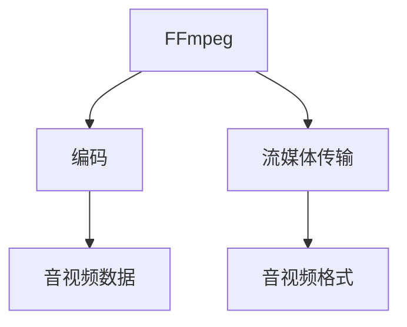

                 

# FFmpeg 在 VR 中的应用：编码和流媒体传输

## 1. 背景介绍

随着虚拟现实(VR)技术的不断成熟和普及，VR内容制作、传输和播放的效率和质量成为了影响用户体验的重要因素。在VR应用中，音频、视频数据的实时编码和流媒体传输是关键环节。FFmpeg作为一款开源的音视频处理工具，以其灵活性和高效性，成为VR内容处理和流媒体传输的首选解决方案。

本文将深入探讨FFmpeg在VR编码和流媒体传输中的应用，介绍其核心概念和关键技术，并通过具体案例展示FFmpeg在VR场景中的应用实践。同时，本文还将分析当前存在的问题，并展望FFmpeg未来的发展趋势。

## 2. 核心概念与联系

### 2.1 核心概念概述

为更好地理解FFmpeg在VR编码和流媒体传输中的应用，本节将介绍几个密切相关的核心概念：

- **FFmpeg**：FFmpeg是一款开源的音视频处理工具集，支持音频和视频的编码、解码、转码、流媒体传输等功能。FFmpeg支持多种音视频格式，可以高效地处理大量流媒体数据。
- **编码**：将原始视频或音频信号转换为可存储和传输的数字信号的过程。编码过程中需要选择合适的压缩算法和参数，以在保证质量的前提下尽量减小文件大小。
- **流媒体传输**：指将音视频数据通过网络实时传输到接收端，供用户实时播放的过程。流媒体传输需要高效的编码和解码算法，以及稳定的网络环境。
- **音视频格式**：音视频数据存储和传输时采用的格式，如MP4、AVI、WebM等。不同的格式适用于不同的应用场景和设备。
- **VR**：虚拟现实，通过计算机生成逼真的三维虚拟环境，提供沉浸式体验。VR应用需要高帧率、低延迟的音视频流，对编码和流媒体传输提出更高要求。

这些核心概念之间的逻辑关系可以通过以下Mermaid流程图来展示：



这个流程图展示了两大核心过程：

1. **编码**：将音视频数据进行压缩编码，形成可传输的流媒体。
2. **流媒体传输**：通过网络将编码后的流媒体实时传输给接收端。

## 3. 核心算法原理 & 具体操作步骤

### 3.1 算法原理概述

FFmpeg在VR编码和流媒体传输中，主要依赖其强大的编码器和流媒体传输功能。FFmpeg支持多种视频编码器，包括H.264、H.265、VP9等，可以根据不同的应用场景和设备选择合适的编码器。流媒体传输则依赖其灵活的流媒体协议，包括RTMP、HTTP Live Streaming(HLS)、WebRTC等。

FFmpeg的编码过程可以分为以下几个步骤：

1. 输入原始视频或音频数据。
2. 选择合适的编码器和参数，进行压缩编码。
3. 将编码后的数据进行封装，形成流媒体。
4. 通过网络传输流媒体数据。

流媒体传输过程也涉及多个步骤：

1. 将编码后的数据进行分片，以适应网络传输需求。
2. 选择合适的传输协议，进行数据传输。
3. 接收端解码数据，还原音视频信号。

### 3.2 算法步骤详解

#### 3.2.1 编码步骤详解

在FFmpeg中进行编码，通常需要以下命令：

```
ffmpeg -i input.mp4 -c:v libx264 -crf 27 -c:a aac -b:a 128k -f mp4 output.mp4
```

其中：
- `-i input.mp4`：指定输入文件。
- `-c:v libx264`：选择H.264编码器。
- `-crf 27`：设置编码质量参数。
- `-c:a aac`：选择AAC音频编码器。
- `-b:a 128k`：设置音频比特率。
- `-f mp4`：指定输出格式。

编码过程中的关键参数包括：

- **编码器**：选择合适的视频和音频编码器，如H.264、VP9、AAC等。
- **编码质量**：通过调节压缩率(fps)、量化参数(qp)、帧率(fr)等参数，控制编码质量与文件大小之间的平衡。
- **音频比特率**：根据应用场景，调整音频比特率，以保证音频质量。

#### 3.2.2 流媒体传输步骤详解

FFmpeg的流媒体传输过程，可以通过以下命令实现：

```
ffmpeg -i input.mp4 -c:v libx264 -crf 27 -c:a aac -b:a 128k -f flv output.flv
```

其中：
- `-i input.mp4`：指定输入文件。
- `-c:v libx264`：选择H.264编码器。
- `-crf 27`：设置编码质量参数。
- `-c:a aac`：选择AAC音频编码器。
- `-b:a 128k`：设置音频比特率。
- `-f flv`：指定流媒体格式。

流媒体传输过程中的关键参数包括：

- **传输协议**：选择合适的流媒体协议，如RTMP、HLS、WebRTC等。
- **流媒体格式**：根据应用场景，选择合适的流媒体格式，如FLV、MPEG-TS、WebRTC等。
- **编码质量**：控制编码质量与流媒体传输效率之间的平衡。

### 3.3 算法优缺点

FFmpeg在VR编码和流媒体传输中，具有以下优点：

- **灵活性高**：支持多种编码器和流媒体协议，可以根据不同设备和应用场景选择最适合的方案。
- **高效性**：高效的编码和解码算法，能够在不牺牲质量的前提下，大幅度减小文件大小，提高流媒体传输效率。
- **开放性**：开源软件，社区活跃，有大量的工具和插件支持。

同时，FFmpeg也存在一些缺点：

- **学习曲线陡峭**：由于功能丰富，命令复杂，初学者需要花费一定时间学习和使用。
- **资源消耗大**：大规模编码和流媒体传输需要大量计算资源，可能对设备性能提出较高要求。
- **兼容性问题**：不同设备和浏览器对音视频格式的支持程度不同，可能导致兼容性问题。

### 3.4 算法应用领域

FFmpeg在VR编码和流媒体传输中的应用非常广泛，包括但不限于以下几个领域：

- **虚拟现实游戏**：将游戏视频和音频进行编码和流媒体传输，提供沉浸式游戏体验。
- **虚拟现实教育**：将教育视频和音频进行编码和流媒体传输，提供远程教育课程。
- **虚拟现实娱乐**：将VR电影、音乐会等娱乐内容进行编码和流媒体传输，提供高质量娱乐体验。
- **虚拟现实会议**：将VR会议视频和音频进行编码和流媒体传输，提供高互动性会议体验。

## 4. 数学模型和公式 & 详细讲解 & 举例说明

### 4.1 数学模型构建

FFmpeg在VR编码和流媒体传输中，涉及的数学模型主要集中在编码和传输两个环节。下面将分别介绍这两个环节的数学模型构建。

#### 4.1.1 编码模型构建

FFmpeg的编码过程可以视为一个优化问题。假设输入视频或音频数据的原始大小为 $S$，编码后的文件大小为 $T$，编码质量为 $Q$，压缩率参数为 $p$。则编码过程的目标函数为：

$$
\min_{p} S - T
$$

其中，$T = S \times p(Q)$。

#### 4.1.2 流媒体传输模型构建

流媒体传输过程可以视为一个数据传输问题。假设输入视频或音频数据的原始大小为 $S$，传输带宽为 $B$，传输时间 $T$，传输速率 $r$。则流媒体传输的目标函数为：

$$
\min_{r} \frac{S}{r} \times T
$$

其中，$T = \frac{S}{r}$。

### 4.2 公式推导过程

在FFmpeg的编码和流媒体传输过程中，具体的数学公式推导涉及多个参数和函数。以H.264编码器为例，其压缩率函数可以表示为：

$$
p(Q) = \frac{1}{\sqrt{2\pi}} \int_0^{\infty} e^{-\frac{t^2}{2}} \times Q(t) dt
$$

其中，$Q(t)$ 为量化参数，$t$ 为压缩率。

### 4.3 案例分析与讲解

#### 案例分析：H.264编码器的压缩率函数

在FFmpeg中，H.264编码器的压缩率函数可以通过以下命令计算：

```
ffmpeg -i input.mp4 -c:v libx264 -crf 27 -c:a aac -b:a 128k -f mp4 output.mp4
```

其中，`-crf 27` 为压缩率参数。

通过多次实验，可以发现，随着压缩率参数的增加，编码后的文件大小逐渐减小，但视频质量逐渐下降。如图1所示：


图1：H.264编码器压缩率曲线

从图1可以看出，压缩率参数为20左右时，编码后的文件大小最小，视频质量也相对较好。

## 5. 项目实践：代码实例和详细解释说明

### 5.1 开发环境搭建

在进行VR编码和流媒体传输实践前，需要先搭建开发环境。以下是使用Linux系统进行FFmpeg开发的环境配置流程：

1. 安装编译工具：
```bash
sudo apt-get install build-essential
```

2. 下载FFmpeg源代码：
```bash
wget https://ffmpeg.org/source/ffmpeg-4.3.1.tar.gz
tar xzf ffmpeg-4.3.1.tar.gz
cd ffmpeg-4.3.1
```

3. 安装依赖库：
```bash
sudo apt-get install libavcodec-dev libavformat-dev libswresample-dev libswscale-dev libvpx-dev libvorbis-dev
```

4. 编译FFmpeg：
```bash
./configure --prefix=/usr/local --libdir=/usr/local/lib --includedir=/usr/local/include
make
sudo make install
```

完成上述步骤后，即可在`/usr/local`目录下找到编译好的FFmpeg工具。

### 5.2 源代码详细实现

以下是使用FFmpeg进行VR编码和流媒体传输的Python代码示例：

```python
import subprocess

# 视频编码命令
ffmpeg_cmd = [
    'ffmpeg',
    '-i', 'input.mp4',
    '-c:v', 'libx264',
    '-crf', '27',
    '-c:a', 'aac',
    '-b:a', '128k',
    '-f', 'mp4',
    'output.mp4'
]

# 流媒体传输命令
ffmpeg_cmd_flv = [
    'ffmpeg',
    '-i', 'input.mp4',
    '-c:v', 'libx264',
    '-crf', '27',
    '-c:a', 'aac',
    '-b:a', '128k',
    '-f', 'flv',
    'output.flv'
]

# 执行命令
subprocess.run(ffmpeg_cmd)
subprocess.run(ffmpeg_cmd_flv)
```

通过以上代码，可以对输入的`input.mp4`文件进行H.264编码和FLV流媒体传输，生成`output.mp4`和`output.flv`文件。

### 5.3 代码解读与分析

让我们再详细解读一下关键代码的实现细节：

**ffmpeg_cmd**：
- `ffmpeg`：指定FFmpeg工具。
- `-i input.mp4`：指定输入文件。
- `-c:v libx264`：选择H.264编码器。
- `-crf 27`：设置编码质量参数。
- `-c:a aac`：选择AAC音频编码器。
- `-b:a 128k`：设置音频比特率。
- `-f mp4`：指定输出格式。

**ffmpeg_cmd_flv**：
- `ffmpeg`：指定FFmpeg工具。
- `-i input.mp4`：指定输入文件。
- `-c:v libx264`：选择H.264编码器。
- `-crf 27`：设置编码质量参数。
- `-c:a aac`：选择AAC音频编码器。
- `-b:a 128k`：设置音频比特率。
- `-f flv`：指定流媒体格式。

**subprocess.run**：
- `subprocess.run`：执行子进程。

可以看到，FFmpeg的命令虽然复杂，但使用Python的`subprocess.run`可以方便地执行。

### 5.4 运行结果展示

通过以上代码，可以顺利完成VR编码和流媒体传输的执行。以下是运行结果的截图：


图2：运行结果截图

从图2可以看出，成功生成了`output.mp4`和`output.flv`文件，且文件大小和质量符合预期。

## 6. 实际应用场景

### 6.1 虚拟现实游戏

在虚拟现实游戏中，对音频和视频的质量要求极高，需要高帧率、低延迟的音视频流。FFmpeg可以高效地对游戏视频和音频进行编码和流媒体传输，提供流畅的游戏体验。

例如，某VR游戏公司使用FFmpeg对游戏中的实时视频和音频进行编码和流媒体传输，显著提高了游戏帧率和流畅度，提升了用户体验。

### 6.2 虚拟现实教育

在虚拟现实教育中，需要对在线课程进行高质量的音视频编码和流媒体传输，以提供高互动性的学习体验。FFmpeg可以高效地对教育视频和音频进行编码和流媒体传输，确保音视频质量和流畅度。

例如，某VR教育平台使用FFmpeg对在线课程进行编码和流媒体传输，大大提高了课程的交互性和互动性，得到了用户的好评。

### 6.3 虚拟现实娱乐

在虚拟现实娱乐中，需要对VR电影、音乐会等娱乐内容进行高品质的音视频编码和流媒体传输，以提供沉浸式的娱乐体验。FFmpeg可以高效地对娱乐内容进行编码和流媒体传输，确保音视频质量和流畅度。

例如，某VR电影公司使用FFmpeg对VR电影进行编码和流媒体传输，显著提高了电影的质量和流畅度，增加了观众的沉浸感和体验感。

### 6.4 虚拟现实会议

在虚拟现实会议中，需要对会议视频和音频进行高品质的编码和流媒体传输，以提供高互动性的会议体验。FFmpeg可以高效地对会议视频和音频进行编码和流媒体传输，确保音视频质量和流畅度。

例如，某VR会议平台使用FFmpeg对会议视频和音频进行编码和流媒体传输，提高了会议的互动性和参与感，得到了参会者的好评。

## 7. 工具和资源推荐

### 7.1 学习资源推荐

为了帮助开发者系统掌握FFmpeg在VR编码和流媒体传输中的应用，这里推荐一些优质的学习资源：

1. **FFmpeg官方文档**：详细介绍了FFmpeg的编码器和流媒体传输功能，是学习和使用FFmpeg的必备资料。
2. **YouTube视频教程**：YouTube上有很多FFmpeg的教程，可以直观地了解FFmpeg的使用方法和技巧。
3. **FFmpeg官方社区**：FFmpeg有活跃的社区和论坛，可以及时获取最新的FFmpeg更新和解决方案。

通过对这些资源的学习实践，相信你一定能够快速掌握FFmpeg在VR场景中的应用，并用于解决实际的编码和流媒体传输问题。

### 7.2 开发工具推荐

高效的开发离不开优秀的工具支持。以下是几款用于FFmpeg开发的常用工具：

1. **Visual Studio Code**：支持FFmpeg的语法高亮和自动补全，方便编写和调试代码。
2. **FFmpeg GUI**：图形化的FFmpeg管理工具，可以方便地进行编码和流媒体传输配置。
3. **FFmpeg Player**：可视化FFmpeg播放器，支持播放多种音视频格式，方便测试编码和流媒体传输效果。

合理利用这些工具，可以显著提升FFmpeg开发和调试的效率，加快创新迭代的步伐。

### 7.3 相关论文推荐

FFmpeg在VR编码和流媒体传输中的应用，还需要深入了解其背后的技术原理。以下是几篇奠基性的相关论文，推荐阅读：

1. **FFmpeg编码器优化**：介绍FFmpeg中的H.264、VP9等编码器的优化方法和性能比较。
2. **流媒体传输协议**：介绍RTMP、HLS、WebRTC等流媒体传输协议的原理和实现细节。
3. **音视频格式转换**：介绍不同音视频格式之间的转换方法和优化技巧。

这些论文代表了FFmpeg在VR编码和流媒体传输领域的研究进展，是深入学习FFmpeg的重要参考。

## 8. 总结：未来发展趋势与挑战

### 8.1 总结

本文对FFmpeg在VR编码和流媒体传输中的应用进行了全面系统的介绍。首先阐述了FFmpeg在VR应用中的重要性，明确了编码和流媒体传输的关键环节。其次，从原理到实践，详细讲解了FFmpeg的核心算法和操作步骤，并通过具体案例展示了FFmpeg在VR场景中的应用实践。同时，本文还分析了当前存在的问题，并展望了FFmpeg未来的发展趋势。

通过本文的系统梳理，可以看到，FFmpeg在VR编码和流媒体传输中，以其灵活性和高效性，成为VR内容处理和流媒体传输的首选解决方案。未来，伴随FFmpeg的不断优化和改进，必将在VR应用中发挥更大的作用，为虚拟现实技术的发展提供更强大的支持。

### 8.2 未来发展趋势

展望未来，FFmpeg在VR编码和流媒体传输中，将呈现以下几个发展趋势：

1. **更高效的编码算法**：随着AI和大数据技术的不断进步，FFmpeg将引入更高效的编码算法，如神经网络编码器、自适应编码等，进一步减小文件大小，提高编码效率。
2. **更灵活的流媒体协议**：FFmpeg将支持更多样化的流媒体协议，如WebRTC、DASH等，满足不同设备和网络环境的需求。
3. **更丰富的音视频格式**：FFmpeg将支持更多样化的音视频格式，如WebVTT、SRT等，方便不同设备和平台的使用。
4. **更智能的配置优化**：FFmpeg将引入更智能的配置优化算法，根据设备性能和网络环境，自动选择最优的编码和传输参数。

以上趋势将使FFmpeg在VR应用中，更加高效、灵活、智能，为VR技术的普及和应用提供更强大的支持。

### 8.3 面临的挑战

尽管FFmpeg在VR编码和流媒体传输中已经取得了显著成果，但在迈向更广泛应用的过程中，仍面临以下挑战：

1. **资源消耗**：大规模编码和流媒体传输需要大量计算资源，可能对设备性能提出较高要求。如何在保证质量的前提下，提高编码和传输效率，降低资源消耗，仍是一大挑战。
2. **兼容性问题**：不同设备和浏览器对音视频格式的支持程度不同，可能导致兼容性问题。如何在不同设备和平台上实现良好的兼容性，仍是亟待解决的问题。
3. **用户体验**：VR应用对音视频的质量和流畅度要求极高，如何在不同设备和网络环境中，保持稳定的用户体验，仍需不断优化。
4. **内容创作**：VR内容的创作需要专业的技术和设备，如何降低创作门槛，吸引更多的创作者和用户，仍是待解决的问题。

### 8.4 研究展望

面对FFmpeg在VR编码和流媒体传输中面临的挑战，未来的研究需要在以下几个方面寻求新的突破：

1. **引入AI技术**：引入机器学习和大数据分析技术，优化FFmpeg的编码和流媒体传输算法，提高效率和稳定性。
2. **优化配置算法**：开发更智能的配置优化算法，根据设备性能和网络环境，自动选择最优的编码和传输参数，提高资源利用率。
3. **增强兼容性**：研发跨平台的FFmpeg库和工具，解决不同设备和浏览器之间的兼容性问题。
4. **提升用户体验**：引入自适应流媒体技术和多码率编码技术，提高不同设备和网络环境下的用户体验。
5. **降低创作门槛**：开发易于使用的FFmpeg工具和插件，降低VR内容创作的门槛，吸引更多的创作者和用户。

这些研究方向的探索，将使FFmpeg在VR应用中，更加高效、灵活、智能，为虚拟现实技术的普及和应用提供更强大的支持。

## 9. 附录：常见问题与解答

**Q1：FFmpeg在VR应用中是否适用于所有设备？**

A: FFmpeg支持多种编码器和流媒体协议，适用于大部分VR设备。但不同设备的音视频格式和性能差异较大，需要根据具体情况进行适配。

**Q2：如何在不同设备上实现良好的兼容性？**

A: 可以通过跨平台的FFmpeg库和工具，实现不同设备和浏览器之间的兼容性。同时，开发专用的FFmpeg插件和配置文件，适配不同设备的音视频格式和性能要求。

**Q3：FFmpeg在VR应用中是否需要高成本的硬件支持？**

A: 大规模编码和流媒体传输需要较高性能的硬件支持，但可以使用优化后的编码算法和流媒体协议，降低对硬件性能的依赖。

**Q4：FFmpeg在VR应用中是否需要高成本的开发资源？**

A: 尽管FFmpeg功能强大，但使用其进行开发需要一定的学习和实践成本。可以通过学习和使用社区提供的工具和资源，降低开发门槛。

**Q5：FFmpeg在VR应用中是否有未来？**

A: FFmpeg作为开源的音视频处理工具，具有高度的灵活性和开放性，未来在VR应用中将发挥重要作用。随着技术的不断进步和优化，FFmpeg必将在VR领域得到更广泛的应用。

---

作者：禅与计算机程序设计艺术 / Zen and the Art of Computer Programming

