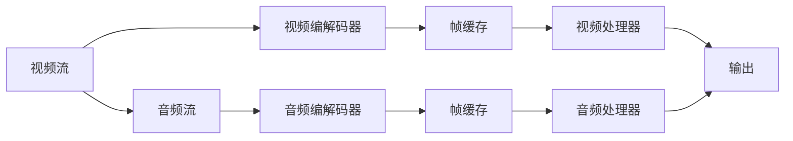

                 

# FFmpeg 视频编辑：裁剪和合并视频片段

> 关键词：FFmpeg, 视频编辑, 裁剪, 合并, 命令行工具, 视频处理

## 1. 背景介绍

在数字媒体的海洋中，视频资源占据了相当重要的地位。无论是娱乐、教育还是商业宣传，视频内容都能以其生动直观的方式吸引观众的注意力。然而，对于大量的视频素材，其制作和编辑过程常常需要耗费大量时间和资源。尤其在需要对视频进行裁剪和合并操作时，传统的视频编辑软件可能会显得不够灵活和高效。

FFmpeg作为一款开源且功能强大的命令行工具，能够快速高效地对视频进行各种编辑操作。通过FFmpeg，用户可以轻松进行视频片段的裁剪、合并、转换等操作，使得视频编辑变得更加高效和灵活。

本文章将详细介绍FFmpeg的基本概念、核心算法，并通过一系列实例来展示如何在实际中应用这些技术，并对相关的操作进行详细讲解。

## 2. 核心概念与联系

### 2.1 核心概念概述

FFmpeg是一款开源的跨平台多媒体框架，其主要功能包括音视频转换、编辑、复用、流化、提取等。它支持几乎所有的音频、视频、图片、字幕格式，并且可以方便地进行视频流数据的解码和编码。

在视频编辑中，FFmpeg常用于以下核心操作：

- **裁剪(Cropping)**：从一个视频中提取指定区域的视频片段。
- **合并(Merging)**：将多个视频片段拼接成一个连续的视频。
- **剪辑(Trimming)**：在视频开头或结尾添加或删除视频片段。
- **转换(Conversion)**：将视频格式转换为其他格式或分辨率。

这些操作需要理解视频流的结构和基本的音视频编解码原理。

### 2.2 核心概念原理和架构的 Mermaid 流程图



在这个流程图中，我们可以看到FFmpeg的基本架构。输入的视频和音频流经过编解码器转换为帧缓存，再由视频处理器和音频处理器进行裁剪、合并、剪辑等操作，最终生成输出。

## 3. 核心算法原理 & 具体操作步骤

### 3.1 算法原理概述

FFmpeg中处理视频流的基本算法原理包括视频编解码、帧处理、码率控制等。其中，视频流的裁剪和合并操作主要基于以下算法：

- **视频编解码算法**：将原始视频流解压缩，并生成独立的帧，以便进行操作。
- **帧处理算法**：在生成的帧序列中，通过选取指定帧来提取或合并视频片段。

### 3.2 算法步骤详解

以裁剪和合并为例，下面将详细介绍这两个操作的具体步骤：

#### 3.2.1 视频裁剪操作

**步骤1**：使用FFmpeg的`-vf`选项指定裁剪的区域。例如，从第5秒到第15秒，裁剪视频：
```bash
ffmpeg -i input.mp4 -vf 'crop=in=0:5-15:0-400x400' output.mp4
```

**步骤2**：解析`-vf`选项中的参数。`crop`表示裁剪操作，`in`表示起始帧，`out`表示结束帧，`out`表示目标尺寸。

**步骤3**：执行裁剪操作，并将结果保存为输出文件。

#### 3.2.2 视频合并操作

**步骤1**：使用FFmpeg的`-vf`选项指定合并的多个视频流。例如，将两个视频文件合并：
```bash
ffmpeg -i video1.mp4 -i video2.mp4 -vf 'overlay=x=50:y=50' output.mp4
```

**步骤2**：解析`-vf`选项中的参数。`overlay`表示叠加操作，`x`表示水平偏移量，`y`表示垂直偏移量。

**步骤3**：执行叠加操作，并将结果保存为输出文件。

### 3.3 算法优缺点

**优点**：

- **灵活性高**：FFmpeg支持几乎所有的视频格式和编码方式，能够进行各种复杂的编辑操作。
- **高效性**：相比于传统的视频编辑软件，FFmpeg的命令行操作能够快速完成大规模视频编辑任务。
- **免费开源**：FFmpeg是一个免费开源的软件，可以免费使用并修改源代码，适用于各种规模的项目。

**缺点**：

- **学习曲线陡峭**：由于其功能强大，操作繁琐，新手用户可能难以掌握。
- **命令行操作**：对于不熟悉命令行界面的用户，操作效率较低。
- **图形界面缺乏**：没有像其他视频编辑软件那样的图形界面，对于习惯图形界面的用户来说可能不够直观。

### 3.4 算法应用领域

FFmpeg不仅适用于专业视频编辑，也广泛应用于各种场景中，包括但不限于：

- **制作教育视频**：将多个教学片段剪辑成连续的视频，方便观众学习。
- **生成宣传视频**：将不同的宣传素材拼接成一个连续的视频，提高广告效果。
- **处理监控视频**：裁剪出关键时间段的监控视频片段，方便分析处理。
- **创建影片预告片**：将电影中的关键片段进行裁剪和合并，生成吸引人的预告片。

## 4. 数学模型和公式 & 详细讲解 & 举例说明

### 4.1 数学模型构建

在视频编辑中，裁剪和合并操作主要涉及以下数学模型：

- **视频帧选择模型**：用于确定从原始视频流中选择哪些帧进行操作。
- **视频流叠加模型**：用于确定两个视频流在时间轴上的位置关系。

### 4.2 公式推导过程

以视频裁剪为例，假设原始视频流长度为$T$秒，裁剪区域从$t$秒开始，持续时间为$T'$秒，裁剪后输出的视频长度为$T''$秒。

**公式1**：
$$ T'' = T' - (t - 0) $$
其中，$t$为起始时间，$T'$为时间长度，$T''$为输出长度。

**公式2**：
$$ \text{总帧数} = \frac{T}{\text{帧率}} $$
其中，帧率为视频流的帧数每秒。

**公式3**：
$$ \text{输出帧数} = \frac{T''}{\text{帧率}} $$
其中，输出帧数为输出视频中的帧数。

### 4.3 案例分析与讲解

假设原始视频流帧率为30fps，视频总长度为60秒，需要从第5秒到第15秒进行裁剪。

根据公式1，输出视频长度为：
$$ T'' = 15 - 5 = 10 \text{秒} $$

根据公式2和公式3，可以计算出原始总帧数和输出帧数，进行具体操作时，只需从原始视频流中选取对应帧数即可。

## 5. 项目实践：代码实例和详细解释说明

### 5.1 开发环境搭建

要使用FFmpeg进行视频编辑，首先需要安装FFmpeg软件。在Linux系统中，可以使用以下命令安装：

```bash
sudo apt-get install ffmpeg
```

在Windows系统中，可以从FFmpeg官网下载安装包，并按照说明进行安装。

### 5.2 源代码详细实现

以视频裁剪和合并为例，以下是详细的命令行操作：

#### 5.2.1 视频裁剪操作

**代码示例1**：
```bash
ffmpeg -i input.mp4 -vf 'crop=in=0:5-15:0-400x400' output.mp4
```

**代码解释**：
- `-i input.mp4`：输入文件为`input.mp4`。
- `-vf`：指定视频滤镜，`crop`表示裁剪操作。
- `in=0:5-15:0-400x400`：表示从第5秒到第15秒，裁剪宽度和高度为400像素。

#### 5.2.2 视频合并操作

**代码示例2**：
```bash
ffmpeg -i video1.mp4 -i video2.mp4 -vf 'overlay=x=50:y=50' output.mp4
```

**代码解释**：
- `-i video1.mp4 -i video2.mp4`：输入两个视频文件，分别为`video1.mp4`和`video2.mp4`。
- `-vf`：指定视频滤镜，`overlay`表示叠加操作。
- `x=50:y=50`：表示两个视频在水平和垂直方向上的偏移量。

### 5.3 代码解读与分析

FFmpeg的命令行操作简单易懂，但其复杂操作通常需要使用详细的参数组合。下面对一些常见参数进行解读：

**常见参数**：

- `-i`：指定输入文件。
- `-vi`：指定视频流，`-i`只针对整个视频文件。
- `-vf`：指定视频滤镜，支持多种滤镜操作，如裁剪、旋转、缩放等。
- `-f`：指定输出格式，如`mp4`、`mkv`等。
- `-t`：指定输出视频长度，超出部分将被删除。

## 6. 实际应用场景

FFmpeg在实际应用中广泛应用于各种场景，以下是几个典型的应用场景：

### 6.1 教育视频制作

教育视频的制作需要高质量的视频剪辑，使用FFmpeg可以轻松裁剪出关键教学片段，并进行拼接和剪辑，生成高质量的教学视频。例如，将多个教学片段拼接成一个连续的视频，便于学生学习和理解。

### 6.2 宣传视频制作

宣传视频通常需要将多个不同的素材拼接成一个连续的视频，以提高广告效果。使用FFmpeg可以快速高效地完成这一操作，并添加各种特效和滤镜，使宣传视频更具吸引力。

### 6.3 监控视频处理

在监控视频处理中，需要对关键时间段的监控视频进行裁剪和处理。使用FFmpeg可以裁剪出关键时间段的监控视频片段，方便后续的分析和处理。

### 6.4 影片预告片制作

在电影制作中，预告片通常需要将电影的多个关键片段进行裁剪和合并，以吸引观众的注意。使用FFmpeg可以轻松完成这一操作，并添加各种特效和滤镜，使预告片更具吸引力。

## 7. 工具和资源推荐

### 7.1 学习资源推荐

要掌握FFmpeg的使用，可以参考以下学习资源：

- **FFmpeg官网**：官方文档详细介绍了FFmpeg的各种功能和使用示例。
- **FFmpeg教程**：通过在线教程学习FFmpeg的基本操作和高级功能。
- **YouTube教程**：YouTube上有大量FFmpeg的视频教程，适合初学者学习。

### 7.2 开发工具推荐

- **FFmpeg官网**：下载最新版本的FFmpeg软件，并根据需要进行安装。
- **Linux系统**：大多数Linux发行版都预装了FFmpeg，可以直接使用。
- **Windows系统**：从FFmpeg官网下载安装包，并按照说明进行安装。

### 7.3 相关论文推荐

- **FFmpeg论文**：介绍FFmpeg的基本原理和应用。
- **视频编辑技术论文**：介绍视频编辑的基本技术和FFmpeg的应用实例。

## 8. 总结：未来发展趋势与挑战

### 8.1 未来发展趋势

随着视频编辑需求的不断增加，FFmpeg将迎来更多的改进和优化，其未来发展趋势主要体现在以下几个方面：

1. **功能扩展**：FFmpeg将继续增加更多的功能和滤镜，支持更多的视频格式和编解码方式。
2. **性能提升**：随着硬件性能的提升，FFmpeg将进一步优化视频处理速度，提高用户体验。
3. **跨平台支持**：FFmpeg将进一步完善跨平台支持，支持更多操作系统和硬件设备。

### 8.2 面临的挑战

尽管FFmpeg已经成为了视频编辑的标准工具，但其仍面临以下挑战：

1. **命令行操作复杂**：对于新手用户，命令行的操作较为繁琐，需要一定的学习成本。
2. **图形界面缺乏**：FFmpeg没有图形界面，对于习惯图形界面的用户来说可能不够直观。
3. **插件支持有限**：FFmpeg的插件支持相对较少，对于需要高级编辑的用户来说可能不够方便。

### 8.3 研究展望

未来，FFmpeg的发展方向将继续围绕以下几个方面展开：

1. **图形界面支持**：增加图形界面，提高用户的使用体验。
2. **插件生态建设**：增加更多插件支持，扩展FFmpeg的功能。
3. **跨平台优化**：进一步优化跨平台支持，提高FFmpeg的适用范围。

## 9. 附录：常见问题与解答

### Q1: 如何裁剪视频片段？

**A1**：使用FFmpeg的`-crop`参数指定裁剪区域，将裁剪后的视频保存为输出文件。例如，从第5秒到第15秒，裁剪视频：
```bash
ffmpeg -i input.mp4 -vf 'crop=in=0:5-15:0-400x400' output.mp4
```

### Q2: 如何合并多个视频文件？

**A2**：使用FFmpeg的`-ffmpeg`参数将多个视频文件拼接成一个连续的视频。例如，将两个视频文件合并：
```bash
ffmpeg -i video1.mp4 -i video2.mp4 -vf 'overlay=x=50:y=50' output.mp4
```

### Q3: 如何进行视频剪辑？

**A3**：使用FFmpeg的`-trim`参数在视频开头或结尾添加或删除视频片段。例如，在视频开头添加5秒的视频片段：
```bash
ffmpeg -i input.mp4 -trim 00:00:05 -c copy output.mp4
```

通过以上详细讲解，相信读者已经对FFmpeg的视频编辑功能有了较为全面的了解。FFmpeg不仅能够快速高效地完成各种视频编辑任务，还能够适应不同的操作系统和硬件设备。未来，随着技术的不断进步，FFmpeg将继续在视频编辑领域发挥重要作用，为用户带来更多便利和高效。

---

作者：禅与计算机程序设计艺术 / Zen and the Art of Computer Programming

