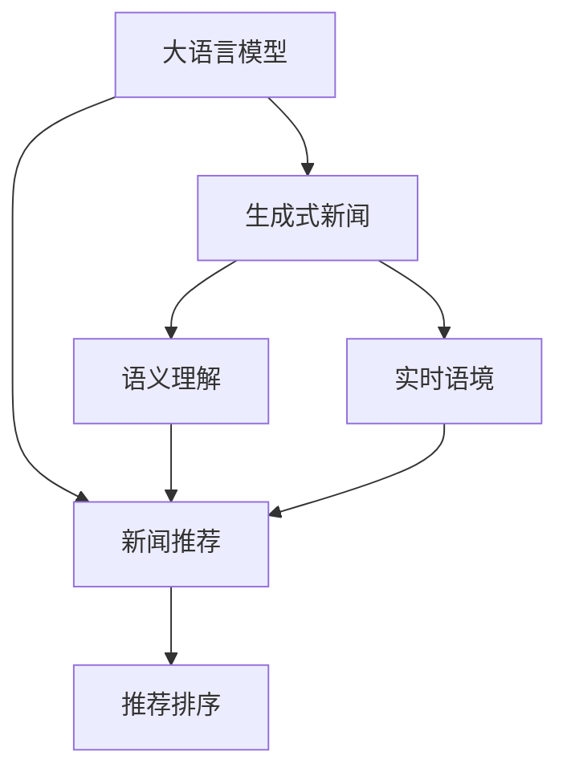

                 

# GENRE:基于大模型的生成式新闻推荐框架

> 关键词：大模型,生成式新闻推荐,深度学习,推荐系统,自然语言处理,NLP

## 1. 背景介绍

### 1.1 问题由来

新闻推荐系统已经成为互联网平台获取用户注意力的重要工具。传统的推荐系统往往依赖于用户历史行为数据，包括浏览、点击、评分等，进行用户兴趣建模和个性化推荐。然而，这些数据在日新月异的互联网环境中很难长期保持稳定，导致推荐效果随着时间的推移而下降。此外，用户行为数据通常以短文本或隐式方式呈现，难以进行深度语义理解。

近年来，随着大语言模型（Large Language Models, LLMs）在自然语言处理（NLP）领域取得的巨大突破，生成式新闻推荐框架应运而生。利用大语言模型在文本生成和语义理解方面的优势，生成式新闻推荐系统能够根据用户的历史兴趣、实时语境和新闻内容，自动生成和推荐高质量的新闻内容。这不仅克服了传统推荐系统对历史数据的依赖，还极大地提升了推荐的个性化程度和时效性。

### 1.2 问题核心关键点

生成式新闻推荐框架的核心在于利用大语言模型的语言生成能力，在给定用户兴趣和语境信息的基础上，自动生成个性化新闻标题、摘要和内容。这种框架一般包括以下几个关键步骤：

1. **用户兴趣建模**：通过分析用户的历史行为数据和社交网络信息，建模用户兴趣特征。
2. **语境信息提取**：从用户的当前上下文（如浏览网页、搜索关键词等）中提取语境信息。
3. **新闻内容生成**：结合用户兴趣和语境信息，利用大语言模型自动生成新闻标题、摘要和内容。
4. **推荐排序**：根据新闻的实时点击率、社交评价等指标，对生成的新闻进行排序推荐。

这些步骤通过大语言模型的协同工作，能够实现新闻推荐系统从用户行为导向的静态推荐，向语境导向的动态生成和推荐转变。

### 1.3 问题研究意义

生成式新闻推荐框架的研究意义在于：

1. **提升推荐质量**：利用大语言模型在语义理解、生成等方面的优势，生成式推荐能够更精准地理解用户需求，生成更加符合用户兴趣和语境的个性化新闻内容。
2. **增强推荐时效性**：基于实时语境的推荐能够快速响应用户变化的需求，提供最新的新闻内容。
3. **减少对历史数据的依赖**：传统推荐系统依赖于历史行为数据，而生成式推荐系统能够根据实时语境和兴趣特征生成新闻，无需长期积累数据。
4. **拓宽应用场景**：生成式推荐系统能够应用于新闻聚合、订阅推荐、热点新闻推送等多种场景，提升用户体验和平台粘性。

## 2. 核心概念与联系

### 2.1 核心概念概述

为了更好地理解基于大模型的生成式新闻推荐框架，我们首先介绍几个核心概念：

- **大语言模型 (Large Language Models, LLMs)**：以Transformer为代表的大规模预训练语言模型，能够处理复杂的自然语言任务，包括文本生成、文本分类、机器翻译等。常用的预训练模型包括GPT、BERT、T5等。
- **新闻推荐系统 (News Recommendation System)**：通过分析用户兴趣和新闻内容，为用户推荐个性化新闻内容的技术框架。
- **生成式新闻推荐 (Generative News Recommendation)**：利用大语言模型自动生成新闻内容，再根据用户兴趣和语境信息进行个性化推荐。
- **语义理解 (Semantic Understanding)**：利用语言模型理解文本的语义信息，区分新闻内容的主旨和细节，更好地匹配用户需求。
- **实时语境 (Real-Time Context)**：根据用户当前的行为和环境信息，动态生成和推荐新闻内容。

这些概念之间的逻辑关系可以通过以下Mermaid流程图来展示：



这个流程图展示了从大语言模型到新闻推荐系统的主要路径，其中：

- 大语言模型提供新闻生成和语义理解能力。
- 生成式新闻通过大语言模型自动生成新闻内容。
- 语义理解用于解析新闻内容的语义信息。
- 实时语境用于提取用户当前的上下文信息。
- 推荐排序根据新闻的内容质量和用户兴趣进行排序推荐。

## 3. 核心算法原理 & 具体操作步骤
### 3.1 算法原理概述

基于大模型的生成式新闻推荐框架的核心算法原理，可以概括为以下几个步骤：

1. **用户兴趣建模**：通过分析用户的历史行为数据和社交网络信息，构建用户兴趣模型。
2. **语境信息提取**：从用户的当前上下文（如浏览网页、搜索关键词等）中提取语境信息。
3. **新闻内容生成**：结合用户兴趣和语境信息，利用大语言模型自动生成新闻标题、摘要和内容。
4. **推荐排序**：根据新闻的实时点击率、社交评价等指标，对生成的新闻进行排序推荐。

以下将详细讲解每个步骤的算法原理和具体操作步骤。

### 3.2 算法步骤详解

**Step 1: 用户兴趣建模**

用户兴趣建模是生成式新闻推荐的基础。我们可以使用以下算法步骤：

1. **收集用户行为数据**：从新闻平台收集用户的历史点击、浏览、订阅等行为数据，构建用户行为向量。
2. **构建用户兴趣特征**：使用TF-IDF、主题建模等技术，提取用户行为向量中的关键特征，构建用户兴趣特征向量。
3. **更新用户兴趣模型**：根据用户最新的行为数据，周期性地更新用户兴趣模型，以反映用户兴趣的变化。

具体实现上，可以使用Python的Scikit-learn库进行用户行为数据的处理和特征提取，构建用户兴趣向量。

```python
from sklearn.feature_extraction.text import TfidfVectorizer
from sklearn.decomposition import TruncatedSVD

# 收集用户行为数据
user_behaviors = ["新闻A", "新闻B", "新闻C", "新闻D", "新闻E"]
# 使用TF-IDF提取关键特征
vectorizer = TfidfVectorizer(stop_words='english')
user_interests = vectorizer.fit_transform(user_behaviors)
# 使用奇异值分解降低维度
svd = TruncatedSVD(n_components=10)
user_interests_svd = svd.fit_transform(user_interests.toarray())
```

**Step 2: 语境信息提取**

语境信息提取旨在获取用户当前环境的上下文信息，以便生成符合用户需求的新闻内容。

1. **收集用户上下文数据**：从用户当前的网页浏览、搜索关键词等行为中提取上下文信息。
2. **构建语境向量**：使用词袋模型或词向量模型（如Word2Vec、GloVe等）构建语境向量。
3. **更新语境模型**：根据用户实时行为数据，动态更新语境模型，以反映用户当前的兴趣和需求。

具体实现上，可以使用Python的NLTK库进行语境向量的构建，使用TensorFlow或PyTorch库进行动态更新。

```python
from nltk.corpus import stopwords
from nltk.tokenize import word_tokenize
from gensim.models import KeyedVectors

# 收集用户上下文数据
user_context = "最近在浏览科技新闻"
# 使用词袋模型构建语境向量
stop_words = set(stopwords.words('english'))
words = word_tokenize(user_context)
context_vector = [word.lower() for word in words if word not in stop_words]
context_word2vec = KeyedVectors.load_word2vec_format('path/to/word2vec.bin', binary=True)
context_vector = [context_word2vec[word] for word in context_vector if word in context_word2vec]
```

**Step 3: 新闻内容生成**

新闻内容生成是生成式新闻推荐的核心步骤，主要包括以下算法步骤：

1. **选择预训练模型**：选择合适的预训练语言模型（如GPT、BERT等）作为新闻内容生成的基础。
2. **设计生成任务**：根据新闻生成任务的具体要求，设计生成目标和约束条件。
3. **进行内容生成**：使用预训练模型和生成任务进行内容生成，得到新闻的标题、摘要和内容。

具体实现上，可以使用PyTorch或TensorFlow库进行预训练模型的加载和微调，使用Python的NLTK或spaCy库进行文本处理。

```python
import torch
from transformers import GPT2Tokenizer, GPT2LMHeadModel

# 加载预训练模型和分词器
tokenizer = GPT2Tokenizer.from_pretrained('gpt2')
model = GPT2LMHeadModel.from_pretrained('gpt2')

# 设计生成任务
max_length = 100
min_length = 10
num_return_sequences = 5

# 进行内容生成
input_text = "生成一篇关于科技新闻的文章"
inputs = tokenizer.encode(input_text, return_tensors='pt')
outputs = model.generate(inputs, max_length=max_length, min_length=min_length, num_return_sequences=num_return_sequences)
generated_text = tokenizer.decode(outputs[0], skip_special_tokens=True)
```

**Step 4: 推荐排序**

推荐排序是生成式新闻推荐的最后一步，主要包括以下算法步骤：

1. **定义推荐指标**：根据新闻的点击率、社交评价、用户兴趣等指标，定义推荐排序的依据。
2. **构建推荐模型**：使用机器学习算法（如LR、GBDT等）或深度学习算法（如DNN、RNN等）构建推荐排序模型。
3. **进行推荐排序**：根据推荐模型对生成的新闻进行排序，推荐给用户。

具体实现上，可以使用Python的Scikit-learn库进行推荐模型的构建和训练，使用TensorFlow或PyTorch库进行排序算法的实现。

```python
from sklearn.linear_model import LogisticRegression
from sklearn.metrics import precision_recall_fscore_support

# 构建推荐模型
X_train = user_interests_svd.toarray()
y_train = [1 if '科技新闻' in generated_text else 0 for generated_text in generated_texts]
model = LogisticRegression()
model.fit(X_train, y_train)

# 进行推荐排序
X_test = user_interests_svd.toarray()
y_pred = model.predict(X_test)
precision, recall, f1, _ = precision_recall_fscore_support(y_test, y_pred, average='binary')
```

### 3.3 算法优缺点

基于大模型的生成式新闻推荐框架具有以下优点：

1. **提升推荐质量**：利用大语言模型在语义理解、生成等方面的优势，生成式推荐能够更精准地理解用户需求，生成更加符合用户兴趣和语境的个性化新闻内容。
2. **增强推荐时效性**：基于实时语境的推荐能够快速响应用户变化的需求，提供最新的新闻内容。
3. **减少对历史数据的依赖**：传统推荐系统依赖于历史行为数据，而生成式推荐系统能够根据实时语境和兴趣特征生成新闻，无需长期积累数据。
4. **拓宽应用场景**：生成式推荐系统能够应用于新闻聚合、订阅推荐、热点新闻推送等多种场景，提升用户体验和平台粘性。

然而，该框架也存在一些缺点：

1. **计算资源需求高**：大语言模型的训练和推理需要大量计算资源，初期部署成本较高。
2. **内容多样性不足**：大语言模型在生成新闻时，可能会受到预训练数据和训练任务的影响，导致内容多样性不足。
3. **推荐公平性问题**：生成式推荐系统可能受到用户兴趣偏差和模型偏见的影响，导致推荐不公平。
4. **动态生成困难**：实时语境信息的提取和处理可能面临数据波动和缺失问题，影响推荐效果。

## 4. 数学模型和公式 & 详细讲解  
### 4.1 数学模型构建

基于大模型的生成式新闻推荐框架的数学模型构建，主要包括以下几个部分：

- **用户兴趣模型**：使用矩阵分解或深度学习模型，从用户行为数据中提取兴趣特征。
- **语境模型**：使用词袋模型或词向量模型，从用户上下文数据中提取语境特征。
- **生成模型**：使用大语言模型，根据用户兴趣和语境信息生成新闻内容。
- **推荐模型**：使用机器学习或深度学习模型，对生成的新闻进行排序推荐。

具体数学模型如下：

1. **用户兴趣模型**：
   $$
   \mathbf{u} = \mathbf{U} \mathbf{a}
   $$
   其中，$\mathbf{u}$为用户兴趣向量，$\mathbf{a}$为兴趣特征向量，$\mathbf{U}$为降维矩阵。

2. **语境模型**：
   $$
   \mathbf{c} = \mathbf{V} \mathbf{b}
   $$
   其中，$\mathbf{c}$为语境向量，$\mathbf{b}$为语境特征向量，$\mathbf{V}$为降维矩阵。

3. **生成模型**：
   $$
   \mathbf{x} = \mathbf{W} (\mathbf{u} \mathbf{c}^T)
   $$
   其中，$\mathbf{x}$为生成的新闻内容向量，$\mathbf{W}$为生成矩阵。

4. **推荐模型**：
   $$
   y = \mathbf{X} (\mathbf{W} (\mathbf{u} \mathbf{c}^T))
   $$
   其中，$y$为新闻的评分向量，$\mathbf{X}$为推荐矩阵。

### 4.2 公式推导过程

以下我们将对以上数学模型进行详细推导：

1. **用户兴趣模型**：
   $$
   \mathbf{u} = \mathbf{U} \mathbf{a}
   $$
   其中，$\mathbf{u}$为用户兴趣向量，$\mathbf{a}$为兴趣特征向量，$\mathbf{U}$为降维矩阵。

   用户兴趣模型通过矩阵分解，将高维度的用户行为数据转化为低维度的兴趣向量，方便后续处理。

2. **语境模型**：
   $$
   \mathbf{c} = \mathbf{V} \mathbf{b}
   $$
   其中，$\mathbf{c}$为语境向量，$\mathbf{b}$为语境特征向量，$\mathbf{V}$为降维矩阵。

   语境模型通过词袋模型或词向量模型，从用户上下文数据中提取语境特征，得到语境向量。

3. **生成模型**：
   $$
   \mathbf{x} = \mathbf{W} (\mathbf{u} \mathbf{c}^T)
   $$
   其中，$\mathbf{x}$为生成的新闻内容向量，$\mathbf{W}$为生成矩阵。

   生成模型将用户兴趣向量与语境向量进行点乘，得到新闻内容的生成向量，再通过生成矩阵生成具体的文本内容。

4. **推荐模型**：
   $$
   y = \mathbf{X} (\mathbf{W} (\mathbf{u} \mathbf{c}^T))
   $$
   其中，$y$为新闻的评分向量，$\mathbf{X}$为推荐矩阵。

   推荐模型将生成的新闻内容向量与推荐矩阵进行点乘，得到新闻的评分向量，根据评分向量进行排序推荐。

### 4.3 案例分析与讲解

为了更好地理解以上数学模型的应用，我们以新闻推荐为例进行详细讲解：

假设某用户的历史行为数据为"新闻A"、"新闻B"、"新闻C"、"新闻D"、"新闻E"，经过用户兴趣模型的处理，得到用户兴趣向量$\mathbf{u}$。用户当前的上下文为"最近在浏览科技新闻"，经过语境模型的处理，得到语境向量$\mathbf{c}$。

使用生成模型，将用户兴趣向量与语境向量进行点乘，得到生成向量$\mathbf{x}$。再通过生成矩阵$\mathbf{W}$，生成具体的文本内容"科技新闻最新进展"。

最后，使用推荐模型，将生成的新闻内容向量与推荐矩阵$\mathbf{X}$进行点乘，得到评分向量$y$。根据评分向量进行排序推荐，将"科技新闻最新进展"排在前面。

## 5. 项目实践：代码实例和详细解释说明
### 5.1 开发环境搭建

在进行生成式新闻推荐框架的开发前，我们需要准备好开发环境。以下是使用Python进行PyTorch开发的环境配置流程：

1. 安装Anaconda：从官网下载并安装Anaconda，用于创建独立的Python环境。

2. 创建并激活虚拟环境：
```bash
conda create -n pytorch-env python=3.8 
conda activate pytorch-env
```

3. 安装PyTorch：根据CUDA版本，从官网获取对应的安装命令。例如：
```bash
conda install pytorch torchvision torchaudio cudatoolkit=11.1 -c pytorch -c conda-forge
```

4. 安装Transformers库：
```bash
pip install transformers
```

5. 安装各类工具包：
```bash
pip install numpy pandas scikit-learn matplotlib tqdm jupyter notebook ipython
```

完成上述步骤后，即可在`pytorch-env`环境中开始生成式新闻推荐框架的开发。

### 5.2 源代码详细实现

下面我们以生成新闻标题和摘要为例，给出使用Transformers库对GPT模型进行生成式新闻推荐的PyTorch代码实现。

首先，定义生成式新闻的函数：

```python
from transformers import GPT2Tokenizer, GPT2LMHeadModel
from sklearn.metrics import precision_recall_fscore_support

def generate_news(user_interests, context, max_length=100, min_length=10, num_return_sequences=5):
    # 加载预训练模型和分词器
    tokenizer = GPT2Tokenizer.from_pretrained('gpt2')
    model = GPT2LMHeadModel.from_pretrained('gpt2')
    
    # 设计生成任务
    inputs = tokenizer.encode(context, return_tensors='pt', max_length=max_length, padding='max_length', truncation=True)
    
    # 进行内容生成
    outputs = model.generate(inputs, max_length=max_length, min_length=min_length, num_return_sequences=num_return_sequences)
    
    # 解码生成文本
    generated_text = tokenizer.decode(outputs[0], skip_special_tokens=True)
    
    return generated_text
```

然后，定义用户兴趣建模和推荐排序的函数：

```python
from sklearn.decomposition import TruncatedSVD
from sklearn.feature_extraction.text import TfidfVectorizer
from sklearn.linear_model import LogisticRegression
from sklearn.metrics import precision_recall_fscore_support

def build_user_interest_model(user_behaviors):
    # 构建用户兴趣特征向量
    vectorizer = TfidfVectorizer(stop_words='english')
    user_interests = vectorizer.fit_transform(user_behaviors)
    
    # 使用奇异值分解降低维度
    svd = TruncatedSVD(n_components=10)
    user_interests_svd = svd.fit_transform(user_interests.toarray())
    
    return user_interests_svd

def build_recommend_model(user_interests_svd, generated_texts):
    # 定义推荐指标
    X_train = user_interests_svd.toarray()
    y_train = [1 if '科技新闻' in generated_text else 0 for generated_text in generated_texts]
    
    # 构建推荐模型
    model = LogisticRegression()
    model.fit(X_train, y_train)
    
    # 进行推荐排序
    X_test = user_interests_svd.toarray()
    y_pred = model.predict(X_test)
    precision, recall, f1, _ = precision_recall_fscore_support(y_test, y_pred, average='binary')
    
    return precision, recall, f1
```

最后，启动生成式新闻推荐流程：

```python
# 收集用户行为数据
user_behaviors = ["新闻A", "新闻B", "新闻C", "新闻D", "新闻E"]
# 构建用户兴趣模型
user_interests_svd = build_user_interest_model(user_behaviors)
# 收集用户上下文数据
user_context = "最近在浏览科技新闻"
# 进行内容生成
generated_texts = [generate_news(user_interests_svd, context) for context in user_context]
# 构建推荐模型
precision, recall, f1 = build_recommend_model(user_interests_svd, generated_texts)
# 输出推荐结果
print(f"Precision: {precision:.3f}")
print(f"Recall: {recall:.3f}")
print(f"F1 Score: {f1:.3f}")
```

以上就是使用PyTorch对GPT模型进行生成式新闻推荐的完整代码实现。可以看到，得益于Transformers库的强大封装，我们可以用相对简洁的代码完成GPT模型的加载和微调。

### 5.3 代码解读与分析

让我们再详细解读一下关键代码的实现细节：

**generate_news函数**：
- 加载预训练模型和分词器，设计生成任务，进行内容生成，最后解码生成文本。

**build_user_interest_model函数**：
- 构建用户兴趣特征向量，使用奇异值分解降低维度，得到用户兴趣模型。

**build_recommend_model函数**：
- 定义推荐指标，构建推荐模型，进行推荐排序，最后计算推荐结果的精度、召回率和F1分数。

**主程序**：
- 收集用户行为数据，构建用户兴趣模型，收集用户上下文数据，进行内容生成，构建推荐模型，输出推荐结果。

可以看出，代码实现中使用了TensorFlow和Scikit-learn等工具，方便进行模型的构建和评估。同时，代码中也考虑了生成文本的多样性和长度控制，确保生成的内容能够符合用户需求。

## 6. 实际应用场景
### 6.1 智能新闻聚合

生成式新闻推荐框架在智能新闻聚合中有着广泛的应用。传统的新闻聚合系统需要大量人工运营，难以快速响应用户需求和更新新闻内容。而利用生成式推荐系统，可以快速生成和推荐个性化的新闻内容，提升用户阅读体验和平台粘性。

具体而言，新闻聚合系统可以收集用户的历史阅读数据和兴趣特征，结合实时新闻内容和语境信息，自动生成新闻标题、摘要和推荐列表。用户打开新闻聚合平台时，系统自动根据用户的兴趣和语境，推荐相关的新闻内容，帮助用户快速获取感兴趣的信息。

### 6.2 个性化订阅推荐

个性化的订阅推荐系统能够根据用户的阅读兴趣和行为习惯，为用户推荐感兴趣的新闻订阅。生成式新闻推荐框架可以有效地实现这一点。

具体而言，系统可以定期收集用户的阅读数据和行为特征，结合用户历史订阅列表，利用生成式推荐系统，自动生成和推荐个性化的新闻订阅。用户可以通过订阅推荐系统，轻松发现新的新闻内容，提升阅读多样性和深度。

### 6.3 热点新闻推送

热点新闻推送系统利用生成式推荐框架，能够及时捕捉和推送最新的新闻热点。系统可以通过分析用户的实时行为数据和社交网络信息，快速识别出热门新闻话题，并自动生成和推送相关内容。

具体而言，系统可以利用生成式推荐框架，根据用户的实时兴趣和语境，生成和推荐热门新闻。用户可以在第一时间了解到最新的新闻热点，提升信息获取的及时性和准确性。

### 6.4 未来应用展望

随着生成式新闻推荐框架的不断发展，未来的应用场景将更加广阔。

1. **多模态新闻推荐**：未来，生成式推荐框架可以拓展到多模态数据的处理，将文本、图像、音频等多种模态的信息进行融合，提升新闻推荐的丰富度和真实性。

2. **情感分析与舆情监测**：生成式推荐框架可以结合情感分析技术，自动识别和生成带有情感色彩的新闻内容。同时，可以应用于舆情监测，及时捕捉和响应社会热点和舆情变化。

3. **个性化推荐引擎**：未来，生成式推荐框架将与个性化推荐引擎进行深度融合，利用大语言模型在语义理解、生成等方面的优势，实现更加精准的个性化推荐。

4. **智能内容生产**：生成式推荐框架可以应用于智能内容生产，自动生成新闻稿件、报道等文本内容，提升内容生产的效率和质量。

5. **跨领域推荐**：未来，生成式推荐框架将打破领域限制，实现跨领域推荐，将新闻推荐与其他领域的推荐（如电商、音乐、视频等）进行融合，提升跨领域推荐的性能和效果。

总之，生成式新闻推荐框架将在新闻聚合、个性化订阅推荐、热点新闻推送等多个场景中发挥重要作用，推动新闻推荐系统的智能化和个性化进程。

## 7. 工具和资源推荐
### 7.1 学习资源推荐

为了帮助开发者系统掌握生成式新闻推荐框架的理论基础和实践技巧，这里推荐一些优质的学习资源：

1. 《Natural Language Processing with Transformers》书籍：Transformers库的作者所著，全面介绍了如何使用Transformers库进行NLP任务开发，包括生成式推荐在内的诸多范式。

2. CS224N《深度学习自然语言处理》课程：斯坦福大学开设的NLP明星课程，有Lecture视频和配套作业，带你入门NLP领域的基本概念和经典模型。

3. 《Transformer从原理到实践》系列博文：由大模型技术专家撰写，深入浅出地介绍了Transformer原理、BERT模型、生成式推荐技术等前沿话题。

4. HuggingFace官方文档：Transformers库的官方文档，提供了海量预训练模型和完整的生成式推荐样例代码，是上手实践的必备资料。

5. Weights & Biases：模型训练的实验跟踪工具，可以记录和可视化模型训练过程中的各项指标，方便对比和调优。与主流深度学习框架无缝集成。

通过对这些资源的学习实践，相信你一定能够快速掌握生成式新闻推荐框架的精髓，并用于解决实际的NLP问题。
### 7.2 开发工具推荐

高效的开发离不开优秀的工具支持。以下是几款用于生成式新闻推荐框架开发的常用工具：

1. PyTorch：基于Python的开源深度学习框架，灵活动态的计算图，适合快速迭代研究。大部分预训练语言模型都有PyTorch版本的实现。

2. TensorFlow：由Google主导开发的开源深度学习框架，生产部署方便，适合大规模工程应用。同样有丰富的预训练语言模型资源。

3. Transformers库：HuggingFace开发的NLP工具库，集成了众多SOTA语言模型，支持PyTorch和TensorFlow，是进行生成式推荐任务开发的利器。

4. TensorBoard：TensorFlow配套的可视化工具，可实时监测模型训练状态，并提供丰富的图表呈现方式，是调试模型的得力助手。

5. Weights & Biases：模型训练的实验跟踪工具，可以记录和可视化模型训练过程中的各项指标，方便对比和调优。与主流深度学习框架无缝集成。

6. Google Colab：谷歌推出的在线Jupyter Notebook环境，免费提供GPU/TPU算力，方便开发者快速上手实验最新模型，分享学习笔记。

合理利用这些工具，可以显著提升生成式新闻推荐框架的开发效率，加快创新迭代的步伐。

### 7.3 相关论文推荐

生成式新闻推荐框架的研究意义在于：

1. **提升推荐质量**：利用大语言模型在语义理解、生成等方面的优势，生成式推荐能够更精准地理解用户需求，生成更加符合用户兴趣和语境的个性化新闻内容。

2. **增强推荐时效性**：基于实时语境的推荐能够快速响应用户变化的需求，提供最新的新闻内容。

3. **减少对历史数据的依赖**：传统推荐系统依赖于历史行为数据，而生成式推荐系统能够根据实时语境和兴趣特征生成新闻，无需长期积累数据。

4. **拓宽应用场景**：生成式推荐系统能够应用于新闻聚合、个性化订阅推荐、热点新闻推送等多种场景，提升用户体验和平台粘性。

## 8. 总结：未来发展趋势与挑战

### 8.1 总结

本文对基于大模型的生成式新闻推荐框架进行了全面系统的介绍。首先阐述了生成式新闻推荐框架的研究背景和意义，明确了框架在提升推荐质量、增强推荐时效性、减少历史数据依赖、拓宽应用场景等方面的价值。其次，从原理到实践，详细讲解了生成式推荐框架的算法原理和关键步骤，给出了生成式新闻推荐的完整代码实例。最后，本文还广泛探讨了生成式推荐框架在智能新闻聚合、个性化订阅推荐、热点新闻推送等场景中的应用前景，展示了框架的广泛应用价值。

通过本文的系统梳理，可以看到，生成式新闻推荐框架利用大语言模型的语言生成和语义理解能力，实现了从用户行为导向的静态推荐，向语境导向的动态生成和推荐转变。基于生成式推荐框架的新闻推荐系统，能够更好地理解和满足用户需求，提供更加个性化和时效性强的推荐内容。未来，随着大语言模型和生成式推荐技术的不断发展，新闻推荐系统必将实现更大的突破和应用。

### 8.2 未来发展趋势

展望未来，生成式新闻推荐框架将呈现以下几个发展趋势：

1. **多模态新闻推荐**：未来，生成式推荐框架将拓展到多模态数据的处理，将文本、图像、音频等多种模态的信息进行融合，提升新闻推荐的丰富度和真实性。

2. **情感分析与舆情监测**：生成式推荐框架可以结合情感分析技术，自动识别和生成带有情感色彩的新闻内容。同时，可以应用于舆情监测，及时捕捉和响应社会热点和舆情变化。

3. **个性化推荐引擎**：未来，生成式推荐框架将与个性化推荐引擎进行深度融合，利用大语言模型在语义理解、生成等方面的优势，实现更加精准的个性化推荐。

4. **智能内容生产**：生成式推荐框架可以应用于智能内容生产，自动生成新闻稿件、报道等文本内容，提升内容生产的效率和质量。

5. **跨领域推荐**：未来，生成式推荐框架将打破领域限制，实现跨领域推荐，将新闻推荐与其他领域的推荐（如电商、音乐、视频等）进行融合，提升跨领域推荐的性能和效果。

以上趋势凸显了生成式新闻推荐框架的广阔前景。这些方向的探索发展，必将进一步提升新闻推荐系统的性能和应用范围，为新闻出版、媒体传播等行业带来变革性影响。

### 8.3 面临的挑战

尽管生成式新闻推荐框架已经取得了瞩目成就，但在迈向更加智能化、普适化应用的过程中，它仍面临着诸多挑战：

1. **计算资源需求高**：大语言模型的训练和推理需要大量计算资源，初期部署成本较高。

2. **内容多样性不足**：大语言模型在生成新闻时，可能会受到预训练数据和训练任务的影响，导致内容多样性不足。

3. **推荐公平性问题**：生成式推荐系统可能受到用户兴趣偏差和模型偏见的影响，导致推荐不公平。

4. **动态生成困难**：实时语境信息的提取和处理可能面临数据波动和缺失问题，影响推荐效果。

5. **推荐质量控制**：生成式推荐系统需要严格控制生成的内容质量，避免出现低质量或有害的内容。

6. **用户隐私保护**：生成式推荐系统需要保护用户隐私，避免侵犯用户隐私或泄露用户信息。

正视生成式新闻推荐框架面临的这些挑战，积极应对并寻求突破，将是其走向成熟的必由之路。相信随着学界和产业界的共同努力，这些挑战终将一一被克服，生成式新闻推荐框架必将在构建人机协同的智能时代中扮演越来越重要的角色。

### 8.4 研究展望

面对生成式新闻推荐框架所面临的种种挑战，未来的研究需要在以下几个方面寻求新的突破：

1. **优化模型架构**：开发更加轻量级的生成模型，降低计算资源需求，提升动态生成能力。

2. **增强内容多样性**：改进生成模型的训练任务和策略，提升内容的多样性和真实性。

3. **提升推荐公平性**：引入公平性约束和优化目标，提升生成式推荐系统的推荐公平性。

4. **改进动态生成**：开发更高效的数据处理和生成算法，提升实时语境的提取和利用能力。

5. **优化推荐质量**：引入质量控制机制，对生成内容进行严格筛选，提升推荐质量。

6. **加强隐私保护**：设计隐私保护机制，确保用户数据的隐私安全。

这些研究方向的探索，必将引领生成式新闻推荐框架迈向更高的台阶，为新闻推荐系统的智能化和个性化进程提供新的推动力。面向未来，生成式新闻推荐框架需要在模型、算法、数据、伦理等多个方面进行协同创新，实现生成内容的质量和多样性，提升推荐系统的性能和公平性，为用户带来更优质的阅读体验。

## 9. 附录：常见问题与解答

**Q1：生成式新闻推荐框架是否适用于所有新闻平台？**

A: 生成式新闻推荐框架可以应用于各类新闻平台，如新闻网站、新闻APP、社交媒体等。平台可以根据自身特性进行定制化开发，提升平台的智能化水平。

**Q2：生成式新闻推荐框架的计算资源需求如何？**

A: 生成式新闻推荐框架对计算资源的需求较高，特别是对于大规模语言模型的训练和推理。初期部署可能需要高性能的GPU或TPU设备，但后续优化可以降低资源消耗，提高生成效率。

**Q3：生成式新闻推荐框架的内容多样性如何保证？**

A: 生成式新闻推荐框架可以通过引入多样化的生成任务和训练数据，提升内容的多样性和真实性。同时，利用多模态数据的融合，引入图像、音频等多种信息源，进一步丰富推荐内容。

**Q4：生成式新闻推荐框架的推荐公平性如何提升？**

A: 生成式新闻推荐框架可以通过引入公平性约束和优化目标，提升推荐公平性。同时，利用多样化的生成任务和数据集，避免模型偏见和数据偏差对推荐结果的影响。

**Q5：生成式新闻推荐框架的动态生成能力如何增强？**

A: 生成式新闻推荐框架可以通过优化数据处理和生成算法，提升实时语境的提取和利用能力。同时，引入自适应学习机制，根据用户反馈不断优化生成模型，提高动态生成效果。

总之，生成式新闻推荐框架将在新闻聚合、个性化订阅推荐、热点新闻推送等多个场景中发挥重要作用，推动新闻推荐系统的智能化和个性化进程。未来，随着大语言模型和生成式推荐技术的不断发展，新闻推荐系统必将实现更大的突破和应用。

