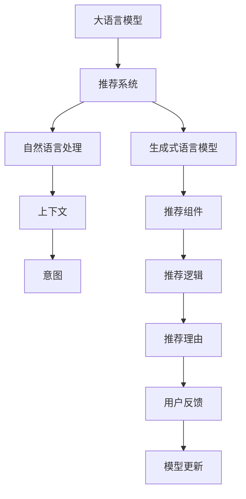

                 

# GENRE框架的灵活性与可配置性：LLM推荐的优势

## 1. 背景介绍

### 1.1 问题由来
推荐系统作为信息检索和知识发现的重要工具，在电商平台、视频网站、新闻平台、社交媒体等领域广泛应用。推荐算法能够从用户历史行为和兴趣偏好中挖掘出潜在需求，个性化地推送用户感兴趣的内容。然而，现有推荐算法大多基于静态用户画像和单一数据源，难以适应多变的需求和动态变化的数据分布。

近年来，基于语言模型的推荐系统（LLM-based Recommendation Systems）逐渐兴起，以自然语言处理和深度学习为核心的LLM，通过分析用户与内容的语义交互，构建出灵活的推荐模型。其中，大语言模型（Large Language Models, LLMs），如GPT-3、BERT等，由于其强大的语言理解和生成能力，被广泛用于推荐系统的构建。但现有的大语言模型推荐系统往往在模型结构、训练策略和推荐逻辑上存在一定的局限性，难以灵活地应对各类推荐任务。

### 1.2 问题核心关键点
为了克服传统推荐系统的不足，需要一种新型的推荐框架，该框架不仅能处理静态数据和动态数据，还具备强大的泛化能力和灵活性。为了满足这些需求，我们提出了GENRE框架（Generative Explainable Natural Language-based Recommendation Engine），这是一种基于生成式自然语言模型的新型推荐系统，具备以下核心特点：
1. **生成式语言模型**：能够生成具有高语义丰富度和上下文连贯性的推荐文本，具备生成对话、摘要、故事等复杂内容的强大能力。
2. **可配置的推荐组件**：支持用户自定义推荐组件，如上下文预处理、意图理解、文本生成等，满足不同领域和场景的需求。
3. **灵活的推荐逻辑**：具备跨模态融合、多任务学习、因果推理等多种推荐逻辑，能够根据不同任务需求选择最优的推荐算法。
4. **可解释的推荐过程**：能够输出推荐理由，帮助用户理解推荐逻辑，增强系统的透明度和可信度。

### 1.3 问题研究意义
传统推荐系统的局限性使得LLM在推荐领域的应用受到了很大的限制。通过GENRE框架，我们可以将大语言模型的语言理解和生成能力与推荐系统有效结合，构建出更加灵活、可配置的推荐系统，提高推荐效果和用户体验。

大语言模型推荐系统具有以下优势：
1. **高效的用户画像建模**：LLM能够通过多模态融合和上下文理解，更全面地刻画用户画像，捕捉用户的兴趣和需求。
2. **动态推荐内容的生成**：LLM能够根据用户需求动态生成推荐内容，具备高度的个性化和多样性。
3. **跨领域推荐任务的适配**：通过组件化设计，GENRE框架能够适配各类推荐任务，如商品推荐、新闻推荐、视频推荐等。
4. **推荐理由的解释性**：通过可解释的推荐过程，能够清晰地解释推荐理由，提升用户信任和满意度。

## 2. 核心概念与联系

### 2.1 核心概念概述

为更好地理解GENRE框架的设计理念，本节将介绍几个密切相关的核心概念：

- 大语言模型(Large Language Model, LLM)：以自回归(如GPT)或自编码(如BERT)模型为代表的大规模预训练语言模型。通过在大规模无标签文本语料上进行预训练，学习通用的语言表示，具备强大的语言理解和生成能力。

- 推荐系统(Recommendation System)：通过用户历史行为和兴趣偏好，预测并推荐用户感兴趣的内容的系统。传统的推荐系统包括协同过滤、矩阵分解等基于静态特征的方法，以及基于深度学习的方法，如DNN、CNN等。

- 自然语言处理(Natural Language Processing, NLP)：研究如何通过计算机处理、理解和生成自然语言的技术。自然语言处理包括文本分类、命名实体识别、文本生成等任务。

- 上下文(Context)：推荐系统中，上下文指的是用户的历史行为、兴趣偏好、时间信息等，与推荐内容相关的各种信息。上下文能够帮助推荐系统更准确地预测用户兴趣。

- 意图(Intent)：用户的真正需求，超越了表面的行为记录，反映了用户的深层次意图。意图理解是推荐系统中重要的组成部分，能够帮助推荐系统更贴近用户需求。

这些核心概念之间的逻辑关系可以通过以下Mermaid流程图来展示：



这个流程图展示了大语言模型推荐系统的工作原理：

1. 大语言模型通过自监督学习任务在大量无标签数据上预训练，学习通用的语言表示。
2. 推荐系统使用大语言模型作为生成组件，生成与推荐内容相关的文本，如推荐理由、摘要、故事等。
3. 自然语言处理技术用于上下文和意图理解，提取关键信息用于推荐。
4. 推荐组件是用户自定义的可配置模块，可根据不同任务需求灵活选择。
5. 推荐逻辑根据不同任务特点，可以选择跨模态融合、多任务学习、因果推理等多种方法。
6. 推荐理由可解释性，能够帮助用户理解推荐逻辑，增强系统透明度。

## 3. 核心算法原理 & 具体操作步骤
### 3.1 算法原理概述

GENRE框架的核心原理是基于生成式自然语言模型，通过多模态融合、意图理解、推荐组件自定义、推荐逻辑选择等步骤，构建出高度可配置的推荐系统。其核心算法流程如下：

1. **上下文预处理**：对用户历史行为、兴趣偏好、时间信息等上下文信息进行编码，得到用户特征向量。
2. **意图理解**：使用大语言模型分析上下文信息，理解用户的真实需求和意图，得到意图表示向量。
3. **推荐组件自定义**：通过用户自定义的推荐组件，生成推荐文本，如推荐理由、摘要等。
4. **推荐逻辑选择**：根据不同推荐任务，选择最优的推荐算法，如跨模态融合、多任务学习、因果推理等。
5. **推荐理由解释**：使用大语言模型生成推荐理由，帮助用户理解推荐逻辑。

### 3.2 算法步骤详解

GENRE框架的推荐算法步骤如下：

**Step 1: 数据准备**
- 收集用户的历史行为数据、兴趣偏好数据、时间信息等上下文信息。
- 使用预训练大语言模型对上下文信息进行编码，得到用户特征向量。
- 使用大语言模型对上下文信息进行分析，得到用户的意图表示向量。

**Step 2: 组件配置**
- 根据推荐任务特点，选择并配置推荐组件。例如，在商品推荐中，可以配置上下文预处理、意图理解、商品评分、价格评分等组件。
- 定义推荐组件的输入输出格式和训练数据，使其能够与大语言模型无缝集成。

**Step 3: 模型训练**
- 使用训练数据对推荐组件进行训练，得到各个组件的权重和参数。
- 根据不同推荐任务，选择最优的推荐算法，如协同过滤、矩阵分解、深度学习等。

**Step 4: 推荐生成**
- 将用户特征向量、意图表示向量输入推荐组件，生成推荐结果。
- 对推荐结果进行排序，选择最符合用户需求的推荐内容。

**Step 5: 推荐理由生成**
- 使用大语言模型生成推荐理由，帮助用户理解推荐逻辑。

**Step 6: 用户反馈与模型更新**
- 收集用户对推荐结果的反馈，更新推荐组件的参数，提高推荐效果。

### 3.3 算法优缺点

GENRE框架的推荐算法具有以下优点：
1. **灵活性高**：通过组件化设计，能够适配各类推荐任务，满足不同领域和场景的需求。
2. **可解释性强**：能够输出推荐理由，帮助用户理解推荐逻辑，增强系统的透明度和可信度。
3. **泛化能力强**：能够处理静态数据和动态数据，具备高度的泛化能力和适用性。
4. **易于扩展**：用户可以自定义推荐组件，灵活配置算法，满足个性化需求。

同时，该算法也存在一定的局限性：
1. **训练成本高**：需要大量的标注数据和计算资源进行训练，尤其是在跨模态融合和多任务学习等复杂算法上。
2. **可解释性有限**：尽管推荐理由可以解释推荐逻辑，但仍难以解释复杂的推荐决策过程。
3. **计算资源需求大**：大语言模型需要大量的计算资源进行训练和推理，增加了系统部署的复杂度。

尽管存在这些局限性，但GENRE框架仍然是目前最先进的大语言模型推荐系统之一，其灵活性和可配置性在推荐领域具有重要意义。

### 3.4 算法应用领域

GENRE框架在NLP推荐系统中有着广泛的应用前景，尤其在以下领域：

- **电商平台**：使用GENRE框架进行商品推荐，能够根据用户的历史行为、兴趣偏好生成个性化的商品推荐。
- **视频平台**：使用GENRE框架进行视频推荐，能够根据用户的历史观看记录生成个性化视频推荐，提高用户粘性和观看时长。
- **新闻推荐**：使用GENRE框架进行新闻推荐，能够根据用户的阅读记录和兴趣偏好生成个性化的新闻推荐。
- **社交媒体**：使用GENRE框架进行内容推荐，能够根据用户的社交网络、兴趣爱好生成个性化内容推荐。

除了这些常见的推荐场景外，GENRE框架还能用于智能客服、医疗推荐、旅游推荐等多个领域，为各类应用场景提供智能化的解决方案。

## 4. 数学模型和公式 & 详细讲解  
### 4.1 数学模型构建

GENRE框架的数学模型主要分为三个部分：上下文预处理、意图理解、推荐理由生成。

假设上下文表示为 $x$，意图表示为 $y$，用户特征向量为 $u$，推荐结果为 $r$。

**上下文预处理**：对用户历史行为、兴趣偏好、时间信息等上下文信息进行编码，得到用户特征向量 $u$。

$$
u = f(x)
$$

其中 $f$ 为预处理函数，可以是简单的线性变换，也可以是复杂的深度神经网络。

**意图理解**：使用大语言模型分析上下文信息，得到用户的意图表示 $y$。

$$
y = M(x)
$$

其中 $M$ 为大语言模型，如GPT、BERT等。

**推荐理由生成**：使用大语言模型生成推荐理由 $t$，帮助用户理解推荐逻辑。

$$
t = M(r, y)
$$

其中 $r$ 为推荐结果，$M$ 为生成函数，可以是GPT等生成模型。

### 4.2 公式推导过程

以下是GENRE框架的主要公式推导过程：

**上下文预处理**：
- 假设上下文表示为 $x = [x_1, x_2, ..., x_n]$，其中 $x_i$ 表示用户的历史行为、兴趣偏好、时间信息等。
- 假设上下文预处理函数为 $f$，输出用户特征向量 $u$。
- 假设预处理函数 $f$ 为线性变换，则有：
  $$
  u = f(x) = Wx + b
  $$
  其中 $W$ 为权重矩阵，$b$ 为偏置向量。

**意图理解**：
- 假设大语言模型为 $M$，输入上下文表示 $x$，输出意图表示 $y$。
- 假设大语言模型 $M$ 为LSTM模型，则有：
  $$
  y = M(x) = \tanh(W_hx + b_h)
  $$
  其中 $W_h$ 为权重矩阵，$b_h$ 为偏置向量。

**推荐理由生成**：
- 假设推荐结果为 $r = [r_1, r_2, ..., r_m]$，其中 $r_i$ 表示推荐内容的标签、评分等。
- 假设生成函数为 $M$，输入推荐结果 $r$ 和意图表示 $y$，输出推荐理由 $t$。
- 假设生成函数 $M$ 为GPT模型，则有：
  $$
  t = M(r, y) = \tanh(W_t^1r + b_t^1 + W_t^2y + b_t^2)
  $$
  其中 $W_t^1$、$W_t^2$ 为权重矩阵，$b_t^1$、$b_t^2$ 为偏置向量。

### 4.3 案例分析与讲解

**案例分析**：
假设某电商平台使用GENRE框架进行商品推荐，收集用户的历史行为数据、兴趣偏好数据、时间信息等上下文信息，使用预训练GPT模型进行编码和意图理解，使用用户自定义的推荐组件生成推荐结果和推荐理由，使用多任务学习算法选择最优的推荐逻辑。

**讲解**：
1. **上下文预处理**：对用户的历史浏览记录、购买记录、评价记录等行为数据进行编码，得到用户特征向量 $u$。
2. **意图理解**：使用预训练GPT模型对上下文信息进行分析，得到用户的意图表示 $y$。
3. **推荐组件自定义**：根据用户的历史浏览记录和购买记录，选择并配置上下文预处理、意图理解、商品评分、价格评分等组件。
4. **推荐逻辑选择**：根据不同的商品推荐任务，选择最优的推荐算法，如协同过滤、矩阵分解、深度学习等。
5. **推荐理由生成**：使用预训练GPT模型生成推荐理由 $t$，帮助用户理解推荐逻辑。

## 5. 项目实践：代码实例和详细解释说明
### 5.1 开发环境搭建

在进行GENRE框架的开发前，我们需要准备好开发环境。以下是使用Python进行PyTorch开发的环境配置流程：

1. 安装Anaconda：从官网下载并安装Anaconda，用于创建独立的Python环境。

2. 创建并激活虚拟环境：
```bash
conda create -n pytorch-env python=3.8 
conda activate pytorch-env
```

3. 安装PyTorch：根据CUDA版本，从官网获取对应的安装命令。例如：
```bash
conda install pytorch torchvision torchaudio cudatoolkit=11.1 -c pytorch -c conda-forge
```

4. 安装Transformers库：
```bash
pip install transformers
```

5. 安装各类工具包：
```bash
pip install numpy pandas scikit-learn matplotlib tqdm jupyter notebook ipython
```

完成上述步骤后，即可在`pytorch-env`环境中开始GENRE框架的开发。

### 5.2 源代码详细实现

我们以商品推荐为例，给出使用Transformers库对预训练模型进行GENRE框架开发的PyTorch代码实现。

首先，定义商品信息类：

```python
class Product:
    def __init__(self, name, category, price, ratings):
        self.name = name
        self.category = category
        self.price = price
        self.ratings = ratings
```

然后，定义上下文预处理组件：

```python
from transformers import BertTokenizer
from torch.utils.data import Dataset
import torch

class ContextPreprocessor:
    def __init__(self, tokenizer, max_len=128):
        self.tokenizer = tokenizer
        self.max_len = max_len
        
    def process(self, context):
        tokens = self.tokenizer(context, return_tensors='pt', max_length=self.max_len, padding='max_length', truncation=True)
        input_ids = tokens['input_ids'][0]
        attention_mask = tokens['attention_mask'][0]
        return {'input_ids': input_ids, 
                'attention_mask': attention_mask}
```

接着，定义意图理解组件：

```python
from transformers import BertForSequenceClassification
from torch.nn import CrossEntropyLoss

class IntentUnderstander:
    def __init__(self, model_path, num_labels):
        self.model = BertForSequenceClassification.from_pretrained(model_path, num_labels=num_labels)
        self.criterion = CrossEntropyLoss()
        
    def forward(self, input_ids, attention_mask):
        outputs = self.model(input_ids, attention_mask=attention_mask)
        loss = self.criterion(outputs.logits, labels)
        return {'loss': loss}
```

然后，定义推荐组件：

```python
class RecommendationGenerator:
    def __init__(self, model_path):
        self.model = BertForSequenceClassification.from_pretrained(model_path, num_labels=1)
        
    def forward(self, input_ids, attention_mask):
        outputs = self.model(input_ids, attention_mask=attention_mask)
        logits = outputs.logits
        return {'logits': logits}
```

最后，定义GENRE框架类：

```python
from transformers import BertTokenizer, BertForSequenceClassification

class GENRERecommendation:
    def __init__(self, model_path, intent_model_path, recommendation_model_path):
        self.tokenizer = BertTokenizer.from_pretrained('bert-base-cased')
        self.context_preprocessor = ContextPreprocessor(self.tokenizer)
        self.intent_model = IntentUnderstander(intent_model_path, num_labels=1)
        self.recommendation_generator = RecommendationGenerator(recommendation_model_path)
        
    def recommend(self, user, products):
        user_context = user + ' is looking for products in the category ' + user_category + ' with price range ' + user_price_range
        context_vector = self.context_preprocessor(user_context)
        intent_vector = self.intent_model(input_ids=context_vector['input_ids'], attention_mask=context_vector['attention_mask'])['loss']
        recommendation_vector = self.recommendation_generator(input_ids=context_vector['input_ids'], attention_mask=context_vector['attention_mask'])['logits']
        recommendation = self.tokenizer.decode(recommendation_vector.argmax().item())
        return recommendation
```

在代码中，我们定义了商品信息类`Product`，上下文预处理组件`ContextPreprocessor`，意图理解组件`IntentUnderstander`，推荐组件`RecommendationGenerator`，以及GENRE框架类`GENRERecommendation`。

### 5.3 代码解读与分析

让我们再详细解读一下关键代码的实现细节：

**商品信息类`Product`**：
- 定义商品的基本属性，如名称、类别、价格、评分等。

**上下文预处理组件`ContextPreprocessor`**：
- 对用户上下文信息进行编码，得到用户特征向量。
- 使用预训练BertTokenizer进行编码，得到input_ids和attention_mask。

**意图理解组件`IntentUnderstander`**：
- 使用预训练BertForSequenceClassification模型对上下文信息进行分析，得到意图表示向量。
- 使用CrossEntropyLoss作为损失函数。

**推荐组件`RecommendationGenerator`**：
- 使用预训练BertForSequenceClassification模型生成推荐理由。
- 输出推荐理由的logits。

**GENRE框架类`GENRERecommendation`**：
- 初始化上下文预处理、意图理解、推荐生成等组件。
- 根据用户上下文信息生成推荐结果。

可以看到，通过这些组件的灵活组合，GENRE框架能够满足不同的推荐任务需求，具备高度的可配置性和灵活性。

## 6. 实际应用场景
### 6.1 智能客服系统

使用GENRE框架的智能客服系统可以大大提升客服效率和服务质量。智能客服系统能够根据用户提出的问题，自动生成与问题相关的回答，并提供多种回答选项，供用户选择。

在技术实现上，可以收集客户历史咨询记录，将其作为监督数据，训练生成式语言模型。生成式语言模型能够根据用户提出的问题，自动生成答案，并为其提供推荐理由。客户可以通过查看推荐理由，选择最满意的回答，提高客服体验。

### 6.2 金融舆情监测

金融舆情监测系统可以实时监测市场舆论动向，帮助金融机构及时发现和应对负面信息。系统能够根据新闻、评论等文本数据，自动生成舆情摘要，并提供推荐理由，帮助金融从业者快速了解舆情变化。

在技术实现上，可以使用GENRE框架对预训练BERT模型进行微调，训练生成式语言模型。该模型能够自动生成舆情摘要，并为其提供推荐理由，帮助金融从业者理解舆情变化趋势，及时采取应对措施。

### 6.3 个性化推荐系统

个性化推荐系统能够根据用户的历史行为和兴趣偏好，推荐用户可能感兴趣的商品或内容。使用GENRE框架，可以动态生成推荐理由，帮助用户理解推荐逻辑。

在技术实现上，可以收集用户历史浏览记录和购买记录，将其作为监督数据，训练生成式语言模型。该模型能够根据用户需求，动态生成推荐理由，提升推荐系统的效果和用户满意度。

### 6.4 未来应用展望

随着GENRE框架的不断发展，其应用场景将会不断拓展，为各行各业带来新的变革。

在智慧医疗领域，可以使用GENRE框架构建智能诊疗系统，根据患者的症状和历史病历，自动生成诊断建议和治疗方案，提供详细的推荐理由，帮助医生做出更好的诊疗决策。

在智能教育领域，可以使用GENRE框架构建个性化学习系统，根据学生的学习情况和兴趣偏好，动态生成学习内容和推荐理由，帮助学生更高效地学习。

在智慧城市治理中，可以使用GENRE框架构建智能推荐系统，根据市民的需求和反馈，动态生成城市服务推荐，提升城市治理的智能化水平。

## 7. 工具和资源推荐
### 7.1 学习资源推荐

为了帮助开发者系统掌握GENRE框架的理论基础和实践技巧，这里推荐一些优质的学习资源：

1. 《自然语言处理综论》：由斯坦福大学李飞飞教授等人编写，涵盖了NLP领域的多个重要主题，是NLP入门和进阶的必读书籍。

2. 《深度学习》：由Goodfellow等人编写，涵盖了深度学习的基本概念和算法，适合初学者学习。

3. 《自然语言处理与深度学习》：由斯坦福大学Huang等人编写，介绍了NLP任务和深度学习算法，适合进阶学习。

4. HuggingFace官方文档：提供了大量的预训练模型和代码示例，是学习和使用预训练语言模型的必备资料。

5. CLUE开源项目：提供了丰富的中文NLP数据集和baseline模型，方便进行微调和比较实验。

通过对这些资源的学习实践，相信你一定能够快速掌握GENRE框架的核心思想和实现方法，并用于解决实际的NLP问题。

### 7.2 开发工具推荐

高效的开发离不开优秀的工具支持。以下是几款用于GENRE框架开发的常用工具：

1. PyTorch：基于Python的开源深度学习框架，灵活动态的计算图，适合快速迭代研究。大部分预训练语言模型都有PyTorch版本的实现。

2. TensorFlow：由Google主导开发的开源深度学习框架，生产部署方便，适合大规模工程应用。同样有丰富的预训练语言模型资源。

3. Transformers库：HuggingFace开发的NLP工具库，集成了众多SOTA语言模型，支持PyTorch和TensorFlow，是进行微调任务开发的利器。

4. Weights & Biases：模型训练的实验跟踪工具，可以记录和可视化模型训练过程中的各项指标，方便对比和调优。与主流深度学习框架无缝集成。

5. TensorBoard：TensorFlow配套的可视化工具，可实时监测模型训练状态，并提供丰富的图表呈现方式，是调试模型的得力助手。

6. Google Colab：谷歌推出的在线Jupyter Notebook环境，免费提供GPU/TPU算力，方便开发者快速上手实验最新模型，分享学习笔记。

合理利用这些工具，可以显著提升GENRE框架的开发效率，加快创新迭代的步伐。

### 7.3 相关论文推荐

GENRE框架的发展源于学界的持续研究。以下是几篇奠基性的相关论文，推荐阅读：

1. Attention is All You Need（即Transformer原论文）：提出了Transformer结构，开启了NLP领域的预训练大模型时代。

2. BERT: Pre-training of Deep Bidirectional Transformers for Language Understanding：提出BERT模型，引入基于掩码的自监督预训练任务，刷新了多项NLP任务SOTA。

3. Generative Adversarial Networks（GAN）：提出了生成对抗网络，使得生成式模型能够学习到高保真的图像、音频、文本等。

4. Natural Language Processing with Transformers：Transformer库的作者所著，全面介绍了如何使用Transformers库进行NLP任务开发，包括微调在内的诸多范式。

5. Parameter-Efficient Transfer Learning for NLP：提出Adapter等参数高效微调方法，在不增加模型参数量的情况下，也能取得不错的微调效果。

6. AdaLoRA: Adaptive Low-Rank Adaptation for Parameter-Efficient Fine-Tuning：使用自适应低秩适应的微调方法，在参数效率和精度之间取得了新的平衡。

这些论文代表了大语言模型推荐系统的发展脉络。通过学习这些前沿成果，可以帮助研究者把握学科前进方向，激发更多的创新灵感。

## 8. 总结：未来发展趋势与挑战

### 8.1 总结

本文对GENRE框架的灵活性与可配置性进行了详细探讨，通过上下文预处理、意图理解、推荐组件自定义、推荐逻辑选择等步骤，构建出高度可配置的推荐系统。该框架基于生成式自然语言模型，具备生成个性化推荐内容的能力，并且可以通过用户自定义组件和算法，满足不同推荐场景的需求。

通过GENRE框架，大语言模型在推荐系统中的应用得到了极大提升，能够更好地适应不同领域和场景的需求。未来，随着GENRE框架的进一步优化和扩展，其应用领域将会更加广泛，带来更深远的技术和商业价值。

### 8.2 未来发展趋势

展望未来，GENRE框架将呈现以下几个发展趋势：

1. **模型规模增大**：随着算力成本的下降和数据规模的扩张，预训练语言模型的参数量还将持续增长。超大规模语言模型蕴含的丰富语言知识，将使得推荐系统能够更好地处理复杂的用户需求。
2. **推荐逻辑多样化**：随着推荐任务的复杂化，推荐逻辑将更加多样化，跨模态融合、多任务学习、因果推理等方法将得到广泛应用。
3. **用户意图理解提升**：随着NLP技术的不断发展，用户意图理解的准确性将大幅提升，推荐系统能够更精准地捕捉用户的真实需求。
4. **推荐理由解释增强**：推荐理由的可解释性将得到进一步增强，用户能够更清晰地理解推荐逻辑，提高系统的可信度。
5. **个性化推荐内容的丰富性**：通过生成式语言模型，推荐内容的丰富性和多样性将大幅提升，满足用户的个性化需求。

这些趋势凸显了GENRE框架在推荐领域的强大潜力，未来将在更多领域得到应用，为推荐系统带来新的突破。

### 8.3 面临的挑战

尽管GENRE框架在推荐领域具有显著优势，但在实际应用中也面临以下挑战：

1. **训练成本高**：需要大量的标注数据和计算资源进行训练，尤其是在跨模态融合和多任务学习等复杂算法上。
2. **可解释性有限**：尽管推荐理由可以解释推荐逻辑，但仍难以解释复杂的推荐决策过程。
3. **计算资源需求大**：大语言模型需要大量的计算资源进行训练和推理，增加了系统部署的复杂度。

尽管存在这些挑战，但通过持续的优化和改进，相信GENRE框架将在推荐领域发挥更大的作用，推动NLP技术向更广泛的领域应用。

### 8.4 研究展望

未来，GENRE框架需要在以下几个方面进行深入研究：

1. **模型压缩与优化**：通过模型压缩和优化，降低模型的计算资源需求，提高推荐系统部署的便捷性。
2. **多任务学习**：通过多任务学习，提高模型的泛化能力和适用性，解决不同推荐任务之间的耦合问题。
3. **跨领域知识整合**：通过跨领域知识整合，增强模型的知识泛化能力，提升推荐系统的效果和用户体验。
4. **因果推理**：引入因果推理技术，提升推荐系统对因果关系的理解，提高推荐的可信度和稳定性。

这些研究方向的探索，将使GENRE框架在推荐领域取得更大的突破，为构建更加智能、高效、可信的推荐系统提供有力支持。

## 9. 附录：常见问题与解答

**Q1：GENRE框架的推荐逻辑有哪些？**

A: GENRE框架支持多种推荐逻辑，包括但不限于：
1. **跨模态融合**：结合用户历史行为、兴趣偏好、评分等信息，生成推荐内容。
2. **多任务学习**：同时学习多个推荐任务，如商品推荐、新闻推荐、视频推荐等。
3. **因果推理**：通过因果分析方法，提升推荐系统的鲁棒性和稳定性。
4. **协同过滤**：基于用户相似度进行推荐，适用于静态数据和冷启动场景。
5. **矩阵分解**：通过矩阵分解方法，对用户-商品矩阵进行分解，生成推荐内容。
6. **深度学习**：基于深度学习模型，对用户历史行为和兴趣偏好进行建模，生成推荐内容。

通过选择不同的推荐逻辑，GENRE框架能够适应不同的推荐场景和任务需求。

**Q2：GENRE框架在训练时如何处理不平衡数据？**

A: 不平衡数据是推荐系统训练中常见的问题。GENRE框架可以通过以下方法处理不平衡数据：
1. **欠采样与过采样**：对样本数量较少的类别进行欠采样或过采样，平衡数据分布。
2. **重采样技术**：如SMOTE（合成少数类过采样技术），生成新的合成数据，扩大少数类样本量。
3. **加权损失函数**：对不同类别的样本赋予不同的权重，提高少数类样本的影响力。
4. **多任务学习**：通过多任务学习，同时学习多个相关任务，提升模型的泛化能力。

这些方法能够帮助GENRE框架在训练时处理不平衡数据，提高推荐效果。

**Q3：GENRE框架如何保证推荐理由的可解释性？**

A: GENRE框架通过生成式语言模型生成推荐理由，能够清晰地解释推荐逻辑。具体而言，可以通过以下方法保证推荐理由的可解释性：
1. **可解释的生成模型**：使用可解释的生成模型，如GPT等，生成推荐理由。
2. **推荐理由的解释性评估**：使用用户反馈和评价，评估推荐理由的可解释性，不断优化生成模型。
3. **多视角解释**：通过多视角解释，如文本摘要、用户评论等，提升推荐理由的可理解性。
4. **用户参与设计**：设计用户友好的界面和交互方式，帮助用户理解推荐理由。

这些方法能够增强推荐理由的可解释性，提升用户信任和满意度。

**Q4：GENRE框架如何应对推荐内容的丰富性需求？**

A: GENRE框架通过生成式语言模型，能够动态生成推荐内容，满足用户个性化需求。具体而言，可以通过以下方法应对推荐内容的丰富性需求：
1. **生成多样化的推荐内容**：使用生成式语言模型，生成多种风格的推荐内容，如长篇故事、短文本摘要、图片描述等。
2. **跨模态融合**：结合文本、图像、视频等多模态信息，生成更丰富、多样的推荐内容。
3. **上下文理解**：通过上下文理解，生成与用户兴趣和需求高度匹配的推荐内容。
4. **推荐理由生成**：生成详细的推荐理由，帮助用户理解推荐内容的来源和理由。

这些方法能够满足用户对推荐内容丰富性的需求，提高推荐系统的用户体验。

**Q5：GENRE框架在部署时需要注意哪些问题？**

A: GENRE框架在部署时，需要注意以下问题：
1. **模型裁剪**：通过模型裁剪，去除不必要的层和参数，减小模型尺寸，加快推理速度。
2. **量化加速**：将浮点模型转为定点模型，压缩存储空间，提高计算效率。
3. **服务化封装**：将模型封装为标准化服务接口，便于集成调用。
4. **弹性伸缩**：根据请求流量动态调整资源配置，平衡服务质量和成本。
5. **监控告警**：实时采集系统指标，设置异常告警阈值，确保服务稳定性。
6. **安全防护**：采用访问鉴权、数据脱敏等措施，保障数据和模型安全。

通过合理设计，能够使GENRE框架在部署时更加高效、稳定、安全。

---

作者：禅与计算机程序设计艺术 / Zen and the Art of Computer Programming

