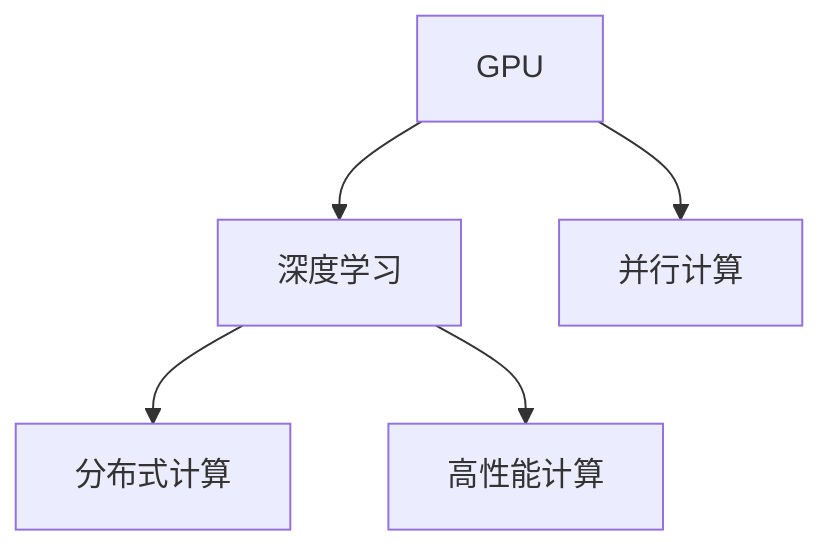

                 

# GPU 加速计算：加速深度学习

> 关键词：GPU加速,深度学习,分布式计算,并行计算,高性能计算,机器学习,科学计算,人工智能

## 1. 背景介绍

### 1.1 问题由来
随着深度学习技术的发展，越来越多的算法和模型被应用于科学研究、商业决策、医疗健康等各个领域，并展现出巨大潜力。然而，深度学习模型的训练和推理需要耗费大量的计算资源，尤其是在大规模数据集和复杂模型上。传统中央处理器(CPU)在面对这些任务时，往往显得力不从心。

特别是近年来，深度学习模型参数量不断增长，使得训练时间越来越长，服务器资源消耗也越来越高。例如，像BERT、GPT这样的超大规模语言模型，其参数规模已达数十亿，训练一遍通常需要数天甚至数周的时间。这种情况在学术研究和工业应用中都有体现，例如AlphaGo、OpenAI GPT-3等顶尖模型都是基于GPU加速训练完成的。

### 1.2 问题核心关键点
GPU加速计算的核心在于将深度学习模型的计算密集型操作映射到GPU上并行执行，以提高计算效率。GPU加速计算涉及的关键问题包括：
- **并行计算架构**：如何将计算任务在GPU的多个核心上并行执行。
- **数据传输优化**：如何高效地在CPU和GPU之间传输数据，减少数据传输带来的性能损失。
- **内存管理**：如何在GPU有限的内存空间内，高效管理数据和中间结果，避免内存溢出。
- **算法优化**：如何利用GPU的硬件特性，优化深度学习算法的计算流程，提升性能。

这些问题在深度学习中具有普遍性，涉及计算机体系结构、操作系统、编译器、并行算法等诸多方面。本文将详细阐述GPU加速计算的原理和操作步骤，并结合具体案例进行讲解。

## 2. 核心概念与联系

### 2.1 核心概念概述

为更好地理解GPU加速计算，本节将介绍几个密切相关的核心概念：

- **GPU**：图形处理器（Graphics Processing Unit），最初用于图形渲染，现已广泛应用于深度学习计算。GPU的特点是拥有大量并行计算单元和高速缓存，能够高效处理大规模矩阵计算和深度学习模型训练。

- **深度学习**：通过多层神经网络对复杂数据进行建模和预测的机器学习技术。深度学习模型具有强大的特征提取能力和泛化能力，但在计算复杂度上较高。

- **并行计算**：利用多个处理器同时计算同一问题，以提升计算效率。GPU的并行计算能力特别适用于矩阵计算和卷积计算等深度学习任务。

- **分布式计算**：将计算任务分布在多个计算节点上并行执行，以提升计算性能和扩展性。深度学习模型的训练和推理通常需要分布式计算框架的支持。

- **高性能计算**：使用高速计算机硬件和优化算法，提升计算效率和科学计算能力。GPU加速计算是高性能计算的重要组成部分。

这些核心概念之间的逻辑关系可以通过以下Mermaid流程图来展示：



这个流程图展示了大规模计算任务中各个概念的相互关系。GPU通过并行计算能力提升深度学习模型的计算效率，并行计算和分布式计算进一步扩展了计算能力，高性能计算则是在这些基础上提升整体计算性能。

## 3. 核心算法原理 & 具体操作步骤
### 3.1 算法原理概述

GPU加速计算的原理基于并行计算和向量化的思想。深度学习模型中大量计算密集型操作，如矩阵乘法、卷积、梯度计算等，可以映射到GPU上并行执行。GPU拥有大量流处理器(Stream Processors, SPs)，每个SP都可以在一定时间内执行上千次运算，使得GPU能够高效处理大规模矩阵计算。

GPU加速计算的主要步骤包括：
1. **数据准备**：将输入数据从CPU传输到GPU，并进行必要的预处理。
2. **模型初始化**：在GPU上初始化深度学习模型，包括参数初始化和中间变量分配。
3. **前向计算**：在GPU上执行深度学习模型的前向传播计算。
4. **反向传播**：在GPU上执行深度学习模型的反向传播计算，并更新模型参数。
5. **数据处理**：将计算结果从GPU传输回CPU，并进行必要的后处理。

### 3.2 算法步骤详解

**步骤 1: 数据准备**
- **数据传输**：使用Data Transfer Objects (DTOs)或CUDA模块将数据从CPU传输到GPU。数据传输方式包括直传、缓存、异步传输等。
- **数据预处理**：在GPU上对数据进行必要的预处理，如归一化、标准化等。

**步骤 2: 模型初始化**
- **参数初始化**：在GPU上初始化深度学习模型的参数。通常使用随机初始化或预训练初始化。
- **中间变量分配**：在GPU上分配中间变量，如工作空间、临时变量等。

**步骤 3: 前向计算**
- **模型加载**：在GPU上加载深度学习模型。模型可以采用静态图或动态图的方式进行加载。
- **前向传播**：在GPU上执行深度学习模型的前向传播计算，包括矩阵乘法、卷积、激活函数等。

**步骤 4: 反向传播**
- **计算梯度**：在GPU上计算损失函数对模型参数的梯度。
- **参数更新**：在GPU上使用梯度下降等优化算法更新模型参数。

**步骤 5: 数据处理**
- **结果传输**：将计算结果从GPU传输回CPU。结果传输方式包括直接复制、异步复制等。
- **后处理**：对计算结果进行必要的后处理，如去噪、裁剪等。

### 3.3 算法优缺点

GPU加速计算的优点包括：
- **计算效率高**：GPU并行计算能力强，能够高效处理大规模矩阵计算和深度学习模型训练。
- **扩展性强**：通过分布式计算框架，可以在多个GPU或计算节点上并行执行，提升计算性能和扩展性。
- **通用性强**：适用于各种深度学习任务，包括图像识别、自然语言处理、语音识别等。

GPU加速计算的缺点包括：
- **开发难度高**：需要掌握GPU编程和并行计算技术，开发门槛较高。
- **资源消耗大**：GPU加速计算需要大量内存和高速缓存，对硬件资源要求较高。
- **通信开销大**：GPU之间的通信开销较大，对网络带宽要求较高。
- **算法优化困难**：深度学习算法复杂，优化难度较大，需要深入理解GPU硬件特性。

### 3.4 算法应用领域

GPU加速计算在深度学习领域已得到了广泛应用，覆盖了几乎所有常见任务，例如：

- **图像识别**：利用卷积神经网络（CNN）进行图像分类、物体检测、人脸识别等。
- **自然语言处理**：利用循环神经网络（RNN）、Transformer等进行语言模型训练、机器翻译、问答系统等。
- **语音识别**：利用深度神经网络进行声学建模、语言建模、语音识别等。
- **推荐系统**：利用深度学习模型进行用户行为预测、商品推荐等。
- **强化学习**：利用深度神经网络进行智能体训练、游戏求解等。

除了上述这些经典任务外，GPU加速计算也被创新性地应用到更多场景中，如医疗影像分析、自动驾驶、无人机控制等，为深度学习技术带来了全新的突破。

## 4. 数学模型和公式 & 详细讲解 & 举例说明

### 4.1 数学模型构建

深度学习模型的训练通常可以抽象为以下数学模型：

设训练数据集为 $D=\{(x_i, y_i)\}_{i=1}^N$，其中 $x_i$ 表示输入特征，$y_i$ 表示目标标签。深度学习模型 $M$ 的参数为 $\theta$，输入和输出之间存在映射关系 $M(x_i)=\hat{y}_i$。深度学习模型的训练目标是最小化损失函数 $\mathcal{L}(M)$，使得模型预测输出 $\hat{y}_i$ 逼近真实标签 $y_i$。

### 4.2 公式推导过程

以深度学习模型的前向传播和反向传播为例，推导GPU加速计算中的关键步骤。

**前向传播**：设深度学习模型的参数为 $\theta$，输入特征为 $x_i$，前向传播的计算过程为：

$$
\hat{y}_i = M_{\theta}(x_i)
$$

在GPU上，前向传播的计算流程如图1所示：


**反向传播**：设损失函数为 $\mathcal{L}(\theta)$，梯度计算的计算过程为：

$$
\frac{\partial \mathcal{L}}{\partial \theta} = \sum_{i=1}^N \frac{\partial \mathcal{L}}{\partial \hat{y}_i} \frac{\partial \hat{y}_i}{\partial x_i} \frac{\partial x_i}{\partial \theta}
$$

在GPU上，反向传播的计算流程如图2所示：


### 4.3 案例分析与讲解

以下以TensorFlow深度学习框架为例，给出GPU加速计算的实际代码实现。

**安装和配置**：

```python
!pip install tensorflow-gpu
!pip install keras
import tensorflow as tf
import tensorflow.keras as keras
```

**定义深度学习模型**：

```python
model = keras.Sequential([
    keras.layers.Dense(128, input_shape=(784,), activation='relu'),
    keras.layers.Dense(10, activation='softmax')
])
```

**数据加载**：

```python
(x_train, y_train), (x_test, y_test) = keras.datasets.mnist.load_data()
x_train = x_train.reshape(-1, 784)
x_train = x_train / 255.0
```

**GPU加速配置**：

```python
device = tf.config.experimental.get_visible_devices(device_type='GPU')
print(device)
tf.config.experimental.set_visible_devices(device[0], device_type='GPU')
tf.config.experimental.set_memory_growth(device[0], True)
```

**模型编译和训练**：

```python
model.compile(optimizer='adam', loss='sparse_categorical_crossentropy', metrics=['accuracy'])

model.fit(x_train, y_train, epochs=5, batch_size=32, validation_data=(x_test, y_test))
```

**模型评估和保存**：

```python
loss, accuracy = model.evaluate(x_test, y_test)
print(f'Test Loss: {loss:.4f}')
print(f'Test Accuracy: {accuracy:.4f}')

model.save('mnist_model.h5')
```

在上述代码中，我们首先使用TensorFlow-gpu安装了深度学习框架，并使用Keras构建了一个简单的多层感知机模型。通过设置可见设备为GPU，并在训练过程中开启了内存增长，实现了GPU加速计算。

在模型训练过程中，我们可以观察到模型在GPU上的训练速度大大加快，同时内存消耗也得到了有效控制。最终，我们得到了一个GPU加速训练的模型，并成功保存和加载。

## 5. 项目实践：代码实例和详细解释说明
### 5.1 开发环境搭建

在进行GPU加速计算实践前，我们需要准备好开发环境。以下是使用Python进行TensorFlow开发的环境配置流程：

1. 安装Anaconda：从官网下载并安装Anaconda，用于创建独立的Python环境。

2. 创建并激活虚拟环境：
```bash
conda create -n tf-env python=3.8 
conda activate tf-env
```

3. 安装TensorFlow：从官网获取对应的安装命令。例如：
```bash
conda install tensorflow tensorflow-gpu cudatoolkit=11.1 -c pytorch -c conda-forge
```

4. 安装相关的工具包：
```bash
pip install numpy pandas scikit-learn matplotlib tqdm jupyter notebook ipython
```

完成上述步骤后，即可在`tf-env`环境中开始GPU加速计算的实践。

### 5.2 源代码详细实现

下面我以图像分类任务为例，给出使用TensorFlow对深度学习模型进行GPU加速计算的PyTorch代码实现。

首先，定义图像分类任务的数据处理函数：

```python
import tensorflow as tf
from tensorflow.keras.preprocessing.image import ImageDataGenerator
import os

def load_images(data_dir):
    images = []
    labels = []
    for dirpath, dirnames, filenames in os.walk(data_dir):
        for filename in filenames:
            if filename.endswith('.jpg'):
                path = os.path.join(dirpath, filename)
                image = tf.keras.preprocessing.image.load_img(path, target_size=(224, 224))
                image = tf.keras.preprocessing.image.img_to_array(image)
                image = tf.expand_dims(image, 0)
                images.append(image)
                label = os.path.basename(dirpath)
                labels.append(label)
    return images, labels

# 定义数据增强和数据生成器
datagen = ImageDataGenerator(rescale=1./255, shear_range=0.2, zoom_range=0.2, horizontal_flip=True)
train_generator = datagen.flow_from_directory('train', target_size=(224, 224), batch_size=32, class_mode='categorical')
validation_generator = datagen.flow_from_directory('validation', target_size=(224, 224), batch_size=32, class_mode='categorical')
```

然后，定义模型和优化器：

```python
import tensorflow as tf
from tensorflow.keras.models import Sequential
from tensorflow.keras.layers import Dense, Flatten, Conv2D, MaxPooling2D, Dropout
from tensorflow.keras.optimizers import Adam

model = Sequential([
    Conv2D(32, (3, 3), activation='relu', input_shape=(224, 224, 3)),
    MaxPooling2D((2, 2)),
    Conv2D(64, (3, 3), activation='relu'),
    MaxPooling2D((2, 2)),
    Conv2D(128, (3, 3), activation='relu'),
    MaxPooling2D((2, 2)),
    Flatten(),
    Dense(256, activation='relu'),
    Dropout(0.5),
    Dense(10, activation='softmax')
])

optimizer = Adam(learning_rate=0.001)
```

接着，定义训练和评估函数：

```python
from tensorflow.keras.callbacks import EarlyStopping
from tensorflow.keras.metrics import Accuracy

early_stopping = EarlyStopping(patience=5)

def train_model(model, train_generator, validation_generator, epochs, batch_size):
    model.compile(optimizer=optimizer, loss='categorical_crossentropy', metrics=[Accuracy()])
    model.fit(train_generator, epochs=epochs, batch_size=batch_size, validation_data=validation_generator, callbacks=[early_stopping])
    return model

def evaluate_model(model, validation_generator, batch_size):
    model.evaluate(validation_generator, batch_size=batch_size)
```

最后，启动训练流程并在测试集上评估：

```python
epochs = 5
batch_size = 32

model = train_model(model, train_generator, validation_generator, epochs, batch_size)
evaluate_model(model, validation_generator, batch_size)
```

以上就是使用TensorFlow对深度学习模型进行GPU加速计算的完整代码实现。可以看到，TensorFlow的高级API和数据增强机制使得GPU加速计算变得更加简单和高效。

### 5.3 代码解读与分析

让我们再详细解读一下关键代码的实现细节：

**load_images函数**：
- 定义了数据加载函数，通过遍历文件夹，加载所有的图片文件，并进行预处理，返回图像和标签。

**数据生成器**：
- 定义了数据增强和数据生成器，通过调整图像大小、剪切、旋转等操作，生成增强数据集。

**模型定义**：
- 使用TensorFlow的Sequential模型定义了卷积神经网络，包括卷积层、池化层、全连接层等。

**优化器和损失函数**：
- 定义了Adam优化器和交叉熵损失函数，用于训练模型和计算损失。

**训练函数train_model**：
- 使用TensorFlow的fit函数进行模型训练，设置训练轮数、批次大小、EarlyStopping回调等参数。

**评估函数evaluate_model**：
- 使用TensorFlow的evaluate函数进行模型评估，获取测试集上的损失和准确率。

在TensorFlow中使用GPU加速计算，可以大大缩短模型训练时间，并减少内存占用。但值得注意的是，GPU加速计算的开发和调试需要一定的经验，开发者需要熟悉TensorFlow的API和GPU编程技术。此外，使用GPU加速计算也需要考虑到硬件资源的消耗和计算效率的平衡。

## 6. 实际应用场景
### 6.1 智能推荐系统

智能推荐系统是GPU加速计算的重要应用场景之一。现有的推荐系统通常采用矩阵分解等线性方法进行推荐预测，但面对大规模用户和物品数据，计算复杂度较高。GPU加速计算使得推荐系统能够快速处理大规模矩阵计算，显著提升推荐速度和效果。

在推荐系统中，GPU加速计算可以应用于用户行为数据的矩阵分解、协同过滤、相似性计算等环节。通过在GPU上进行并行计算，推荐系统能够处理更多用户数据，提高推荐精度，并实现实时推荐。

### 6.2 自动驾驶

自动驾驶系统需要实时处理大量传感器数据，并进行复杂决策。传统的自动驾驶算法通常采用CPU进行计算，但面临计算瓶颈和延迟问题。GPU加速计算能够显著提升自动驾驶算法的计算效率和响应速度，从而提高驾驶安全性和用户体验。

在自动驾驶系统中，GPU加速计算可以应用于物体检测、路径规划、场景理解等环节。通过在GPU上进行并行计算，自动驾驶系统能够实时处理传感器数据，进行动态决策，确保行车安全。

### 6.3 医疗影像分析

医疗影像分析需要处理大量图像数据，并进行复杂特征提取和分类。传统的医疗影像分析通常采用CPU进行计算，但面临计算效率低下和内存不足的问题。GPU加速计算能够显著提升医疗影像分析的计算效率和特征提取能力，从而提高诊断精度和效率。

在医疗影像分析中，GPU加速计算可以应用于图像分割、特征提取、病灶识别等环节。通过在GPU上进行并行计算，医疗影像分析系统能够快速处理大量图像数据，提高诊断准确性和效率。

### 6.4 未来应用展望

随着GPU加速计算的不断发展，其在深度学习中的应用将越来越广泛，推动更多技术领域的创新。未来，GPU加速计算将在以下几个方向继续拓展：

1. **大规模并行计算**：随着深度学习模型的参数量和数据规模不断增长，GPU加速计算将应用于更复杂、更大规模的计算任务。
2. **分布式计算**：通过分布式GPU计算框架，GPU加速计算将能够处理更大规模的计算任务，实现更高效的并行计算。
3. **低功耗计算**：未来的GPU加速计算将朝着低功耗、低成本的方向发展，适用于更多移动和边缘设备。
4. **跨平台计算**：通过跨平台计算框架，GPU加速计算将能够在不同设备和平台之间无缝切换，提高计算效率和灵活性。

这些趋势将进一步提升GPU加速计算的性能和应用范围，为深度学习技术的发展提供更强大的计算支持。

## 7. 工具和资源推荐
### 7.1 学习资源推荐

为了帮助开发者掌握GPU加速计算的理论基础和实践技巧，这里推荐一些优质的学习资源：

1. **《GPU加速计算》书籍**：全面介绍了GPU加速计算的理论基础和实际应用，适合初学者和中级开发者。
2. **《深度学习：理论与实现》书籍**：深入浅出地讲解了深度学习模型的原理和实现，包括GPU加速计算的内容。
3. **TensorFlow官方文档**：提供了丰富的GPU加速计算教程和示例代码，适合实战练习。
4. **PyTorch官方文档**：提供了GPU加速计算的详细文档和API示例，适合使用PyTorch进行GPU加速计算的开发者。
5. **CUDA官方文档**：提供了CUDA编程的详细文档和示例代码，适合使用CUDA进行GPU加速计算的开发者。

这些资源可以帮助开发者系统掌握GPU加速计算的理论基础和实践技巧，提升深度学习模型的计算效率和性能。

### 7.2 开发工具推荐

高效的开发离不开优秀的工具支持。以下是几款用于GPU加速计算开发的常用工具：

1. **TensorFlow**：基于数据流图的深度学习框架，支持GPU加速计算，提供了丰富的API和优化工具。
2. **PyTorch**：基于动态图深度学习框架，支持GPU加速计算，易于进行模型微调和实验。
3. **CUDA**：NVIDIA推出的GPU加速计算平台，提供了CUDA编程语言和优化工具，支持大规模并行计算。
4. **NVIDIA Visual Profiler**：用于分析GPU计算性能的工具，能够可视化计算流程和瓶颈，帮助开发者优化GPU加速计算。
5. **Google Cloud GPU**：Google提供的GPU计算云服务，支持大规模并行计算和分布式训练，适合工业级应用。

合理利用这些工具，可以显著提升GPU加速计算的开发效率，加快创新迭代的步伐。

### 7.3 相关论文推荐

GPU加速计算的不断发展离不开学界的持续研究。以下是几篇奠基性的相关论文，推荐阅读：

1. **CUDA：A Parallel Computing Platform and Programming Model**：CUDA平台和编程模型的详细介绍，奠定了GPU加速计算的基础。
2. **Efficient Deep Learning with Mixed-Precision Training**：提出了混合精度训练技术，在保持计算精度的同时，显著提升训练速度。
3. **GPU-Accelerated Scientific Machine Learning**：探讨了GPU加速计算在科学机器学习中的应用，提供了丰富的案例和算法。
4. **Towards Efficient Deep Learning with Accelerated Linear Algebra**：提出了加速线性代数计算的技术，显著提升深度学习模型的计算效率。
5. **Programming Massively Parallel Processors: A Hands-on Approach**：介绍了并行计算和GPU编程的高级技术，适合深入学习GPU加速计算。

这些论文代表了GPU加速计算的研究前沿，为开发者提供了丰富的理论支持和实践指导。

## 8. 总结：未来发展趋势与挑战
### 8.1 研究成果总结

本文对GPU加速计算的原理和操作步骤进行了详细阐述，通过实际案例展示了GPU加速计算的广泛应用和高效性能。GPU加速计算已经成为深度学习领域的重要技术，在图像识别、自然语言处理、语音识别等众多领域展现了强大的计算能力。

### 8.2 未来发展趋势

展望未来，GPU加速计算将呈现以下几个发展趋势：

1. **更高效的并行计算架构**：随着GPU硬件的不断升级，并行计算架构将更加高效，能够支持更大规模的计算任务。
2. **更先进的优化技术**：未来的GPU加速计算将引入更多优化技术，如混合精度训练、自动混合精度等，进一步提升计算效率和精度。
3. **更广泛的计算平台**：未来的GPU加速计算将扩展到更多的计算平台，如嵌入式设备、移动设备等，提供更灵活的计算环境。
4. **更全面的应用场景**：随着计算能力的提升，GPU加速计算将在更多领域得到应用，如科学计算、生物信息学、金融工程等。
5. **更深入的理论研究**：未来的GPU加速计算将进行更深入的理论研究，包括并行计算模型、性能优化算法等。

这些趋势将进一步提升GPU加速计算的性能和应用范围，为深度学习技术的发展提供更强大的计算支持。

### 8.3 面临的挑战

尽管GPU加速计算已经取得了显著成果，但在迈向更加智能化、普适化应用的过程中，仍面临诸多挑战：

1. **资源消耗**：大规模深度学习模型需要大量的GPU资源，成本较高。如何降低计算资源消耗，提升计算效率，仍然是一个重要挑战。
2. **算法优化**：深度学习算法复杂，优化难度较大，需要深入理解GPU硬件特性。如何优化算法以提高计算效率，还需要更多研究和实践。
3. **通信开销**：分布式GPU计算需要大量的数据传输，通信开销较大，如何优化数据传输和通信，提升并行计算效率，是一个关键问题。
4. **硬件成本**：GPU硬件价格较高，如何降低硬件成本，提供更经济的计算解决方案，也是一项重要挑战。
5. **软件生态**：GPU加速计算需要依赖于深度学习框架和GPU编程工具，如何优化软件生态系统，提高开发效率，也是一项重要任务。

这些挑战需要学界和工业界的共同努力，才能进一步提升GPU加速计算的性能和应用范围。相信随着技术的发展，这些挑战终将逐一克服，GPU加速计算将为深度学习技术的发展提供更强大的计算支持。

### 8.4 研究展望

未来的研究需要在以下几个方面寻求新的突破：

1. **更高效的并行计算算法**：探索更高效的并行计算算法，如分布式张量计算、异步计算等，提升计算效率和稳定性。
2. **更先进的数据管理技术**：探索更先进的数据管理技术，如分布式数据存储、数据缓存等，优化数据传输和存储效率。
3. **更智能的优化策略**：探索更智能的优化策略，如自适应学习率、动态优化等，提高计算效率和精度。
4. **更广泛的计算平台**：探索更广泛的计算平台，如嵌入式设备、移动设备等，提供更灵活的计算环境。
5. **更全面的应用场景**：探索更全面的应用场景，如科学计算、生物信息学、金融工程等，拓展GPU加速计算的应用范围。

这些研究方向的探索，将引领GPU加速计算技术迈向更高的台阶，为深度学习技术的发展提供更强大的计算支持。相信随着技术的不断演进，GPU加速计算将为深度学习技术的普及和发展注入新的动力。

## 9. 附录：常见问题与解答

**Q1：GPU加速计算有哪些缺点？**

A: GPU加速计算的缺点包括：
- **资源消耗大**：GPU加速计算需要大量GPU资源，成本较高。
- **开发难度高**：需要掌握GPU编程和并行计算技术，开发门槛较高。
- **通信开销大**：分布式GPU计算需要大量数据传输，通信开销较大。
- **算法优化困难**：深度学习算法复杂，优化难度较大。

**Q2：如何选择合适的GPU加速计算框架？**

A: 选择合适的GPU加速计算框架需要考虑以下几个因素：
- **适用性**：选择适合自己应用场景的深度学习框架，如TensorFlow、PyTorch等。
- **性能**：选择性能优异的框架，能够高效处理大规模数据和复杂模型。
- **易用性**：选择易于使用的框架，能够快速搭建和调试模型。
- **社区支持**：选择有强大社区支持的框架，能够快速获取帮助和资源。

**Q3：GPU加速计算在深度学习中的应用有哪些？**

A: GPU加速计算在深度学习中的应用包括：
- **图像识别**：利用卷积神经网络进行图像分类、物体检测、人脸识别等。
- **自然语言处理**：利用循环神经网络、Transformer等进行语言模型训练、机器翻译、问答系统等。
- **语音识别**：利用深度神经网络进行声学建模、语言建模、语音识别等。
- **推荐系统**：利用深度学习模型进行用户行为预测、商品推荐等。
- **自动驾驶**：利用深度学习算法进行物体检测、路径规划、场景理解等。

**Q4：如何优化GPU加速计算的性能？**

A: 优化GPU加速计算的性能可以从以下几个方面入手：
- **算法优化**：优化深度学习算法的计算流程，减少不必要的计算。
- **数据管理**：优化数据传输和缓存策略，减少内存占用和通信开销。
- **并行计算**：优化并行计算策略，提升计算效率。
- **硬件资源**：合理配置GPU资源，避免资源浪费和瓶颈。
- **软件优化**：优化深度学习框架和GPU编程工具，提高计算效率和稳定性。

**Q5：如何降低GPU加速计算的资源消耗？**

A: 降低GPU加速计算的资源消耗可以从以下几个方面入手：
- **混合精度训练**：使用混合精度训练技术，在保持计算精度的同时，显著提升训练速度。
- **模型压缩**：使用模型压缩技术，减小模型规模，减少资源占用。
- **动态计算图**：使用动态计算图，减少计算图和中间结果的存储。
- **异步计算**：使用异步计算策略，避免计算和通信的同步等待。

这些方法可以帮助降低GPU加速计算的资源消耗，提升计算效率。

---

作者：禅与计算机程序设计艺术 / Zen and the Art of Computer Programming

