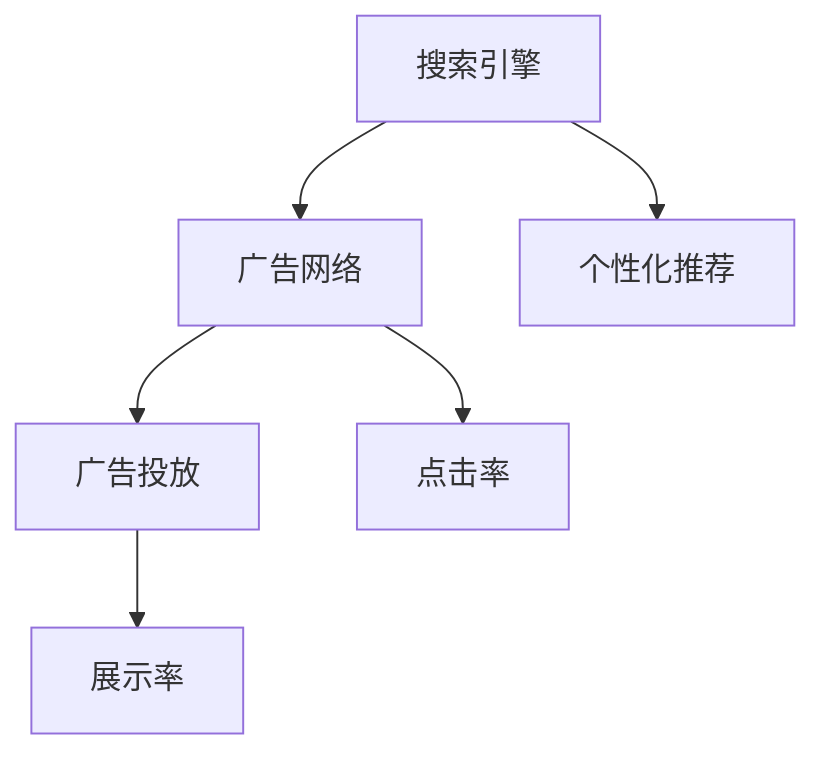

                 

# Google的广告帝国:高效但有争议的商业模式

## 1. 背景介绍

### 1.1 问题由来

Google作为全球领先的搜索引擎和互联网公司，其商业模式以广告为主。Google通过其搜索引擎、YouTube、Gmail等平台，吸引了海量用户，并在这些平台上投放各类广告，获取巨额收入。然而，Google的广告模式因其高效与争议并存而备受关注。

### 1.2 问题核心关键点

Google的广告模式主要通过以下三个步骤实现：
1. **流量获取**：Google的搜索引擎、应用和网站吸引大量用户访问。
2. **广告展示**：Google根据用户的搜索习惯和行为，将广告精准展示给用户。
3. **收入实现**：Google向广告商收取费用，收入主要来自点击率和展示率。

这种模式的高效性在于：
- **精准匹配**：通过用户行为数据，Google能够精准匹配广告和潜在用户，提高广告转化率。
- **大数据分析**：Google庞大的数据资源使其能够深入分析用户需求，优化广告投放策略。

然而，这种模式也引发了诸多争议：
- **隐私问题**：Google通过跟踪用户行为，收集大量个人数据，引发隐私保护担忧。
- **不公平竞争**：部分小企业难以承担Google高昂的广告费用，难以获得公平竞争机会。
- **内容审查**：Google的广告系统可能被用于传播虚假信息和仇恨言论，引发内容审查争议。

## 2. 核心概念与联系

### 2.1 核心概念概述

为更好地理解Google广告模式的原理和运行机制，本节将介绍几个关键概念：

- **搜索引擎(Search Engine)**：一种提供信息检索服务的应用程序，用户通过输入关键词，搜索引擎返回相关网页。
- **广告网络(Ad Network)**：一种将广告与潜在用户匹配的系统，根据用户行为和兴趣投放广告。
- **个性化推荐**：根据用户的历史行为和偏好，向其推荐相关商品和服务。
- **点击率(Click-Through Rate, CTR)**：广告被点击次数与展示次数的比率，反映广告效果。
- **展示率(Impression Rate)**：广告被展示给用户的次数与展示机会的比率，反映广告曝光度。

这些概念之间的逻辑关系可以通过以下Mermaid流程图来展示：



这个流程图展示了几大核心概念的相互关系：

1. 搜索引擎吸引用户访问，并通过广告网络投放广告。
2. 广告网络根据用户行为，精准匹配并展示广告。
3. 个性化推荐系统根据用户历史行为，推荐相关内容，进一步提高用户转化率。
4. 点击率和展示率是衡量广告效果的关键指标，直接关联Google的收入。

## 3. 核心算法原理 & 具体操作步骤

### 3.1 算法原理概述

Google广告模式基于以下几个核心算法原理：

1. **点击率预测模型**：通过机器学习算法预测广告的点击率，优化广告投放策略，提高广告转化率。
2. **个性化推荐算法**：利用用户行为数据，推荐相关广告，提升用户粘性和转化率。
3. **用户行为跟踪**：通过Cookie、设备标识等方式跟踪用户行为，收集数据用于广告优化。
4. **广告投放策略优化**：通过大数据分析，优化广告投放时间和地点，提高广告效果。

### 3.2 算法步骤详解

#### 3.2.1 点击率预测模型

Google的点击率预测模型主要分为以下几个步骤：

1. **数据收集**：收集用户的搜索历史、浏览记录、点击行为等数据。
2. **特征提取**：对数据进行特征提取，包括关键词、用户兴趣标签、地理位置等。
3. **模型训练**：使用随机森林、深度学习等算法训练点击率预测模型。
4. **效果评估**：通过A/B测试等方法评估模型的预测效果，不断调整优化。

#### 3.2.2 个性化推荐算法

Google的个性化推荐算法主要分为以下几个步骤：

1. **用户行为建模**：通过用户在平台上的一系列行为，构建用户兴趣模型。
2. **广告选择**：从广告库中筛选符合用户兴趣的广告。
3. **推荐策略**：根据用户兴趣模型和广告特征，计算广告与用户的匹配度，推荐相关广告。
4. **效果反馈**：收集用户点击数据，评估推荐效果，不断调整优化推荐策略。

#### 3.2.3 用户行为跟踪

Google通过Cookie、设备标识等技术，收集用户的行为数据，用于广告优化和用户分析。具体步骤如下：

1. **Cookie设置**：在用户访问网站时，设置Cookie，记录用户行为。
2. **数据收集**：收集Cookie中的数据，包括用户浏览网页、点击广告等行为。
3. **行为分析**：通过数据分析工具，分析用户行为，提取用户兴趣和偏好。
4. **广告优化**：根据用户行为分析结果，优化广告投放策略，提高广告效果。

### 3.3 算法优缺点

Google广告模式具有以下优点：

1. **高效性**：通过精准匹配和个性化推荐，大幅提高广告转化率。
2. **广泛覆盖**：Google庞大的用户基础和平台资源，使得广告能够覆盖到大量潜在用户。
3. **数据驱动**：基于大数据分析，不断优化广告投放策略。

然而，这种模式也存在一些缺点：

1. **隐私问题**：大量用户数据的收集和分析，引发隐私保护担忧。
2. **不公平竞争**：小企业难以承担高昂的广告费用，难以获得公平竞争机会。
3. **内容审查**：广告系统可能被用于传播虚假信息和仇恨言论，引发内容审查争议。

### 3.4 算法应用领域

Google的广告模式广泛应用于各种领域，包括：

- **电商网站**：通过Google AdWords投放广告，提升商品销售量。
- **视频平台**：在YouTube上投放视频广告，提高用户参与度和广告收入。
- **移动应用**：在Google Play上推广应用，获取更多用户和下载量。
- **本地服务**：通过Google Maps展示本地广告，吸引客户到线下门店。
- **数字营销**：为中小企业提供广告服务，帮助其提升品牌知名度和销售。

这些应用领域展示了Google广告模式的广泛覆盖和高效性，但也引发了诸多争议。

## 4. 数学模型和公式 & 详细讲解 & 举例说明

### 4.1 数学模型构建

Google的点击率预测模型和个性化推荐算法，通常使用机器学习和深度学习模型来实现。

#### 4.1.1 点击率预测模型

假设广告的展示次数为 $I$，广告的点击次数为 $C$，则广告的点击率为：

$$
CTR = \frac{C}{I}
$$

目标是通过机器学习模型预测广告的点击率，模型输入为：

$$
x_i = [x_{i1}, x_{i2}, ..., x_{in}]
$$

其中，$x_{ij}$ 表示广告 $i$ 的特征，$j$ 表示特征维度。

点击率预测模型的目标是最小化预测误差 $L$，常用的损失函数包括均方误差损失、对数损失等。

#### 4.1.2 个性化推荐算法

个性化推荐算法通常使用协同过滤、内容推荐等方法，其中协同过滤算法主要分为基于用户的协同过滤和基于物品的协同过滤两种。

假设用户 $u$ 对物品 $i$ 的评分向量为 $r_u$，物品 $i$ 的特征向量为 $a_i$，则用户 $u$ 对物品 $i$ 的评分预测值为：

$$
\hat{r_{ui}} = \alpha w_u^Ta_i + \beta \sum_{j=1}^{n} r_{uj} a_{ij}
$$

其中，$\alpha$ 和 $\beta$ 是调节参数，$w_u$ 是用户 $u$ 的特征向量。

个性化推荐的目标是最大化用户对推荐结果的满意度，常用的评估指标包括准确率、召回率、F1分数等。

### 4.2 公式推导过程

#### 4.2.1 点击率预测模型

点击率预测模型通常使用线性回归、逻辑回归、决策树等算法实现。以逻辑回归为例，目标是最小化交叉熵损失函数：

$$
L(y, \hat{y}) = -\frac{1}{N} \sum_{i=1}^{N}[y_i \log \hat{y_i} + (1-y_i) \log (1-\hat{y_i})]
$$

其中，$y_i$ 表示实际点击率，$\hat{y_i}$ 表示预测点击率。

逻辑回归模型的输出为广告的点击概率：

$$
\hat{y_i} = \frac{1}{1+e^{-\theta^Tx_i}}
$$

其中，$\theta$ 为模型参数，$x_i$ 为输入特征向量。

#### 4.2.2 个性化推荐算法

协同过滤算法中，用户 $u$ 对物品 $i$ 的评分预测值可以使用矩阵分解模型计算：

$$
\hat{r_{ui}} = \alpha w_u^Ta_i + \beta \sum_{j=1}^{n} r_{uj} a_{ij}
$$

其中，$w_u$ 和 $a_i$ 为矩阵分解得到的用户和物品的嵌入向量。

### 4.3 案例分析与讲解

#### 4.3.1 电商网站广告

某电商网站通过Google AdWords投放广告，目标是最小化点击率误差 $L$，使用逻辑回归模型进行点击率预测。

1. **数据收集**：收集用户的搜索历史、浏览记录、点击行为等数据。
2. **特征提取**：提取关键词、商品类别、用户兴趣标签等特征。
3. **模型训练**：使用逻辑回归模型训练点击率预测模型。
4. **效果评估**：通过A/B测试评估模型效果，不断调整优化。

#### 4.3.2 视频平台广告

某视频平台在YouTube上投放广告，目标是最小化点击率误差 $L$，使用深度学习模型进行点击率预测。

1. **数据收集**：收集用户的视频观看历史、广告点击记录等数据。
2. **特征提取**：提取视频播放时长、频道类别、用户兴趣标签等特征。
3. **模型训练**：使用深度学习模型训练点击率预测模型。
4. **效果评估**：通过A/B测试评估模型效果，不断调整优化。

## 5. 项目实践：代码实例和详细解释说明

### 5.1 开发环境搭建

在进行Google广告模式开发前，我们需要准备好开发环境。以下是使用Python进行TensorFlow开发的环境配置流程：

1. 安装Anaconda：从官网下载并安装Anaconda，用于创建独立的Python环境。

2. 创建并激活虚拟环境：
```bash
conda create -n tensorflow-env python=3.8 
conda activate tensorflow-env
```

3. 安装TensorFlow：根据CUDA版本，从官网获取对应的安装命令。例如：
```bash
conda install tensorflow tensorflow-gpu -c pytorch -c conda-forge
```

4. 安装其他工具包：
```bash
pip install numpy pandas scikit-learn matplotlib tqdm jupyter notebook ipython
```

完成上述步骤后，即可在`tensorflow-env`环境中开始Google广告模式的开发。

### 5.2 源代码详细实现

下面我们以电商网站广告为例，给出使用TensorFlow进行点击率预测的PyTorch代码实现。

首先，定义广告特征和用户行为：

```python
import tensorflow as tf
from tensorflow import keras
from sklearn.model_selection import train_test_split
import numpy as np

# 广告特征
ad_features = ['广告ID', '关键词', '价格', '促销信息']

# 用户行为
user_behaviors = ['搜索历史', '浏览记录', '点击行为']

# 读取数据集
data = pd.read_csv('ad_data.csv')
```

然后，数据预处理：

```python
# 数据预处理
X = data[ad_features]  # 广告特征
y = data['点击率']    # 点击率

# 特征编码
X_encoded = pd.get_dummies(X, columns=ad_features)

# 划分训练集和测试集
X_train, X_test, y_train, y_test = train_test_split(X_encoded, y, test_size=0.2, random_state=42)

# 标准化特征
X_train_mean = X_train.mean()
X_train_std = X_train.std()
X_train = (X_train - X_train_mean) / X_train_std
X_test = (X_test - X_train_mean) / X_train_std
```

接着，定义模型：

```python
# 定义模型
model = keras.Sequential([
    keras.layers.Dense(64, activation='relu', input_shape=(len(ad_features) + 1,)),
    keras.layers.Dense(32, activation='relu'),
    keras.layers.Dense(1, activation='sigmoid')
])
```

最后，训练和评估模型：

```python
# 编译模型
model.compile(optimizer='adam', loss='binary_crossentropy', metrics=['accuracy'])

# 训练模型
model.fit(X_train, y_train, epochs=10, batch_size=32, validation_data=(X_test, y_test))

# 评估模型
test_loss, test_acc = model.evaluate(X_test, y_test)
print('Test loss:', test_loss)
print('Test accuracy:', test_acc)
```

以上就是使用TensorFlow进行点击率预测的完整代码实现。可以看到，TensorFlow提供了强大的高层次API，使得模型构建和训练过程变得简洁高效。

### 5.3 代码解读与分析

让我们再详细解读一下关键代码的实现细节：

**广告特征和用户行为**：
- 广告特征包括广告ID、关键词、价格和促销信息，用于刻画广告本身的特点。
- 用户行为包括搜索历史、浏览记录和点击行为，用于描述用户的兴趣和行为。

**数据预处理**：
- 使用Pandas库读取广告数据集，并进行特征编码。
- 使用`train_test_split`函数划分训练集和测试集。
- 使用标准化处理，使得不同特征具有相同的权重。

**模型定义**：
- 使用Keras框架定义模型结构，包括输入层、隐藏层和输出层。
- 使用ReLU激活函数，提高模型的非线性表达能力。
- 使用sigmoid激活函数，用于二分类任务。

**模型训练和评估**：
- 使用Adam优化器，训练模型10个epoch，每个epoch使用32个样本。
- 在测试集上评估模型性能，输出测试损失和准确率。

## 6. 实际应用场景

### 6.1 电商网站广告

电商网站通过Google AdWords投放广告，可以有效提升商品曝光度和销售额。具体应用场景包括：

- **商品推广**：通过关键词广告，推广热门商品，吸引更多用户点击。
- **活动促销**：通过展示限时折扣信息，提高用户购买欲望。
- **品牌宣传**：通过品牌广告，提升品牌知名度和美誉度。

### 6.2 视频平台广告

视频平台在YouTube上投放广告，可以高效吸引用户注意力。具体应用场景包括：

- **内容推荐**：根据用户观看历史，推荐相关视频，提高用户停留时间和观看时长。
- **品牌广告**：通过视频广告，提升品牌曝光度和用户认知度。
- **竞价广告**：通过竞价机制，根据广告展示效果付费，提高广告ROI。

## 7. 工具和资源推荐

### 7.1 学习资源推荐

为了帮助开发者系统掌握Google广告模式的原理和实践技巧，这里推荐一些优质的学习资源：

1. Google Ads官方文档：Google Ads的详细API文档，提供广告投放的各个环节的详细说明。
2. Coursera《Advertising Analytics》课程：由Google Ads团队开设，介绍广告投放的基本概念和最佳实践。
3. Udacity《Advertising Engineering》课程：介绍广告投放的工程实现，涵盖点击率预测、个性化推荐等技术。
4. Kaggle广告数据集：Kaggle提供的广告数据集，用于广告效果评估和模型优化。
5. AdTech Insights：AdTech Insights网站提供广告行业的最新动态和技术分析。

通过对这些资源的学习实践，相信你一定能够快速掌握Google广告模式的精髓，并用于解决实际的广告投放问题。

### 7.2 开发工具推荐

高效的开发离不开优秀的工具支持。以下是几款用于Google广告模式开发的常用工具：

1. TensorFlow：由Google主导开发的开源深度学习框架，生产部署方便，适合大规模工程应用。
2. Scikit-learn：Python机器学习库，提供丰富的模型选择和评估工具。
3. PyTorch：基于Python的开源深度学习框架，灵活动态的计算图，适合快速迭代研究。
4. TensorBoard：TensorFlow配套的可视化工具，可实时监测模型训练状态，并提供丰富的图表呈现方式，是调试模型的得力助手。
5. H2O.ai：用于机器学习的开源平台，提供自动化的数据预处理和模型训练功能。

合理利用这些工具，可以显著提升Google广告模式的开发效率，加快创新迭代的步伐。

### 7.3 相关论文推荐

Google广告模式的发展离不开学界的持续研究。以下是几篇奠基性的相关论文，推荐阅读：

1. "AdWords Click Model"：提出基于广告特征和用户行为的点击率预测模型，并应用于Google AdWords。
2. "Personalized PageRank"：提出基于用户兴趣的个性化推荐算法，并应用于Google搜索广告。
3. "AdWords PPC: A Note on Goodness and Sustainability"：讨论Google AdWords的PPC模型和效果评估指标。
4. "Machine Learning with Python: Big Data, SVMs, and Deep Learning"：介绍机器学习技术在Google广告中的应用。
5. "The Economics of Machine Learning and Artificial Intelligence"：探讨机器学习技术对广告行业的经济影响。

这些论文代表了大语言模型微调技术的发展脉络。通过学习这些前沿成果，可以帮助研究者把握学科前进方向，激发更多的创新灵感。

## 8. 总结：未来发展趋势与挑战

### 8.1 总结

本文对Google广告模式的原理和应用进行了全面系统的介绍。首先阐述了广告模式的定义、组成和核心算法，然后详细讲解了广告模式在电商网站和视频平台上的应用场景。通过系统梳理，可以看到，Google广告模式凭借其高效性和广泛覆盖，已经成为众多行业广告投放的重要选择。

通过本文的系统梳理，可以看到，Google广告模式在电商网站和视频平台上的高效性，已经大幅提升了商品曝光率和用户参与度，创造了巨大的商业价值。然而，这种模式也引发了诸多争议，包括隐私问题、不公平竞争和内容审查等，需要我们共同面对并解决。

### 8.2 未来发展趋势

展望未来，Google广告模式将呈现以下几个发展趋势：

1. **个性化推荐**：通过深度学习和大数据技术，进一步优化个性化推荐算法，提升广告效果和用户粘性。
2. **跨平台整合**：通过Google生态系统的整合，实现跨平台广告投放和效果评估，提升广告投放的灵活性和精准度。
3. **实时优化**：通过实时数据分析和动态调整，实现广告投放的实时优化，提升广告效果和ROI。
4. **隐私保护**：通过隐私保护技术，如差分隐私、联邦学习等，保护用户隐私，提升广告模式的可信度。
5. **内容审查**：通过智能算法，自动识别和过滤低质量内容，提升广告平台的健康度和用户体验。

以上趋势凸显了Google广告模式的广阔前景。这些方向的探索发展，必将进一步提升广告模式的效果和应用范围，为广告行业带来新的突破。

### 8.3 面临的挑战

尽管Google广告模式已经取得了瞩目成就，但在迈向更加智能化、普适化应用的过程中，它仍面临诸多挑战：

1. **数据隐私问题**：大量用户数据的收集和分析，引发隐私保护担忧。如何平衡广告效果和用户隐私，将是重要的研究课题。
2. **技术复杂性**：广告投放涉及多个环节，技术实现复杂。如何在不同环节进行有效的协同和优化，是重要的挑战。
3. **广告效果评估**：如何准确评估广告效果，避免虚假点击和流量作弊，是重要的挑战。
4. **公平竞争**：小企业难以承担高昂的广告费用，难以获得公平竞争机会。如何确保广告平台的公平性，是重要的课题。
5. **内容审查**：广告系统可能被用于传播虚假信息和仇恨言论，引发内容审查争议。如何高效识别和过滤有害内容，是重要的挑战。

解决这些挑战，需要广告平台、技术专家和监管机构共同努力，共同推动广告模式的健康发展。

### 8.4 研究展望

面对Google广告模式面临的种种挑战，未来的研究需要在以下几个方面寻求新的突破：

1. **深度学习与大数据融合**：进一步融合深度学习和大数据技术，实现更加精准的广告投放和个性化推荐。
2. **隐私保护技术**：引入差分隐私、联邦学习等技术，保护用户隐私，提升广告模式的可信度。
3. **广告效果评估**：研究高效、准确的广告效果评估方法，避免虚假点击和流量作弊，提升广告平台的效果和信任度。
4. **公平竞争**：研究小企业友好的广告投放策略，确保广告平台的公平性和包容性。
5. **内容审查**：引入智能算法和人工审核，高效识别和过滤有害内容，提升广告平台的健康度和用户体验。

这些研究方向的探索，必将引领Google广告模式的进步，为广告行业带来新的突破。相信随着学界和产业界的共同努力，这些挑战终将一一被克服，广告模式必将实现更加智能化、普适化的发展。

## 9. 附录：常见问题与解答

**Q1：Google的广告模式是否适用于所有NLP任务？**

A: Google的广告模式主要基于搜索和展示数据的点击率和展示率等指标，并不适用于所有NLP任务。对于需要更深入语言理解和生成能力的任务，如自然语言生成、对话系统等，需要采用更复杂的技术和模型。

**Q2：广告模式如何平衡用户隐私和广告效果？**

A: Google通过差分隐私和联邦学习等技术，保护用户隐私。具体做法包括：
1. 差分隐私：在数据分析过程中，加入噪声，保护用户隐私，避免数据泄露。
2. 联邦学习：在本地设备上训练模型，不将数据传输到中心服务器，保护用户隐私。
3. 数据匿名化：对数据进行去标识化处理，保护用户身份信息。

这些技术可以有效保护用户隐私，同时保证广告效果的提升。

**Q3：Google的广告模式是否存在不公平竞争？**

A: Google的广告模式确实存在不公平竞争的问题。小企业难以承担高昂的广告费用，难以获得公平竞争机会。未来可以通过调整广告投放策略，如引入长尾广告、免费试用等方式，帮助小企业获得更多机会。

**Q4：如何提高Google广告模式的广告效果？**

A: 提高广告效果的关键在于精准匹配和个性化推荐。具体做法包括：
1. 优化点击率预测模型，提高广告投放的精准度。
2. 改进个性化推荐算法，提升广告展示的匹配度。
3. 引入实时优化，根据用户行为实时调整广告投放策略。
4. 优化广告投放策略，提高广告ROI。

通过这些措施，可以显著提升Google广告模式的广告效果。

**Q5：Google的广告模式如何应对内容审查问题？**

A: 应对内容审查问题，需要引入智能算法和人工审核结合的方式。具体做法包括：
1. 引入智能算法，自动识别和过滤有害内容。
2. 引入人工审核，进一步提升内容审查的准确度。
3. 建立内容审查机制，确保广告平台的健康度和用户体验。

这些措施可以有效应对内容审查问题，提升广告平台的健康度和用户信任度。

---

作者：禅与计算机程序设计艺术 / Zen and the Art of Computer Programming

