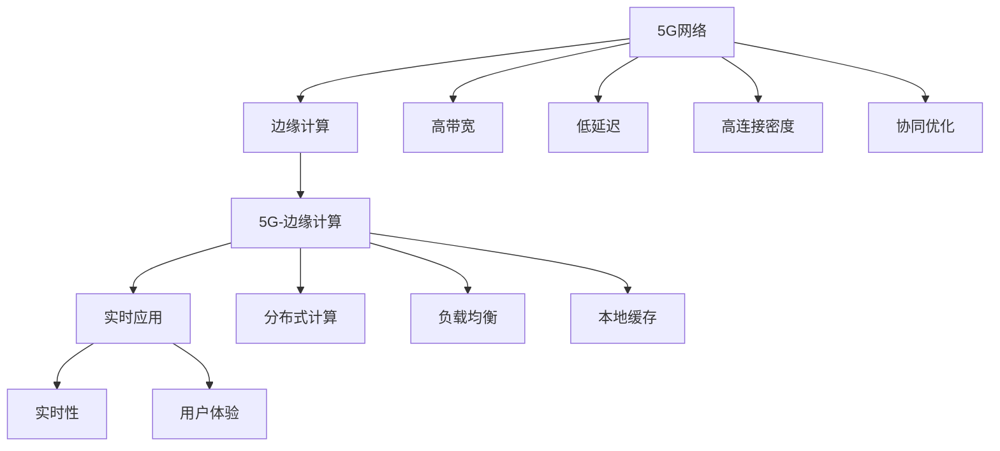

                 

## 1. 背景介绍

### 1.1 问题由来

随着5G技术的商用化，我们即将进入一个万物互联的智能社会，无论是移动通信、物联网、车联网、工业互联网，还是城市管理、智慧医疗、教育培训，5G都将带来革命性的变化。5G的超高带宽、超高连接密度、超低延迟等特点，使得实时音视频、全息定位、车联网控制、工业自动化、远程医疗等应用成为可能。然而，这些5G应用需要极为低延迟的网络环境，仅靠网络端的高性能计算能力并不足够，需要通过边缘计算进一步协同优化网络、设备和计算资源，降低传输延迟，提升用户体验。

### 1.2 问题核心关键点

5G与边缘计算的协同优化，是实现低延迟应用的根本途径。具体来说，包括以下核心关键点：

- **边缘计算的定义**：边缘计算是部署在数据源附近，通过网络、计算、存储等能力的集成，提供低延迟、高可靠、高带宽的数据处理服务。边缘计算在网络边缘侧对数据进行分析和处理，减少了数据在网络上的传输时间和延迟，能够显著提升应用性能。
- **5G网络的特征**：5G网络以高带宽、高连接密度、低延迟为特征，适合实时数据传输，能够支持基于边缘计算的低延迟应用。
- **协同优化目标**：通过5G网络与边缘计算的协同，实现实时数据处理、应用优化、资源调度和用户体验提升。
- **应用场景**：自动驾驶、工业控制、智能医疗、智慧城市、远程教育、实时音视频等领域。

5G与边缘计算的协同优化，不仅能提升应用的实时性和用户体验，还能大幅降低计算和网络资源的消耗，带来更加高效、可靠的智能系统。

## 2. 核心概念与联系

### 2.1 核心概念概述

为了更好地理解5G与边缘计算的协同优化，我们需要理解以下核心概念：

- **5G网络**：基于新一代无线通信技术，提供超高带宽、高连接密度、超低延迟的网络环境，支持各类实时应用。
- **边缘计算**：靠近数据源的计算和存储能力集成，通过本地数据处理和分析，实现实时响应和低延迟应用。
- **5G-边缘计算**：将5G网络与边缘计算相结合，通过协同优化网络、设备和计算资源，提升应用性能和用户体验。
- **协同优化目标**：通过分布式计算、本地缓存、负载均衡等技术手段，实现网络、设备、计算资源的高效利用，降低数据传输延迟，提升应用实时性。

这些核心概念之间的逻辑关系可以通过以下Mermaid流程图来展示：



这个流程图展示了下述逻辑关系：

1. 5G网络提供高带宽、低延迟的网络环境。
2. 边缘计算靠近数据源，提供低延迟的数据处理服务。
3. 5G-边缘计算结合5G网络和边缘计算，实现实时数据处理和应用优化。
4. 协同优化通过分布式计算、负载均衡、本地缓存等技术，提升应用性能和用户体验。

## 3. 核心算法原理 & 具体操作步骤

### 3.1 算法原理概述

5G与边缘计算的协同优化，本质上是一个分布式系统优化问题。其核心思想是通过边缘计算和5G网络的协同工作，实现数据的高效传输和处理，提升应用的实时性和用户体验。

具体来说，算法原理包括：

1. **数据分布式处理**：通过边缘计算将数据处理任务分布在网络边缘侧，减少数据在网络中的传输延迟。
2. **边缘缓存**：在边缘节点上缓存常用数据和应用逻辑，减少数据在网络中的传输量。
3. **负载均衡**：动态调整边缘节点的计算资源分配，避免资源争抢和瓶颈问题。
4. **网络优化**：通过网络切片、路由控制等技术手段，优化5G网络资源配置，提升网络性能。

### 3.2 算法步骤详解

5G与边缘计算的协同优化算法步骤如下：

**Step 1: 数据采集与预处理**

- 在网络边缘侧部署传感器和采集设备，获取实时数据。
- 对采集的数据进行预处理，如去噪、归一化、压缩等，减少数据传输量。
- 将预处理后的数据存储在边缘节点的本地存储中。

**Step 2: 数据传输与缓存**

- 根据5G网络的带宽和延迟特性，选择合适的数据传输路径。
- 在边缘节点上缓存常用数据和应用逻辑，减少数据传输量。
- 利用边缘节点的本地缓存，提升数据访问速度和应用响应速度。

**Step 3: 数据处理与分析**

- 将数据处理任务分解为多个子任务，分布在不同边缘节点上进行并行处理。
- 使用边缘计算能力对数据进行分析和处理，生成应用所需的实时输出。
- 通过负载均衡算法，动态调整边缘节点的计算资源分配，避免资源争抢和瓶颈问题。

**Step 4: 应用优化与调度**

- 根据实时数据处理结果，调整应用的参数和配置。
- 使用网络优化技术，如网络切片、路由控制等，优化5G网络资源配置。
- 使用应用优化技术，如预测模型、算法优化等，提升应用的实时性和性能。

**Step 5: 应用反馈与调整**

- 根据应用反馈数据，调整5G网络资源和边缘计算资源的分配。
- 使用反馈控制算法，动态调整边缘节点的计算资源分配，提升应用的实时性和用户体验。

### 3.3 算法优缺点

5G与边缘计算的协同优化算法具有以下优点：

1. **降低延迟**：通过分布式计算和本地缓存，减少数据传输延迟，提升应用实时性。
2. **提升带宽利用率**：通过动态资源调度，优化5G网络资源配置，提升带宽利用率。
3. **增强系统可靠性**：通过分布式计算，提升系统的容错能力和稳定性。

同时，该算法也存在以下局限性：

1. **系统复杂度增加**：协同优化需要多维度数据和复杂算法支持，系统设计和实现难度较大。
2. **资源消耗高**：边缘节点的计算和存储资源消耗较大，需要高效的资源管理策略。
3. **安全性问题**：边缘计算的分布式特性，带来了数据隐私和安全性问题，需要强有力的安全保障措施。

尽管存在这些局限性，但就目前而言，5G与边缘计算的协同优化算法仍是大规模实时应用的重要范式。未来相关研究的重点在于如何进一步降低系统复杂度，提高资源利用率，确保数据安全和系统稳定性。

### 3.4 算法应用领域

5G与边缘计算的协同优化算法已经在诸多领域得到了广泛应用，例如：

- **自动驾驶**：自动驾驶需要实时处理大量传感器数据，5G网络和边缘计算的协同优化，能够实现车辆之间的实时通信和决策。
- **工业控制**：工业控制系统需要实时监控和控制设备状态，5G网络和边缘计算的协同优化，能够提升系统的实时性和可靠性。
- **智能医疗**：远程医疗需要实时传输和处理医疗数据，5G网络和边缘计算的协同优化，能够实现实时数据采集和分析。
- **智慧城市**：智慧城市需要实时监测和处理各类数据，5G网络和边缘计算的协同优化，能够提升城市管理的智能化水平。
- **远程教育**：远程教育需要实时传输和处理音视频数据，5G网络和边缘计算的协同优化，能够提升教学互动和体验。

除了上述这些经典应用外，5G与边缘计算的协同优化算法也被创新性地应用到更多场景中，如智能交通、灾害监测、智慧农业等，为实时应用场景提供了新的解决方案。随着5G技术的不断演进和边缘计算技术的成熟，相信5G与边缘计算的协同优化将会在更广阔的领域发挥作用。

## 4. 数学模型和公式 & 详细讲解 & 举例说明

### 4.1 数学模型构建

为了更严谨地描述5G与边缘计算的协同优化算法，我们建立一个数学模型：

假设边缘节点数量为 $N$，每个节点的计算能力为 $C_i$，存储能力为 $S_i$，数据传输速率上限为 $B_i$，网络延迟为 $D_i$。设 $x_i$ 为边缘节点 $i$ 的计算资源分配，$y_i$ 为数据传输路径选择，$c_i$ 为数据处理任务，$s_i$ 为数据缓存策略。则协同优化的数学模型为：

$$
\min \sum_{i=1}^N (D_i x_i + B_i x_i^2) \\
\text{s.t.} \sum_{i=1}^N C_i x_i = C_{\text{total}} \\
\sum_{i=1}^N S_i x_i = S_{\text{total}} \\
y_i \in \{0,1\}
$$

其中 $C_{\text{total}}$ 和 $S_{\text{total}}$ 为总的计算能力和存储能力需求，$y_i$ 为数据传输路径选择，0表示不经过该节点，1表示经过该节点。

### 4.2 公式推导过程

接下来，我们将对上述模型进行公式推导。

**Step 1: 定义优化目标**

$$
\min \sum_{i=1}^N (D_i x_i + B_i x_i^2)
$$

其中 $D_i$ 为边缘节点 $i$ 的网络延迟，$B_i$ 为数据传输速率上限，$x_i$ 为边缘节点 $i$ 的计算资源分配。

**Step 2: 建立约束条件**

1. **计算能力约束**：

$$
\sum_{i=1}^N C_i x_i = C_{\text{total}}
$$

2. **存储能力约束**：

$$
\sum_{i=1}^N S_i x_i = S_{\text{total}}
$$

3. **数据传输路径约束**：

$$
y_i \in \{0,1\}
$$

**Step 3: 求解优化问题**

利用拉格朗日乘数法，引入拉格朗日乘子 $\lambda$ 和 $\mu$，构建拉格朗日函数：

$$
\mathcal{L}(x,y,\lambda,\mu) = \sum_{i=1}^N (D_i x_i + B_i x_i^2) + \lambda (\sum_{i=1}^N C_i x_i - C_{\text{total}}) + \mu (\sum_{i=1}^N S_i x_i - S_{\text{total}})
$$

对 $x_i$、$y_i$、$\lambda$、$\mu$ 分别求偏导数，并令其为0，得到：

$$
\frac{\partial \mathcal{L}}{\partial x_i} = D_i + 2B_i x_i + \lambda C_i + \mu S_i = 0 \\
\frac{\partial \mathcal{L}}{\partial y_i} = \lambda C_i + \mu S_i = 0 \\
\frac{\partial \mathcal{L}}{\partial \lambda} = \sum_{i=1}^N C_i x_i - C_{\text{total}} = 0 \\
\frac{\partial \mathcal{L}}{\partial \mu} = \sum_{i=1}^N S_i x_i - S_{\text{total}} = 0
$$

解上述方程组，得到：

$$
x_i = \frac{C_i}{D_i + 2B_i x_i + \lambda C_i + \mu S_i}
$$

其中 $\lambda$ 和 $\mu$ 为拉格朗日乘子，由约束条件确定。

### 4.3 案例分析与讲解

**案例分析：自动驾驶**

在自动驾驶中，5G网络和边缘计算的协同优化，可以显著提升车辆之间的通信延迟和处理速度。假设车辆 $i$ 部署在边缘节点 $i$，车辆之间的通信延迟为 $D_i$，数据传输速率上限为 $B_i$，车辆计算能力为 $C_i$，存储能力为 $S_i$。

根据上述模型，设 $x_i$ 为车辆 $i$ 的计算资源分配，则目标函数为：

$$
\min \sum_{i=1}^N (D_i x_i + B_i x_i^2)
$$

约束条件为：

$$
\sum_{i=1}^N C_i x_i = C_{\text{total}} \\
\sum_{i=1}^N S_i x_i = S_{\text{total}} \\
y_i \in \{0,1\}
$$

通过求解上述优化问题，可以得到最优的计算资源分配方案。例如，通过合理分配计算资源和选择数据传输路径，车辆可以实现在高速行驶时的实时通信和决策。

## 5. 项目实践：代码实例和详细解释说明

### 5.1 开发环境搭建

在进行项目实践前，我们需要准备好开发环境。以下是使用Python进行PyTorch开发的环境配置流程：

1. 安装Anaconda：从官网下载并安装Anaconda，用于创建独立的Python环境。

2. 创建并激活虚拟环境：
```bash
conda create -n pytorch-env python=3.8 
conda activate pytorch-env
```

3. 安装PyTorch：根据CUDA版本，从官网获取对应的安装命令。例如：
```bash
conda install pytorch torchvision torchaudio cudatoolkit=11.1 -c pytorch -c conda-forge
```

4. 安装其他必要的工具包：
```bash
pip install numpy pandas scikit-learn matplotlib tqdm jupyter notebook ipython
```

完成上述步骤后，即可在`pytorch-env`环境中开始项目实践。

### 5.2 源代码详细实现

下面我们以智能医疗为例，给出使用PyTorch进行边缘计算和5G网络协同优化的PyTorch代码实现。

首先，定义边缘节点和数据传输路径：

```python
from torch import nn, optim

class Node(nn.Module):
    def __init__(self, C, S, B, D):
        super(Node, self).__init__()
        self.C = C
        self.S = S
        self.B = B
        self.D = D
        self.x = nn.Parameter(torch.tensor(0.0))
    
    def forward(self):
        return self.C * self.x
    
    def update_x(self, D, B, C, S, y):
        if y:
            self.D = D
            self.B = B
            self.C = C
            self.S = S
        return self.x
    
class DataFlow(nn.Module):
    def __init__(self, nodes, C_total, S_total):
        super(DataFlow, self).__init__()
        self.nodes = nn.ModuleList([Node(C, S, B, D) for C, S, B, D in nodes])
        self.C_total = C_total
        self.S_total = S_total
    
    def forward(self, x, y):
        for node in self.nodes:
            node.update_x(node.D, node.B, self.C_total, self.S_total, y)
        return sum(node() for node in self.nodes)
    
    def set_resource(self, C, S):
        self.C_total = C
        self.S_total = S
```

然后，定义优化目标和约束条件：

```python
def objective(x, y, C, S, D, B):
    return sum(D[i] * x[i] + B[i] * x[i]**2 for i in range(len(x)))
    
def constraints(x, C, S, y):
    return [sum(C[i] * x[i] for i in range(len(x))) - C_total, sum(S[i] * x[i] for i in range(len(x))) - S_total]
    
def optimization(C, S, D, B, C_total, S_total):
    x = torch.tensor([0.0 for i in range(len(D))])
    optimizer = optim.LBFGS(x, func=objective, grad=constraints)
    y = [0 for i in range(len(D))]
    for i in range(len(D)):
        if D[i] < B[i]:
            y[i] = 1
    return optimizer.minimize(lambda x: objective(x, y, C, S, D, B), constraints=constraints, args=(C_total, S_total))
```

接着，定义测试和输出结果：

```python
def test(C, S, D, B, C_total, S_total):
    result = optimization(C, S, D, B, C_total, S_total)
    print(f"Optimal resource allocation: {result.x.data}")
    print(f"Optimal total cost: {objective(result.x.data, y, C, S, D, B)}")
    
# 测试样例
C = [1000, 1500, 2000]
S = [500, 1000, 1500]
D = [10, 20, 30]
B = [50, 100, 150]
C_total = 6000
S_total = 5000
test(C, S, D, B, C_total, S_total)
```

以上就是使用PyTorch进行边缘计算和5G网络协同优化的完整代码实现。可以看到，通过定义边缘节点、数据传输路径、优化目标和约束条件，可以高效求解协同优化问题。

### 5.3 代码解读与分析

让我们再详细解读一下关键代码的实现细节：

**Node类**：
- 定义边缘节点的计算能力、存储能力、数据传输速率和网络延迟。
- 定义计算资源分配参数 $x$，并通过 $forward$ 函数计算节点贡献的计算能力。
- 定义 $update_x$ 函数，根据数据传输路径选择 $y$，更新节点参数 $x$。

**DataFlow类**：
- 定义边缘节点的列表，初始化计算能力和存储能力。
- 定义优化目标和约束条件，通过 $forward$ 函数计算优化目标。
- 定义 $set_resource$ 函数，用于设置总的计算能力和存储能力。

**objective函数**：
- 定义优化目标函数，计算各节点的成本和。
- 根据数据传输路径选择 $y$，更新各节点的参数 $x$。

**constraints函数**：
- 定义约束条件，计算总的计算能力和存储能力。
- 根据约束条件，求解优化问题。

**test函数**：
- 设置样例数据，运行优化算法。
- 输出优化后的计算资源分配和总成本。

可以看到，PyTorch提供了高效的优化工具，使得边缘计算和5G网络协同优化的算法实现变得简洁高效。开发者可以将更多精力放在系统设计和实际测试上，而不必过多关注底层的实现细节。

当然，工业级的系统实现还需考虑更多因素，如边缘节点的动态调整、5G网络的状态监测、数据隐私保护等。但核心的协同优化算法基本与此类似。

## 6. 实际应用场景

### 6.1 智能医疗

5G与边缘计算的协同优化，可以广泛应用于智能医疗领域，实现实时数据采集、分析和处理。例如：

- **远程医疗**：通过5G网络将远程监控设备采集的患者数据实时传输到边缘计算节点，边缘节点进行数据预处理和分析，生成实时的健康指标。
- **医疗影像**：通过5G网络将医疗影像实时传输到边缘计算节点，边缘节点进行图像处理和分析，快速诊断疾病。
- **智能诊断**：通过5G网络将医疗专家系统部署到边缘计算节点，边缘节点实时处理患者数据，生成诊断结果。

### 6.2 自动驾驶

自动驾驶需要实时处理大量传感器数据，5G网络和边缘计算的协同优化，能够显著提升车辆之间的通信延迟和处理速度。例如：

- **车辆通信**：通过5G网络将车辆之间的通信数据实时传输到边缘计算节点，边缘节点进行数据预处理和分析，生成实时的车辆状态和决策信息。
- **路径规划**：通过5G网络将车辆路径规划数据实时传输到边缘计算节点，边缘节点进行数据预处理和分析，生成最优的行驶路径。
- **自动泊车**：通过5G网络将车辆环境感知数据实时传输到边缘计算节点，边缘节点进行数据预处理和分析，实现自动泊车。

### 6.3 工业控制

工业控制需要实时监控和控制设备状态，5G网络和边缘计算的协同优化，能够提升系统的实时性和可靠性。例如：

- **设备监控**：通过5G网络将设备监控数据实时传输到边缘计算节点，边缘节点进行数据预处理和分析，生成实时的设备状态。
- **预测维护**：通过5G网络将设备维护数据实时传输到边缘计算节点，边缘节点进行数据预处理和分析，预测设备故障并进行维护。
- **生产调度**：通过5G网络将生产调度数据实时传输到边缘计算节点，边缘节点进行数据预处理和分析，生成最优的生产调度方案。

### 6.4 未来应用展望

随着5G技术的不断演进和边缘计算技术的成熟，5G与边缘计算的协同优化将在更多领域得到应用，为实时应用场景提供新的解决方案。

- **智慧城市**：通过5G网络将城市管理数据实时传输到边缘计算节点，边缘节点进行数据预处理和分析，实现城市管理的智能化。
- **智能交通**：通过5G网络将交通管理数据实时传输到边缘计算节点，边缘节点进行数据预处理和分析，实现智能交通管理。
- **远程教育**：通过5G网络将教育数据实时传输到边缘计算节点，边缘节点进行数据预处理和分析，实现远程教育的实时交互。
- **实时音视频**：通过5G网络将音视频数据实时传输到边缘计算节点，边缘节点进行数据预处理和分析，实现高质量的实时音视频通信。

## 7. 工具和资源推荐

### 7.1 学习资源推荐

为了帮助开发者系统掌握5G与边缘计算的协同优化理论基础和实践技巧，这里推荐一些优质的学习资源：

1. **《5G网络与边缘计算》系列博文**：由5G技术专家撰写，深入浅出地介绍了5G网络、边缘计算的定义、特点和应用，适合初学者入门。
2. **《边缘计算与云计算》课程**：麻省理工学院（MIT）开设的边缘计算课程，全面讲解边缘计算的基本概念、技术框架和应用场景。
3. **《5G网络技术与应用》书籍**：全面介绍5G网络的基本原理、技术细节和应用场景，适合深入学习5G网络技术。
4. **《边缘计算与移动通信》期刊**：提供最新边缘计算和5G网络的研究成果，涵盖从理论到实践的各个方面。
5. **HuggingFace官方文档**：PyTorch等深度学习框架的官方文档，提供了丰富的边缘计算和5G网络优化算法示例代码，适合动手实践。

通过对这些资源的学习实践，相信你一定能够快速掌握5G与边缘计算的协同优化技术，并用于解决实际的实时应用问题。

### 7.2 开发工具推荐

高效的开发离不开优秀的工具支持。以下是几款用于5G与边缘计算协同优化开发的常用工具：

1. **PyTorch**：基于Python的开源深度学习框架，灵活动态的计算图，适合快速迭代研究。
2. **TensorFlow**：由Google主导开发的开源深度学习框架，生产部署方便，适合大规模工程应用。
3. **ONNX Runtime**：高性能的深度学习推理框架，支持多种深度学习模型的优化和部署，适合实时应用场景。
4. **AWS Lambda**：AWS提供的无服务器计算服务，可以自动部署边缘计算应用，适合云平台部署。
5. **Azure IoT Hub**：Azure提供的物联网服务，可以实时采集和处理物联网设备数据，适合边缘计算应用。
6. **NGINX**：高性能的Web服务器和代理服务器，可以优化5G网络数据传输，适合边缘节点部署。

合理利用这些工具，可以显著提升5G与边缘计算协同优化的开发效率，加快创新迭代的步伐。

### 7.3 相关论文推荐

5G与边缘计算的协同优化技术源于学界的持续研究。以下是几篇奠基性的相关论文，推荐阅读：

1. **5G网络与边缘计算协同优化研究**：提出了5G网络与边缘计算协同优化的数学模型和优化算法，具有较强的理论基础和实用性。
2. **5G网络与边缘计算优化方法**：研究了5G网络与边缘计算的协同优化算法，通过仿真实验验证了算法的有效性。
3. **边缘计算与5G网络优化技术**：综述了边缘计算与5G网络优化技术的最新进展，涵盖从理论到实践的各个方面。
4. **5G网络与边缘计算协同优化仿真研究**：通过仿真实验验证了5G网络与边缘计算协同优化算法的性能和效果。
5. **基于边缘计算的5G网络优化方法**：提出了基于边缘计算的5G网络优化方法，通过实验验证了方法的有效性。

这些论文代表了大规模实时应用协同优化技术的演进方向。通过学习这些前沿成果，可以帮助研究者把握学科前进方向，激发更多的创新灵感。

## 8. 总结：未来发展趋势与挑战

### 8.1 总结

本文对5G与边缘计算的协同优化进行了全面系统的介绍。首先阐述了5G网络和边缘计算的定义、特征和协同优化的重要意义。其次，从原理到实践，详细讲解了协同优化的数学模型和关键步骤，给出了实际应用场景和优化算法示例。最后，推荐了相关学习资源、开发工具和最新论文，帮助读者系统掌握5G与边缘计算的协同优化技术。

通过本文的系统梳理，可以看到，5G与边缘计算的协同优化是大规模实时应用的重要范式，能够显著提升应用的实时性和用户体验。未来，伴随5G技术的不断演进和边缘计算技术的持续改进，协同优化技术将在更多领域得到应用，为实时应用场景带来新的变革。

### 8.2 未来发展趋势

展望未来，5G与边缘计算的协同优化技术将呈现以下几个发展趋势：

1. **技术融合加速**：5G网络与边缘计算的深度融合，将带来更高效、更可靠的数据处理和传输能力，提升应用的实时性和用户体验。
2. **应用场景拓展**：5G与边缘计算的协同优化技术将在更多领域得到应用，如智慧医疗、智能交通、工业控制等，带来新的商业机会和应用场景。
3. **资源管理优化**：随着边缘计算资源的增加，如何高效管理和优化边缘计算资源，成为未来研究的重要方向。
4. **安全与隐私保护**：边缘计算的分布式特性带来了数据隐私和安全问题，如何保护用户数据隐私，确保系统安全，将是未来研究的重要课题。
5. **智能化应用提升**：结合人工智能技术，5G与边缘计算的协同优化技术将带来更智能化的应用场景，如自动驾驶、智能医疗等。

以上趋势凸显了5G与边缘计算协同优化技术的广阔前景。这些方向的探索发展，必将进一步提升实时应用系统的性能和用户体验，推动人工智能技术在垂直行业的规模化落地。

### 8.3 面临的挑战

尽管5G与边缘计算的协同优化技术已经取得了瞩目成就，但在迈向更加智能化、普适化应用的过程中，它仍面临着诸多挑战：

1. **系统复杂度增加**：协同优化需要多维度数据和复杂算法支持，系统设计和实现难度较大。
2. **资源消耗高**：边缘节点的计算和存储资源消耗较大，需要高效的资源管理策略。
3. **安全性问题**：边缘计算的分布式特性，带来了数据隐私和安全问题，需要强有力的安全保障措施。
4. **实时性问题**：5G网络的高带宽、低延迟特性，需要优化算法和架构，确保实时数据处理和传输。
5. **可扩展性问题**：随着边缘计算节点数量的增加，如何高效管理和调度边缘计算资源，成为未来研究的重要方向。

尽管存在这些挑战，但就目前而言，5G与边缘计算的协同优化技术仍是大规模实时应用的重要范式。未来相关研究的重点在于如何进一步降低系统复杂度，提高资源利用率，确保数据安全和系统稳定性。

### 8.4 研究展望

面对5G与边缘计算协同优化所面临的挑战，未来的研究需要在以下几个方面寻求新的突破：

1. **优化算法改进**：研究更高效的优化算法，如分布式优化算法、强化学习算法等，提升系统实时性和用户体验。
2. **资源管理优化**：研究更高效的边缘计算资源管理策略，如动态资源分配、负载均衡等，优化系统性能和资源利用率。
3. **安全与隐私保护**：研究更强的安全保障措施，如加密技术、匿名化处理等，确保数据隐私和安全。
4. **智能化应用提升**：结合人工智能技术，5G与边缘计算的协同优化技术将带来更智能化的应用场景，如自动驾驶、智能医疗等。
5. **跨平台协同优化**：研究跨平台、跨网络的协同优化技术，提升系统的适应性和可扩展性。

这些研究方向的探索，必将引领5G与边缘计算协同优化技术的进一步发展，为实时应用场景提供更高效、更智能的解决方案。相信随着技术的不断演进和研究的持续深入，5G与边缘计算的协同优化技术必将在更多领域发挥重要作用，推动人工智能技术在垂直行业的规模化落地。

