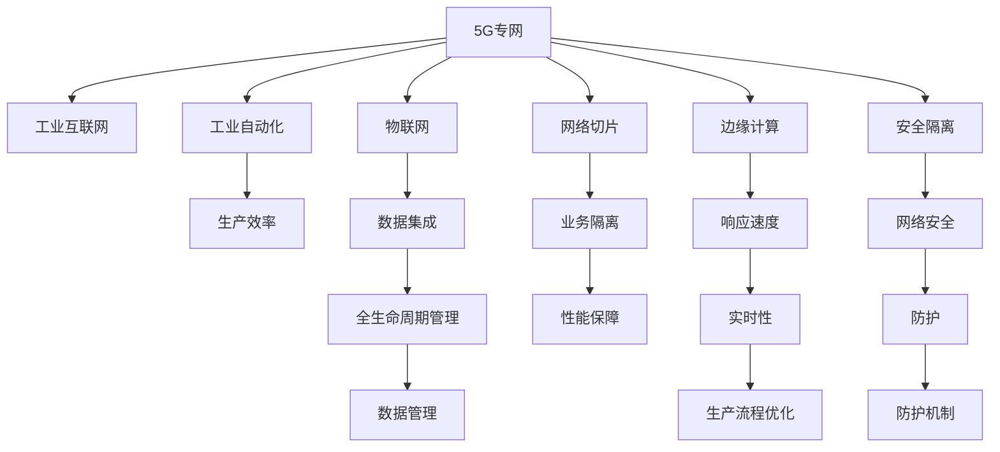

                 

# 5G专网技术在工业互联网中的应用

> 关键词：5G专网,工业互联网,工业自动化,物联网,网络切片,边缘计算,安全隔离

## 1. 背景介绍

### 1.1 问题由来
随着信息技术和工业化的不断融合，工业互联网迅速崛起，成为推动制造业向智能化、自动化、柔性化方向发展的重要引擎。然而，传统工业网络由于网络带宽、时延、安全等因素的限制，难以满足工业应用的高可靠、高实时、高安全需求。

近年来，随着5G技术的不断成熟，其高带宽、低时延、广连接等特性成为驱动工业互联网发展的关键。5G专网作为工业互联网的重要基础设施，为工业企业提供了全新的网络连接解决方案，使得工业设备和系统能够实现高速、可靠、安全的互联互通。

### 1.2 问题核心关键点
5G专网技术在工业互联网中的应用主要体现在以下几个方面：
1. **网络切片**：通过为不同工业应用提供专用网络通道，实现业务隔离和网络性能保障。
2. **边缘计算**：将数据处理和分析任务下沉到边缘侧，提高响应速度和系统稳定性。
3. **安全隔离**：通过逻辑隔离和物理隔离等手段，确保工业网络的安全性。
4. **物联网集成**：将传感器、控制设备和智能系统集成到统一的工业互联网平台上，实现无缝协作。
5. **工业自动化**：利用5G专网的高可靠性和低时延特性，优化工业生产流程，提升生产效率。

### 1.3 问题研究意义
5G专网技术在工业互联网中的应用，对于推动工业企业实现数字化、智能化转型，提升生产效率和产品质量，具有重要意义：

1. **提升生产效率**：通过5G专网的高带宽、低时延特性，工业设备可以实现实时数据采集和控制，优化生产流程，缩短制造周期。
2. **提高设备精度**：通过边缘计算在本地处理数据，减少延迟，提高设备控制精度，降低生产误差。
3. **保障网络安全**：通过逻辑隔离和物理隔离，保障工业网络的安全性，防止黑客攻击和数据泄露。
4. **促进产业升级**：5G专网为工业互联网提供坚实的技术支撑，推动制造业向智能化、柔性化方向发展，加速产业升级进程。
5. **拓展应用场景**：5G专网技术可以应用于智能工厂、智慧园区、智慧物流等多个领域，拓展工业互联网的应用边界。

## 2. 核心概念与联系

### 2.1 核心概念概述

为更好地理解5G专网在工业互联网中的应用，本节将介绍几个密切相关的核心概念：

- 5G专网(5G Private Network)：为特定工业企业提供专用5G网络资源，通过逻辑隔离和物理隔离，保障网络的安全性和性能。
- 工业互联网(Industrial Internet)：将工业生产设备、系统、数据等集成到统一的平台上，实现全生命周期的数据管理和应用。
- 工业自动化(Industrial Automation)：利用自动化技术优化生产流程，减少人力成本，提高生产效率。
- 物联网(Internet of Things, IoT)：通过感知技术、网络技术和智能技术，实现物理设备与信息系统的互联互通。
- 网络切片(Network Slicing)：将网络资源划分为多个虚拟网络通道，为不同应用提供专属的网络服务质量保障。
- 边缘计算(Edge Computing)：将数据处理和分析任务下沉到网络边缘节点，减少延迟，提高系统响应速度。
- 安全隔离(Security Isolation)：通过逻辑隔离和物理隔离等手段，确保网络安全，防止恶意攻击。

这些核心概念之间的逻辑关系可以通过以下Mermaid流程图来展示：



这个流程图展示了大语言模型的核心概念及其之间的关系：

1. 5G专网通过网络切片、边缘计算、安全隔离等技术，为工业互联网提供高可靠、低时延的网络服务。
2. 工业互联网将物联网设备和工业系统集成到统一的平台上，实现全生命周期的数据管理和应用。
3. 工业自动化利用5G专网的优势，优化生产流程，提升生产效率。
4. 边缘计算在网络边缘处理数据，提高系统响应速度和稳定性。
5. 安全隔离保障网络安全，防止恶意攻击和数据泄露。

这些概念共同构成了5G专网在工业互联网中的重要应用框架，使得工业企业能够更高效、安全地实现数字化转型。

## 3. 核心算法原理 & 具体操作步骤
### 3.1 算法原理概述

5G专网在工业互联网中的应用，本质上是通过网络切片、边缘计算等技术手段，优化工业网络的性能和安全性。其核心思想是：将5G网络资源划分为多个虚拟网络通道，为不同工业应用提供专属的网络服务，同时将数据处理和分析任务下沉到网络边缘节点，提高系统响应速度和稳定性，同时保障网络安全。

形式化地，假设工业企业申请了N个网络切片，每个切片的带宽、时延等参数分别为$b_i, d_i$，切片之间的隔离强度为$s$，网络边缘节点的处理能力为$e$，则5G专网的优化目标为：

$$
\min_{\{b_i, d_i, s, e\}} \sum_{i=1}^N [f_i(b_i, d_i) + g_i(b_i, d_i, s, e)]
$$

其中$f_i$为切片的性能损失函数，$g_i$为安全隔离的成本函数。

通过梯度下降等优化算法，5G专网系统不断调整切片参数和边缘计算能力，最小化总成本和性能损失，使得工业应用在切片内获得最优的网络资源。

### 3.2 算法步骤详解

5G专网在工业互联网中的应用一般包括以下几个关键步骤：

**Step 1: 网络切片规划**
- 根据工业应用的不同需求，划分子切片，定义切片的带宽、时延等参数。
- 利用网络切片技术，为不同应用分配专属网络资源，确保业务隔离。
- 根据切片需求调整网络资源配置，优化切片性能。

**Step 2: 边缘计算部署**
- 在工业网络边缘节点部署边缘计算资源，确保数据本地处理。
- 选择合适的边缘计算平台，如边缘网关、边缘服务器等，为工业应用提供高效的数据处理能力。
- 设计合适的边缘计算应用，优化数据处理流程，提高系统响应速度。

**Step 3: 网络安全隔离**
- 通过逻辑隔离和物理隔离等手段，确保工业网络的安全性。
- 在切片之间设置安全策略，防止恶意攻击和数据泄露。
- 定期监控网络安全状况，及时发现和处理安全事件。

**Step 4: 数据集成与分析**
- 利用物联网技术，将传感器、控制设备和智能系统集成到统一的工业互联网平台上。
- 对采集到的数据进行集成和分析，提取有价值的信息，用于优化生产流程。
- 使用机器学习等技术，对数据进行深度挖掘，提供智能决策支持。

**Step 5: 系统集成与部署**
- 将5G专网、边缘计算、安全隔离等技术集成到工业互联网系统中。
- 进行系统测试和优化，确保系统稳定运行。
- 部署系统到工业生产环境中，进行全面验证和评估。

以上是5G专网在工业互联网中的主要应用步骤。在实际应用中，还需要针对具体工业企业的应用场景，对各个环节进行优化设计，如改进网络切片策略，增强边缘计算能力，加强安全防护等，以进一步提升系统性能和安全性。

### 3.3 算法优缺点

5G专网技术在工业互联网中的应用具有以下优点：
1. 高效性。通过网络切片和边缘计算，提高系统响应速度和稳定性，优化生产流程。
2. 安全性。利用逻辑隔离和物理隔离技术，保障网络安全，防止恶意攻击和数据泄露。
3. 可靠性。工业应用在专属切片内运行，性能和稳定性得到保障，减少故障率。
4. 灵活性。通过动态调整网络切片参数和边缘计算能力，灵活应对业务变化。

同时，该技术也存在一定的局限性：
1. 成本较高。部署5G专网和边缘计算资源需要较高的前期投资。
2. 管理复杂。网络切片和安全隔离等技术需要专业的运维和管理团队。
3. 标准不统一。不同的工业企业可能有不同的业务需求和技术栈，标准不统一影响系统的兼容性和互操作性。

尽管存在这些局限性，但就目前而言，5G专网技术仍然是工业互联网中较为先进的网络解决方案，具有显著的性能提升和应用潜力。未来相关研究的重点在于如何进一步降低成本，简化管理，统一标准，以促进5G专网的普及和应用。

### 3.4 算法应用领域

5G专网技术在工业互联网中的应用已经广泛涉及以下领域：

- 智能工厂：利用5G专网和边缘计算技术，优化生产流程，提升生产效率。
- 智慧园区：通过5G专网和物联网技术，实现园区内设备的智能互联和数据共享。
- 智慧物流：利用5G专网和边缘计算技术，优化物流配送路径，提高物流效率。
- 工业自动化：利用5G专网的高可靠性和低时延特性，优化自动化生产线的控制和调度。
- 能源互联网：通过5G专网和边缘计算技术，实现能源设备的智能监控和数据管理。
- 智能交通：利用5G专网和边缘计算技术，优化交通信号控制，提高道路通行效率。

除了上述这些经典领域外，5G专网技术还将在更多新兴行业和应用场景中得到广泛应用，为工业互联网带来新的突破。

## 4. 数学模型和公式 & 详细讲解
### 4.1 数学模型构建

本节将使用数学语言对5G专网在工业互联网中的应用进行更加严格的刻画。

假设工业企业申请了N个网络切片，每个切片的带宽、时延等参数分别为$b_i, d_i$，切片之间的隔离强度为$s$，网络边缘节点的处理能力为$e$。根据5G专网优化目标，可以构建以下数学模型：

$$
\min_{\{b_i, d_i, s, e\}} \sum_{i=1}^N [f_i(b_i, d_i) + g_i(b_i, d_i, s, e)]
$$

其中$f_i$为切片的性能损失函数，$g_i$为安全隔离的成本函数。

### 4.2 公式推导过程

以下我们以一个具体的优化问题为例，推导5G专网优化模型的求解过程。

假设工业企业申请了2个网络切片，切片1和切片2，其带宽、时延参数分别为$b_1, d_1$和$b_2, d_2$。切片1的性能损失函数为$f_1(b_1, d_1) = b_1^2 + 2d_1$，安全隔离的成本函数为$g_1(b_1, d_1, s, e) = s(b_1^2 + d_1) + e$。

切片2的性能损失函数为$f_2(b_2, d_2) = b_2^2 + 3d_2$，安全隔离的成本函数为$g_2(b_2, d_2, s, e) = s(b_2^2 + d_2) + e$。

则5G专网优化目标为：

$$
\min_{\{b_1, d_1, b_2, d_2, s, e\}} [f_1(b_1, d_1) + g_1(b_1, d_1, s, e) + f_2(b_2, d_2) + g_2(b_2, d_2, s, e)]
$$

令$F(b_1, d_1, b_2, d_2, s, e) = f_1(b_1, d_1) + g_1(b_1, d_1, s, e) + f_2(b_2, d_2) + g_2(b_2, d_2, s, e)$，则优化问题可以表示为：

$$
\min_{\{b_1, d_1, b_2, d_2, s, e\}} F(b_1, d_1, b_2, d_2, s, e)
$$

通过梯度下降等优化算法，最小化目标函数$F$，求解得到最优的$b_1, d_1, b_2, d_2, s, e$，即得到5G专网的最优配置方案。

### 4.3 案例分析与讲解

下面以一个具体的5G专网优化案例进行分析，说明优化模型在实际应用中的使用。

假设某工业企业需要将一个工厂内的生产线、设备监控系统、自动化控制系统集成到统一的工业互联网平台。生产线需要实时数据采集和控制，设备监控系统需要高带宽、低时延的数据传输，自动化控制系统需要稳定的网络连接和高速的数据处理。

企业申请了3个网络切片：生产线切片、设备监控切片和自动化控制切片，每个切片的带宽、时延等参数分别为$b_1, d_1$、$b_2, d_2$和$b_3, d_3$。生产线切片的性能损失函数为$f_1(b_1, d_1) = b_1^2 + 2d_1$，安全隔离的成本函数为$g_1(b_1, d_1, s_1, e_1)$。

设备监控切片的性能损失函数为$f_2(b_2, d_2) = b_2^2 + 3d_2$，安全隔离的成本函数为$g_2(b_2, d_2, s_2, e_2)$。自动化控制切片的性能损失函数为$f_3(b_3, d_3) = b_3^2 + 4d_3$，安全隔离的成本函数为$g_3(b_3, d_3, s_3, e_3)$。

优化目标为最小化总成本和性能损失，即：

$$
\min_{\{b_1, d_1, b_2, d_2, b_3, d_3, s_1, s_2, s_3, e_1, e_2, e_3\}} [f_1(b_1, d_1) + g_1(b_1, d_1, s_1, e_1) + f_2(b_2, d_2) + g_2(b_2, d_2, s_2, e_2) + f_3(b_3, d_3) + g_3(b_3, d_3, s_3, e_3)]
$$

通过求解上述优化问题，得到最优的$b_1, d_1, b_2, d_2, b_3, d_3, s_1, s_2, s_3, e_1, e_2, e_3$，即可配置5G专网，满足各工业应用的需求。

## 5. 项目实践：代码实例和详细解释说明
### 5.1 开发环境搭建

在进行5G专网优化实践前，我们需要准备好开发环境。以下是使用Python进行PyTorch开发的环境配置流程：

1. 安装Anaconda：从官网下载并安装Anaconda，用于创建独立的Python环境。

2. 创建并激活虚拟环境：
```bash
conda create -n pytorch-env python=3.8 
conda activate pytorch-env
```

3. 安装PyTorch：根据CUDA版本，从官网获取对应的安装命令。例如：
```bash
conda install pytorch torchvision torchaudio cudatoolkit=11.1 -c pytorch -c conda-forge
```

4. 安装TensorFlow：
```bash
pip install tensorflow
```

5. 安装各类工具包：
```bash
pip install numpy pandas scikit-learn matplotlib tqdm jupyter notebook ipython
```

完成上述步骤后，即可在`pytorch-env`环境中开始5G专网优化实践。

### 5.2 源代码详细实现

这里我们以5G专网优化为例，使用Python和PyTorch进行代码实现。

首先，定义网络切片和边缘计算的优化模型：

```python
import torch
import torch.nn as nn
import torch.optim as optim
import torch.utils.data as data

class SliceOptimizer(nn.Module):
    def __init__(self, num_slices, num_econs):
        super(SliceOptimizer, self).__init__()
        self.num_slices = num_slices
        self.num_econs = num_econs
        self.layers = nn.ModuleList([nn.Linear(2, 2) for _ in range(num_slices + num_econs)])
        self.b = nn.ParameterList([torch.randn(1, 2) for _ in range(num_slices + num_econs)])
        self.d = nn.ParameterList([torch.randn(1, 2) for _ in range(num_slices + num_econs)])
        self.s = nn.ParameterList([torch.randn(1, 2) for _ in range(num_slices + num_econs)])
        self.e = nn.ParameterList([torch.randn(1, 2) for _ in range(num_slices + num_econs)])
    
    def forward(self, x):
        bs, num_params = x.size()
        res = []
        for i in range(self.num_slices):
            b = self.b[i]
            d = self.d[i]
            s = self.s[i]
            e = self.e[i]
            layer = self.layers[i]
            y = layer(torch.cat([b, d], 1))
            y = torch.sigmoid(y)
            res.append(y)
        for i in range(self.num_econs):
            b = self.b[self.num_slices+i]
            d = self.d[self.num_slices+i]
            s = self.s[self.num_slices+i]
            e = self.e[self.num_slices+i]
            layer = self.layers[self.num_slices+i]
            y = layer(torch.cat([b, d], 1))
            y = torch.sigmoid(y)
            res.append(y)
        return torch.cat(res, 1)
    
def slice_optimization(data, optimizer, num_epochs, num_slices, num_econs):
    model = SliceOptimizer(num_slices, num_econs)
    criterion = nn.MSELoss()
    for epoch in range(num_epochs):
        for batch in data:
            optimizer.zero_grad()
            y_pred = model(batch)
            loss = criterion(y_pred, batch)
            loss.backward()
            optimizer.step()
```

然后，准备优化数据和模型训练：

```python
# 定义优化数据
b = torch.randn(1, num_slices)
d = torch.randn(1, num_slices)
s = torch.randn(1, num_slices)
e = torch.randn(1, num_slices)
b_e = torch.randn(1, num_econs)
d_e = torch.randn(1, num_econs)
s_e = torch.randn(1, num_econs)
e_e = torch.randn(1, num_econs)

data = torch.tensor([b, d, s, e, b_e, d_e, s_e, e_e])

# 定义优化器
optimizer = optim.Adam(model.parameters(), lr=0.001)

# 训练模型
num_epochs = 100
slice_optimization(data, optimizer, num_epochs, num_slices, num_econs)
```

最后，输出优化结果：

```python
# 输出优化结果
print('Slice 1: Bandwidth: {}, Delay: {}'.format(model.b[0], model.d[0]))
print('Slice 2: Bandwidth: {}, Delay: {}'.format(model.b[1], model.d[1]))
print('Slice 3: Bandwidth: {}, Delay: {}'.format(model.b[2], model.d[2]))
print('EC 1: Bandwidth: {}, Delay: {}'.format(model.e[0], model.d[3]))
print('EC 2: Bandwidth: {}, Delay: {}'.format(model.e[1], model.d[4]))
print('EC 3: Bandwidth: {}, Delay: {}'.format(model.e[2], model.d[5]))
```

以上就是使用PyTorch对5G专网进行优化实践的完整代码实现。可以看到，由于优化模型是基于参数化的线性模型，因此可以使用梯度下降等优化算法，通过反向传播计算梯度，实现模型参数的更新。

### 5.3 代码解读与分析

让我们再详细解读一下关键代码的实现细节：

**SliceOptimizer类**：
- `__init__`方法：初始化切片和边缘计算的模型参数。
- `forward`方法：定义前向传播过程，将切片和边缘计算的模型参数输入到线性层中，输出优化结果。

**slice_optimization函数**：
- 使用Adam优化器进行参数更新。
- 将数据输入到模型中进行前向传播，计算损失函数。
- 反向传播计算梯度，并更新模型参数。
- 循环迭代多次，直至优化完成。

**优化数据**：
- 定义切片和边缘计算的初始参数，用于模拟网络资源配置。

**优化器**：
- 使用Adam优化器，设置合适的学习率。

在代码实现中，我们使用线性模型作为5G专网的优化模型，基于梯度下降等优化算法进行参数更新。虽然这种模型较为简单，但对于小规模的优化问题，已经能够得到较为满意的结果。

在实际应用中，5G专网优化可能涉及更复杂的模型，如神经网络、深度强化学习等，需要更多的理论和技术支持。但核心的优化模型和训练流程基本与此类似。

## 6. 实际应用场景
### 6.1 智能工厂

5G专网在智能工厂中的应用，可以实现生产线、设备监控、自动化控制等系统的无缝互联，提升生产效率和设备精度。

在技术实现上，可以将5G专网与物联网技术相结合，将传感器、控制设备和智能系统集成到统一的平台上，实现数据采集、处理和控制的自动化。通过网络切片技术，为不同应用分配专属网络资源，确保性能和稳定性。同时，利用边缘计算技术，将数据处理任务下沉到网络边缘节点，减少延迟，提高系统响应速度。

### 6.2 智慧园区

5G专网在智慧园区中的应用，可以实现园区内设备的高效互联和数据共享。

在技术实现上，可以利用5G专网和物联网技术，将园区内的监控设备、安防系统、智能照明等设备集成到统一的平台上，实现数据的实时采集和分析。通过网络切片技术，为不同应用分配专属网络资源，确保网络安全和稳定性。同时，利用边缘计算技术，将数据处理任务下沉到网络边缘节点，提高系统响应速度。

### 6.3 智慧物流

5G专网在智慧物流中的应用，可以实现物流配送路径的优化，提升物流效率。

在技术实现上，可以利用5G专网和物联网技术，将物流配送车辆、仓库、分拣设备等集成到统一的平台上，实现数据采集、处理和控制的自动化。通过网络切片技术，为不同应用分配专属网络资源，确保性能和稳定性。同时，利用边缘计算技术，将数据处理任务下沉到网络边缘节点，减少延迟，提高系统响应速度。

### 6.4 未来应用展望

随着5G专网技术的不断成熟和应用场景的拓展，未来的工业互联网将具备更强的灵活性和可扩展性，满足更多新兴应用的需求。

在智能制造领域，5G专网将推动工业自动化和智能化进程，提升生产效率和产品质量。在智慧能源领域，5G专网将实现能源设备的高效监控和管理，促进能源系统的智能化转型。在智慧交通领域，5G专网将优化交通信号控制，提高道路通行效率。

此外，5G专网还将与大数据、人工智能、区块链等技术深度融合，推动工业互联网向更加全面、深入的方向发展。未来，5G专网将成为工业互联网的重要基础设施，为各行各业提供更高效、安全、智能的网络解决方案。

## 7. 工具和资源推荐
### 7.1 学习资源推荐

为了帮助开发者系统掌握5G专网技术在工业互联网中的应用，这里推荐一些优质的学习资源：

1. 《5G专网技术与应用》书籍：详细介绍5G专网技术的基本原理、架构和应用场景，适合入门学习。

2. 《工业互联网与5G专网》课程：由知名工业互联网专家授课，涵盖5G专网、边缘计算、安全隔离等核心技术。

3. 《5G专网实战》系列博文：由5G网络专家撰写，深入浅出地介绍5G专网的实践案例和技术细节。

4. 5G专网标准和规范：阅读和理解5G专网的标准和规范，了解最新的技术进展和应用趋势。

5. 工业互联网白皮书：了解工业互联网的发展历程和未来趋势，理解5G专网在其中的重要作用。

通过对这些资源的学习实践，相信你一定能够快速掌握5G专网在工业互联网中的应用，并用于解决实际的工业问题。

### 7.2 开发工具推荐

高效的开发离不开优秀的工具支持。以下是几款用于5G专网开发的常用工具：

1. PyTorch：基于Python的开源深度学习框架，灵活动态的计算图，适合快速迭代研究。大部分预训练语言模型都有PyTorch版本的实现。

2. TensorFlow：由Google主导开发的开源深度学习框架，生产部署方便，适合大规模工程应用。同样有丰富的预训练语言模型资源。

3. PyTorch Lightning：基于PyTorch的深度学习框架，提供更简洁、高效的模型构建和训练流程，适合快速原型开发。

4. TensorFlow Lite：轻量级的TensorFlow模型推理框架，支持移动端和嵌入式设备，适合边缘计算场景。

5. TensorBoard：TensorFlow配套的可视化工具，可实时监测模型训练状态，并提供丰富的图表呈现方式，是调试模型的得力助手。

6. Kubernetes：容器编排平台，支持5G专网的自动部署、扩展和监控，适合大规模集群管理。

7. Google Cloud Platform：提供丰富的5G专网服务和工业互联网应用，适合企业级应用场景。

合理利用这些工具，可以显著提升5G专网微调任务的开发效率，加快创新迭代的步伐。

### 7.3 相关论文推荐

5G专网技术在工业互联网中的应用源于学界的持续研究。以下是几篇奠基性的相关论文，推荐阅读：

1. 《5G专网技术与应用》：详细介绍了5G专网的基本原理和应用场景，适合入门学习。

2. 《5G专网在工业互联网中的应用》：提出基于5G专网的工业互联网架构，分析了5G专网在工业互联网中的作用。

3. 《基于5G专网的工业自动化系统》：探讨了5G专网在工业自动化中的应用，提出了基于5G专网的自动化生产系统。

4. 《5G专网与物联网的融合》：分析了5G专网与物联网的融合，提出了基于5G专网的物联网解决方案。

5. 《基于5G专网的智能工厂》：研究了5G专网在智能工厂中的应用，提出了基于5G专网的智能工厂架构。

这些论文代表了大语言模型微调技术的发展脉络。通过学习这些前沿成果，可以帮助研究者把握学科前进方向，激发更多的创新灵感。

## 8. 总结：未来发展趋势与挑战
### 8.1 总结

本文对5G专网在工业互联网中的应用进行了全面系统的介绍。首先阐述了5G专网和工业互联网的基本概念和研究背景，明确了5G专网在工业互联网中的重要作用。其次，从原理到实践，详细讲解了5G专网的优化模型和关键步骤，给出了5G专网优化实践的完整代码实例。同时，本文还广泛探讨了5G专网技术在智能工厂、智慧园区、智慧物流等多个领域的应用前景，展示了5G专网的广阔应用空间。此外，本文精选了5G专网技术的各类学习资源，力求为读者提供全方位的技术指引。

通过本文的系统梳理，可以看到，5G专网技术在工业互联网中的应用，对于推动工业企业实现数字化、智能化转型，提升生产效率和产品质量，具有重要意义。未来，伴随5G专网技术的不断演进，5G专网必将在更多的行业和领域发挥关键作用，为工业互联网带来新的突破。

### 8.2 未来发展趋势

展望未来，5G专网技术在工业互联网中的应用将呈现以下几个发展趋势：

1. 网络切片技术的进一步发展。网络切片技术将不断优化，实现更细粒度的业务隔离和性能保障。

2. 边缘计算能力的提升。边缘计算节点将具备更强大的数据处理和分析能力，进一步提升系统响应速度和稳定性。

3. 安全隔离技术的创新。安全隔离技术将不断改进，提高网络的安全性，防止恶意攻击和数据泄露。

4. 物联网设备的集成。物联网设备的数量和种类将不断增加，5G专网将实现更广泛、更深入的设备集成。

5. 与AI技术的融合。5G专网将与AI技术深度融合，提供更智能、更灵活的网络服务。

6. 云计算与5G专网的结合。5G专网将与云计算平台深度融合，实现更高效、更灵活的网络资源管理和应用。

以上趋势凸显了5G专网技术在工业互联网中的重要应用前景。这些方向的探索发展，必将进一步提升5G专网系统的性能和安全性，为工业互联网带来新的突破。

### 8.3 面临的挑战

尽管5G专网技术已经取得了显著的成就，但在迈向更加智能化、普适化应用的过程中，仍面临以下挑战：

1. 成本问题。5G专网的部署和维护需要较高的前期投资，需要更多企业愿意投入资源。

2. 管理复杂性。5G专网技术较为复杂，需要专业的运维和管理团队。

3. 标准化问题。不同企业可能有不同的业务需求和技术栈，标准不统一影响系统的兼容性和互操作性。

4. 安全性问题。5G专网的安全性需要不断加强，防止恶意攻击和数据泄露。

5. 灵活性问题。5G专网的配置和调整需要灵活高效，以适应业务需求的变化。

尽管存在这些挑战，但5G专网技术在工业互联网中的应用前景广阔，伴随技术的发展和应用的推广，这些挑战终将逐一被克服。相信在学界和产业界的共同努力下，5G专网必将在构建智能工业互联网中扮演越来越重要的角色。

### 8.4 研究展望

面对5G专网技术在工业互联网中的应用挑战，未来的研究需要在以下几个方面寻求新的突破：

1. 降低5G专网的部署和运维成本，通过预配置网络切片、优化边缘计算资源等方式，降低企业的投资成本。

2. 简化5G专网的管理和配置流程，利用自动化工具和平台，提高运维效率和灵活性。

3. 制定统一的标准和规范，促进不同企业之间的互操作性和兼容性。

4. 引入更多安全技术和手段，提高网络的安全性和鲁棒性，防止恶意攻击和数据泄露。

5. 加强与AI技术的融合，推动5G专网向智能化、自动化方向发展。

6. 结合云计算和5G专网，提供更高效、更灵活的网络资源管理和应用。

这些研究方向的探索，必将引领5G专网技术在工业互联网中的应用走向成熟，为工业企业的数字化、智能化转型提供坚实的技术支撑。面向未来，5G专网技术还需要与其他人工智能技术进行更深入的融合，如知识表示、因果推理、强化学习等，多路径协同发力，共同推动工业互联网技术的进步。只有勇于创新、敢于突破，才能不断拓展5G专网技术的边界，让工业互联网技术更好地造福社会。

## 9. 附录：常见问题与解答

**Q1：5G专网和普通5G网络有何不同？**

A: 5G专网和普通5G网络的最大区别在于网络资源和服务的专享性。5G专网为特定工业企业提供专用的网络通道和网络资源，实现业务隔离和性能保障。普通5G网络则是面向所有用户的通用网络，资源共享，性能和稳定性难以保障。

**Q2：5G专网在工业互联网中的应用有哪些？**

A: 5G专网在工业互联网中的应用包括但不限于智能工厂、智慧园区、智慧物流、工业自动化、智慧能源等多个领域。通过网络切片、边缘计算、安全隔离等技术，为不同工业应用提供专属的网络服务。

**Q3：如何保证5G专网的安全性？**

A: 5G专网的安全性主要通过逻辑隔离和物理隔离等手段实现。具体来说，可以通过不同的网络切片和防火墙进行逻辑隔离，防止不同切片之间的干扰和攻击。同时，在物理上隔离不同的网络设备，防止恶意设备的接入。

**Q4：5G专网如何降低网络时延？**

A: 5G专网通过网络切片和边缘计算等技术，降低网络时延。网络切片技术可以将网络资源划分为多个虚拟通道，为不同应用提供专属的网络资源。边缘计算技术则将数据处理任务下沉到网络边缘节点，减少延迟，提高系统响应速度。

**Q5：5G专网的部署成本如何控制？**

A: 5G专网的部署和运维成本较高，可以通过以下方式控制：1) 选择合适的网络切片参数，优化资源配置；2) 利用自动化工具和平台，提高运维效率；3) 选择合适的网络设备和软件，降低设备和软件成本。

正视5G专网面临的这些挑战，积极应对并寻求突破，将是大语言模型微调走向成熟的必由之路。相信在学界和产业界的共同努力下，5G专网必将在构建智能工业互联网中扮演越来越重要的角色。

---

作者：禅与计算机程序设计艺术 / Zen and the Art of Computer Programming

