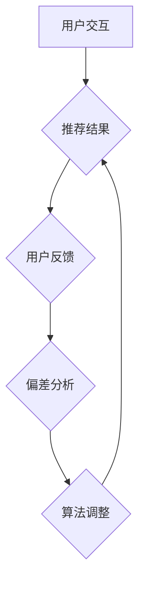

> 智能推荐系统, 反思机制, 偏差修正, 鲁棒性, 可解释性, 算法优化, 用户反馈

## 1. 背景介绍

智能推荐系统已经成为现代互联网应用中不可或缺的一部分，它通过分析用户行为、偏好和历史数据，为用户提供个性化的商品、内容或服务推荐。然而，传统的基于协同过滤或内容过滤的推荐算法存在一些固有的缺陷，例如数据稀疏性、冷启动问题和推荐结果的不可解释性。

随着人工智能技术的快速发展，反思机制逐渐成为智能推荐系统的重要研究方向。反思机制的核心思想是让推荐系统能够不断反思自身推荐结果，并根据用户反馈进行调整和优化，从而提高推荐系统的准确性和鲁棒性。

## 2. 核心概念与联系

**2.1 反思机制**

反思机制是指系统能够对自身行为进行自我评估和修正的过程。在智能推荐系统中，反思机制可以帮助系统识别和纠正推荐偏差，提高推荐结果的准确性和用户满意度。

**2.2 偏差修正**

偏差是指推荐系统在推荐过程中产生的误差或偏向。常见的偏差包括：

* **信息偏差:**  由于数据不完整或不准确，导致推荐结果不准确。
* **算法偏差:**  推荐算法本身存在缺陷，导致推荐结果存在偏向。
* **用户偏差:**  用户行为或偏好存在不确定性，导致推荐结果难以准确预测。

反思机制可以通过收集用户反馈、分析推荐结果和识别偏差，从而进行偏差修正，提高推荐系统的准确性。

**2.3 鲁棒性**

鲁棒性是指推荐系统对噪声、异常值和数据变化的抵抗能力。反思机制可以帮助推荐系统增强鲁棒性，使其能够在面对不确定性和变化的环境下仍然提供可靠的推荐结果。

**2.4 可解释性**

可解释性是指用户能够理解推荐系统的推荐理由和决策过程。反思机制可以帮助推荐系统提高可解释性，使其能够向用户解释推荐结果背后的逻辑，从而增强用户信任和满意度。

**2.5 算法优化**

反思机制可以帮助推荐系统不断优化算法参数和模型结构，从而提高推荐效果。

**Mermaid 流程图**



## 3. 核心算法原理 & 具体操作步骤

**3.1 算法原理概述**

反思机制在智能推荐系统中的应用主要基于以下核心算法原理：

* **用户反馈分析:** 收集用户对推荐结果的反馈信息，例如点击、评分、购买等行为。
* **偏差检测:** 利用统计学方法和机器学习算法检测推荐系统中的偏差，例如冷启动问题、数据稀疏性等。
* **模型更新:** 根据用户反馈和偏差检测结果，更新推荐系统的模型参数和算法结构，从而提高推荐效果。

**3.2 算法步骤详解**

1. **数据收集:** 收集用户行为数据、商品信息、内容标签等相关数据。
2. **预处理:** 对数据进行清洗、转换和特征提取，以便于后续算法的训练和应用。
3. **模型训练:** 利用机器学习算法训练推荐模型，例如协同过滤、内容过滤、深度学习等。
4. **推荐生成:** 根据用户特征和模型预测，生成个性化的推荐结果。
5. **用户反馈收集:** 收集用户对推荐结果的反馈信息，例如点击、评分、购买等行为。
6. **偏差检测:** 利用统计学方法和机器学习算法检测推荐系统中的偏差，例如冷启动问题、数据稀疏性等。
7. **模型更新:** 根据用户反馈和偏差检测结果，更新推荐系统的模型参数和算法结构，从而提高推荐效果。

**3.3 算法优缺点**

**优点:**

* 能够不断学习和优化，提高推荐效果。
* 能够识别和纠正推荐偏差，提高推荐结果的准确性。
* 能够增强推荐系统的鲁棒性，使其能够在面对不确定性和变化的环境下仍然提供可靠的推荐结果。

**缺点:**

* 需要大量的用户反馈数据进行训练和优化。
* 算法的复杂度较高，需要专业的技术人员进行开发和维护。

**3.4 算法应用领域**

反思机制在智能推荐系统中的应用领域非常广泛，例如：

* **电商推荐:** 为用户推荐个性化的商品。
* **内容推荐:** 为用户推荐个性化的新闻、视频、音乐等内容。
* **社交推荐:** 为用户推荐新的朋友和兴趣小组。
* **医疗推荐:** 为患者推荐个性化的医疗方案。

## 4. 数学模型和公式 & 详细讲解 & 举例说明

**4.1 数学模型构建**

假设我们有一个推荐系统，它需要为用户u推荐物品i。我们可以使用以下数学模型来表示用户对物品的偏好：

$$
r_{ui} = f(u, i, h)
$$

其中：

* $r_{ui}$ 表示用户u对物品i的评分或偏好度。
* $u$ 表示用户u的特征向量。
* $i$ 表示物品i的特征向量。
* $h$ 表示推荐系统的隐含特征向量。
* $f$ 表示一个函数，它将用户特征、物品特征和隐含特征向量映射到评分或偏好度。

**4.2 公式推导过程**

我们可以使用机器学习算法，例如协同过滤或深度学习，来训练这个模型。

协同过滤算法基于用户的历史行为数据，学习用户之间的相似性，并推荐用户喜欢的物品。

深度学习算法可以学习用户和物品的复杂特征关系，并生成更准确的推荐结果。

**4.3 案例分析与讲解**

例如，我们可以使用协同过滤算法来推荐电影。

首先，我们收集用户对电影的评分数据。然后，我们使用协同过滤算法计算用户之间的相似性，并推荐用户喜欢的电影。

如果用户A和用户B对很多电影的评分都相似，那么我们认为用户A和用户B的口味相似。

因此，如果用户A喜欢一部电影，那么我们就可以推荐这部电影给用户B。

## 5. 项目实践：代码实例和详细解释说明

**5.1 开发环境搭建**

* Python 3.x
* TensorFlow 或 PyTorch
* Scikit-learn

**5.2 源代码详细实现**

```python
# 协同过滤推荐算法示例

import numpy as np
from sklearn.metrics.pairwise import cosine_similarity

# 用户评分数据
ratings = np.array([
    [5, 4, 3, 2, 1],
    [4, 5, 2, 1, 3],
    [3, 2, 5, 4, 1],
    [2, 1, 4, 5, 3],
    [1, 3, 1, 3, 5]
])

# 计算用户之间的相似度
user_similarity = cosine_similarity(ratings)

# 获取用户1的相似用户
similar_users = np.argsort(user_similarity[0])[::-1][1:]

# 推荐给用户1的电影
recommendations = np.mean(ratings[similar_users], axis=0)

# 打印推荐结果
print(recommendations)
```

**5.3 代码解读与分析**

* 首先，我们定义了一个用户评分数据矩阵。
* 然后，我们使用cosine_similarity函数计算用户之间的相似度。
* 接着，我们获取用户1的相似用户，并计算这些用户对电影的平均评分。
* 最后，我们打印推荐结果。

**5.4 运行结果展示**

运行上述代码，可以得到用户1的推荐电影列表。

## 6. 实际应用场景

**6.1 电商推荐**

反思机制可以帮助电商平台根据用户的购买历史、浏览记录和评价信息，推荐更符合用户需求的商品。

**6.2 内容推荐**

反思机制可以帮助新闻网站、视频平台和音乐平台根据用户的阅读、观看和听取习惯，推荐更符合用户兴趣的内容。

**6.3 社交推荐**

反思机制可以帮助社交平台根据用户的兴趣爱好、好友关系和社交行为，推荐新的朋友和兴趣小组。

**6.4 未来应用展望**

随着人工智能技术的不断发展，反思机制在智能推荐系统中的应用将更加广泛和深入。

例如，未来我们可以看到：

* 基于深度学习的反思机制，能够学习用户更复杂的特征关系，生成更精准的推荐结果。
* 基于强化学习的反思机制，能够通过与用户的交互学习，不断优化推荐策略。
* 基于联邦学习的反思机制，能够在保护用户隐私的前提下，实现跨平台的推荐数据共享和模型训练。

## 7. 工具和资源推荐

**7.1 学习资源推荐**

* **书籍:**
    * 《推荐系统》
    * 《深度学习》
    * 《机器学习》
* **在线课程:**
    * Coursera: Recommender Systems
    * edX: Machine Learning
* **博客:**
    * Recommenderlab
    * KDnuggets

**7.2 开发工具推荐**

* **Python:**
    * TensorFlow
    * PyTorch
    * Scikit-learn
* **Spark:**
    * MLlib

**7.3 相关论文推荐**

* **Collaborative Filtering for Implicit Feedback Datasets**
* **Deep Learning for Recommender Systems**
* **Reinforcement Learning for Recommender Systems**

## 8. 总结：未来发展趋势与挑战

**8.1 研究成果总结**

反思机制在智能推荐系统中的应用取得了显著的成果，能够提高推荐效果、增强鲁棒性和可解释性。

**8.2 未来发展趋势**

未来，反思机制在智能推荐系统中的应用将更加深入和广泛，例如：

* 基于深度学习和强化学习的反思机制
* 基于联邦学习的跨平台推荐数据共享和模型训练
* 更个性化、更精准、更智能的推荐系统

**8.3 面临的挑战**

反思机制在实际应用中也面临一些挑战，例如：

* 需要大量的用户反馈数据进行训练和优化
* 算法的复杂度较高，需要专业的技术人员进行开发和维护
* 如何平衡推荐效果和用户隐私保护

**8.4 研究展望**

未来，我们需要继续探索更有效的反思机制，并解决其面临的挑战，从而推动智能推荐系统的进一步发展。

## 9. 附录：常见问题与解答

**9.1 如何收集用户反馈数据？**

我们可以通过以下方式收集用户反馈数据：

* 点击、评分、购买等行为数据
* 用户评论和反馈
* A/B测试

**9.2 如何评估反思机制的效果？**

我们可以使用以下指标评估反思机制的效果：

* 点击率
* 购买率
* 用户满意度

**9.3 如何保护用户隐私？**

我们可以采用以下方法保护用户隐私：

* 数据匿名化
* 联邦学习

作者：禅与计算机程序设计艺术 / Zen and the Art of Computer Programming


<end_of_turn>