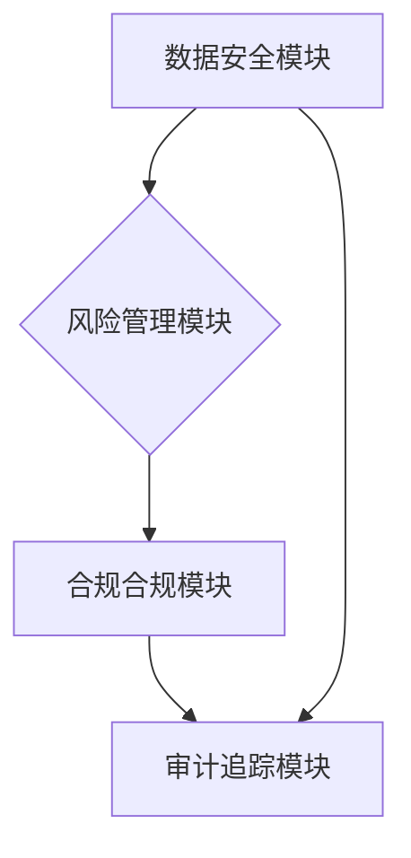

> 规控架构、金融科技、数据安全、风险管理、人工智能、云计算、区块链

## 1. 背景介绍

近年来，随着金融科技的蓬勃发展，国内头部金融机构积极探索数字化转型，构建更加智能化、高效化的业务运营模式。然而，在追求创新和效率的同时，金融机构也面临着日益严峻的监管要求和数据安全风险。如何有效平衡创新发展与风险控制，成为摆在金融机构面前的一道难题。

规控架构作为金融机构数字化转型的重要基石，承担着保障业务安全、合规运营、风险可控的重要责任。它涵盖了数据安全、风险管理、合规合规、审计追踪等多个关键领域，为金融机构提供了一套完整的风险管理体系和合规保障机制。

## 2. 核心概念与联系

**2.1 规控架构的概念**

规控架构是指金融机构在数字化转型过程中，构建的一套以风险管理为核心，涵盖数据安全、合规合规、审计追踪等多个关键领域的系统架构。它旨在通过技术手段，实现对金融业务的全面监控和控制，保障业务安全、合规运营、风险可控。

**2.2 规控架构与金融科技的关系**

金融科技的快速发展为规控架构带来了新的机遇和挑战。一方面，金融科技的应用可以帮助金融机构提升规控效率，降低成本，实现更精准的风险管理。另一方面，金融科技的复杂性也加剧了规控架构的建设难度，需要金融机构不断探索新的技术手段和解决方案。

**2.3 规控架构的组成部分**

规控架构通常由以下几个关键模块组成：

* **数据安全模块:** 负责对金融机构的数据进行安全保护，包括数据加密、访问控制、数据备份等。
* **风险管理模块:** 负责对金融机构的业务风险进行识别、评估和控制，包括信用风险、市场风险、操作风险等。
* **合规合规模块:** 负责确保金融机构的业务活动符合相关法律法规和行业规范。
* **审计追踪模块:** 负责对金融机构的业务活动进行记录和追踪，以便于后续的审计和调查。

**2.4 规控架构的架构图**



## 3. 核心算法原理 & 具体操作步骤

**3.1 算法原理概述**

规控架构中常用的算法包括风险评估算法、欺诈检测算法、数据加密算法等。这些算法通常基于统计学、机器学习、人工智能等技术，能够对金融机构的业务数据进行分析和处理，从而实现风险控制、合规合规、数据安全等目标。

**3.2 算法步骤详解**

以风险评估算法为例，其具体操作步骤如下：

1. **数据收集:** 收集金融机构的业务数据，包括客户信息、交易记录、风险指标等。
2. **数据预处理:** 对收集到的数据进行清洗、转换、编码等预处理操作，使其符合算法的输入要求。
3. **特征提取:** 从预处理后的数据中提取关键特征，例如客户信用评分、交易金额、交易频率等。
4. **模型训练:** 使用机器学习算法对提取的特征进行训练，建立风险评估模型。
5. **风险评估:** 将新客户或交易数据输入到训练好的模型中，预测其风险等级。
6. **风险控制:** 根据风险等级，采取相应的风险控制措施，例如拒绝贷款申请、限制交易额度等。

**3.3 算法优缺点**

风险评估算法具有以下优点：

* **自动化程度高:** 可以自动对大量数据进行分析和评估，提高效率。
* **精准度高:** 基于机器学习算法，能够识别出传统方法难以发现的风险。
* **可扩展性强:** 可以根据业务需求不断调整模型参数和算法，适应不断变化的风险环境。

风险评估算法也存在一些缺点：

* **数据依赖性强:** 算法的准确性依赖于数据的质量和数量。
* **解释性差:** 机器学习算法的决策过程较为复杂，难以解释其背后的逻辑。
* **可解释性差:** 机器学习算法的决策过程较为复杂，难以解释其背后的逻辑。

**3.4 算法应用领域**

风险评估算法广泛应用于金融机构的各个领域，例如：

* **贷款审批:** 评估客户的信用风险，决定是否批准贷款申请。
* **交易风控:** 识别和预防欺诈交易、洗钱等违规行为。
* **投资组合管理:** 评估投资组合的风险水平，优化投资策略。

## 4. 数学模型和公式 & 详细讲解 & 举例说明

**4.1 数学模型构建**

风险评估模型通常采用统计学和机器学习方法构建。常见的数学模型包括线性回归模型、逻辑回归模型、支持向量机模型、决策树模型等。

**4.2 公式推导过程**

以线性回归模型为例，其目标是找到一条直线，能够最佳地拟合数据点之间的关系。模型的公式如下：

$$y = \beta_0 + \beta_1x_1 + \beta_2x_2 + ... + \beta_nx_n + \epsilon$$

其中：

* $y$ 是预测的风险等级
* $x_1, x_2, ..., x_n$ 是输入特征
* $\beta_0, \beta_1, ..., \beta_n$ 是模型参数
* $\epsilon$ 是误差项

模型参数可以通过最小二乘法等方法进行估计。

**4.3 案例分析与讲解**

假设我们想要构建一个评估客户贷款风险的模型，输入特征包括客户的年龄、收入、信用评分等。通过训练线性回归模型，我们可以得到模型参数，并使用这些参数对新客户进行风险评估。

例如，如果新客户的年龄为30岁，收入为50000元，信用评分为700，则模型可以预测其贷款风险等级为中等。

## 5. 项目实践：代码实例和详细解释说明

**5.1 开发环境搭建**

规控架构的开发环境通常包括以下软件：

* 操作系统: Linux, Windows
* 编程语言: Python, Java
* 数据存储: MySQL, MongoDB
* 云计算平台: AWS, Azure, Alibaba Cloud

**5.2 源代码详细实现**

以下是一个使用Python语言实现风险评估模型的简单代码示例：

```python
import pandas as pd
from sklearn.linear_model import LogisticRegression

# 加载数据
data = pd.read_csv("loan_data.csv")

# 划分训练集和测试集
X = data.drop("risk_level", axis=1)
y = data["risk_level"]
from sklearn.model_selection import train_test_split
X_train, X_test, y_train, y_test = train_test_split(X, y, test_size=0.2, random_state=42)

# 训练模型
model = LogisticRegression()
model.fit(X_train, y_train)

# 评估模型性能
from sklearn.metrics import accuracy_score
y_pred = model.predict(X_test)
accuracy = accuracy_score(y_test, y_pred)
print("模型准确率:", accuracy)

# 使用模型预测新客户的风险等级
new_customer_data = pd.DataFrame({
    "age": [30],
    "income": [50000],
    "credit_score": [700]
})
predicted_risk_level = model.predict(new_customer_data)
print("新客户的风险等级:", predicted_risk_level)
```

**5.3 代码解读与分析**

这段代码首先加载贷款数据，然后使用sklearn库中的train_test_split函数将数据划分成训练集和测试集。接着，使用LogisticRegression模型训练风险评估模型。最后，使用模型预测新客户的风险等级，并输出模型的准确率。

**5.4 运行结果展示**

运行这段代码后，会输出模型的准确率和新客户的风险等级。

## 6. 实际应用场景

**6.1 金融风险管理**

规控架构在金融风险管理方面发挥着重要作用，可以帮助金融机构识别、评估和控制各种风险，例如信用风险、市场风险、操作风险等。

**6.2 数据安全保障**

规控架构可以帮助金融机构加强数据安全保障，防止数据泄露、数据篡改等安全事件发生。

**6.3 合规合规运营**

规控架构可以帮助金融机构确保其业务活动符合相关法律法规和行业规范，避免违规操作和法律风险。

**6.4 审计追踪**

规控架构可以对金融机构的业务活动进行记录和追踪，方便后续的审计和调查。

**6.5 未来应用展望**

随着人工智能、区块链等技术的不断发展，规控架构将更加智能化、自动化、安全可靠。未来，规控架构将更加深入地融入金融机构的业务流程，为金融机构提供更加全面的风险管理、合规合规、数据安全保障。

## 7. 工具和资源推荐

**7.1 学习资源推荐**

* **书籍:**
    * 《金融科技》
    * 《规控架构设计与实践》
* **在线课程:**
    * Coursera: Financial Technology
    * edX: Blockchain and Cryptocurrency

**7.2 开发工具推荐**

* **编程语言:** Python, Java
* **数据存储:** MySQL, MongoDB
* **云计算平台:** AWS, Azure, Alibaba Cloud

**7.3 相关论文推荐**

* 《金融科技与规控架构的融合》
* 《基于人工智能的金融风险管理》

## 8. 总结：未来发展趋势与挑战

**8.1 研究成果总结**

本文介绍了国内头部玩家的规控架构现状，包括核心概念、架构组成、算法原理、项目实践等方面。

**8.2 未来发展趋势**

未来，规控架构将朝着以下方向发展：

* **智能化:** 利用人工智能、机器学习等技术，实现风险管理的自动化和智能化。
* **自动化:** 利用自动化技术，提高规控流程的效率和准确性。
* **安全可靠:** 加强数据安全保障，防止数据泄露和攻击。
* **可扩展性:** 能够适应金融机构业务的不断变化和发展。

**8.3 面临的挑战**

规控架构的建设也面临着一些挑战：

* **技术复杂性:** 规控架构涉及多个技术领域，需要具备丰富的技术经验和专业知识。
* **数据质量:** 规控架构的准确性依赖于数据的质量，需要保证数据的准确性、完整性和及时性。
* **监管要求:** 规控架构需要满足不断变化的监管要求，需要进行持续的更新和改进。

**8.4 研究展望**

未来，我们将继续深入研究规控架构的理论和实践，探索新的技术手段和解决方案，为金融机构提供更加安全、可靠、高效的规控保障。

## 9. 附录：常见问题与解答

**9.1 如何选择合适的规控架构方案？**

选择合适的规控架构方案需要根据金融机构的业务特点、风险承受能力、技术水平等因素进行综合考虑。

**9.2 如何保证规控架构的安全性？**

可以通过采用多层安全防护机制、加密技术、身份认证等手段保障规控架构的安全性。

**9.3 如何进行规控架构的持续改进？**

需要定期对规控架构进行评估和测试，根据实际情况进行调整和优化。

作者：禅与计算机程序设计艺术 / Zen and the Art of Computer Programming


<end_of_turn>