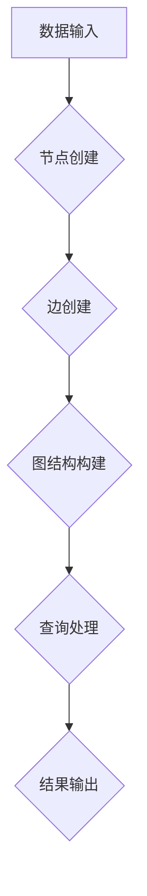

> 图数据库、节点、边、关系、查询语言、算法、Neo4j、Graphviz、数据可视化

## 1. 背景介绍

随着互联网和移动互联网的快速发展，数据呈爆炸式增长，传统的关系型数据库已经难以满足对复杂数据关系的存储和查询需求。图数据库作为一种新型的数据库，凭借其强大的数据建模能力和高效的查询性能，在社交网络、推荐系统、知识图谱、欺诈检测等领域得到了广泛应用。

图数据库的核心思想是将数据表示为节点和边构成的图结构。节点代表实体，边代表实体之间的关系。这种数据模型能够更直观地反映现实世界中的复杂关系，并支持灵活的查询和分析。

## 2. 核心概念与联系

图数据库的核心概念包括：

* **节点 (Node):** 图数据库中的基本单元，代表一个实体，例如用户、商品、文章等。每个节点都具有唯一的标识符和一组属性。
* **边 (Edge):** 连接两个节点的线，代表实体之间的关系，例如“关注”、“购买”、“评论”等。边也具有属性，可以描述关系的类型、强度、时间等信息。
* **关系 (Relationship):** 边所代表的关系类型，例如“关注”、“购买”、“评论”等。关系可以是单向的，也可以是双向的。
* **图 (Graph):** 由节点和边组成的集合，代表一个完整的知识图谱或数据模型。

**图数据库架构流程图:**



## 3. 核心算法原理 & 具体操作步骤

### 3.1  算法原理概述

图数据库的核心算法主要包括：

* **路径查找算法:** 用于在图中找到指定节点之间的路径，例如寻找用户之间的社交关系路径。常见的路径查找算法包括广度优先搜索 (BFS) 和深度优先搜索 (DFS)。
* **社区发现算法:** 用于发现图中紧密连接的节点子集，例如发现社交网络中的兴趣小组或用户群。常见的社区发现算法包括 Louvain算法和 Girvan-Newman算法。
* **节点分类算法:** 用于根据节点的属性和连接关系对节点进行分类，例如将用户根据兴趣爱好进行分类。常见的节点分类算法包括标签传播算法和谱聚类算法。

### 3.2  算法步骤详解

以广度优先搜索 (BFS) 算法为例，其步骤如下：

1. 从起始节点开始，将起始节点加入到队列中。
2. 从队列中取出第一个节点，并遍历其所有相邻节点。
3. 将所有未被访问过的相邻节点加入到队列中。
4. 重复步骤2和步骤3，直到队列为空。

### 3.3  算法优缺点

**BFS 算法的优点:**

* 能够找到最短路径。
* 算法实现简单。

**BFS 算法的缺点:**

* 对于大型图，时间复杂度较高。
* 无法处理有权重的图。

### 3.4  算法应用领域

图数据库的算法广泛应用于以下领域:

* **社交网络分析:** 发现用户之间的关系、兴趣小组、病毒传播路径等。
* **推荐系统:** 基于用户行为和商品关系进行商品推荐。
* **知识图谱构建:** 建立知识图谱，用于知识发现、推理和问答。
* **欺诈检测:** 识别异常行为和欺诈模式。

## 4. 数学模型和公式 & 详细讲解 & 举例说明

### 4.1  数学模型构建

图数据库可以用数学模型来表示，其中：

* **节点集:**  N = {n1, n2, ..., nk}，表示图中的所有节点。
* **边集:** E = {(n1, n2), (n2, n3), ..., (nk-1, nk)}，表示图中的所有边。
* **邻接矩阵:** A = [a<sub>ij</sub>]，其中 a<sub>ij</sub> = 1 表示节点 i 和节点 j 之间存在边，否则为 0。

### 4.2  公式推导过程

**度数:** 节点 i 的度数表示其连接的边数，记为 d(i)。

$$d(i) = \sum_{j=1}^{n} a_{ij}$$

**路径长度:**  节点 i 和节点 j 之间的路径长度表示连接这两个节点的边的数量。

$$l(i, j) = \text{min}_{p} \sum_{e \in p} 1$$

其中 p 是节点 i 和节点 j 之间的路径。

### 4.3  案例分析与讲解

**示例:**

假设有一个图数据库，包含三个节点：A、B、C，以及以下边：

* (A, B)
* (B, C)

**度数:**

* d(A) = 1
* d(B) = 2
* d(C) = 1

**路径长度:**

* l(A, C) = 2

## 5. 项目实践：代码实例和详细解释说明

### 5.1  开发环境搭建

本示例使用 Neo4j 图数据库和 Python 语言进行开发。

* 安装 Neo4j：https://neo4j.com/download/
* 安装 Python 和 Neo4j-driver 库：

```bash
pip install neo4j-driver
```

### 5.2  源代码详细实现

```python
from neo4j import GraphDatabase

# 连接 Neo4j 数据库
driver = GraphDatabase.driver("bolt://localhost:7687", auth=("neo4j", "password"))

# 创建会话
with driver.session() as session:
    # 创建节点
    session.run("CREATE (a:Person {name: 'Alice'})")
    session.run("CREATE (b:Person {name: 'Bob'})")

    # 创建边
    session.run("CREATE (a)-[:KNOWS]->(b)")

    # 查询数据
    result = session.run("MATCH (a:Person)-[:KNOWS]->(b:Person) RETURN a.name, b.name")
    for record in result:
        print(f"{record['a.name']} knows {record['b.name']}")
```

### 5.3  代码解读与分析

* 代码首先连接 Neo4j 数据库，并创建会话。
* 然后使用 `CREATE` 语句创建节点和边。
* `MATCH` 语句用于查询数据，并返回结果。
* `RETURN` 语句指定查询结果的字段。

### 5.4  运行结果展示

```
Alice knows Bob
```

## 6. 实际应用场景

### 6.1  社交网络分析

图数据库可以用于分析社交网络，例如：

* 发现用户之间的关系和社区结构。
* 识别病毒传播路径和影响力。
* 推荐朋友和兴趣小组。

### 6.2  推荐系统

图数据库可以用于构建基于关系的推荐系统，例如：

* 推荐用户可能感兴趣的商品或内容。
* 推荐用户可能认识的朋友或同事。

### 6.3  知识图谱构建

图数据库可以用于构建知识图谱，例如：

* 建立实体和关系的知识库。
* 进行知识发现、推理和问答。

### 6.4  未来应用展望

图数据库在未来将有更广泛的应用，例如：

* 智能城市：分析城市交通、能源、安全等数据。
* 医疗保健：分析患者数据、疾病关系和药物相互作用。
* 金融科技：识别欺诈行为、评估风险和推荐投资机会。

## 7. 工具和资源推荐

### 7.1  学习资源推荐

* Neo4j 官方文档：https://neo4j.com/docs/
* Graph Database Fundamentals：https://www.oreilly.com/library/view/graph-database-fundamentals/9781492039737/

### 7.2  开发工具推荐

* Neo4j Desktop：https://neo4j.com/download/desktop/
* Neo4j Browser：https://neo4j.com/docs/browser/current/

### 7.3  相关论文推荐

* The Neo4j Graph Database: A Platform for Graph-Based Applications
* Graph Databases: A Survey

## 8. 总结：未来发展趋势与挑战

### 8.1  研究成果总结

图数据库技术近年来取得了显著进展，其数据模型、算法和应用场景不断丰富。

### 8.2  未来发展趋势

* **更强大的查询语言:** 提高图数据库的查询能力和灵活性。
* **更优的算法:** 提升图数据库的性能和效率。
* **更广泛的应用:** 将图数据库应用于更多领域，例如人工智能、物联网等。

### 8.3  面临的挑战

* **数据规模和复杂度:** 处理海量复杂图数据仍然是一个挑战。
* **数据一致性和安全性:** 保证图数据库的数据一致性和安全性。
* **人才缺口:** 图数据库领域人才短缺。

### 8.4  研究展望

未来研究将重点关注以下方面:

* **大规模图数据库技术:** 开发高效处理海量图数据的技术。
* **图数据库的安全性:** 研究图数据库的安全性和隐私保护技术。
* **图数据库的应用:** 探索图数据库在更多领域的应用。

## 9. 附录：常见问题与解答

### 9.1  图数据库和关系型数据库的区别

图数据库和关系型数据库是两种不同的数据库类型，其主要区别在于数据模型和查询方式。关系型数据库使用关系模型，将数据存储在表中，并通过关系连接表之间的数据。图数据库使用图模型，将数据存储在节点和边中，并通过关系连接节点之间的数据。

### 9.2  图数据库的优势

图数据库的优势在于：

* **更直观的数据模型:** 图模型更直观地反映现实世界中的复杂关系。
* **更灵活的查询:** 图数据库支持灵活的路径查询和关系查询。
* **更高的性能:** 图数据库在处理复杂关系查询方面具有更高的性能。

### 9.3  图数据库的应用场景

图数据库的应用场景包括：

* 社交网络分析
* 推荐系统
* 知识图谱构建
* 欺诈检测
* 智能城市

作者：禅与计算机程序设计艺术 / Zen and the Art of Computer Programming


<end_of_turn>