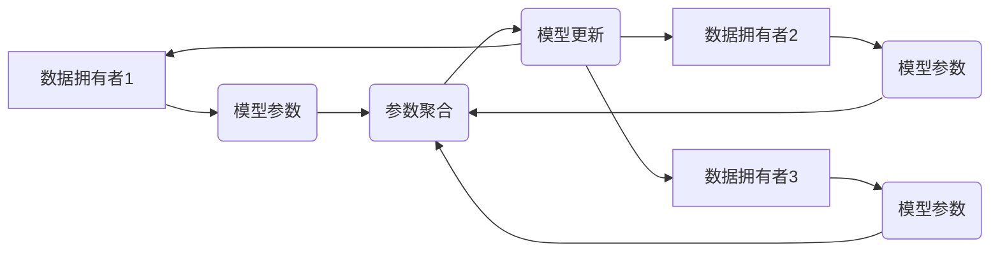

> 垂直联邦学习、数据隐私、跨行业协作、模型训练、数据安全

## 1. 背景介绍

数据是当今社会最宝贵的资源之一，其价值体现在信息挖掘、知识发现和决策支持等方面。然而，数据往往分散在不同的机构或企业手中，难以进行有效整合和利用。传统的集中式机器学习模型训练需要将所有数据集中到一个中心服务器上，这带来了严重的隐私泄露风险和数据安全问题。

近年来，联邦学习（Federated Learning，FL）作为一种分布式机器学习方法，逐渐受到广泛关注。FL允许模型在各个数据拥有者本地进行训练，并将模型参数进行聚合更新，从而实现数据在不离开本地设备的情况下进行协同学习。然而，传统的FL方法主要针对同类型数据场景，难以有效应对跨行业数据协作的需求。

垂直联邦学习（Vertical Federated Learning，VFL）作为FL的一种扩展，旨在解决跨行业数据协作的挑战。VFL允许不同行业的数据拥有者共享数据，共同训练模型，而无需将原始数据进行泄露。

## 2. 核心概念与联系

VFL的核心概念是将数据分割成垂直维度，每个数据拥有者只拥有特定维度的完整数据，而其他维度的完整数据则分散在其他数据拥有者手中。VFL通过将模型参数进行分层训练和聚合更新，实现跨行业数据协作。

**VFL 架构**



**VFL 与 FL 的关系**

* FL：集中式模型训练，数据集中在中心服务器。
* VFL：分布式模型训练，数据分散在各个数据拥有者本地。

**VFL 与传统数据共享的差异**

* 传统数据共享：需要将原始数据进行泄露，存在隐私风险。
* VFL：无需将原始数据进行泄露，保障数据隐私安全。

## 3. 核心算法原理 & 具体操作步骤

### 3.1  算法原理概述

VFL的核心算法原理是将模型参数进行分层训练和聚合更新。

1. **模型初始化:** 将模型参数初始化，并分配给各个数据拥有者。
2. **本地训练:** 每个数据拥有者在本地数据上进行模型训练，更新模型参数。
3. **参数聚合:** 将各个数据拥有者更新的模型参数进行聚合，得到全局模型参数。
4. **模型更新:** 将全局模型参数更新到各个数据拥有者本地。
5. **重复步骤2-4:** 直到模型收敛或达到预设迭代次数。

### 3.2  算法步骤详解

1. **模型初始化:** 首先，将模型参数初始化，并将其分配给各个数据拥有者。每个数据拥有者接收一部分模型参数，用于在本地数据上进行训练。
2. **本地训练:** 每个数据拥有者在本地数据上进行模型训练，并根据训练结果更新模型参数。每个数据拥有者只训练其本地数据，不会访问其他数据拥有者的数据。
3. **参数聚合:** 每个数据拥有者将其更新的模型参数发送到一个中央服务器。中央服务器将所有数据拥有者的参数进行聚合，得到全局模型参数。参数聚合可以采用平均聚合、加权平均聚合等方法。
4. **模型更新:** 中央服务器将全局模型参数发送回各个数据拥有者。每个数据拥有者将接收到的全局模型参数更新其本地模型参数。
5. **重复步骤2-4:** 重复上述步骤，直到模型收敛或达到预设迭代次数。

### 3.3  算法优缺点

**优点:**

* 保护数据隐私：数据在本地进行训练，不会离开设备，有效保护数据隐私。
* 提高数据利用率：允许不同行业的数据拥有者共享数据，提高数据利用率。
* 降低数据安全风险：数据分散存储，降低数据安全风险。

**缺点:**

* 通信成本高：参数聚合需要频繁的网络通信，可能导致通信成本高。
* 模型训练效率低：由于数据分散存储，模型训练效率可能低于集中式训练。
* 数据不均衡问题：不同数据拥有者的数据质量和数量可能不均衡，影响模型训练效果。

### 3.4  算法应用领域

VFL在以下领域具有广泛的应用前景：

* **医疗保健:** 不同医院可以共享患者数据，共同训练疾病诊断和治疗模型，提高医疗服务质量。
* **金融服务:** 不同银行可以共享客户数据，共同训练欺诈检测和风险评估模型，降低金融风险。
* **零售业:** 不同零售商可以共享客户数据，共同训练个性化推荐和营销模型，提高销售额。
* **智能交通:** 不同交通部门可以共享交通数据，共同训练交通流量预测和拥堵缓解模型，提高交通效率。

## 4. 数学模型和公式 & 详细讲解 & 举例说明

### 4.1  数学模型构建

假设有 $n$ 个数据拥有者，每个数据拥有者拥有 $d$ 维的数据。模型参数为 $\theta$，每个数据拥有者在本地训练得到的模型参数更新为 $\Delta \theta_i$。

### 4.2  公式推导过程

全局模型参数更新公式为：

$$\theta_{t+1} = \text{Agg}(\theta_t, \{\Delta \theta_i\}_{i=1}^n)$$

其中，$\theta_t$ 为当前全局模型参数，$\Delta \theta_i$ 为第 $i$ 个数据拥有者更新的模型参数，$\text{Agg}$ 为参数聚合函数。

### 4.3  案例分析与讲解

假设有三个数据拥有者，每个数据拥有者拥有 10 维的数据。每个数据拥有者在本地训练得到的模型参数更新分别为：

* $\Delta \theta_1 = [0.1, 0.2, 0.3, ..., 0.9, 1.0]$
* $\Delta \theta_2 = [0.01, 0.02, 0.03, ..., 0.09, 0.10]$
* $\Delta \theta_3 = [0.001, 0.002, 0.003, ..., 0.009, 0.010]$

如果采用平均聚合函数，则全局模型参数更新为：

$$\theta_{t+1} = \frac{1}{3}(\theta_t + \Delta \theta_1 + \Delta \theta_2 + \Delta \theta_3)$$

## 5. 项目实践：代码实例和详细解释说明

### 5.1  开发环境搭建

* Python 3.7+
* TensorFlow 2.0+
* PyTorch 1.0+
* 其他必要的库

### 5.2  源代码详细实现

```python
# 导入必要的库
import tensorflow as tf

# 定义模型
model = tf.keras.models.Sequential([
    tf.keras.layers.Dense(128, activation='relu'),
    tf.keras.layers.Dense(10, activation='softmax')
])

# 定义训练函数
def train_model(data, labels, epochs):
    model.compile(optimizer='adam',
                  loss='sparse_categorical_crossentropy',
                  metrics=['accuracy'])
    model.fit(data, labels, epochs=epochs)

# 数据准备
# ...

# 分布式训练
# ...

# 参数聚合
# ...

# 模型更新
# ...
```

### 5.3  代码解读与分析

* 代码首先定义了模型结构和训练函数。
* 数据准备阶段需要根据实际场景进行数据分割和预处理。
* 分布式训练阶段，每个数据拥有者在本地数据上进行模型训练。
* 参数聚合阶段，将各个数据拥有者的模型参数进行聚合，得到全局模型参数。
* 模型更新阶段，将全局模型参数更新到各个数据拥有者本地。

### 5.4  运行结果展示

* 训练结果展示包括模型准确率、损失函数值等指标。
* 可以通过可视化工具展示模型训练过程中的变化趋势。

## 6. 实际应用场景

### 6.1  医疗保健

* 不同医院可以共享患者数据，共同训练疾病诊断和治疗模型，提高医疗服务质量。
* 例如，可以训练一个模型用于预测患者患心脏病的风险，帮助医生进行更精准的诊断和治疗。

### 6.2  金融服务

* 不同银行可以共享客户数据，共同训练欺诈检测和风险评估模型，降低金融风险。
* 例如，可以训练一个模型用于检测信用卡欺诈交易，帮助银行减少损失。

### 6.3  零售业

* 不同零售商可以共享客户数据，共同训练个性化推荐和营销模型，提高销售额。
* 例如，可以训练一个模型用于推荐用户可能感兴趣的商品，提高用户购买意愿。

### 6.4  未来应用展望

VFL 在未来将有更广泛的应用场景，例如：

* **智能制造:** 不同制造商可以共享设备数据，共同训练设备故障预测和优化模型，提高生产效率。
* **智慧城市:** 不同城市部门可以共享城市数据，共同训练交通流量预测和环境监测模型，提高城市管理水平。
* **个性化教育:** 不同教育机构可以共享学生数据，共同训练个性化学习推荐和教学评估模型，提高教育质量。

## 7. 工具和资源推荐

### 7.1  学习资源推荐

* **论文:**
    * [Federated Learning: Strategies for Improving Communication Efficiency](https://arxiv.org/abs/1704.04835)
    * [Vertical Federated Learning: A Survey](https://arxiv.org/abs/2106.09474)
* **书籍:**
    * [Deep Learning](https://www.deeplearningbook.org/)
    * [Machine Learning](https://www.coursera.org/learn/machine-learning)

### 7.2  开发工具推荐

* **TensorFlow Federated:** https://www.tensorflow.org/federated
* **PySyft:** https://www.openmined.org/

### 7.3  相关论文推荐

* [Federated Learning: Collaborative Machine Learning Without Centralized Training Data](https://arxiv.org/abs/1602.05629)
* [Communication-Efficient Learning of Deep Networks from Decentralized Data](https://arxiv.org/abs/1704.04835)
* [Privacy-Preserving Machine Learning](https://arxiv.org/abs/1706.00902)

## 8. 总结：未来发展趋势与挑战

### 8.1  研究成果总结

VFL 作为一种新兴的机器学习方法，在跨行业数据协作方面具有巨大的潜力。近年来，VFL 研究取得了显著进展，包括：

* **算法优化:** 研究者们提出了多种 VFL 算法，例如联邦平均聚合、联邦自适应学习等，提高了模型训练效率和准确率。
* **隐私保护:** 研究者们提出了多种隐私保护机制，例如差分隐私、同态加密等，保障数据隐私安全。
* **应用场景拓展:** VFL 在医疗保健、金融服务、零售业等多个领域取得了成功应用。

### 8.2  未来发展趋势

VFL 未来发展趋势包括：

* **模型训练效率提升:** 研究者们将继续探索更有效的 VFL 算法，提高模型训练效率。
* **隐私保护增强:** 研究者们将继续研究更强大的隐私保护机制，保障数据隐私安全。
* **应用场景拓展:** VFL 将应用于更多领域，例如智能制造、智慧城市、个性化教育等。

### 8.3  面临的挑战

VFL 还面临一些挑战，例如：

* **数据不均衡问题:**