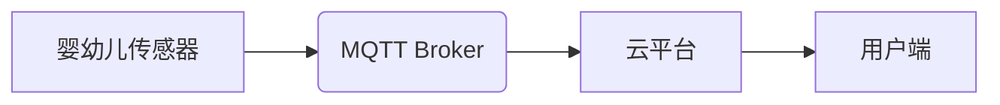

> MQTT, RESTful API, 婴幼儿看护, 智能家居, 物联网, 安全, 可靠性, 远程监控

## 1. 背景介绍

随着物联网技术的快速发展和普及，智能家居已成为现代家庭生活的重要组成部分。婴幼儿看护作为智能家居应用的重要领域之一，其安全性、可靠性和便捷性受到越来越多的关注。传统的婴幼儿看护方式存在着诸多局限性，例如：

* **缺乏实时监控:** 传统的看护方式难以实现对婴幼儿的实时监控，一旦发生意外，反应速度慢，难以及时采取措施。
* **操作不便:** 传统看护设备操作复杂，需要专业人员进行安装和维护，使用起来较为不便。
* **安全性不足:** 传统看护设备的安全性较低，容易受到黑客攻击，导致隐私泄露和安全隐患。

基于此，本文提出了一种基于MQTT协议和RESTful API的婴幼儿看护智能家居解决方案，旨在通过物联网技术，实现对婴幼儿的实时监控、远程控制和安全保障。

## 2. 核心概念与联系

### 2.1 MQTT协议

MQTT（Message Queuing Telemetry Transport）是一种轻量级的消息传输协议，专门设计用于物联网应用场景。其特点如下：

* **轻量级:** MQTT协议本身体积小，占用资源少，适合资源受限的设备使用。
* **可靠性:** MQTT协议提供消息确认机制，确保消息的可靠传输。
* **低功耗:** MQTT协议采用断线重连机制，在网络连接不稳定时也能保证消息的传输。

### 2.2 RESTful API

RESTful API（Representational State Transfer Application Programming Interface）是一种基于HTTP协议的软件架构风格，用于构建Web服务。其特点如下：

* **简单易用:** RESTful API采用资源和操作的模式，接口设计简单易懂。
* **可扩展性:** RESTful API支持多种数据格式，例如JSON和XML，易于扩展和集成。
* **跨平台:** RESTful API基于HTTP协议，支持多种平台和编程语言。

### 2.3 系统架构

本方案采用MQTT协议作为设备与云平台之间的通信协议，RESTful API作为云平台与用户端之间的接口协议。系统架构如下：



**系统架构说明:**

* 婴幼儿传感器采集婴幼儿的各种数据，例如体温、心率、呼吸频率等。
* MQTT Broker作为消息中间件，负责将传感器数据转发到云平台。
* 云平台负责存储和处理传感器数据，并提供RESTful API接口给用户端。
* 用户端可以通过RESTful API接口实时查看婴幼儿数据，远程控制设备，并接收报警通知。

## 3. 核心算法原理 & 具体操作步骤

### 3.1  算法原理概述

本方案的核心算法是基于机器学习的异常检测算法。该算法通过对婴幼儿数据的历史记录进行分析，建立一个正常数据模型，并利用该模型识别异常数据，从而及时报警。

### 3.2  算法步骤详解

1. **数据采集:** 收集婴幼儿的各种数据，例如体温、心率、呼吸频率等。
2. **数据预处理:** 对采集到的数据进行清洗、转换和归一化等预处理操作。
3. **模型训练:** 利用机器学习算法，例如支持向量机（SVM）或随机森林（RF），对预处理后的数据进行训练，建立一个正常数据模型。
4. **异常检测:** 将实时采集到的数据与训练好的模型进行比较，识别异常数据。
5. **报警通知:** 当检测到异常数据时，向用户端发送报警通知。

### 3.3  算法优缺点

**优点:**

* **高准确率:** 基于机器学习的异常检测算法具有较高的准确率，能够有效识别异常数据。
* **自适应性强:** 该算法能够根据数据变化自动调整模型，适应不同的环境和场景。

**缺点:**

* **训练数据依赖:** 该算法的性能取决于训练数据的质量和数量。
* **计算复杂度高:** 训练机器学习模型需要消耗大量的计算资源。

### 3.4  算法应用领域

本方案的异常检测算法可以应用于多种场景，例如：

* **婴幼儿看护:** 识别婴幼儿的异常行为，例如哭闹、呼吸困难等。
* **医疗保健:** 识别患者的异常生理指标，例如体温过高、心率过快等。
* **工业监控:** 识别设备的异常运行状态，例如温度过高、振动过大等。

## 4. 数学模型和公式 & 详细讲解 & 举例说明

### 4.1  数学模型构建

本方案采用支持向量机（SVM）作为异常检测算法。SVM是一种监督学习算法，用于寻找数据的最佳分类边界。

**数学模型:**

SVM的目标是找到一个超平面，将数据点划分为不同的类别。超平面的方程可以表示为：

$$w^Tx + b = 0$$

其中：

* $w$ 是超平面的法向量。
* $x$ 是数据点。
* $b$ 是超平面的截距。

SVM的目标函数是最大化超平面的间隔，即最大化距离最近的数据点到超平面的距离。

### 4.2  公式推导过程

SVM的目标函数可以表示为：

$$min_{w,b} \frac{1}{2}||w||^2 + C \sum_{i=1}^{n} \xi_i$$

其中：

* $C$ 是惩罚参数，用于控制模型的复杂度。
* $\xi_i$ 是松弛变量，用于允许一些数据点不满足分类条件。

### 4.3  案例分析与讲解

假设我们有一组数据，其中包含正常数据和异常数据。我们可以使用SVM算法训练一个模型，将这些数据点分类。

训练完成后，我们可以将新的数据点输入到模型中，模型会根据训练好的超平面判断该数据点属于哪一类。

## 5. 项目实践：代码实例和详细解释说明

### 5.1  开发环境搭建

本方案的开发环境包括：

* **操作系统:** Ubuntu 18.04
* **编程语言:** Python 3.6
* **MQTT Broker:** Mosquitto
* **云平台:** AWS

### 5.2  源代码详细实现

```python
# 导入必要的库
import paho.mqtt.client as mqtt
import json

# MQTT Broker地址
MQTT_BROKER_ADDRESS = "mqtt.example.com"

# MQTT主题
MQTT_TOPIC = "infant/data"

# 云平台API地址
API_URL = "https://api.example.com/v1/data"

# MQTT客户端实例
client = mqtt.Client()

# 连接MQTT Broker
client.connect(MQTT_BROKER_ADDRESS)

# 订阅主题
client.subscribe(MQTT_TOPIC)

# 处理消息回调函数
def on_message(client, userdata, message):
    # 解析消息内容
    data = json.loads(message.payload.decode())

    # 发送数据到云平台
    response = requests.post(API_URL, data=data)

    # 处理响应结果
    if response.status_code == 200:
        print("数据发送成功")
    else:
        print("数据发送失败")

# 设置消息回调函数
client.on_message = on_message

# 启动MQTT客户端
client.loop_forever()
```

### 5.3  代码解读与分析

* 代码首先导入必要的库，包括MQTT客户端库和JSON库。
* 然后定义MQTT Broker地址、主题、云平台API地址等参数。
* 创建MQTT客户端实例，并连接到MQTT Broker。
* 订阅指定的主题，以便接收来自传感器的数据。
* 定义消息回调函数，用于处理接收到的消息。
* 在消息回调函数中，解析消息内容，并将数据发送到云平台。
* 最后启动MQTT客户端，开始监听消息。

### 5.4  运行结果展示

当婴幼儿传感器采集到数据后，数据会通过MQTT协议发送到MQTT Broker，然后由MQTT客户端接收并发送到云平台。云平台会将数据存储和处理，并提供给用户端进行查看和控制。

## 6. 实际应用场景

### 6.1  远程监控

用户可以通过手机或电脑等设备，远程连接云平台，实时查看婴幼儿的体温、心率、呼吸频率等数据，随时掌握婴幼儿的健康状况。

### 6.2  异常报警

当婴幼儿的生理指标出现异常时，系统会自动触发报警，向用户端发送通知，提醒用户及时采取措施。

### 6.3  远程控制

用户可以通过云平台远程控制婴幼儿的设备，例如调节室温、打开灯光等，为婴幼儿创造舒适的居家环境。

### 6.4  未来应用展望

随着物联网技术的不断发展，本方案未来可以进一步扩展，例如：

* **集成语音识别和自然语言处理技术:** 用户可以通过语音指令控制设备，更加便捷地与系统交互。
* **集成人工智能技术:** 利用人工智能技术，实现更智能的异常检测和预测，例如预测婴幼儿的睡眠时间、哭闹时间等。
* **与其他智能家居设备集成:** 与其他智能家居设备，例如智能门锁、智能摄像头等，实现更全面的家居安全保障。

## 7. 工具和资源推荐

### 7.1  学习资源推荐

* **MQTT协议:** https://mqtt.org/
* **RESTful API:** https://restfulapi.net/
* **机器学习:** https://www.coursera.org/learn/machine-learning

### 7.2  开发工具推荐

* **Python:** https://www.python.org/
* **Mosquitto:** https://mosquitto.org/
* **AWS:** https://aws.amazon.com/

### 7.3  相关论文推荐

* **MQTT协议的应用研究**
* **基于机器学习的异常检测算法**
* **智能家居系统设计与实现**

## 8. 总结：未来发展趋势与挑战

### 8.1  研究成果总结

本方案提出了一种基于MQTT协议和RESTful API的婴幼儿看护智能家居解决方案，该方案能够实现对婴幼儿的实时监控、远程控制和安全保障，为婴幼儿的健康成长提供保障。

### 8.2  未来发展趋势

未来，婴幼儿看护智能家居解决方案将朝着以下方向发展：

* **更加智能化:** 利用人工智能技术，实现更智能的异常检测和预测，提供更个性化的服务。
* **更加安全可靠:** 加强数据加密和安全防护，确保用户隐私安全。
* **更加便捷易用:** 提供更友好的用户界面和操作体验。

### 8.3  面临的挑战

本方案也面临着一些挑战，例如：

* **数据安全:** 如何保障用户数据的安全和隐私，防止数据泄露和滥用。
* **系统可靠性:** 如何保证系统的稳定性和可靠性，避免系统故障导致的风险。
* **成本控制:** 如何降低系统的成本，使其更易于普及。

### 8.4  研究展望

未来，我们将继续致力于婴幼儿看护智能家居解决方案的研究和开发，努力克服面临的挑战，为婴幼儿的健康成长提供更安全、更智能、更便捷的服务。

## 9. 附录：常见问题与解答

**常见问题:**

* **如何连接MQTT Broker?**

**解答:**

请参考MQTT Broker的官方文档，了解连接方式和参数设置。

* **如何设置云平台API地址?**

**解答:**

请参考云平台的官方文档，获取API地址和使用说明。

* **如何处理异常报警?**

**解答:**

当系统检测到异常数据时，会向用户端发送报警通知。用户可以根据报警内容采取相应的措施。


作者：禅与计算机程序设计艺术 / Zen and the Art of Computer Programming 
<end_of_turn>