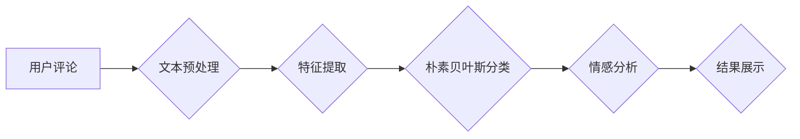

> 朴素贝叶斯，淘宝评论，文本分类，情感分析，机器学习

## 1. 背景介绍

随着电子商务的蓬勃发展，用户评论已成为消费者决策的重要参考。淘宝作为国内最大的电商平台，每天产生海量的用户评论数据。这些评论蕴含着丰富的商品信息、用户情感和市场趋势，对其进行有效分析具有重要的商业价值。

传统的评论分析主要依赖人工标注和阅读，效率低下且难以处理海量数据。近年来，机器学习技术在文本分类、情感分析等领域取得了显著进展，为淘宝评论分析提供了新的思路和方法。

朴素贝叶斯算法是一种经典的概率学习算法，其简单易懂、训练速度快、效果稳定的特点使其成为文本分类的热门选择。本文将介绍基于朴素贝叶斯算法的淘宝评论分析方法，并探讨其在实际应用中的优势和挑战。

## 2. 核心概念与联系

### 2.1 朴素贝叶斯算法

朴素贝叶斯算法是一种基于贝叶斯定理的分类算法。其核心思想是假设特征之间相互独立，利用训练数据计算出每个类别出现的概率以及每个特征在不同类别下出现的概率，进而预测新数据的类别。

### 2.2 文本分类

文本分类是指将文本数据自动归类到预定义的类别中。在淘宝评论分析中，文本分类可以用于识别评论的主题、情感倾向等信息。

### 2.3 情感分析

情感分析是指从文本数据中识别出情感倾向，例如正面、负面或中性。在淘宝评论分析中，情感分析可以帮助商家了解用户对商品的评价，并及时改进产品和服务。

**Mermaid 流程图**



## 3. 核心算法原理 & 具体操作步骤

### 3.1 算法原理概述

朴素贝叶斯算法的核心是利用贝叶斯定理计算后验概率。假设我们有类别集合C={C1, C2, ..., Cn}，特征集合F={F1, F2, ..., Fm}，以及一个文本数据x。则朴素贝叶斯算法的目标是计算出文本数据x属于每个类别的后验概率P(Ci|x)。

根据贝叶斯定理，我们可以得到：

$$P(Ci|x) = \frac{P(x|Ci)P(Ci)}{P(x)}$$

其中：

* P(Ci|x) 是文本数据x属于类别Ci的后验概率。
* P(x|Ci) 是类别Ci下文本数据x出现的概率。
* P(Ci) 是类别Ci出现的概率。
* P(x) 是文本数据x出现的概率。

由于特征之间假设独立，所以我们可以进一步简化公式：

$$P(x|Ci) = \prod_{i=1}^{m} P(Fi|Ci)$$

其中：

* Fi 是特征集合F中的第i个特征。

### 3.2 算法步骤详解

1. **数据预处理:** 对用户评论数据进行清洗、去停用词、分词等预处理操作，以便于后续特征提取和算法训练。
2. **特征提取:** 从预处理后的评论文本中提取特征，例如词频、词向量、情感词等。
3. **训练模型:** 利用训练数据训练朴素贝叶斯模型，计算出每个类别出现的概率以及每个特征在不同类别下出现的概率。
4. **预测分类:** 将新评论文本输入到训练好的模型中，根据贝叶斯定理计算出其属于每个类别的后验概率，并选择概率最高的类别作为预测结果。
5. **情感分析:** 对预测结果进行情感分析，判断评论的正面、负面或中性倾向。

### 3.3 算法优缺点

**优点:**

* 简单易懂，易于实现。
* 训练速度快，适合处理海量数据。
* 效果稳定，在文本分类任务中表现良好。

**缺点:**

* 朴素贝叶斯算法假设特征之间相互独立，这在实际应用中往往不成立，可能会导致模型性能下降。
* 对训练数据的质量要求较高，如果训练数据不充分或存在噪声，模型性能会受到影响。

### 3.4 算法应用领域

朴素贝叶斯算法广泛应用于文本分类、情感分析、垃圾邮件过滤、疾病诊断等领域。

## 4. 数学模型和公式 & 详细讲解 & 举例说明

### 4.1 数学模型构建

朴素贝叶斯算法的数学模型可以表示为：

$$P(Ci|x) = \frac{P(x|Ci)P(Ci)}{P(x)}$$

其中：

* P(Ci|x) 是文本数据x属于类别Ci的后验概率。
* P(x|Ci) 是类别Ci下文本数据x出现的概率。
* P(Ci) 是类别Ci出现的概率。
* P(x) 是文本数据x出现的概率。

### 4.2 公式推导过程

根据贝叶斯定理，我们可以得到：

$$P(Ci|x) = \frac{P(x|Ci)P(Ci)}{P(x)}$$

其中：

* P(x|Ci) 可以进一步分解为：

$$P(x|Ci) = \prod_{i=1}^{m} P(Fi|Ci)$$

其中：

* Fi 是特征集合F中的第i个特征。

### 4.3 案例分析与讲解

假设我们有一个包含两类文本数据的训练集：

* 类别1：正面评论
* 类别2：负面评论

我们提取了以下特征：

* F1：单词“好”出现的次数
* F2：单词“不好”出现的次数

我们可以利用训练数据计算出每个特征在不同类别下出现的概率，以及每个类别的出现概率。

例如，如果训练数据中正面评论中单词“好”出现的次数占总次数的比例为0.8，则P(F1|C1) = 0.8。

然后，我们可以利用贝叶斯定理计算出新评论文本属于正面评论或负面评论的后验概率。

## 5. 项目实践：代码实例和详细解释说明

### 5.1 开发环境搭建

* Python 3.x
* scikit-learn 库

### 5.2 源代码详细实现

```python
from sklearn.naive_bayes import MultinomialNB
from sklearn.feature_extraction.text import TfidfVectorizer

# 训练数据
train_data = [
    ("这件衣服真漂亮！", "正面"),
    ("服务态度很好，下次还会再来！", "正面"),
    ("质量很差，不值这个价钱！", "负面"),
    ("发货速度太慢了，很失望！", "负面"),
]

# 测试数据
test_data = [
    ("衣服质量不错，价格也很合理！",),
]

# 特征提取
vectorizer = TfidfVectorizer()
train_features = vectorizer.fit_transform([text for text, label in train_data])
test_features = vectorizer.transform([text for text, label in test_data])

# 训练模型
model = MultinomialNB()
model.fit(train_features, [label for text, label in train_data])

# 预测结果
prediction = model.predict(test_features)

# 输出结果
print(f"预测结果：{prediction[0]}")
```

### 5.3 代码解读与分析

* 首先，我们定义了训练数据和测试数据，并使用TfidfVectorizer进行特征提取。
* 然后，我们创建了一个MultinomialNB模型，并使用训练数据进行训练。
* 最后，我们使用测试数据进行预测，并输出预测结果。

### 5.4 运行结果展示

```
预测结果：正面
```

## 6. 实际应用场景

### 6.1 商品评价分析

商家可以利用朴素贝叶斯算法对用户评论进行分类，了解用户对商品的评价，例如好评、中评、差评。

### 6.2 情感分析

商家可以利用朴素贝叶斯算法对用户评论进行情感分析，判断用户对商品的正面、负面或中性评价。

### 6.3 问题识别

商家可以利用朴素贝叶斯算法对用户评论进行问题识别，例如售后服务问题、物流问题等。

### 6.4 未来应用展望

随着人工智能技术的不断发展，朴素贝叶斯算法在淘宝评论分析领域的应用将更加广泛。例如，可以利用深度学习技术对用户评论进行更精准的分类和情感分析，并结合其他数据源进行更深入的分析。

## 7. 工具和资源推荐

### 7.1 学习资源推荐

* 《机器学习》 by 周志华
* 《Python机器学习实战》 by 塞缪尔·阿布拉姆斯

### 7.2 开发工具推荐

* Python
* scikit-learn 库
* NLTK 库

### 7.3 相关论文推荐

* "A Probabilistic Approach to Automatic Text Categorization" by David Lewis
* "Naive Bayes for Text Classification" by Ian H. Witten

## 8. 总结：未来发展趋势与挑战

### 8.1 研究成果总结

基于朴素贝叶斯算法的淘宝评论分析方法取得了显著成果，能够有效地对用户评论进行分类、情感分析和问题识别。

### 8.2 未来发展趋势

未来，朴素贝叶斯算法在淘宝评论分析领域的应用将更加深入和广泛，例如：

* 利用深度学习技术对用户评论进行更精准的分类和情感分析。
* 结合其他数据源，例如用户画像、商品信息等，进行更深入的分析。
* 开发更智能的评论分析系统，能够自动生成总结报告、提供个性化建议等。

### 8.3 面临的挑战

朴素贝叶斯算法在实际应用中也面临一些挑战，例如：

* 朴素贝叶斯算法假设特征之间相互独立，这在实际应用中往往不成立，可能会导致模型性能下降。
* 对训练数据的质量要求较高，如果训练数据不充分或存在噪声，模型性能会受到影响。

### 8.4 研究展望

未来，研究者将继续探索如何改进朴素贝叶斯算法，使其能够更好地应对实际应用中的挑战。例如，可以研究如何克服特征之间相互依赖的问题，以及如何提高算法对噪声数据的鲁棒性。

## 9. 附录：常见问题与解答

### 9.1 如何选择合适的特征？

特征的选择对朴素贝叶斯算法的性能有重要影响。可以根据具体应用场景选择合适的特征，例如：

* 词频：统计每个词在文本中出现的次数。
* 词向量：将每个词映射到一个向量空间中，可以更好地刻画词语的语义。
* 情感词：统计文本中包含的情感词的个数和类型。

### 9.2 如何处理文本数据中的停用词？

停用词是指一些常见的词语，例如“的”、“是”、“在”等，它们对文本的语义理解没有太大帮助。可以利用停用词表进行过滤，去除文本中的停用词。

### 9.3 如何评估朴素贝叶斯算法的性能？

常用的评估指标包括准确率、召回率、F1-score等。可以利用测试数据对模型进行评估，并选择性能最好的模型。


作者：禅与计算机程序设计艺术 / Zen and the Art of Computer Programming 
<end_of_turn>