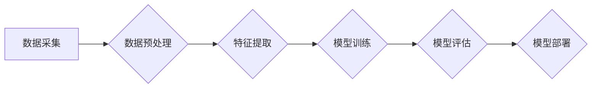

> 中文新闻短文本分类，机器学习，深度学习，文本分类，自然语言处理，BERT

## 1. 背景介绍

随着互联网的快速发展和信息爆炸，海量新闻信息涌现，如何高效地对新闻进行分类和组织已成为一个重要的研究课题。中文新闻短文本分类作为自然语言处理 (NLP) 领域的重要应用之一，在新闻聚类、个性化推荐、舆情监测等方面具有重要意义。

传统文本分类方法主要依赖于人工特征工程，需要对文本进行预处理、提取关键词、构建特征向量等操作，效率低且难以捕捉文本的语义信息。近年来，随着深度学习的兴起，基于机器学习的中文新闻短文本分类方法取得了显著进展。深度学习模型能够自动学习文本的特征表示，提高了分类精度和效率。

## 2. 核心概念与联系

**2.1 文本分类概述**

文本分类是指将文本自动地归类到预定义的类别中。它是一个典型的监督学习任务，需要训练数据来学习分类规则。

**2.2 机器学习概述**

机器学习是一种人工智能技术，通过算法学习数据中的模式，从而进行预测或决策。机器学习算法可以分为监督学习、无监督学习和强化学习三大类。

**2.3 深度学习概述**

深度学习是机器学习的一个子领域，它使用多层神经网络来学习数据中的复杂特征。深度学习模型能够自动学习文本的语义信息，在文本分类任务中取得了优异的性能。

**2.4 中文新闻短文本分类流程**



## 3. 核心算法原理 & 具体操作步骤

**3.1 算法原理概述**

本研究主要采用深度学习模型进行中文新闻短文本分类。常用的深度学习模型包括：

* **循环神经网络 (RNN)**：RNN能够处理序列数据，适合处理文本分类任务。
* **长短期记忆网络 (LSTM)**：LSTM是一种改进的RNN，能够更好地捕捉长距离依赖关系。
* **Transformer**：Transformer是一种基于注意力机制的模型，能够更有效地处理文本信息。

**3.2 算法步骤详解**

1. **数据采集**: 收集大量中文新闻短文本数据，并进行标注，将文本分类到预定义的类别中。
2. **数据预处理**: 对文本数据进行清洗、去停用词、词干提取等预处理操作，提高模型训练效率。
3. **特征提取**: 使用词向量模型 (如 Word2Vec、GloVe) 将文本词语转换为向量表示，提取文本的语义特征。
4. **模型训练**: 使用深度学习模型 (如 LSTM、Transformer) 对预处理后的文本数据进行训练，学习文本分类规则。
5. **模型评估**: 使用测试数据对训练好的模型进行评估，计算模型的准确率、召回率、F1-score等指标。
6. **模型部署**: 将训练好的模型部署到实际应用场景中，用于对新的新闻短文本进行分类。

**3.3 算法优缺点**

* **优点**:
    * 自动学习文本特征，无需人工特征工程。
    * 能够捕捉文本的语义信息，提高分类精度。
    * 训练效率高，能够处理海量数据。
* **缺点**:
    * 需要大量训练数据，否则模型性能会下降。
    * 模型训练时间长，需要强大的计算资源。
    * 模型解释性差，难以理解模型的决策过程。

**3.4 算法应用领域**

* **新闻聚类**: 将新闻自动分类到不同的主题类别中。
* **个性化推荐**: 根据用户的阅读偏好，推荐相关的新闻文章。
* **舆情监测**: 监测网络上对特定事件或人物的舆论走向。
* **信息检索**: 根据用户的查询关键词，检索相关的新闻文章。

## 4. 数学模型和公式 & 详细讲解 & 举例说明

**4.1 数学模型构建**

深度学习模型的数学模型通常基于神经网络结构，包括输入层、隐藏层和输出层。每个神经元接收来自前一层神经元的输入，并通过激活函数进行处理，输出到下一层神经元。

**4.2 公式推导过程**

深度学习模型的训练过程是通过反向传播算法来进行的。反向传播算法通过计算损失函数的梯度，更新模型参数，使得模型的预测结果与真实标签之间的误差最小化。

**4.3 案例分析与讲解**

以 LSTM 模型为例，其输出层的激活函数通常为 softmax 函数，用于将多分类问题转化为概率分布。

$$
\hat{y}_i = \frac{e^{z_i}}{\sum_{j=1}^{C} e^{z_j}}
$$

其中，$\hat{y}_i$ 是模型预测第 i 类别的概率，$z_i$ 是第 i 个类别的输出值，$C$ 是类别总数。

## 5. 项目实践：代码实例和详细解释说明

**5.1 开发环境搭建**

本项目使用 Python 语言和 TensorFlow 深度学习框架进行开发。需要安装 Python、TensorFlow 和相关库。

**5.2 源代码详细实现**

```python
import tensorflow as tf

# 定义 LSTM 模型
model = tf.keras.models.Sequential([
    tf.keras.layers.Embedding(input_dim=vocab_size, output_dim=embedding_dim),
    tf.keras.layers.LSTM(units=128),
    tf.keras.layers.Dense(units=num_classes, activation='softmax')
])

# 编译模型
model.compile(optimizer='adam',
              loss='sparse_categorical_crossentropy',
              metrics=['accuracy'])

# 训练模型
model.fit(x_train, y_train, epochs=10, batch_size=32)

# 评估模型
loss, accuracy = model.evaluate(x_test, y_test)
print('Test Loss:', loss)
print('Test Accuracy:', accuracy)
```

**5.3 代码解读与分析**

* `Embedding` 层将词语转换为向量表示。
* `LSTM` 层捕捉文本的语义信息。
* `Dense` 层输出分类结果。
* `adam` 优化器用于更新模型参数。
* `sparse_categorical_crossentropy` 损失函数用于计算模型预测结果与真实标签之间的误差。
* `accuracy` 指标用于评估模型的分类精度。

**5.4 运行结果展示**

训练完成后，可以将模型部署到实际应用场景中，对新的新闻短文本进行分类。

## 6. 实际应用场景

**6.1 新闻聚类**

基于机器学习的中文新闻短文本分类可以用于将新闻自动分类到不同的主题类别中，例如科技、财经、体育、娱乐等。

**6.2 个性化推荐**

根据用户的阅读偏好，可以推荐相关的新闻文章，提高用户阅读体验。

**6.3 舆情监测**

可以监测网络上对特定事件或人物的舆论走向，及时了解公众的意见和情绪。

**6.4 未来应用展望**

随着深度学习技术的不断发展，中文新闻短文本分类的应用场景将会更加广泛，例如：

* **智能问答**: 基于新闻短文本分类，可以构建智能问答系统，回答用户关于新闻事件的疑问。
* **新闻摘要**: 可以根据新闻短文本的分类结果，自动生成新闻摘要。
* **跨语言新闻翻译**: 可以将不同语言的新闻短文本进行分类，然后进行翻译。

## 7. 工具和资源推荐

**7.1 学习资源推荐**

* **书籍**:
    * 《深度学习》
    * 《自然语言处理》
* **在线课程**:
    * Coursera: 深度学习
    * edX: 自然语言处理
* **博客**:
    * TensorFlow Blog
    * PyTorch Blog

**7.2 开发工具推荐**

* **Python**: 
* **TensorFlow**: 
* **PyTorch**: 
* **spaCy**: 

**7.3 相关论文推荐**

* **BERT**: Devlin, J., Chang, M. W., Lee, K., & Toutanova, K. (2018). BERT: Pre-training of deep bidirectional transformers for language understanding. arXiv preprint arXiv:1810.04805.
* **XLNet**: Yang, Z., Dai, Z., Yang, Y., Carbonell, J., Salakhutdinov, R., & Le, Q. V. (2019). XLNet: Generalized autoregressive pretraining for language understanding. arXiv preprint arXiv:1906.08237.

## 8. 总结：未来发展趋势与挑战

**8.1 研究成果总结**

基于机器学习的中文新闻短文本分类取得了显著进展，能够有效地对新闻进行分类和组织。深度学习模型能够自动学习文本特征，提高了分类精度和效率。

**8.2 未来发展趋势**

* **模型架构创新**: 探索新的深度学习模型架构，提高模型的性能和效率。
* **多模态融合**: 将文本与其他模态信息 (如图像、音频) 进行融合，提高分类的准确性和鲁棒性。
* **跨语言文本分类**: 研究跨语言文本分类方法，实现不同语言新闻的分类和理解。

**8.3 面临的挑战**

* **数据标注**: 高质量的标注数据是深度学习模型训练的基础，但中文新闻短文本的标注工作量较大。
* **模型解释性**: 深度学习模型的决策过程难以解释，这限制了模型的应用和信任度。
* **可解释性**: 如何提高模型的可解释性，让用户能够理解模型的决策过程，是未来研究的重要方向。

**8.4 研究展望**

未来，我们将继续致力于中文新闻短文本分类的研究，探索新的模型架构、融合多模态信息、提高模型的可解释性，为新闻信息处理和应用提供更有效的解决方案。

## 9. 附录：常见问题与解答

**9.1 如何选择合适的深度学习模型？**

选择合适的深度学习模型取决于具体的应用场景和数据特点。

* **RNN**: 适合处理顺序数据，例如文本分类。
* **LSTM**: 能够更好地捕捉长距离依赖关系，适用于长文本分类。
* **Transformer**: 能够更有效地处理文本信息，在许多自然语言处理任务中取得了优异的性能。

**9.2 如何处理中文新闻短文本中的停用词？**

停用词是指一些常见的词语，例如“的”、“是”、“在”等，它们对文本的语义信息贡献较小。可以采用以下方法处理停用词：

* **去除停用词**: 直接从文本中删除停用词。
* **使用停用词表**: 使用预定义的停用词表，将停用词标记为特殊符号，然后进行处理。

**9.3 如何评估模型的性能？**

常用的评估指标包括：

* **准确率**: 分类正确的样本数占总样本数的比例。
* **召回率**: 实际分类正确的样本数占所有真实样本数的比例。
* **F1-score**: 准确率和召回率的 harmonic mean。


作者：禅与计算机程序设计艺术 / Zen and the Art of Computer Programming 
<end_of_turn>