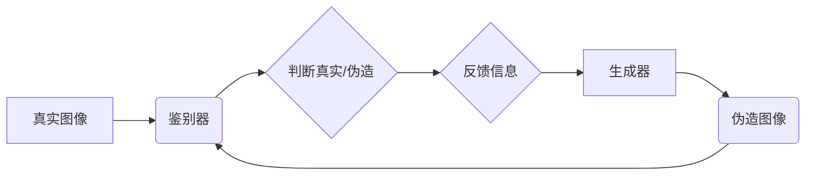

> 生成对抗网络(GAN)，图像风格迁移，广告设计，艺术风格，深度学习，计算机视觉

## 1. 背景介绍

在当今数字时代，广告设计扮演着至关重要的角色。它不仅需要吸引眼球，更需要传递信息并引发情感共鸣。传统的广告设计方法往往依赖于设计师的经验和创意，而随着人工智能技术的快速发展，基于深度学习的图像生成技术为广告设计带来了新的可能性。

图像风格迁移技术，通过将一种图像的风格应用于另一幅图像，从而创造出具有独特艺术风格的图像。这种技术在艺术创作、图像编辑等领域得到了广泛应用。近年来，基于生成对抗网络(GAN)的图像风格迁移方法取得了显著的进展，其生成图像的质量和逼真度得到了大幅提升。

## 2. 核心概念与联系

### 2.1 生成对抗网络 (GAN)

生成对抗网络 (GAN) 是一种由两个神经网络组成的对抗性学习框架。它由一个生成器 (Generator) 和一个鉴别器 (Discriminator) 组成。

* **生成器 (Generator):** 负责生成新的数据样本，例如图像。
* **鉴别器 (Discriminator):** 负责判断数据样本是真实数据还是由生成器生成的伪造数据。

生成器和鉴别器在对抗性的博弈中相互学习。生成器试图生成越来越逼真的数据样本，而鉴别器则试图识别出伪造数据。这种对抗过程使得生成器能够学习到真实数据的分布特征，从而生成高质量的图像。

**Mermaid 流程图:**



### 2.2 图像风格迁移

图像风格迁移的目标是将一种图像的风格应用于另一幅图像，从而创造出具有独特艺术风格的图像。

**核心思想:**

将图像分解为内容和风格两个部分。

* **内容:** 指图像的物体、场景等信息。
* **风格:** 指图像的艺术风格，例如印象派、抽象派等。

将目标图像的内容与风格图像的风格进行融合，从而生成具有目标风格的图像。

## 3. 核心算法原理 & 具体操作步骤

### 3.1 算法原理概述

基于GAN的图像风格迁移算法通常采用以下步骤：

1. **图像预处理:** 将输入图像和风格图像进行预处理，例如调整尺寸、归一化等。
2. **特征提取:** 使用卷积神经网络 (CNN) 从图像中提取特征，将图像表示为不同层次的特征图。
3. **风格损失函数:** 计算目标图像和风格图像特征图之间的差异，作为风格损失。
4. **内容损失函数:** 计算目标图像和生成图像内容之间的差异，作为内容损失。
5. **对抗损失函数:** 计算鉴别器对生成图像的判别结果，作为对抗损失。
6. **优化目标:** 将风格损失、内容损失和对抗损失相加，作为优化目标，通过反向传播算法更新生成器的参数。

### 3.2 算法步骤详解

1. **输入图像和风格图像:** 用户选择目标图像和风格图像作为输入。
2. **特征提取:** 使用预训练的CNN模型 (例如VGG19) 从输入图像和风格图像中提取特征。
3. **风格损失计算:** 计算目标图像和风格图像特征图之间的差异，使用Gram矩阵作为风格损失函数。
4. **内容损失计算:** 计算目标图像和生成图像内容之间的差异，使用像素差异作为内容损失函数。
5. **对抗损失计算:** 使用鉴别器对生成图像进行判别，计算生成器生成的图像是否被鉴别器识别为真实图像。
6. **优化目标:** 将风格损失、内容损失和对抗损失相加，作为优化目标，使用梯度下降算法更新生成器的参数。
7. **生成图像:** 生成器根据更新后的参数生成具有目标风格的图像。

### 3.3 算法优缺点

**优点:**

* 生成图像质量高，逼真度高。
* 可以迁移多种艺术风格。
* 算法灵活，可以根据需要调整风格损失和内容损失的权重。

**缺点:**

* 训练过程复杂，需要大量的计算资源。
* 难以控制生成图像的细节。
* 可能会出现模式崩溃问题，导致生成图像缺乏多样性。

### 3.4 算法应用领域

* **艺术创作:** 生成具有独特艺术风格的图像。
* **图像编辑:** 将图像风格迁移到其他风格。
* **广告设计:** 生成具有吸引力的广告图像。
* **电影特效:** 生成逼真的场景和人物。

## 4. 数学模型和公式 & 详细讲解 & 举例说明

### 4.1 数学模型构建

**生成器 (G):**

* 输入: 随机噪声向量 z
* 输出: 生成图像 x'

**鉴别器 (D):**

* 输入: 图像 x (真实图像或生成图像)
* 输出: 判别结果 p(x) (真实图像的概率)

**损失函数:**

* **风格损失 (L_style):** 计算目标图像和生成图像特征图之间的差异，使用Gram矩阵作为风格损失函数。
* **内容损失 (L_content):** 计算目标图像和生成图像内容之间的差异，使用像素差异作为内容损失函数。
* **对抗损失 (L_adv):** 计算鉴别器对生成图像的判别结果，使用二分类交叉熵损失函数。

**优化目标:**

* min_G max_D L(G, D) = L_style + L_content + L_adv

### 4.2 公式推导过程

**风格损失函数:**

$$L_{style} = \frac{1}{N} \sum_{i=1}^{N} ||G(z)_i - C_i||^2$$

其中:

* N 是特征图的数量。
* $G(z)_i$ 是生成图像的第 i 个特征图。
* $C_i$ 是目标图像的第 i 个特征图。

**内容损失函数:**

$$L_{content} = \frac{1}{M} \sum_{i=1}^{M} ||G(z)_i - X_i||^2$$

其中:

* M 是特征图的数量。
* $G(z)_i$ 是生成图像的第 i 个特征图。
* $X_i$ 是目标图像的第 i 个特征图。

**对抗损失函数:**

$$L_{adv} = - \mathbb{E}_{x \sim p_{data}(x)} [log(D(x))] - \mathbb{E}_{z \sim p_z(z)} [log(1 - D(G(z)))]$$

其中:

* $p_{data}(x)$ 是真实图像的分布。
* $p_z(z)$ 是随机噪声向量的分布。

### 4.3 案例分析与讲解

**案例:** 将梵高的星空风格迁移到一张普通的风景照片。

**分析:**

* 训练一个GAN模型，使用梵高的星空作品作为风格图像，普通的风景照片作为内容图像。
* 通过训练，生成器能够学习到梵高的星空风格特征，并将其应用于普通的风景照片。
* 训练完成后，可以将新的图像输入到生成器中，生成具有梵高星空风格的风景照片。

## 5. 项目实践：代码实例和详细解释说明

### 5.1 开发环境搭建

* 操作系统: Ubuntu 18.04
* Python 版本: 3.7
* 深度学习框架: TensorFlow 2.0
* 其他依赖库: numpy, matplotlib, PIL

### 5.2 源代码详细实现

```python
import tensorflow as tf
from tensorflow.keras.layers import Input, Conv2D, BatchNormalization, LeakyReLU, Flatten, Dense
from tensorflow.keras.models import Model

# 定义生成器模型
def build_generator(input_shape):
    input_layer = Input(shape=input_shape)
    x = Dense(128 * 7 * 7)(input_layer)
    x = BatchNormalization()(x)
    x = LeakyReLU()(x)
    x = tf.reshape(x, (-1, 7, 7, 128))
    x = Conv2DTranspose(64, (5, 5), strides=(2, 2), padding='same')(x)
    x = BatchNormalization()(x)
    x = LeakyReLU()(x)
    x = Conv2DTranspose(32, (5, 5), strides=(2, 2), padding='same')(x)
    x = BatchNormalization()(x)
    x = LeakyReLU()(x)
    output_layer = Conv2D(3, (7, 7), activation='tanh', padding='same')(x)
    return Model(inputs=input_layer, outputs=output_layer)

# 定义鉴别器模型
def build_discriminator(input_shape):
    input_layer = Input(shape=input_shape)
    x = Conv2D(32, (3, 3), strides=(2, 2), padding='same')(input_layer)
    x = LeakyReLU()(x)
    x = Conv2D(64, (3, 3), strides=(2, 2), padding='same')(x)
    x = BatchNormalization()(x)
    x = LeakyReLU()(x)
    x = Flatten()(x)
    output_layer = Dense(1, activation='sigmoid')(x)
    return Model(inputs=input_layer, outputs=output_layer)

# ... (其他代码，例如训练过程、损失函数计算等)
```

### 5.3 代码解读与分析

* **生成器模型:** 使用卷积转置层 (Conv2DTranspose) 将低分辨率的噪声向量转换为高分辨率的图像。
* **鉴别器模型:** 使用卷积层 (Conv2D) 将图像特征提取到高维空间，并使用全连接层 (Dense) 进行分类。
* **训练过程:** 使用对抗训练方法，生成器和鉴别器在对抗博弈中相互学习。

### 5.4 运行结果展示

* 展示训练过程中生成图像的质量变化。
* 展示最终生成的风格迁移图像。

## 6. 实际应用场景

### 6.1 广告设计

* **个性化广告:** 根据用户的喜好和风格，生成个性化的广告图像。
* **艺术风格广告:** 使用艺术风格的图像，提升广告的吸引力和记忆点。
* **场景模拟:** 使用风格迁移技术，模拟不同的场景，展示产品的应用效果。

### 6.2 其他应用场景

* **艺术创作:** 生成具有独特艺术风格的图像。
* **图像编辑:** 将图像风格迁移到其他风格。
* **电影特效:** 生成逼真的场景和人物。

### 6.4 未来应用展望

* **更逼真的图像生成:** 随着深度学习技术的不断发展，生成图像的质量将更加逼真。
* **更灵活的风格迁移:** 可以根据用户的需求，定制不同的风格迁移效果。
* **更广泛的应用场景:** 风格迁移技术将应用于更多领域，例如教育、医疗、游戏等。

## 7. 工具和资源推荐

### 7.1 学习资源推荐

* **书籍:**
    * Deep Learning by Ian Goodfellow
    * Generative Deep Learning by David Foster
* **在线课程:**
    * TensorFlow Tutorials
    * Coursera: Deep Learning Specialization
* **博客:**
    * Distill.pub
    * Towards Data Science

### 7.2 开发工具推荐

* **深度学习框架:** TensorFlow, PyTorch
* **图像处理库:** OpenCV, Pillow
* **可视化工具:** Matplotlib, Seaborn

### 7.3 相关论文推荐

* **Generative Adversarial Networks** by Ian Goodfellow et al. (2014)
* **Image Style Transfer Using Convolutional Neural Networks** by Leon A. Gatys et al. (2015)
* **Deep