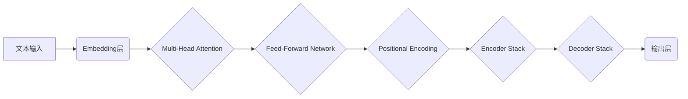

> 基础模型、NLP、Transformer、预训练、微调、生成式模型、语言理解、自然语言处理

## 1. 背景介绍

自然语言处理（NLP）作为人工智能领域的重要分支，致力于使计算机能够理解、处理和生成人类语言。近年来，随着深度学习技术的快速发展，NLP取得了显著进展，例如机器翻译、文本摘要、问答系统等应用取得了突破性进展。

基础模型作为NLP领域的新兴技术，在过去几年中迅速崛起，并展现出强大的潜力。基础模型是指在海量文本数据上进行预训练的强大语言模型，能够学习到语言的丰富语义和语法结构。这些模型可以用于各种下游NLP任务，并取得优异的性能。

## 2. 核心概念与联系

**2.1  基础模型的概念**

基础模型是指在大量文本数据上进行预训练的通用语言模型，其目标是学习语言的表示和结构，而不是针对特定任务进行训练。

**2.2  预训练与微调**

基础模型的训练过程通常分为两个阶段：预训练和微调。

* **预训练阶段:** 在海量文本数据上进行无监督学习，学习语言的表示和结构。
* **微调阶段:** 将预训练好的基础模型应用于特定任务，通过在少量标记数据上进行训练，调整模型参数，使其能够更好地完成特定任务。

**2.3  基础模型的优势**

* **通用性:** 基础模型可以应用于各种下游NLP任务，无需从头开始训练。
* **效率:** 预训练好的基础模型可以显著减少训练时间和资源消耗。
* **性能提升:** 基于基础模型的微调方法通常可以取得比传统方法更好的性能。

**2.4  基础模型的架构**

基础模型通常基于Transformer架构，例如BERT、GPT、T5等。Transformer是一种新型的神经网络架构，能够有效地处理序列数据，并具有强大的表示学习能力。



## 3. 核心算法原理 & 具体操作步骤

### 3.1  算法原理概述

基础模型的训练主要基于自监督学习和无监督学习的原理。

* **自监督学习:** 通过设计特殊的预训练任务，例如语言建模、掩码语言模型等，让模型学习语言的上下文关系和语义信息。
* **无监督学习:** 利用大量的文本数据，让模型学习语言的统计规律和结构特征。

### 3.2  算法步骤详解

1. **数据预处理:** 将文本数据进行清洗、分词、标记等预处理操作，使其能够被模型理解。
2. **模型构建:** 选择合适的Transformer架构，并根据预训练任务设计相应的损失函数。
3. **预训练:** 在海量文本数据上进行训练，让模型学习语言的表示和结构。
4. **微调:** 将预训练好的模型应用于特定任务，通过在少量标记数据上进行训练，调整模型参数，使其能够更好地完成特定任务。

### 3.3  算法优缺点

**优点:**

* 能够学习到语言的丰富语义和语法结构。
* 具有很强的泛化能力，可以应用于各种下游NLP任务。
* 训练效率高，可以显著减少训练时间和资源消耗。

**缺点:**

* 需要大量的训练数据和计算资源。
* 训练过程复杂，需要专业的技术人员进行操作。
* 模型参数量大，部署和推理成本较高。

### 3.4  算法应用领域

基础模型在NLP领域有着广泛的应用，例如：

* **机器翻译:** 将一种语言翻译成另一种语言。
* **文本摘要:** 将长文本压缩成短文本。
* **问答系统:** 回答用户提出的问题。
* **文本生成:** 生成新的文本内容，例如文章、故事、对话等。
* **情感分析:** 分析文本的情感倾向。

## 4. 数学模型和公式 & 详细讲解 & 举例说明

### 4.1  数学模型构建

基础模型通常基于Transformer架构，其核心是Attention机制和Feed-Forward Network。

**4.1.1  Attention机制:**

Attention机制能够学习到文本中不同词语之间的关系，并赋予重要词语更高的权重。

**公式:**

$$
Attention(Q, K, V) = softmax(\frac{QK^T}{\sqrt{d_k}})V
$$

其中：

* $Q$：查询矩阵
* $K$：键矩阵
* $V$：值矩阵
* $d_k$：键向量的维度

**4.1.2  Feed-Forward Network:**

Feed-Forward Network是一个多层感知机，用于对每个词语的表示进行进一步的变换。

**公式:**

$$
FFN(x) = \sigma(W_1x + b_1)
$$

其中：

* $x$：输入向量
* $W_1$：权重矩阵
* $b_1$：偏置向量
* $\sigma$：激活函数

### 4.2  公式推导过程

Attention机制的softmax函数用于计算每个词语之间的权重，使得权重分布在所有词语上，并根据词语之间的相关性分配不同的权重。

Feed-Forward Network通过多层感知机对词语的表示进行变换，学习到更深层的语义信息。

### 4.3  案例分析与讲解

例如，在机器翻译任务中，基础模型可以学习到源语言和目标语言之间的对应关系，并生成准确的翻译结果。

## 5. 项目实践：代码实例和详细解释说明

### 5.1  开发环境搭建

* Python 3.7+
* PyTorch 1.7+
* CUDA 10.2+

### 5.2  源代码详细实现

```python
import torch
import torch.nn as nn

class Transformer(nn.Module):
    def __init__(self, vocab_size, embedding_dim, num_heads, num_layers):
        super(Transformer, self).__init__()
        self.embedding = nn.Embedding(vocab_size, embedding_dim)
        self.encoder_layers = nn.ModuleList([EncoderLayer(embedding_dim, num_heads) for _ in range(num_layers)])
        self.decoder_layers = nn.ModuleList([DecoderLayer(embedding_dim, num_heads) for _ in range(num_layers)])

    def forward(self, src, tgt, src_mask, tgt_mask):
        src = self.embedding(src)
        tgt = self.embedding(tgt)
        
        # Encoder
        encoder_output = src
        for layer in self.encoder_layers:
            encoder_output = layer(encoder_output, src_mask)
        
        # Decoder
        decoder_output = tgt
        for layer in self.decoder_layers:
            decoder_output = layer(decoder_output, encoder_output, tgt_mask)
        
        return decoder_output

class EncoderLayer(nn.Module):
    # ...

class DecoderLayer(nn.Module):
    # ...
```

### 5.3  代码解读与分析

* Transformer类定义了整个模型的结构，包括嵌入层、编码器层和解码器层。
* EncoderLayer和DecoderLayer分别定义了编码器和解码器的每一层结构。
* forward方法定义了模型的输入和输出，以及模型的计算过程。

### 5.4  运行结果展示

运行代码后，可以得到模型的训练结果，例如准确率、损失值等指标。

## 6. 实际应用场景

基础模型在NLP领域有着广泛的应用场景，例如：

### 6.1  机器翻译

基础模型可以学习到不同语言之间的对应关系，并生成准确的翻译结果。

### 6.2  文本摘要

基础模型可以学习到文本的关键信息，并生成简洁的文本摘要。

### 6.3  问答系统

基础模型可以理解用户的问题，并从文本数据中找到相应的答案。

### 6.4  未来应用展望

基础模型在未来将有更广泛的应用，例如：

* **个性化推荐:** 基于用户的阅读历史和偏好，推荐个性化的内容。
* **自动写作:** 基于给定的主题和关键词，自动生成文章、故事等文本内容。
* **代码生成:** 基于自然语言描述，自动生成代码。

## 7. 工具和资源推荐

### 7.1  学习资源推荐

* **论文:**
    * BERT: Pre-training of Deep Bidirectional Transformers for Language Understanding
    * GPT: Generative Pre-trained Transformer
    * T5: Text-to-Text Transfer Transformer
* **博客:**
    * The Illustrated Transformer
    * Understanding BERT

### 7.2  开发工具推荐

* **PyTorch:** 深度学习框架
* **Hugging Face Transformers:** 基于Transformer的预训练模型库

### 7.3  相关论文推荐

* **BERT:** https://arxiv.org/abs/1810.04805
* **GPT:** https://arxiv.org/abs/1810.08761
* **T5:** https://arxiv.org/abs/1910.10683

## 8. 总结：未来发展趋势与挑战

### 8.1  研究成果总结

基础模型在NLP领域取得了显著进展，展现出强大的潜力，并推动了NLP技术的快速发展。

### 8.2  未来发展趋势

* **模型规模的进一步扩大:** 预计未来基础模型的规模将进一步扩大，学习到更丰富的语言知识。
* **多模态基础模型的开发:** 将文本、图像、音频等多种模态信息融合到基础模型中，实现更全面的理解和生成。
* **可解释性研究的加强:** 研究基础模型的决策过程，提高模型的可解释性和可信任性。

### 8.3  面临的挑战

* **数据获取和标注:** 基础模型的训练需要大量的文本数据和标注数据，数据获取和标注成本较高。
* **计算资源需求:** 基础模型的训练需要大量的计算资源，训练成本较高。
* **模型安全性:** 基础模型可能存在安全风险，例如生成有害内容、进行恶意攻击等。

### 8.4  研究展望

未来，基础模型的研究将继续深入，探索更强大的模型架构、更有效的训练方法和更广泛的应用场景。


## 9. 附录：常见问题与解答

**Q1: 基础模型和传统NLP模型有什么区别？**

**A1:** 基础模型是预训练的通用语言模型，可以应用于各种下游NLP任务，而传统NLP模型通常是针对特定任务进行训练的。

**Q2: 如何选择合适的基础模型？**

**A2:** 选择合适的基础模型需要考虑任务类型、数据规模、计算资源等因素。

**Q3: 如何进行基础模型的微调？**

**A3:** 微调基础模型需要准备少量标记数据，并调整模型参数，使其能够更好地完成特定任务。


作者：禅与计算机程序设计艺术 / Zen and the Art of Computer Programming 
<end_of_turn>