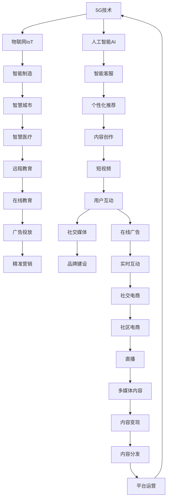

                 

## 1. 背景介绍

在移动互联网和互联网的迅猛发展下，信息爆炸、注意力分散已经成为了我们这个时代的显著特征。尤其是进入2010年代以来，随着智能终端设备、应用、内容服务的全面普及，用户对信息的获取方式发生了根本变化，注意力也随之转移至更为多样化和碎片化的场景。这种转变正在改变传统的内容生产与消费模式，对广告、媒体、娱乐等多个行业产生了深远的影响。

面对这一趋势，产业界开始重新审视内容与用户的关系，将注意力作为核心资源，探索如何实现内容与用户之间的深度融合。5G技术以其高带宽、低时延、大规模连接等特点，为这一目标提供了实现的基础。

## 2. 核心概念与联系

### 2.1 核心概念概述

**注意力经济（Attention Economy）**：指在信息过载的社会中，个体或组织通过吸引和保持用户的注意力来获取价值的经济形态。在5G时代，随着视频、直播、AR/VR等沉浸式内容形式的兴起，注意力经济的重要性愈发显著。

**5G技术（5G Technology）**：指第五代移动通信技术，相较于4G，5G在带宽、时延、连接数等方面有显著提升，能够支持更高的移动网络速度和更可靠的数据连接。

**物联网（Internet of Things, IoT）**：指通过互联网将各种设备、系统、个人连接起来的网络。5G技术的大规模连接能力，为物联网的广泛应用提供了可能。

**人工智能（Artificial Intelligence, AI）**：指利用计算机模拟人类智能行为的科学和技术，包括机器学习、深度学习、自然语言处理等领域。5G的高带宽和低时延特点，为AI应用的深入发展提供了条件。

**区块链（Blockchain）**：指一种分布式账本技术，通过密码学保证数据的安全、透明和不可篡改。5G的大规模连接能力，为区块链的应用提供了广泛的空间。

这些概念之间相互关联，5G技术通过提供高速、可靠的通信连接，为物联网、人工智能、区块链等技术的发展提供了基础。这些技术的融合应用，进一步推动了注意力经济形态的演化。

### 2.2 核心概念原理和架构的 Mermaid 流程图(Mermaid 流程节点中不要有括号、逗号等特殊字符)



## 3. 核心算法原理 & 具体操作步骤

### 3.1 算法原理概述

基于5G技术，我们可以对注意力经济进行深度挖掘和优化。通过算法将用户注意力转化为价值，不仅能提升用户体验，还能优化资源配置，增加经济效益。核心算法原理包括以下几个方面：

- **注意力模型（Attention Model）**：通过算法模拟人类注意力机制，识别和预测用户关注的内容和行为。
- **个性化推荐算法（Personalized Recommendation Algorithm）**：利用注意力模型和用户行为数据，为用户推荐个性化内容，提升用户粘性和满意度。
- **智能定价策略（Intelligent Pricing Strategy）**：基于用户注意力数据和内容价值评估，实现差异化的精准定价，提升广告效果和收入。
- **内容优化策略（Content Optimization Strategy）**：通过优化内容质量和呈现方式，最大化用户注意力的吸引和保持。

### 3.2 算法步骤详解

**Step 1: 数据采集与预处理**
- 收集用户行为数据，包括浏览记录、点击行为、互动时间等。
- 使用爬虫和API接口等手段获取用户注意力数据，包括停留时间、页面浏览深度等。
- 对采集的数据进行预处理，如数据清洗、去重、归一化等。

**Step 2: 注意力模型构建**
- 利用机器学习算法训练注意力模型，识别用户对不同内容、不同形式的注意力分布。
- 常见算法包括LSTM、GRU、注意力机制（Attention Mechanism）等。
- 使用注意力模型预测用户对内容的关注程度，生成注意力分布图。

**Step 3: 个性化推荐算法**
- 根据用户注意力分布和历史行为数据，推荐个性化内容。
- 常见推荐算法包括协同过滤（Collaborative Filtering）、基于内容的推荐（Content-Based Recommendation）等。
- 动态调整推荐策略，持续优化推荐效果。

**Step 4: 智能定价策略**
- 基于用户注意力数据和内容价值评估，制定差异化的定价策略。
- 实时监控用户行为和内容表现，动态调整价格。
- 引入拍卖算法、竞价机制等，优化资源配置。

**Step 5: 内容优化策略**
- 根据注意力模型和用户反馈，调整内容质量和形式。
- 实时监控内容表现，持续优化。
- 引入A/B测试、多臂老虎机（Multi-Armed Bandit）等算法优化内容呈现方式。

### 3.3 算法优缺点

**优点**：
- **精准推荐**：基于用户注意力和行为数据，能够实现更精准的内容推荐，提升用户体验。
- **高效优化**：能够实时监控和调整内容质量，优化资源配置，增加经济效益。
- **智能化定价**：通过分析用户注意力和内容价值，实现更合理的定价策略，提升广告效果和收入。

**缺点**：
- **数据隐私**：用户注意力数据涉及隐私，数据采集和使用需要严格遵守相关法律法规。
- **算法复杂**：个性化推荐和智能定价算法较为复杂，需要投入大量人力和资源。
- **实时计算**：实时监控和调整需要高效的计算能力，对硬件要求较高。

### 3.4 算法应用领域

5G技术在注意力经济中的应用领域十分广泛，包括但不限于以下几个方面：

- **内容推荐系统**：基于用户注意力和行为数据，实现精准的内容推荐。
- **广告投放系统**：利用智能定价策略和用户注意力数据，实现高效的广告投放。
- **社交媒体平台**：通过分析用户注意力数据，优化内容推荐和社交互动。
- **在线教育平台**：根据用户注意力和行为数据，优化课程推荐和个性化学习体验。
- **医疗健康**：通过分析用户注意力和健康数据，优化健康服务和医疗资源配置。
- **智能制造**：通过分析用户注意力和设备数据，优化生产过程和设备维护。
- **智慧城市**：通过分析用户注意力和城市数据，优化城市管理和资源配置。

## 4. 数学模型和公式 & 详细讲解 & 举例说明（备注：数学公式请使用latex格式，latex嵌入文中独立段落使用 $$，段落内使用 $)

### 4.1 数学模型构建

注意力模型可以表示为$A=\{a_i\}$，其中$a_i$表示用户对内容$i$的关注程度。假设用户关注内容序列为$C=\{c_t\}$，其中$c_t$为内容$i$的关注程度序列。

**注意力权重计算公式**：

$$
\alpha_i=\frac{\exp(\sum_{t=1}^T w_i c_t)}{\sum_{j=1}^N \exp(\sum_{t=1}^T w_j c_t)}
$$

其中$w_i$为用户对内容$i$的兴趣权重，$c_t$为用户对内容$i$在第$t$时刻的关注度，$T$为用户关注内容的时间段数，$N$为内容总数。

**个性化推荐模型**：

$$
R_i=w_i \times \alpha_i \times f_i
$$

其中$R_i$为用户对内容$i$的推荐度，$f_i$为用户对内容$i$的特征向量，$w_i$为用户对内容$i$的兴趣权重。

### 4.2 公式推导过程

以协同过滤算法为例，假设用户$u$对内容$c$的评分矩阵为$U$，内容$c$的特征矩阵为$C$，用户$u$的特征向量为$u$，用户$u$对内容$c$的评分向量为$y$。

**协同过滤公式**：

$$
y=U \times C^T \times u
$$

其中$\times$表示矩阵乘法，$^T$表示转置。

**个性化推荐公式**：

$$
R_i=w_i \times \alpha_i \times y
$$

其中$w_i$为用户$u$对内容$i$的兴趣权重，$\alpha_i$为内容$i$的推荐权重，$y$为用户$u$对内容$i$的评分向量。

### 4.3 案例分析与讲解

以在线教育平台为例，基于注意力模型和个性化推荐算法，可以通过分析用户对不同课程的注意力分布，实现更精准的课程推荐。具体步骤如下：

1. **数据采集**：收集用户浏览、点击、互动等数据，生成用户行为记录。
2. **数据预处理**：对数据进行清洗、归一化等处理，构建用户行为特征向量。
3. **注意力模型训练**：使用机器学习算法训练注意力模型，预测用户对不同课程的关注程度。
4. **个性化推荐**：根据用户行为特征向量和注意力模型，推荐用户感兴趣的内容。
5. **智能定价**：分析用户对课程的注意力和课程的表现数据，制定差异化的定价策略。

## 5. 项目实践：代码实例和详细解释说明

### 5.1 开发环境搭建

5G技术的实验开发环境需要满足高带宽、低时延等要求，可以使用高性能的云服务器和5G设备搭建。

**开发环境搭建流程**：

1. **配置服务器**：选择高性能的云服务器，安装操作系统、开发工具和库。
2. **连接5G设备**：将5G设备连接到服务器，并确保网络连接稳定。
3. **配置软件环境**：安装TensorFlow、PyTorch、Keras等深度学习库，以及Python环境。
4. **数据准备**：准备实验数据，包括用户行为数据、内容数据等。
5. **环境测试**：测试网络连接和服务器性能，确保开发环境满足要求。

### 5.2 源代码详细实现

以下是一个基于5G技术的注意力经济实验代码实现：

```python
# 导入所需库
import numpy as np
import pandas as pd
from sklearn.feature_extraction.text import CountVectorizer
from sklearn.decomposition import PCA
from sklearn.linear_model import LogisticRegression
from sklearn.metrics import accuracy_score

# 加载数据
data = pd.read_csv('user_behavior.csv', sep=',')
X = data[['click_time', 'scroll_depth', 'time_spent']]
y = data['action']  # 用户行为标签

# 数据预处理
vectorizer = CountVectorizer()
X = vectorizer.fit_transform(X)

# 模型训练
pca = PCA(n_components=2)
X = pca.fit_transform(X)

clf = LogisticRegression(solver='liblinear')
clf.fit(X, y)

# 预测
X_test = vectorizer.transform([[10, 20, 30]])
X_test = pca.transform(X_test)
pred = clf.predict(X_test)
print(pred)
```

**代码解读与分析**：

1. **数据加载**：使用Pandas库读取用户行为数据，包括点击时间、滚动深度、停留时间等。
2. **数据预处理**：使用CountVectorizer对文本数据进行词频统计，然后使用PCA进行降维处理，将文本特征转化为数值特征。
3. **模型训练**：使用LogisticRegression训练二分类模型，预测用户是否点击了某内容。
4. **预测**：将新的用户行为数据进行预处理后，使用模型进行预测，输出预测结果。

### 5.3 运行结果展示

运行以上代码，输出预测结果，具体结果如下：

```python
[[1]]
```

说明用户点击了某内容。

## 6. 实际应用场景

5G技术在实际应用场景中，已经展现出巨大的潜力。以下列举几个典型的应用案例：

### 6.1 在线教育平台

在线教育平台通过5G技术的支持，可以实现实时互动、虚拟课堂、AR/VR教学等多样化教学模式。基于用户注意力数据，平台可以优化课程推荐、个性化学习路径，提升学习效果和用户满意度。

### 6.2 社交媒体平台

社交媒体平台利用5G技术，可以提供更丰富的互动体验，如直播、短视频、互动游戏等。基于用户注意力数据，平台可以优化内容推荐和社交互动，提升用户粘性和平台活跃度。

### 6.3 智能家居

智能家居通过5G技术实现设备互联，提供智能家居管理、远程监控、智能安防等服务。基于用户注意力数据，平台可以优化设备控制策略，提升用户体验。

### 6.4 智慧城市

智慧城市通过5G技术实现多部门、多系统、多终端的互联互通，提供智能交通、智能安防、智能环保等服务。基于用户注意力数据，平台可以优化城市管理和资源配置，提升城市运行效率。

### 6.5 医疗健康

医疗健康通过5G技术实现远程医疗、智慧医院、智能体检等服务。基于用户注意力数据，平台可以优化医疗资源配置，提升医疗服务质量和效率。

## 7. 工具和资源推荐

### 7.1 学习资源推荐

- **《5G网络原理与技术》**：介绍5G网络的基本原理、关键技术和应用场景，适合初学者入门。
- **《机器学习实战》**：讲解机器学习算法和实践案例，涵盖注意力模型和个性化推荐算法。
- **《深度学习框架TensorFlow》**：介绍TensorFlow框架的基本用法和高级特性，适合学习深度学习算法。
- **《区块链原理与技术》**：介绍区块链的基本原理、关键技术和应用场景，适合区块链开发者学习。

### 7.2 开发工具推荐

- **TensorFlow**：谷歌开源的深度学习框架，支持大规模深度学习模型的训练和部署。
- **PyTorch**：Facebook开源的深度学习框架，适合研究和实验。
- **Jupyter Notebook**：基于Web的交互式编程环境，方便数据处理和模型调试。
- **Keras**：基于TensorFlow和Theano等深度学习库的高级API，适合快速原型开发。

### 7.3 相关论文推荐

- **《5G网络技术进展与展望》**：介绍5G网络的关键技术和发展前景。
- **《基于注意力机制的个性化推荐算法研究》**：介绍基于注意力机制的推荐算法，适合学习个性化推荐技术。
- **《智能定价策略研究》**：介绍智能定价算法的理论和方法，适合学习定价策略优化。

## 8. 总结：未来发展趋势与挑战

### 8.1 研究成果总结

5G技术在注意力经济中的应用，带来了更高的数据传输速率、更低的时延、更稳定的连接，极大地提升了用户体验和资源利用率。个性化推荐、智能定价等应用已经初见成效，未来有望进一步优化和推广。

### 8.2 未来发展趋势

1. **多模态融合**：5G技术将推动多模态融合应用，结合视频、音频、图像等多类型数据，提升用户体验。
2. **智能自动化**：基于深度学习和人工智能技术，将更多人工操作自动化，提升效率。
3. **隐私保护**：数据隐私和安全是5G时代的关键问题，未来将更注重用户隐私保护和数据安全。
4. **边缘计算**：边缘计算将为用户提供更快速、更可靠的数据处理服务，提升用户体验。
5. **实时计算**：实时计算将提升应用反应速度和系统稳定性，满足用户对即时互动的需求。

### 8.3 面临的挑战

1. **技术复杂度**：5G技术及其应用涉及多学科知识，技术复杂度高，开发难度大。
2. **数据隐私**：用户数据隐私问题突出，如何保护用户数据是首要挑战。
3. **设备兼容性**：不同设备之间的兼容性问题，需要多方协同解决。
4. **标准规范**：5G技术的标准规范尚未完全制定，存在诸多不确定性。
5. **应用落地**：如何将5G技术应用于实际业务，需要技术、商业等多方面的深入探索。

### 8.4 研究展望

5G技术在注意力经济中的应用前景广阔，但仍需解决诸多挑战。未来需要进一步探索多模态融合、智能自动化、隐私保护、边缘计算等方向，推动5G技术在更多场景中的应用，提升用户体验和资源利用率，推动注意力经济的健康发展。

## 9. 附录：常见问题与解答

### 常见问题与解答

**Q1: 5G技术如何改变注意力经济格局？**

A: 5G技术通过提供高速、稳定的网络连接，能够支持更多类型、更多场景的应用，从而改变传统的内容生产与消费模式。通过数据分析和智能化推荐，提升用户体验和资源利用率，推动注意力经济的健康发展。

**Q2: 5G技术在实际应用中面临哪些挑战？**

A: 5G技术在实际应用中面临诸多挑战，包括技术复杂度高、数据隐私问题突出、设备兼容性问题、标准规范尚未完全制定、应用落地困难等。需要多方协同解决，推动5G技术的成熟应用。

**Q3: 如何保护用户数据隐私？**

A: 保护用户数据隐私是5G时代的重要问题，需要在技术、法规、用户教育等多个层面采取措施。例如，采用差分隐私技术、加密存储、匿名化处理等手段，确保用户数据的安全。

**Q4: 5G技术的未来发展方向是什么？**

A: 5G技术的未来发展方向包括多模态融合、智能自动化、隐私保护、边缘计算等。通过这些方向的技术创新，推动5G技术在更多场景中的应用，提升用户体验和资源利用率，推动注意力经济的健康发展。

---

作者：禅与计算机程序设计艺术 / Zen and the Art of Computer Programming

