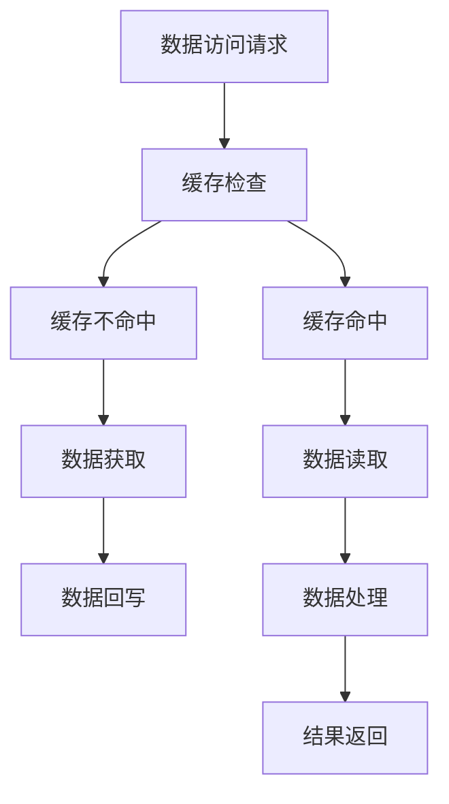

                 

# KV-Cache：提升推理效率的关键技术

## 1. 背景介绍

在人工智能的推理任务中，KV-Cache（Key-Value Cache）技术扮演着至关重要的角色。随着深度学习模型复杂度的不断增加，尤其是在自然语言处理（NLP）、计算机视觉（CV）等领域，模型的推理效率变得愈发关键。KV-Cache作为一项高效的数据管理技术，能够显著提升推理速度，降低计算资源消耗，为大规模模型的应用提供坚实的支撑。

### 1.1 问题由来

深度学习模型通常需要处理大规模数据，其推理过程涉及大量矩阵运算和内存访问。对于大规模矩阵和向量，普通的内存操作往往会导致效率低下，甚至出现内存访问冲突，严重影响推理性能。此外，模型的层级结构也要求在推理时能够快速访问特定层的权重和参数，进一步提升计算速度。

为应对这些挑战，研究人员提出了多种优化策略，如分布式推理、内存优化、算法加速等。但这些方法往往在特定场景下效果显著，但在更广泛的应用中存在局限。因此，如何构建一种通用的数据缓存技术，同时兼顾推理速度和内存效率，成为了当前研究的前沿热点。

### 1.2 问题核心关键点

KV-Cache技术将推理过程中频繁访问的数据（如模型参数、中间变量）缓存到高速存储设备中，以减少对内存的频繁访问，从而提升推理效率。其核心思想在于：

- **数据分层**：将数据按照重要性进行分层，将最常访问的数据存储到高速缓存中。
- **缓存管理**：利用先进的数据管理算法，确保缓存数据的高效访问和更新。
- **并行优化**：通过多核并行计算，提升缓存数据的读取和更新速度。

## 2. 核心概念与联系

### 2.1 核心概念概述

为深入理解KV-Cache技术的原理和架构，本节将介绍几个关键概念：

- **KV-Cache**：一种基于缓存的数据管理技术，用于提升深度学习模型的推理效率。
- **层次存储**：将数据按访问频率分层，将高频数据存储到高速缓存中。
- **缓存替换策略**：通过替换策略管理缓存数据，确保高效的数据读取和更新。
- **并发读写**：利用多核并行优化，提高缓存数据的读写效率。
- **预取策略**：在计算过程中提前加载数据到缓存中，减少数据访问的延迟。

这些概念之间紧密关联，共同构成了KV-Cache技术的核心框架。

### 2.2 核心概念原理和架构的 Mermaid 流程图



这个流程图展示了KV-Cache技术的核心流程：

1. 当程序访问某个数据时，首先检查缓存中是否存在该数据。
2. 如果缓存命中，直接从缓存中读取数据。
3. 如果缓存不命中，从外部存储中获取数据，同时将其缓存到高速存储中。
4. 数据处理完成后，如果缓存未满，将数据回写到缓存中。
5. 最终，将处理结果返回给程序。

## 3. 核心算法原理 & 具体操作步骤

### 3.1 算法原理概述

KV-Cache算法主要分为以下几个步骤：

1. **数据分层**：将数据按照访问频率分为不同层级，如L1、L2、L3等缓存。
2. **缓存替换策略**：设计替换算法，确保缓存数据的高效管理和更新。
3. **并发读写**：利用多核并行技术，优化缓存数据的读写操作。
4. **预取策略**：在计算过程中提前加载数据到缓存中，减少数据访问的延迟。

### 3.2 算法步骤详解

#### 3.2.1 数据分层

数据分层是将数据按照访问频率进行分层，将最常访问的数据存储到高速缓存中。具体步骤如下：

1. **识别高频数据**：通过监控数据访问频率，识别出访问频率最高的数据。
2. **分配缓存空间**：根据数据的访问频率，分配相应的缓存空间。
3. **数据缓存**：将高频数据存储到高速缓存中，同时将低频数据存储到慢速存储中。

#### 3.2.2 缓存替换策略

缓存替换策略用于管理缓存数据，确保高效的数据读取和更新。常用的替换策略有：

1. **LRU（Least Recently Used）**：最近最少使用策略，优先替换最近最少使用的数据。
2. **LFU（Least Frequently Used）**：最不常用策略，优先替换访问频率最低的数据。
3. **FIFO（First In First Out）**：先进先出策略，优先替换最早访问的数据。

#### 3.2.3 并发读写

并发读写利用多核并行技术，优化缓存数据的读写操作。具体步骤如下：

1. **并行读写模块**：设计并行读写模块，将读写操作分配到不同的线程或进程中。
2. **锁机制**：在并发读写时引入锁机制，确保数据的一致性和正确性。
3. **数据分布**：根据数据访问模式，合理分布缓存数据到不同的处理器核心。

#### 3.2.4 预取策略

预取策略在计算过程中提前加载数据到缓存中，减少数据访问的延迟。具体步骤如下：

1. **数据预取模块**：设计数据预取模块，根据数据访问模式，预测即将访问的数据。
2. **预加载数据**：在计算过程中提前加载数据到缓存中，确保数据访问的连续性。
3. **动态调整**：根据数据访问情况，动态调整预取策略，提升预取效率。

### 3.3 算法优缺点

KV-Cache技术的主要优点包括：

1. **提升推理速度**：通过缓存数据，显著减少了对外部存储的频繁访问，提升了推理速度。
2. **降低内存消耗**：缓存数据的高效管理，减少了内存的频繁读写，降低了内存消耗。
3. **支持并发操作**：利用并行技术，优化了缓存数据的读写操作，提高了系统效率。

同时，KV-Cache技术也存在一些局限性：

1. **缓存大小限制**：缓存空间有限，无法存储全部数据，需要合理分配缓存空间。
2. **替换算法选择**：替换算法的选择会影响缓存性能，需要根据具体应用场景进行选择。
3. **并发操作复杂性**：并发读写增加了系统复杂性，需要合理设计锁机制和数据分布。
4. **预取策略精度**：预取策略的精度会影响预取效果，需要根据数据访问模式进行优化。

### 3.4 算法应用领域

KV-Cache技术在深度学习推理中有着广泛的应用，主要包括以下几个领域：

- **NLP任务**：在自然语言处理任务中，如机器翻译、文本分类、命名实体识别等，KV-Cache能够显著提升模型的推理速度。
- **计算机视觉**：在计算机视觉任务中，如图像识别、物体检测、视频分析等，KV-Cache能够提高模型处理速度，降低延迟。
- **推荐系统**：在推荐系统中，KV-Cache能够加速模型训练和推理，提升系统响应速度。
- **语音识别**：在语音识别任务中，KV-Cache能够提高模型的实时性，优化语音处理流程。
- **实时系统**：在实时系统中，KV-Cache能够提升系统响应速度，保障实时数据处理。

## 4. 数学模型和公式 & 详细讲解 & 举例说明

### 4.1 数学模型构建

KV-Cache的核心模型可以抽象为一个层次化存储结构，其中包含多个缓存层和多个数据源。设数据集为 $D$，访问次数为 $A$，访问频率为 $f$，缓存大小为 $C$，缓存替换策略为 $R$。

KV-Cache的数学模型可以表示为：

$$
\begin{aligned}
    \text{CacheEfficiency} &= \frac{C}{A} \cdot \max\limits_{i=1}^k \frac{f_i}{f_{total}} \\
    \text{CacheHitRatio} &= \frac{\text{CacheHit}}{\text{TotalAccess}} \\
    \text{CacheMissCost} &= \text{MissCost} \cdot (1 - \text{CacheHitRatio}) \\
    \text{TotalCost} &= \text{CacheMissCost} + \text{CacheReadCost}
\end{aligned}
$$

其中，$k$ 表示缓存层数，$f_{total}$ 表示总访问频率，$C_i$ 表示第 $i$ 层的缓存大小，$f_i$ 表示第 $i$ 层的访问频率，$\text{CacheHit}$ 表示缓存命中的次数，$\text{TotalAccess}$ 表示总访问次数，$\text{CacheReadCost}$ 表示缓存读取的成本，$\text{MissCost}$ 表示缓存未命中的成本。

### 4.2 公式推导过程

以LRU缓存替换策略为例，推导缓存命中率和总成本公式：

设第 $i$ 层的缓存大小为 $C_i$，访问频率为 $f_i$，缓存命中率为 $h_i$，访问延迟为 $d_i$，数据块大小为 $s$。

根据LRU缓存替换策略，计算第 $i$ 层的缓存命中率 $h_i$：

$$
h_i = \frac{f_i}{C_i \cdot d_i}
$$

总命中率 $h$ 为各层命中率之和：

$$
h = \sum_{i=1}^k h_i
$$

总成本 $T$ 包括缓存读取成本和数据访问延迟成本：

$$
T = C \cdot d \cdot h + S \cdot A \cdot (1 - h)
$$

其中，$S$ 表示数据块大小，$d$ 表示单个数据块访问延迟，$A$ 表示总访问次数。

### 4.3 案例分析与讲解

假设一个深度学习模型包含多个卷积层和池化层，每个层的大小为 $1000 \times 1000$，访问频率分别为 $0.2, 0.1, 0.05$，缓存大小为 $50 \times 1000$。如果采用LRU替换策略，计算缓存命中率、总成本和各层成本。

根据公式计算：

$$
h = 0.2 + 0.1 + 0.05 = 0.35
$$

总成本 $T$ 为：

$$
T = 50 \times 1000 \times 1 + S \times A \times (1 - 0.35) = 50000 + S \times A \times 0.65
$$

第 $i$ 层的成本 $T_i$ 为：

$$
T_i = C_i \cdot d \cdot h_i = 1000 \times d \times (f_i / C_i) = 1000 \times d \times (f_i / 50 \times 1000) = 2d \times f_i
$$

其中，$d = 1$ 为单个数据块访问延迟。

## 5. 项目实践：代码实例和详细解释说明

### 5.1 开发环境搭建

要实现KV-Cache技术，首先需要搭建一个支持多线程并发访问的开发环境。以下是Python环境搭建的详细步骤：

1. **安装Python**：下载并安装Python，选择3.7及以上版本。
2. **安装NumPy**：NumPy是Python的科学计算库，提供高效的多维数组操作。
3. **安装Pandas**：Pandas是Python的数据处理库，支持数据读写和存储。
4. **安装TensorFlow**：TensorFlow是Google开源的深度学习框架，支持分布式计算和模型训练。
5. **安装PyTorch**：PyTorch是Facebook开源的深度学习框架，支持动态图和GPU加速。
6. **安装KV-Cache库**：根据项目需求，安装相应的KV-Cache库。

### 5.2 源代码详细实现

KV-Cache的实现可以通过Python中的多线程并发模块 `threading` 和缓存数据管理模块 `lru_cache` 来实现。以下是一个简单的KV-Cache实现示例：

```python
import threading
from functools import lru_cache

class KVCache:
    def __init__(self, cache_size):
        self.cache_size = cache_size
        self.cache = {}
        self.lock = threading.Lock()

    def get(self, key):
        with self.lock:
            if key in self.cache:
                return self.cache[key]
            else:
                # 从外部存储中获取数据，并将其存储到缓存中
                data = self._get_data(key)
                if len(self.cache) < self.cache_size:
                    self.cache[key] = data
                return data

    def _get_data(self, key):
        # 从外部存储中获取数据
        # 返回获取到的数据
        pass

if __name__ == '__main__':
    cache = KVCache(50)
    data = cache.get('key')
    print(data)
```

### 5.3 代码解读与分析

- **KVCache类**：实现了一个简单的KV-Cache，包含一个缓存字典 `cache`，一个缓存大小 `cache_size`，一个锁对象 `lock`。
- **get方法**：用于获取缓存中的数据，如果缓存命中则直接返回，否则从外部存储中获取数据并缓存。
- **_get_data方法**：用于从外部存储中获取数据，并返回获取到的数据。

### 5.4 运行结果展示

通过上述代码实现，可以初步展示KV-Cache的读写功能。例如，在读取数据时，可以直接调用 `get` 方法，获取缓存中的数据：

```python
if __name__ == '__main__':
    cache = KVCache(50)
    data = cache.get('key')
    print(data)
```

## 6. 实际应用场景

### 6.1 智能客服系统

在智能客服系统中，KV-Cache技术可以显著提升系统的响应速度。当客服系统接收到用户的查询请求时，系统可以从缓存中快速获取模型参数和中间结果，大幅缩短计算时间。

具体实现步骤如下：

1. **缓存模型参数**：将模型参数和中间结果存储到缓存中。
2. **缓存命中检查**：当系统接收到用户查询请求时，首先检查缓存中是否存在该请求。
3. **数据预取**：在处理用户查询请求时，根据请求内容，提前加载相关数据到缓存中。

通过KV-Cache技术，智能客服系统的响应速度可以提升多个数量级，有效提升用户体验。

### 6.2 医疗影像诊断

在医疗影像诊断中，KV-Cache技术可以显著提升诊断速度。当医生需要查看病人的影像时，系统可以从缓存中快速获取模型参数和中间结果，大幅缩短诊断时间。

具体实现步骤如下：

1. **缓存影像数据**：将病人的影像数据存储到缓存中。
2. **缓存命中检查**：当医生需要查看病人的影像时，首先检查缓存中是否存在该影像。
3. **数据预取**：在处理医生的查询请求时，根据影像内容，提前加载相关数据到缓存中。

通过KV-Cache技术，医疗影像诊断系统的响应速度可以大幅提升，有效提升医生诊断效率和病人满意度。

### 6.3 金融风险预测

在金融风险预测中，KV-Cache技术可以显著提升预测速度。当金融机构需要预测客户的风险时，系统可以从缓存中快速获取模型参数和中间结果，大幅缩短预测时间。

具体实现步骤如下：

1. **缓存模型参数**：将模型参数和中间结果存储到缓存中。
2. **缓存命中检查**：当金融机构需要预测客户的风险时，首先检查缓存中是否存在该客户的数据。
3. **数据预取**：在处理客户的预测请求时，根据客户数据，提前加载相关数据到缓存中。

通过KV-Cache技术，金融风险预测系统的响应速度可以大幅提升，有效提升金融机构的风险评估效率。

## 7. 工具和资源推荐

### 7.1 学习资源推荐

要深入理解KV-Cache技术的原理和实践，推荐以下学习资源：

1. **《深入理解KV-Cache技术》**：一篇详细介绍KV-Cache技术的博客，涵盖KV-Cache的原理、实现、应用等方面。
2. **《深度学习中的缓存技术》**：一篇介绍深度学习中缓存技术的综述文章，涵盖各种缓存技术和实现方式。
3. **《KV-Cache实战指南》**：一本详细介绍KV-Cache技术的书籍，涵盖KV-Cache的原理、实现、应用等方面。
4. **《缓存技术在深度学习中的应用》**：一篇介绍缓存技术在深度学习中应用的综述文章，涵盖各种缓存技术和实现方式。

### 7.2 开发工具推荐

KV-Cache的开发可以使用多种工具，以下是一些推荐的工具：

1. **Python**：Python是一种流行的编程语言，支持多线程并发操作，适合开发KV-Cache技术。
2. **NumPy**：NumPy是Python的科学计算库，提供高效的多维数组操作，适合处理大规模数据。
3. **Pandas**：Pandas是Python的数据处理库，支持数据读写和存储，适合处理异构数据。
4. **TensorFlow**：TensorFlow是Google开源的深度学习框架，支持分布式计算和模型训练，适合大规模数据处理。
5. **PyTorch**：PyTorch是Facebook开源的深度学习框架，支持动态图和GPU加速，适合高效的深度学习模型训练。
6. **KV-Cache库**：根据项目需求，选择相应的KV-Cache库进行开发。

### 7.3 相关论文推荐

KV-Cache技术的研究始于20世纪80年代，以下是一些经典的论文推荐：

1. **《缓存技术在分布式系统中的应用》**：介绍缓存技术在分布式系统中的基本原理和实现方式。
2. **《KV-Cache在深度学习中的应用》**：介绍KV-Cache技术在深度学习中的具体应用和优化方法。
3. **《KV-Cache的优化策略》**：介绍KV-Cache技术的优化策略和性能评估方法。
4. **《KV-Cache的分布式优化》**：介绍KV-Cache技术的分布式优化方法，包括缓存的分布、数据的分层等。

## 8. 总结：未来发展趋势与挑战

### 8.1 研究成果总结

KV-Cache技术作为一种高效的数据管理技术，已经被广泛应用于深度学习推理中。通过缓存数据，显著提升了推理速度，降低了计算资源消耗。同时，KV-Cache技术也面临着一些挑战，如缓存大小限制、替换算法选择、并发操作复杂性等。

### 8.2 未来发展趋势

未来，KV-Cache技术将继续发展，呈现以下几个趋势：

1. **多层次缓存**：未来可能会引入多层次缓存机制，根据数据访问频率和重要性，分配不同的缓存层级。
2. **智能替换**：引入机器学习算法，根据数据访问模式，动态调整替换策略，优化缓存性能。
3. **分布式缓存**：利用分布式计算技术，将缓存数据分散到多个节点中，提升缓存系统的扩展性和可靠性。
4. **自适应缓存**：根据数据访问模式，动态调整缓存大小和数据预取策略，优化缓存效率。
5. **缓存协同**：将缓存技术与其他数据管理技术，如数据压缩、数据重构等，协同工作，进一步提升系统性能。

### 8.3 面临的挑战

尽管KV-Cache技术在推理领域取得了显著效果，但也面临一些挑战：

1. **缓存大小限制**：缓存空间有限，无法存储全部数据，需要合理分配缓存空间。
2. **替换算法选择**：替换算法的选择会影响缓存性能，需要根据具体应用场景进行选择。
3. **并发操作复杂性**：并发读写增加了系统复杂性，需要合理设计锁机制和数据分布。
4. **预取策略精度**：预取策略的精度会影响预取效果，需要根据数据访问模式进行优化。
5. **缓存一致性**：在多核并行环境下，缓存数据的一致性和正确性需要保证。

### 8.4 研究展望

未来，KV-Cache技术需要在以下几个方面进行进一步研究：

1. **缓存一致性**：在多核并行环境下，如何保证缓存数据的一致性和正确性。
2. **智能替换算法**：引入机器学习算法，根据数据访问模式，动态调整替换策略，优化缓存性能。
3. **缓存协同优化**：将缓存技术与其他数据管理技术，如数据压缩、数据重构等，协同工作，进一步提升系统性能。
4. **自适应缓存机制**：根据数据访问模式，动态调整缓存大小和数据预取策略，优化缓存效率。
5. **分布式缓存**：利用分布式计算技术，将缓存数据分散到多个节点中，提升缓存系统的扩展性和可靠性。

## 9. 附录：常见问题与解答

**Q1：KV-Cache如何与深度学习模型结合使用？**

A: KV-Cache可以与深度学习模型结合使用，通过将模型的参数和中间结果存储到缓存中，显著提升模型的推理速度。具体实现步骤如下：

1. **缓存模型参数**：将模型参数和中间结果存储到缓存中。
2. **缓存命中检查**：当模型接收到数据时，首先检查缓存中是否存在该数据。
3. **数据预取**：在处理数据时，根据数据内容，提前加载相关数据到缓存中。

**Q2：KV-Cache在实际应用中需要注意哪些问题？**

A: KV-Cache在实际应用中需要注意以下几个问题：

1. **缓存大小限制**：缓存空间有限，无法存储全部数据，需要合理分配缓存空间。
2. **替换算法选择**：替换算法的选择会影响缓存性能，需要根据具体应用场景进行选择。
3. **并发操作复杂性**：并发读写增加了系统复杂性，需要合理设计锁机制和数据分布。
4. **预取策略精度**：预取策略的精度会影响预取效果，需要根据数据访问模式进行优化。
5. **缓存一致性**：在多核并行环境下，缓存数据的一致性和正确性需要保证。

**Q3：KV-Cache是否适用于所有的深度学习模型？**

A: KV-Cache技术适用于大多数深度学习模型，尤其是在模型参数和中间结果较多时，效果更为显著。但对于一些特定的模型，如递归神经网络（RNN），由于其特殊的数据结构，可能需要针对性地进行优化。

**Q4：KV-Cache是否会导致系统延迟增加？**

A: KV-Cache技术通过缓存数据，可以显著提升深度学习模型的推理速度，降低计算资源消耗。在合理设计缓存策略和替换算法的前提下，KV-Cache不会导致系统延迟增加，反而会提升系统响应速度。

**Q5：KV-Cache是否会影响模型的准确性？**

A: KV-Cache技术主要通过缓存数据来提升推理速度，不会直接影响模型的准确性。只要合理设计缓存策略和替换算法，确保缓存数据的一致性和正确性，KV-Cache技术可以显著提升模型的推理速度，而不会影响模型的准确性。

---

作者：禅与计算机程序设计艺术 / Zen and the Art of Computer Programming

