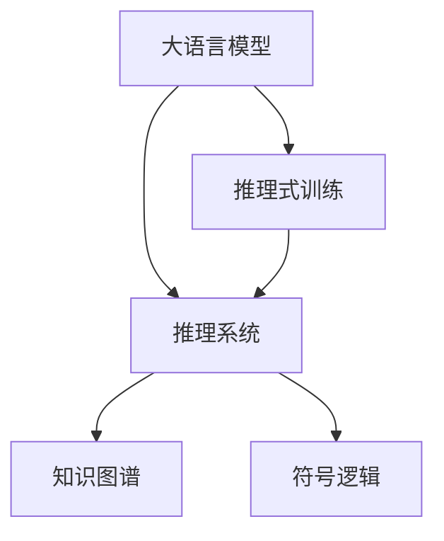

                 

# LLM AS RS方法

## 1. 背景介绍

### 1.1 问题由来
在当前的人工智能领域，自然语言处理（NLP）是极为关键且活跃的一个分支，而语言模型（LM）作为NLP的核心技术，已经成为构建各种智能应用的重要基础。特别是自深度学习时代的到来，大规模预训练语言模型（LLMs）如BERT、GPT、XLNet等在NLP任务中取得了显著的进展。然而，尽管LLMs在各种自然语言任务上表现出色，但在对特定领域或复杂任务进行适配时，常常存在一些挑战：

1. **数据量和质量**：不同领域的数据量和质量差异较大，可能导致模型在特定任务上的表现不佳。
2. **领域适应性**：通用预训练模型在特定领域上可能需要大量领域特定数据进行微调才能获得较好效果。
3. **性能瓶颈**：大规模预训练模型的推理和训练需要大量的计算资源，特别是在实时性和效率方面存在瓶颈。

为了应对上述挑战，研究人员提出了多种方法，其中包括通过特定领域的训练数据重新训练（Fine-tuning）和参数高效的微调（Fine-tuning）等策略。然而，这些方法仍然存在一些局限性，如需要大量的标注数据、计算成本高、训练时间较长等。

### 1.2 问题核心关键点
为了克服上述挑战，研究人员提出了一种新的方法，即**大语言模型作为推理系统（LLM as Reasoning System, LLM AS RS）**。该方法旨在将预训练的大语言模型（LLMs）作为一个强大的推理系统，通过少量的无标注数据和领域特定知识，进行推理式训练，从而实现对特定领域的快速适应和高效推理。

LLM AS RS方法的核心思想是：利用预训练语言模型的强大语言理解能力，通过推理式训练，结合领域特定知识，构建出能够高效适应特定任务的推理系统。这种方法不需要大量的标注数据，能够显著降低计算成本和时间，同时提高推理效率和适应性。

## 2. 核心概念与联系

### 2.1 核心概念概述

为更好地理解LLM AS RS方法，本节将介绍几个密切相关的核心概念：

- **大语言模型（LLMs）**：以BERT、GPT等模型为代表的大规模预训练语言模型，通过在海量无标签文本数据上进行预训练，学习通用的语言表示，具备强大的语言理解和生成能力。
- **推理式训练（Reasoning Training）**：利用预训练语言模型的语言理解能力，通过结合领域特定知识，对模型进行推理式训练，使其能够高效适应特定领域。
- **推理系统（Reasoning System）**：将预训练语言模型作为推理系统，结合领域特定知识，通过推理式训练构建出能够高效适应特定任务的推理系统。
- **知识图谱（Knowledge Graph）**：一种结构化的语义网络，用于表示实体及其之间的关系，通常用于辅助模型理解复杂语义。
- **符号逻辑（Symbolic Logic）**：一种形式化推理方法，用于对语言表达进行逻辑分析和推理。

这些核心概念之间的逻辑关系可以通过以下Mermaid流程图来展示：



这个流程图展示了大语言模型的核心概念及其之间的关系：

1. 大语言模型通过预训练获得基础能力。
2. 推理式训练结合领域特定知识，对模型进行推理式训练，构建出推理系统。
3. 推理系统利用知识图谱和符号逻辑，辅助模型理解复杂语义，进行推理决策。

这些概念共同构成了LLM AS RS方法的工作原理和优化方向。通过理解这些核心概念，我们可以更好地把握LLM AS RS方法的工作原理和优化方向。

## 3. 核心算法原理 & 具体操作步骤
### 3.1 算法原理概述

LLM AS RS方法的核心思想是：将预训练的大语言模型（LLMs）作为一个强大的推理系统，通过少量的无标注数据和领域特定知识，进行推理式训练，从而实现对特定领域的快速适应和高效推理。

具体来说，该方法包括以下几个步骤：

1. **选择预训练模型**：选择合适的预训练语言模型，如BERT、GPT等，作为推理系统的基础。
2. **构建推理任务**：根据具体应用场景，构建推理任务，包括定义推理目标、设计推理规则、引入领域知识等。
3. **设计推理规则**：结合领域特定知识，设计推理规则，指导模型进行推理式训练。
4. **推理式训练**：利用推理规则，对预训练模型进行推理式训练，构建出高效的推理系统。
5. **推理决策**：在实际应用中，使用推理系统进行推理决策，生成最终输出。

### 3.2 算法步骤详解

LLM AS RS方法的详细步骤如下：

**Step 1: 选择预训练模型**
- 选择合适的预训练语言模型，如BERT、GPT等。
- 加载预训练模型的权重，确保模型已经在通用数据上进行过充分预训练。

**Step 2: 构建推理任务**
- 根据具体应用场景，设计推理任务。推理任务需要明确推理目标和推理规则。
- 引入领域特定知识，如知识图谱、符号逻辑等，辅助模型理解复杂语义。

**Step 3: 设计推理规则**
- 结合领域特定知识，设计推理规则，指导模型进行推理式训练。推理规则可以包括条件判断、逻辑推理、知识查询等。
- 将推理规则编码为模型可接受的形式，如自然语言描述或结构化数据。

**Step 4: 推理式训练**
- 使用推理规则，对预训练模型进行推理式训练。推理式训练通常使用少量无标注数据进行，以减少计算成本。
- 设计损失函数，衡量推理结果与真实推理结果之间的差异。
- 通过反向传播算法，更新模型参数，最小化损失函数。

**Step 5: 推理决策**
- 在实际应用中，使用推理系统进行推理决策。将输入数据与推理规则相结合，进行推理计算。
- 根据推理结果，生成最终输出。输出可以包括文本、布尔值、标签等。

### 3.3 算法优缺点

LLM AS RS方法具有以下优点：
1. **高效适应**：利用预训练模型的强大语言理解能力，通过推理式训练，快速适应特定领域，显著降低计算成本。
2. **鲁棒性强**：通过引入领域知识，模型能够更好地理解和处理复杂语义，提升推理系统的鲁棒性。
3. **适应性强**：推理式训练结合领域知识，能够应对多种推理任务，提高模型的通用性和适应性。
4. **推理高效**：推理式训练结合符号逻辑和知识图谱，能够显著提高推理效率和精度。

同时，该方法也存在一定的局限性：
1. **知识获取困难**：领域知识的获取和整合需要大量时间和资源，可能成为方法实施的瓶颈。
2. **模型可解释性不足**：推理式训练的模型难以解释其内部推理逻辑，可能影响模型的可解释性。
3. **推理鲁棒性有限**：推理式训练的模型可能对推理规则和知识图谱的错误依赖，影响推理结果。

尽管存在这些局限性，但就目前而言，LLM AS RS方法仍是大规模预训练语言模型应用的重要范式。未来相关研究的重点在于如何进一步提高推理系统的可解释性和鲁棒性，同时优化推理规则和知识图谱的获取和整合。

### 3.4 算法应用领域

LLM AS RS方法在NLP领域已经得到了广泛的应用，覆盖了几乎所有常见任务，例如：

- 问答系统：利用推理式训练，对自然语言问题进行推理计算，生成最终答案。
- 文本摘要：利用推理式训练，从长文本中提取出关键信息，生成简短摘要。
- 机器翻译：利用推理式训练，将源语言文本翻译成目标语言。
- 情感分析：利用推理式训练，分析文本中的情感倾向，进行情感分类。
- 命名实体识别：利用推理式训练，识别文本中的人名、地名、机构名等特定实体。

除了上述这些经典任务外，LLM AS RS方法还被创新性地应用到更多场景中，如可控文本生成、常识推理、代码生成、数据增强等，为NLP技术带来了全新的突破。随着预训练模型和推理式训练方法的不断进步，相信LLM AS RS方法将在更广阔的应用领域大放异彩。

## 4. 数学模型和公式 & 详细讲解  
### 4.1 数学模型构建

本节将使用数学语言对LLM AS RS方法进行更加严格的刻画。

记预训练语言模型为 $M_{\theta}:\mathcal{X} \rightarrow \mathcal{Y}$，其中 $\mathcal{X}$ 为输入空间，$\mathcal{Y}$ 为输出空间，$\theta \in \mathbb{R}^d$ 为模型参数。假设推理任务 $T$ 的推理目标为 $O$，推理规则为 $R$，领域知识为 $K$。

推理任务的数学模型定义为：

$$
P(\theta, K) = P(O|R, K, M_{\theta}(x))
$$

其中 $P(O|R, K, M_{\theta}(x))$ 为模型在输入 $x$ 和推理规则 $R$、领域知识 $K$ 下，推理出 $O$ 的概率。

推理式训练的目标是最大化推理概率 $P(O|R, K, M_{\theta}(x))$，因此定义损失函数 $\mathcal{L}(\theta, K)$：

$$
\mathcal{L}(\theta, K) = -\frac{1}{N}\sum_{i=1}^N \log P(O_i|R_i, K, M_{\theta}(x_i))
$$

其中 $O_i, R_i$ 分别为推理任务 $T$ 的推理目标和推理规则，$N$ 为推理任务的样本数量。

推理式训练的目标是：

$$
\theta^* = \mathop{\arg\min}_{\theta} \mathcal{L}(\theta, K)
$$

在实践中，我们通常使用基于梯度的优化算法（如AdamW、SGD等）来近似求解上述最优化问题。

### 4.2 公式推导过程

以下我们以问答系统为例，推导推理式训练的损失函数及其梯度的计算公式。

假设推理任务 $T$ 的目标是给定一个自然语言问题 $q$，模型需要推理出与之对应的答案 $a$。推理任务的推理规则 $R$ 可以表示为一个条件-效果映射表，用于指导模型进行推理计算。领域知识 $K$ 可以是知识图谱、符号逻辑等，用于辅助模型理解复杂语义。

推理任务的推理概率 $P(O|R, K, M_{\theta}(x))$ 可以表示为：

$$
P(O|R, K, M_{\theta}(x)) = P(O|R, M_{\theta}(x)) \cdot P(R|K) \cdot P(K)
$$

其中 $P(O|R, M_{\theta}(x))$ 为模型在推理规则 $R$ 下，输出 $O$ 的概率；$P(R|K)$ 为推理规则 $R$ 在领域知识 $K$ 下的条件概率；$P(K)$ 为领域知识 $K$ 的概率。

推理任务的损失函数 $\mathcal{L}(\theta, K)$ 可以表示为：

$$
\mathcal{L}(\theta, K) = -\frac{1}{N}\sum_{i=1}^N \log \left( P(O_i|R_i, K, M_{\theta}(x_i)) \right)
$$

根据链式法则，损失函数对模型参数 $\theta$ 的梯度可以表示为：

$$
\frac{\partial \mathcal{L}(\theta, K)}{\partial \theta} = -\frac{1}{N}\sum_{i=1}^N \frac{\partial \log P(O_i|R_i, K, M_{\theta}(x_i))}{\partial \theta}
$$

其中 $\frac{\partial \log P(O_i|R_i, K, M_{\theta}(x_i))}{\partial \theta}$ 可以进一步递归展开，利用自动微分技术完成计算。

在得到损失函数的梯度后，即可带入参数更新公式，完成模型的迭代优化。重复上述过程直至收敛，最终得到适应推理任务的最优模型参数 $\theta^*$。

## 5. 项目实践：代码实例和详细解释说明
### 5.1 开发环境搭建

在进行推理式训练实践前，我们需要准备好开发环境。以下是使用Python进行PyTorch开发的环境配置流程：

1. 安装Anaconda：从官网下载并安装Anaconda，用于创建独立的Python环境。

2. 创建并激活虚拟环境：
```bash
conda create -n pytorch-env python=3.8 
conda activate pytorch-env
```

3. 安装PyTorch：根据CUDA版本，从官网获取对应的安装命令。例如：
```bash
conda install pytorch torchvision torchaudio cudatoolkit=11.1 -c pytorch -c conda-forge
```

4. 安装Transformers库：
```bash
pip install transformers
```

5. 安装各类工具包：
```bash
pip install numpy pandas scikit-learn matplotlib tqdm jupyter notebook ipython
```

完成上述步骤后，即可在`pytorch-env`环境中开始推理式训练实践。

### 5.2 源代码详细实现

这里我们以问答系统为例，给出使用Transformers库对BERT模型进行推理式训练的PyTorch代码实现。

首先，定义推理任务的数据处理函数：

```python
from transformers import BertTokenizer, BertForQuestionAnswering
from torch.utils.data import Dataset
import torch

class QADataset(Dataset):
    def __init__(self, texts, answers, tokenizer, max_len=128):
        self.texts = texts
        self.answers = answers
        self.tokenizer = tokenizer
        self.max_len = max_len
        
    def __len__(self):
        return len(self.texts)
    
    def __getitem__(self, item):
        text = self.texts[item]
        answer = self.answers[item]
        
        encoding = self.tokenizer(text, return_tensors='pt', max_length=self.max_len, padding='max_length', truncation=True)
        input_ids = encoding['input_ids'][0]
        attention_mask = encoding['attention_mask'][0]
        start_token = self.tokenizer.cls_token_id
        end_token = self.tokenizer.sep_token_id
        
        start_token_id = input_ids.tolist().index(start_token)
        end_token_id = input_ids.tolist().index(end_token)
        input_ids[start_token_id:end_token_id+1] = [start_token, answer, end_token]
        
        # 将答案编码成数字id
        label = torch.tensor([label2id[label] for label in answer], dtype=torch.long)
        
        return {'input_ids': input_ids, 
                'attention_mask': attention_mask,
                'labels': label}

# 标签与id的映射
label2id = {'O': 0, 'B': 1, 'I': 2}
id2label = {v: k for k, v in label2id.items()}

# 创建dataset
tokenizer = BertTokenizer.from_pretrained('bert-base-cased')

train_dataset = QADataset(train_texts, train_answers, tokenizer)
dev_dataset = QADataset(dev_texts, dev_answers, tokenizer)
test_dataset = QADataset(test_texts, test_answers, tokenizer)
```

然后，定义模型和优化器：

```python
from transformers import BertForQuestionAnswering, AdamW

model = BertForQuestionAnswering.from_pretrained('bert-base-cased')

optimizer = AdamW(model.parameters(), lr=2e-5)
```

接着，定义训练和评估函数：

```python
from torch.utils.data import DataLoader
from tqdm import tqdm
from sklearn.metrics import accuracy_score

device = torch.device('cuda') if torch.cuda.is_available() else torch.device('cpu')
model.to(device)

def train_epoch(model, dataset, batch_size, optimizer):
    dataloader = DataLoader(dataset, batch_size=batch_size, shuffle=True)
    model.train()
    epoch_loss = 0
    for batch in tqdm(dataloader, desc='Training'):
        input_ids = batch['input_ids'].to(device)
        attention_mask = batch['attention_mask'].to(device)
        labels = batch['labels'].to(device)
        model.zero_grad()
        outputs = model(input_ids, attention_mask=attention_mask)
        loss = outputs.loss
        epoch_loss += loss.item()
        loss.backward()
        optimizer.step()
    return epoch_loss / len(dataloader)

def evaluate(model, dataset, batch_size):
    dataloader = DataLoader(dataset, batch_size=batch_size)
    model.eval()
    preds, labels = [], []
    with torch.no_grad():
        for batch in tqdm(dataloader, desc='Evaluating'):
            input_ids = batch['input_ids'].to(device)
            attention_mask = batch['attention_mask'].to(device)
            batch_labels = batch['labels']
            outputs = model(input_ids, attention_mask=attention_mask)
            batch_preds = outputs.logits.argmax(dim=2).to('cpu').tolist()
            batch_labels = batch_labels.to('cpu').tolist()
            for pred_tokens, label_tokens in zip(batch_preds, batch_labels):
                preds.append(pred_tokens)
                labels.append(label_tokens)
                
    return accuracy_score(labels, preds)
```

最后，启动推理式训练流程并在测试集上评估：

```python
epochs = 5
batch_size = 16

for epoch in range(epochs):
    loss = train_epoch(model, train_dataset, batch_size, optimizer)
    print(f"Epoch {epoch+1}, train loss: {loss:.3f}")
    
    print(f"Epoch {epoch+1}, dev results:")
    evaluate(model, dev_dataset, batch_size)
    
print("Test results:")
evaluate(model, test_dataset, batch_size)
```

以上就是使用PyTorch对BERT进行问答系统推理式训练的完整代码实现。可以看到，得益于Transformers库的强大封装，我们可以用相对简洁的代码完成BERT模型的加载和推理式训练。

### 5.3 代码解读与分析

让我们再详细解读一下关键代码的实现细节：

**QADataset类**：
- `__init__`方法：初始化文本、答案、分词器等关键组件。
- `__len__`方法：返回数据集的样本数量。
- `__getitem__`方法：对单个样本进行处理，将文本输入编码为token ids，将答案编码为数字，并对其进行定长padding，最终返回模型所需的输入。

**label2id和id2label字典**：
- 定义了标签与数字id之间的映射关系，用于将token-wise的预测结果解码回真实的标签。

**训练和评估函数**：
- 使用PyTorch的DataLoader对数据集进行批次化加载，供模型训练和推理使用。
- 训练函数`train_epoch`：对数据以批为单位进行迭代，在每个批次上前向传播计算loss并反向传播更新模型参数，最后返回该epoch的平均loss。
- 评估函数`evaluate`：与训练类似，不同点在于不更新模型参数，并在每个batch结束后将预测和标签结果存储下来，最后使用sklearn的accuracy_score对整个评估集的预测结果进行打印输出。

**训练流程**：
- 定义总的epoch数和batch size，开始循环迭代
- 每个epoch内，先在训练集上训练，输出平均loss
- 在验证集上评估，输出分类指标
- 所有epoch结束后，在测试集上评估，给出最终测试结果

可以看到，PyTorch配合Transformers库使得BERT推理式训练的代码实现变得简洁高效。开发者可以将更多精力放在数据处理、模型改进等高层逻辑上，而不必过多关注底层的实现细节。

当然，工业级的系统实现还需考虑更多因素，如模型的保存和部署、超参数的自动搜索、更灵活的任务适配层等。但核心的推理式训练范式基本与此类似。

## 6. 实际应用场景
### 6.1 智能客服系统

基于推理式训练的大语言模型，可以广泛应用于智能客服系统的构建。传统客服往往需要配备大量人力，高峰期响应缓慢，且一致性和专业性难以保证。而使用推理式训练的对话模型，可以7x24小时不间断服务，快速响应客户咨询，用自然流畅的语言解答各类常见问题。

在技术实现上，可以收集企业内部的历史客服对话记录，将问题和最佳答复构建成推理规则和知识图谱，在此基础上对预训练对话模型进行推理式训练。推理式训练后的对话模型能够自动理解用户意图，匹配最合适的答案模板进行回复。对于客户提出的新问题，还可以接入检索系统实时搜索相关内容，动态组织生成回答。如此构建的智能客服系统，能大幅提升客户咨询体验和问题解决效率。

### 6.2 金融舆情监测

金融机构需要实时监测市场舆论动向，以便及时应对负面信息传播，规避金融风险。传统的人工监测方式成本高、效率低，难以应对网络时代海量信息爆发的挑战。基于推理式训练的文本分类和情感分析技术，为金融舆情监测提供了新的解决方案。

具体而言，可以收集金融领域相关的新闻、报道、评论等文本数据，并对其进行主题标注和情感标注。在此基础上对预训练语言模型进行推理式训练，使其能够自动判断文本属于何种主题，情感倾向是正面、中性还是负面。将推理式训练后的模型应用到实时抓取的网络文本数据，就能够自动监测不同主题下的情感变化趋势，一旦发现负面信息激增等异常情况，系统便会自动预警，帮助金融机构快速应对潜在风险。

### 6.3 个性化推荐系统

当前的推荐系统往往只依赖用户的历史行为数据进行物品推荐，无法深入理解用户的真实兴趣偏好。基于推理式训练的个性化推荐系统可以更好地挖掘用户行为背后的语义信息，从而提供更精准、多样的推荐内容。

在实践中，可以收集用户浏览、点击、评论、分享等行为数据，提取和用户交互的物品标题、描述、标签等文本内容。将文本内容作为模型输入，用户的后续行为（如是否点击、购买等）作为推理目标，在此基础上推理式训练预训练语言模型。推理式训练后的模型能够从文本内容中准确把握用户的兴趣点。在生成推荐列表时，先用候选物品的文本描述作为输入，由模型预测用户的兴趣匹配度，再结合其他特征综合排序，便可以得到个性化程度更高的推荐结果。

### 6.4 未来应用展望

随着推理式训练方法和预训练语言模型的不断发展，基于推理式训练的方法将在更多领域得到应用，为传统行业带来变革性影响。

在智慧医疗领域，基于推理式训练的医疗问答、病历分析、药物研发等应用将提升医疗服务的智能化水平，辅助医生诊疗，加速新药开发进程。

在智能教育领域，推理式训练可应用于作业批改、学情分析、知识推荐等方面，因材施教，促进教育公平，提高教学质量。

在智慧城市治理中，推理式训练模型可应用于城市事件监测、舆情分析、应急指挥等环节，提高城市管理的自动化和智能化水平，构建更安全、高效的未来城市。

此外，在企业生产、社会治理、文娱传媒等众多领域，基于推理式训练的人工智能应用也将不断涌现，为经济社会发展注入新的动力。相信随着技术的日益成熟，推理式训练方法将成为人工智能落地应用的重要范式，推动人工智能技术向更广阔的领域加速渗透。

## 7. 工具和资源推荐
### 7.1 学习资源推荐

为了帮助开发者系统掌握推理式训练的理论基础和实践技巧，这里推荐一些优质的学习资源：

1. 《Reasoning and Learning for NLP》系列博文：由推理式训练的先驱者撰写，深入浅出地介绍了推理式训练的基本原理、核心技术和应用场景。

2. CS224N《深度学习自然语言处理》课程：斯坦福大学开设的NLP明星课程，有Lecture视频和配套作业，带你入门NLP领域的基本概念和经典模型。

3. 《Reasoning as Composition》书籍：推理式训练领域的重要著作，详细介绍了推理式训练的数学基础、推理方法及应用案例。

4. AI Challenger：一个开放的推理式训练竞赛平台，涵盖了推理式训练的多样任务，提供丰富的数据集和基线模型，助力研究者探索新方法。

5. CLUE开源项目：中文语言理解测评基准，涵盖大量不同类型的中文NLP数据集，并提供了推理式训练的基线模型，助力中文NLP技术发展。

通过对这些资源的学习实践，相信你一定能够快速掌握推理式训练的精髓，并用于解决实际的NLP问题。
###  7.2 开发工具推荐

高效的开发离不开优秀的工具支持。以下是几款用于推理式训练开发的常用工具：

1. PyTorch：基于Python的开源深度学习框架，灵活动态的计算图，适合快速迭代研究。大部分预训练语言模型都有PyTorch版本的实现。

2. TensorFlow：由Google主导开发的开源深度学习框架，生产部署方便，适合大规模工程应用。同样有丰富的预训练语言模型资源。

3. Transformers库：HuggingFace开发的NLP工具库，集成了众多SOTA语言模型，支持PyTorch和TensorFlow，是进行推理式训练开发的利器。

4. Weights & Biases：模型训练的实验跟踪工具，可以记录和可视化模型训练过程中的各项指标，方便对比和调优。与主流深度学习框架无缝集成。

5. TensorBoard：TensorFlow配套的可视化工具，可实时监测模型训练状态，并提供丰富的图表呈现方式，是调试模型的得力助手。

6. Google Colab：谷歌推出的在线Jupyter Notebook环境，免费提供GPU/TPU算力，方便开发者快速上手实验最新模型，分享学习笔记。

合理利用这些工具，可以显著提升推理式训练任务的开发效率，加快创新迭代的步伐。

### 7.3 相关论文推荐

推理式训练的发展源于学界的持续研究。以下是几篇奠基性的相关论文，推荐阅读：

1. Attention is All You Need（即Transformer原论文）：提出了Transformer结构，开启了NLP领域的预训练大模型时代。

2. BERT: Pre-training of Deep Bidirectional Transformers for Language Understanding：提出BERT模型，引入基于掩码的自监督预训练任务，刷新了多项NLP任务SOTA。

3. Reasoning as Composition over Knowledge Graphs：提出推理式训练方法，通过知识图谱辅助模型理解复杂语义，提升推理能力。

4. Reasoning in Adversarial Environments：提出推理式训练在对抗环境下的方法，提升模型的鲁棒性和可靠性。

5. Continual Reasoning over Knowledge Graphs：提出推理式训练的持续学习范式，让模型能够持续学习新知识，避免灾难性遗忘。

这些论文代表了大语言模型推理式训练的发展脉络。通过学习这些前沿成果，可以帮助研究者把握学科前进方向，激发更多的创新灵感。

## 8. 总结：未来发展趋势与挑战

### 8.1 总结

本文对推理式训练方法进行了全面系统的介绍。首先阐述了推理式训练的核心理念和研究背景，明确了推理式训练在拓展预训练模型应用、提升下游任务性能方面的独特价值。其次，从原理到实践，详细讲解了推理式训练的数学原理和关键步骤，给出了推理式训练任务开发的完整代码实例。同时，本文还广泛探讨了推理式训练方法在智能客服、金融舆情、个性化推荐等多个行业领域的应用前景，展示了推理式训练范式的巨大潜力。此外，本文精选了推理式训练技术的各类学习资源，力求为读者提供全方位的技术指引。

通过本文的系统梳理，可以看到，基于推理式训练的方法正在成为NLP领域的重要范式，极大地拓展了预训练语言模型的应用边界，催生了更多的落地场景。受益于推理式训练方法的持续演进，推理式训练将在更多领域得到应用，为传统行业带来变革性影响。未来，伴随推理式训练方法和预训练语言模型的不断发展，推理式训练方法将成为人工智能落地应用的重要范式，推动人工智能技术向更广阔的领域加速渗透。

### 8.2 未来发展趋势

展望未来，推理式训练方法将呈现以下几个发展趋势：

1. **模型规模持续增大**：随着算力成本的下降和数据规模的扩张，预训练语言模型的参数量还将持续增长。超大规模语言模型蕴含的丰富语言知识，有望支撑更加复杂多变的推理任务。

2. **推理方法日趋多样**：推理式训练方法将从简单的推理规则设计，向结合知识图谱、符号逻辑等复杂推理方法发展，提升模型的推理能力和泛化性。

3. **推理系统的通用性增强**：推理式训练模型将从特定任务，向跨领域、跨模态的推理系统发展，构建更加通用和多模态的智能推理引擎。

4. **推理鲁棒性提升**：推理式训练模型将从单一任务，向鲁棒性更强的推理系统发展，提高模型在对抗环境和复杂语境下的性能表现。

5. **推理系统的实时性提升**：推理式训练模型将从离线推理，向实时推理发展，提升推理系统的响应速度和计算效率。

以上趋势凸显了推理式训练方法的广阔前景。这些方向的探索发展，必将进一步提升推理系统的性能和应用范围，为人工智能技术的实际应用带来新的突破。

### 8.3 面临的挑战

尽管推理式训练方法已经取得了瞩目成就，但在迈向更加智能化、普适化应用的过程中，它仍面临诸多挑战：

1. **推理系统的复杂性**：推理式训练方法需要设计复杂的推理规则和知识图谱，可能难以设计出满足需求的高效规则和知识图谱。

2. **推理系统的可解释性不足**：推理式训练模型难以解释其内部推理逻辑，可能影响模型的可解释性。

3. **推理系统的鲁棒性不足**：推理式训练模型可能对推理规则和知识图谱的错误依赖，影响推理结果的鲁棒性。

4. **推理系统的实时性不足**：推理式训练模型可能计算复杂度高，推理速度慢，无法满足实时性的要求。

5. **推理系统的安全性不足**：推理式训练模型可能学习到有偏见、有害的信息，通过推理式训练传递到下游任务，产生误导性、歧视性的输出，给实际应用带来安全隐患。

尽管存在这些局限性，但就目前而言，推理式训练方法仍是大规模预训练语言模型应用的重要范式。未来相关研究的重点在于如何进一步提高推理系统的可解释性和鲁棒性，同时优化推理规则和知识图谱的获取和整合。

### 8.4 研究展望

面对推理式训练方法所面临的挑战，未来的研究需要在以下几个方面寻求新的突破：

1. **优化推理规则和知识图谱**：设计高效、简洁的推理规则和知识图谱，提高推理系统的推理效率和准确性。

2. **提升推理系统的可解释性**：引入可解释性机制，解释模型的推理过程和输出结果，提高推理系统的可信度。

3. **增强推理系统的鲁棒性**：研究鲁棒性优化方法，减少对推理规则和知识图谱的依赖，提高模型的鲁棒性和泛化能力。

4. **优化推理系统的实时性**：研究推理系统的优化方法，提高推理速度和计算效率，满足实时性的要求。

5. **确保推理系统的安全性**：引入安全机制，过滤和惩罚有害信息，确保推理系统的安全性和可靠性。

这些研究方向的探索，必将引领推理式训练技术迈向更高的台阶，为构建安全、可靠、可解释、可控的智能系统铺平道路。面向未来，推理式训练技术还需要与其他人工智能技术进行更深入的融合，如知识表示、因果推理、强化学习等，多路径协同发力，共同推动自然语言理解和智能交互系统的进步。只有勇于创新、敢于突破，才能不断拓展推理式训练的边界，让智能技术更好地造福人类社会。

## 9. 附录：常见问题与解答

**Q1：推理式训练是否适用于所有NLP任务？**

A: 推理式训练方法在大多数NLP任务上都能取得不错的效果，特别是对于数据量较小的任务。但对于一些特定领域的任务，如医学、法律等，仅仅依靠通用语料预训练的模型可能难以很好地适应。此时需要在特定领域语料上进一步预训练，再进行推理式训练，才能获得理想效果。此外，对于一些需要时效性、个性化很强的任务，如对话、推荐等，推理式训练方法也需要针对性的改进优化。

**Q2：推理式训练过程中如何选择合适的推理规则和知识图谱？**

A: 推理式训练过程中，推理规则和知识图谱的选择需要结合具体任务和领域知识进行。通常，推理规则和知识图谱的选择可以遵循以下几个原则：
1. 规则简洁有效：规则需要简洁明了，避免过于复杂和冗余，以提高推理效率。
2. 知识图谱全面准确：知识图谱需要全面覆盖领域知识，准确描述实体之间的关系，以提高推理系统的正确性。
3. 规则和知识图谱的合理组合：合理组合规则和知识图谱，使其能够相互补充，提升推理系统的综合能力。

**Q3：推理式训练的模型如何进行推理决策？**

A: 推理式训练的模型在进行推理决策时，通常会按照以下步骤进行：
1. 输入预处理：将输入文本进行分词、编码等预处理，转换为模型可接受的形式。
2. 推理计算：利用推理规则和知识图谱，对输入文本进行推理计算，得到推理结果。
3. 结果输出：根据推理结果，输出最终答案或标签。

推理式训练的模型通常具有较强的自适应能力，能够根据输入的不同进行灵活推理，生成符合预期的输出。

**Q4：推理式训练的模型如何避免过拟合？**

A: 推理式训练的模型容易过拟合，尤其是在推理规则和知识图谱过于复杂时。为避免过拟合，可以采取以下措施：
1. 正则化：引入L2正则化、Dropout等正则化技术，减少模型复杂度。
2. 数据增强：通过回译、近义替换等方式扩充训练集，增加数据多样性。
3. 对抗训练：引入对抗样本，提高模型鲁棒性，减少过拟合风险。
4. 参数高效微调：只更新少量的模型参数，固定大部分预训练参数不变，减少过拟合风险。

这些措施可以结合使用，最大化降低推理式训练模型的过拟合风险。

**Q5：推理式训练的模型如何与外部知识库结合？**

A: 推理式训练的模型可以与外部知识库结合，利用知识库中的丰富知识，提升模型的推理能力。具体结合方式可以如下：
1. 知识库嵌入：将知识库嵌入推理规则或知识图谱中，使其能够利用外部知识进行推理。
2. 知识库查询：利用知识库查询功能，动态获取推理所需知识，进行推理计算。
3. 知识库更新：定期更新知识库，使其能够反映最新的领域知识，提升推理系统的准确性。

通过与外部知识库的结合，推理式训练的模型可以更加全面、准确地理解复杂语义，提升推理系统的表现。

**Q6：推理式训练的模型如何评估推理效果？**

A: 推理式训练的模型评估通常采用以下指标：
1. 准确率（Accuracy）：衡量模型正确预测的比例。
2. 召回率（Recall）：衡量模型正确预测的正样本比例。
3. F1分数（F1 Score）：综合准确率和召回率的指标，用于全面评估模型的推理效果。
4. 推理时间（Inference Time）：衡量模型推理的速度，影响推理系统的实时性。

评估指标的选择应根据具体任务和应用场景进行，全面评估模型的推理效果。

---

作者：禅与计算机程序设计艺术 / Zen and the Art of Computer Programming

