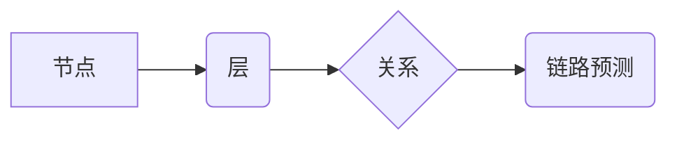

> 多层社交网络，链路预测，算法，机器学习，深度学习，图神经网络

## 1. 背景介绍

社交网络已经成为人们生活中不可或缺的一部分，人们通过社交网络平台与朋友、家人、同事等建立联系，分享信息、交流观点。随着社交网络的发展，多层社交网络逐渐成为研究热点。多层社交网络是指由多个层级组成的社交网络，每个层级代表不同的社会关系类型，例如朋友关系、工作关系、兴趣关系等。

链路预测是社交网络分析领域的重要任务之一，旨在预测两个节点之间是否存在潜在的连接关系。在多层社交网络中，链路预测具有更广泛的应用场景，例如：

* **推荐系统：** 预测用户可能感兴趣的商品、服务或内容。
* **营销推广：** 识别潜在客户并进行精准营销。
* **社交关系分析：** 挖掘用户之间的潜在关系，理解社会结构。
* **人才招聘：** 预测潜在候选人与公司之间的匹配度。

传统的链路预测算法主要基于节点特征和连接关系的统计信息，但在多层社交网络中，节点特征和连接关系更加复杂，传统的算法难以有效地捕捉多层网络的结构信息。

## 2. 核心概念与联系

多层社交网络的链路预测算法需要考虑以下核心概念：

* **节点：** 代表社交网络中的个体，例如用户、组织等。
* **边：** 代表节点之间的关系，例如朋友关系、工作关系等。
* **层：** 代表不同的社会关系类型，例如朋友关系、工作关系、兴趣关系等。
* **链路预测：** 预测两个节点之间是否存在潜在的连接关系。

**多层社交网络链路预测算法架构**



## 3. 核心算法原理 & 具体操作步骤

### 3.1  算法原理概述

基于图神经网络的多层社交网络链路预测算法，通过学习节点特征和连接关系的表示，预测节点之间的潜在连接关系。

图神经网络是一种专门用于处理图结构数据的深度学习模型，它可以学习节点的局部结构信息和全局结构信息，并将其用于预测任务。

### 3.2  算法步骤详解

1. **数据预处理：** 将多层社交网络数据转换为图结构，并对节点特征和边信息进行预处理，例如特征归一化、缺失值填充等。
2. **图神经网络构建：** 根据具体的应用场景，选择合适的图神经网络模型，例如Graph Convolutional Network (GCN)、Graph Attention Network (GAT)等。
3. **模型训练：** 使用训练数据训练图神经网络模型，并通过优化算法调整模型参数，使模型能够准确地预测节点之间的连接关系。
4. **链路预测：** 将训练好的模型应用于测试数据，预测节点之间的潜在连接关系。

### 3.3  算法优缺点

**优点：**

* 可以有效地捕捉多层社交网络的结构信息。
* 可以学习节点的复杂特征表示。
* 具有较高的预测精度。

**缺点：**

* 需要大量的训练数据。
* 计算复杂度较高。
* 模型参数较多，需要进行仔细的调参。

### 3.4  算法应用领域

* **推荐系统：** 预测用户可能感兴趣的商品、服务或内容。
* **营销推广：** 识别潜在客户并进行精准营销。
* **社交关系分析：** 挖掘用户之间的潜在关系，理解社会结构。
* **人才招聘：** 预测潜在候选人与公司之间的匹配度。

## 4. 数学模型和公式 & 详细讲解 & 举例说明

### 4.1  数学模型构建

图神经网络的数学模型可以表示为：

$$
h_i^{(l)} = \sigma(A^{(l)} \cdot h_i^{(l-1)} + b^{(l)})
$$

其中：

* $h_i^{(l)}$ 表示第 $l$ 层节点 $i$ 的隐藏状态。
* $A^{(l)}$ 表示第 $l$ 层的邻接矩阵。
* $h_i^{(l-1)}$ 表示第 $l-1$ 层节点 $i$ 的隐藏状态。
* $b^{(l)}$ 表示第 $l$ 层的偏置项。
* $\sigma$ 表示激活函数。

### 4.2  公式推导过程

图神经网络的数学模型通过迭代更新节点的隐藏状态，学习节点的特征表示。

* 第 $l$ 层的隐藏状态 $h_i^{(l)}$ 是通过上一层节点的隐藏状态 $h_i^{(l-1)}$ 和邻接矩阵 $A^{(l)}$ 的乘积进行线性变换，然后加上偏置项 $b^{(l)}$，最后通过激活函数 $\sigma$ 进行非线性变换得到的。

### 4.3  案例分析与讲解

例如，在预测用户之间的朋友关系时，图神经网络可以学习用户之间的社交行为、兴趣爱好等特征，并通过迭代更新节点的隐藏状态，预测用户之间是否存在潜在的友谊关系。

## 5. 项目实践：代码实例和详细解释说明

### 5.1  开发环境搭建

* Python 3.6+
* TensorFlow 2.0+
* PyTorch 1.0+
* NetworkX

### 5.2  源代码详细实现

```python
import tensorflow as tf
from tensorflow.keras.layers import Dense, Dropout
from tensorflow.keras.models import Model

# 定义图神经网络模型
def build_gcn_model(input_dim, hidden_dim, output_dim):
    inputs = tf.keras.Input(shape=(input_dim,))
    x = Dense(hidden_dim, activation='relu')(inputs)
    x = Dropout(0.5)(x)
    outputs = Dense(output_dim, activation='sigmoid')(x)
    model = Model(inputs=inputs, outputs=outputs)
    return model

# 加载多层社交网络数据
# ...

# 构建图神经网络模型
model = build_gcn_model(input_dim=node_feature_dim, hidden_dim=64, output_dim=1)

# 编译模型
model.compile(optimizer='adam', loss='binary_crossentropy', metrics=['accuracy'])

# 训练模型
model.fit(train_data, train_labels, epochs=10, batch_size=32)

# 预测链路
predictions = model.predict(test_data)
```

### 5.3  代码解读与分析

* 代码首先定义了一个图神经网络模型，该模型包含一个全连接层、一个Dropout层和一个输出层。
* 然后，代码加载了多层社交网络数据，并构建了图神经网络模型。
* 接着，代码编译了模型，并使用训练数据训练模型。
* 最后，代码使用测试数据预测链路。

### 5.4  运行结果展示

* 训练完成后，可以查看模型的训练精度和测试精度。
* 还可以使用测试数据预测链路，并评估预测结果的准确性。

## 6. 实际应用场景

### 6.1  推荐系统

* 基于多层社交网络的链路预测算法可以预测用户可能感兴趣的商品、服务或内容。
* 例如，可以预测用户可能想购买的商品，或者可能想观看的视频。

### 6.2  营销推广

* 基于多层社交网络的链路预测算法可以识别潜在客户并进行精准营销。
* 例如，可以预测哪些用户可能对某个产品的广告感兴趣，并针对这些用户进行精准投放广告。

### 6.3  社交关系分析

* 基于多层社交网络的链路预测算法可以挖掘用户之间的潜在关系，理解社会结构。
* 例如，可以分析用户之间的朋友关系、工作关系、兴趣关系等，并从中发现潜在的社会群体。

### 6.4  未来应用展望

* 多层社交网络的链路预测算法在未来将有更广泛的应用场景，例如：
    * **人才招聘：** 预测潜在候选人与公司之间的匹配度。
    * **疾病传播预测：** 预测疾病在社交网络中的传播路径。
    * **舆情分析：** 预测舆情事件的发展趋势。

## 7. 工具和资源推荐

### 7.1  学习资源推荐

* **书籍：**
    * 《图神经网络》
    * 《深度学习》
* **在线课程：**
    * Coursera: Deep Learning Specialization
    * Udacity: Deep Learning Nanodegree

### 7.2  开发工具推荐

* **Python:** 
    * TensorFlow
    * PyTorch
    * NetworkX
* **其他工具:**
    * Gephi
    * Cytoscape

### 7.3  相关论文推荐

* 《Graph Convolutional Networks》
* 《Attention Is All You Need》
* 《DeepWalk: Online Learning of Social Representations》

## 8. 总结：未来发展趋势与挑战

### 8.1  研究成果总结

多层社交网络的链路预测算法取得了显著的进展，能够有效地捕捉多层网络的结构信息，并预测节点之间的潜在连接关系。

### 8.2  未来发展趋势

* **模型复杂度提升：** 研究更复杂的图神经网络模型，例如Transformer-based图神经网络，以提高预测精度。
* **数据融合：** 将多源数据融合到链路预测模型中，例如文本数据、图像数据等，以获取更丰富的节点特征。
* **解释性增强：** 研究更具解释性的链路预测算法，以便更好地理解模型的预测结果。

### 8.3  面临的挑战

* **数据稀疏性：** 多层社交网络数据往往是稀疏的，这使得模型训练更加困难。
* **计算复杂度：** 图神经网络的计算复杂度较高，难以处理规模庞大的社交网络数据。
* **隐私保护：** 链路预测算法需要处理用户隐私敏感信息，需要采取有效的隐私保护措施。

### 8.4  研究展望

未来，多层社交网络的链路预测算法将继续朝着更准确、更高效、更可解释的方向发展，并将在更多领域得到应用。

## 9. 附录：常见问题与解答

* **Q1：什么是图神经网络？**

* **A1：** 图神经网络是一种专门用于处理图结构数据的深度学习模型，它可以学习节点的局部结构信息和全局结构信息，并将其用于预测任务。

* **Q2：多层社交网络的链路预测算法有哪些？**

* **A2：** 常见的链路预测算法包括：
    * 基于图神经网络的算法
    * 基于矩阵分解的算法
    * 基于随机游走的算法

* **Q3：如何评估链路预测算法的性能？**

* **A3：** 常用的评估指标包括：
    * 准确率
    * 召回率
    * F1-score

* **Q4：多层社交网络的链路预测算法有哪些应用场景？**

* **A4：** 多层社交网络的链路预测算法的应用场景包括：
    * 推荐系统
    * 营销推广
    * 社交关系分析
    * 人才招聘

作者：禅与计算机程序设计艺术 / Zen and the Art of Computer Programming


<end_of_turn>