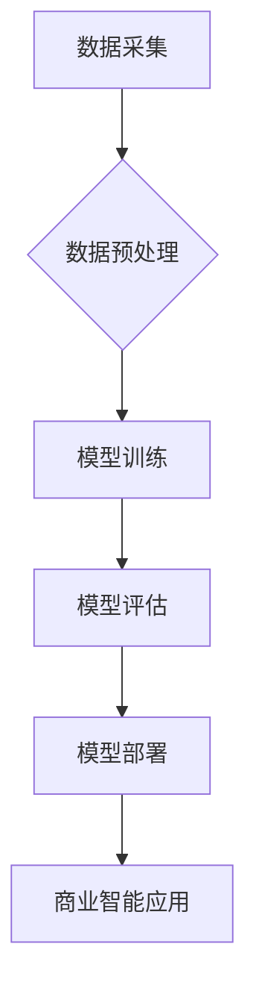

> 大模型、商业智能、深度学习、自然语言处理、计算机视觉、数据分析、预测建模、自动化决策

## 1. 背景介绍

商业智能 (BI) 作为企业决策支持的重要工具，一直致力于帮助企业从海量数据中挖掘价值，洞察市场趋势，优化运营效率。随着数据量的爆炸式增长和人工智能技术的飞速发展，传统 BI 方法面临着新的挑战和机遇。大模型，作为人工智能领域的新兴技术，凭借其强大的学习能力和泛化能力，正在深刻地改变着商业智能的格局。

近年来，大模型在自然语言处理 (NLP)、计算机视觉 (CV) 等领域取得了突破性进展，例如 GPT-3、DALL-E 等模型展现出令人惊叹的文本生成、图像创作能力。这些成果为商业智能领域带来了新的可能性，例如：

* **更智能的数据分析：** 大模型可以自动识别数据中的模式和趋势，提供更深入、更全面的洞察。
* **更精准的预测建模：** 大模型可以学习历史数据中的复杂关系，构建更精准的预测模型，帮助企业做出更明智的决策。
* **更便捷的自动化决策：** 大模型可以根据预设规则和数据分析结果，自动做出决策，提高运营效率。

## 2. 核心概念与联系

大模型是指参数量巨大、训练数据海量的人工智能模型。其核心概念包括：

* **深度学习：** 大模型基于深度神经网络架构，通过多层神经元进行特征提取和学习。
* **迁移学习：** 大模型通常采用迁移学习技术，利用预训练模型在特定领域的知识，快速适应新的任务。
* **数据驱动：** 大模型的训练和性能依赖于海量数据的支持。

**大模型与商业智能的联系：**

大模型为商业智能提供了强大的技术支撑，可以帮助企业实现以下目标：

* **数据挖掘和分析：** 大模型可以自动识别数据中的模式和趋势，帮助企业发现隐藏的价值。
* **预测建模：** 大模型可以学习历史数据中的复杂关系，构建更精准的预测模型，帮助企业预测未来趋势。
* **自动化决策：** 大模型可以根据预设规则和数据分析结果，自动做出决策，提高运营效率。



## 3. 核心算法原理 & 具体操作步骤

### 3.1  算法原理概述

大模型的训练主要基于深度学习算法，其中最常用的算法是 Transformer。Transformer 是一种基于注意力机制的神经网络架构，能够有效地处理序列数据，例如文本和时间序列数据。

Transformer 的核心思想是通过注意力机制学习数据之间的关系，并根据这些关系生成输出。注意力机制可以帮助模型关注输入序列中最重要的部分，从而提高模型的学习效率和准确性。

### 3.2  算法步骤详解

大模型的训练过程可以概括为以下步骤：

1. **数据准备：** 收集、清洗和预处理训练数据。
2. **模型构建：** 根据任务需求选择合适的模型架构，例如 Transformer。
3. **模型训练：** 使用训练数据训练模型，并通过反向传播算法优化模型参数。
4. **模型评估：** 使用测试数据评估模型的性能，并根据评估结果调整模型参数或架构。
5. **模型部署：** 将训练好的模型部署到生产环境中，用于实际应用。

### 3.3  算法优缺点

**优点：**

* **强大的学习能力：** 大模型能够学习复杂的数据关系，并生成高质量的输出。
* **泛化能力强：** 大模型在不同任务和领域上都表现出良好的泛化能力。
* **可迁移性高：** 大模型可以利用预训练模型的知识，快速适应新的任务。

**缺点：**

* **训练成本高：** 大模型的训练需要大量的计算资源和时间。
* **数据依赖性强：** 大模型的性能依赖于海量数据的支持。
* **可解释性差：** 大模型的决策过程难以理解，缺乏透明度。

### 3.4  算法应用领域

大模型在商业智能领域有着广泛的应用场景，例如：

* **客户关系管理 (CRM)：** 分析客户行为，预测客户 churn，个性化营销。
* **市场营销：** 识别市场趋势，预测产品销量，优化广告投放。
* **财务分析：** 预测财务指标，识别财务风险，优化投资决策。
* **运营管理：** 优化供应链，预测设备故障，提高运营效率。

## 4. 数学模型和公式 & 详细讲解 & 举例说明

### 4.1  数学模型构建

大模型的训练过程可以看作是一个优化问题，目标是找到模型参数，使得模型在训练数据上的损失函数最小。损失函数通常是模型预测值与真实值的差值，例如均方误差 (MSE) 或交叉熵 (Cross-Entropy)。

### 4.2  公式推导过程

反向传播算法是训练大模型的核心算法，其原理是通过计算梯度，逐步更新模型参数，使得损失函数不断减小。

梯度下降算法是一种常用的优化算法，其公式如下：

$$
\theta_{t+1} = \theta_t - \alpha \nabla L(\theta_t)
$$

其中：

* $\theta$ 是模型参数
* $t$ 是迭代次数
* $\alpha$ 是学习率
* $\nabla L(\theta_t)$ 是损失函数 $L$ 在当前参数 $\theta_t$ 处的梯度

### 4.3  案例分析与讲解

例如，在文本分类任务中，可以使用 softmax 函数将模型的输出映射到多个类别概率，然后使用交叉熵损失函数计算模型的预测误差。

$$
P(y|x) = \frac{e^{W_y^T x}}{\sum_{k=1}^{K} e^{W_k^T x}}
$$

$$
L(y, \hat{y}) = - \sum_{i=1}^{N} \log P(y_i | x_i)
$$

其中：

* $P(y|x)$ 是模型预测类别 $y$ 的概率
* $W_y^T$ 是类别 $y$ 的权重向量
* $x$ 是输入文本
* $N$ 是样本数量
* $y_i$ 是真实类别
* $\hat{y}_i$ 是模型预测类别

## 5. 项目实践：代码实例和详细解释说明

### 5.1  开发环境搭建

* Python 3.7+
* TensorFlow/PyTorch
* CUDA/cuDNN

### 5.2  源代码详细实现

```python
import tensorflow as tf

# 定义模型架构
model = tf.keras.Sequential([
    tf.keras.layers.Embedding(input_dim=vocab_size, output_dim=embedding_dim),
    tf.keras.layers.LSTM(units=hidden_size),
    tf.keras.layers.Dense(units=num_classes, activation='softmax')
])

# 编译模型
model.compile(optimizer='adam', loss='sparse_categorical_crossentropy', metrics=['accuracy'])

# 训练模型
model.fit(x_train, y_train, epochs=epochs, batch_size=batch_size)

# 评估模型
loss, accuracy = model.evaluate(x_test, y_test)
print('Test Loss:', loss)
print('Test Accuracy:', accuracy)
```

### 5.3  代码解读与分析

* **Embedding 层：** 将文本单词映射到低维向量空间。
* **LSTM 层：** 学习文本序列中的上下文信息。
* **Dense 层：** 将 LSTM 输出映射到多个类别概率。
* **Adam 优化器：** 用于更新模型参数。
* **Sparse Categorical Crossentropy 损失函数：** 用于文本分类任务。

### 5.4  运行结果展示

训练完成后，可以评估模型在测试集上的性能，例如准确率、召回率、F1-score 等。

## 6. 实际应用场景

### 6.1  客户关系管理 (CRM)

大模型可以分析客户行为数据，预测客户 churn，并提供个性化营销建议。例如，可以根据客户的购买历史、浏览记录和反馈信息，预测他们是否会流失，并针对不同客户群体的需求，提供个性化的促销活动和服务。

### 6.2  市场营销

大模型可以识别市场趋势，预测产品销量，并优化广告投放。例如，可以分析社交媒体数据、新闻报道和搜索引擎趋势，预测未来市场需求，并根据预测结果，调整产品开发和营销策略。

### 6.3  财务分析

大模型可以预测财务指标，识别财务风险，并优化投资决策。例如，可以分析公司财务报表、市场数据和经济指标，预测公司未来盈利能力和财务风险，并根据预测结果，制定投资策略。

### 6.4  未来应用展望

随着大模型技术的不断发展，其在商业智能领域的应用场景将更加广泛和深入。例如：

* **智能客服：** 大模型可以构建智能客服系统，自动回答客户问题，提供个性化服务。
* **智能决策支持：** 大模型可以帮助企业决策者做出更明智的决策，例如预测市场趋势、优化运营策略、识别风险机会。
* **个性化推荐：** 大模型可以根据用户的兴趣和行为，提供个性化的产品和服务推荐。

## 7. 工具和资源推荐

### 7.1  学习资源推荐

* **书籍：**
    * Deep Learning by Ian Goodfellow, Yoshua Bengio, and Aaron Courville
    * Natural Language Processing with Python by Steven Bird, Ewan Klein, and Edward Loper
* **在线课程：**
    * TensorFlow Tutorials: https://www.tensorflow.org/tutorials
    * PyTorch Tutorials: https://pytorch.org/tutorials/

### 7.2  开发工具推荐

* **TensorFlow:** https://www.tensorflow.org/
* **PyTorch:** https://pytorch.org/
* **Hugging Face Transformers:** https://huggingface.co/transformers/

### 7.3  相关论文推荐

* Attention Is All You Need (Vaswani et al., 2017)
* BERT: Pre-training of Deep Bidirectional Transformers for Language Understanding (Devlin et al., 2018)
* GPT-3: Language Models are Few-Shot Learners (Brown et al., 2020)

## 8. 总结：未来发展趋势与挑战

### 8.1  研究成果总结

大模型在商业智能领域取得了显著的成果，例如：

* **数据分析和洞察：** 大模型可以自动识别数据中的模式和趋势，提供更深入、更全面的洞察。
* **预测建模：** 大模型可以构建更精准的预测模型，帮助企业预测未来趋势。
* **自动化决策：** 大模型可以根据预设规则和数据分析结果，自动做出决策，提高运营效率。

### 8.2  未来发展趋势

* **模型规模和能力的提升：** 未来大模型的规模和能力将继续提升，能够处理更复杂的数据和任务。
* **多模态大模型的开发：** 未来大模型将融合文本、图像、音频等多模态数据，提供更全面的智能服务。
* **可解释性研究的加强：** 未来将更加注重大模型的可解释性，使其决策过程更加透明和可理解。

### 8.3  面临的挑战

* **训练成本高：** 大模型的训练需要大量的计算资源和时间，成本较高。
* **数据依赖性强：** 大模型的性能依赖于海量数据的支持，数据质量和可用性是关键挑战。
* **可解释性差：** 大模型的决策过程难以理解，缺乏透明度，需要进一步研究。

### 8.4  研究展望

未来，大模型在商业智能领域的应用将更加广泛和深入，为企业提供更智能、更便捷、更有效的决策支持。

## 9. 附录：常见问题与解答

**Q1：大模型