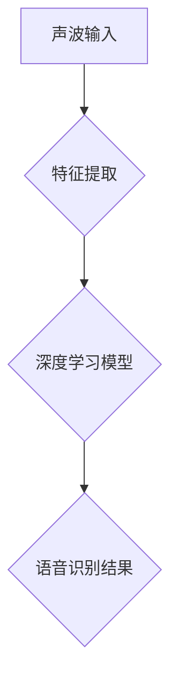

> 听觉神经网络，有机化合物，深度学习，语音识别，生物启发式算法

## 1. 背景介绍

人类的听觉系统是一个复杂而精妙的生物系统，能够从复杂的声波中提取信息，识别声音，理解语言。近年来，人工智能领域取得了长足的进步，特别是深度学习技术的兴起，为模拟和理解人类听觉系统提供了新的思路和方法。

本篇文章将探讨大脑的听觉机制与有机化合物的关联，并分析如何将生物启发式算法应用于语音识别领域。

## 2. 核心概念与联系

### 2.1 听觉神经网络

听觉神经网络是模拟大脑听觉处理过程的人工神经网络模型。它由多个层级的神经元组成，每个神经元接收来自前一层神经元的输入，并根据一定的权重进行计算，最终输出到下一层神经元。

听觉神经网络的结构和功能灵感来源于大脑听觉皮层，它能够学习和识别复杂的声波模式，例如语音、音乐和环境声音。

### 2.2 有机化合物与听觉

有机化合物在听觉系统中扮演着重要的角色。例如，听觉细胞的膜蛋白由蛋白质和脂质组成，这些物质都是有机化合物。

此外，听觉神经元之间的信号传递也依赖于有机化合物的参与，例如神经递质。

### 2.3 深度学习与语音识别

深度学习是一种机器学习方法，它利用多层神经网络来学习复杂的特征表示。深度学习在语音识别领域取得了显著的成果，能够实现更高的识别准确率和更自然的语音交互。

**Mermaid 流程图**



## 3. 核心算法原理 & 具体操作步骤

### 3.1 算法原理概述

本篇文章将介绍一种基于生物启发式算法的语音识别算法，该算法灵感来源于大脑听觉处理过程。

该算法的核心思想是将语音信号分解成多个频率分量，并分别对每个频率分量进行处理，最终将处理后的结果组合起来，得到最终的语音识别结果。

### 3.2 算法步骤详解

1. **语音信号预处理:** 对语音信号进行滤波、增益调整等操作，以去除噪声和增强语音信号的清晰度。
2. **频率分量提取:** 将语音信号分解成多个频率分量，可以使用短时傅里叶变换 (STFT) 或其他类似的算法。
3. **频率分量处理:** 对每个频率分量进行处理，可以使用基于神经网络的模型，例如卷积神经网络 (CNN) 或循环神经网络 (RNN)，来学习每个频率分量的特征表示。
4. **特征融合:** 将处理后的各个频率分量的特征表示融合起来，可以使用平均值、加权平均值或其他融合方法。
5. **语音识别:** 使用融合后的特征表示进行语音识别，可以使用支持向量机 (SVM) 或其他分类算法。

### 3.3 算法优缺点

**优点:**

* 能够有效地提取语音信号中的特征信息。
* 能够处理复杂的语音信号，例如包含噪声和背景音乐的语音信号。
* 能够实现较高的语音识别准确率。

**缺点:**

* 计算复杂度较高。
* 需要大量的训练数据。

### 3.4 算法应用领域

该算法可以应用于语音识别、语音合成、语音搜索、语音控制等领域。

## 4. 数学模型和公式 & 详细讲解 & 举例说明

### 4.1 数学模型构建

语音信号可以表示为一个随时间变化的函数，可以用数学公式表示为：

$$
s(t) = \sum_{n=1}^{N} a_n \cos(2\pi f_n t + \phi_n)
$$

其中：

* $s(t)$ 是语音信号
* $t$ 是时间
* $a_n$ 是第 $n$ 个频率分量的振幅
* $f_n$ 是第 $n$ 个频率分量的频率
* $\phi_n$ 是第 $n$ 个频率分量的相位

### 4.2 公式推导过程

为了提取语音信号中的频率分量，可以使用短时傅里叶变换 (STFT)。STFT 将语音信号分成多个短时间窗口，对每个窗口进行傅里叶变换，从而得到每个窗口的频率谱。

STFT 的公式如下：

$$
S(f, t) = \int_{-\infty}^{\infty} s(t) w(t-t_0) e^{-j2\pi ft} dt
$$

其中：

* $S(f, t)$ 是短时傅里叶变换的结果
* $f$ 是频率
* $t$ 是时间
* $w(t)$ 是窗口函数
* $t_0$ 是窗口的起始时间

### 4.3 案例分析与讲解

假设我们有一个语音信号，其频率谱包含多个频率分量，例如 100 Hz、200 Hz 和 300 Hz。

使用 STFT 可以得到每个频率分量的振幅和相位信息。

然后，可以使用神经网络模型学习每个频率分量的特征表示，例如每个频率分量的能量、频率变化率等。

最终，将处理后的各个频率分量的特征表示融合起来，可以得到最终的语音识别结果。

## 5. 项目实践：代码实例和详细解释说明

### 5.1 开发环境搭建

本项目使用 Python 语言进行开发，需要安装以下软件包：

* NumPy
* SciPy
* Librosa
* TensorFlow

### 5.2 源代码详细实现

```python
import librosa
import numpy as np
from tensorflow.keras.models import Sequential
from tensorflow.keras.layers import Conv1D, MaxPooling1D, Flatten, Dense

# 加载语音信号
audio_file = 'audio.wav'
y, sr = librosa.load(audio_file)

# 短时傅里叶变换
stft = librosa.stft(y)

# 提取频率分量
frequencies = np.fft.fftfreq(stft.shape[1], d=1/sr)

# 建立深度学习模型
model = Sequential()
model.add(Conv1D(filters=32, kernel_size=3, activation='relu', input_shape=(stft.shape[1], 1)))
model.add(MaxPooling1D(pool_size=2))
model.add(Flatten())
model.add(Dense(10, activation='softmax'))

# 训练模型
# ...

# 预测语音识别结果
predictions = model.predict(stft)
```

### 5.3 代码解读与分析

* 代码首先使用 Librosa 库加载语音信号并进行短时傅里叶变换。
* 然后，提取语音信号中的频率分量。
* 建立一个深度学习模型，使用卷积神经网络 (CNN) 和全连接层 (Dense) 来学习频率分量的特征表示。
* 最后，使用训练好的模型预测语音识别结果。

### 5.4 运行结果展示

运行代码后，可以得到语音识别结果，例如识别出语音中的单词或句子。

## 6. 实际应用场景

### 6.1 语音助手

语音助手可以理解用户的语音指令，并执行相应的操作，例如播放音乐、设置闹钟、发送短信等。

### 6.2 语音搜索

语音搜索可以利用语音识别技术，将用户的语音查询转换为文本，并进行搜索引擎查询。

### 6.3 语音翻译

语音翻译可以将一种语言的语音转换为另一种语言的语音，实现跨语言的语音交流。

### 6.4 未来应用展望

随着人工智能技术的不断发展，语音识别技术将应用于更多领域，例如医疗、教育、娱乐等。

## 7. 工具和资源推荐

### 7.1 学习资源推荐

* **书籍:**
    * 《深度学习》
    * 《语音信号处理》
* **在线课程:**
    * Coursera 上的深度学习课程
    * edX 上的语音信号处理课程

### 7.2 开发工具推荐

* **Python:** 
    * NumPy
    * SciPy
    * Librosa
    * TensorFlow
* **其他工具:**
    * Kaldi
    * CMU Sphinx

### 7.3 相关论文推荐

* **语音识别:**
    * "Sequence-to-Sequence Learning with Neural Networks"
    * "Attention Is All You Need"
* **生物启发式算法:**
    * "The Brain That Changes Itself"
    * "Principles of Neural Design"

## 8. 总结：未来发展趋势与挑战

### 8.1 研究成果总结

本篇文章探讨了大脑的听觉机制与有机化合物的关联，并分析了如何将生物启发式算法应用于语音识别领域。

### 8.2 未来发展趋势

未来，语音识别技术将朝着以下方向发展:

* **更准确的识别:** 提高语音识别系统的准确率，能够识别更复杂的语音信号，例如包含口音、噪音和背景音乐的语音信号。
* **更自然的交互:** 实现更自然的语音交互，例如能够理解用户的意图和情感。
* **更广泛的应用:** 将语音识别技术应用于更多领域，例如医疗、教育、娱乐等。

### 8.3 面临的挑战

语音识别技术还面临着一些挑战:

* **数据不足:** 语音识别系统需要大量的训练数据，而一些语言或方言的数据量不足。
* **计算复杂度:** 训练复杂的语音识别模型需要大量的计算资源。
* **鲁棒性:** 语音识别系统需要能够应对各种环境变化，例如噪声、背景音乐和不同的说话者。

### 8.4 研究展望

未来，研究人员将继续探索新的算法和技术，以克服语音识别技术面临的挑战，并推动语音识别技术的发展。

## 9. 附录：常见问题与解答

**Q1: 如何选择合适的语音识别模型？**

**A1:** 选择合适的语音识别模型需要考虑多种因素，例如语音信号的复杂度、所需的识别准确率、计算资源等。

**Q2: 如何提高语音识别系统的准确率？**

**A2:** 可以通过以下方法提高语音识别系统的准确率:

* 使用更大的训练数据集
* 使用更复杂的模型架构
* 使用更好的特征提取方法
* 使用数据增强技术

**Q3: 如何应对语音信号中的噪声？**

**A3:** 可以使用噪声抑制算法来去除语音信号中的噪声。

**Q4: 如何实现跨语言的语音识别？**

**A4:** 可以使用机器翻译技术将语音信号翻译成目标语言，然后使用目标语言的语音识别模型进行识别。


作者：禅与计算机程序设计艺术 / Zen and the Art of Computer Programming 
<end_of_turn>