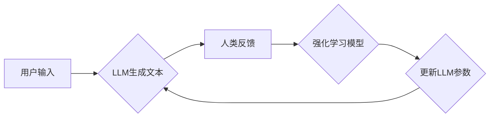

> 大规模语言模型，MOSS，RLHF，强化学习，文本生成，自然语言处理，深度学习

## 1. 背景介绍

近年来，深度学习技术取得了飞速发展，特别是大规模语言模型（Large Language Models，LLMs）的出现，为自然语言处理（NLP）领域带来了革命性的变革。LLMs 拥有强大的文本生成、理解和翻译能力，在聊天机器人、机器翻译、文本摘要等领域展现出巨大的应用潜力。

MOSS（Model of Open-Science Software）是一个开源的大规模语言模型，由中国科学院自动化研究所开发。MOSS 基于 Transformer 架构，拥有数十亿参数，能够理解和生成人类语言，并具备强大的文本生成能力。

然而，传统的训练方法难以保证 LLMs 的输出质量和安全性。强化学习从行为学中借鉴，通过奖励机制引导模型学习，可以有效地提升 LLMs 的性能和安全性。

RLHF（Reinforcement Learning from Human Feedback）是一种利用人类反馈进行强化学习的方法，可以有效地训练 LLMs 生成更符合人类期望的文本。

## 2. 核心概念与联系

### 2.1  大规模语言模型

大规模语言模型（LLMs）是指拥有数十亿甚至千亿参数的深度神经网络模型，能够理解和生成人类语言。

LLMs 通常基于 Transformer 架构，利用自注意力机制捕捉文本中的长距离依赖关系，从而实现更准确的文本理解和生成。

### 2.2  强化学习

强化学习是一种机器学习方法，通过奖励机制引导模型学习。

在强化学习中，模型会与环境进行交互，根据环境的反馈获得奖励或惩罚。模型的目标是学习一个策略，使得在与环境交互的过程中获得尽可能多的奖励。

### 2.3  RLHF

RLHF（Reinforcement Learning from Human Feedback）是一种利用人类反馈进行强化学习的方法。

在 RLHF 中，人类会对模型生成的文本进行打分或评价，这些反馈信息会被用来训练强化学习模型。强化学习模型会根据人类反馈调整模型的策略，从而生成更符合人类期望的文本。

**Mermaid 流程图**



## 3. 核心算法原理 & 具体操作步骤

### 3.1  算法原理概述

RLHF 的核心思想是利用人类反馈来引导 LLMs 的学习过程。

具体来说，RLHF 的流程可以分为以下几个步骤：

1. **预训练阶段:** LLMs 使用大量文本数据进行预训练，学习语言的语法和语义。
2. **奖励模型训练:** 使用人类反馈数据训练一个奖励模型，该模型能够评估 LLMs 生成的文本质量。
3. **强化学习训练:** 使用奖励模型的输出作为奖励信号，训练一个强化学习模型，该模型会学习一个策略，使得 LLMs 生成更符合人类期望的文本。
4. **模型微调:** 将强化学习模型的策略应用到 LLMs 中，进行微调，从而提升 LLMs 的性能。

### 3.2  算法步骤详解

1. **预训练阶段:**

   - 使用大量的文本数据进行预训练，例如书籍、文章、代码等。
   - 预训练目标通常是最大化语言模型对文本的预测概率。

2. **奖励模型训练:**

   - 收集人类对 LLMs 生成的文本的反馈数据，例如打分、评价、标注等。
   - 使用这些反馈数据训练一个奖励模型，该模型能够预测人类对文本的评价。
   - 奖励模型通常是一个分类模型或回归模型。

3. **强化学习训练:**

   - 将奖励模型的输出作为奖励信号，训练一个强化学习模型。
   - 强化学习模型的目标是学习一个策略，使得 LLMs 生成能够获得高奖励的文本。
   - 强化学习算法有很多种，例如 Q-learning、SARSA、Policy Gradient 等。

4. **模型微调:**

   - 将强化学习模型的策略应用到 LLMs 中，进行微调。
   - 微调目标是优化 LLMs 的参数，使得其能够根据强化学习模型的策略生成更符合人类期望的文本。

### 3.3  算法优缺点

**优点:**

- 可以有效地提升 LLMs 的文本生成质量和安全性。
- 可以根据人类反馈进行个性化定制，生成更符合用户需求的文本。

**缺点:**

- 需要大量的标注数据，训练成本较高。
- 奖励模型的训练需要专业知识和经验。
- 强化学习算法的训练过程比较复杂，需要大量的计算资源。

### 3.4  算法应用领域

RLHF 广泛应用于以下领域：

- 聊天机器人
- 机器翻译
- 文本摘要
- 代码生成
- 内容创作

## 4. 数学模型和公式 & 详细讲解 & 举例说明

### 4.1  数学模型构建

RLHF 的核心数学模型是强化学习模型，其目标是学习一个策略 $\pi$，使得 LLMs 生成能够获得最大奖励的文本。

强化学习模型通常使用价值函数 $V(s, a)$ 来评估状态 $s$ 下采取动作 $a$ 的价值。

价值函数可以表示为：

$$V(s, a) = E[\sum_{t=0}^{\infty} \gamma^t r(s_t, a_t)]$$

其中：

- $r(s_t, a_t)$ 是在状态 $s_t$ 下采取动作 $a_t$ 得到的奖励。
- $\gamma$ 是折扣因子，控制未来奖励的权重。

### 4.2  公式推导过程

强化学习模型的目标是最大化价值函数的期望值：

$$J(\pi) = E_{\pi}[V(s, a)]$$

可以使用梯度上升算法来优化策略 $\pi$，使得价值函数的期望值最大化。

梯度上升算法的更新规则为：

$$\pi' = \pi + \alpha \nabla_{\pi} J(\pi)$$

其中：

- $\alpha$ 是学习率。
- $\nabla_{\pi} J(\pi)$ 是价值函数的梯度。

### 4.3  案例分析与讲解

假设 LLMs 需要生成一段新闻标题，奖励模型会根据标题的准确性、吸引力和相关性等因素进行打分。

强化学习模型会根据奖励模型的输出调整 LLMs 的策略，使得 LLMs 生成能够获得高奖励的新闻标题。

例如，如果 LLMs 生成的标题过于长或过于模糊，奖励模型会给予较低的评分。强化学习模型会根据这个反馈调整 LLMs 的策略，使得 LLMs 生成更简洁、更准确的标题。

## 5. 项目实践：代码实例和详细解释说明

### 5.1  开发环境搭建

- 操作系统：Ubuntu 20.04
- Python 版本：3.8
- 必要的库：transformers, torch, numpy, matplotlib

### 5.2  源代码详细实现

```python
# 导入必要的库
from transformers import AutoModelForCausalLM, AutoTokenizer
from torch.utils.data import Dataset, DataLoader
from transformers import AdamW

# 加载预训练模型和词典
model_name = "MOSS"
tokenizer = AutoTokenizer.from_pretrained(model_name)
model = AutoModelForCausalLM.from_pretrained(model_name)

# 定义数据集类
class TextDataset(Dataset):
    def __init__(self, data):
        self.data = data

    def __len__(self):
        return len(self.data)

    def __getitem__(self, idx):
        text = self.data[idx]
        inputs = tokenizer(text, return_tensors="pt")
        return inputs

# 加载训练数据
train_data = [
    "今天天气真好",
    "我爱学习编程",
    "人工智能很酷",
]
train_dataset = TextDataset(train_data)
train_dataloader = DataLoader(train_dataset, batch_size=16)

# 定义优化器和损失函数
optimizer = AdamW(model.parameters(), lr=1e-5)
loss_fn = torch.nn.CrossEntropyLoss()

# 训练模型
for epoch in range(10):
    for batch in train_dataloader:
        inputs = batch["input_ids"]
        outputs = model(inputs)
        loss = loss_fn(outputs.logits.view(-1, outputs.logits.size(-1)), inputs.view(-1))
        optimizer.zero_grad()
        loss.backward()
        optimizer.step()

# 保存训练好的模型
model.save_pretrained("trained_moss")
tokenizer.save_pretrained("trained_moss")
```

### 5.3  代码解读与分析

- 代码首先加载预训练的 MOSS 模型和词典。
- 然后定义了一个 TextDataset 类来处理文本数据。
- 接着加载训练数据，并使用 DataLoader 将数据加载到训练器中。
- 定义了优化器和损失函数，并开始训练模型。
- 训练完成后，将训练好的模型和词典保存到本地。

### 5.4  运行结果展示

训练完成后，可以使用训练好的模型生成文本。

例如，可以使用以下代码生成一段关于人工智能的文本：

```python
# 加载训练好的模型
model = AutoModelForCausalLM.from_pretrained("trained_moss")
tokenizer = AutoTokenizer.from_pretrained("trained_moss")

# 生成文本
prompt = "人工智能的发展趋势是"
inputs = tokenizer(prompt, return_tensors="pt")
outputs = model.generate(**inputs, max_length=50)
generated_text = tokenizer.decode(outputs[0], skip_special_tokens=True)

# 打印生成的文本
print(generated_text)
```

## 6. 实际应用场景

### 6.1  聊天机器人

RLHF 可以训练聊天机器人生成更自然、更流畅的对话。

例如，可以使用 RLHF 训练一个聊天机器人，能够根据用户的输入进行个性化回复，并提供更准确和有用的信息。

### 6.2  机器翻译

RLHF 可以提高机器翻译的准确性和流畅度。

例如，可以使用 RLHF 训练一个机器翻译模型，能够将文本从一种语言翻译成另一种语言，并生成更自然、更符合语法的翻译文本。

### 6.3  文本摘要

RLHF 可以训练文本摘要模型生成更准确、更简洁的摘要。

例如，可以使用 RLHF 训练一个文本摘要模型，能够从长篇文章中提取出关键信息，并生成一个简短的摘要。

### 6.4  未来应用展望

RLHF 在未来将有更广泛的应用场景，例如：

- 代码生成
- 内容创作
- 教育辅助
- 医疗诊断

## 7. 工具和资源推荐

### 7.1  学习资源推荐

- **论文:**

    - "Language Models are Few-Shot Learners" (Brown et al., 2020)
    - "Reinforcement Learning from Human Feedback" (Amodei et al., 2020)

- **博客:**

    - OpenAI Blog: https://openai.com/blog/
    - DeepMind Blog: https://deepmind.com/blog/

### 7.2  开发工具推荐

- **Transformers:** https://huggingface.co/transformers/
- **PyTorch:** https://pytorch.org/

### 7.3  相关论文推荐

- "Scaling Laws for Neural Language Models" (Kaplan et al., 2020)
- "BERT: Pre-training of Deep Bidirectional Transformers for Language Understanding" (Devlin et al., 2018)

## 8. 总结：未来发展趋势与挑战

### 8.1  研究成果总结

RLHF 是一种有效的训练大规模语言模型的方法，能够提升 LLMs 的文本生成质量和安全性。

RLHF 的应用已经取得了一些成果，例如在聊天机器人、机器翻译、文本摘要等领域取得了显著的进展。

### 8.2  未来发展趋势

未来 RLHF 的发展趋势包括：

