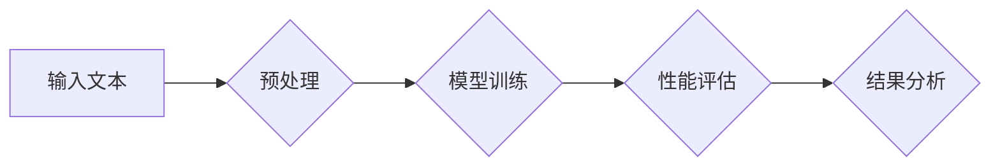

> 大规模语言模型，评估方法，性能指标，基准测试，自然语言处理，机器学习

## 1. 背景介绍

近年来，大规模语言模型（Large Language Models，LLMs）在自然语言处理（Natural Language Processing，NLP）领域取得了显著的进展。这些模型拥有数十亿甚至数千亿个参数，能够理解和生成人类语言，并在文本生成、机器翻译、问答系统等任务中表现出惊人的能力。然而，随着LLMs规模的不断扩大，对其性能进行准确评估变得越来越重要。

传统的评估方法，例如BLEU和ROUGE，主要关注机器翻译和文本摘要等特定任务的性能，难以全面衡量LLMs的多样性和泛化能力。因此，需要开发新的评估方法，能够更全面地评估LLMs的性能，并为模型的开发和应用提供指导。

## 2. 核心概念与联系

大规模语言模型评估方法的核心概念包括：

* **性能指标:** 用于量化LLMs在特定任务上的表现，例如准确率、召回率、F1-score等。
* **基准测试:** 一组标准化的测试任务和数据集，用于比较不同LLMs的性能。
* **评估框架:** 用于组织和执行评估任务的框架，包括数据预处理、模型训练、性能评估等步骤。

**Mermaid 流程图:**



## 3. 核心算法原理 & 具体操作步骤

### 3.1  算法原理概述

大规模语言模型评估方法通常基于以下核心算法原理：

* **统计学习:** 利用统计方法从训练数据中学习模型参数，并根据这些参数预测目标输出。
* **机器学习:** 利用机器学习算法训练模型，使其能够从数据中学习模式和规律。
* **深度学习:** 利用多层神经网络结构，学习更复杂的特征表示，从而提高模型的性能。

### 3.2  算法步骤详解

大规模语言模型评估方法的具体操作步骤如下：

1. **数据准备:** 收集和预处理评估数据，包括文本数据、标签数据等。
2. **模型选择:** 选择合适的LLM模型，例如BERT、GPT-3等。
3. **模型训练:** 使用训练数据训练LLM模型，并调整模型参数。
4. **性能评估:** 使用评估数据评估模型性能，并计算相应的性能指标。
5. **结果分析:** 分析评估结果，并根据结果进行模型改进和优化。

### 3.3  算法优缺点

大规模语言模型评估方法的优点包括：

* **自动化:** 可以自动化评估模型性能，减少人工干预。
* **客观性:** 基于数据驱动的评估结果，具有较高的客观性。
* **可重复性:** 评估过程可以重复执行，确保评估结果的可靠性。

缺点包括：

* **数据依赖:** 评估结果依赖于评估数据的质量和代表性。
* **指标局限性:** 现有的性能指标可能无法全面衡量LLMs的性能。
* **计算成本:** 评估大型语言模型的性能需要大量的计算资源。

### 3.4  算法应用领域

大规模语言模型评估方法广泛应用于以下领域：

* **自然语言处理:** 评估机器翻译、文本摘要、问答系统等任务的性能。
* **人工智能研究:** 比较不同LLM模型的性能，并推动模型的改进和发展。
* **产品开发:** 评估LLM模型在实际应用场景中的性能，并指导产品开发。

## 4. 数学模型和公式 & 详细讲解 & 举例说明

### 4.1  数学模型构建

大规模语言模型评估方法通常基于统计学习和机器学习的数学模型。例如，可以使用概率模型来表示语言的统计特性，并根据模型参数预测目标输出。

### 4.2  公式推导过程

具体的公式推导过程取决于所使用的评估方法和模型类型。例如，对于机器翻译任务，可以使用BLEU公式来计算模型的性能。

**BLEU公式:**

$$
BLEU = exp\left( \sum_{n=1}^{N} \frac{w_n}{N} \cdot log(BP(n)) \right)
$$

其中：

* $N$ 是n-gram的长度。
* $w_n$ 是n-gram的权重。
* $BP(n)$ 是模型生成的翻译文本中n-gram的出现频率。

### 4.3  案例分析与讲解

例如，可以使用BLEU公式来评估机器翻译模型的性能。假设模型将英文句子“The cat sat on the mat”翻译成“猫坐在垫子上”，可以使用BLEU公式计算模型的性能。

## 5. 项目实践：代码实例和详细解释说明

### 5.1  开发环境搭建

可以使用Python语言和相关的库来实现大规模语言模型评估方法。例如，可以使用HuggingFace Transformers库来加载预训练的LLM模型，并使用Scikit-learn库来计算性能指标。

### 5.2  源代码详细实现

```python
from transformers import AutoModelForSequenceClassification, AutoTokenizer
from sklearn.metrics import accuracy_score

# 加载预训练模型和词典
model_name = "bert-base-uncased"
tokenizer = AutoTokenizer.from_pretrained(model_name)
model = AutoModelForSequenceClassification.from_pretrained(model_name)

# 预处理数据
def preprocess_text(text):
    return tokenizer(text, padding=True, truncation=True)

# 训练模型
# ...

# 评估模型性能
predictions = model.predict(test_data)
accuracy = accuracy_score(test_labels, predictions)
print(f"Accuracy: {accuracy}")
```

### 5.3  代码解读与分析

这段代码首先加载预训练的BERT模型和词典。然后，使用`preprocess_text`函数对文本数据进行预处理，包括分词、标记化等操作。接着，使用模型进行预测，并使用`accuracy_score`函数计算模型的准确率。

### 5.4  运行结果展示

运行结果将显示模型在测试数据集上的准确率。

## 6. 实际应用场景

大规模语言模型评估方法在实际应用场景中具有广泛的应用前景，例如：

* **聊天机器人:** 评估聊天机器人的对话质量和自然度。
* **文本生成:** 评估文本生成模型的流畅度、语法正确性和内容相关性。
* **问答系统:** 评估问答系统的准确率和相关性。

### 6.4  未来应用展望

随着LLMs规模的不断扩大，大规模语言模型评估方法将面临新的挑战和机遇。未来，评估方法需要更加全面地衡量LLMs的多样性和泛化能力，并能够更好地反映LLMs在实际应用场景中的性能。

## 7. 工具和资源推荐

### 7.1  学习资源推荐

* **HuggingFace Transformers:** https://huggingface.co/docs/transformers/index
* **OpenAI API:** https://beta.openai.com/docs/api-reference/introduction

### 7.2  开发工具推荐

* **Python:** https://www.python.org/
* **Jupyter Notebook:** https://jupyter.org/

### 7.3  相关论文推荐

* **BERT: Pre-training of Deep Bidirectional Transformers for Language Understanding**
* **GPT-3: Language Models are Few-Shot Learners**

## 8. 总结：未来发展趋势与挑战

### 8.1  研究成果总结

大规模语言模型评估方法取得了显著的进展，为LLMs的开发和应用提供了重要的工具和指导。

### 8.2  未来发展趋势

未来，大规模语言模型评估方法将朝着以下方向发展：

* **更加全面地衡量LLMs的性能:** 
* **更加注重LLMs的安全性、可靠性和可解释性:** 
* **更加关注LLMs在实际应用场景中的性能:** 

### 8.3  面临的挑战

大规模语言模型评估方法也面临着一些挑战，例如：

* **数据标注的成本和效率:** 
* **评估指标的局限性:** 
* **评估方法的计算复杂度:** 

### 8.4  研究展望

未来，需要进一步研究和开发新的评估方法，以更好地衡量LLMs的性能，并推动LLMs的健康发展。

## 9. 附录：常见问题与解答

**常见问题:**

* 如何选择合适的评估方法？
* 如何处理数据标注问题？
* 如何降低评估方法的计算复杂度？

**解答:**

* 选择合适的评估方法需要根据具体的应用场景和任务类型进行选择。
* 数据标注问题可以通过使用自动化工具、众包平台等方式进行解决。
* 降低评估方法的计算复杂度可以通过使用并行计算、模型压缩等技术进行实现。


作者：禅与计算机程序设计艺术 / Zen and the Art of Computer Programming 
<end_of_turn>