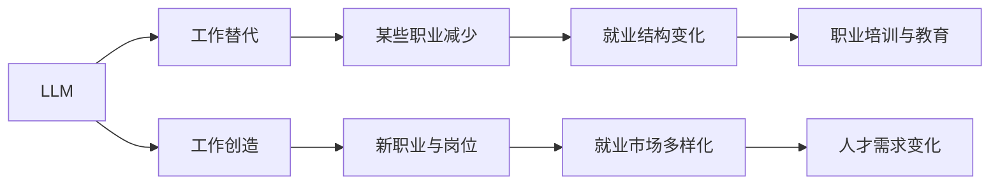

                 

# LLM 对就业的影响：工作替代与创造

> 关键词：

## 1. 背景介绍

在人工智能（AI）飞速发展的今天，大规模语言模型（LLM）以其强大的自然语言处理能力，正逐步渗透到各行各业，对就业市场产生了深远的影响。LLM能够自动完成文本生成、机器翻译、文本摘要等任务，提升了企业的自动化水平和效率，但也带来了一些挑战和机遇。本文将探讨LLM对就业市场的具体影响，分析其工作替代和创造两方面的作用，以及如何利用LLM推动行业变革和创新。

## 2. 核心概念与联系

### 2.1 核心概念概述

1. **大规模语言模型（LLM）**：指通过自监督学习或监督学习在大规模语料库上训练而成的语言模型，如GPT-3、BERT等。这些模型能够理解自然语言的含义，进行复杂的文本处理。
2. **工作替代**：指AI技术取代传统劳动力，减少某些职位的就业机会。例如，LLM在文档处理、数据输入等工作上表现出色，可能减少这些岗位的需求。
3. **工作创造**：指AI技术创造了新的就业机会，如AI研究、模型维护、人机交互等岗位。LLM在自然语言生成、内容创作等方面具有独特优势，推动了相关行业的兴起。

### 2.2 核心概念原理和架构的 Mermaid 流程图



## 3. 核心算法原理 & 具体操作步骤

### 3.1 算法原理概述

LLM的工作替代与创造作用基于以下算法原理：

1. **自监督学习**：LLM在无监督数据上预训练，通过大规模语料库自学习语言的表征。这一过程类似于人类的语言习得过程，使得模型能够理解语言的结构和含义。
2. **迁移学习**：LLM在特定任务上微调，将预训练知识迁移到特定领域，实现高性能的专用模型。
3. **任务适配层**：在微调时，LLM添加特定任务的目标函数，如分类、生成等，使得模型能够在特定任务上取得最优性能。

### 3.2 算法步骤详解

1. **数据准备**：收集任务相关的语料库，分为训练集、验证集和测试集。
2. **预训练**：在大型无标签数据上训练模型，学习语言的通用知识。
3. **微调**：在特定任务上微调模型，调整顶层结构以适应任务需求。
4. **评估与优化**：在验证集上评估模型性能，调整参数以提升模型精度。
5. **应用与监控**：将模型部署到实际应用中，持续监控性能与安全性。

### 3.3 算法优缺点

**优点**：
- 提升效率：自动完成复杂文本处理任务，减少人工劳动。
- 减少错误：减少人为输入的误差，提升数据处理的准确性。
- 快速适应：通过微调，模型可以快速适应新任务和新需求。

**缺点**：
- 就业影响：替代一些重复性、低技能的工作，导致部分员工失业。
- 技术门槛：需要掌握AI技术，增加了就业门槛。
- 道德风险：不当使用可能导致歧视、隐私侵犯等问题。

### 3.4 算法应用领域

LLM在以下领域的应用，展示了其工作替代与创造的潜力：

1. **客户服务**：自动处理客户查询，提高服务效率。
2. **内容创作**：自动生成新闻、报告、广告等文本。
3. **数据分析**：自动分析大量文本数据，提取有用信息。
4. **翻译与本地化**：自动翻译文本，支持多语言服务。
5. **教育与培训**：智能辅导与个性化学习。

## 4. 数学模型和公式 & 详细讲解 & 举例说明

### 4.1 数学模型构建

假设有任务 $T$，其标注数据集为 $D=\{(x_i, y_i)\}_{i=1}^N$，其中 $x_i$ 为输入文本，$y_i$ 为标签。设预训练模型为 $M_{\theta}$，在任务 $T$ 上的微调模型为 $M_{\hat{\theta}}$。

### 4.2 公式推导过程

设任务 $T$ 上的损失函数为 $\mathcal{L}(M_{\hat{\theta}}, D)$，通过梯度下降法优化模型参数 $\hat{\theta}$，使得最小化损失函数：

$$
\hat{\theta} = \mathop{\arg\min}_{\theta} \mathcal{L}(M_{\theta}, D)
$$

其中 $\nabla_{\theta}\mathcal{L}(M_{\theta}, D)$ 为损失函数对模型参数的梯度。

### 4.3 案例分析与讲解

以客户服务场景为例，客户咨询输入 $x_i$，模型预测输出 $y_i$，目标函数为交叉熵损失：

$$
\mathcal{L}(M_{\hat{\theta}}, D) = -\frac{1}{N}\sum_{i=1}^N \log M_{\hat{\theta}}(x_i)
$$

模型通过微调，学习了从输入 $x_i$ 到输出 $y_i$ 的映射关系，实现了自动化客户服务。

## 5. 项目实践：代码实例和详细解释说明

### 5.1 开发环境搭建

1. 安装 Python 3.8 及以上版本。
2. 安装 TensorFlow 2.x 或 PyTorch。
3. 安装必要的 NLP 库，如 NLTK、spaCy 等。
4. 使用 Jupyter Notebook 或 PyCharm 进行开发。

### 5.2 源代码详细实现

以 PyTorch 为例，实现一个简单的文本分类任务：

```python
import torch
import torch.nn as nn
import torch.optim as optim
from torch.utils.data import DataLoader, Dataset

# 定义数据集
class TextDataset(Dataset):
    def __init__(self, data):
        self.data = data

    def __len__(self):
        return len(self.data)

    def __getitem__(self, idx):
        return self.data[idx]

# 定义模型
class TextClassifier(nn.Module):
    def __init__(self, input_size, hidden_size, output_size):
        super(TextClassifier, self).__init__()
        self.embedding = nn.Embedding(input_size, hidden_size)
        self.fc = nn.Linear(hidden_size, output_size)
        self.softmax = nn.Softmax(dim=1)

    def forward(self, x):
        embedded = self.embedding(x)
        classified = self.fc(embedded)
        return self.softmax(classified)

# 定义训练函数
def train(model, data_loader, optimizer, criterion, num_epochs):
    model.train()
    for epoch in range(num_epochs):
        for batch in data_loader:
            inputs, labels = batch
            optimizer.zero_grad()
            outputs = model(inputs)
            loss = criterion(outputs, labels)
            loss.backward()
            optimizer.step()

# 训练模型
data = ...
model = TextClassifier(input_size, hidden_size, output_size)
optimizer = optim.Adam(model.parameters())
criterion = nn.CrossEntropyLoss()
train(model, data_loader, optimizer, criterion, num_epochs)
```

### 5.3 代码解读与分析

上述代码实现了基本的文本分类任务，包括定义数据集、模型、训练函数等。使用 PyTorch 框架，能够快速搭建模型并进行训练。

### 5.4 运行结果展示

训练结束后，可以输出模型在验证集上的准确率：

```python
model.eval()
with torch.no_grad():
    accuracy = 0
    for batch in data_loader:
        inputs, labels = batch
        outputs = model(inputs)
        accuracy += (outputs.argmax(dim=1) == labels).sum().item() / len(labels)
    print(f"Validation accuracy: {accuracy / len(data_loader)}")
```

## 6. 实际应用场景

### 6.1 智能客服系统

智能客服系统通过 LLM 处理客户查询，自动生成回复。这一过程减少了客服人员的工作量，提高了客户满意度。但同时，部分客服岗位可能被替代。

### 6.2 内容创作平台

LLM 在新闻、博客、广告等内容的自动生成上表现出色，推动了内容创作平台的兴起。然而，内容审核、编辑等工作仍需人工完成，增加了就业机会。

### 6.3 数据处理与分析

LLM 自动处理大量文本数据，提取有用信息，加速了数据驱动决策过程。在金融、医疗、教育等领域，数据处理与分析岗位需求增加。

### 6.4 未来应用展望

未来，LLM 在更多领域的应用将带来新的就业机会。例如，智能制造、智慧城市、个性化推荐等方向。但同时也需关注其对传统职业的替代影响。

## 7. 工具和资源推荐

### 7.1 学习资源推荐

1. 《深度学习》课程（Coursera）：涵盖深度学习基础，包括神经网络、优化算法等。
2. 《自然语言处理入门》（Stanford）：介绍自然语言处理基本概念和技术。
3. 《PyTorch 实战》（O'Reilly）：实战指南，涵盖模型构建、训练与部署等。
4. 《大规模语言模型：理论与实践》（MIT Press）：介绍大规模语言模型的构建与优化。

### 7.2 开发工具推荐

1. PyTorch：灵活的深度学习框架，易于搭建和调试模型。
2. TensorFlow：成熟的深度学习框架，支持分布式训练和生产部署。
3. spaCy：开源的自然语言处理库，提供词法分析、命名实体识别等功能。

### 7.3 相关论文推荐

1. "Attention is All You Need"（NIPS 2017）：提出Transformer模型，推动了NLP领域的发展。
2. "BERT: Pre-training of Deep Bidirectional Transformers for Language Understanding"（NeurIPS 2018）：提出BERT模型，提升了NLP任务的性能。
3. "GPT-3: Language Models are Unsupervised Multitask Learners"（AAAI 2020）：介绍GPT-3模型，展示了其强大的自然语言理解能力。

## 8. 总结：未来发展趋势与挑战

### 8.1 研究成果总结

LLM 在多个领域的应用展示了其巨大的潜力。但同时也带来了工作替代与创造的双重影响。未来需关注其对就业市场的影响，以及如何利用LLM推动行业变革。

### 8.2 未来发展趋势

1. 模型规模扩大：更大规模的模型将带来更强大的语言处理能力。
2. 应用场景扩展：LLM将在更多行业得到应用，推动新职业的产生。
3. 技术融合加速：LLM将与其他AI技术结合，实现更高效的数据处理与分析。

### 8.3 面临的挑战

1. 就业影响：部分岗位可能被替代，需关注失业问题。
2. 技术门槛：需培养更多掌握AI技术的复合型人才。
3. 伦理道德：需避免滥用LLM带来的负面影响。

### 8.4 研究展望

未来需研究LLM的伦理道德、公平性等问题，确保其应用安全、可靠。同时，需探索如何利用LLM创造更多就业机会，推动社会进步。

## 9. 附录：常见问题与解答

**Q1: LLM 如何影响就业市场？**

A: LLM 替代了某些低技能、重复性的工作，如数据输入、文档处理等。同时，也创造了新的就业机会，如AI研究、模型维护等。就业市场将向高技能、高创新方向发展。

**Q2: 如何应对 LLM 带来的工作替代？**

A: 通过职业培训和教育，提升劳动者的技能水平，使其适应新的岗位需求。同时，政府和企业应提供转岗支持，帮助员工顺利过渡。

**Q3: LLM 在医疗领域的应用前景如何？**

A: LLM 在医疗领域有广泛的应用前景，如智能诊断、疾病预测、患者沟通等。但需注意数据的隐私保护和模型的伦理审查。

**Q4: LLM 是否会导致知识鸿沟加剧？**

A: LLM 对知识的要求更高，可能会加剧知识鸿沟。需通过教育和公共服务，缩小不同群体间的知识差距。

**Q5: LLM 在教育中的应用是否会减少教师的需求？**

A: LLM 可以辅助教师进行个性化教学和内容创作，提高教学质量。但教师的角色仍然不可或缺，需提升教师的AI素养。

---

作者：禅与计算机程序设计艺术 / Zen and the Art of Computer Programming

