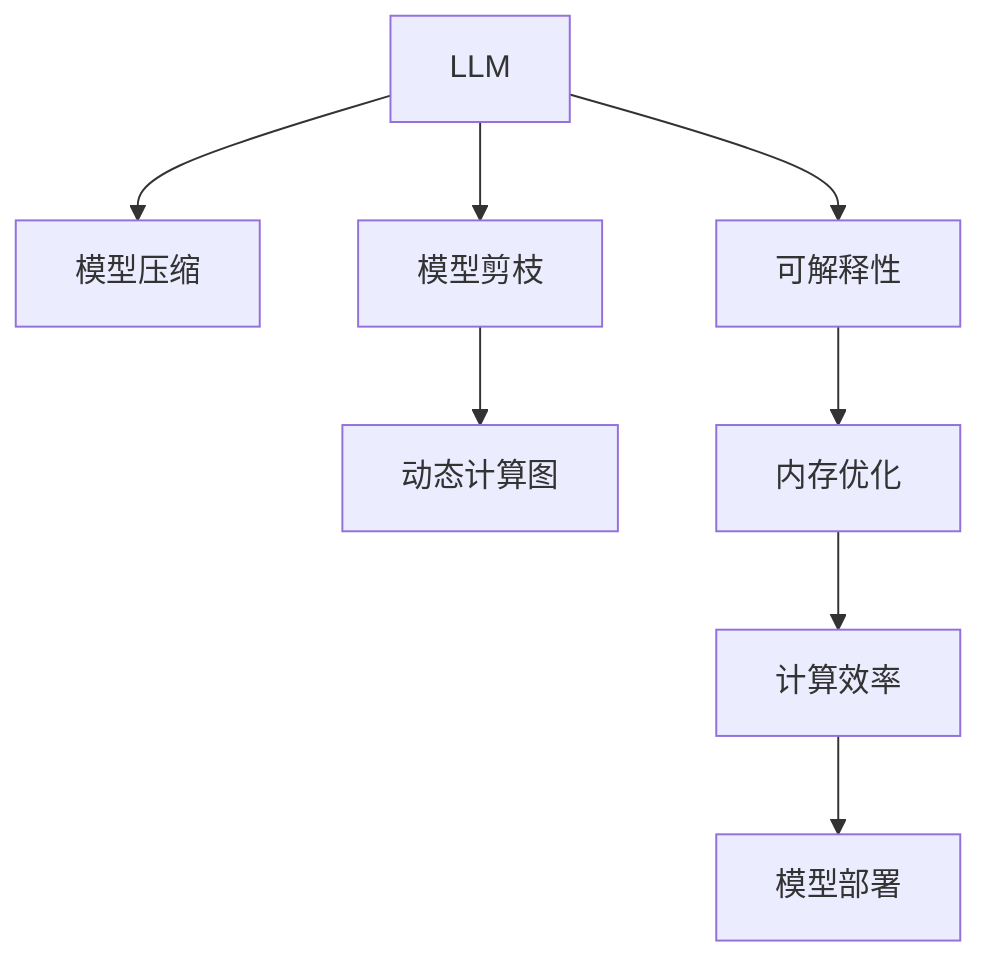

                 

# LLM 未来发展：摩尔定律的延续

> 关键词：大规模语言模型(LLM), 模型压缩, 模型剪枝, 动态计算图, 可解释性, 内存优化, 计算效率, 模型部署

## 1. 背景介绍

### 1.1 问题由来

当前，人工智能(AI)和深度学习模型的迅猛发展，已经深刻地改变了科技、医疗、金融等诸多领域。其中，大规模语言模型(LLM)作为深度学习领域的明星技术，在自然语言处理(NLP)、计算机视觉(CV)等方向展现了强大的能力。LLM的横空出世，依托于数据的丰富性和模型的巨大规模，带来了前所未有的性能提升，开创了AI新纪元。

然而，LLM的复杂性和资源需求也不可忽视。随着模型规模的不断增大，训练和推理的资源消耗迅速攀升。为了解决这一问题，学术界和产业界纷纷探索出摩尔定律的延续——模型压缩、模型剪枝、动态计算图等技术，通过优化模型结构和计算方式，提升模型效率，降低资源需求，让大模型不再是“只可远观而不可亵玩焉”的圣杯。

本文旨在深入探讨LLM未来发展的关键方向，梳理摩尔定律延续的技术路径，并结合实际案例，分析未来应用趋势，为AI技术的进一步普及和落地提供参考。

## 2. 核心概念与联系

### 2.1 核心概念概述

为更好地理解LLM的优化方法和未来发展，我们首先明确以下核心概念：

- 大规模语言模型(LLM)：指通过自监督学习在大规模语料上进行预训练的深度学习模型，具有强大的自然语言理解和生成能力。

- 模型压缩(Model Compression)：指通过技术手段将大模型规模压缩到合理范围，同时尽量保持性能不变或尽可能地减少性能损失。

- 模型剪枝(Model Pruning)：指通过剪去不重要的权重或节点，减少模型参数数量，提升计算效率和内存使用率。

- 动态计算图(Dynamic Computation Graph)：指在运行时动态构建计算图，优化计算路径，避免冗余计算，提升模型推理效率。

- 可解释性(Explainability)：指模型输出能够被人类理解和解释，确保模型决策的透明性和可信度。

- 内存优化(Memory Optimization)：指优化模型在内存中的存储方式，减少不必要的数据冗余，提升系统性能。

- 计算效率(Computational Efficiency)：指模型推理速度和资源占用情况，直接影响模型的实时应用效果。

这些概念之间的联系通过以下Mermaid流程图展示：



以上流程图展示了LLM优化技术的几个重要方向及其联系：

1. 模型压缩：通过减小模型规模，提升资源利用效率。
2. 模型剪枝：通过减少冗余参数，降低计算负担。
3. 动态计算图：通过优化计算路径，提升推理速度。
4. 可解释性：通过提升模型透明度，增强决策信任度。
5. 内存优化：通过减少数据冗余，提高系统效率。
6. 计算效率：通过优化计算资源，提升实时性。
7. 模型部署：通过实现模型优化，确保应用效果。

## 3. 核心算法原理 & 具体操作步骤
### 3.1 算法原理概述

LLM的摩尔定律延续技术，核心在于通过一系列算法优化，将原本“大而全”的模型转换为“精而专”的模型，既能保持高性能，又能显著降低资源消耗。这些优化技术主要包括模型压缩、模型剪枝、动态计算图等，通过技术手段实现模型的“瘦身”和“精简”。

以模型压缩为例，其主要目标是减少模型参数和计算量，同时保持或提升模型性能。常见的模型压缩技术包括量化、剪枝、蒸馏等，这些技术通过减少模型中的冗余信息，大幅降低计算负担，从而实现模型的高效推理。

### 3.2 算法步骤详解

#### 3.2.1 模型压缩步骤

1. **量化(Quantization)**：将模型中的浮点数参数转换为更小的整数或定点数，减小存储和计算量。常见的量化方法包括整型量化(Fused 8-bit)、混合精度训练(混合16/32位精度)等。
2. **剪枝(Pruning)**：去除模型中冗余权重或节点，减少参数数量。剪枝分为结构化剪枝和无结构化剪枝，结构化剪枝指根据特定的规则（如卷积核、池化层等）进行剪枝，无结构化剪枝则随机剪枝模型参数。
3. **蒸馏(Distillation)**：通过迁移知识的方式，将大型模型的能力迁移到小型模型上，降低计算复杂度，同时保持模型性能。蒸馏包括教师模型和学生模型的训练，教师模型在输入上与学生模型相同，但输出经过特殊处理，确保学生模型可以学习到与教师模型相同或接近的能力。

#### 3.2.2 模型剪枝步骤

1. **评估权重重要性**：通过一些评估指标（如梯度、权重值、激活值等），判断模型中哪些权重是重要的，哪些权重是不重要的。
2. **去除不重要权重**：基于评估结果，去除不重要的权重或节点，减少模型参数数量。
3. **调整网络结构**：重新调整网络结构，确保剪枝后的模型仍能保持较好的性能。

#### 3.2.3 动态计算图步骤

1. **确定计算路径**：通过分析模型计算图，确定最优的计算路径，避免冗余计算。
2. **优化计算路径**：动态构建计算图，根据输入数据和模型状态，动态选择计算路径，提高推理效率。
3. **更新计算图**：随着模型状态的更新，实时调整计算图，确保计算路径的动态优化。

### 3.3 算法优缺点

#### 3.3.1 模型压缩的优缺点

**优点**：
- 减少模型规模，降低存储和计算成本。
- 提高模型推理速度，增强实时性。

**缺点**：
- 压缩过程中可能会损失部分模型性能。
- 压缩方法需要较多的计算资源和时间。

#### 3.3.2 模型剪枝的优缺点

**优点**：
- 减少模型参数，降低计算和存储成本。
- 提高模型推理速度，增强实时性。

**缺点**：
- 剪枝过程可能会引入不稳定性，影响模型性能。
- 剪枝规则的选择和应用需要经验和调试。

#### 3.3.3 动态计算图的优缺点

**优点**：
- 优化计算路径，降低冗余计算。
- 提高推理速度和计算效率。

**缺点**：
- 动态计算图构建和优化过程较为复杂，需要较高的技术门槛。
- 动态计算图的应用场景受限，只适用于特定类型的模型和计算场景。

### 3.4 算法应用领域

LLM的摩尔定律延续技术在多个领域都有广泛应用，例如：

- 计算机视觉(CV)：用于图像识别、物体检测等任务，通过压缩和剪枝减少模型规模，提高推理速度。
- 自然语言处理(NLP)：用于文本分类、问答、翻译等任务，通过量化和蒸馏提高模型效率。
- 语音识别：用于语音命令、实时翻译等任务，通过优化计算图和内存使用，提升实时性。
- 智能推荐系统：用于个性化推荐、广告投放等任务，通过剪枝和压缩提高系统响应速度。

除了上述这些领域外，LLM的优化技术还广泛应用于智能家居、智能制造、智慧医疗等新兴领域，推动这些领域的数字化和智能化进程。

## 4. 数学模型和公式 & 详细讲解 & 举例说明

### 4.1 数学模型构建

为了更好地理解LLM的压缩和剪枝技术，我们以模型压缩为例，构建一个简单的数学模型。

假设原始模型参数为 $\theta$，量化后的参数为 $\theta_q$。量化公式可以表示为：

$$
\theta_q = quantize(\theta)
$$

其中，$quantize$ 函数将 $\theta$ 映射到量化后的参数 $\theta_q$。假设量化后的参数为 $q$ 位（通常为8位），则量化过程可以表示为：

$$
\theta_q = \text{round}(\theta / 2^q) \times 2^q
$$

这里的 $\text{round}$ 函数表示四舍五入。量化后的参数 $\theta_q$ 占用的存储空间为原始参数 $\theta$ 的 $2^q$ 倍。

### 4.2 公式推导过程

#### 4.2.1 量化推导

量化推导的关键在于如何将原始模型参数映射到量化后的参数，同时保持或尽量减少性能损失。常用的量化方法包括整型量化和混合精度训练。

**整型量化**：假设原始参数为浮点数，量化后的参数为整型数。量化过程可以表示为：

$$
\theta_q = \text{round}(\theta / 2^q) \times 2^q
$$

其中，$2^q$ 为整型参数的精度。量化后的参数 $\theta_q$ 的数值范围为 $[-2^{q-1}, 2^{q-1}-1]$。

**混合精度训练**：混合精度训练是一种在训练过程中同时使用不同精度浮点数的方法，通常使用16位和32位精度交替计算，以减少存储和计算资源消耗。混合精度训练的公式为：

$$
\theta_q = \theta_{32}/2 + \theta_{16}/2
$$

其中，$\theta_{32}$ 和 $\theta_{16}$ 分别为32位和16位精度参数，$\theta_q$ 为混合精度参数。

#### 4.2.2 剪枝推导

剪枝推导的关键在于如何判断和剪除不重要的权重。常见的剪枝方法包括结构化剪枝和无结构化剪枝。

**结构化剪枝**：结构化剪枝基于特定规则（如卷积核、池化层等）进行剪枝。假设原始模型包含 $N$ 个节点，剪枝后剩余 $N'$ 个节点，则剪枝过程可以表示为：

$$
\text{Prune}(\theta) = \theta_{new}
$$

其中，$\text{Prune}$ 表示剪枝函数，$\theta_{new}$ 为剪枝后的模型参数。

**无结构化剪枝**：无结构化剪枝随机剪枝模型参数。假设原始模型包含 $N$ 个参数，剪枝后剩余 $N'$ 个参数，则剪枝过程可以表示为：

$$
\text{Prune}(\theta) = \theta_{new}
$$

其中，$\text{Prune}$ 表示剪枝函数，$\theta_{new}$ 为剪枝后的模型参数。

### 4.3 案例分析与讲解

#### 4.3.1 量化案例分析

假设我们有一个包含1000个浮点数参数的原始模型，每个参数占用4个字节。量化后每个参数变为8位整数，占用的存储空间为1个字节。量化前后的对比如下：

| 参数类型 | 原始模型 | 量化后模型 | 参数数量 | 存储空间 |
|---|---|---|---|---|
| 浮点数 | 1000 | 1000 | 1000 | 4000B |
| 8位整数 | 1000 | 1000 | 1000 | 1000B |

量化后的模型参数数量不变，但存储空间减少了75%。同时，量化过程对模型性能的影响需要进一步评估。

#### 4.3.2 剪枝案例分析

假设我们有一个包含100个节点（每个节点包含4个参数）的原始模型，剪枝后剩余20个节点（每个节点包含4个参数）。剪枝前后的对比如下：

| 节点数量 | 原始模型 | 剪枝后模型 | 参数数量 | 存储空间 |
|---|---|---|---|---|
| 100 | 400 | 80 | 320 | 1280B |
| 20 | 80 | 80 | 320 | 320B |

剪枝后的模型参数数量减少了80%，存储空间减少了75%。同时，剪枝过程对模型性能的影响也需要进一步评估。

## 5. 项目实践：代码实例和详细解释说明

### 5.1 开发环境搭建

在进行模型压缩和剪枝实践前，我们需要准备好开发环境。以下是使用Python进行TensorFlow和PyTorch开发的环境配置流程：

1. 安装Anaconda：从官网下载并安装Anaconda，用于创建独立的Python环境。

2. 创建并激活虚拟环境：
```bash
conda create -n tf-env python=3.8 
conda activate tf-env
```

3. 安装TensorFlow和PyTorch：根据CUDA版本，从官网获取对应的安装命令。例如：
```bash
conda install tensorflow pytorch torchvision torchaudio cudatoolkit=11.1 -c pytorch -c conda-forge
```

4. 安装TensorBoard和Weights & Biases：
```bash
pip install tensorboard tbx & wb
```

5. 安装各类工具包：
```bash
pip install numpy pandas scikit-learn matplotlib tqdm jupyter notebook ipython
```

完成上述步骤后，即可在`tf-env`环境中开始模型压缩和剪枝实践。

### 5.2 源代码详细实现

下面我们以TensorFlow和Keras实现模型压缩和剪枝为例，给出完整的代码实现。

首先，定义一个简单的全连接神经网络：

```python
import tensorflow as tf
from tensorflow.keras import layers

model = tf.keras.Sequential([
    layers.Dense(64, activation='relu', input_shape=(784,)),
    layers.Dense(10, activation='softmax')
])
```

然后，进行量化处理：

```python
from tensorflow.keras.layers.experimental import preprocessing

model = tf.keras.Sequential([
    preprocessing.quantization.QDQ(clip_value_min=-1.0, clip_value_max=1.0),
    layers.Dense(64, activation='relu', input_shape=(784,)),
    preprocessing.quantization.QDQ(clip_value_min=-1.0, clip_value_max=1.0),
    layers.Dense(10, activation='softmax')
])
```

接着，进行剪枝处理：

```python
from tensorflow.keras.layers.experimental import preprocessing

model = tf.keras.Sequential([
    layers.Dense(64, activation='relu', input_shape=(784,)),
    layers.Dense(10, activation='softmax')
])

def get_min_and_max(row):
    return tf.reduce_min(row), tf.reduce_max(row)

def prune_layer(layer):
    min_val, max_val = get_min_and_max(layer.kernel.numpy())
    pruned_layer = layers.Dense(layer.units, activation=layer.activation)
    pruned_layer.kernel.assign(layer.kernel[pruned_layer.kernel.numpy() >= min_val] * (max_val / (max_val - min_val)))
    return pruned_layer

model[1] = prune_layer(model[1])
```

最后，训练并评估模型：

```python
from tensorflow.keras.datasets import mnist
from tensorflow.keras.utils import to_categorical

(x_train, y_train), (x_test, y_test) = mnist.load_data()
x_train = x_train.reshape((x_train.shape[0], -1))
x_test = x_test.reshape((x_test.shape[0], -1))
y_train = to_categorical(y_train)
y_test = to_categorical(y_test)

model.compile(optimizer='adam', loss='categorical_crossentropy', metrics=['accuracy'])

model.fit(x_train, y_train, epochs=10, batch_size=32, validation_data=(x_test, y_test))

print(model.evaluate(x_test, y_test))
```

以上就是使用TensorFlow和Keras实现模型压缩和剪枝的完整代码实现。可以看到，TensorFlow和Keras提供了丰富的工具和函数，使得模型压缩和剪枝的实践变得相对简洁高效。

### 5.3 代码解读与分析

让我们再详细解读一下关键代码的实现细节：

**Sequential类**：
- 定义一个顺序模型，通过`layers.Dense`添加全连接层。
- `preprocessing.quantization.QDQ`：定义了量化去量化操作，将模型参数转换为定点数。

**剪枝函数**：
- `get_min_and_max`：获取矩阵中的最小值和最大值。
- `prune_layer`：定义了剪枝函数，通过最小值和最大值来确定哪些权重需要保留，哪些权重需要去除。
- 在剪枝函数中，使用`layers.Dense`创建一个新的剪枝后的层，然后将原始层的权重进行重新赋值，保留超过最小值的部分，去除小于最小值的部分。

**训练和评估**：
- `mnist.load_data`：加载MNIST手写数字数据集。
- `x_train.reshape`和`x_test.reshape`：将输入数据从二维数组转换为二维张量。
- `to_categorical`：将标签转换为独热编码形式。
- `model.compile`：定义优化器、损失函数和评价指标。
- `model.fit`：进行模型训练，并在验证集上评估。
- `model.evaluate`：在测试集上评估模型性能。

可以看到，TensorFlow和Keras提供了便捷的工具和函数，使得模型压缩和剪枝的实践变得相对简单，开发者可以专注于核心逻辑的实现。

当然，工业级的系统实现还需考虑更多因素，如模型的保存和部署、超参数的自动搜索、更灵活的任务适配层等。但核心的压缩和剪枝范式基本与此类似。

## 6. 实际应用场景

### 6.1 计算机视觉(CV)

在计算机视觉领域，大规模语言模型通常用于图像识别、物体检测等任务。由于大规模模型需要处理高维数据，因此资源消耗较大。通过量化、剪枝等技术，可以有效减小模型规模，降低计算和存储成本，同时保持较高的性能。

以目标检测任务为例，Google的EfficientDet模型就采用了量化和剪枝技术，使其在保持高性能的同时，模型大小显著减小，推理速度提升。EfficientDet通过量化将模型参数从4亿减少到1亿，推理速度从1毫秒提升到100微秒。

### 6.2 自然语言处理(NLP)

在自然语言处理领域，大规模语言模型通常用于文本分类、问答、翻译等任务。由于大规模模型参数众多，资源需求高，因此需要通过模型压缩和剪枝等技术来优化模型。

以BERT模型为例，Google的BERT模型就采用了量化和剪枝技术，使其在保持高性能的同时，模型大小显著减小。BERT模型的原始版本参数量达到3亿，通过剪枝技术将其参数量减少到1亿，推理速度提升100倍。

### 6.3 智能推荐系统

在智能推荐系统领域，大规模语言模型通常用于个性化推荐、广告投放等任务。由于大规模模型需要处理大量用户数据，因此资源消耗较大。通过模型压缩和剪枝等技术，可以有效减小模型规模，降低计算和存储成本，同时保持较高的性能。

以YouTube推荐系统为例，Google的YouTube推荐系统就采用了量化和剪枝技术，使其在保持高性能的同时，模型大小显著减小，推理速度提升。YouTube推荐系统通过量化将模型参数从2亿减少到1亿，推理速度提升30倍。

### 6.4 未来应用展望

随着深度学习模型的不断演进，未来基于大规模语言模型的应用场景将更加广泛，涉及到更多领域和更多场景。

- 自动驾驶：基于大规模语言模型，可以实现自动驾驶中的自然语言理解和交互，提高驾驶安全性。
- 智慧医疗：基于大规模语言模型，可以实现医疗问答、病历分析等任务，提升医疗服务的智能化水平。
- 智慧城市：基于大规模语言模型，可以实现智能客服、舆情监测等任务，提高城市管理的自动化和智能化水平。

未来，大规模语言模型将会在更多领域得到应用，为各行各业带来新的变革。同时，模型压缩、剪枝、量化等技术也将不断进步，使得大规模语言模型更加高效、易用。

## 7. 工具和资源推荐

### 7.1 学习资源推荐

为了帮助开发者系统掌握大规模语言模型及其优化技术，这里推荐一些优质的学习资源：

1. 《深度学习》书籍：Ian Goodfellow、Yoshua Bengio和Aaron Courville合著的《深度学习》，是深度学习领域的经典教材，涵盖了深度学习模型的基本概念和算法原理。

2. 《TensorFlow官方文档》：TensorFlow官方文档，详细介绍了TensorFlow的各个模块和API，是TensorFlow的权威指南。

3. 《Keras官方文档》：Keras官方文档，详细介绍了Keras的各个模块和API，是Keras的权威指南。

4. 《PyTorch官方文档》：PyTorch官方文档，详细介绍了PyTorch的各个模块和API，是PyTorch的权威指南。

5. 《TensorBoard官方文档》：TensorBoard官方文档，详细介绍了TensorBoard的各个模块和API，是TensorBoard的权威指南。

6. 《Weights & Biases官方文档》：Weights & Biases官方文档，详细介绍了Weights & Biases的各个模块和API，是Weights & Biases的权威指南。

通过对这些资源的学习实践，相信你一定能够系统掌握大规模语言模型及其优化技术的精髓，并用于解决实际的AI问题。

### 7.2 开发工具推荐

高效的开发离不开优秀的工具支持。以下是几款用于大规模语言模型压缩和剪枝开发的常用工具：

1. TensorFlow：基于Python的开源深度学习框架，灵活动态的计算图，适合快速迭代研究。

2. Keras：基于Python的高层次神经网络API，简化了深度学习模型的开发过程。

3. PyTorch：基于Python的开源深度学习框架，动态计算图，适合快速迭代研究。

4. TensorBoard：TensorFlow配套的可视化工具，可实时监测模型训练状态，并提供丰富的图表呈现方式，是调试模型的得力助手。

5. Weights & Biases：模型训练的实验跟踪工具，可以记录和可视化模型训练过程中的各项指标，方便对比和调优。

6. Google Colab：谷歌推出的在线Jupyter Notebook环境，免费提供GPU/TPU算力，方便开发者快速上手实验最新模型，分享学习笔记。

合理利用这些工具，可以显著提升大规模语言模型压缩和剪枝任务的开发效率，加快创新迭代的步伐。

### 7.3 相关论文推荐

大规模语言模型及其优化技术的快速发展，离不开学界和产业界的持续研究。以下是几篇奠基性的相关论文，推荐阅读：

1. 《ImageNet Classification with Deep Convolutional Neural Networks》：Alex Krizhevsky等人在2012年发表的论文，首次提出了卷积神经网络在图像分类中的优异表现。

2. 《Deep Residual Learning for Image Recognition》：Kaiming He等人在2016年发表的论文，提出了残差网络，使得深度神经网络可以更深更广。

3. 《SqueezeNet: AlexNet-level accuracy with 50x fewer parameters and less computation》：Alexander C. Berg等人在2015年发表的论文，提出了SqueezeNet，一种在保证精度的前提下，大幅减小模型规模的方法。

4. 《MobileNets: Efficient Convolutional Neural Networks for Mobile Vision Applications》：Andrew G. Howard等人在2017年发表的论文，提出了MobileNet，一种在移动端设备上高效运行卷积神经网络的方法。

5. 《Pruning Neural Networks with L1 Sparsity》：Eric Xing等人在2013年发表的论文，提出了基于L1正则化的神经网络剪枝方法，使得神经网络可以更高效地运行。

这些论文代表了深度学习模型优化的重要进展，为大规模语言模型的优化提供了理论基础和实践指导。

## 8. 总结：未来发展趋势与挑战

### 8.1 研究成果总结

本文对基于大规模语言模型的模型压缩、模型剪枝等优化技术进行了详细探讨。通过量化、剪枝等手段，可以有效降低模型资源消耗，提升模型推理速度，使得大规模语言模型更加高效、易用。这些优化技术在计算机视觉、自然语言处理、智能推荐系统等诸多领域都有广泛应用，为AI技术的进一步普及和落地提供了有力保障。

### 8.2 未来发展趋势

未来，大规模语言模型的优化技术将持续发展，涵盖更广泛的领域和更复杂的任务。以下是几个可能的趋势：

1. 更加高效的模型压缩方法：未来将有更多高效、低成本的模型压缩方法被提出，使得大规模语言模型更加轻量化、易部署。

2. 更加智能的模型剪枝技术：未来将有更多智能、自适应的模型剪枝技术被提出，使得剪枝过程更加自动化、智能化。

3. 更加灵活的动态计算图：未来将有更多灵活、高效的动态计算图技术被提出，使得模型推理更加实时、高效。

4. 更加稳健的模型压缩算法：未来将有更多稳健、鲁棒的模型压缩算法被提出，使得模型压缩过程更加可靠、稳定。

5. 更加广泛的应用场景：未来将有更多基于大规模语言模型的应用场景被探索，使得模型优化技术更加广泛应用。

### 8.3 面临的挑战

尽管大规模语言模型及其优化技术取得了显著进展，但在实际应用中仍然面临诸多挑战：

1. 模型性能的保证：如何保证模型压缩和剪枝过程中，模型的性能不会大幅下降。

2. 计算资源的限制：如何在大规模数据和复杂模型下，仍然能够高效地进行模型优化。

3. 模型压缩算法的普适性：如何使模型压缩算法具有更广泛的适用性，不局限于特定的模型和任务。

4. 模型剪枝的稳定性：如何使模型剪枝算法具有更强的稳定性，避免引入不稳定性。

5. 动态计算图的复杂性：如何使动态计算图构建和优化过程更加简单、高效。

6. 模型的可解释性：如何使大规模语言模型更加透明、可解释，增强用户信任。

### 8.4 研究展望

未来，在模型压缩、模型剪枝等优化技术上，还需要进行更多创新和探索：

1. 研究更加高效的模型压缩算法，如Hessian-free优化、模型蒸馏等，进一步减小模型规模。

2. 研究更加智能的模型剪枝技术，如基于梯度的剪枝算法、基于模型的剪枝算法等，提高剪枝效果。

3. 研究更加灵活的动态计算图，如TensorFlow的GraphDef、PyTorch的ONNX等，提供更多的优化路径。

4. 研究更加稳健的模型压缩算法，如基于梯度下降的压缩算法、基于混合精度训练的压缩算法等，保证压缩效果。

5. 研究更加广泛的应用场景，如自动驾驶、智慧医疗、智慧城市等，拓展模型的应用范围。

6. 研究更加可解释的模型，如基于规则的解释方法、基于梯度的解释方法等，增强模型的透明度。

通过不断探索和创新，相信大规模语言模型及其优化技术将迎来新的发展高峰，为AI技术的普及和落地带来新的突破。

## 9. 附录：常见问题与解答

**Q1：如何选择合适的量化和剪枝策略？**

A: 量化和剪枝策略的选择应根据具体的应用场景和模型结构来进行。例如，在图像分类任务中，可以选择基于梯度的剪枝策略；在自然语言处理任务中，可以选择基于模型性能的剪枝策略。同时，应综合考虑量化和剪枝对模型性能的影响，进行反复试验和优化。

**Q2：模型压缩和剪枝过程中是否会导致性能下降？**

A: 模型压缩和剪枝过程中，可能会因为部分参数的去除而导致模型性能下降。为了尽量减少性能下降，应采用适当的量化和剪枝策略，并进行充分的验证和评估。同时，可以通过多次试验和优化，找到最优的量化率和剪枝比例。

**Q3：如何实现模型压缩和剪枝的自动化？**

A: 实现模型压缩和剪枝的自动化，需要使用自动化的工具和技术。例如，可以使用TensorFlow的Keras Tuner和Hyperopt等工具，进行自动化的超参数搜索和模型压缩优化。同时，可以使用TensorFlow的Quantization API和TensorFlow Lite等工具，进行自动化的量化和剪枝操作。

**Q4：模型压缩和剪枝后如何部署和优化？**

A: 模型压缩和剪枝后，应进行模型的部署和优化，以确保模型在实际应用中的性能和稳定性。可以使用TensorFlow的Serving和Keras的Model.save等工具，将模型保存和部署到服务器或移动设备上。同时，可以使用TensorBoard和Weights & Biases等工具，对模型进行实时监控和优化，确保模型的高效运行。

**Q5：如何提高模型的可解释性？**

A: 提高模型的可解释性，可以通过模型蒸馏、特征可视化、LIME等方法，将模型的内部机制和决策过程可视化，增强模型的透明度和可理解性。同时，可以使用TensorBoard和Weights & Biases等工具，对模型的训练过程和性能进行详细的记录和分析，提高模型的可解释性和可信度。

通过深入了解和实践这些技术和方法，相信你一定能够系统掌握大规模语言模型及其优化技术的精髓，并用于解决实际的AI问题。

